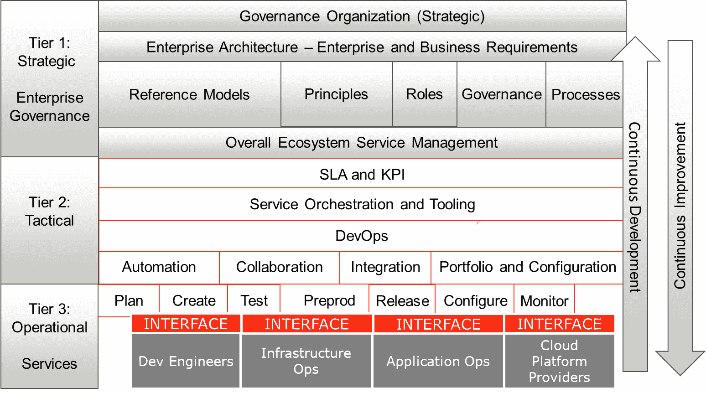

# 第一章：为企业 DevOps 定义参考架构

本章是关于**企业**的**DevOps 架构**的介绍。首先，我们将关注企业的业务。业务制定其目标，并据此定义支持这些业务目标的 IT 交付标准。因此，DevOps 架构必须与企业架构对齐。在本章中，我们将学习如何设置参考架构，并在使用**VOICE 模型**的过程中设计不同的 DevOps 组件。接下来，我们将学习如何在 DevOps 模型中处理服务级别和关键绩效指标。

在本章结束时，你将清楚地了解如何开始使用架构并定义 DevOps 策略。在本章中，你将学到一个重要的课程：当组织外包了大量 IT 交付工作时，在企业中建立 DevOps 变得更加复杂。在本章中，你将学到如何在拥有外包模型的企业中引入 DevOps。

我们将覆盖以下主要内容：

+   在 IT 交付中引入 DevOps

+   创建参考架构

+   引入 DevOps 组件

+   理解 DevOps 中的 SLA 和 KPI

+   使用 VOICE 模型

# 在 IT 交付中引入 DevOps

本书将重点讨论在大型企业中实施和扩展 DevOps。在深入探讨企业面临的具体挑战之前，我们需要对 DevOps 有一个共同的理解。

有些地方，企业和他们的领导者一定曾认为，将开发人员和运维人员放在同一个团队是个好主意。实际上，DevOps 就是*开发*和*运维*阶段作为一个团队共同工作，管理同一个产品。你构建它，你运营它。

在过去十年中，DevOps 在企业中获得了极大的关注和发展。但实施 DevOps 却变得相当困难。其原因在于，企业的组织结构并不适合 DevOps 的运作。从上世纪开始，大多数企业将其 IT 业务外包。一个大型企业的 IT 能力大部分仍然掌握在系统集成商和软件公司手中。当开发由软件公司完成，而运维由系统集成商外包时，DevOps 的实施变得更加困难。

DevOps 从业务出发。通过将传统上分离运作的开发和运维团队聚集到一个共同的开发和运维环境中，企业能够加快开发进程并发布新的产品和服务。这背后的原理是，开发和运维之间的交接所需的时间减少了。此外，通过消除开发和运维之间的隔阂，产品的质量会得到提升，因为 DevOps 包括了*质量保证*、*测试*和*安全性*。客户反馈会被持续评估，并纳入到产品的新版本中。

DevOps 的好处如下：

+   它将业务、开发和运营结合在一起，没有孤岛。

+   企业能够更快速地响应市场需求，因为它们在吸收持续的反馈。

+   产品不断改进和升级，加入新功能，而不是计划下一个重大版本发布。

+   通过在 DevOps 流水线中的自动化，企业可以降低开发和运营的成本，同时提高产品的质量。

它从业务开始，因此起点是**企业架构**。这是设定业务目标的地方，我们定义如何实现这些目标。IT 交付是实现这些目标的关键。在大型企业中，架构还定义了 IT 交付流程及其之间的划分。我们将在下一节中更详细地探讨 IT 交付及其流程。

## 理解企业中的 IT 交付

如我们在本节开始时提到的，大型企业通常采用基于外包的运营模式。这使得实施 DevOps 更加复杂。企业架构师需要非常清楚地了解不同流程之间的划分，以及谁负责执行这些流程。谁在什么时间、以什么方式负责什么？下一个问题是，这如何与 DevOps 对接？

首先，我们需要理解 IT 交付中的主要流程。这些流程如下：

+   **业务需求**：企业需要了解其交付的产品的需求是什么。这些需求由将使用产品的人来设定。客户会要求产品具备特定的功能和质量。架构必须聚焦于交付满足企业客户需求的最终产品。IT 交付是交付最终产品的关键部分。在 DevOps 中，指定的产品负责人确保产品满足需求。产品负责人必须与企业架构师密切合作。在*创建参考架构*一节中，我们将学习企业架构与 DevOps 是如何互补的。

+   **业务规划**：一旦需求明确，产品就需要进行范围定义。在 DevOps 中，产品团队通常从**最小可行产品**（**MVP**）开始，这是产品的第一次迭代，满足客户需求。在设计 MVP 时，流程需要能够支持该产品的开发和运营。因此，业务规划还涉及质量管理和测试，这两个是 IT 交付的关键组成部分。这需要在架构中有所体现。

+   **开发**：在 DevOps 中，产品团队将与用户故事一起工作。团队必须将产品拆解为可以定义为*交付物*的组件。为此，我们必须清晰地定义*用户故事*。一个用户故事总是遵循相同的格式：*作为[用户的功能]，我想要[用户的需求]，以便我[描述当功能实现且目标达成时，用户将获得的收益]*。任何用户故事的关键是其接受标准，或称为**完成定义**（**DoD**）。产品何时真正完成，并且满足已设定的目标？在*第三章*，*为 DevOps 质量架构*中，你将了解更多关于 DoD 的信息。

一个必须指出的重要事项是，当我们提到产品时，我们指的是基于代码的产品。

提示

IT 交付中有一个主要的趋势：一切都在向代码转移。这是*现代 DevOps 宣言*的核心原则之一：*一切皆代码*。这不仅适用于应用程序，也适用于网络设备、服务器、存储设备等基础设施组件。因此，DevOps 不仅包括应用程序的软件开发和运维，也包括基础设施的**基础设施即代码**（Infrastructure as Code）和**配置即代码**（Configuration as Code）。AWS、Azure 和 Google Cloud 等公共云在这些发展中起到了重要作用。

换句话说，团队正在开发代码：应用代码、基础设施即代码（Infrastructure as Code）以及测试代码。开发人员将专注于产品待办事项中定义的具体代码片段。整个最终产品——例如一个应用程序——已经被拆分成**产品待办事项**（**PBIs**），每个开发人员将处理一个 PBI。代码一旦准备好，就需要进行测试，不仅要单独测试，还需要作为最终产品的一个组件进行测试。因此，在开发过程中，代码需要被合并。这个合并过程是通过*拉取请求（pull request）*触发的，开发人员请求将代码合并并加入到最终产品中，从而完成用户故事。这一过程通过**管道（pipelines）**来实现。

在*第二章*，*从架构管理 DevOps*中，我们将讨论如何设置和管理管道，既包括应用开发，也包括基础设施管理。

我们可以将整个 DevOps 周期分为两个主要阶段：部署和运维，如下所示：

+   **部署**：在这个阶段，代码经过测试和验证，以确保它与用户故事一致。现在，它将被部署到生产环境。测试和发布到生产环境的过程，理想情况下，在流水线中是自动化的，集成也是如此。在代码实际推送到生产之前，它还需要与配置进行合并。想想需要应用到生产环境中运行组件的安全包。在测试和质量过程中，完整的包——*应用程序代码*和*基础设施组件*——需要被验证为“*准备好生产*”。最终结果应该是一个“上线”产品。如果在进行测试和验证时发现了错误、缺陷或违反安全规则的情况，产品将被送回开发过程的早期阶段。

+   **运维**：部署后，生产环境中的产品需要进行运维。为此，企业按照**IT 服务管理**（**ITSM**）原则进行操作。运营人员与开发人员在同一团队中，并不意味着 ITSM 过程就不再有效。一个例子是，当发生事件时，必须启动事件管理过程。在运维中，我们区分以下主要过程：

    a) 请求履行

    b) 事件管理

    c) 问题管理（事后分析）

    d) 配置管理

    e) 变更管理

但 DevOps 增加了一些内容；即**持续集成与持续交付**（**CI/CD**）：

+   **持续集成**（**CI**）：CI 基于共享仓库的原则，在该仓库中，代码经常被更新并在云环境中跨团队共享。CI 使得开发人员能够在同一时间共同工作于同一代码上。代码中的更改会直接集成，并准备好在不同的测试环境中进行全面测试。

+   **持续交付**（**CD**）：这是将软件自动传输到测试环境。CD 的终极目标是以完全自动化的方式将软件交付到生产环境。各种测试会自动执行。部署后，开发人员会立即收到有关其代码功能的反馈。

CI/CD 需要一个*反馈循环*来保持其连续性。它需要反馈已交付的产品和服务。这些反馈会回传给开发人员，进而规划新一轮的迭代，以改善产品或服务。

如果一个企业控制着整个周期，这样运作是顺利的，但大型企业已经将大量活动外包给其他公司。这种外包策略的理由通常是某个活动被认为不是核心活动，而且由专门从事该类活动的公司来执行会更具成本效益。

然而，企业在过去十年经历了巨大的变化。IT 变得越来越重要，在某些情况下，已成为核心活动。银行就是一个很好的例子。如今，银行是 IT 公司，它们的 IT 交付输出是金融产品。由于客户需求，这些产品的发布频率逐渐增加，甚至达到一天几次。其结果是 IT 交付本身发生了重大转变。

接下来的几个部分将讨论 IT 交付在采购模型中的运作方式，以及它如何影响成功实施 DevOps。

## IT 交付在采购模型中的运作

在本节中，我们将研究大型企业中的 **采购模型**。这可能相当复杂，但如果我们学会以采购 **层级** 的视角来思考，它就会变得更加具体和易于理解。这就是 **目标企业模型**，如下图所示：

图 1.1 – 目标企业模型

使用此模型，我们可以将 IT 交付拆解为三个层级：

+   **Tier 1**: **战略**层级。这是企业治理的层级。企业定义了战略业务目标，这些目标在企业架构中得以体现。总体架构原则是企业架构的产物，并推动 IT 架构的发展，包括 DevOps。在*创建参考架构*部分，我们将进一步讨论这一点。

+   **Tier 2**: **战术**层级。这是开发 IT 架构的层级，包括 DevOps。也是定义 **服务水平协议**（**SLAs**）和 **关键绩效指标**（**KPIs**）的层级，用于衡量 IT 交付的成果。你将在 *理解 DevOps 中的 SLAs 和 KPIs* 部分学到更多内容。

+   **Tier 3**: **操作**或 **服务**层级。在这个层级，架构的组件被详细定义，包括与各种供应商和服务提供商的接口。第 2 层定义的协议必须在这个层级中得到采纳，以确保所有相关的开发人员和运维人员以相同的方式工作，使用相同的工具，并对目标有共同的理解。在 *理解 DevOps 组件* 部分，我们将学到更多内容。

实际上，我们看到服务提供商也在第 2 层级上运作；例如，如果他们参与了跨多个产品的大型项目。此时，第 2 层级就成为了协调层，服务提供商负责调整较低层级中的不同工作流。关键要点是，第 1 层级始终应该是企业层级，在这里定义总体治理和架构。

在本节中，我们了解到很多企业已经将其大部分 IT 外包，这可能会使实施 DevOps 的过程变得复杂。我们了解到，整个企业的战略位于第 1 层级，即最高层级。DevOps 则位于最底层的层级，在这里项目实际上被执行。这个层级是企业与外包公司接触的地方。然而，只有在我们清晰了解架构的情况下，这种模式才能奏效。我们将在下一节讨论这一点。

# 创建参考架构

在前几节中，我们探讨了 IT 交付中的不同流程，它是如何与 DevOps 集成的，以及如何在外包模型中执行这一过程。我们已经了解到，DevOps 从一个明确的架构开始，清晰地定义了流程。

任何**DevOps 架构**都必须解决规划、开发、集成、部署和运维的问题。但我们必须记住我们为什么要做 DevOps，那就是以更快速、更敏捷的方式实现业务目标，并不断改进产品。DevOps 架构并非独立存在；它必须与企业架构相连接。

企业架构师很可能会从**开放组架构框架**（**TOGAF**）开始。TOGAF 被全球广泛接受为企业和业务架构的标准。它使用**架构开发方法**（**ADM**）来草拟架构。下面的图示展示了 ADM：

](img/B17492_01_002.jpg)

图 1.2 – TOGAF 中的 ADM 周期

就像 DevOps 一样，ADM 也是一个循环——除了初步阶段，这是在该阶段确定架构需求。这个过程必须在我们前一节讨论的外包模型的第 1 层级中完成，*IT 交付在外包模型中*。战略和企业架构总是设置在第 1 层级。

ADM 的核心是*架构设计*的顺序，即以业务为先，并为实际解决方案设定原则和要求。这些原则驱动数据使用架构、应用程序以及最终将使用的技术。这一点很重要，因为架构首先并不是关于技术的。技术仅仅是实现企业级业务目标的手段。

ADM 假设架构不是静态的。当业务需求发生变化时，架构会随之变化。如果业务需求改变，可能需要调整架构以及即将推出的解决方案。这就是 TOGAF 和 DevOps 相遇的地方，因为这两个框架是互补的。

下表显示了企业架构和 DevOps 之间的互补性。简单来说，企业架构设定了*战略商业目标*，而 DevOps 将其转化为更具操作性的战术层面，真正告诉我们如何通过开发产品和执行运维来实现这些目标。下表显示了 **企业架构**（**EA**）与 DevOps 之间的主要区别：

在下一节中，我们将研究 DevOps 原则。

## 理解 DevOps 原则

企业架构在一级层面执行，即战略层面。在这里，设定整个企业的目标。下一个层级是二级层面，DevOps 团队将在此将目标转化为产品特性并开始开发。DevOps 团队必须根据一系列原则进行工作。

在本节中，我们将探讨 DevOps 的主要原则。本书中，我们将采用来自 **DevOps 敏捷技能协会**（**DASA**）的六项原则：

+   **以客户为中心的行动**：开发应用时要考虑客户——他们需要什么，以及客户对功能的期望是什么？这也是另一个概念——领域驱动设计的目标，它包含了设计的最佳实践。

+   **从结果出发进行创造**：产品完全完成时，它将是什么样子？

+   **端到端责任**：团队需要从产品生命周期的开始到结束，具备承担责任的动力和能力。这导致了像*你构建它，你运营它*和*你破坏它，你修复它*这样的口号。另一个要加入的是*你摧毁它，你重建它更好*。

+   **跨职能自主团队**：团队需要能够在开发过程中自行做出决策。

+   **持续改进**：这必须是目标——不断改进产品。

+   **尽可能自动化**：真正提高交付和部署速度的唯一方法是尽可能自动化。自动化还可以减少故障的发生，例如配置错误。

坚持这些原则将产生以下架构声明，这些原则是 DevOps 的核心：

+   **自动化**：遵循“万物皆代码”的原则，下一步是“自动化一切”。通过自动化，测试和部署之间的时间间隔将大大缩短，从而加快发布过程。但是，自动化也意味着减少人工干预，从而减少错误的发生。

+   **协作**：六项原则中的两项是跨职能自主团队和端到端责任。这只能通过协作实现。开发和运维必须紧密合作，以加快发布的速度。尽管这也是一种文化变革，但协作需要一套支持协作的共同工具集。

+   **集成**：开发和运维紧密结合，同时，业务和 IT 也紧密结合。在 DevOps 中，我们使用*用户故事*将业务需求与 IT 交付进行整合。代码与来自业务需求的新功能进行集成。如今，这些需求变化得更快，因此开发需要通过持续集成（CI）来跟上变化的步伐。这也将导致运维的变化——它们需要以同样的速度采纳这些新发展。因此，集成是 DevOps 的核心。

+   **投资组合和配置管理**：自动化和集成需要一个清晰的投资组合，包含可以轻松自动化的构建模块。这些构建模块是 ADM 循环中的工件，代表可以用来满足需求的功能包。构建模块是可重用和可替换的，因此必须清晰且具体地定义。更准确地说，构建模块的配置需要得到良好的文档记录，并纳入配置管理的控制之下。如果做得好，这些构建模块还应具备清晰的接口，以便实现完全自动化。

在这一部分，我们讨论了 IT 交付流程及其如何影响 DevOps。我们了解到，IT 交付是由业务需求驱动的，而这一业务需求是任何架构的起点。这也包含在 TOGAF 企业架构框架中。接下来，我们将企业架构映射到 DevOps 原则。

在下一部分，我们将结合架构的 DevOps 原则与 IT 交付原则，形成一个可重用的参考模型。

## 使用 DevOps 架构参考模型

最后一步是将 DevOps 原则合并为一个模型，用于我们的**参考架构**。该模型包含两个圈。外圈是*产品圈*，而内圈代表*运营活动*。作为逻辑结果，外圈由企业自身进行管理。

内圈是关于如何实际使用 DevOps 交付产品。外圈和内圈之间有接口：协作、自动化、集成和配置管理。

参考模型如下面的图所示：

图 1.3 – DevOps 架构参考模型

在外圈中，业务目标被转化为架构。从架构中创建一个投资组合，利用构建模块创建产品和服务。产品被推向市场并被采用，但由于需求变化，会有变更请求。这些变更将推动企业规划，最终改变业务目标，意味着企业将不断适应变化的需求。这是企业架构的领域。

计划和实际构建在内圈执行。在这个圈子里，产品被拆分为产品待办事项，这些待办事项将由 DevOps 团队开发并最终投入运营。这些团队不是独立运作的，而是根据外圈的*触发器*进行运作。这就是接口层的意义——它是业务和执行团队之间进行 IT 交付的接口。架构和开发之间有合作。发布应该尽可能自动化，需求和更改必须与 DevOps 团队的计划和待办事项整合，推送到生产环境的构建必须进行监控，并纳入配置管理控制，以确保架构和产品组合在发生更改时保持一致。

让我们通过将角色投放到模型中来看看它在实践中的运作。这将为企业带来一个*DevOps 工作流*，如以下图所示：

图 1.4 – 企业的 DevOps 工作流

在这里，我们创建了一个模型，企业对其产品组合和产品拥有完全控制权。然而，通过与跨学科的**多元团队**合作——即使这些团队来自不同的供应商，它仍能提高质量并加快交付速度。

在下一部分，我们将研究我们模型中的最终、最低层，并发现各种 DevOps 组件。

# 引入 DevOps 组件

到目前为止，我们已经学习了如何开始定义架构，了解了 DevOps 的架构原则，并草拟了一个参考架构模型。下一步是查看 DevOps 中的不同**组件**。在这一部分，我们将学习 DevOps 架构中必须包含哪些组件。这是我们目标企业模型的第 3 层——所有活动都在此层执行。

以下图展示了将简要讨论的所有组件：

图 1.5 – DevOps 生命周期

之所以将其呈现为无限循环——或者是*椒盐脆饼*——是因为来自 *ops*（运营）的实时产品反馈将不断地回传给 *dev*（开发）以改进产品。

不同的组件如下：

+   **计划**

+   **创建**（在某些 DevOps 组件模型中，这被称为**代码和构建**）

+   **测试**（在某些模型中，这被称为**验证**或**确认**）

+   **预发布**（在某些模型中，这被称为**预发布**）

+   **发布**

+   **配置**

+   **监控**

在这个层面上，互操作性至关重要。请记住，大型企业很可能会与多个服务提供商合作，承担 IT 交付过程中的各个部分。当我们希望这些公司以 DevOps 方式协作时，我们需要确保流程和工具是对齐的。接下来，我们需要对作为这些流程一部分执行的各种活动有一个共同的理解。这里的关键术语是*一致性*。所有 DevOps 组件必须以一致的方式定义和实施。每个开发人员和运维人员都必须根据相同的定义和相同的组件进行工作。

主要问题是，运维应该在什么阶段参与？答案是，*尽可能早*，实际上就是在计划阶段。运维在定义产品上线后如何管理方面扮演着关键角色。上线前，他们应该设置需求和验收标准。如果开发人员构建的内容无法由运维管理，产品将会失败，业务需求也无法得到满足。

下表详细列出了各个组件的活动：

.jpg).jpg)

在*第二章*，*从架构管理 DevOps*，和*第三章*，*为 DevOps 质量进行架构设计*中，我们将深入探讨这一点，以及架构师如何通过使用 CI/CD 管道来改进这些组件的设计，从而实现自动化、协作和集成。

在下一部分，我们将从业务角度讨论架构的驱动因素，正如 SLA 和 KPI 所规定的。

# 了解 DevOps 中的 SLA 和 KPI

在*理解企业中的 IT 交付*这一部分，我们了解到，在 DevOps 中，IT 交付和 IT 服务管理流程仍然有效。通常，企业会签订 SLA（服务级别协议）和 KPI（关键绩效指标），以完成这些流程，从而支持业务目标。如果其中一个流程失败，产品交付将受到影响，最终结果是，业务将无法实现其目标，例如约定的交付日期或产品的*上线*版本。因此，了解 SLA 和 KPI 对于任何架构师来说都至关重要。这也是我们在*IT 交付中的外包模式*部分中讨论的外包模型的一部分。

服务级别协议位于 DevOps 的战术流程和企业层面的战略级别之间，企业层面是设定目标的地方。SLA 和 KPI 应该支持这些目标并指导 DevOps 流程。

在 DevOps 的 SLA 中应包括的六个最重要的度量标准如下：

+   **部署频率**：通常，DevOps 团队以冲刺的方式工作，冲刺是一个短时间段，团队在此期间处理多个待办事项，作为下一次产品发布的一部分。该 KPI 衡量新特性定期推出的频率。请记住，新特性的发布可以按月（通常跨越多个冲刺）、按周甚至按日进行安排。

+   **部署时间**：从代码在测试阶段发布到预生产环境，再到最终生产环境所经历的时间，包括基础设施的*准备状态*。

+   **部署故障率**：这是指部署后发生故障的比率。理想情况下，这个比例应该是零，但这并不现实。部署——尤其是当变更率较高时——偶尔会失败。显然，数字应该尽可能低。

+   **部署故障检测时间**：此 KPI 与前一个密切相关。故障是难以避免的，但关键在于这些故障被发现的速度，以及采取修复措施的时间。这一 KPI 通常也被称为**平均恢复时间**（**MTTR**）。这是 DevOps 周期中最重要的 KPI。

+   **变更前置时间**：这是指从上一次发布到下一次变更之间的时间。随后，它通过团队处理该变更所需的时间来衡量。较短的前置时间表示团队的工作效率较高。

+   **完整周期时间**：每次迭代或每次部署所经历的总时间。

这份清单绝不是详尽无遗的。企业可以想到许多不同的度量标准和 KPI。但这里的建议是保持简单。请记住，任何合同中包含的每一个度量标准都需要被监控和报告，这可能会变得非常繁琐。还需要记住的一点是，最重要的度量标准位于业务层面。最终，唯一真正重要的是：客户对业务的满意度，或者更准确地说：*交付给最终客户的价值是什么*？

在本章的最后部分，我们将通过解释**VOICE 模型**来详细阐述*价值*这一概念。

# 使用 VOICE 模型

DevOps 团队需要为最终客户交付价值。由 IT 公司*Sogeti*定义的 VOICE 模型正是为此而设。VOICE 代表**价值**、**目标**、**指标**、**信心**和**经验**。该模型的理念是，任何 IT 交付都应该为某人创造价值——通常是企业的最终客户。价值设定了 IT 交付的目标，而这些目标通过指标来衡量。指标还衡量追求的价值是否能够实现。

Confidence is about the indicators and if they contain relevant information to confirm that IT delivery actually results in the targeted value. Lastly, experience tells us if the delivered system is fulfilling the business demands and which improvements will lead to more business value. With that, the cycle starts over again.

This model is shown in the following diagram:

Figure 1.6 – The VOICE model

Since VOICE also involves looping feedback back to the beginning of the cycle with the aim of improving products and adding more value to the business, the model can be used for DevOps projects.

In *Chapter 3*, *Architecting for DevOps Quality*, we will explore VOICE in more detail.

# Summary

This chapter was the introduction to DevOps for architects. We learned that the enterprise architecture sets the architecture principles for the entire enterprise by using the TOGAF methodology. The business goals are defined at the enterprise level. DevOps projects and teams are concerned with IT delivery and fulfilling the business' demands by building, deploying, and running IT systems.

DevOps needs to adhere to the business goals and, therefore, with the enterprise architecture. Yet, DevOps features a specific architecture that enables CI/CD in IT systems. Because of this, we learned about the six DevOps principles and how these are applied to a reference model in which the enterprise still has full control of the products, but multidisciplinary teams can work autonomously on them.

Next, we looked at the different DevOps components and KPIs to measure the outcomes of DevOps projects. The key takeaway from this is that every project needs to add to a better user experience and thus add business value. Due to this, we briefly studied the VOICE model.

In the next chapter, we will learn more about automation, collaboration, and integration by designing CI/CD pipelines.

# Questions

1.  *True or false*: DevOps brings business, development, and operations together, without silos.

1.  The DevOps principles lead to four key attributes in the architecture for DevOps. One of them is automation. *Name the other three*.

1.  What does the acronym *CI/CD* stand for?

1.  Ideally, every deployment succeeds, but in practice, some deployments will fail. The time that is needed to detect this failure and start mitigating actions is an important KPI in DevOps contracts. *What is the commonly used term for this KPI*?

# Further reading

+   *The Modern DevOps Manifesto*: [`medium.com/ibm-garage/the-modern-devops-manifesto-f06c82964722`](https://medium.com/ibm-garage/the-modern-devops-manifesto-f06c82964722)

+   *Quality for DevOps Teams*, by Rik Marselis, Berend van Veenendaal, Dennis Geurts and Wouter Ruigrok, Sogeti Nederland BV.
