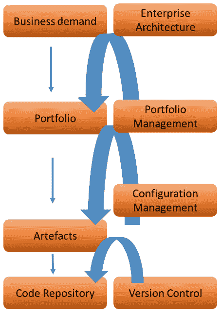

# 第二章：从架构管理 DevOps

在上一章中，我们了解了不同的 DevOps 组件，包括自动化、协作、集成和配置管理组件。在本章中，我们将更详细地学习如何设计这些组件，以及如何管理**DevOps 周期**中的这些组件。我们将了解到，自动化和集成从标准化构建模块开始，这些模块被称为**工件**。这些工件与由**企业架构**定义的组合关联。在我们开始使用自动化和集成启动**DevOps 项目**之前，我们需要理解业务战略和架构的需求。

完成本章后，你将能够识别需求管理的不同组件，以及这些组件如何推动组合管理。你还将了解**持续集成**（**CI**）的不同阶段，以及自动化如何帮助企业加速部署过程。在最后一节中，你将看到，协作在这些过程中至关重要，我们将探讨如何使团队共同合作，例如引入**看板**和其他框架。

在本章中，我们将涵盖以下主要内容：

+   评估需求作为架构的输入

+   设计和管理自动化

+   实施和管理配置管理

+   设计和管理集成

+   设计和管理协作

# 评估需求作为架构的输入

你不能仅仅从一个 DevOps 项目开始——企业需要知道他们想要达成什么目标，才能启动项目。从这个角度来看，传统的瀑布式项目和 DevOps 在*敏捷*工作方式下并没有本质区别——你需要知道自己要去哪里。这是一个非常简单的解释，讲的就是**需求管理**。在本节中，我们将学习需求作为架构输入的意义，以及它如何引导项目的开展。

需求管理可以定义为一个过程，其中企业收集并优先排序改进业务成果的想法。为了做到这一点，企业需要评估来自*外部*的需求，也就是市场——换句话说：*客户想要什么？* 但它还需要评估当前的组合是否仍然是最新的，正在进行的项目是否仍然能够交付预期的结果。**组合管理**是市场需求和正在进行的活动的持续评估。现代的挑战在于，这种评估的速度必须比十年前更快。需求变化迅速，显著影响组合管理。

投资组合管理至少包括以下几个组成部分和过程（Romano, L., Grimaldi, R., & Colasuonno, F. S. (2016). *需求管理作为投资组合管理的关键成功因素*。论文提交于 PMI®全球大会 2016—EMEA，西班牙巴塞罗那。新城广场，宾夕法尼亚州：项目管理协会）：

+   **企业愿景与战略的定义**：这是企业架构的一部分，定义了企业的战略。

+   **需求管理**：收集创意并识别投资组合中未来产品和服务机会的过程。

+   **持续组件**：验证现有产品和服务是否仍然对企业及其客户相关。

+   **组成部分评估**：这涉及商业案例。开发新产品和服务或更改现有组成部分的投资额是多少？发布或更改后，预期的收入是多少？

+   **预算编制**：计算启动开发或实现现有组成部分升级所需的资源量。

+   **优先级排序与选择**：开发和变更需要与企业战略相匹配。什么是必须做的，什么是可选的，以及在什么时间框架内？

+   **投资组合治理与沟通**：这与需求和投资组合管理中谁负责什么事项相关。建议采用**责任、问责、咨询和知情**（**RACI**）矩阵来进行投资组合管理：谁负责哪个组成部分？谁是最终问责人？谁应该被咨询？谁应该被告知？

+   **投资组合实施**：以结构化的验收过程将新增或更改的组成部分加入投资组合。组成部分是否以适当的方式记录？组成部分是否得到负责人的签字确认？所有的验收标准是否都已满足？

+   **投资组合报告与评审**：报告应反映投资组合是否与企业战略一致。投资组合是否仍然与战略和期望的业务结果相关？还是企业需要更改组成部分，甚至考虑调整整个投资组合（例如，通过剥离投资组合的部分）？

+   **效益实现**：投资组合的实际价值是什么？它为企业和其业务带来了哪些效益？

组合项目驱动着企业中的项目，也驱动着 DevOps。DevOps 的关键是自动化，使项目能够跟上业务变化和需求的速度，特别是对**信息技术**（**IT**）的需求。自动化的关键在于创建标准化的构建模块。从组合项目中，我们需要定义这些构建模块，称为工件。**配置管理**就是管理这些工件，使其适配组合项目。为了管理这些，我们需要版本控制。我们将在*实施和管理配置管理*部分讨论这一点。

我们现在已经有了创建组合项目以管理配置项并实现自动化的周期。如下图所示：

图 2.1 – 配置管理周期

**代码库**保存着在版本控制下的标准构建模块。这是实现自动化的前提。在接下来的部分中，我们将深入学习自动化的相关内容。

# 设计和管理自动化

在本节中，我们将讨论 DevOps 的**自动化**。首先，自动化不仅仅是关于工具，尽管我们将在本节末尾讨论工具。架构师需要回答的第一个问题是*我们需要自动化什么*和*为什么*。这不仅仅是关于工具，而是关于过程。

首先，我们需要回答以下问题：*我们为什么需要自动化？* 这个问题的答案是因为*标准化*。企业采用 DevOps 的原因是他们希望加快交付过程。做到这一点的唯一方法就是对构建模块、工作流程、过程和技术进行标准化。通过实施并始终如一地遵循标准，企业将限制交付链中的变异，从而可以开始自动化。自动化的关键在于减少等待时间。

在企业转向 DevOps 之前，IT 交付是由等待时间驱动的。开发人员需要等待服务器。在最坏的情况下，服务器需要先下单，然后安装和配置，才能交付给开发团队。接着，开发人员才能开始工作并将软件交付给测试人员，但随后他们又必须等待测试人员反馈结果。最后，产品准备发布，但此时团队还必须等待最终的*是否发布*决策。

在 DevOps 和自动化的**CI/CD 流水线**中（其中**CD**是**持续交付**的缩写），如果做得好，等待时间会因为标准化而大大减少。架构师需要牢记，流水线由两个主要部分组成：*软件*和*基础设施*，尽管基础设施现在也已经是代码。通常，我们将工作在云环境中，在那里我们不再部署物理服务器，而是采用**基础设施即代码**（**IaC**）。

一切都已成为代码。基础设施、配置和软件部署的自动化是 DevOps 的核心。只有通过自动化，公司才能加快交付速度，缩短交付周期到几周、几天甚至几小时。

以下截图展示了 CI/CD 管道的自动化过程。该管道中有两个主要组件：**部署管道** 和 **基础设施管道**：

图 2.2 – 部署管道和基础设施管道

软件在部署管道中进行开发、测试和部署。该软件需要部署到基础设施上，例如，在公共云中使用 **虚拟机** (**VM**)，如 **Amazon Web Services** (**AWS**) 或 Azure。在某个时刻，我们将不得不将软件代码与该基础设施的基础设施和配置包进行合并。整个包经过测试、验证，最终被推送到生产阶段。

注意

*图 2.2* 展示了测试的重要性。图中有几个触点，包括测试程序。在 *设计与管理集成* 部分，我们将进一步解释 CI 中的各种测试，例如静态分析和动态分析。*第三章*，*为 DevOps 质量架构* 也有一节关于执行测试的内容。

因此，部署管道用于将代码转换为可部署的应用程序包，部署该包，验证该包，并将该包发布到生产环境中。

在基础设施管道中，我们为应用程序包部署的环境进行配置。在 *图 2.2* 中，虚拟机被作为示例提到，但基础设施也可以由**容器**或**无服务器组件**组成。事实上，本地应用程序将使用容器和无服务器环境，而不是虚拟机。

## 理解管道组件

让我们更仔细地看一下 *图 2.2* 中展示的图表，并评论其中的不同组件。管道从**版本控制**和**配置项**开始。在下一部分 *实现与管理配置管理* 中，我们将对此进行更详细的讨论。

实际的部署从包含我们需要运行应用程序的所有文件的包开始。这个包可以部署到某个环境中。*可以部署到任何环境吗？* 这就是将部署管道从基础设施中抽象出来的原因。理想情况下，我们希望能够在不同的平台上运行代码，因此我们需要以这样的方式编写代码，使其能够在各种基础设施上运行，例如在 AWS、Azure 等平台上，或者在私人堆栈上，甚至使用不同的操作系统，如 Windows 或 Linux 发行版。

如果我们已经有了包，就可以开始部署：这是一个自动化任务序列，用于将我们的应用程序部署到测试或预发布环境中。在这里，我们可以运行自动化的简单测试—通常称为冒烟测试—来验证代码是否实际运行。这个简单的测试不足以验证所有必需的功能并发现错误：这将在测试阶段完成。我们将在*设计和管理集成*部分深入了解测试。

如果所有测试都成功执行完毕，我们就得到了一个经过验证的应用程序包，准备推送到生产阶段。

在自动化方面需要考虑以下几个方面：

+   **代码开发**：在 DevOps 中，自动化从开发者开始编写代码时就已经开始。代码需要是“自动化就绪”的，这意味着从代码提交的那一刻起，实际构建会被触发，并通过自动化测试和代码验证。接下来，代码会被编译并纳入版本控制。最终，当所有测试都执行完毕且完整的包经过验证后，它将被推送到生产环境。开发人员在开发代码时需要考虑这一自动化顺序。代码部署到生产环境后，还需要进行监控。因此，一旦包“准备好”进行上线，脚本会合并到包中，以便使其能够进行监控并收集日志。

+   **持续测试**：在 DevOps 的周期中，软件会不断被评估和改进。毕竟，这正是 DevOps 的核心：提高敏捷性和持续交付（CD）。因此，代码会定期发生变化。每次代码发生变化时，都需要进行测试和验证。这就是持续测试的作用。自动化测试被用来跟踪和预测代码变更中的问题，执行多种测试，并最终发布经过批准的自动化构建版本。

+   **监控**：认为只有在应用程序推送到生产环境时才需要监控是一个误解。监控在整个 CI/CD 生命周期中都很重要，是自动化的关键组成部分。监控用于跟踪事件，找出代码故障的原因，优先处理事件，并主动提出可执行的改进建议。

简而言之，通过应用自动化，我们可以将发布周期从几个月或几周缩短到仅仅几天，甚至几小时。这只有在尽可能多地进行自动化的情况下才可能实现。但自动化不仅仅是加快交付速度，它还减少了手动错误的风险，并将使公司能够实现更高的一致性和更高的产品可靠性。DevOps 不仅仅是关于敏捷性和速度，可能更重要的是质量，通过在可重复的过程中创建更高精度的产品，并能够以高速度交付。

## 选择 DevOps 自动化工具集

目前为止，我们还没有讨论到**工具**。选择合适的工具确实非常重要。然而，挑战在于市场上有许多可用的工具。架构师的一个任务就是指导工具的选择。架构师需要做出的第一个决定是，他们是否希望自动化是“单一堆栈”的，还是选择多个工具用于不同的自动化领域。

请看以下截图中的**DevOps 工具周期表**（由 *Digital.ai* 提供）。对于每个 DevOps 域，有大量的工具选择。这里有用于管理代码、创建包、自动化管道合并、测试代码、修复 bug、提供基础设施、管理基础设施和监控的工具：

图 2.3 – DevOps 工具周期表的概念

组织需要从头到尾管理 DevOps 流程的工具。虽然有一些工具承诺能够提供这种端到端的功能，但通常需要一套工具，从代码构建和提交到测试、部署和运营。需要记住的一点是工具之间的集成水平。这不仅取决于开发人员使用的源代码，也取决于目标平台。如果目标平台是 Azure，那么使用 **Azure DevOps** 和 **Azure Resource Manager**（**ARM**）来部署该平台上的基础设施是完全合理的。如果主要平台是 AWS，那么像 Chef 和 Puppet 这样的工具，结合 **AWS CodeDeploy**，可能是更好的选择。

另外，从使用虚拟机（VM）到使用容器和无服务器技术的转变正在进行中。许多 DevOps 项目使用容器来部署代码，通过 Docker 和 Kubernetes 作为容器的*编排平台*。与虚拟机相比，容器对底层基础设施或云平台的依赖更少，但这里的平台也各自有自己的 Kubernetes 引擎。比如，Azure 上的 **Azure Kubernetes Services**（**AKS**）和 AWS 上的 **Elastic Kubernetes Services**（**EKS**）。

另一个需要考虑的重要因素是将选择的工具类型。开源工具非常流行，但考虑这些工具是否符合企业需求也是很重要的。这在不同领域之间有所不同。Azure DevOps Pipelines 和 AWS CodePipeline 被视为企业级工具，但版本控制工具（Git、GitHub、GitLab、**Subversion**（**SVN**）、Cloud Foundry）主要是开源的。企业选择开源工具可能有很好的理由，正如这里所阐述的：

+   **社区驱动**：大型社区不断改进软件。企业可以从中受益。

+   **具有成本效益**：通常，开源软件需要许可，但从总成本来看，开源软件往往是一个非常划算的选择。

+   **无锁定风险**：这对组织来说变得越来越重要。它们不希望完全被一个软件提供商的解决方案或该提供商的生态系统所束缚。开源让组织拥有极大的自由度。

开源软件常被批评的负面因素是，它可能比企业软件更不安全且不稳定。然而，由于软件不断地受到社区的审查和改进，我们发现开源软件在安全性和稳定性上与非开源软件一样。

# 实现和管理配置管理

在上一节中，我们了解到，自动化始于版本控制和配置项，这些配置项在构件的存储库中形成一个应用包。在本节中，我们将学习如何管理这些构件。

自动化只能在**构建块**（构件）和流程标准化的情况下进行。**标准化**需要以下三个组件：

+   **投资组合**和**投资组合管理**：投资组合是企业战略和企业交付给客户的产品的体现。这些产品由多个构件组成：产品组件和流程。因此，投资组合处于企业的战略层面，而产品和构件则位于战术层面。投资组合由企业架构、产品和构件定义，并在业务单元和项目层面进行管理。简而言之，产品在没有投资组合定义的情况下无法存在，但投资组合并非我们能够在项目和流水线中自动化的内容。我们可以自动化构件，甚至是产品，只要它们是标准化的，并通过版本控制进行管理。

+   **版本控制**：在本章的第一节中，我们了解到构件源自投资组合。构件需要进行版本控制。集中式版本控制存储库在 CI/CD 中绝对是首要任务。这个存储库是所有配置项的**单一真实来源**（**SSOT**），这些配置项将用于开发和构建部署包。使用**版本控制系统**（**VCS**）中的文件版本创建带有配置项的包。版本控制是保持所有配置项一致性的必要条件。构建过程会生成一个版本化的包，用户可以从存储库中检索该包。

+   **配置项**：术语*配置项*源自**IT 基础架构库**（**ITIL**），这是一种 IT 服务管理的 IT 库。配置项是为了交付 IT 服务而需要管理的资产——基本上，所有执行构建和交付 IT 服务所需的东西。它包括应用程序代码的构建模块，还包括操作系统的镜像、网络设置的配置、安全包、许可证、数据库设置和测试脚本。所有这些项都需要进行管理。配置项通过**唯一标识符**（**UUID**）、项的类型（硬件、软件、脚本、许可证等）、清晰的描述以及该项与其他项的关系来定义。为了保持配置项的一致性，它们需要定期或甚至“实时”进行验证和确认。一个最佳实践是自动化这一过程，正如我们在前一节中所看到的那样。代理程序将持续监控环境中的所有资产，并更新配置项在存储库中的状态，通常称为**配置管理数据库**（**CMDB**）。

这与企业架构和投资组合有何关联？以安全性为例。从企业战略出发，必须定义安全标准——例如，企业应符合哪个行业框架。这被转化为需要在安全包中设定的安全政策。这些包含安全政策和规则的包被称为配置项。在本书的第三部分，关于**DevSecOps**的内容中，我们将深入了解这一点。

让我们把这一切具体化一些。我们有一个运行在虚拟机上的应用程序，它连接到一个数据库。然后，可以列出不同的配置项，如下所示：

+   应用程序代码

+   虚拟机模板

+   操作系统镜像

+   应用程序的安全设置

+   虚拟机的安全设置

+   访问规则

+   数据库镜像

+   操作系统许可证

+   数据库许可证

+   网络设置（**互联网协议**（**IP**）地址分配；网络端口；路由）

这份清单并不详尽——这里只是一些示例。所有这些项目都需要进行管理，以保持一致性。CMDB（配置管理数据库）使得所有项目的验证和确认成为可能。通过应用版本控制，我们确保新的构建只使用经过验证的配置项——例如，某个版本的操作系统或特定版本的应用程序代码。

一个重要的收获是，每个配置项都与业务战略、投资组合和企业架构紧密相连。

在本节中，我们学习了什么是配置项，以及如何通过单一的存储库（CMDB）来管理这些项，以保持它们的一致性。在下一节中，我们将看到为什么版本控制和一致性如此重要。

# 设计和管理集成

在本节中，我们将深入了解**CI**。首先，我们将探讨**应用代码**的开发与部署。接下来，我们将学习**代码管道**在应用程序与基础设施中的集成。某些时候，应用代码和基础设施即代码（IaC）需要与特定配置包合并。只有这样，我们才能拥有一个完全集成的模型。

首先，让我们来看看集成的定义。这指的是一系列自动化的任务，用于版本控制、编译、打包和发布应用程序。这包括测试，**单元测试**用于验证现有代码在不间断的情况下是否表现良好。**集成测试**运行以确保不会出现集成问题。还可以包括其他检查，例如**静态代码分析**，以提高质量和反馈。

CI/CD 管道——以及其中的自动化——从**源代码**的合并开始。代码被转化为构建，这是一个可执行包的产品，能够与其他可执行包集成。代码从仓库中拉取，进行分析，并提交到构建服务器，在那里会执行一系列自动化任务，将代码推送到生产环境中，包括与基础设施的合并。

如前所述，代码的测试和验证是构建过程中至关重要的一部分。代码通过测试验证所有风险已被识别并得到缓解，以确保构建符合企业架构中定义的企业合规性要求，并且符合安全政策。下一步是将代码部署到开发或测试环境中。如我们所见，最好是通过自动化方式进行此操作。代码被纳入版本控制并提交回仓库。

虽然需要大量手动任务，但保持一个由开发人员维护的 wiki——一个包含版本控制的文档集合——是很重要的，里面包含了构建编号的发布说明，以及在测试后遇到并已缓解的问题。测试结果应该列在发布说明中。

总结来说，CI 过程包括以下步骤：

1.  **检测新提交的代码**：应用仓库中的源代码被分叉，这意味着代码已提交到自动化管道。这会启动一系列构建任务。下一步是验证代码。这就是**拉取过程**，代码被检出并放置在**构建环境**中——在大多数情况下是**开发服务器**。执行静态分析，这是一种不实际运行代码的测试。这个步骤也被称为**linting**。

1.  **源代码质量分析**：检查代码是否符合安全性和合规性要求。质量分析的一部分还包括对所用软件的扫描：它是否有许可证，并且是否符合企业标准和软件组合？

1.  **构建**：这是编译代码并组装包的步骤。实际的构建过程从从工件仓库中提取可执行包开始。该仓库存储着企业用于部署代码的所有标准和政策。源代码与这些包合并。例如，这些包包含操作系统的镜像，还包括安全策略，如硬化模板，用于保护系统免受攻击。基础设施的包通常存储在包含镜像的仓库中：可信镜像注册表。这些镜像用于组装可执行包并进行最终部署。

1.  **单元测试**：单元测试确保可执行包运行时没有问题。

1.  **集成测试**：在代码验证中，我们执行了**静态分析**，现在进行动态分析。测试组装包以验证其运行时没有错误，并生成测试报告。

1.  **创建运行时可执行文件**：我们接近最后的步骤，即将代码发布到下一个阶段。在此之前，生成运行时可执行文件，以便代码能够按照特定的运行时顺序或常规启动。这些运行时可执行文件通常存储在单独的运行时库中。

1.  **构建通知**：部署前的最后一步是通知构建已准备好，这意味着代码和可执行包已通过所有测试，包已准备好部署。如果在自动化过程中任何步骤中集成被停止，开发人员将收到通知，以便他们修复任何问题并重新提交代码。然后，按照描述的每个步骤重复执行。

集成过程如下图所示：

图 2.4 – CI 流程

*图 2.4*显示 CI 路径的输出指向名为**晋升路径**的东西。应用程序很少直接推送到生产环境。应用程序的发布通常在实际进入生产环境之前会进行“分阶段”处理。下一节将解释这一晋升路径。

## 理解晋升路径

尽管代码最终会被推送到生产环境，但良好的做法是先将其部署到开发、测试或预生产环境中。这被称为晋升路径，涉及**开发**、**测试**、**验收**和**生产**（**DATP**）。在某些情况下，验收环境是晋升路径的一部分。验收环境位于测试和生产系统之间。

见下图：

图 2.5 – IT 系统的晋升路径

强烈建议对业务关键应用程序使用验收环境。事实上，企业通常将验收环境用作生产失败时的**灾难恢复**（**DR**）系统。生产系统会切换到验收环境，并且数据损失最小。验收环境在配置上应该与生产系统完全相同。

推荐包含 DTAP 的晋升路径作为最小化设置。可执行包是集成流水线的产物，现在被推送到开发、预生产和测试或暂存环境。在这里，包会被测试，以验证它们在生产环境中运行时不会出现问题。应用程序至少需要具有健壮性、稳定性、安全性和合规性。同时，还需要测试云原生特性，如可扩展性——甚至可能包括自我修复——以及负载和性能测试。最终，最终产品将根据最初从业务收集的规范上线。然后，我们又回到了循环的开始，这个循环从需求管理开始。

为什么我们要进行如此密集的流程来发布代码？因为这样做对业务有很多好处。以下列出了五个主要的好处：

+   代码更改更加可控，并且可以更小，因为这是一个持续的过程，代码的改进可以通过小的迭代进行。

+   由于自动化，代码发布的速度可以大大加快。

+   由于自动化，开发成本将显著降低——这一点将在企业的整体成本中体现出来。

+   自动化测试将导致更可靠的测试和测试结果。

+   管理和更新变得更加简单。

在本节中，我们了解了 CI：它的要求是什么，如何通过自动化流水线启动集成，以及为什么企业应该在项目中实施 CI。作为完整 DevOps 设置的一部分，我们还需要讨论一件事，那就是协作。DevOps 不仅仅是关于技术和工具，它是一种*心态*。我们将在本章最后一节讨论协作。

# 设计和管理协作

简单来说，DevOps 只有在团队合作时才能成功。如果团队使用相同的流程，甚至是相同的工具集，那么他们就能够协作。在 DevOps 中，**协作**将流程和技术结合起来，使团队能够共同努力。

在*第一章*《为企业 DevOps 定义参考架构》中，我们看到很多企业已经将他们的 IT 外包。这使得协作有时变得困难。DevOps 要求负责运营并且属于某个外包合作伙伴或供应商的团队，必须与来自不同公司的开发人员共同合作。企业必须为此设定场景、参与规则和协作原则。这种责任只能由企业层面承担。

在企业中，很少有单一团队完全负责一个应用程序。通常会涉及多个团队，甚至多个供应商。然而，DevOps 假设有一个 DevOps 团队负责端到端。这样做的主要目的是减少开销，管理团队之间交接时的等待时间。这需要团队成员之间不断的沟通，因为这些成员的技能和任务各不相同。

不要被**T 型**教条所迷惑。是的，云工程师可能知道如何将存储附加到虚拟机（VM），也许他们还知道如何在 Azure 或 AWS 中构建网络配置，但配置数据库或防火墙是特定任务，通常需要数据库或网络工程师。DevOps 团队将必须引入这些**领域专家**（**SMEs**），但是他们会在一个团队中共同工作，而不是在独立的工作单元中。

接下来，企业需要实现协作。这是项目负责人或者在敏捷工作方式下的*Scrum*大师的任务。他们的关键任务之一是“去除障碍”，帮助团队成员实现共同的目标。为团队设定目标和优先事项是第一步。

我们如何定义目标和优先事项？这是架构师的任务。他们的责任是制定一个清晰的路线图，指出如何达到每个目标，以及顺序是什么。该路线图来源于最终架构，也称为“**soll**”或**目标架构**。这个架构定义了环境最终应如何呈现，包含应用架构、所需的基础设施组件以及**应用程序编程接口**（**APIs**）。

下面的图示展示了一个路线图示例。该示例来自*ProductPlan*，完美展示了一个简单的路线图如何帮助创建任务的可视化和清晰度，这些任务是提前预测的：

图 2.6 – 由 ProductPlan 提供的架构路线图示例

最后，路线图展示了团队成员的角色和责任：谁需要做什么，以及需要多少时间？创建清晰的路线图、时间表和任务的一个好方法是使用**看板**。看板，最初是日本发明的，首次在丰田公司引入，显示在生产过程中何时需要某些组件。Scrum 和 Kanban 都是实现敏捷应用开发方法的工具。

对许多企业来说，这听起来仍然非常新鲜，但事实上，他们可能已经使用类似的规划方法学工作多年，因为这正是看板（Kanban）本质上所做的。它帮助团队将复杂的项目规划成可以实现的小块，从而提高最终产品的质量。

在下一章中，*为 DevOps 质量架构*，我们将学习更多关于实施质量度量的内容。

# 概述

本章从需求管理概述开始，作为架构的输入。我们了解到，评估商业需求是驱动投资组合的关键因素。反过来，投资组合定义了我们用来开发产品、服务以及应用程序的构建块和工件。由于需求变化迅速，企业需要加快部署流程。这可以通过尽可能多地实现自动化来实现。自动化是通过管道完成的，在本章中，我们学习了架构应用程序部署和基础设施管道的不同组件。

在上一节中，我们讨论了在 CI/CD 中至关重要的协作，采用了 DevOps。团队将由具有不同技能的工程师组成，他们甚至可能来自不同的公司，这在那些外包 IT 服务的大型企业中非常常见。因此，企业需要鼓励强有力的协作，基于清晰的路线图、明确的目标和计划，明确每个人负责的任务。为此，Kanban 看板是一个不错的方案。

在下一章中，我们将深入探讨 DevOps 项目的质量度量，学习**就绪定义**（**DoR**）和**完成定义**（**DoD**），并了解如何执行质量保证测试。

# 问题

1.  需求管理是一个收集想法并识别未来产品和服务机会的过程，这些产品和服务都在一个投资组合中。请判断以下陈述是否正确：商业案例与需求管理无关。

1.  第一个测试之一是在不实际运行代码的情况下进行测试。我们称这种测试为什么？

1.  晋升路径包含多个阶段。这些阶段是什么，它们的顺序是怎样的？

# 进一步阅读

+   *需求管理作为投资组合管理中的关键成功因素*。2016 年，Romano, L., Grimaldi, R., 和 Colasuonno, F. S. 在 PMI®全球大会上发表的论文：

    https://www.pmi.org/learning/library/demand-management-success-factor-[portfolio-10189](http://portfolio-10189)

+   *Kanban 与 Scrum - 最大化两者的优势*，Henrik Kniberg 和 Mattias Skarin：

    [`www.infoq.com/minibooks/kanban-scrum-minibook/`](https://www.infoq.com/minibooks/kanban-scrum-minibook/)
