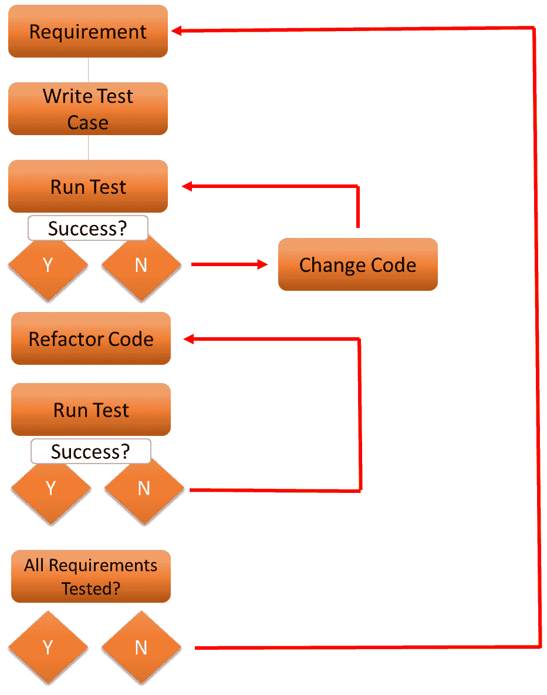

# *第三章*：为 DevOps 质量架构设计

**DevOps**的总体目标是为 IT 项目提供高性能和高质量。在本章中，你将了解 DevOps 如何为**IT 交付**的质量增加价值。在本章中，我们将学习如何定义测试策略，证明质量已经按照**完成定义**（**DOD**）交付。但如果出现故障怎么办？DevOps 中的黄金法则是你构建它、运行它、弄坏它，然后修复它。但是，我们必须通过执行**根本原因分析**（**RCA**）来检测问题是什么。在最后一节中，我们将讨论**补救措施**，以及由此带来的**持续改进**。

完成本章后，你将能够在 DevOps 项目中识别和实施质量措施。你将学会可以包含哪些测试，它们如何组织，以及这些测试的价值是什么，从而持续改进产品或服务。

在本章中，我们将涵盖以下主要内容：

+   定义测试策略

+   实施质量措施

+   设计测试自动化和执行

+   理解根本原因分析

+   设计补救措施

# 定义测试策略

在上一章中，我们得出结论，测试是 CI/CD 过程中确保构建质量的关键步骤。在本节中，我们将学习如何在 DevOps 中定义测试策略。

首先，DevOps 需要一种不同的测试方法：它是持续部署和集成*构建*的一部分。我们应当采用 DevOps 的原因是企业希望加快发布速度，以便能够更快速地响应变化的需求。对于测试来说，这意味着从测试最终产品转变为持续测试，重点是减少构建和测试时间。

换句话说，测试不再仅仅是检测最终产品中的缺陷，它已经成为整个构建生命周期的一部分，贯穿于整个周期的反馈收集。

**测试人员**应该是 DevOps 团队的成员。他们的职责是不断收集反馈、衡量周期时间，并寻找减少这些时间的方法。测试人员应该被邀请在整个构建过程中监控代码，这样他们就能在错误和缺陷出现时立即发现。这将为团队提供在代码进入下一个阶段之前修复问题的机会。这种方法的主要好处是，最终产品将已经有更少的问题，并且在每次迭代中总周期时间都会减少。

总的来说，我们可以说，质量保障在 DevOps 中的角色正在发生变化。在传统的 IT 项目中，质量保障通常是在产品——例如应用程序——交付到最终阶段时进行的。测试人员会执行功能测试，并组织一群用户来进行**用户验收测试**（**UAT**）。这个过程通常持续一到两周。然后，结果会反馈给开发人员，开发人员会查看问题并修复。之后，整个项目会再次交给测试人员，以便他们重新测试并验证所有问题是否已经解决。在 DevOps 中，我们不再按这种方式工作。首先，因为这种方式花费时间过长，其次，测试人员和开发人员之间几乎没有互动。

在 DevOps 中，确保整个开发周期的质量的测试策略需要满足哪些要求？它们如下：

+   **创建用户故事意识**：首先，需要有一个明确的**用户故事**。用户故事将驱动测试场景。这意味着团队会明确测试的主题范围。**TMAP**，最常用的测试框架，将这些主题分为两类：*组织*和*执行*。组织类主题涵盖测试的规划、准备和管理方式。执行类主题则涉及具体的测试内容。

+   **制定策略**：在 DevOps 中，**策略**应该是测试在整个构建过程中都得以执行，这意味着测试人员需要在构建的各个迭代中运行自动化测试脚本。换句话说，代码会不断进行测试，以验证其是否顺利运行且没有问题。这需要开发人员和测试人员之间的紧密合作：在构建过程中，开发人员需要向测试人员提供代码，以及临时构建，直到代码稳定为止。

    显然，测试的数量、测试时间以及测试目标之间必须保持平衡。企业进行测试是为了避免潜在的风险，如风险变为现实并造成损害。定义测试策略时需要解决的第一个话题之一是清晰地识别风险。

    要意识到，这不仅仅是技术上的问题。它还涉及到协作和沟通的软技能。过去，测试人员习惯于在开发周期结束时获得整个产品包，然后进行测试，现在他们成为了 DevOps 团队的一部分，持续沟通关于时间安排、测试方式以及将要测试的内容。这对 DevOps 的成功至关重要。

+   **定义工具和环境**：说实话，这并不是关于工具——而是关于代码和**标准化**的水平。测试人员需要确保捕获到所有代码：我们称之为代码覆盖率，至少应该达到 100%或接近这个值。测试用例必须自动化。**自动化**需要标准化：代码需要自动部署到标准化的测试环境中，在该环境中，预测试、清理和后期测试任务都是自动化的。这将提高效率和可靠性，防止在重复任务中出现人为错误，前提是一些测试将会执行多次。

    第一次测试，在开发过程的初期，包括*静态分析*来检查代码是否完整。在静态分析中，代码不会被执行：工具验证代码是否完整且一致。例如，测试人员可以使用工具和脚本验证安全政策是否已应用于代码，并确保代码符合行业标准。回顾静态分析过程应该提供关于代码及相关文档质量的详细概述。

+   **执行**：测试场景必须结构化得非常清晰。这需要在测试设计中定义，我们将在*设计测试自动化和执行*一节中讨论。在那里，我们将查看各种执行技术：

    - 以过程为中心

    - 以条件为中心

    - 以数据为中心

    - 以体验为中心

    DevOps 的一个重要目标是通过减少过程步骤之间的等待时间来加速交付。这也包括测试。我们已经指出，测试人员不必等到代码最终交付后才开始测试，他们可以在构建周期的后续迭代中运行自动化测试。为了减少测试时间——进而减少整个构建时间——建议进行测试的*并行执行*。

    还有很多方法可以提升质量和测试，这不仅仅是质量工程师和测试人员的责任。DevOps 实际上是一个团队合作的过程，鼓励所有成员参与到各个步骤和阶段中。因此，开发人员也被邀请参与并添加测试用例。一个好的做法是将测试用例、脚本、运行手册、报告以及其他文档集中到质量存储库中。从这个存储库中，质量工程师和测试人员可以挑选用例，并在开发和部署过程中进一步自动化这些用例。

+   **创建和解释报告**：必须评估测试结果。在本节开始时，我们提到，测试是为了识别、分析并减少风险。测试结果必须与这些风险相匹配，这意味着它们应该得出预期的结果。如果结果完全不同，那么风险需要进一步调查。只有这样，测试才能真正对质量做出贡献。

    因此，测试远不止是发现 bug。测试必须专注于构建的整体期望结果。因此，测试人员需要报告的内容远不止是纯粹的问题。报告现在真正专注于改善构建和构建过程的质量。一个例子是，测试结果可能会显示哪里可以改进自动化，或者代码可以优化。总体目标是降低风险。

    阻塞问题——那些带来巨大风险的问题——必须立即报告，并反馈到开发链的起始阶段。

+   **设定退出标准**：测试中的结果很重要，它们会导致关于是否以及如何继续的决策。这就是**退出标准**的作用。如果所有必要的测试都已执行，结果应该能够提供足够的信息，以做出*通过*/*不通过*的决定，并将软件推向下一个阶段，通常是生产阶段。

在本节中，你学会了如何制定质量和测试策略。在我们学习如何实施质量措施之前，我们将简要了解不同的测试类型。

## 理解测试类型

在本节中，我们将介绍不同的、最常见的测试类型。测试分为三个层级：

+   **第 1 层**：**小规模测试**，专注于单个组件。单元测试就是一个例子，测试代码的各个小块。

+   **第 2 层**：**集成测试**，涉及多个组件。测试集成本身，但也测试组件之间的交互，以及集成包是否能良好运行。在这一层级执行集成和性能测试。

+   **第 3 层**：**可用性测试**，专注于最终产品的易用性——例如，使用图形界面——以及是否易于管理。**用户验收测试**（**UAT**）通常是这一层级的最终测试。明确来说，UAT 还包括从最终用户的角度进行的性能测试。

这三种层级展示在下图中：

图 3.1 – 测试的层级

随着测试从单一组件扩展到涉及整个解决方案栈的可用性测试，复杂性增加。

在测试策略中，团队将根据业务需求定义必须执行哪些测试，以及成功部署构建所需的预期结果。

还有一些特定的测试尚未提及：

+   **回归测试**：在传统的软件开发方法中，这些测试非常常见。功能性和技术性的测试会被重新执行，以确保在开发周期中变更的代码在更改后依然能够正常工作。正如我们所看到的，DevOps 已经改变了我们对待测试的方式。这不再是一次性的操作，我们运行回归测试，发现问题，修复后再运行测试。在 DevOps 中，代码在整个构建过程中都会持续进行测试和改进。回归测试变得*不那么重要*。在某些情况下，执行回归测试仍然可能具有价值。

+   **安全测试**：同样适用于安全测试，传统上这些测试通常是在构建交付后执行。在 DevOps 中，我们在第一次静态分析阶段就检查漏洞和合规性问题。在*第十四章*，*将 DevSecOps 与 DevOps 整合*中，我们将更详细地讨论这一点。

测试是为了验证质量。在接下来的章节中，我们将学习质量措施以及如何在我们的 DevOps 项目中实施这些措施。

# 实施质量措施

到现在为止，应该很清楚 DevOps 中的一切都是关于**持续性**，换句话说，这意味着**持续部署**、**持续集成**、**持续测试**和**持续质量**工程。DevOps 项目始终关注每个开发和运维阶段的**质量**。这与传统的方法不同，在传统方法中，团队会有一个单独的阶段来修复问题。而在 DevOps 中，团队会不断地衡量产品，并在问题发生时立即进行修复。DevOps 的六大原则之一是**持续改进**，这不仅指的是在每个迭代中改进产品的反馈循环，也指的是 DevOps 流程本身。

在 IT 项目中，一个常见的做法是设置修复阶段，Gerald Weinberg 在他的书籍*《完美软件与关于测试的其他幻想》*中描述了这一过程。修复阶段通常安排在开发阶段结束后，软件交付给运维部门之前。在 DevOps 中，我们没有修复阶段，因为质量在整个开发和运维周期中都在不断衡量和测试。可以通过下图看到这一点：

图 3.2 – 持续测试（基于 TMAP）

如何衡量质量？首先，什么是质量？我们在本书的开头提到，一切都始于业务。这就是为什么**企业架构师**在 DevOps 中扮演如此重要的角色。企业架构师的主要任务是将业务需求转化为解决方案。从业务需求出发，产品组合应清晰地列出这些产品应达到的交付标准。这就是质量。质量是指能够满足用户需求和期望的产品或服务。质量是一个满足用户的产品或服务。因此，测试就是验证用户是否能对交付的产品或服务感到满意。

企业在衡量 DevOps 质量时关注哪些内容？主要有两件事：构建本身和其*功能验证*。对于构建本身，成功构建的数量、缺陷总数和代码覆盖率等是重要的指标。对于功能验证，主要关注是否所有的需求都已被测试，是否所有识别的风险都已被覆盖。

在接下来的几节中，我们将学习如何定义质量以及如何衡量质量，从验收标准开始。

## 定义验收标准

在我们开始测试之前，我们需要知道我们将测试什么。这就是为什么我们需要定义**验收标准**。简单来说：什么时候算“好”，*足够好*？同样，这从用户故事开始，用户故事定义了产品或服务应该包含什么内容。用户故事确定了范围和产品或服务必须具备的具体功能。

如何设定验收标准？问题是，*我们正在构建什么？* "它"必须明确，并且必须使“它”变得具体可触。DevOps 团队从四个角度来看待规格：

+   **业务**：业务要求是什么？

+   **开发**：我们如何构建一个满足业务需求的解决方案？

+   **质量**：我们如何测试解决方案并验证它是否满足需求？

+   **运营**：我们如何管理解决方案，以便它持续满足这些要求？

在 DevOps 中，我们并不是一次性构建整个包，如同瀑布式项目那样。团队从一个最小可行产品开始，然后迭代产品，持续改进。验收标准是针对每个需求设定的，因此，遵循 DevOps 和质量措施的逻辑，每个需求都会经过测试。这就是**测试驱动开发**（**TDD**）的做法。在 TDD 中，团队首先编写测试用例，然后编写代码。代码是根据测试用例的规范编写的，证明需求已经得到满足。TDD 流程如图所示：

图 3.3 – 测试驱动开发

TDD 并不是什么新鲜事物，它自五十年代中期就已存在，但最常用的版本由 Kent Beck 描述（请参见*进一步阅读*部分）。团队挑选一个需求，编写测试用例，开发代码，并运行测试。当测试成功时，代码将进行重构或重写，也就是对代码进行清理和修复，以达到架构师对代码设定的标准。完成此步骤后，代码将使用测试用例再次进行测试。这个循环将为每个需求重复进行。

下一步是评估“准备好定义”（Definition of Ready）并达成“完成定义”（Definition of Done）。我们将在下一节中详细讨论它们。

## 定义“准备好定义”和“完成定义”

在上一节中，我们学习了如何设置接受标准，以及 TDD 如何帮助确保我们满足特定要求。然而，一个产品或服务在真正进入生产之前，可能有许多要求。

在 DevOps 中，我们使用两个重要的过程来验证一个完全开发的产品或服务是否准备好进入生产。这两个过程是**准备好定义**（**DoR**）和**完成定义**（**DoD**）。

为了避免错误，请记住，“接受标准”在 DoR 和 DoD 中并不相同：

+   **准备好定义**（DoR）：要理解 DoR，重要的是要知道*敏捷 Scrum*是如何工作的。DevOps 团队通常在短周期内进行工作，这一周期称为迭代（sprint），在此期间开发产品的一个部分。需要完成的工作定义为**产品待办事项**（**PBIs**）。整个产品或服务通过用户故事来定义，然后拆解成 PBIs——即团队可以在特定迭代中工作并能够在该迭代中完成的任务。

    Agile Scrum 实际上并没有提到 DoR。然而，已成为一种常见做法，制定一套协议来定义何时 PBIs 准备好由团队接手。用户故事的问题在于，在某些情况下，它们没有足够具体的信息来开始构建。DoR 包含了入场标准，让团队知道要构建什么。定义 DoR 的过程称为细化。

+   **完成定义**（DoD）：与 DoR 不同，DoD 是 Agile Scrum 的一部分，准确描述了一个**产品待办事项**（**PBI**）完成时的状态。因此，DoD 是验证构建质量的一个非常强大的工具。开发人员承诺遵守 DoD。他们承诺必须清楚了解需要构建的内容。在 IT 项目中，DoD 至少应包含以下主题：

    - 所有代码已编写完成。

    - 所有代码已被审核并验证。

    - 相关文档已经编写并可供使用。

    - 所有测试已执行并签字确认。

    - 所有功能已证明已交付。

    在 DoR 负责入场标准时，DoD 包含出场标准——完成声明。所有团队成员必须就 DoD 达成一致：业务方、开发人员、测试人员和运维人员。不要忘记最后一组，运维人员需要签署 DoD 并运行软件。对他们来说，验证代码和相关文档是否完成至关重要。此外，在真正的 DevOps 中，我们不会有单独的开发人员、测试人员或运维人员。相反，我们将有具备开发或测试技能的成员。

到目前为止，我们已经讨论了测试策略、质量措施和验收标准。在接下来的部分，我们将学习如何设计测试自动化和执行。

# 设计测试自动化和执行

在本节中，我们将学习如何设计和实施测试。我们将研究最常见的各种测试类型，并了解在何种情况下使用它们。当我们开始讨论 IT 中的测试时，我们需要讨论并达成一致的测试管理方法。在本书中，我们将使用 TMAP，这一方法由 ICT 服务提供商 Sogeti 于 1995 年提出，并广泛被接受为软件测试的标准。

TMAP 的传统阶段如下：

+   计划

+   准备

+   规范

+   执行

+   评估

在 DevOps 中，这不是一次性的工作；我们将进行持续测试。与传统工作方式的一个主要区别是，不再有单独的测试单元和经理与测试人员。这些专业人员现在是 DevOps 团队的一部分，他们与开发人员一起工作。接下来，在 DevOps 中，我们按照*一切皆代码*的原则进行工作，从而使团队能够尽可能地自动化。

在我们深入了解持续测试之前，我们需要了解各种测试类型。最重要的类型如下：

+   **过程聚焦**：测试关注软件中的路径和流程。在 TMAP 中，这被称为**路径覆盖**。测试覆盖了事务到达某一终点阶段时所遵循的路径。当需要跟随大量路径时，这可能变得非常复杂。在这种情况下，测试会覆盖所有可能的路径和各种决策点。

+   **条件聚焦**：条件可以是决策点。测试覆盖了决策点及其指向的条件，判断该条件是*真*还是*假*。问题在于这将如何影响测试的结果。需要注意的是，这是一个非常简单的解释。从理论上讲，软件将有许多决策点和特定条件，从而影响测试结果。在**条件决策覆盖**（**CDC**）测试中，所有决策点和决策结果将根据条件*真*或*假*进行测试。

+   **数据驱动**：此测试通过数据输入来验证测试结果。这类测试通常通过**边界值分析**（**BVA**）进行。在测试中，我们输入最小值和最大值，即所谓的*边界*。这些值可以是数字，也可以是*语句*。如果我们作为测试用例输入一个超出这些边界的值，那么结果应为“无效”。任何在指定范围内的输入应导致“有效”的结果。

+   **以体验为中心**：这些测试通常被称为**用户体验**（**UX**）测试。所有前面的测试都是二元的。软件按照预期的路径执行，决策点的条件导致预期的结果，输入的数据产生预期的结果。体验则完全不同，因为它天生非常主观。然而，测试人员还是想知道软件“感觉如何”。它反应够快吗？性能如何？是否易于使用？基本问题是：*有没有办法以客观的方式测试体验？* 有一些方法论致力于此，其中之一是“经验蜂巢模型”，该模型由 Peter Morville 于 2004 年开发。以下是该模型的示意图：

图 3.4 – 经验蜂巢模型

然而，经验仍然显得有些难以捉摸。它对于了解软件是否符合用户期望非常有用，但要发现软件中的缺陷和问题，测试人员需要进行更精确的测试。需要注意的是，面向经验的测试非常难以自动化。

再次强调，DevOps 中的测试并不是一次性的。在接下来的部分，我们将讨论持续测试。

## 理解持续测试的原则

在*第二章*《从架构管理 DevOps》中，我们了解了 CI/CD 流水线。我们看到测试是流水线的一个集成部分。这假设所有软件都是通过 CI/CD 开发的，但在企业中，这通常并非如此。例如，仍然会有遗留系统未集成到 CI/CD 中。同样，**软件即服务**（**SaaS**）应用程序也适用：这些是作为服务购买的，因此不会在企业内“开发”。然而，它们仍然需要进行测试。

持续测试的第一步是自动化**测试用例**。这说起来容易做起来难，但如果测试是从已知模式设置的——例如模拟用户如何使用应用程序，那么这是可行的。如果我们有一个处理购买的应用程序，我们可以考虑三种使用模式：

+   下订单

+   取消订单

+   检查订单状态

步骤可以自动化，通过这一点，我们可以创建一个可以执行的测试用例。

一旦我们有了测试用例和需要测试的代码，就需要一个环境来执行测试。这也可以自动化。通过使用公共云，轻松地按需创建一个（临时）测试环境，并在测试完成后自动停用它。它甚至可以是完整测试场景的一部分，你可以在 Azure、AWS 或其他任何云平台上创建环境，部署代码（或者更准确地说，部署源代码的副本），运行测试，然后在完成后停用该环境。这确实需要自动化基础设施的设置和**基础设施即代码**（**IaC**）的实施，稍后我们将讨论这一部分内容。

总结来说，持续测试需要以下几个方面：

+   *集成质量工程与测试*：测试是 DevOps 团队的一个集成部分——意味着团队中的每个成员都参与到测试中。然而，在运行多个 DevOps 项目的大型企业中，建议有一个质量团队，帮助实施质量措施并测试这些项目中的策略。

+   *自动化测试用例*：建议从小规模开始。选择一个测试用例并自动化它。为这个测试用例设定基准：成功执行测试所需的绝对数据是什么？将使用哪些指标，测试需要运行多久？不要让测试过于复杂；使用小规模的测试集并进行短时间运行。评估并在需要时调整测试集和测试时间。

+   *测试工具*：这些工具需要与 CI/CD 流水线集成。本书并不专注于测试工具，但一些流行的工具包括**Selenium**和**Micro Focus 统一功能测试**（**UFT**）。如何选择合适的工具？这实际上取决于你的方法。有些企业偏好单一堆栈解决方案，意味着一个工具涵盖整个测试策略。其他企业则有一套工具，分别用于测试建模和测试执行。同样，与 CI/CD 流水线的集成至关重要。

+   *自动化测试环境*：自动化测试数据的提供方式、测试用例的执行方式以及如何通过云服务自动化测试环境的配置。自动化环境要求我们将一切定义为代码：

    a) **基础设施即代码**（**IaC**）：虚拟机、网络组件、容器、防火墙——一切都定义为代码。在 Azure 中，我们使用**Azure 资源管理器**（**ARM**）模板，而在 AWS 中，首选的方法是使用**CloudFormation**。

    b) **配置即代码**（**CaC**）：一旦基础设施组件被部署，就需要对它们进行配置，以确保它们符合企业的标准和政策。比如 DNS 设置、证书以及安全策略（如强化和打补丁）。一旦配置完成，我们就达到了**期望状态配置**（**DSC**）。

    重要提示

    DSC 是一个通常与 Microsoft Azure 相关的术语。在本书中，我们将使用 DSC 作为一个通用术语，解释云基础设施需要满足架构定义的特定要求，以确保合规性。

    c) **管道即代码**（**PaC**）：CI/CD 过程中每一步都通过代码来定义，从拉取源代码到实际部署，包括测试流程。

    d) **代码即测试**（**TaC**）：代码即测试指的是测试自动化过程本身，从收集、评估和部署测试数据，到实际执行（运行）各种测试并收集结果。我们还可以使用*人工智能*和*机器学习*自动验证结果。

在这一部分，我们了解了测试作为一种方法论，在 DevOps 项目中验证质量的作用。我们看到自动化可以为我们的测试策略带来很大的价值。需要做出一个重要的结论：*问题不在于自动化本身*。目标应该是优化构建并提高其质量。重要的是质量的价值，而不是测试本身。测试将帮助团队通过识别风险并帮助他们了解如何缓解问题，来提升工作质量。这就是我们将在下一部分讨论的内容。我们已经发现了一个问题——*接下来怎么办？*

# 了解根本原因分析

在前面的部分，我们讨论了质量措施和测试，如何以高度结构化和自动化的方式验证这些标准。尽管如此，问题仍然可能发生。DevOps 的黄金法则是*你构建它，你运行它*，通常后面跟着一句话*你破坏它，你修复它*。甚至可以是*你摧毁它，你重新构建它*。如果发生故障，团队需要找出到底发生了什么。在这一部分，我们将讨论**根本原因分析**（**RCA**），这是寻找问题根本原因的最重要工具之一。

RCA（根本原因分析）是一种寻找问题确切原因的方法。通过 RCA，团队可以获得如何改进产品或服务的洞见。这些改进可能是快速修复或长期优化。RCA 不仅仅是寻找问题的方式；它是改进的起点。在 RCA 中需要解决的重要问题如下：

+   这个问题是什么？

+   发现问题的地方是哪里？

+   为什么会出现这个问题？

+   是什么导致了这个问题？

+   我们可以做出哪些改进，以避免将来出现这个问题？

有多种方法可以进行 RCA。常用的方法包括*5 个为什么*和*鱼骨图*（也称为*石川图*）。5 个为什么是一种通过简单地连续问五次“为什么”来逐步挖掘问题根本原因的简单方法。这有点像小孩不停地重复同一个问题，直到他们对答案感到满意为止。

鱼骨图由石川教授发明，更适合深入分析复杂问题。它从问题开始，然后团队确定可能导致该问题的因素：基础设施、代码、程序员等。这些就是“鱼骨”。然后分析每一根骨头。其基本图示如下：

图 3.5 – 鱼骨图

无论采用哪种方法论，根本原因分析的基本步骤始终相同，如下图所示：

图 3.6 – 根本原因分析的步骤

根本原因分析从收集数据开始，以找出究竟发生了什么。下一步是问题陈述：它是什么时候发生的？在哪里发生？这个问题的影响是什么？尤其是最后一个问题——*影响是什么？*——很重要。它驱动了项目和商业案例的优先级。如果影响较小，但缓解解决方案将需要大量时间投资，因此会产生高成本，团队可能会决定给予它低优先级，并将其放在项目的待办事项列表中。如果问题影响较大，它可能会成为障碍。需要在团队开始处理任何新任务之前解决它。这是 *网站可靠性工程师* 的主要原则之一，我们将在 *第五章* 中详细讨论，*通过 SRE 架构下一代 DevOps*。

在分析了原因和影响后，团队可以着手解决方案，以减轻问题。最后一步是最终报告。通常的做法是先测试解决方案，并验证该方案是否真的解决了问题。根本原因分析是一个质量度量，而质量度量需要进行测试，正如我们在前面章节中学到的那样。

通过这些内容，我们讨论了测试以及如何通过解决问题来改善产品。但是像 DevOps 中的所有事物一样，我们的目标是持续改进。这也包括了改进基础构建块的路线图，所谓的基础设施、编码框架和 DevOps 环境。这就是下一节的主题。

# 设计缓解方案

到目前为止，我们已经讨论了如何编码软件、实现所需的基础设施、通过 CI/CD 管道自动化所有操作、测试环境、检测问题，并在需要时修复问题。但我们还没有讨论的是软件开发和 DevOps 本身的速度。

DevOps 就是学习。随着团队和项目的成长，他们学会了如何改进。他们从产品本身及其使用方式中学习，并通过观察其他项目、技术和方法论来学习。这些教训会被采纳并融入到他们自己的项目中。然而，团队不需要重新开始 – 他们可以在前进过程中采用和调整。我们称之为**修复**，这是改进现有情况的过程。

修复可以在三个层级进行，如下所示：

+   *基础设施*：假设我们根据“万物皆代码”的原则在 Azure 或 AWS 等公共云中构建每个人，团队将必须考虑这些平台快速发展的情况。架构师有责任“跟踪”云服务的路线图，然后决定是否将新功能纳入项目的路线图中，并改进基础设施。

+   *软件/应用程序代码*：软件开发人员在代码框架或版本中工作，例如*.NET*。该框架包含**框架类库**（**FCL**），其中包含用于编写代码的语言，以确保不同平台之间的互操作性。通过使用编译器，用 C#、VB.net 和 J#（Java）编写的代码被转换成**公共语言基础架构**（**CLI**），以便它可以在 Windows 平台上运行，而无需我们直接编写机器代码。CIL 生成的可执行文件可以在 Windows 和各种 Linux 发行版上运行，如**Red Hat Enterprise Linux**（**RHEL**）、Ubuntu、Debian、Fedora、CentOS、Oracle 和 SUSE 等。 .NET 只是其中的一个例子。其他框架包括 ASP.NET、Java、Python、PHP 和 JavaScript。它们都运行特定版本，开发人员必须确保他们的代码正在运行受支持的版本。同样，建议在技术路线图中列出框架版本，以跟踪生命周期。

+   *DevOps*：最后，DevOps 本身有多种实现方式，通常与特定的敏捷工作方式结合使用。换句话说，不仅仅是工具或工具集发生了变化，尽管跟踪 DevOps 工具路线图也很重要。它对源代码控制至关重要。例如，Azure DevOps – 广泛用于在 Azure 中运行 DevOps 项目 – 目前运行 Azure DevOps Server 2020 作为版本控制系统，允许开发人员在代码上共同工作并跟踪更改。

本节的关键要点基本上是永远不要停止学习，永远不要停止改进。IT 正在迅速变化，DevOps 也是如此。DevOps 团队肩负着保持领先的巨大责任，以便企业能够真正从新技术中受益。架构师有责任指导团队，在这方面做出正确的决策。因此，架构师应专注于*质量*。

# 总结

本章的主题是质量。我们学习了如何识别质量度量标准，以及这不仅仅是修复漏洞的问题。质量是关于满足期望的，但 DevOps 团队需要能够衡量这些期望。这就是为什么企业、开发人员和运维人员需要明确验收标准的原因。在本章中，我们讨论了 DoR 作为项目工作入门的标准，以及 DoD 用于衡量产品是否真正完成的标准。

测量意味着团队必须进行测试。在传统的工作方式中，测试是在整个产品交付后进行的。而在 DevOps 中，我们采用持续测试。换句话说，所有团队成员都参与到测试和验证产品质量的过程中。在本章中，我们讨论了 DevOps 中常见的不同测试方式和类型。最后，我们谈到了使用补救措施进行持续改进。云平台、软件开发技术和 DevOps 工具在不断发展，DevOps 团队需要适应并采纳这些变化，以便让企业从中受益。

架构师的角色至关重要，因为他们需要在这些开发中提供指导，并帮助团队做出正确的决策。

在下一章中，我们将讨论 DevOps 的扩展。我们从小规模开始，但在企业中，如果我们希望整个业务开始敏捷工作并在 DevOps 团队中工作，就需要扩展。在这一点上，我们该如何处理现有的程序和项目呢？让我们一起来看看！

# 问题

1.  在本章中，我们讨论了不同类型的测试。其中之一是单元测试。请简要描述一下单元测试。

1.  在数据导向的测试中，我们输入最小值和最大值。如果我们输入一个在这些边界内的值，测试结果应该是有效的。这种测试方法叫什么？

1.  为了决定一个产品是否完成，DevOps 使用了一种特定的技术。这种技术叫什么？

1.  *对与错*：鱼骨图是分析问题根本原因的好方法。

# 延伸阅读

+   *DevOps 团队的质量*，作者：Rik Marselis、Berend van Veenendaal、Dennis Geurts 和 Wouter Ruigrok，Sogeti，2020 年

+   *测试驱动开发：通过示例*，肯特·贝克著，2002 年
