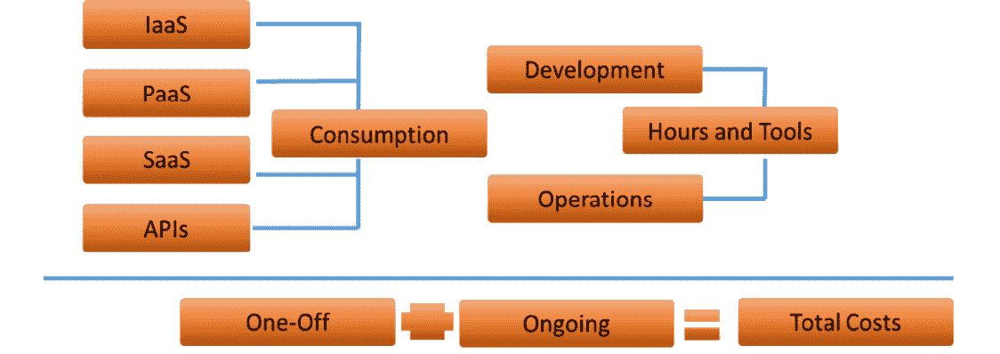
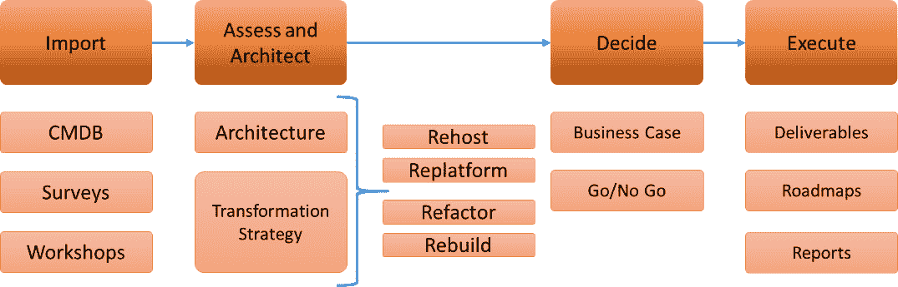
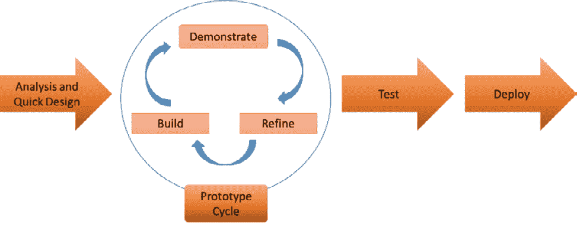
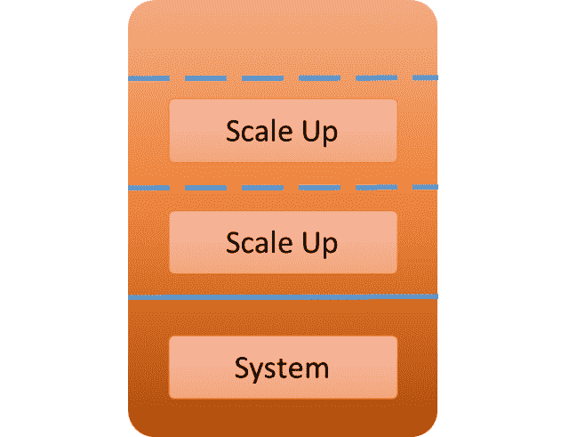
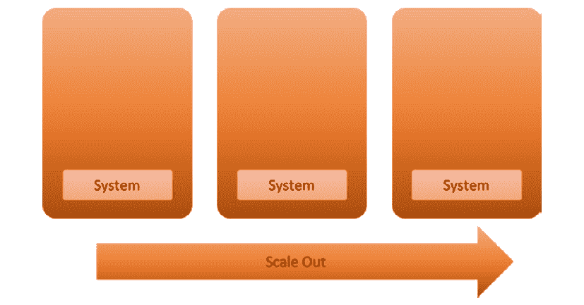
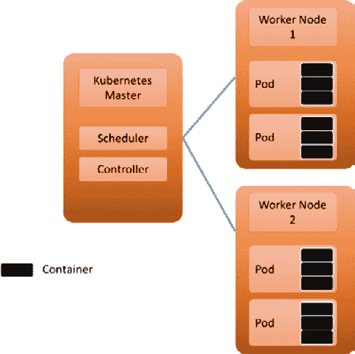
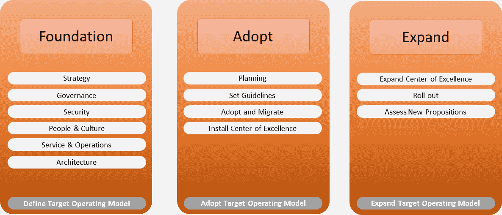

# 第四章：扩展 DevOps

DevOps 最初—并且在一些公司中仍然是—大量依赖手动任务、脚本和临时测试。许多企业集中精力在应用程序上，往往忽视了平台本身——基础设施——而这对扩展同样至关重要。本章重点讨论从技术和组织角度扩展 DevOps。

完成本章后，您将学会如何处理扩展问题。首先，我们将了解现代 DevOps，它采用云计算和云原生技术作为运行应用程序的目标平台。在此之前，我们可能需要对应用程序进行转型；否则，我们将开发新应用程序。在 DevOps 中，我们需要一种适合工作方式的开发方法；因此，我们将讨论**快速应用开发**（**RAD**）。接下来，我们将探讨如何在整个企业中推广 DevOps，从小规模开始，逐步扩展。最后，我们将看看关键任务环境以及如何以 DevOps 模式进行管理。

在本章中，我们将覆盖以下主要主题：

+   理解现代 DevOps

+   与 RAD 合作

+   使用 DevOps 扩展基础设施

+   在企业环境中扩展 DevOps

+   管理关键任务环境与 DevOps

# 理解现代 DevOps

DevOps 的概念并不新鲜。基本上，理念是，如果开发人员和运维人员真正作为一个团队协作，团队的工作就能得到改进。这个原因很容易找到，正如我们在*第一章*中已经看到的，*为企业 DevOps 定义参考架构*。在本节中，我们将学习 DevOps 如何随着时间的推移而发展，以及现代 DevOps 对企业**信息技术**（**IT**）的影响。我们还将研究 DevOps 如何通过应用程序现代化帮助转型遗留应用程序。

许多企业在 1990 年代决定 IT 不是核心业务，可以外包给供应商。通常，所有的管理—运营—工作都外包出去。这不仅在企业内部创造了孤岛，也在企业之间创造了隔阂。随着时间的推移，IT 变得越来越复杂，需求增加，企业发现自己必须找到方法重新掌控 IT，而 IT 已经成为企业核心业务。

2009 年，第一届**DevOps Days**大会在比利时举行。基本理念是：打破孤岛，把开发人员和运维人员重新组织成一个团队，提升软件开发的质量和速度。这些目标依然是 DevOps 的核心，至今未变。

但这并不意味着 DevOps 完全没有变化。主要的区别在于云技术和自动化。这两者是现代 DevOps 的两个最重要支柱，具体概述如下：

+   **云**：早期 DevOps 的一个主要问题是开发和测试系统的可用性。在现代云平台部署中，即使是临时系统也变得更加容易。

+   **云原生**：开发者和运维之间的壁垒已经被打破，但同样的情况也适用于不同平台之间的技术壁垒。在云原生中，系统之间的互操作性已成为标准，随着**平台即服务**（**PaaS**）、**软件即服务**（**SaaS**）、容器技术和无服务器功能的出现，云原生技术逐渐普及。未来 IT 发展的两大趋势可能是从软件到服务以及从**虚拟机**（**VMs**）到容器，推动跨云平台的可移植性，甚至实现本地系统与云系统之间的互通。

+   **自动化**：尽可能实现自动化。这意味着在现代 DevOps 中，我们应该将一切视为代码——不仅是应用程序代码，还包括基础设施、配置和集成。在*第二章*，《*从架构管理 DevOps*》中，我们讨论了应用程序和基础设施部署的流水线，但在现代 DevOps 中，一切都是通过流水线构建的。

+   **所有代码都存储在代码库中**：应用程序、基础设施、工具、治理和安全性都被转化为代码，随着一切成为代码，我们可以将所有内容都纳入流水线。因此，除了应用程序代码的部署流水线和基础设施流水线外，我们还将有工具配置、集成、报告和安全性的流水线。

+   **集成安全性**：对于安全性，我们将使用 DevSecOps，它从“安全即代码”开始。企业的安全姿态被转化为代码，并从一个单一的代码库进行管理。安全姿态的开发与应用程序和基础设施的开发方式相同，都是通过持续改进，而不仅仅是响应攻击、威胁或漏洞。已经开发的代码将立即与安全代码合并，整合安全姿态。安全性与应用程序和基础设施以相同的速度进行开发。本书的*第三章*，《*通过 DevSecOps 架起安全桥梁*》，完全讲解了如何实现 DevSecOps，内容从*第十二章*，《*为 DevSecOps 架构设计*》开始。

+   **增强技术**：现代 DevOps 有时被称为*加速*或智能 DevOps。借助增强的技术，如**人工智能**（**AI**）、**机器学习**（**ML**）和**机器人流程自动化**（**RPA**），自动化可以真正得到利用。举例来说，包括自愈系统或能从先前部署中*自主学习*的代码和流水线。通过 RPA，过程可以高度自动化，若与 AI/ML 结合使用，可以思考部署中的逻辑下一步——例如，通过从测试结果或系统行为中学习。**人工智能 IT 运维**（**AIOps**）就是这一发展的一个很好例子。*第八章*，*构建 AIOps*，以及*第九章*，*将 AIOps 集成到 DevOps 中*，将深入探讨 AIOps。

总结一下，现代 DevOps 更多的是关于这个：

+   涉及所有利益相关者——这不仅仅是开发人员和运维人员的问题，还包括业务经理、安全专家、质量和保障经理以及采购人员（比如许可证问题）。

+   云及云原生技术的采纳，包括容器、函数和自动化服务。

+   用代码思维，因此也要思考流水线。请记住，随着一切皆代码和深度自动化的实施，我们还需要思考信任原则。我们需要确保流水线中的代码和资源是可信的。接下来，谁有责任声明这些资源是可信的，并可以应用到流水线中？是安全工程师，还是可以委托给开发人员？或者，如果我们有遵循**最小权限原则**（**POLP**）的系统，是否可以实现自动化委托？职责分离变得非常重要——需要控制措施来防止未经授权的代码更改。

在本节中，我们讨论了多年来 DevOps 的变化。企业采用 DevOps 的原因是为了整体现代化 IT。企业有着悠久的历史（也包括 IT 领域），因此通常拥有复杂的大型 IT 生态系统以及遗留的应用程序。应用现代化已经成为现代 DevOps 中的重要话题，接下来的部分将讨论这个内容。

## 介绍和理解应用现代化

DevOps、云、自动化和代码是数字化转型的核心原则。但许多企业将拥有长时间运行的核心应用程序：这些遗留系统不适合采用 DevOps，甚至不准备迁移到云端。在本节中，我们将讨论应用现代化的过程：将这些应用程序转化为能够在云端运行的系统，跟上现代技术的步伐，并通过能够更快适应新需求来支持业务。

注意

应用现代化市场非常庞大。许多公司，如 IBM 和富士通，都有大规模的项目，将主机应用程序转换为云提供商，例如**亚马逊网络服务** (**AWS**)，甚至运行**通用商务语言** (**COBOL**)。企业将其旧的主机应用程序转移到云的原因很容易理解。原始代码尽可能保持不变，但从昂贵的本地设备迁移到按使用量付费的云环境，风险相对较低。缺点是公司仍然需要具有 COBOL 编程技能的资源来维护应用程序本身。换句话说，应用程序本身仍然是遗留的，可能无法采用和从新的云原生技术中受益。下一步将是通过重写代码或在全新的应用程序中重建功能来进一步现代化应用程序。

企业可以采用多种策略进行应用现代化，例如以下几种：

+   **重新托管**：这是将现有系统*原封不动*地搬移到另一个目标平台。应用程序被搬移到另一个目标平台时不做任何更改。然而，将应用程序从例如本地环境迁移到 AWS 或 Azure 将意味着一些修改，特别是在连接性方面。这些修改将非常少，并且不会影响应用程序本身。重新托管的常见方法是将包括操作系统和应用程序代码在内的虚拟机导出到新的云环境。这是一种快速迁移应用程序到云的方式，但通过这种方式，企业将不会真正体验到云服务的实际好处。他们只是在另一个数据中心运行他们的机器，即 AWS、Azure 或任何其他公共云提供商的云数据中心。

+   **重新平台化**：通过重新平台化，应用程序被优化以在云中运行。一个非常常见的例子是将数据库重新平台化为 PaaS。数据库实例被移至 AWS **关系型数据库服务** (**RDS**) 或 Azure **结构化查询语言** (**SQL**)，这两者都是由平台管理的本地数据库服务。开发人员仍然可以像以往一样编写数据库程序，但他们不再需要担心数据库平台本身。这些事项由提供商负责处理。

+   **重构**：有时也称为重新架构。在这种情况下，应用程序代码会被修改，以便在云中以优化的方式运行。会应用云原生服务。应用程序代码可能会被重写，以便在容器中运行或使用无服务器功能。应用程序的功能保持不变：仅底层技术发生变化。以本节开头的 COBOL 示例为例：COBOL 代码可以重写为 C#或 Java。然而，架构师和工程师首先需要将业务逻辑与代码本身解耦。如果业务要求修改业务逻辑，那么策略就变为重建。

+   **重建**：在重建的情况下，架构师首先重新验证应用程序的功能。业务所需的功能是什么？哪些数据将被使用，这些数据如何转化为应用程序的使用？接下来，应用程序将根据验证后的业务和技术需求进行重建。功能恢复，技术完全重新审视，应用程序被重建。

现在，重新托管在成本方面不会带来真正的好处。只有当应用程序被重新平台化或重构时，才可能实现成本节省，因为云资源的使用将得到优化。

重建是另一个故事。这可能会导致重大项目，从而产生项目成本。只要应用准备好在云端投入生产，就可能实现可观的节省。然而，企业需要考虑总体拥有成本，因此需要将项目成本和重建应用可能带来的风险纳入考虑。企业架构师在提供建议和支持决策方面发挥着重要作用。下图展示了云成本组成部分的一个非常简单的概览：

图 4.1 – 云和 DevOps 成本的简单概览

企业以及负责的架构师应该采取哪些步骤开始应用现代化？让我们在这里看看：

+   **导入**：架构师收集与应用相关的所有数据。他们可以通过分析**配置管理数据库**（**CMDB**）中的信息，使用工具扫描应用程序，或者通过与利益相关者（如业务和应用所有者）进行研讨会来实现这一目标。

+   **评估和架构设计**：下一步是评估所有数据。架构是什么样的，它如何与现代的——云——架构进行映射？在这一阶段，目标架构被定义，同时也定义了*未来的操作模式*，即应用程序的执行和管理方式。DevOps 工作模式和**持续集成/持续开发**（**CI/CD**）流水线被纳入未来架构中。这定义了转型的方法。简而言之：在这一阶段，架构师定义了*什么*（应用程序和架构的样子）和*如何*（如何将当前应用程序转型为现代应用程序）。*什么*和*如何*共同构成了解决方案。

+   **决策**：所有相关方面的信息都已传达给利益相关者：应用程序的功能、技术实现、风险和成本。商业案例已得到验证，基于此，做出了是否继续的决策。

+   **执行**：项目启动。交付成果和技术路线图已在功能、产品待办事项和任务中定义。组件被细化并纳入构建迭代周期中。测试被执行，验收标准被验证，**完成定义**（**DoD**）随着项目进展逐步签署确认。

下图展示了应用程序现代化的高层次过程：

图 4.2 – 应用程序现代化的高层次过程

总结来说，应用程序现代化包含以下内容：

+   一个引人注目的商业案例。现代化一个应用程序是否值得？该应用程序对业务的重要性有多*核心*？

+   一项引人注目的策略。是重新平台化、重构，还是重建？或者，是否明智的做法是先进行简单的“提升和迁移”到云端，并在新平台上开始转型？

+   一份引人注目的计划。是否已经识别出风险？团队是否具备缓解这些风险的正确技能和工具？了解了风险之后，计划在多个迭代周期内可行吗？

我们讨论了传统应用程序以及企业如何对这些应用程序进行现代化，但企业还将开发新代码并推出新的或改进的服务。由于我们在 DevOps 模式下工作，我们必须关注一种能够跟上这一进程的开发方法论。RAD 是一种解决方案，我们将在下一节中学习 RAD。

# 与 RAD 合作

到目前为止，我们讨论了 DevOps 如何打破开发人员和运维人员之间的壁垒，以及它如何帮助加速产品、服务和系统的开发。实施 DevOps 将提高开发速度，但 DevOps 本身仅仅是规划开发的一种方式。它有助于以迭代方式进行规划：从**最小可行产品**（**MVP**）开始，然后在下一版本中进行迭代改进。DevOps 不是关于代码本身的开发。我们需要一种开发方法来编写代码，但这种方法应该与 DevOps*相契合*。在本节中，我们将讨论 RAD。

为什么 RAD 适合 DevOps 和敏捷工作方式？主要原因是 RAD 本身就是敏捷的。RAD 从原型设计（MVP）开始，然后专注于迭代。重点是满足需求，而不是规划。它允许开发人员在开发周期中快速实现改进和调整。

RAD 的关键原则还有代码的重用和利益相关者之间的密切合作：业务代表、架构师、开发人员、测试人员、工程师以及最终将使用该软件的客户。代码不断地进行审查、测试，并根据需求进行验证，这些需求通过小的改进来实现。通过这种方式，最终产品不符合规格的风险更小。团队对每一个小步骤都有完全的控制权。

为了根据 RAD 进行开发，团队需要遵循以下五个基本步骤。这些步骤与 DevOps 的原则完全一致：

1.  **定义需求**：收集业务需求，设定范围、预算、时间表和验收标准。让所有利益相关者签字确认，以确保每个人都同意交付物和最终产品。

1.  **构建**：开发从 MVP 开始。接下来，MVP 会经过迭代改进，直到最终产品交付。请记住，在 DevOps 中，开发人员和运维人员需要就产品达成一致，因此他们必须密切合作。运维是否能够管理应用程序，或者它能否进行改进？在 *第五章*，《*通过 SRE 架构下一个层次的 DevOps*》中，我们将学习运维如何推动开发中的改进，例如自动化。

1.  **收集反馈**：我们在前一章中了解到，DevOps 接纳持续测试作为质量衡量标准。这意味着反馈会不断被收集。这是技术性反馈和功能性反馈。开发人员使用这些反馈来改进下一次迭代或版本。这也是 DevOps 文化的一部分：反馈不应被视为批评甚至是判决。反馈实际上是一个改进项目质量的工具。

1.  **测试**：与收集反馈相结合，软件需要持续测试。代码是否正常工作，是否符合需求？测试可能是 DevOps 项目中最重要的事情之一。在*第三章*中，我们讨论了测试策略和不同类型的测试。

1.  **发布**：如果产品已达到最终状态，则可以进行上线并投入使用。在发布时需要注意的两个问题是用户培训和后期维护阶段。用户需要学习如何使用产品和软件，并且要准备好在产品投入生产并实际使用后，可能仍然会出现问题。在后期维护模式下，团队仍然可以快速解决这些问题。

    然而，DevOps 已经在其内部解决了这个问题。问题产生反馈，并被回馈到项目中，推动改进。实际上，团队会创建*快速通道*，以便优先处理生产环境中的问题。这可能会暂停产品的进一步开发和新功能的开发。正是这一点在**站点可靠性工程**（**SRE**）中得到了处理，这也是下一章的主要话题。

总结来说，RAD 过程如图所示：

图 4.3 – RAD

在本节中，我们学习了如何在 DevOps 项目中整合软件开发。软件需要基础设施来运行。在下一节中，我们将讨论扩展基础设施。

# 使用 DevOps 扩展基础设施

现代 DevOps 的一个关键特性是使用云技术。在本节中，我们将讨论为什么企业通过将基础设施迁移到 AWS、Azure 等云平台中能获得巨大的好处。首先，我们将研究扩展的原理，因为这是使用云基础设施的主要好处之一。在本节的最后，我们还将探讨容器的下一层级扩展，因为在未来几年，将会从虚拟机（VM）转向容器。

在 DevOps 项目中，开发人员使用管道，如我们在上一章所见。代码从代码库中拉取，修改，测试，并推送到下一个阶段。代码遵循一个晋升路径：从开发到测试、验收，最终到生产系统。开发和测试系统可能并不总是需要的；它们只需在流程中需要时出现。如果工作完成，这些系统可能会被暂停或甚至退役。云的好处在于，如果这些系统未使用，企业无需为其支付费用，这与作为一次性投资购买的本地硬件相矛盾。因此，按需扩展开发和测试系统是云基础设施的一个巨大优势。

现代 DevOps 的另一个重要特性是自动化。使用云基础设施的一个主要好处是能够实现自动扩展。然而，架构师和工程师可能需要在自动扩展方面小心一些。确实，企业在云中按需付费，而在传统的工作方式中，企业在需要额外容量时必须购买物理机器。其优点是，架构师真的需要考虑所需的容量。

在云中，可能不再有需要担心容量的驱动因素。然而，这种想法是完全错误的。在需求高峰和没有设置限制的自动扩展情况下，云账单可能会让人吃惊。因此，企业，特别是财务人员，应该不完全依赖扩展。换句话说，架构师仍然需要承担规划容量的责任。

现在，让我们学习不同的扩展类型，如下所示：

+   **纵向扩展或纵向扩展**：我们以一台服务器为例来解释这个概念。该服务器有一个处理器、2 **千兆字节** (**GB**) 的内存和 100 GB 的磁盘存储。如果我们进行纵向扩展，我们会向该服务器添加处理器、内存或磁盘存储。我们将资源添加到同一台机器上，从而提高其容量。只要服务器有空间添加资源，就可以这样做。我们可以想象，在虚拟的编码世界中，这比在物理机器上容易得多，因为工程师们真的需要拿出螺丝刀来安装，例如，额外的内存条。下面的图示展示了纵向扩展的原理：

图 4.4 – 纵向扩展或垂直扩展

+   **横向扩展或横向扩展**：现在，我们向环境中添加更多的服务器，而不是增加服务器内部的资源。这在公共云中非常常见，特别是当我们使用负载均衡器来处理流量并将工作负载分配到可用服务器时。通过自动扩展，当负载增加且现有服务器无法处理而不降低性能时，可以自动添加服务器或服务器池。一旦负载减少，环境会再次缩小。负载均衡器—比如 AWs 中的 **弹性负载均衡** (**ELB**)—确保负载均匀分配到可用资源上。

    然而，请记住，应用程序需要具有*扩展感知*。有些应用程序根本无法处理扩展，而有些则可以进行横向扩展，但如果进行纵向扩展，会影响应用程序的可用性。以下图示展示了水平扩展的原理：

图 4.5 – 横向扩展或水平扩展

+   **完全或动态扩展**：这是垂直扩展和水平扩展的结合。一旦达到向上扩展的限制，环境可以进行向外扩展。在大多数情况下，水平扩展是通过克隆服务器来完成的。在 Azure 中，我们可以使用 Azure Automation 来执行此操作。在 AWS 中，我们可以复制服务器的镜像，然后使用 **弹性计算云**（**EC2**）和 AWS Systems Manager Automation 启动新机器。当然，还有许多第三方工具也可以帮助自动化扩展。

在云中进行扩展有明显的好处。我们可以根据需求获取资源，按需扩展到特定时间所需的容量。由于我们只为使用的部分付费，因此如果不再需要资源，可以通过缩减资源来节省开支。例如，开发和测试系统可能并不总是需要，工作完成后可以暂停使用。也许团队可以完全停用这些系统，只需在项目需要时立即启动新的系统。

最好的一点是，DevOps 团队可以完全自行控制这一过程——他们不再依赖于采购部门来订购硬件或要求工程师将其安装到数据中心。所有这些都是代码，包括扩展集，并且可以完全集成到管道中，随时待命。

## 使用容器进行扩展

IT 基础设施即将发生一个重要变化，即从虚拟机（VM）迁移到容器。推动这一变化的原因是不同平台之间系统的互操作性。容器似乎是一个非常好的解决方案，能够使软件在不同平台之间实现互操作性，并具备最终的可扩展性。然而，架构师需要考虑几个方面。首先，他们必须明白容器也需要一个基础设施来承载。容器本身无法独立运行。

容器在计算集群上运行，管理层使得资源共享和任务调度能够在容器内的工作负载之间进行。资源是计算集群，即一组服务器——通常称为节点——用来托管容器。管理或编排层确保这些节点作为一个整体来运行容器并执行容器内部构建的进程——即任务。

集群管理跟踪集群中资源的使用情况，如内存、处理能力和存储，然后将容器分配给这些资源，以便以优化的方式利用集群节点，并确保应用程序运行良好。

换句话说，扩展容器并不完全是关于容器本身，而更多的是关于扩展底层基础设施。为了简化这一过程，Google 发明了一个叫做 Kubernetes 的编排平台，它负责集群管理。Kubernetes 使用 pods，允许不同容器之间共享数据和应用代码，形成一个统一的环境。请字面理解上一句话。Pods 遵循**共同命运**原则，这意味着如果 pod 中的一个容器失败，所有容器都会一起崩溃。

下图展示了 Kubernetes 的基础工作流程：

图 4.6 – Kubernetes 的高层架构

不过，好消息是，pods 可以通过复制控制器进行复制。Kubernetes 会检查指定数量的 pods 是否在集群节点中运行。如果需要，pods 会被复制，确保指定数量的容器正在运行。

容器是一个很好的解决方案，但仍然存在一些不足之处。最重要的一点是，容器和集群可能是互操作的，但通常网络和存储层并非如此。为了扩展容器解决方案，我们还需要网络和存储层的*集成*。例如，Azure Blob 与 AWS 的**简单存储服务**（**S3**）完全不同，但 Kubernetes 可以在两个平台上运行，使用**Azure Kubernetes 服务**（**AKS**）和 AWS 的**弹性 Kubernetes 服务**（**EKS**）。虽然会有解决方案来克服这一点，但在规划容器平台时，绝对需要考虑到这一点。

# 在企业环境中扩展 DevOps

我们已经讨论了 DevOps 的好处，以及云计算的采用、自动化和敏捷工作方式如何为企业带来改变。现在的大问题是：*如何开始，在哪里开始？* 这里的看法各不相同，从**爆炸式方法**到逐步实施。

那些将大量 IT 工作外包给不同供应商，并且已经在某种方式下工作了几十年的企业，并不容易改变。首先，员工会有很大的抵触情绪——记住，DevOps 不仅仅是关于技术的变化，它同样涉及到心态或文化的改变。在这一部分，我们采取逐步采用的方法，或称演进而非革命。

这里有一些建议：

+   **从小做起**：不要一开始就把 DevOps 实施在大型项目上。组织一个小团队和一个简单的项目来学习——更重要的是——识别流程中的可能瓶颈。是什么可能阻碍 DevOps 的工作方式？资源是否具备所需技能，团队是否由合适的人员组成？团队是否具备所需的工具？即使是一个简单的构建，需求是否明确？流程是否与 DevOps 对齐？从瓶颈中学习，并在每个步骤中改进。

+   **从最终目标开始**：要清楚你要去哪里，最终的产品会是什么样子。分小步迭代工作并不意味着团队不需要对项目的最终目标有明确的了解。同样，在企业中实施 DevOps 也适用。从企业架构的角度，必须清楚该企业的战略是什么：它在 1 年、3 年或 5 年后会处于什么位置？定义企业的路线图有助于设定目标。以下图示给出了一个示例：

](img/B17492_04_007.jpg)

图 4.7 – 企业采用 DevOps 的路线图

上面的截图显示了三个基本阶段，概述如下：

- **基础**：架构师定义目标操作模型，基于涵盖应用、技术、安全、服务和治理的参考架构。在这个阶段，云采用是一个重要话题：主要的云平台，如 Azure、AWS 和 Google Cloud，都拥有**云采用框架**（**CAFs**），它们将在云中运营系统的基础搭建中提供帮助。

- **采用**：这一阶段是关于采用基础和目标操作模型。云环境已经设置完毕，并且在 DevOps 模式下启动了第一个——小规模——项目。可以引入**基础设施即代码**（**IaC**）和 RAD 等概念。实施的方法之一是建立一个**卓越中心**（**CoE**），由**主题专家**（**SMEs**）组成，他们可以在模型的采用过程中提供指导，包括云技术、DevOps 工具的使用以及敏捷教练帮助实施敏捷工作方式。在下一节中，*通过 CoE 进行扩展*，我们将讨论 CoE 的设置。

- **扩展**：我们已经有了参考架构，定义了目标操作模型，并指派了一组专家参与卓越中心（CoE），帮助采用新模型并交付首批项目。在这个阶段，模型可以在企业中进行扩展。

+   **确保所有步骤都是可见的**：透明度是 DevOps 的关键。这适用于团队内部的工作方式以及产品交付过程。工具必须能够提供开发和发布链中发生的事情的完整可视性，即 CI/CD 管道。理想情况下，团队应该有一个单一的视图来观察发布链中的事件：这些工具能够从管道和系统中收集实时数据。但同样，团队成员需要清楚其他成员的工作内容，因为 DevOps 本质上主要是关于紧密合作。团队成员需要能够跟踪活动、预见问题，并在必要时进行纠正。最终目标是更好的产品。

+   **随时准备迎接变革**：这一点看起来显而易见，但在 DevOps 中，没有什么是石刻定案的。如果某些方面可以改进，团队应该被激励去采纳那些能够促进改进的变化。这不仅适用于 DevOps 团队及其项目，也适用于整个企业。即使是世界上最大的企业，也时不时需要按下刷新按钮，借用微软**首席执行官**（**CEO**）萨提亚·纳德拉的说法。

我们已经介绍了 CoE。在接下来的部分，我们将详细阐述这一点。

## 使用 CoE 进行扩展

一个起点可以是一个 CoE（卓越中心）。再次强调，这听起来像是个大事情，但其实不一定。相反，CoE 可以是开始转型企业的一个良好切入点。CoE 是一个团队，负责领导或支持员工和组织采用、迁移并运营新技术，甚至是一种新的工作方式。简而言之，CoE 可以是企业数字化转型的起点。与其试图一口气改变整个企业，我们可以指派一个团队来引导这一过程。CoE 的主要目标是定义并帮助实施最佳实践，推动架构实施、转型和优化运营，以及实现治理。

CoE 的安装也应该分步骤进行，首先是定义标准和政策的 CoE。因为这个原因，架构师应该是 CoE 的成员。接下来，CoE 定义*守护轨道*，确保使用最佳实践。不要重新发明轮子，而是使用已经存在并在其他企业中经过验证有效的方法。但这也有风险。风险在于，团队可能会把事情做得太大。

一个常用的框架来实施敏捷工作方式是**SAFe**，即**规模化敏捷框架**。它可能包括实施 Spotify 模型，并设置 tribes（部落）和 squads（小队）。对于任何公司来说，这些都是巨大的变化，即便只是在一个团队中进行，也会影响整个企业，尤其是当 IT 外包并且供应商的资源需要参与新组建的小队时。企业与供应商之间的合同是否考虑到了这种新的工作方式？没多久，我们就可能在实施一个征服全球的计划。

这并不意味着我们不能使用 SAFe 的原则，但我们需要确保它*适合*并且能够被采纳。CoE 可以帮助定义和控制采纳的关卡，并提出改进建议。这种类型的 CoE——仍然是一个小团队——被称为规范性 CoE。

CoE 的下一个级别是咨询级别。在这个阶段，CoE 作为一个由不同领域的**SMEs**（领域专家）组成的（虚拟）团队，积极帮助 DevOps 团队执行项目。CoE 负责制定标准和政策，并控制和验证是否遵循这些标准和政策。从这一点开始，DevOps 和敏捷的实施加速，打破了原有的组织壁垒。然而，这一过程是一步一步进行的。

从小团队的简单项目开始，DevOps 和敏捷似乎并不适合开发和运行关键任务环境。但事实并非如此。企业可能想要从关键任务开始，但如果 DevOps 得到了适当的扩展，并且有清晰的应用现代化计划，我们也可以以 DevOps 的方式开始管理关键环境。本章的最后一节，*使用 DevOps 管理关键任务环境*，将进一步解释这一点。

# 使用 DevOps 管理关键任务环境

在本节中，我们将讨论 DevOps 在关键任务环境中的应用，以及为什么它能够用于管理核心应用程序。首先，我们来定义一下**关键任务**。

一个非常直接的定义是：任何企业为了保持业务运营所需的软件。如果一个关键任务系统发生故障，企业可能会损失大量资金，无论是因为直接的交易丧失，还是由于一些较为无形的损失，例如声誉损害。这些系统通过**业务影响分析**（**BIA**）过程进行识别。

当我们开始 DevOps 项目时，架构师首先做的事情是收集业务和技术需求。这将包括 BIA 过程的结果，通常是与内部审计员和业务利益相关者合作完成的。通过 BIA，能够识别出在这些系统发生故障时需要迅速恢复的关键系统或系统组件。这是一个非常繁琐的过程，会引发很多讨论。

企业架构师需要理解，利益相关者对于什么是关键系统可能有不同的看法。银行的金融系统是业务关键的，但如果一家汽车工厂的**首席财务官**（**CFO**）无法访问财务报告——假设是一个小时左右——该工厂的业务不会立即受到影响。然而，如果该工厂的组装机器人发生故障，生产将立即停止。

企业仍然不愿意将关键系统托管在公共云中，因为他们认为如果这些系统不位于工程师在紧急情况下可以立即进入的私有数据中心，他们就会失去对系统的控制。然而，公共云可能是托管这些系统的最佳选择。由于这些平台具有巨大的容量，很容易在不同的区域和可用区内复制关键系统。如果一个云数据中心发生故障，第二个数据中心可以接管。使用云技术，可以最小化数据丢失的风险。云技术提供了构建更具弹性环境的工具。

DevOps 在哪里发挥作用？它体现在起草**业务连续性计划**（**BCP**）中，BIA 是该计划的输入。没有真正的技术原因说明为什么关键任务系统不能托管在云端并通过 DevOps 开发和管理，但考虑到这些系统需要具有高度的弹性，有几个问题需要考虑——例如，在计划和应用变更时。

注意事项

关于没有真正的技术原因表明关键任务系统不能托管在云中的说法，还有一个细节需要注意：延迟可能是一个问题，即信息在系统之间传输所需的时间。另一个原因可能是法律和法规要求的合规性。一些组织根本不允许将系统托管在不位于其所在国家或地区的云数据中心。这些也是在进行 BIA 时需要考虑的因素。

DevOps 中的一个持续主题是 CI。这伴随着变更，而变更也会对业务连续性产生影响。对于关键系统，我们必须确保发布过程的设计能够保障业务连续性。因此，质量保证至关重要。

首先，代码创建后要尽快进行测试。对于关键系统，测试必须集中在确保代码推送到生产环境时，企业的关键业务流程不受影响，或者影响非常有限，并且是以事先明确接受的风险水平进行的。接下来，确保有回退、回滚或恢复机制。

团队如何确保他们计划发布的内容是*安全可行*的？答案是进行上线运行。这里，我们在 *第三章*，*为 DevOps 质量构建架构* 中讨论过的推广路径起到了关键作用。上线运行是一项在接受系统上经过测试的代码的实际操作。该系统的规格应该与生产系统完全相同。更好的是：接受系统是生产的精确副本，它们是类生产系统。上线运行是在 CI/CD 管道中完成的，使用代码并将其处理并推送到接受系统。但这不仅仅是代码的问题。流程、安全性、故障转移到不同的系统以及恢复程序也必须进行测试。DevOps 工具需要能够支持这一点，作为业务连续性计划（BCP）或框架的一部分。

本章结束。在最后一节中，我们讨论了弹性和可靠性。在 *第五章*，*与 SRE 一起构建下一代 DevOps* 中，我们深入探讨了如何通过 SRE 架构来实现可靠性。

# 总结

本章涵盖了很多内容。在大型传统企业中，开始实施 DevOps 并不容易，但这是可能的。在本章中，我们了解到可以从小规模开始，然后逐步扩展。小规模开始并不意味着企业不需要有明确的最终目标：企业架构师在定义目标运营模型以及企业未来如何开发和运营产品方面扮演着关键角色。拥有专业领域专家（SMEs）的卓越中心（CoE）可以在这一转型中提供指导。

公司很有可能有一些遗留环境需要进行转型。我们已经讨论了现代 DevOps 和使用云技术及云原生技术。我们还了解了不同的应用程序转型策略，以及如何在 DevOps 模式下使用 RAD 开发新应用程序。

在最后一节中，我们还了解到，即使是关键任务系统，如果我们专注于这些系统的弹性和可靠性，也可以以 DevOps 方式进行开发和管理。SRE 是实现这一目标的方法。我们将在下一章学习 SRE 中的架构内容。

# 问题

1.  我们正在将一个应用程序从本地系统迁移到 Azure。SQL 数据库已迁移到 Azure SQL 作为 PaaS 解决方案。我们称这种迁移策略为什么？

1.  请列出 Azure 和 AWS 提供的 Kubernetes 服务。

1.  要评估业务关键系统，我们需要分析这些系统的需求。这种分析的方法论是什么？

# 进一步阅读

*现代 DevOps 宣言* ([`medium.com/ibm-garage/the-modern-devops-manifesto-f06c82964722`](https://medium.com/ibm-garage/the-modern-devops-manifesto-f06c82964722))，作者：Christopher Lazzaro 和 Andrea C. Crawford，2020 年
