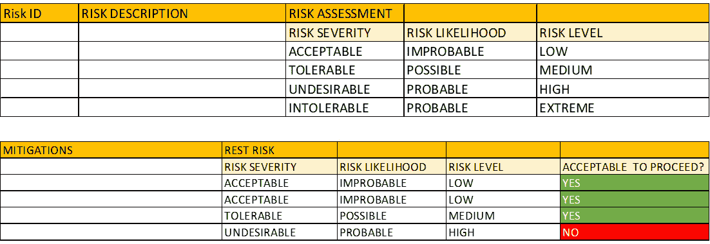
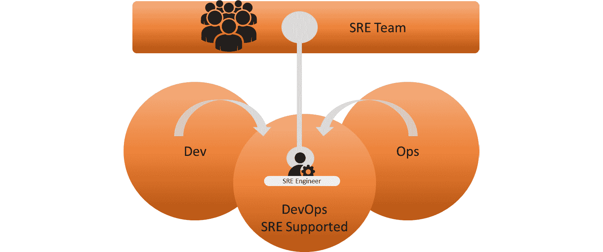
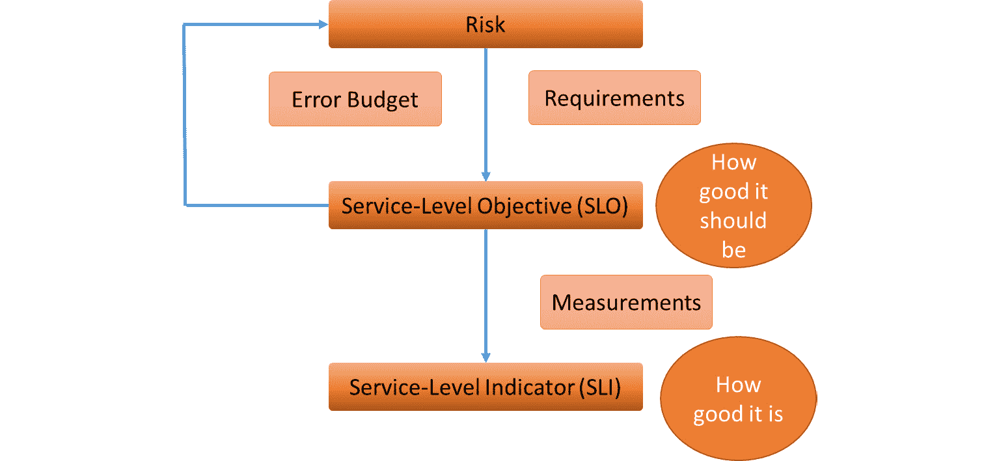
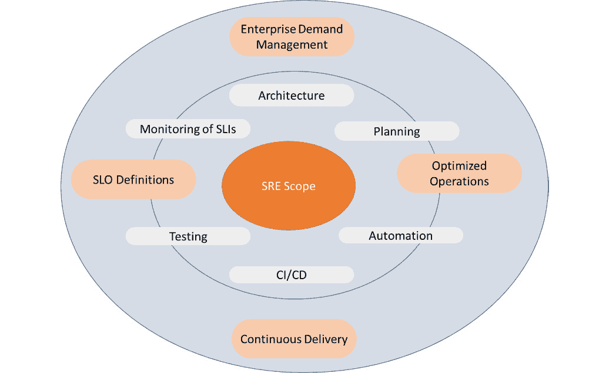
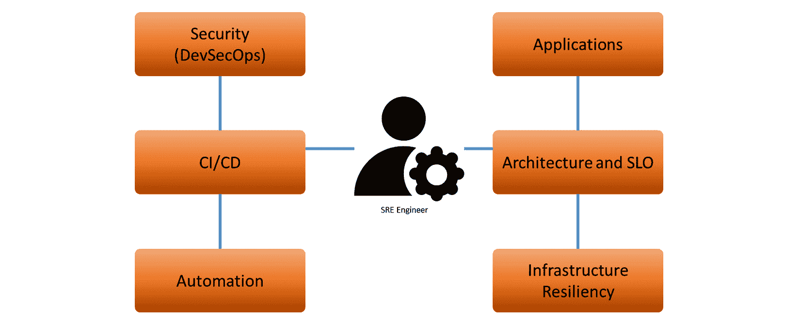
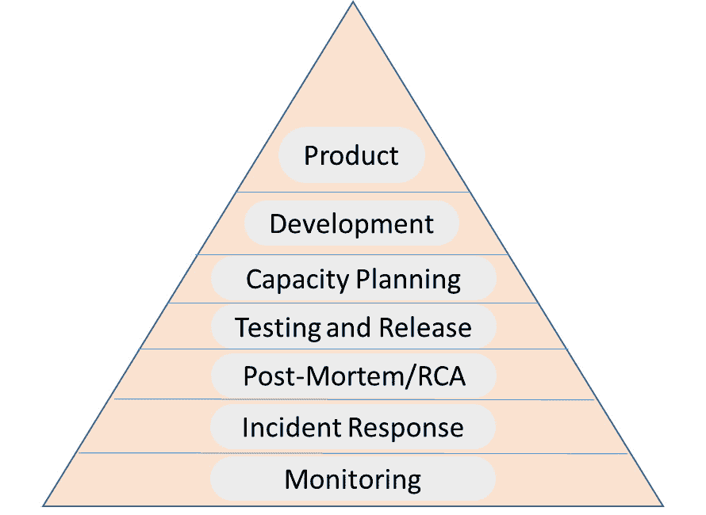

# 第五章：利用 SRE 架构下一代 DevOps

在前面的章节中，我们讨论了 DevOps 的来龙去脉。之所以叫 DevOps，是有原因的，但实际上，Dev 通常更被强调：通过加速开发来创造敏捷性。**站点可靠性工程**（**SRE**）则更强烈地关注运维。那么，在开发交付的产品越来越多，速度越来越快的情况下，运维如何生存下去呢？答案就是 SRE 团队，通过使用错误预算和艰苦工作来应对。

完成本章后，你将了解 SRE 的基本原则，以及如何帮助企业采纳和实施这些原则。你将对如何为 SRE 定义**关键绩效指标**（**KPI**）以及这些指标将为组织带来哪些好处有一个清晰的理解。

本章我们将涵盖以下主要内容：

+   理解 SRE 的基本原则

+   评估企业是否具备 SRE 准备条件

+   使用 KPI 架构 SRE

+   实施 SRE

+   从 SRE 中获得商业价值

# 理解 SRE 的基本原则

在这一部分，我们将简要介绍 SRE，这一方法最早由 Google 发明，旨在解决 Google 因推出大量新开发而完全被运维工作淹没的问题。SRE 有很多定义，但在本书中，我们将使用 Google 自己的定义：如果你允许一名软件工程师设计运维，所发生的事情就是 SRE。

基本上，Google 解决了开发和运维之间的鸿沟。开发人员因需求改变代码，而运维则尽力避免因这些变化导致服务中断。换句话说，开发和运维团队之间总是存在某种紧张关系。我们将在本章中进一步讨论这一点。

那么，SRE 是下一个级别的 DevOps 吗？这个问题的答案是：SRE 在 Dev 和 Ops 之间架起了一座桥梁。基于此，接下来的问题自然是：这座桥梁有必要吗？在下一部分中，我们将了解到，仅仅将开发和运维放在同一个团队中是不够的。两者之间存在天然的利益冲突。因此，企业需要做更多的工作，才能真正从 DevOps 模式中获益。这正是 SRE 所做的事情。

SRE 中的关键主题包括可靠性、可扩展性、可用性、性能、效率和响应。这些内容被整合为七个原则——摘自 SRE 工作手册——与架构相关：

+   **运维是一个软件问题**：这是 SRE 的出发点。软件会变化，但运维需要保持稳定，以确保服务不被中断。这意味着软件需要具备弹性并经过严格的测试。

+   **根据服务级目标（SLOs）工作**：为服务设定明确的目标。一个应用程序的可用性应该是什么？这些不仅仅是 IT 相关的目标。商业需求首先设定了参数。这意味着项目必须与业务利益相关者紧密合作，以定义目标。

+   **尽量减少无意义的劳动**：我们将进一步讨论“无意义的劳动”（toil），但从原则上讲，它指的是单纯的工作。此外，无意义的劳动是指可以通过自动化避免的手动工作。基本上，SRE 的目标是尽可能让计算机为你完成工作。

+   **自动化**：在第三条原则之后，这一点是合乎逻辑的。如果可以自动化，就应该这样做。

+   **快速失败**：失败是可以接受的，只要它在非常早期就被发现。在早期阶段修复问题，其影响要远远小于在开发和部署周期的后期阶段发现并修复问题。而且，早期发现并解决问题将降低成本。

+   **每个团队成员都是所有者**：这一点需要稍微解释一下，尤其是在大型企业中，我们通常会有矩阵式的组织结构。再一次，记住很多企业采用外包模式，其中特定供应商负责基础设施（平台），而其他供应商和企业本身负责应用程序（产品）。在 SRE 中，这些边界是不存在的。产品和平台团队共同承担最终产品的责任。因此，产品和平台团队需要对每个组件有相同的看法：应用程序代码、前端系统、后端基础设施以及安全规则。它们都是项目的平等所有者。

    注意

    我们将在*第六章*中详细讨论这个问题，*架构中的运营定义*，我们将在那里了解平台运营和产品运营。

+   **使用统一的工具集**：所有团队使用相同的工具。你可以有多个 SRE 团队，但他们都使用相同的工具。这样做的原因是，企业需要花费过多时间来管理不同的工具集，而不是专注于项目交付。SRE 的核心也是专注。

没有办法仅用几段话甚至一个章节总结 SRE。本节只是一个非常简短的介绍。不过，SRE 可以为企业带来很多东西——前提是企业已经为此做好准备。SRE 也意味着工作方式和组织的改变。在下一节中，我们将进一步了解这些内容。

# 评估企业是否具备 SRE 准备条件

在上一节中，我们介绍了 SRE 并讨论了基本原则，但并没有抱有全面阐述的雄心。涵盖整个 SRE 将会填满超过 500 页的书；我们仅提供了最重要部分的快速概览。那么问题来了：我如何知道我的公司是否准备好采用 SRE？我们将在本节中探讨一些 SRE 准备度的标准。

实施 DevOps 的公司常见问题之一是开发人员和运维人员并没有真正合作。他们可能坐在同一个团队里，但开发人员写完代码后，仍然会在认为代码完成时把它*扔到另一边*交给运维。原因在于开发和运维的工作心态不同。开发人员想要变革，他们根据业务需求进行任务分配，改进或构建新的应用程序。而运维人员则不希望有这样的变动，他们的主要兴趣是确保系统稳定，避免因故障或变更而导致的停机。因此，最初就存在利益冲突。

问题是如何弥合这种冲突。SRE 是对此的答案。然而，SRE 是一种方法论，只有当团队准备好采用这种方法论时，它才能成功。所以，我们需要评估的第一件事就是文化。没错：企业架构师在其中确实起着作用。这关系到流程以及让人们采纳这些流程。记住，架构不仅关乎*什么*，还关乎*如何做*。

## 重新定义风险管理

开发人员会修改代码；运维人员需要确保系统保持稳定，以便业务不受影响。变更可能导致停机。如果停机是计划好的，那么就无需太担心。关键在于未计划的停机。因此，我们需要关注减轻因变更而引发的意外故障的风险。为了避免故障，系统需要可靠且具有弹性。由于在 DevOps 中，迭代和变更是持续部署的，因此设计可靠性的需求变得越来越重要。架构师需要以这样的方式设计系统，使其能够在不干扰服务的情况下应对变更。

首先，让我们统一一下风险管理的定义。基本规则是，风险等于概率乘以影响。企业使用风险管理来确定实施措施的商业价值，这些措施能够限制概率和/或影响——或者用 SRE 术语来说，风险管理用于确定可靠性工程的价值。此外，它还定义了为防止、减少或转移风险而进行的投资水平。

风险管理用于在 SRE 团队的产品待办事项中优先考虑可靠性措施。这是通过遵循称为 PRACT 的风险矩阵来实现的：

+   **预防**：完全避免风险。

+   **减少**：降低风险发生的影响或可能性。

+   **接受**：接受风险的后果。

+   **应急措施**：当风险发生时，计划并执行相应的措施。

+   **转移**：风险的后果被转移，例如转移给保险公司。

风险矩阵的一个示例在下面的模板中提供：

图 5.1 – 风险评估模板

首先，我们需要识别并评估风险。风险是什么？它发生的几率有多大？它的影响会是什么？这些内容显示在图的上半部分。接下来，我们需要考虑减缓措施，即可以或必须采取的行动，以防止风险或减少风险的影响。当减缓措施降低了风险水平时，会有风险残留。此时，团队需要评估这些残留的影响以及是否可以接受。

如果故障的影响很大，那么值得考虑采取一种能够防止风险的策略。这将推动 SLO（服务级目标），即系统应该达到的标准。如果可用性设置为 99.99%，那么错误预算只有 0.01%。这对系统架构有影响；毕竟，风险评级允许每年最多 52 分钟的停机时间。架构需要考虑到这一点，例如，采用镜像的热备份系统，一旦主系统发生故障，可以立即接管。

那么代码呢？编写具有弹性代码的关键要素有两个：

+   源代码需要保存在一个具有强大访问和版本控制的安全仓库中。代码更改需要完全可追溯。

+   自动化的持续测试，以便在开发和部署的每个阶段检测代码中的缺陷。测试和自动化可能是架构师在 DevOps 中最需要关注的功能，以确保代码的弹性和安全性。

即使我们作为架构师已经做了所有防止系统停机或软件故障的工作，我们仍然会不时遇到问题。SRE 中的一条重要规则是无责事后总结（blameless post-mortem）。我们将在 *使用 KPI 进行 SRE 架构设计* 部分讨论这一点。

## 重新定义治理

DevOps 已经假定团队以高度自主的方式工作，这意味着他们负责整个产品的全生命周期。这需要不同的治理方式。在上一章中，我们讨论了卓越中心作为一种组织形式，用于引导和支持 DevOps 团队。卓越中心定义了整体企业路线图和框架，提供了开发和管理系统的指导方针。

目前，DevOps 仍然是关于开发和运维，实际上它们仍然是分开的。SRE 团队没有这种划分。因此，SRE 团队与 DevOps 团队是不同的。SRE 团队是跨领域的，这意味着他们关注系统监控、日志记录、事件处理和自动化。他们帮助开发和实施自动化，还在 DevOps 过程中发布时提供建议和指导。SRE 工程师能够帮助定义系统架构，但也能通过提供最佳实践和选择合适的工具来推进企业架构。

有三种方式来建立 SRE 团队：

+   **拥有专门的 SRE 工程师的团队**：这些团队与 DevOps 团队是分开的，但支持 DevOps 团队。一个大优势是，许多团队和不同的项目能够同时得到支持，且使用相同的愿景、工具和流程，从而提高了不同项目的整体质量。

+   **嵌入式模型**：SRE 工程师嵌入到 DevOps 团队中。这种方式的优点在于，SRE 工程师能够专注于他们所分配项目中的特定问题。

+   **分布式 SRE 模型**：在这种模型中，SRE 团队更像是一个卓越中心，团队中的专家可以被咨询以解决问题。

一个典型的 SRE 定位方式如以下图所示：

图 5.2 – SRE 在 DevOps 中的位置

必须明确的一点是，SRE 要求文化上的变革。SRE 专注于改善运维，同时也促进高效的开发和发布。这通常意味着，SRE 专家需要对技术和流程进行高度标准化。如果开发和运维得到了标准化，那么自动化过程也会变得更容易。通过这样做，SRE 减少了风险发生的可能性。因此，工程师能够腾出时间去处理其他任务，而不是花费大量时间解决问题。这就是 SRE 的关键要点。

下一个问题是组织如何实施 SRE。这从定义 KPI 开始。在下一节中，我们将研究 SRE 中最重要的 KPI。

# 使用 KPI 架构化 SRE

在我们深入了解 KPI 的定义之前，我们需要回顾一下 SRE 的基本原则。SRE 团队关注的是可靠性、可扩展性、可用性、性能、效率和响应性。这些都是可衡量的项目，因此我们可以将其转化为 KPI。在本节中，我们将学习如何通过使用 SLO、**服务级指标**（**SLI**）和错误预算来实现这一点。

我们在 SRE 中使用的主要 KPI 如下：

+   **SLOs**：在 SRE 中，SLO 被定义为*系统应该有多好*。SLO 比 SLA 更精确，后者包含了很多不同的 KPI。你也可以说 SLA 包含了一些 SLO。然而，SLO 是 SRE 团队的开发人员与服务的产品负责人之间的协议，而 SLA 是服务提供者与最终用户之间的协议。

    SLO 是一个目标值。例如，Web 前端应该能够处理每分钟数百个请求。开始时不要让它太复杂。通过设定这个 SLO，团队已经面临了不少挑战，因为它不仅涉及前端，还涉及网络和相关数据库的吞吐量。换句话说，通过设定这个目标，架构师和开发人员将需要做大量工作才能达到这个目标。

+   **SLIs**：SLO 是通过 SLI 来衡量的。在 SRE 中，有几个非常重要的指标：请求延迟、系统吞吐量、可用性和错误率。这些是关键的 SLI，用来衡量系统的实际表现。请求延迟衡量的是系统返回响应之前的时间。系统吞吐量是每秒或每分钟的请求数。可用性是系统对最终用户可用的时间。错误率是总请求数与成功返回的请求数之间的百分比。

+   **错误预算**：这可能是 SRE 中最重要的术语。SLO 也定义了错误预算。预算从 100 开始，通过扣除 SLO 来计算。例如，如果我们有一个 SLO，说明系统的可用性是 99.9%，那么错误预算就是*100 - 99.9 = -0.1*。这是 SRE 团队在不影响 SLO 的情况下应用更改的空间。它迫使 SRE 团队中的开发人员要么限制更改和发布的数量，要么尽可能地进行测试和自动化，以避免对系统造成干扰并超支错误预算。

要理解 SRE 中的错误预算概念，首先要理解 SRE 如何处理系统的可用性。这不仅仅是简单地从停机时间中扣除得到系统的可用性。SRE 会考虑失败的请求。一个失败的请求可能是因为系统没有响应或者响应很慢。检测失败的请求决定了可用性，从而决定是否超出了错误预算。重要的参数如下：

+   **TTD**：在软件或系统中发现问题的**时间**。

+   **TTR**：修复或解决问题的**时间**。

+   **频率/年**：每年错误的频率。

+   **Users**：受错误影响的用户数量。

+   **Bad/year**：每年系统不可用的分钟数，或每年的*不良分钟数*。

与错误预算一起工作的流程如下所示：

图 5.3 – 使用误差预算

风险应被视为商业风险：即危及企业业务的风险。认识到风险后，就会产生对系统和软件的需求。这些需求被转化为 SLO（服务水平目标），定义了系统应达到的水平。SLO 通过指标进行衡量，准确地告诉你系统的实际表现。如果 SLO 没有达到要求，将会触发风险的显现。系统可能失败，并且无法满足 SLO 的机会就是误差预算。误差预算——通常在预算超支时——将导致需求调整和系统改进。

尽管我们在可靠性方面做了大量工作，但企业仍然会面临问题，因此也会发生宕机。SRE（站点可靠性工程）的一个关键元素是无责事后复盘，这可以在不同层次上执行。每当发生事件或项目完成后，我们都可以进行事后复盘。无责事后复盘真正强调的是文化：它调查事件发生的原因，而不是归咎于人。SRE 团队只是认为所有参与的团队成员都已尽最大努力避免事件的发生。

团队评估问题，并提出建议，以避免问题再次发生。这可以是对流程的改进或工具的使用。此外，建议还可能涉及人员，例如对某些领域的人员进行培训。这不是为了责怪，而是为了不断改进。

如果将所有内容结合起来，SRE 是一个真正的整体模型。它涉及流程、工具和人员。以下图表展示了 SRE 的整体视图以及它如何与 DevOps 结合：

图 5.4 – SRE 的整体视图

在本节中，我们介绍了 SRE 的主要方面。大多数企业面临的首要问题和挑战是：我们从哪里开始？我们将在下一节中讨论这一点。

# 实施 SRE

到目前为止，我们已经了解了什么是 SRE 以及其关键元素是什么。在本节中，我们将学习如何开始实施 SRE，但像 DevOps 一样，建议从小规模开始。接下来有两个主要步骤，可以帮助您以受控的方式实施 SRE：

+   **达成标准和实践一致**：这可以仅适用于一个 SRE 团队，或者如果目标达到了这个程度，也可以适用于整个企业。在某些工作手册中，这被称为**厨房水槽**，意思是所有内容都是 SRE。这对拥有有限应用程序的公司来说是可行的，但对于企业来说，可能更明智的做法是与 SRE 团队的章程合作。

    让我们用一个非常常见的例子，接下来我们也会在后续章节中使用。企业通常有产品团队负责应用程序，平台团队则负责基础设施。最佳实践是有一个 SRE 团队作为桥梁，连接产品团队和平台团队，为这个特定领域制定标准和实践。产品团队将专注于应用程序的交付，显然会与平台团队密切合作。SRE 团队可以为此提供指导，并为最终产品的可靠性设定标准。这意味着 SRE 团队需要涵盖多个领域，如下图所示：

图 5.5 – SRE 的领域

+   **确定服务范围**：显然，在 SRE 旅程的开始，SRE 团队不能做所有的事情。因此，我们需要确定 SRE 团队的范围。他们是只做咨询，还是会积极参与 DevOps 项目？或者他们只会参与 DevOps 的自动化？一些公司有专门的 SRE 团队负责工具，一个只关注实现自动化工具的 SRE 团队，涵盖整个 DevOps。SRE 的最终步骤是*待命*，无论何时运营中出现问题并超出错误预算时，SRE 工程师会被召集来调查问题，指导事后分析，并帮助实施新的解决方案以确保可靠性。

由于 SRE 是 Google 的发明，Google 已经发布了详细的指南，逐步实施 SRE。Google 确定了三个接受标准来开始 SRE：

+   **SLO** 已经定义并与业务负责人达成一致。

+   **无责备的事后分析**可以执行。

+   企业有一个流程来管理生产问题。这可以是 IT 服务管理框架中定义的标准**事件管理**流程，例如 ITIL。

SRE 从哪里开始，团队如何开始他们的工作？

1.  SRE 专家在企业内部被招聘或培训。

1.  发布流程由 SRE 专家进行文档化并评估。

1.  操作流程进行文档化，包括发布和交接给运营的手册。这些流程由 SRE 专家进行评估。

1.  SLO 已经定义并达成一致。

1.  SRE 团队被授权调整并实施能够减少重复劳动的流程。与开发人员和运营团队的合作，确保各方的支持，是一个先决条件。

后者至关重要，但更重要的是，SRE 团队应该以无*责备*的方式进行此工作，正如在上一节讨论的无责备事后分析（blameless post-mortem）所述。对程序、流程以及系统故障根本原因的每次评估都应避免指责，而应专注于改进。SRE 团队可以对所有新的和现有的流程进行此类工作：

+   SLO 和错误预算审查

+   事件评审

+   测试和操作手册评审

+   安全审计

然而，在团队真正开始之前，组织需要有明确的优先级。如我们所学，SRE 将引发文化的变革，整个组织必须支持 SRE 的实施。除了我们用于实施 SRE 团队的模型——专职、嵌入式或分布式——SRE 的指导方针和守护机制将影响整个企业。这意味着企业必须有一个战略。

通常，企业不会从*绿地*情境开始。总会有现有的产品、项目和流程，无法一蹴而就地改变。谷歌在引入该方法论时就意识到了这一点。企业通常是*棕地*，进入转型阶段。在这种情况下，他们需要考虑优先级以及如何开始转型。2013 年，谷歌的 SRE 工程师 Mickey Dickerson 提出了可靠性层级模型。模型如下：

图 5.6 – Dickerson 的可靠性层级

金字塔的理念是，底部的项目是需要首先实现的基础，它们构成了基础。从这里开始，转型将进展到更高级的项目，例如金字塔顶端的新产品开发和部署中的发布链。

我们已经确定了目标和任务，分配了团队，并在实施过程中达成了优先级的共识。但 SRE 是否真的能为企业带来好处呢？我们将在本章的最后一节回答这个问题。

从 SRE 中获得商业价值

正如我们在上一节中学到的，企业并非在短短几天内就能实现 SRE。正确实施它需要时间和耐心。但这值得吗？显然，答案是肯定的。SRE 将为企业带来巨大的商业价值。在本节最后，我们将解释如何实现这一点。

当今的企业正在持续转型。这给运营带来了巨大的压力，一方面要跟上发展的步伐，另一方面还要保持系统的稳定性和可靠性。在开发与运营之间没有真正的协作，这几乎是不可能的。SRE 解决了这一挑战。SRE 认识到，把开发人员和运维人员放在同一个房间并不能解决问题。SRE 创建了一个解决方案，通过帮助开发人员构建可靠的系统来减少运营问题。关键组件如下：

+   **标准化**：标准化流程和工具。

+   **自动化**：自动化带来一致性，但自动化还可以实现扩展性。这需要经过深思熟虑的架构设计。自动化是指一次性完成某项任务，然后让自动化处理其余的工作。如果没有自动化，运营将被手动任务淹没。

+   **消除琐事**：琐事是手动操作、重复性工作，可以通过自动化来完成。但琐事也是那些对产品没有增值的工作：它们会干扰工作，减缓那些能为产品增值的服务开发进程。

+   **简化**：软件需要简洁，这是稳定、可靠系统的前提。代码需要简洁和清晰，API 也要尽可能简化。SRE 遵循“少即是多”的黄金法则。

通过这样做，企业将受益于高效的开发，同时在解决问题时花费更少的资源。时间和资源可以投入到进一步的改进中。因此，企业可以从采用 SRE 中获得大量收益。因为 SRE 涉及到一种非常系统的方式来构建、管理和审查系统，企业可以信任可靠的服务。重复的任务将通过标准化和自动化来接管。企业在多个方面都会从中获益：

+   可靠的服务将赢得客户的信任，并可能带来更多的收入。

+   由于自动化，手动任务得以减少。这将降低运营成本。SRE 工程师的首要任务就是自动化那些重复性的工作。

+   由于标准化，系统将变得更加可靠和稳定，减少故障和停机的发生。分析问题和解决故障需要资源，因此非常昂贵。它们无法为业务带来价值，但必须解决，以避免影响业务运转。

+   节省的成本可以投入到新功能和新产品的开发中。换句话说：SRE 将成为创新的推动力。SRE 将为企业带来诸多好处，但实施需要投入和愿意接受不同的文化。和敏捷开发及 DevOps 一样，建议从小规模开始，然后在全公司范围内推广。通过从错误中学习、优化和持续改进。

# 总结

本章介绍了 SRE 的基础知识。原始工作手册包含超过 500 页内容，因此几乎不可能在几页内总结出整个方法论。然而，完成本章后，你将对 SRE 的基本原则有一个很好的理解，从 SLO 的定义开始，设定系统性能要求。随后，我们通过一些指标来衡量 SLO，看看系统实际表现如何。我们了解到，通过风险管理、错误预算和无责事后分析，SRE 工程师可以帮助 DevOps 团队改善系统，使其更可靠。

本章的结论是，SRE 在企业中的实施并不容易。我们讨论了实施的第一步，了解到如果执行得当，SRE 将带来好处。企业将从 SRE 中获益，因为很多手动工作可以被减少，从而腾出空间来改善现有产品或开发新产品。

本书的第一部分到此结束。在下一部分，我们将迈出下一步，学习现代技术如何帮助企业并进一步优化运营。人工智能是其中一个有前景的新技术，基于此，我们将在本书第二部分介绍 AIOps。

# 问题

1.  SRE 使用什么术语来标记应该减少的重复性手动工作？

1.  TTD 和 TTR 这两个术语是什么意思？

1.  当我们转移风险时，我们该怎么做？

# 进一步阅读

+   *多云架构与治理*，作者：Jeroen Mulder，Packt 出版社，2020 年

+   *实用站点可靠性工程*，作者：Pethuru Raj Chelliah，Shreyash Naithani，Shailender Singh，Packt 出版社，2018 年

+   你有 SRE 团队了吗？如何开始并评估你的旅程：[`cloud.google.com/blog/products/devops-sre/how-to-start-and-assess-your-sre-journey`](https://cloud.google.com/blog/products/devops-sre/how-to-start-and-assess-your-sre-journey)
