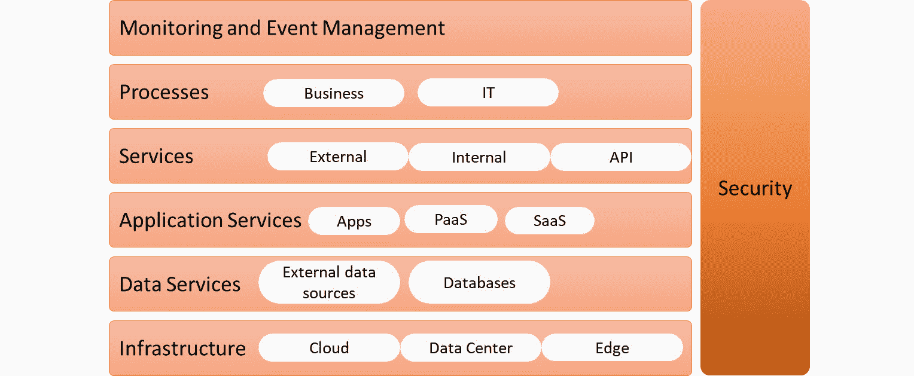

# 第六章：在架构中定义运维

在采用 DevOps 的企业中，运维的角色正在发生变化。运维的首要任务是保持服务的正常运行，但在新的数字化运营模式中，许多这些任务可以并且将会被自动化。在我们开始考虑自动化运维之前，我们需要对企业中运维的角色、任务、活动和领域有清晰的了解。本章是捕捉企业架构中运维的指导框架。我们将学习如何为运维设计架构，并定义数字化运营模型。

完成本章后，你将了解运维的角色和责任是什么，以及如何在架构中处理这些问题。我们还将看到运维如何在云、云原生服务和使用微服务的事件驱动架构的影响下发生变化。我们将设计一个数字化运营模型，并区分平台和产品运维。最后，我们将讨论如何将企业提升到持续运维的水平。

本章将涵盖以下主要内容：

+   了解运维管理

+   在企业架构中定义运维

+   定义数字化运营边界模型

+   了解事件驱动架构中的运维

+   使用成熟度模型进行运维规划

# 了解运维管理

在我们开始定义企业架构中的运维管理之前，包括这些角色之间的角色划分，我们需要了解 IT 运维的内容。在本节中，我们将讨论 IT 运维的定义以及**IT 运维管理**（**ITOM**）。

首先，为什么这很重要？DevOps 有时倾向于专注于开发：探索和构建新特性和新产品。在讨论发布管理和 CI/CD 时，也会关注开发和部署过程。但运维和开发同样重要，而且 IT 运维的角色正在发生变化。不仅仅是因为 DevOps，还因为许多企业正在经历数字化转型。我们将在本节中深入了解这一点。

简单来说，我们可以说，IT 运维包括支持企业用来满足客户服务的硬件和软件的所有过程。因此，IT 运维负责终端用户设备的功能，如笔记本电脑，但也包括为企业客户提供服务的产品。一个简单的例子是一个网站，客户可以在上面订购商品，包括其基础设施（Web 服务器）和应用代码（前端应用和数据库）。IT 运维还有一个重要任务，就是确保 IT 资产的质量。

以下过程在 ITOM 中至关重要：

+   **监控**：IT 运维是 IT 的“眼睛”，因此，强大且具备弹性的监控系统至关重要。在监控方面，并没有真正的*一刀切*方法。运维将与不同的系统合作，控制基础设施、应用程序、接口、备份任务以及许多其他组件。挑战在于如何从这些系统中得到一个概览，以便能够关联系统状态、故障和潜在问题。例如，某个 Web 服务可能没有响应，因为数据库不可用。端到端监控是 IT 中常用的术语，它指的是监控系统模拟整个 IT 系统链中的事务。

+   **事件管理**：任何中断系统正常运行的事件都是一次事件。运维的任务是通过监控识别事件，并尽快解决它。可以通过应用临时解决方法来恢复系统正常，但最好还是修复问题并确保它不再发生。这就是问题管理的核心。

    提示

    作为一名架构师，参与运维工作多年后，我学到了一条每个工程师和架构师都应该好好掌握的重要经验：没有什么比临时解决方案更持久的了，尽管它能快速解决问题。它可能是最快让系统恢复正常的方式，但从长远来看，这些快速修复会导致新问题。其原因之一是，快速修复通常文档不充分，过了一段时间后，没人知道它们是如何应用的。

+   **问题管理**：在这里，事件会被更深入地分析。此外，还会探讨事件的趋势。运维需要与工程师和架构师保持一致，提出解决方案，以防止事件再次发生。

+   **变更控制和发布管理**：运维将面临系统变更，在 DevOps 中，这些变更将会经常发生。然而，确保系统在没有重大、未计划的中断情况下持续运行是运维的责任。这就是变更控制过程。这个过程的一部分可能是在变更执行之前进行最后一次备份，以确保系统状态和数据的安全。开发人员和运维需要在应用变更时保持充分的协调。这是在发布管理过程中完成的。

在传统的工作方式中，运维将收到新的发布版本，然后决定何时部署，以确保现有服务能够继续运行而不受干扰。在 DevOps 中，流程则不同。在这里，团队共同承担部署新版本的责任。

总之，运维必须在任何情况下保持服务的持续运行。DevOps 和数字化转型对运维有着重大影响。让我们回顾一些趋势：

+   **云与云原生**：这可能听起来显而易见，但云和云原生技术对 IT 运维有着巨大的影响。矛盾之处在于，这些技术的许多目标是减少 IT 环境的复杂性，但另一方面，它们也因云端资产而增加了复杂性。IT 环境正越来越变成一个 API 生态系统，运维人员不仅要管理虚拟机、应用程序和网络连接，还要管理将 PaaS 和 SaaS 解决方案与企业 IT 环境连接的**应用程序编程接口**（**API**）。

+   **数据中心退役**：随着企业将 IT 系统迁移到云平台，可以合理推测私有数据中心正在被清空并退役。在这里，传统的运维工作，包括数据中心管理，并没有消失，而是转变为管理云平台中的虚拟数据中心。再次强调，一切都在变成代码，而在传统的数据中心，操作人员仍需照料物理机器。

+   **更快的网络**：企业对系统与自身更近的需求已不再那么迫切。系统可以托管在全球云平台上。高速网络连接解决了延迟问题，因此几乎没有限制系统可以*落地*的地方。在不久的未来，我们将看到更快的网络进入市场：这是许多新兴服务的要求。想想实时数据分析、量子计算或仿真技术，以及依赖高速连接的技术，例如跨全球传输图像的技术。网络是一切的基础，运营将需要更多关注这些网络的弹性、敏捷性和性能。

+   **全球化**：全球云服务提供商，如 Azure、AWS、Google Cloud 和阿里巴巴云，在全球范围内都有数据中心。能够在完全不同的地区启用灾难恢复，从而增强系统的弹性，这是一个巨大的好处。然而，也有许多需要考虑的因素，比如企业是否受到法律法规的约束，要求将数据存储在其所在国家或地区的境内，或是在该地区提供服务。IT 的全球化有其优点，但也有缺点。

+   **左移到更左移**：过去几年里，IT 知识共享的理念获得了很大的推动。左移也意味着 IT 系统迎合了*自助帮助*：系统的设计使得用户可以轻松找到解决问题的方法。在更左移的情况下，新增了一个元素：系统从用户那里学习，并调整软件，以避免问题再次发生。这也是最终趋势将发挥巨大作用的地方：**人工智能**（**AI**）和**机器学习**（**ML**）。

+   **人工智能与机器学习**：最后但同样重要的，是人工智能（AI）和机器学习（ML）将改变运营领域的主要趋势。这包括自学习、自修复系统，甚至能够预测某些行为并据此采取相应行动的系统。在运营中，我们将看到诊断系统，它们从问题中学习，或者修复问题，或者提供处理建议。这些系统还能够关联事件：如果链条中的某个系统失败，AI 将知道它将如何影响该链条中的其他系统，并采取缓解措施，例如拍摄系统状态的快照，以便更快、更准确地识别根本原因。

此时，你应该知道运营不会变得更简单，IT 也不会变得更不复杂。这种复杂性将会转变和演变。好消息是，这些新技术将帮助你更好地预测系统行为，设计更具弹性，并通过更快地找到问题的根本原因并采取迅速、准确的纠正措施，进一步降低风险。

这如何融入我们的架构？我们将在下一部分讨论。

# 在企业架构中定义运营

IT 运营不是企业架构的一部分，这意味着企业架构并不定义企业必须如何进行运营。充其量，运营架构是技术架构的一部分。在这一部分，我们将详细阐述企业架构的组件，然后研究运营架构的具体内容。

企业架构包括以下架构组件：

+   **业务架构**：这涵盖了业务功能和组织架构，包括其运营。从业务架构中，应该能清楚地看到产品和服务是如何交付的，以及在设计、构建和运行它们时所遵循的流程。业务架构从产品战略开始，其中包括描述企业交付的产品和服务。

+   **治理架构**：这定义了谁负责执行各项流程。这是企业运营的蓝图，包括 IT 的战术计划，明确了流程的实施、操作和监控方式。

    运营是商业和治理架构中的关键组成部分。运营负责在整个交付链中稳定地交付产品和服务。重要的是要意识到运营服务管理和运营管理之间的区别，后者通常被称为 ITOM。服务管理包括我们在第一部分《理解运营管理》中讨论的典型 ITSM 或 ITIL 流程，如事件管理和问题管理。ITOM 更多侧重于 IT 技术，并专注于应用程序和基础设施的运营。企业架构也涉及到这一点。

+   **数据架构**：这描述了数据如何被使用；即为什么以及由谁或什么过程来履行某项服务。运营在根据企业的数据原则确保数据可用方面起着重要作用。这些原则通常涉及数据隐私和合规性规则。因此，运营需要与安全和数据隐私官员密切合作。

+   **应用架构**：这描述了应用程序的构建和使用。同样，运营在保持应用程序运行，包括数据库和中间件方面，发挥着关键作用。强烈建议在应用程序开发的最初阶段就将运营纳入其中，以确保应用程序可以真正由运营管理。想象一下将新的云原生技术应用于应用程序：企业需要确保运营团队具备操作这些技术的技能。

+   **技术架构**：最后，这描述了企业中使用的所有技术组件。它应包括硬件和软件等产品、标准和原则、服务和政策。

下图显示了企业架构中的各个层级：

图 6.1 – 企业架构的组成部分

运营架构可以是技术架构的一部分，但在更详细的层面。它至少包括以下组件：

+   生产调度/监控

+   系统监控

+   性能监控

+   网络监控

+   事件管理（事件、问题、变更）

两个事项值得特别关注：

+   **服务级别协议（SLAs）**：供应商与客户之间的合同，明确描述服务提供的具体条件，通常使用**关键绩效指标（KPIs）**。运营需要根据这些 KPIs 提供服务。

+   **运营级别协议（OLAs）**：SLA 的一部分可以是 OLAs，定义组件之间的相互依赖关系，并构成 SLA 所涵盖的服务。例如，SLA 可能描述一个需要 99.9%时间可用的 Web 应用程序。该应用程序本身可能依赖于数据库服务，而这些服务并不在应用程序链中，由不同的运维组负责。OLA 将处理这种相互依赖关系。

在本节中，我们得出结论，IT 变得越来越复杂。企业期望运维不仅能保持系统稳定，还能跟上新发展的步伐。为了使运维能够完成这些越来越苛刻的任务，他们需要一个调整过的运营模型来应对这种数字化转型。为此，他们还需要合适的工具。在下一节中，我们将讨论这种新的数字化运营模型，然后进入 AIOps 工具的世界。

# 定义数字化运营划分模型

运维的角色和位置正在发生变化；我们在本章的第一节中已经看到这一点。除了新技术和不断发展的技术对运维的影响外，最重要的原因是从项目导向向产品导向的持续交付转变。

这是什么意思呢？大多数企业曾经习惯于做项目，通常是瀑布式项目。每个项目都有一个明确的结束日期，整个项目按照时间线和里程碑规划。在 DevOps 中，焦点转向了产品：它从最小可行产品（MVP）开始，然后团队在短期的 2 到 3 周的冲刺中不断改进它。

在冲刺结束时，产品和交付物会进行审查。开发人员和运维团队会与这些团队合作。在传统模型中，运维会获得最终产品，然后决定如何以及何时发布。而新的运营模型必须更加敏捷、适应性强，并且嵌入到 DevOps 中。在本节中，我们将更详细地讨论这种新的运营模型。

在数字化运营模型中，理解开发和运维的角色非常重要：

+   开发设计并部署。

+   运维完成并管理，包括检测和修复。然而，在 DevOps 中，检测和修复会反馈回开发阶段。

为了创造敏捷性，我们需要在不同的运维任务中设定**划分**。我们将有运维专注于产品，运维专注于平台。如果我们希望提供以产品为导向的交付，这是一个必要条件。在基于敏捷和 DevOps 的数字化运营模型中，业务部门与产品团队合作，共同定义所需的产品及其特性。产品运维工程师将支持这些产品的交付，而平台工程师则确保平台——即基础设施——准备好接纳产品并提供持久稳定的服务。

下图展示了一个具有划分层次的模型：

图 6.2 – 具有产品运维和平台运维的分层界定模型

在接下来的章节中，我们将进一步解释该模型：

+   **平台运维**：平台是着陆区——基础设施。它需要稳定存在，且保持稳定。产品团队不应该担心平台的可用性。在大多数数字化运营模型中，平台通常是（公共）云平台。

    管理平台的团队与产品团队是解耦的。平台运维包括更新、升级和优化，还会部署新的基础设施功能。这些都需要与产品团队紧密合作，以避免对服务的干扰。

    在平台运维中，建议的角色有（云）平台经理、（云）平台架构师和平台工程师。这个运维团队可能还需要有一个 API 集成专家，因为平台越来越像是一个 API 生态系统。这些 API，例如 SaaS 和 PaaS 解决方案，需要与平台集成。

+   **产品运维**：这是设计、构建、部署和管理产品的层级，以 DevOps 模式进行。简单来说，这就是产品从基本想法开始，通过多次迭代，最终由产品运维控制的层级。在这个团队中，我们需要平台工程师来桥接产品的需求与平台之间的联系。这些平台工程师需要接受培训，具备基础设施即代码、配置即代码、自动化和 API 编程技能。他们将与平台运维团队进行对接。

    在这一层以及产品团队中建议的运维角色有基础设施工程师和测试人员、开发人员，以及参与产品设计的特定领域架构师。

    引入敏捷和 DevOps 的一个陷阱是，企业可能会远离传统的 IT 服务管理流程。然而，在第一节中我们简要讨论的关于*理解运营管理*的操作流程依然非常有效。这就是为什么在数字化运营模型中，我们需要角色和责任来解决这些流程：

    - （主要）事件经理

    - 问题经理

    - 变更经理

    - 资产经理

    我们可以通过使用 RACI 矩阵来实现这一点。RACI 代表**责任人、负责人、咨询者和知情人**。下表展示了服务管理流程的一个简单 RACI 示例：

图 6.3 – 服务管理流程的 RACI 矩阵示例

**R**、**A**、**C** 和 **I** 的位置是有争议的，但这没关系——只要所有相关人员都清楚地知道谁负责什么就行。

+   **业务**：这是最顶层，战略在此制定，产品的需求也在此定义。在新的数字化运营模式中，新增了一些角色，例如客户旅程分析师和设计师。该模型的核心思想是使企业更具敏捷性，并能更快地将新产品推向市场。企业需要了解客户的需求以及他们如何体验产品，以便使产品成功。

    这对于运维也非常重要。记住，开发和运维必须从头到尾保持一致。运维也需要参与到客户旅程中。在这种情况下，运维的一个特定角色是服务经理：他们需要了解即将到来的内容，以及如何在新服务中采用这些内容，同时确保现有服务不会受到干扰。

还有一个重要的层级缺失了，但实际上这并不是一个单独的层级。安全性和安全管理是一个跨越的层级，应嵌入到每个其他层级中。

因此，我们在各个层级都有工程师和架构师，紧密合作。但应该明确的是，他们需要某种框架来进行工作。那就是企业架构。企业架构师位于模型的最顶部，紧密与客户旅程设计师、开发中的领域架构师以及运维架构师合作。

IT4IT 由 The Open Group 提出，针对这种新模式提出了企业的前进方向。IT4IT 划分了四个阶段或*价值流*，用于产品的生命周期。这些价值流非常准确，因为 IT 创造了价值——从一个想法到实际服务的产品开发过程：

1.  **规划**：从战略到组合

1.  **构建**：从需求到部署

1.  **交付**：从需求到履行

1.  **运行**：从检测到修复

以下图表展示了这些价值流：

图 6.4 – IT4IT 价值流

交付和运行价值流是运维流。请求到履行包括目录管理、履行和服务使用管理。运行是关于预测和解决问题。运维可以通过使用事件驱动架构来帮助完成这些任务。我们将在下一部分讨论这一点。

# 理解事件驱动架构中的运维

让我们再次回顾运维的最重要任务：保持服务的正常运行。为了实现这一点，我们定义了一些帮助管理系统的流程。事件和问题管理是关键流程；也就是说，按照 IT4IT 的术语，从检测到修复。问题在于，事件管理几乎默认是反应式的：一旦发现问题，就会触发行动以寻找并修复问题。在下一个阶段，通常是在问题管理中，会进行更深入的分析，设计解决方案以防止问题再次发生。

事件管理是运营的一个组成部分。在数字化运营模式中，挑战在于如何在不同的 IT 系统甚至平台之间编排和自动化这些事件。事件驱动架构解决了这个问题，实际上，它是 AIOps 的起点。我们将在*第八章*《AIOps 架构设计》中详细讨论这一点。

事件驱动架构最初旨在帮助设计应用程序，使其能够响应事件。事件被定义为触发反应的状态变化。以下图表提供了一个在 Archimate 中构建的示例：

图 6.5 – 用于处理支付的简单 Archimate 模型

在这里，我们有一个业务事件：**订单已下单**。这触发了一个业务功能，在这个示例中被称为 **订单履行**。这个功能的一部分是 **支付**，它触发了银行的外部系统，提供支付服务。一旦支付被接受，订单就会从该功能转移到下一个业务事件，即 **订单配送**。

提示

Archimate 是一种推荐的建模方法，用于设计功能并将其映射到 IT 组件需要履行的流程上。Archimate 使用视角来建模从业务流程到应用程序和技术的过程。一个常见的视角是产品视角，它展示了产品为客户带来的价值。架构师可以使用 Archimate 模型来定义产品的组成，包括不同的服务和服务之间的接口。Archi 是一个免费的工具，可以用于设计 Archimate 模型。Archi 可以从 [`www.archimatetool.com/download/`](https://www.archimatetool.com/download/) 下载。

在这个——非常简单——的示例中，客户支付了他们下的订单。订单状态现在变为已支付，并触发一个将订单推送到配送的过程。事实上，支付过程本身也会触发其他新事件，例如需要与银行或支付服务建立连接。在银行内部，会触发一个检查买家账户的过程，并向订单系统发送“OK”或“不 OK”的状态消息。

简而言之，状态的变化将触发许多新的事件。这些事件不一定发生在同一个系统中，正如我们在这个例子中所看到的那样。事件可以驱动通过 API 连接的其他系统中的决策。这是微服务和**面向服务架构**（**SOA**）的基础。微服务是独立运行的服务，通过 API 相互通信。这些服务由自给自足的团队管理，团队负责开发、构建和运行这些服务。因此，可以公平地说，采用微服务的事件驱动架构得到了 DevOps 的良好支持，DevOps 团队对交付特定服务负有端到端的责任。

为了实现这种架构，我们需要将服务定义为可重用、可扩展和可互操作的独立功能。这些是 SOA 的基石，实际上，许多云技术源自 SOA 原则。PaaS 和 SaaS 解决方案被定义为 SOA，这意味着它们可以在不同的环境中重用和共享，可扩展，并且在不同平台之间具有互操作性。

这一切如何影响运维？简单来说：他们必须在许多不同的应用、系统和平台之间保持服务——准确地说是微服务——的正常运行。运维必须通过使用连接独立部署服务的接口来处理分散的持续交付。传统的监控方式将不再足够：运维需要一个统一的视图——所有服务及其相互连接的整体视图。

现在，让我们回到我们的例子，假设我们有一个需要支付的订单。订单状态将从未支付变为已支付，并触发配送。只有当银行批准支付后，状态才会发生变化，因此状态变化的触发来自一个与实际持有订单的服务不同的外部服务。如果银行和订单队列之间的 API 失败，操作员需要知道这一情况。因此，监控应该包括监控到银行的 API，并检查银行服务是否*在线*。在这里，跨整个链路的事件监控变得至关重要，如下图所示：

](img/B17492_06_006.jpg)

图 6.6 – 完整链路事件管理和监控

这必然会增加运维的复杂性，这就是为什么我们需要尽可能寻找自动化的方法。微服务、SOA 和事件驱动架构创建了更可靠的系统：独立服务仅等待触发器执行动作并启动下一个服务。独立服务允许“点火并忘记”模型：系统触发一个触发器，然后忘记它；接着，系统继续下一个事件和下一个触发器。但我们希望确保触发器确实被接收，并可能甚至检查触发器是否被正确处理。

在接下来的几章中，我们将学习如何监控这些过程，以及如何在基于微服务的事件驱动系统中自动化事件管理。这正是 AIOps 的作用：通过 AI 和 ML 使运营变得更加简单。

# 使用成熟度模型进行运营规划

在本节中，我们将研究 IT 运营的成熟度模型。然后，我们将学习如何将其应用到企业，并使其实现持续运营。最后，我们将学习如何准备好以便 AIOps 可以实施。

基本的运营成熟度模型如下所示：

图 6.7 – 运营成熟度模型

第一级有时被称为混乱阶段。这里的过程没有记录；操作只是简单地在应急情况下应对问题。在这个级别，工具决定了操作的方式，而不是建立一个定义工具集的架构。大多数企业已经经历了这个阶段。

然而，许多企业卡在第二级。这是承诺级别，在这里流程是被定义的。事件、问题变更和项目管理已经就位，但这些流程只是以非常有限的方式集成在一起。没有全面的事件管理或*单一面板视图*。换句话说，事件仍会触发意外的系统行为，并可能严重影响业务。

大多数企业将处于第 3 和第 4 级之间，具体取决于它们在数字转型过程中的位置。第三级，积极预防级别已经相当具有挑战性。在这个级别，企业可以分析趋势，实施端到端的事件监控，自动化其 IT 的较大部分，并且最重要的是，可以预测事件并采取积极措施。这是 AIOps 可以发挥重要作用的级别。我们将在*第七章*中详细了解这一点，*理解 AI 对 DevOps 的影响*。

在四级，IT 交付完全被定义为业务服务。在这一层级中，事件驱动架构变得相关。业务功能与 IT 服务相对应。实际上，IT 服务可以支持业务决策。有一个明确定义的服务目录，所有的流程都已经整合，包括成本管理。IT 成熟度模型中的最终阶段是对业务事件和创新的实时响应，这些都融入了运营过程中，从而为业务创造价值。这是持续运营阶段，在这一阶段，我们将反馈环路整合到开发流程中，但这是实时且完全自动化的。大多数企业会在某些应用程序和业务功能中达到这一层级，但很少会在整个企业和所有业务流程中达到这一层级。

运营成熟度模型与**能力成熟度模型**（**CMM**）相一致，后者也有五个层级。一级是初始层级，在这一层级中，流程控制差，难以预测。在三级，最常见的企业层级，流程被明确定义并且得到了很好的理解，从而可以进行主动的事件管理。五级是优化层级，在这一层级中，流程和交付会不断改进。正如我们之前提到的，大多数企业对于某些流程和产品会达到这一层级，但整个企业通常很难达到这一层级。CMM 模型如下所示：

图 6.8 – 能力成熟度模型（CMM）

三级是关注的层级：变得更加主动。在接下来的几章中，我们将学习人工智能（AI）和机器学习（ML）如何帮助我们实现这一目标。

# 总结

在本章中，我们讨论了运营管理以及由于数字化转型和 DevOps 实施而发生的变化。首先，我们看了运营的角色与责任以及不同的运营服务管理流程。我们还讨论了几种即将在不久的将来影响运营的趋势。我们得出的总体结论是，运营的角色将会发生变化，主要是由于数字化转型以及敏捷和 DevOps 的实施。为了实现敏捷，我们需要运营人员能够专注于他们的独特任务。然后，我们讨论了产品运营和平台运营的划分模型。

接下来，我们学习了架构如何变得更加以事件为驱动，以及运营在这一过程中所处的位置。运营需要有一个统一的视图，全面监控甚至预测整个链条中的事件，以便采取主动措施。这就是运营成熟度模型中三级的描述：主动且可预测。人工智能和机器学习将在这方面提供帮助。

在下一章中，我们将讨论人工智能在企业和 IT 运营中的影响。

# 问题

1.  列举三个必须包含在技术架构中的组件。

1.  列出 IT4IT 定义的四个价值流，以支持 IT 交付。

1.  事件驱动架构的一个重要组成部分是包含的、独立运行的服务，这些服务通过 API 互相通信。我们称这些服务为什么？

1.  AIOps 在成熟度模型中适合哪个层次？

# 进一步阅读

+   *数字化新 IT 操作模型*，由 Gartner 发布。发表在 https://www.gartner.com/en/documents/3770165/the-new-it-operating-model-for-digital。

+   *设计与实施 I&T 操作模型：组件与相互依赖性*，由 Gartner 发布。发表在 [`www.gartner.com/en/documents/3956725/designing-and-implementing-the-i-t-operating-model-compo`](https://www.gartner.com/en/documents/3956725/designing-and-implementing-the-i-t-operating-model-compo)。

+   Rob Akershoek 在 IT4IT 博客上的文章: [`www.4me.com/blog/it4it/`](https://www.4me.com/blog/it4it/)。

+   *解决方案架构师手册*，由 Saurabh Shrivastava 和 Neelanjali Srivastav 编著，PacktPub，2020 年。
