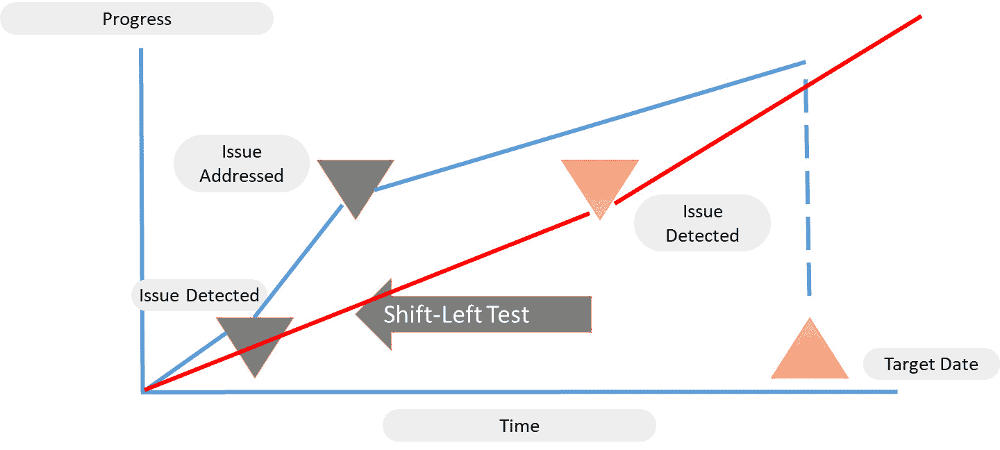
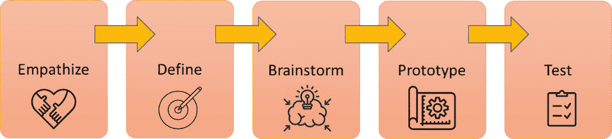
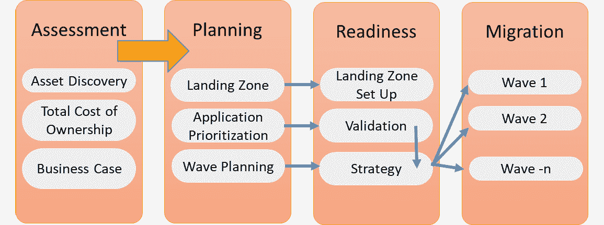
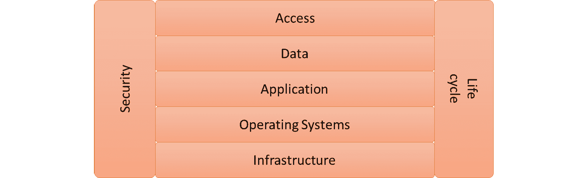

# 第七章：理解 AI 对 DevOps 的影响

在本章中，我们将介绍**人工智能**（**AI**）以及 AI 对 DevOps 的影响。我们将讨论它如何通过使用 AI 和**机器学习**（**ML**）驱动操作中的“左移”，即在 DevOps 周期开始时迅速识别问题。在实施 AIOps 等系统之前，我们首先需要通过创建所有 IT 资产和工作流的可视化，并将其映射到 AI 驱动的流程中，来让企业为 AIOps 做好准备。接下来，我们需要一个整合的工具集，既适用于开发，也适用于运维。领先的公共云提供商提供了原生的工具集，正如我们在本章中将看到的那样。

完成本章后，你将对 DevOps 过程中的 AI 概念有一个清晰的理解。你还将学习到 AI 驱动的系统如何帮助实现“左移”（shift left）。在我们讨论 AIOps 的可能结果和收益之前，我们需要首先实现对企业 IT 所有资产和流程的全面可视化。在本章中，我们还将了解这一点的重要性，以及如何实现全栈可视化。

本章我们将涵盖以下主要内容：

+   介绍 AI 和 ML

+   理解 DevOps 中的左移（shift-left）运动

+   定义第一步——作为服务的 DevOps

+   创建 IT 资产可视化地图

+   衡量 AIOps 的业务成果

# 介绍 AI 和 ML

在本节中，我们将简要介绍 AI 和 ML 的概念。关于 AI 和 ML 已经有成千上万本书籍被写成书店的库存，但在这一节中，我们仅仅提供定义并描述这些概念如何改变开发和运维：

+   **AI**：AI 的最广泛定义是模拟人类行为的计算机技术。在大多数情况下，AI 用于表示软件能够通过推理和分析事件，自动且智能地做出反应，从而在没有人工干预的情况下做出决策。

+   **ML**：在 AI 之后是机器学习，它通过分析早期的事件，学习如何执行任务和执行操作，然后利用这些经验改善自主决策。为了实现这一点，AI 和 ML 作为技术需要数据，并且需要理解如何解读这些数据。

AI 和 ML 并非魔法。你需要像定义其他任何概念一样，明确这些技术的应用范围。接下来，你需要准备好环境，以便为 AI 和 ML 做好准备。例如，企业首先需要对自动化有一个清晰的理解，并全面了解其所有资产。否则，即使是 AI 也会在*盲目操作*的情况下工作，无法带来任何价值。

引入和实施 AIOps 从一种不同的思维方式开始：改进从尽早发现潜在故障并学会如何在故障进入生产环境之前加以预防开始，而不是在生产环境中发现并修复故障。这正是 "shift-left" 思维的领域。我们将在下一节深入了解这一点。

# 了解 DevOps 中的 "shift-left" 运动

在过去几年中，"shift left" 成为了一个流行的术语。那么，这到底是什么意思呢？它是指将原本计划在后期进行的活动提前到流程的开始阶段。这通常发生在测试环节，测试曾经是等到整个产品交付给测试团队后才开始进行的。"Shift-left" 测试已成为 DevOps 中的重要范式：尽早执行测试。通过在开发一开始就进行测试，问题会更早被发现，并可以在早期阶段修复，从而改进最终产品。下图展示了 "shift-left" 测试的影响：

图 7.1 – "Shift-left" 测试的影响

"Shift-left" 原则可以应用于 DevOps 中的更多流程。试想 DevOps 中的第一步：设计。在开始构建解决方案之前，IT 团队，无论是软件开发人员还是云工程师，都应该充分理解业务需求。IT 中的一个主要陷阱就是在没有完全理解这些业务需求的情况下开始构建某些东西。通过采用其他设计方法，商业和 IT 部门的紧密合作可以解决这个问题。设计思维恰好契合这一点，是 "shift left" 的一个很好的例子。

设计思维从评估所有相关方的观点开始：在这种方法论中，这被称为 *同理心*。接下来的步骤是定义问题，进行头脑风暴并从各个角度生成解决问题的想法，然后构建和测试原型。然而，测试并不是最后的阶段。相反：设计思维是一个迭代过程，就像 DevOps 一样。每个周期产品都会变得更好。关键是要在项目一开始就让 IT 部门参与进来，尤其是在定义业务需求的阶段。以下图展示了这个过程：

图 7.2 – 设计思维过程

最后，"shift left" 同样适用于 DevOps 中的部署和运维。这正是自动化、模板化和蓝图化发挥重要作用的地方。通过自动化模板、预先批准的模式和流程，我们可以将部署阶段提前。使用自动化，我们可以实现一致的部署应用，这将帮助运维管理这些环境。

预先批准的模式还包括**测试驱动开发**（**TDD**），将测试移至开发和部署过程的最初阶段。在 *第三章* *面向 DevOps 质量的架构* 中，我们讨论了 TDD，在这种方法中，团队首先编写测试用例，然后编写代码。代码是根据测试用例的规范编写的，从而证明了需求已被满足。

简而言之，左移原则是关于在早期阶段减少故障，使最终产品更加稳定和具有弹性。问题通常只会在生产环境中被发现，通常是由于系统部署中的不一致性所导致。手动任务或使用大量不同工具会增加这些不一致性的风险。开发人员使用与运维不同的工具可能会导致需要通过手动任务来修复的问题。在**站点可靠性工程**（**SRE**）中，这被称为 toil，正如我们在 *第五章* *通过 SRE 架构下一个层次的 DevOps* 中看到的那样。或者，问题是由不同的流程引起的。自动化、模板化和 TDD 可以避免这些问题的发生，并减少故障率。模板、模式和蓝图会不断测试和改进，从而实现更加稳定的运营。

AI 和 ML 可以在这一切中提供帮助。首先，AI 驱动的监控将帮助在早期阶段发现问题，特别是不一致性。它将从这些不一致性中学习，并利用 ML 提出甚至实施代码和流程的改进。但在我们深入讨论之前，我们需要先讨论一下自动化，作为左移范式的一部分，尽可能地将工作转移到云服务中，利用集成的工具集，实施 DevOps 作为服务。这是下一节的主题。

# 定义第一步 – 将 DevOps 作为一种服务

一致性是成功的关键。这几乎适用于任何事情，当然也适用于 DevOps。开发和运维需要在相同的工具集下协作：这就是将 DevOps 作为一种服务的核心。DevOps 作为一种服务使得左移成为可能，同时也是实施全面监控系统的良好起点，包括 AIOps。

注意

AIOps 远不止是一个监控工具，正如我们将在接下来的章节中了解到的那样。然而，AIOps 从监控复杂环境开始。通过收集这些系统的数据并进行分析，它能够跟踪和修复系统和流程，包括自动化重复任务。AIOps 能够发现模式，并为其定义自动触发器。但如果它无法监控源系统，它就无法做到这一点。

DevOps 作为服务将跟踪开发和交付过程中的每一步，但真正的价值在于它能在检测到该过程中的问题时立即提供反馈。其价值在于，这些反馈在软件推送到生产环境之前就已经被收集。从开发周期的开始，集成的工具集使得错误和缺陷的跟踪成为可能，并将其反馈给开发团队，这远在操作团队面临故障软件和系统的异常行为之前。这是真正的“左移”：将通常在后期阶段进行的工作提前到开始阶段。

因此，DevOps 作为服务代表了一种集成的工具集，能够促进开发人员和运维人员之间的协作。这些工具必须涵盖 DevOps 流程中的所有步骤，并且基本上像一个工具一样协同工作。云平台提供这些工具。在本节中，我们将讨论在 Azure、AWS 和 **Google Cloud Platform** (**GCP**) 中的这些工具：

+   **AWS**：AWS CodeBuild、AWS CodePipeline 和 AWS CodeDeploy 是需要关注的三大解决方案。CodeBuild 是一个用于通过自动化流程构建、编译和测试代码的托管服务。CodeBuild 还为每个构建的工件提供唯一的加密密钥，这些工件存储在代码仓库中。部署场景在 CodePipeline 中定义，直到生产阶段，CodeDeploy 实现将应用交付到生产环境的目标基础设施中。CodeDeploy 还负责修补、升级和构建的同步。

+   **Microsoft Azure**：Azure DevOps 是 Azure 中的集成工具集，用于开发和部署。它就像一把瑞士军刀：它作为一个工具存在，但在背后却包含了多种协同工作的解决方案。你可以在 Azure Repos 中管理代码，Azure Repos 支持 Git 仓库。代码的构建、测试和部署在 Azure Pipelines 中完成。更全面的测试可以通过 Azure Test Plans 执行。此外，Azure DevOps 还提供 Azure Boards，用于跟踪项目：它类似于看板。最后，Azure DevOps 提供 Azure Artifacts，开发人员可以通过它将来自其他来源的 NuGet、NPM、Python 和 Maven 包共享到 Azure DevOps 中。

+   **Google Cloud**：Google Cloud 提供了 Operations Suite，之前称为 Stackdriver。对开发人员来说，最有趣的部分可能是 Cloud Debugger，它允许在应用程序运行时分析代码并发现错误，而无需停止应用程序。代码部署通过 Deployment Manager 完成。GCP 还提供了一个强大的工具 Cloud Trace，用于快速和自动地检测和分析问题——实际上，这已经非常接近 AIOps。

集成的工具集将帮助我们推动“左移”运动，并为实施 AIOps 提供一个良好的起点。但我们首先需要做一件事，那就是确保能够全面掌控我们 IT 环境中的每一个资产。这是下一节的主题。

# 创建 IT 资产可视化地图

在《爱丽丝梦游仙境》中有一句著名的话：“如果你不知道你要去哪里，那么任何路都能带你到那里。”你实际上可以将这句话倒过来说：如果你想去某个地方，你需要知道你从哪里来。让我们把这个理念付诸实践：如果我们想要进行企业转型，我们需要了解我们正在转型的是什么。这就是为什么每一种数字化转型方法都始于评估和发现。企业需要对其所有资产有全面的可视性。下图展示了迁移和转型计划的基本步骤，从评估开始：

图 7.3 – 迁移的高级计划

当所有资产都已识别后，我们可以开始规划将这些资产迁移和转型到新的目标区域，通常是公共云中的平台。需要验证应用程序，以便能够定义正确的策略：重新托管、重新平台或重建。这是我们在*第四章*《规模化 DevOps》中讨论的应用现代化领域。最后一步是分波次规划迁移和转型。*大爆炸*式迁移可以是一种策略，但在大型企业中，这显然不推荐采用。

回到企业为何采纳敏捷和 DevOps 的原因：企业这样做是为了加快产品交付速度，并变得更加灵活，以便能够更快地响应客户需求的变化。为了获得这种速度，它们需要依赖稳定的系统和操作，这样时间就可以用于开发而不是修复问题。IT 需要变得更加预测性，实际上避免问题的发生。来自资产的数据至关重要。这些数据需要实时收集和分析。

这些数据的第一个来源是**配置管理数据库**（**CMDB**）。许多 CMDB 的问题在于它们所持有的信息并不准确。根本原因在于许多数据仍然是手动输入的，例如通过导入电子表格；监控和资产收集没有实时进行；或者数据分散在多个需要同步的 CMDB 中。

接下来，CMDB（配置管理数据库）通常不经常被*清理*，因此会包含噪声。这通常是因为在执行更改后没有更新 CMDB。CMDB 应该是捕获资产的唯一真实来源，但如果没有实时更新的自动化信息，这就成了一个挑战。CMDB 将不再反映系统的实际状态。

你可能注意到，在本节中我们使用了两个不同的术语：资产和配置。这是两个不同的概念，它们在了解企业 IT 配置时同样重要。只有当我们完全了解资产和配置时，我们才能开始规划迁移，并准备好帮助运营变得更加可预测的工具。运营需要一个能够做到以下几点的系统：

1.  知道 IT 环境中有哪些系统

1.  知道这些系统之间是如何相互关联的

1.  实时跟踪这些系统的状态和配置

我们从了解环境中有哪些系统开始：资产可视化图。这就是资产管理：基本上是每个物理和虚拟系统的清单，包括使用的软件及其许可证，以便我们知道何时需要升级或更换系统，例如，当软件结束支持或许可证到期时。这通过生命周期管理过程来解决。

我们还需要知道这些系统是如何配置的，以及它们与其他系统的关系，包括依赖关系，以便操作人员了解在数据库关闭时可能产生的影响。这就是配置管理。

所以，完全的可视化不仅包括所有资产，还包括对连接、依赖关系和流程的清晰可视化。如果没有这些信息，运营人员将不得不花费大量时间寻找问题的根本原因，并学习如何解决它。

在云中工作使得实时资产收集变得更加容易。例如，在 Azure 中，使用 `Get` 命令，你可以创建 Azure 订阅中的资产列表。同样，实时性在这里至关重要。由于云系统变化较快，拥有即时、准确的资产数据变得尤为重要。我们如何实现这种可视化？我们定义了五个层次，如下图所示：

](img/B17492_07_004.jpg)

图 7.4 – 资产管理的层次

让我们更详细地探讨这五个层次：

+   **基础设施**：包括虚拟机和所有网络组件。

+   **操作系统**：所有操作系统是否都已更新？另外：它们是如何配置的？例如，企业通常会有安全标准，应用于已按这些标准加固的操作系统镜像。所有系统是否都使用了相同的镜像？使用其他镜像设置的系统可能存在安全漏洞。

+   **应用程序**：安装了哪些应用程序软件，版本是什么？软件是否已正确打补丁并获得授权？

+   **数据**：数据存储在哪里？是如何存储的？例如，数据是否经过加密，采用何种方式加密？

+   **访问**：谁或什么可以访问其他四层？

    注意

    图中有两个垂直层次。生命周期管理适用于整个技术栈。所有组件是否仍然符合要求、具有正确的许可证并且没有过期？这对于访问层也是适用的：想想那些不再使用的账户，应该被禁用。

    安全性是所有层次的固有部分。它不是我们只需要在基础设施或数据层中关注的事项。每一层都需要遵守安全政策。在本书的第三部分，我们将讨论在 DevOps 中的安全性，届时我们将深入学习更多内容。

但企业可能不仅仅拥有公共云中的资产。此外，公共云中的资产可能与甚至非云系统存在关系和依赖。因此，我们需要一个全面的系统，来收集所有数据并维护这些数据：单一视图（single-pane-of-glass）或全栈可视化。

Azure、AWS 和 GCP 提供了用于**企业服务管理**（**ESM**）系统的 API，例如 ServiceNow 和 BMC。ESM 的范围远远超出了 IT：它将业务流程与 IT 相关联，并提供 IT 如何支持这些业务流程的单一视图。这些系统能够预测 IT 系统的变化将如何影响业务流程。

到目前为止，我们只讨论了企业内部的资产和配置。但在这个快速变化的世界中，企业也将拥有大量来自外部的数据源。想象一下来自网站和社交媒体平台的数据。这些可能对公司来说是真正的资产，但来自这些源的数据可能会影响业务流程。因此，企业也需要分析这些数据。

例如，社交媒体上的一次活动可能会提高销售额，要求销售系统的额外容量，包括公司的网站。如果没有预见到这一点，且由于流量过载导致系统崩溃，这将无疑对公司造成损害，损失不仅限于收入损失，还包括声誉损害。

预测系统行为并衡量其对业务的影响需要对企业 IT 的整个生态系统进行全面可视化。AIOps 将提供帮助，在本章的最后一部分，我们将讨论如何实现这一点。

# 衡量 AIOps 的业务成果

在前面的章节中，我们讨论了“向左移动”（shift left），并看到我们如何将 DevOps 定义为一种服务。接下来，我们学习了如何创建企业所有资产的全面可视化，作为实施 AI 驱动流程的起点，这些流程将帮助改进开发、部署和运维，从而加速 IT 中的“向左移动”。那么，AI 如何在这方面提供帮助呢？

+   AI 是关于分析数据的。AIOps 也不例外：它分析操作数据，并能够提供有关如何改善系统性能和效率的建议。

+   为了获得有效的数据和建议，AIOps 必须减少噪音。噪音是运维中非常常见的问题，特别是在监控系统和 CMDB 中，正如我们在前一部分所学的那样。什么是真正的问题，什么是虚假的警报？AIOps 能够分析这些警报，并借助算法将警报进行分组，识别并优先处理它们。结果是，这将节省大量运维时间：运维人员现在可以集中精力处理那些真正影响系统的警报——从而影响业务。

+   AIOps 的一个强大功能是它能够关联警报和事件，找出问题的根本原因。一个前提是我们在前一部分讨论过的全栈可视化。AIOps 是学习系统：这意味着它们首先需要捕获所有资产并理解它们之间的关系。

+   再次强调：AIOps 是学习系统，因此它们会学习系统的正常行为。然后，它们将识别异常并主动与可能的业务影响相关联。以我们之前提到的营销活动导致销售激增为例，AIOps 系统将比运维更快地检测到异常的高流量，并更迅速地触发扩展。

+   触发扩展意味着 AIOps 高度自动化。AIOps 可以用于处理例行任务，例如执行备份。

我们如何衡量添加 AI 的收益？以下 **关键绩效指标** (**KPIs**) 可以提供帮助：

+   **检测问题的平均时间 (MTTD)**：从问题出现到被检测到需要多长时间？AIOps 将学习如何检测故障，分析系统的模式和行为。AIOps 还将通过分析问题对业务流程的影响来判断问题的*严重性*。由于 AIOps 使用机器学习，它将学会如何更快地检测问题，如何预测问题，并最终通过主动建议来避免问题。

+   **确认问题的平均时间 (MTTA)**：这在逻辑上是 MTTD 的延续。MTTD 是关于检测，而 MTTA 是关于 AIOps 能多快地将问题分配给正确的运维人员。这由工作流程过程的自动化来覆盖：AIOps 会首先识别问题，确定影响范围，然后决定将其分配给哪个运维人员进行进一步调查。当关键业务流程受到影响时，例如，AIOps 可能会决定将问题标记为关键，触发危机处理流程。使用这些系统，与人工干预相比，将节省大量时间。

+   **解决问题的平均时间 (MTTR)**：使用 AIOps，可以快速识别类似问题是否曾经发生过，并执行了什么解决方案来缓解它们。简而言之，AIOps 将帮助快速找到并分析解决方案，尽早恢复服务。

+   **监控检测**：衡量 AIOps 成功率的一个有用 KPI 是，在用户实际注意到性能下降甚至系统宕机之前，AIOps 检测到的问题数量。

+   **自动化修复**：有时也称为 *自动化自动化*。AIOps 将学习解决问题所用的方案。复杂的系统还将学会如何自动化这些解决方案，主动采取措施防止问题再次发生。衡量 AIOps 效果的一个有用 KPI 是跟踪 AIOps 自动化的修复行动数量及其对系统可用性的影响。

请注意，AIOps 仍处于非常早期阶段。相当多的工具自称为 AIOps，但目前还无法做到，例如上一条所描述的“自动化自动化”。然而，AI 和 ML 无疑将在未来几年发展并变得更加成熟。这将是将 AI 和 ML 实现到 DevOps 和整体 IT 中的第一步，并通过以下方式改变软件开发：

+   创建原型

+   自动化检测与分析

+   自动化修正

+   自动化代码生成

+   自动化测试

本章介绍了 AI 和 ML 的概念以及这些技术将如何影响 IT 系统的开发、部署和管理。AI 将有助于创建更可靠的系统，并改进软件开发。AI 当然不会取代开发者或运维人员，但随着他们学习如何与 AI 驱动的系统（如 AIOps）协作，他们的角色可能会发生变化。首先，我们将讨论如何将 AIOps 集成到我们的架构中，这是 *第八章* 的主题，*AIOps 架构设计*。

# 总结

在简要介绍了 AI 和 ML 之后，本章讨论了这些技术如何帮助开发更好的软件和更可靠的系统。AI 支持“左移”运动：将通常在后期阶段完成的工作提前到开发和部署周期的开始阶段。通过 AI，能够在非常早期的阶段检测到问题，并通过自动化手段，AI 还能触发修正行动。

由于 AI 和 ML 是学习系统，它们将学会如何预测并可能预防问题的发生。为此，AI 需要来自源系统的实时数据，因此第一步是全面了解我们 IT 环境中的所有资产，并确保这些系统正在被监控，提供实时日志。我们学习了如何使用五个层次创建这种完整的可见性。

在上一节中，我们讨论了用于衡量 AI 驱动系统成果的 KPI。尽管 AIOps 仍然相对较新，但这项技术在深入了解 IT 行为并预测 IT 事件对业务影响方面非常有前景。在下一章中，我们将学习如何将 AIOps 集成到企业架构中。

# 问题

1.  设计思维是一种推动左移变革的方法。设计思维从评估所有参与开发方的视角开始。在该方法论中，描述此步骤的术语是什么？

1.  AWS 提供使用本地工具的 DevOps 作为服务。用于构建代码、规划部署场景和实际部署到生产实例的三个工具是什么？

1.  MTTA 代表什么？

# 进一步阅读

+   *AI 速成课程*，作者：Hadelin de Ponteves，出版方：Packt Publishing，2019 年

+   Clive Longbottom 的博客：[DevOps 作为服务（DaaS）](https://searchitoperations.techtarget.com/definition/DevOps-as-a-service-DaaS)

+   *Azure DevOps 解析*，作者：Sjoukje Zaal, Stefano Demiliani 和 Amit Malik，出版方：Packt Publishing，2020 年
