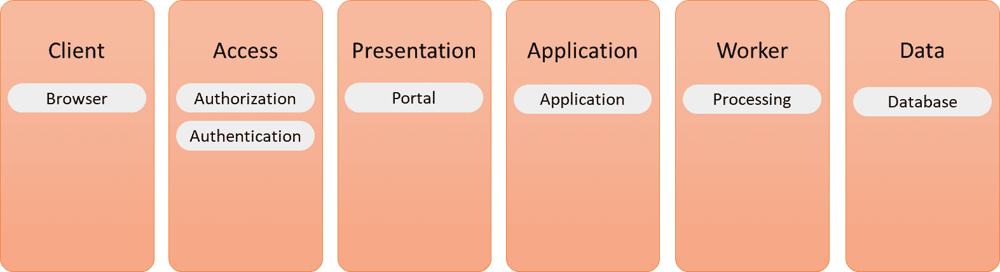
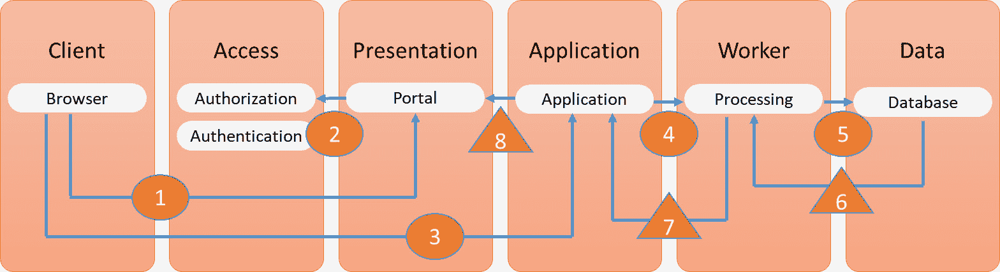
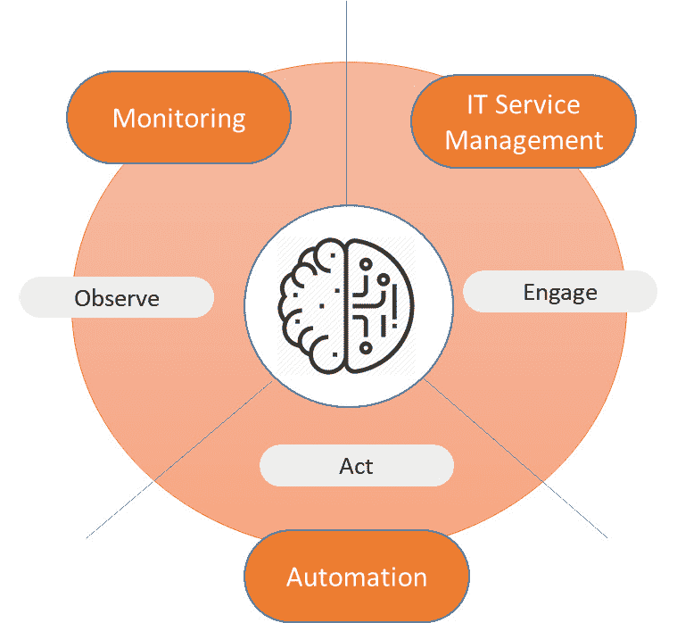
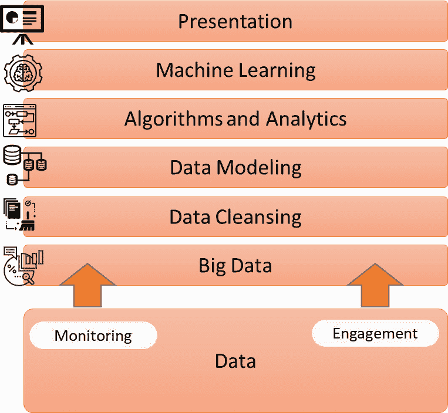
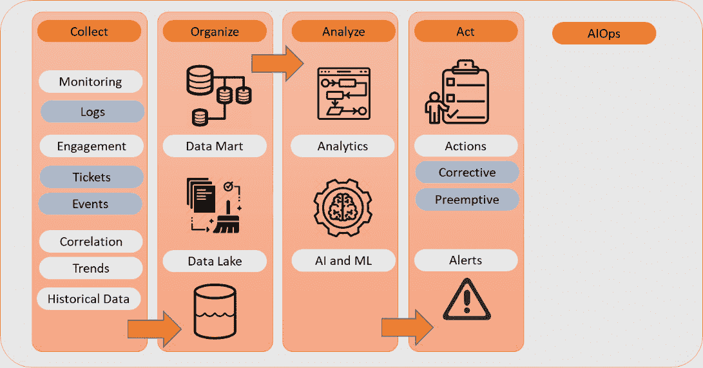
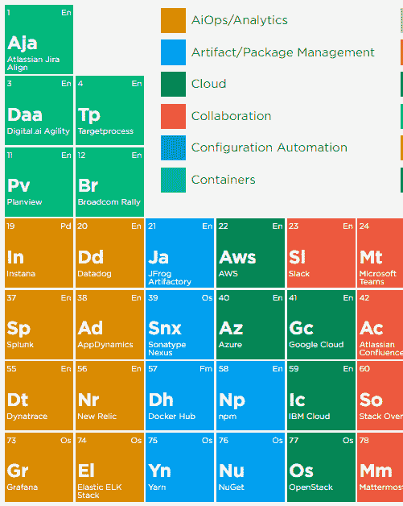

# *第八章*：构建 AIOps

在本章中，我们将学习**面向 IT 运维的人工智能**（**AIOps**）平台的设计及其与任何其他监控工具的区别。您将更好地理解为什么这些平台将成为未来 IT 的必需品。本章首先解释逻辑架构模型，然后深入探讨使用数据湖和机器学习分析 AIOps 中的关键组件。我们将定义 AIOps 平台的参考架构，并了解如何在 AIOps 中集成技术服务架构。本章将深入探讨算法、异常检测和自动修复。

完成本章后，您将能够识别 AIOps 的各种关键组件并定义参考架构。您将学习在企业中实施 AIOps 时避免一些重要陷阱的重要经验。

在本章中，我们将涵盖以下主要内容：

+   理解逻辑架构

+   定义 AIOps 架构的关键组件

+   将 AIOps 与服务架构集成

+   为 AIOps 定义参考架构

# 理解逻辑架构

在我们深入讨论 AIOps 的架构之前，我们需要了解逻辑架构的结构。在上一章节（*第七章*，*理解 AI 对 DevOps 的影响*）中，我们了解到实施 AIOps 的第一步之一是完全可见所有 IT 资产和流程。这是为了*提供* AIOps 模型的基本信息，了解 IT 环境的样貌。大多数 AIOps 工具将使用代理扫描环境，但这并不足够。它还需要了解资产之间的关系以及实施的流程。这些内容都涉及到逻辑架构。

逻辑架构不关注技术。它不在乎使用何种类型的机器或软件。逻辑架构描述的是在不涉及底层技术定义的情况下，系统中逻辑组件之间的关系。特定技术的选择——基础设施、软件、代码——稍后会添加到该架构中。逻辑架构旨在为技术设计提供一个可理解的系统概览。再次强调，逻辑架构通常由各层组成，如以下图表所示：

图 8.1 – 逻辑架构的组成部分

我们将在本节稍后详细讨论这些层及其组件。

逻辑架构应该是任何架构的起点。它包含了系统完成其功能所需的每个组件。因此，从期望的功能出发，架构师必须设计出系统所需的不同组件，以便能够实现该功能，而不受技术选择所带来的不可避免的约束的干扰。架构师需要考虑不同的系统层次、这些层次中的组件以及层次之间的交互。接下来，他们还需要考虑与其他系统的交互。

只有当这个逻辑模型在每个细节上都完全设计出来时，才能定义物理架构，将逻辑组件转换为技术组件，如具有网络设备和服务器的基础设施、操作系统，最终是技术应用组件，包括接口和 API。

为了帮助架构师定义逻辑架构，建议按如前图所示的层次进行工作。层次包括客户端、访问层、展示层、应用层、工作层（在某些文献中称为业务层）和数据层。这遵循系统在执行事务时常用的模式。

注意

事务不一定是金融交易。在系统架构中，事务指的是由输入触发并导致特定输出或请求并得到响应的系统操作。当然，这可以是一个实际的交易，例如订单处理。但事务也可以是传输给另一个系统的消息。

如果我们将请求-响应周期分解为独立步骤，它会是什么样子？

1.  用户通过展示层提出请求。

1.  用户通过访问层进行身份验证。

1.  身份验证后，请求被传输到应用层。

1.  从应用层开始，请求通过工作层进行处理。

1.  所需的数据从数据层收集。

1.  数据通过工作层进行处理。

1.  请求的响应在工作层准备，并发送到应用层。

1.  响应从应用层传输到展示层。

请求-响应流程如下图所示：

图 8.2 – 逻辑架构中的请求-响应流程

圆圈代表请求，三角形显示响应流程。现在，让我们更详细地看看不同的组件：

+   **客户端**：这是用户开始使用应用程序的入口点。通常，这指的是一个浏览器或设备上的小程序，允许用户连接到应用程序。

+   **访问层**：我们不希望任何人都能使用系统，因此用户需要进行授权和认证。访问层位于客户端和展示层之间：用户通过客户端访问展示层，然后在访问层进行授权和认证。授权通过后，请求便开始处理。

+   **展示层**：展示层有两个主要功能。首先，它帮助用户以易于理解的方式提出请求。一旦请求被处理，响应将在此层展示。

+   **应用层**：这是存储应用技术的层级。

+   **工作层**：有时这个层级被称为业务层，但这可能有点让人混淆。这个层级是处理请求的地方。基本上，这是存储应用功能的层级。它包含了所有使应用能够准备响应用户请求的组件，包括那些例如收集所需数据并处理数据的 API。

+   **数据层**：这个层级应该仅用于存储数据。工作层位于数据层和展示层之间，以确保客户端无法直接访问数据。它们总是需要通过工作层来访问数据。

如果只涉及一个系统，这个过程很简单，但企业通常有多个系统。这些系统互相连接，并可能依赖于其他系统。如果企业实现了**单点登录**（**SSO**），用户可能只需通过一次访问层。但很可能请求会在不同系统的工作层之间按照某个工作流进行流转。可能需要的数据来自不同的数据源。用户并不一定能在一个展示层中获得所有的响应，尽管从用户的角度来看，这可能是非常希望得到的结果。如果我们考虑到这一点，逻辑架构已经变得相当复杂，更不用说如果架构师在这个阶段尝试融入所有的技术细节了。

AIOps 通过这种逻辑架构工作。从中，它理解系统是如何设计的，以及它们与其他系统的关系。这是 AIOps 参考架构的基础。在我们进入参考架构之前，我们将看看 AIOps 架构的不同组件。这是下一部分的主题。

# 定义 AIOps 架构的关键组件

在这一部分，我们将讨论 AIOps 的关键组件。接着，我们将查看提供输入的操作服务，最后在最后一部分，我们将草拟参考架构。

首先，让我们回顾一下为什么我们需要在 IT 和特别是在 DevOps 中使用 AIOps。IT 已经变得更加复杂。系统托管在各种平台上，连接到其他系统，使用大量不同的数据源，数据格式也同样多样。我们已经来到几乎无法由人类保持这些复杂景观概览的地步。然而，市场对新功能的需求以迅速增加的速度增长。开发人员面临巨大的压力，需要交付满足新功能需求的代码，而运维人员则需要确保系统稳定运行。AIOps 可以帮助你做到以下几点：

+   **处理和评估数据**：AIOps 可以迅速、几乎实时地处理来自不同系统的数据，并验证这些数据。通过这样做，AIOps 能够生成警报，并提出减轻行动，以维持系统的期望性能。

+   **快速根本原因检测与分析**：由于 AIOps 可以访问所有数据并理解系统之间的互联关系，它将能够比操作员更快地找出问题的根本原因。

+   **启用自动化**：通过处理和评估数据，AIOps 将识别模式。这些模式会被转化为自动化序列，从而消除手动任务。同时，AIOps 会通过分析某些过程的结果，从这些模式中学习。如果一个模式持续导致不希望的结果，它会提出更改该模式的建议措施。工程师将从这些建议中受益。他们将减少花费时间寻找系统问题，而有更多时间用于改进系统。

+   **异常检测**：因为 AIOps 学习模式，它也能够识别这些模式中的偏差。这些偏差可能是异常：需要关注的事件。这可能是一个用户在几分钟内试图从相距数英里的两个地点获取访问权限，或者是 CI/CD 流水线中 API 被意外触发。因此，AI 也将大大提高系统的安全性，这是我们将在本书第三部分关于 DevSecOps 讨论的内容。

+   **自动修复**：复杂的 AIOps 系统可能能够自主解决问题，因为它们已经学习了模式并能检测到异常。由于 AIOps 系统高度自动化，它们还可以学习在出现 *已知* 问题时执行修复行动，通常是过去发生过的问题。AIOps 会学习这些问题是如何解决的，在这种情况下，相关行动可以自动化。请注意，这些问题的条件需要与问题首次发生时的条件相似。

总体而言，AIOps 绝对会提高 IT 效率，尤其是 DevOps 周期。开发者已经开始使用 AI 来发现各种系统中的相关性和模式，帮助他们改进代码，包括预测分析。这意味着反复询问“如果”的问题，只是速度更快，并且更有可能得到更准确的答案。

要能够实现这一点，AIOps 系统需要几个组件：

+   **源代码库和控制**：与 DevOps 中的 CI/CD 类似，所有代码都有一个源，因此系统始终可以从该源进行恢复。所有设计、模式、配置参数、应用程序代码以及所有其他 IT 工件，都保存在一个源代码库中，并处于版本控制之下。这是所有系统的基线。我们在《第七章》中讨论的**配置管理数据库**（CMDB），理解 AI 对 DevOps 的影响，也是这个仓库的一部分，但可能不包含应用程序代码。因此，完整的仓库将包含各种来源。

+   **大数据存储库**：AIOps 系统从各种来源收集大量数据，分析并用于自我训练，将数据建模成模式以实现进一步自动化。这些数据以其原始格式在分布式文件结构中收集，如数据湖。

+   **监控**：AIOps 系统可能使用代理程序来跟踪系统的性能，以及系统组件之间的连接是否可用。但大多数系统将从其他监控源汇总数据。在公共云中，这可能是 Azure Monitor、AWS CloudWatch 或 Google Cloud Monitoring，结合其他专门工具或供应商特定工具来监控 IT 环境中的特定组件。AIOps 将从这些工具获取原始数据，并用于自我训练。

+   **自动化**：自动化重复性任务和自动修复。

+   **机器学习**：这是 AIOps 的核心。从源代码库和收集的数据中，它将学习系统的行为方式以及与其他系统的连接方式。AIOps 将学习应用程序中数据的使用方式以及如何处理请求。AIOps 系统将使用大数据，将其与源代码库进行比较，并不断从这些分析中学习，以自动追踪问题并提出改进建议，为开发者和运维人员提供反馈。

现在我们需要理解这些组件如何协同工作。IT 研究和咨询公司 Gartner 已经定义了 AIOps 的模型，包括三个领域：

+   **观察**：这涉及跨系统实时跟踪和追踪所有指标。AIOps 通过将数据与来自源代码库的历史数据进行相关性分析，监控性能、连接和异常。

+   **参与**：这涉及所有与事件和变更相关的数据。参与领域将**IT 服务管理**（**ITSM**）流程与 AIOps 集成。这将在下一节中详细讨论。

+   **行动**：这包括基于监控数据（观察）和流程输出（参与）自动执行的任何操作，以及 AIOps 系统根据这些数据执行的动作。

该模型如下所示：

图 8.3 – AIOps 中的三个领域（原图来自 Gartner）

为了能够采取行动，AIOps 需要了解并学习 IT 服务是如何通过企业交付的。我们将在下一节讨论这一点，届时我们将学习技术服务架构如何与 AIOps 集成，从而以更高效的方式推动运营。

# 将 AIOps 与服务架构集成

到目前为止，我们已经看过 AIOps 的逻辑和不同组件。将人工智能引入运营的主要原因之一是通过主动监控系统，甚至在风险实际发生之前就减轻许多手动任务，避免潜在风险的出现。换句话说，AIOps 的发明是为了减少**站点可靠性工程**（**SRE**）所说的“繁琐工作”。这正是实施 DevOps 和 AIOps 的核心目的：减少繁琐工作并创造时间，持续设计和构建更好的系统。

但这不仅仅是关于系统本身。企业还有交付服务的过程。这就是服务架构的领域。更准确地说，是技术服务架构。它包括以下小节中讨论的过程。

## 监控

这不是一个开箱即用的功能。相反，架构师需要定义一个监控架构，包括哪些业务功能、应用程序和基础设施需要被监控，以便尽早获得关于系统状态的准确和适当的数据。下一个问题是如何自动化监控：哪些阈值需要引发动作，是否可以自动化这些动作？哪些日志需要存储、存储在哪儿，存储多长时间？建议自动存储日志，作为 AIOps 可以用来训练自身的大数据的一部分。接下来，监控架构会定义警报的路由：这是 AIOps 平台的关键输入。

## 问题管理

这一过程始于事件，最好是通过监控检测到，而不是用户向服务台报告问题。并不是每个事件都会导致问题。例如，用户因为凭据过期无法登录系统，可能会成为一个事件，但很少会导致根本原因分析和/或问题。如果事件很严重，影响到部分或整个业务，则需要执行问题管理。当类似事件多次发生时也是如此。问题管理需要分析原因，确定是否存在相关的事件和模式。因此，问题管理需要深入了解系统和工具。考虑到当今企业 IT 环境的复杂性，执行问题管理必然会涉及分析来自各个系统的大量数据。AIOps 将帮助分析这些数据，识别趋势，并更快地找到根本原因。

## 配置管理

系统的期望状态是什么？这是配置管理中的主要问题。**配置项**（**CIs**）被保存在一个仓库中，记录它们生命周期的状态。CIs 包括构成系统的每个组件：网络连接、服务器、软件、API 和策略。这些组件必须按照架构中定义的方式进行配置，以保持一致性。

示例：架构师决定 Windows 服务器始终运行 Windows Server 2019 版本，但使用特定设置，这些设置会在服务器策略中捕获。还决定数据库服务器始终运行 SQL 或使用 Azure SQL 作为 PaaS 服务。作为架构的一部分，数据库服务器绝不允许直接与外界通信，因此架构还将制定数据库服务器如何与其他服务器通信的策略，包括防火墙规则和连接字符串。

配置管理需要确保这些配置在组件的整个生命周期内保持一致，甚至在这些组件迁移到不同平台或不同阶段（开发、测试、验收和生产）时也不例外。因此，准确的配置管理对于确保系统质量和良好的变更管理至关重要。配置管理和期望状态是 AIOps 的基本输入。

## 变更管理

每当系统或系统组件被迁移、更新、升级、更改或淘汰时，都涉及变更管理。换句话说，变更管理不仅仅负责实施新系统。每当系统发生任何形式的变更时，变更管理都扮演着重要角色。为了支持变更管理，它需要一个关于配置项（CI）和组件配置的单一真实数据源——期望状态。它需要依赖于配置管理、准确的监控和一致的事件报告，这些事件是由系统记录的。在 AIOps 中，这被标识为历史数据，用来与变更进行比较，并验证系统是否仍然在期望的状态下运行。异常检测将在变更实施过程中帮助识别问题。

迄今为止讨论的所有这些过程都会产生数据，这些数据存储在由用户提交的工单中，或者更好的是，存储在由系统记录的事件中。在我们上一节中讨论的 AIOps 架构关键组件定义模型中，Gartner 将这类数据称为参与数据。

参与数据用于以下内容：

+   任务自动化

+   变更风险分析

+   性能分析

+   知识管理

参与意味着 IT 服务管理（ITSM）与通过监控、事件和系统指标衍生的操作数据进行沟通。所有这些数据都会聚合到一个存储库中，即大数据平台，以便 AIOps 系统拥有一个数据库，可以用来分析系统的健康状况和性能。

## AIOps 中的大数据

这个大数据平台是 AIOps 的核心：它将捕捉来自不同系统的数据，而不受这些系统的孤岛限制。我们说的孤岛是什么意思？一个系统可能在私有数据中心中有多个组件，并且与公共云中的 PaaS 或 SaaS 服务进行通信。为了获得整个系统的集成视图，AIOps 需要访问一个聚合的数据源——大数据平台。该平台将包含历史数据、系统迭代数据以及通过交互式大数据分析获得的实时系统数据。

总结一下，AIOps 平台具有操作数据和过程数据：

+   来源于许多不同系统的数据

+   分析流式实时数据和历史数据的能力

+   处理来自事件、日志、警报和根本原因分析的数据

+   将 IT 流程集成并与操作系统数据进行关联的能力

+   以易于理解的方式可视化数据的能力

下图展示了 AIOps 技术栈：

图 8.4 – AIOps 技术栈的高层建模

我们已经广泛覆盖了 Gartner 模型中的观察和参与领域。基于数据和服务模式，AIOps 现在可以开始执行活动，这是 AIOps 的最终阶段。它可以通过使用运行手册和脚本来自动化任务。最后一步是将组件转化为 AIOps 平台的架构。在最后一节中，我们将定义一个参考架构，并将所有内容整合起来。最后，我们将提供一些工具，帮助你开始使用 AIOps。

# 定义 AIOps 的参考架构

在前面的章节中，我们研究了系统的逻辑架构、AIOps 的组件以及技术服务架构。所有这些构建模块都用于定义 AIOps 的架构。在本节中，我们将讨论 AIOps 的参考架构。

首先，让我们回顾一下 AIOps 的目标。在 *第七章*，*理解 AI 对 DevOps 的影响* 中，我们讨论了 AIOps 的**关键绩效指标**（**KPIs**）：

+   **平均检测时间**（**MTTD**）

+   **平均响应时间**（**MTTA**）

+   **平均解决时间**（**MTTR**）

AIOps 将人工智能引入 IT 操作，利用大数据分析和**机器学习**（**ML**）。AIOps 系统从各种系统和工具中收集和汇总数据，以便快速检测问题和异常，将实时数据与反映系统原始期望状态的历史数据进行比较。通过机器学习，它学会了如何通过自动化操作来缓解问题。最终，它将学会如何预测事件并避免它们对系统造成影响。

为了实现这一目标，AIOps 基于算法和异常检测来处理预测性警报。它*知道*系统应该如何反应和响应，以及系统如何与其他系统交互。偏差会迅速被发现、分析和验证：这些偏差是处于正常行为范围内，还是超出了该范围？如果系统出现异常，可能会带来什么后果？

AIOps 只有在提供数据时才能评估这些事件：系统数据和过程数据，例如请求以及已发生的事件和问题的数据。它需要这些数据来学习并适应算法，从而随着时间推移变得更准确。

在上一节中，我们学习了 AIOps 的三个领域：观察、参与和行动。现在我们需要将其转化为参考架构。我们可以通过创建四个层次来执行操作任务来实现这一点。如下图所示：

图 8.5 – AIOps 的逻辑参考架构

这四个层次包含了各种组件，就像我们在本章的*定义 AIOps 架构的关键组件*一节中讨论的系统逻辑架构一样：

+   收集

+   组织

+   分析

+   行动

过程从不同的服务作为输入开始：请求、事件、问题和更改。在上一节中，我们了解到这些都包含在参与数据中。AIOps 系统现在将执行几个步骤：

1.  收集是 AIOps 系统执行的第一步：它将从尽可能多的来源收集观察结果和参与数据，包括系统指标、事件、日志，甚至来自服务台提出的工单信息。所有这些数据都将发送到数据湖，即 AIOps 系统的主要存储库。

1.  数据湖将保存原始数据：从系统和监控工具中获取的源数据。原始数据格式将保持不变。因此，下一步是对这些数据进行组织。请记住，AIOps 可以访问尽可能多的数据时，准确性会提高。随着更多数据源被添加到数据湖并与之集成，AI 分析的结果会更可靠。这带来了一个挑战：原始数据会包含噪声。必须清洗这些导入的数据。

    数据科学中的一个重要教训是“垃圾进，垃圾出”。为了让 AI 提供准确的建议并*学习*正确的数据，我们需要确保它只使用合适的数据集。数据模型也需要进行训练。这将需要一些时间：系统需要被告知什么是好数据以及这些数据可以用来做什么。这样，算法会随着时间的推移变得更加准确。

    通过一个例子可以更清楚地说明。监控将收集服务器中 CPU 的数据。这个 CPU 可能会有 90% 的使用峰值，但总体使用率大约为 20%。AIOps 需要学习，例如 20% 到 40% 之间的值是正常的。它还需要学习，如果 90% 的峰值持续时间非常短，那是可以接受的，而且不必为此触发警报。现在，模型可以根据这些参数筛选事件和日志数据，并识别出超出该阈值的系统。事实上，常规监控系统已经能够做到这一点，但 AIOps 将能够将 CPU 性能的异常与其他事件关联起来。而且它能够自动启动修复措施。

1.  经清洗和结构化的原始数据将用于训练 AI 模型，采用机器学习和深度学习。

1.  实时数据与历史数据进行比较，包括原始配置、已执行的更改和已发生的事件。通过不断比较这些数据，AIOps 系统会学习，并能够展示事件的时间线。这使得在某些情况下，操作员能够通过一系列事件进行*时间旅行*，调查系统状态何时以及为何发生变化。

1.  最后一步是执行。经过训练的 AI 模型将根据对先前事件的学习以及在特定事件发生时所采取的行动，发送预测警报并开始缓解措施。显然，所有的警报和措施都作为数据返回到数据湖中。

我们准备开始实施 AIOps 平台了。在接下来的部分，我们将讨论成功实施的方案，并指出一些潜在的陷阱。在最后一部分，我们将简要概述一些流行的工具。

## 成功实施 AIOps

AIOps 仍然是 IT 操作中的一个相对较新的现象，实施 AIOps 平台可能非常复杂。然而，考虑到以下步骤，成功实施应该是可以做到的。第一个，也是可能最重要的教训是，从小处着手，就像 DevOps 和 SRE 一样。

在你开始之前，你需要一个计划。确定哪个系统适合做试点。选择一个具有基础架构的系统：一个只有网站作为前端的应用程序、应用程序本身和数据库。验证与此应用程序相关的所有资产是否已被良好记录，并在 CMDB 中识别出来。接下来，确保你对与该应用程序相关的工作流和流程有一个良好的——并且是有文档记录的——理解。

为什么这很重要？AIOps 平台以及工程师——操作员——需要学习如何与 AI、机器学习和分析工具一起工作。操作员希望从平台中得到什么？什么类型的警报？并且，是否清楚他们应该如何处理这些警报，或者如何利用 AIOps 来分析警报并帮助自动化行动？操作员需要了解 AIOps 系统所需的数据类型，因此他们需要学习数据要求、数据流、将数据存储在数据湖中以及建模数据分析。这肯定需要时间。

现在，AIOps 系统可以进一步配置，并可以添加更多 IT 组件，以确保系统能够从不同的使用场景中学习。强烈建议在前几周，甚至长达 2 个月的时间内，以测试模式运行平台，让 AIOps 进行学习。一旦操作员对功能和分析结果满意，就可以将其推向生产环境。但始终需要通过原始系统指标和实施 AIOps 时设定的目标来验证结果。简单的问题是：这些目标在测试阶段是否达成？如果目标是加快定义事件根本原因所需的时间，那么这个目标应该是可衡量的，并与原始指标进行比较。换句话说：任何系统的实施必须有一个有效的商业案例。

所以，第一步是捕获操作数据：来自基础设施组件、应用程序、数据库和 API 的日志和指标。接下来，我们需要来自工作流和业务流程的数据。我们可能还需要其他关联数据，例如，关于销售和市场情绪的数据，"预测"某些服务在特定时期内的流行程度以及在什么条件下流行。

使用案例

一家国际运营的铁路公司几年前实施了 AIOps。他们的基础设施建立在多个平台上，包括 AWS 和 Google Cloud，使用了许多不同的工具进行监控和开发。这些平台及其依赖项缺乏实时可见性，导致开发进度放缓，还导致根本原因分析的严重延迟。这导致了一些重大停机事件，影响了旅客。通过将来自不同平台的数据汇集并整合 AWS CloudWatch 和 Google Analytics 等监控工具，该公司能够对所有相关系统进行集成视图。通过利用这些数据，实施了 AIOps 工具来实时分析事件，显著降低了 MTTD 和 MTTR。

该使用案例表明，我们能够获取的数据越多，我们的 AIOps 平台就会越准确。这些数据将揭示事件之间的相关性，并最终确保 AIOps 理解这些事件的根本原因。从这一点开始，您可以通过监控中的实时观察和创建自动化响应来训练平台进行解决方案。

实现 AIOps 平台的一个关键步骤是要真正让操作员参与其中。他们是并且将始终是从平台中获取实际价值的重要角色。换句话说，AI 不是为了取代操作员——恰恰相反。该系统将使他们能够摆脱繁琐、重复且通常是手动的任务——记住 SRE 中的*劳动*——并让他们能够专注于其他更具挑战性的任务，这些任务是开发、测试和推出新系统所必需的。

不涉及操作员只是其中一个陷阱。在接下来的部分中，我们将简要概述一些其他潜在的陷阱。

## 避免 AIOps 的陷阱

在实现 AIOps 平台时，除了不涉及操作员外，还有三个主要的陷阱必须避免：

+   **数据不足**：只有有限的数据集，AIOps 平台无法正常工作。没有足够的数据，系统永远无法准确。发现、问题、事件和异常将无法或只能偶尔被检测到，这将使系统不可靠，产生误报，甚至解决不需要解决的问题。

+   **错误或无关的数据**：这可能比数据不足还要糟糕。错误的数据肯定会导致错误的结果和意外或不希望出现的行动。为了以正确的方式学习，AI 需要足够且有效的数据。

+   **数据孤岛**：AIOps 平台从多个系统获取数据。然而，AIOps 需要将这些数据从一个来源提供，以便进行数据分析。操作数据、应用性能数据、连接性数据和安全数据：这些数据需要汇集到一个来源，以使系统在生成有价值的数据集时既快速又高效。换句话说，数据孤岛需要被打破。

总结来说，AIOps 需要足够的数据、相关的数据，并将其存储在一个仓库中，以便能够创建用于运营分析的有价值数据集。到现在，你应该已经意识到 AIOps 系统是复杂的，但越来越多的工具可以帮助你入门。我们将在本章最后一节列出一些这些工具。

## AIOps 中的流行工具

最后，我们将提供一些工具，帮助你开始使用 AIOps。近年来，AIOps 领域发展迅速。请看下图中的 DevOps 工具周期表：AIOps 类别是最近才加入的，已经列出了大量的工具，例如 Splunk、Datadog、Dynatrace、New Relic 和 Elastic ELK Stack：

图 8.6 – 来自 DevOps 工具周期表的片段，展示了 AIOps 工具（Digital.ai）

选择合适的工具并不容易。原因在于，这些工具之间的差异非常大。它取决于企业评估合适工具和工具集的角度。需要考虑的事项包括以下几点：

+   侧重于应用程序和应用程序性能管理的工具，而非基础设施组件

+   SaaS 或本地部署工具

+   原生 AI 和 ML 或需要扩展的工具

+   数据驱动的 AI 或者同时具有上下文感知的 AI

    注意

    Gartner 每年发布一次魔力象限，识别这一新兴市场中的领导者和有前景的新兴公司。该报告可以从 Gartner 网站下载：[`www.gartner.com/en/documents/4000217/market-guide-for-aiops-platforms`](https://www.gartner.com/en/documents/4000217/market-guide-for-aiops-platforms)。请注意，你或你的雇主需要成为客户，才能从 Gartner 网站下载内容。

显然，更复杂的工具会有较高的价格。企业必须问自己最重要的问题是，它希望从 AIOps 中获得什么。这将推动商业案例，并可能证明投资的合理性。

# 总结

本章深入探讨了 AIOps。这是一个相对较新的领域，但前景非常广阔。我们学习了 AIOps 平台是如何构建的，并随着它们在企业中的实施不断学习。重要的是要理解，你需要一个逻辑架构，以便全面了解系统如何完成功能以及它们如何与其他系统相关联，而不需要已经知道这些系统的所有技术细节。

接下来，我们定义了 AIOps 的关键组件，即大数据和机器学习或深度学习。AI 只有在获得足够相关数据的情况下，才能执行分析模型。这些模型将教平台如何检测问题、异常和其他事件，预测对 IT 领域的影响，更快找到根本原因，并最终触发行动。这些行动可以被自动化。AIOps 平台将避免许多繁琐、重复的工作，这种工作在 SRE 中被称为 toil。

我们已经了解了 AIOps 的参考架构是什么样的，以及企业如何成功地实施该系统。在上一段中，我们简要地了解了一些该领域的流行工具。

在下一章中，我们将学习如何将 AIOps 融入 DevOps。

# 问题

1.  逻辑架构中的展示层是做什么的？

1.  AIOps 平台能够通过算法检测与预期系统行为的偏差。我们称这种检测偏差的过程为何？这是 AIOps 的一个关键特性。

1.  AIOps 处理来自操作系统的数据和来自事件（如事故和问题）的数据。Gartner 如何称呼这种后者类型的数据？

1.  对错：数据清洗在 AIOps 中至关重要。

# 进一步阅读

*实用企业架构*，詹姆斯·V·卢伊西，2014 年
