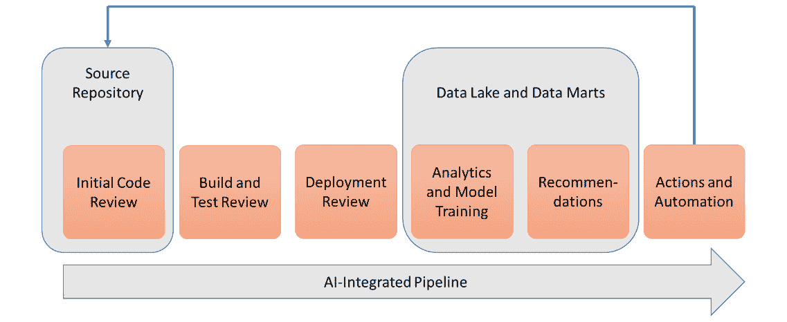
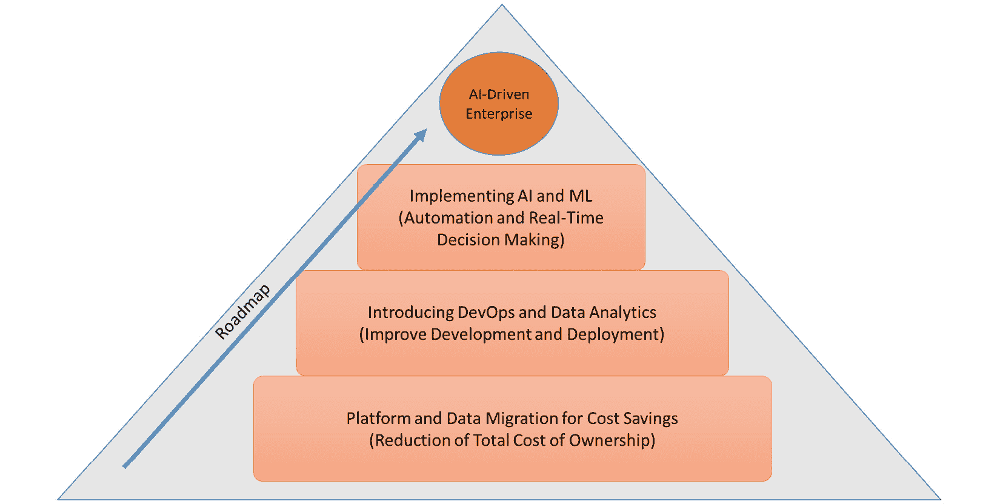
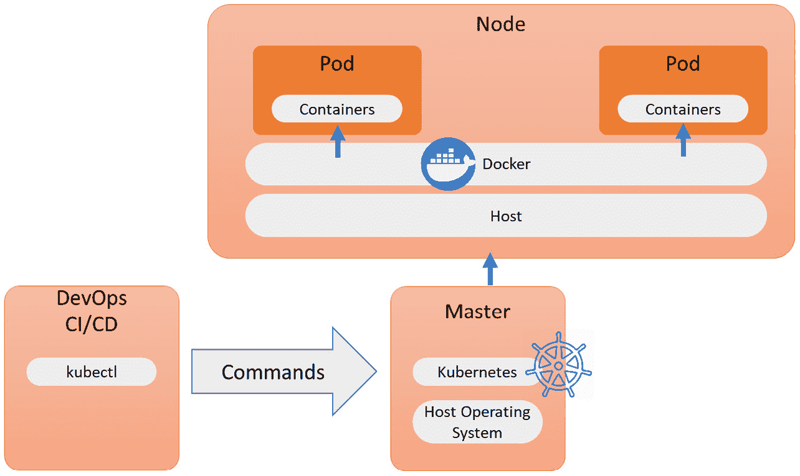
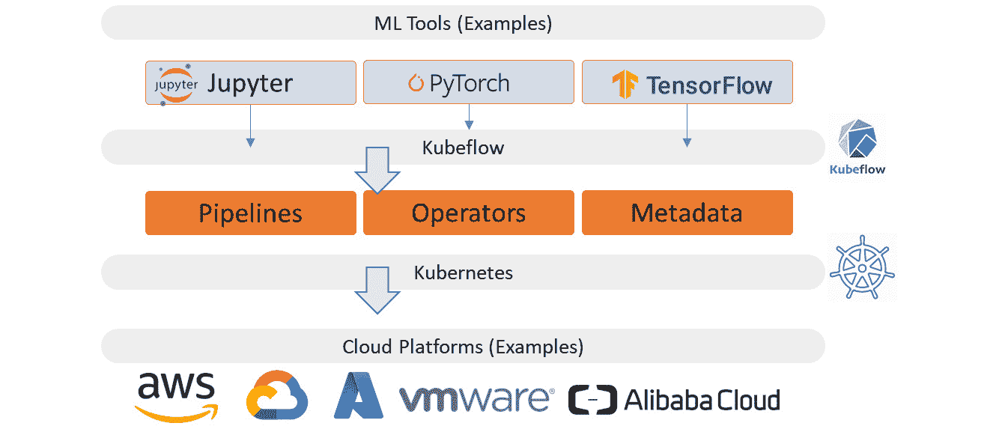
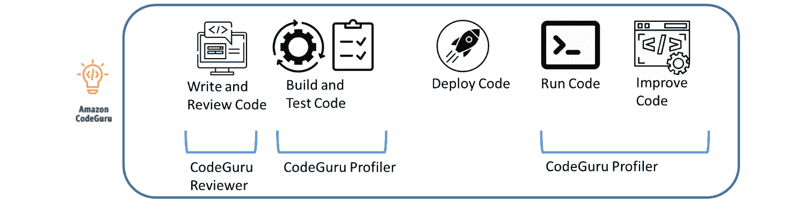
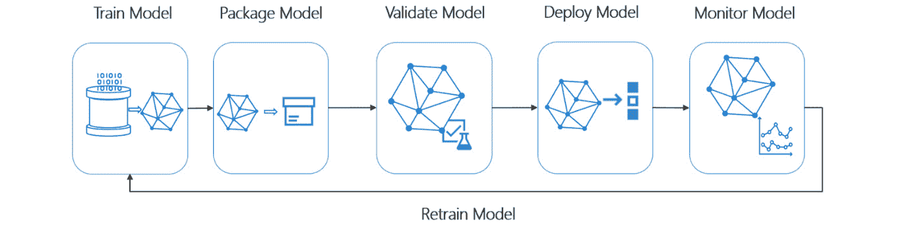

# 第九章：将 AIOps 融入 DevOps

到目前为止，我们从 DevOps 视角探讨了自动化开发，并已实现自动化运营。接下来的步骤是**人工智能**（**AI**）驱动的 DevOps。DevOps 工程师管理着多个库和各种管道。为了加速数字化转型，及时发现并解决问题至关重要。AI 在这些 DevOps 流程中也能带来巨大的附加价值。本章将向你介绍如何实现 AI 驱动的 DevOps，并推动快速创新。

完成本章后，你将对实现和集成 AI 驱动的开发与部署管道所需采取的各种步骤有较好的了解。你将接触到一些主要工具，并了解实现这些工具作为数字化转型创新一部分的要求。

在本章中，我们将讨论以下主要内容：

+   引入 AI 驱动的 DevOps

+   为数字化转型启用快速创新

+   使用 AIOps 监控管道

+   评估企业对 AI 驱动 DevOps 的准备情况

# 引入 AI 驱动的 DevOps

在上一章中，我们研究了 AIOps 平台，得出结论，它将帮助运维人员摆脱繁琐的重复任务，更快地检测和解决问题，并实现更稳定的系统。稳定性和弹性仍然是运维人员在 IT 系统中追求的关键目标，但随着新功能和系统更改以更快的速度开发和发布，如果 AI 能帮助运维，它也能帮助开发。本节将解释为什么 AI 驱动的 DevOps 有助于以更高的速度创造更好的系统。

AI 可以帮助开发者比单纯的手动操作或没有 AI 支持的自动化过程更快地监控和检测构建中的问题。借助 AI，可以持续监控代码变化，将其与其他代码构建模块进行比较，并迅速发现问题。同时，AI 还能实现预测性缓解：它将学习某些代码更改可能对系统产生的影响。考虑到系统的复杂性不断增加，且新功能和新代码以越来越快的速度开发，AI 驱动的 DevOps 是确保系统稳定性的解决方案。AI 将帮助管理各种代码库，跟踪配置和部署脚本，并避免意外的应用行为。

它是如何工作的？就像我们在*第八章*中讨论的 AIOps 一样，*架构 AIOps*。AI 驱动的 DevOps 将从 DevOps 周期中的模式中学习。为了做到这一点，它需要数据。它将使用存储在代码库中的代码数据，以及用于构建 CI/CD 管道的过程数据，然后运行各种测试和部署程序。此外，它还会从历史数据中学习；即，发生过的问题和事件，以及这些问题是如何解决的。通过分析和机器学习，AI 将学会如何优化代码构建、测试和部署。

DevOps 在过去十年中确实有所发展，但开发人员和运维人员仍然面临一些繁琐的任务，如编码、测试和将新特性部署到系统中。许多工作仍然非常手动，且在测试和代码审查中需要多个步骤。由于代码变得越来越复杂，系统也越来越与各种平台交织在一起，问题可能无法及时或根本无法被发现。为了节省时间，代码审查有时通过抽样进行：随机挑选一些代码，并对这一特定代码段进行审查，不能保证其余代码是正确的。那么，什么时候代码是 OK 的呢？通常，重点是去除空行或过时的空格，但这些问题可以通过格式化工具轻松解决。显然，必须消除 bug，但代码也需要优化以便表现良好。所有这些都需要在生产环境保持运行和稳定的情况下完成。

AI、**机器学习**（**ML**）和深度学习可以帮助克服这些问题。接着，就是 AI 驱动的 DevOps。这需要以下组件：

+   访问和控制源代码库

+   用于建模的数据湖和数据集市

+   AI 集成管道

基本过程包含下图所示的步骤：

图 9.1 – AI 集成管道的概念

我们将在*使用 AIOps 监控管道*一节中详细说明这些步骤，我们将讨论用于监控 DevOps 管道中流程的各种工具和技术。

AI 是 DevOps 中的一个新领域。这是一个可以加速企业数字化转型的创新。在深入探讨如何将 AI 融入 DevOps 管道之前，最好先更好地理解创新周期以及为何要引入 AI 和机器学习（ML）。我们将在下一节讨论这一点。

# 促进数字化转型中的快速创新

现代企业大多数都在积极推动业务转型，使其更加数字原生。我们在本书的前两章中已经详细讨论了这一点。客户不断要求新的功能，而且他们希望这些功能几乎能立即交付。为了控制这一过程，企业需要制定一个创新战略，以适应快速创新。创新战略可以被描绘为一个金字塔，AI 驱动的创新位于这个金字塔的顶端。

这可以在下图中看到：

图 9.2 – AI 驱动创新金字塔

企业不会一蹴而就地登上金字塔的顶端；它们通常从底部开始，创新由节约成本驱动。从这里，它们需要开发下一步，从而通过 AI 和 ML 实现快速创新。

第一阶段通常涉及如何寻找预算，这通常是通过实施能够带来大幅节约成本的技术来实现的，例如，通过迁移到另一个平台。平台的选择至关重要：企业会希望确保他们做出的是未来可持续的选择，并且已经规划好通过这些创新来推动数字化转型。这样的平台可以是公共云，提供的不仅仅是托管服务，还允许我们使用云原生技术，并将其与 DevOps、AI 和 ML 集成。

更为重要的一步是收集并利用数据。AI 和 ML 需要数据，而数据需要进行聚合，以便用于分析和训练数据模型。数据可能是任何企业中最有价值的资产，因此这一步将耗费大量时间。

聚合数据并不意味着每一条数据都需要存放在同一个数据湖中。不同的数据集会有不同的需求，但架构师必须考虑如何在没有企业传统数据孤岛的情况下高效地创建这些数据集。接下来是数据安全：谁有权查看哪些数据以及出于什么原因？如何防止数据流向不该去的地方？**身份和访问管理**（**IAM**）和**数据丢失防护**（**DLP**）是非常重要的话题。为此，企业需要拥有一个一致的数据分类系统。

现在，我们可以将 AI 和 ML 引入讨论。数据模型需要进行训练、部署，并与 CI/CD 流水线集成，以增强编码和应用程序开发。这些流水线将不得不与选定平台的 数据分析模型和 AI 服务进行集成。这一过程的终点可能是一个由 AI 控制的 CI/CD 流水线。这就是下一节的主题，我们将在其中查看主要公共云平台中的一些 AI 驱动工具；即 Google Cloud Platform、AWS 和 Azure。

# 使用 AIOps 监控流水线

在本节中，我们将研究由 AI 驱动的技术，这些技术将帮助开发人员监控和改进他们的 CI/CD 流水线。首先，让我们回顾一下流水线的基本原理。流水线应该被视为一个工作流：它引导代码通过一个过程，在这个过程中，代码会经过测试，最终部署到平台上。按照这个过程，代码会被推送到推广路径中的不同阶段：开发、测试、验收和生产。这个过程可以被自动化。

在这个过程的开始，也就是流水线的起点，有一个存储系统各个组件的代码库。由于一切都是代码，代码库将保存应用程序代码、基础设施组件、配置模板以及启动 API 的脚本。在通过流水线构建系统时，DevOps 软件会确保从代码库中提取适当的组件，并将其编译成可以部署的包。一种常见的做法是使用容器，比如通过 Kubernetes 编排的 Docker 镜像。容器也非常适合将 AI 和机器学习注入到流水线中。下图展示了 Kubernetes 的基本功能：

图 9.3 – Kubernetes 的功能

在 DevOps CI/CD 流水线中，可以通过 Kubernetes 指示如何使用容器将组件推送到目标平台。为了实现这一点，我们可以使用 Kubernetes 的`kubectl`命令行工具。该工具可以向 Kubernetes 集群发送命令，告诉这些集群如何部署应用代码，同时监控集群的资源和主机。

## 介绍谷歌的 Kubeflow

根据其官方文档，Kubeflow 是 Kubernetes 的机器学习工具包。它允许我们在 Kubernetes 上实现并监控复杂的工作流和应用开发过程，使用机器学习在任何云平台上运行，如 AWS、Azure 和 Google Cloud 等。

对流水线中所有组件的深入监控和分析是 Kubeflow 的核心功能之一。最初，TensorFlow 和 PyTorch 用于训练数据模型。用 Kubeflow 本身的话说，它通过使用机器学习处理所有的*无聊的部分*，使开发人员能够专注于新特性。

Kubeflow 的高层架构如下面的图所示：

图 9.4 – Kubeflow 的概念架构

机器学习（ML）用于加载大量数据，验证这些数据，处理它们，并通过这些操作训练模型，使其能够从数据中学习。然而，开发人员希望能够大规模地执行这些操作。一个例子是图像识别。你可以训练 ML 模型识别图像，这一功能在医院的诊断成像中变得越来越流行。例如，利用 AI 和 ML，CT 扫描等临床图像可以被评估、去噪，并突出显示可能的关注区域，帮助医生更快地做出更准确的诊断。为了大规模运行这种类型的模型，使用容器是一种可行的选择。这正是 Kubeflow 的作用。

注意

在 [`www.kubeflow.org/docs/examples/`](https://www.kubeflow.org/docs/examples/) 上，你可以找到 Kubeflow 用例的教程和示例，包括图像识别的示例和如何在 Kubeflow 集群上使用 Jupyter Notebook 的教程。

Kubeflow 的架构表明，AI 驱动的 DevOps 需要多个组件，且不同的工具需要进行集成。其中一些工具是平台原生的，比如 AWS 的 CodeGuru 和 Azure 中的 MLOps。我们将在以下章节中简要评估这些工具。

## 引入 AWS 的 CodeGuru

还有更多的开发正在进行中，证明这是一个增长中的市场。例如，AWS 在 2021 年 5 月宣布引入 DevOps 中的 ML，使用的是 CodeGuru。

CodeGuru Reviewer 是一个使用 ML 检测代码中的问题和漏洞的工具，它还能发现已应用于代码的安全策略中的漏洞。它还提供改进代码的建议，无论是解决漏洞，还是提出对代码的增强建议。

CodeGuru 的第二个组件是 CodeGuru Profiler。完成代码审查后，Profiler 验证代码的运行时，识别并去除代码中的低效之处，从而提高应用程序的性能。AWS 声称它还有助于降低计算成本，因为 Profiler 还会检查代码在运行过程中所调用的资源。通过使用 ML，它可以主动地执行这一操作，因为它通过比较新代码与现有代码模式来学习如何优化代码。根据 AWS 的文档，自 CodeGuru 推出以来，它已经审查了超过 2 亿行代码。

以下图表展示了使用 CodeGuru Reviewer 和 CodeGuru Profiler 的 CodeGuru 架构：

图 9.5 – AWS 的 CodeGuru 和 CodeGuru Profiler

该领域的下一个步骤是 Amazon DevOps Guru。DevOps Guru 更侧重于 DevOps 的基础设施层面。它运行预训练的 ML 模型，分析系统日志和度量指标，与操作基准进行对比，从而检测基础设施组件中的异常。由于它使用深度学习，模型会持续训练和增强。

## 在 Azure 中引入 MLOps

所有主要的云服务提供商都拥有基于人工智能的解决方案。我们将简要讨论的最后一个是 Azure 中的 MLOps。其基本原理与 CodeGuru 相同：MLOps 会从代码库中拉取代码，这通常与 Azure DevOps 集成。下图展示了 MLOps 的架构：

图 9.6 – 微软 Azure 中的 MLOps 架构

MLOps 对提交的代码执行各种测试。尽管结果与其他基于人工智能的工具类似，但 MLOps 的工作方式有所不同，它使用 Azure ML 管道来训练模型。然而，MLOps 还在容器化基础上运行，采用 **Azure Kubernetes 服务**（**AKS**）和 **Azure 容器实例**（**ACI**）。

总结来说，使用基于人工智能的 DevOps 会让你能够做到以下几点：

+   识别缺失的代码。

+   检测写得不好的代码。

+   检测不必要的代码。

+   检测预期和/或必需但缺失的依赖项。

+   执行配置检查。

+   提出改进建议。

+   触发自动化改进行动。

基于人工智能的 DevOps 是一个快速增长的市场，因此，除了 Google 推出的原生服务如 CodeGuru 和 Kubeflow 外，过去几年中许多初创公司也推出了大量新兴工具。例子包括 Pipeline.ai、DataRobot 的 Enterprise AI、Hydrosphere.io 和 Xpanse AI。前三个主要专注于机器学习驱动的管道，而 Xpanse AI 是一个用于使用人工智能创建数据模型的环境。

注意

在本章中，我们讨论的是增强了人工智能和机器学习的 DevOps 管道。为了开始数据建模和数据分析，你还需要一些工具来支持它们。在这个领域中，流行的工具包括 Databricks、MapR、Cloudera 和 RapidMiner。

总结来说，企业投资于基于人工智能的 DevOps 是有意义的，这可以促进快速创新并加速数字化转型。那么，第一个需要回答的问题是，企业何时准备好进行这种范式转变？我们将在接下来的部分简要讨论这个问题。

# 评估企业在人工智能驱动的 DevOps 方面的准备情况

到目前为止，我们已经了解到，数字化转型是一个渐进的过程。它不会一步到位；企业需要为此做好准备。它包括采用云平台和云原生技术。企业将拥有遗留系统，并且可能有大量数据存放在不同的数据孤岛中，这给企业带来了如何优化利用这些数据的挑战。认为人工智能驱动的工具和数据科学能够一开始就解决这个问题是一种误解。

企业需要对所有资产进行全面的概览，还需要了解其技能和能力。首先，数据专家需要评估数据源的位置、格式和可用性。接着，数据科学家将需要设计数据模型。他们不能单独进行此操作：他们必须与 DevOps 工程师和应用所有者合作，达成版本控制、模型训练和测试等方面的共识。

达成共识的数据模型随后可以集成到 DevOps 流水线中。在上一节中，我们了解到，必须选择并与 CI/CD 工具集成工具，例如，通过使用容器和容器编排平台如 Kubernetes。专注于 ML 的工程师可以通过利用 AI 的优势来帮助实施、跟踪和训练这些数据模型。

这还不是全部。流程——我们称之为参与流程——如事件、问题和变更管理，需要与新的开发和部署设置保持一致。服务经理将需要理解与 ML 和 AI 驱动的平台相关的新指标。平台出现警报或建议时，应该怎么做？监控了哪些内容，为什么要监控这些？任务是否可以进一步自动化，从而节省时间并降低成本？

然而，最重要的问题是，哪些建议需要采取行动以改进开发并加快发布速度？人工智能可以提供帮助，但它需要时间来*学习*企业的运作。需要经过培训和具有技能的员工来帮助人工智能熟悉企业。这不是魔法。

总结来说，企业需要具备以下内容：

+   完整的资产可视化

+   对所有数据源的全面可视化，以及这些数据源与业务流程的关系

+   在整个企业中实施的参与流程，以确保一致性

+   经过培训和具有技能的员工，如 DevOps 工程师、数据科学家和 AI/ML 工程师

+   一个具有现实时间表的创新路线图

前述的路线图可能会引领到一个遥远的未来，在这个未来，运营完全由 AI 和 ML 自动化，不再需要人工干预。这就是 NoOps 的作用。在 *第十章*，*迈向 NoOps 的最后一步*，我们将介绍这一概念。

# 总结

在本章中，我们学习了如何将 AI 和 ML 集成到 DevOps 流水线中。我们讨论了实施 AI 驱动的 DevOps 的基本要求和步骤，从访问源代码仓库、创建数据湖、启动和训练数据模型到后续建议和行动。我们还了解到，AI 驱动的 DevOps 是数字化转型的一个阶段，但企业需要制定一条路线图，最终使他们能够将 AI 和 ML 集成到开发和部署过程中。基于 AI 的开发和运营处于数字化转型创新的顶端。

接下来，我们介绍了一些能够帮助我们实施 AI 驱动 DevOps 的工具。我们了解到，这是一个快速增长的市场，主要云服务提供商正试图将它们的原生 DevOps 工具与 AI 和机器学习结合起来。比如谷歌的 Kubeflow、AWS 的 CodeGuru 和微软 Azure 的 MLOps。

最后，我们讨论了希望实施 AI 驱动 DevOps 的企业的准备评估。制定一个全面的路线图至关重要，其中包括不同的步骤和一个现实的时间表。该路线图的最终目标可能是实现完全自动化的管道编排，无需任何人工干预：NoOps。这是下一章的主题。

# 问题

1.  我们介绍了数字化转型的创新金字塔。那么，这个金字塔的基础平台是什么？

1.  将 AI 集成到 DevOps 管道中通常是通过容器化完成的。我们讨论了一种容器编排工具，允许我们将容器无缝地部署到各种平台上。这个工具叫什么名字？

1.  列举三个 AI 驱动的 DevOps 可能带来的结果/成果，特别是在提升代码质量方面。

# 进一步阅读

+   *实用企业架构*，作者：James V. Luisi，2014 年

+   Kubeflow 文档：[`www.kubeflow.org/`](https://www.kubeflow.org/)

+   关于 AWS 推出 CodeGuru 的博客：[`www.allthingsdistributed.com/2021/05/devops-powered-by-machine-learning.html`](https://www.allthingsdistributed.com/2021/05/devops-powered-by-machine-learning.html)

+   由 Lee Stott 撰写的关于微软 Azure 中 MLOps 的博客：[`techcommunity.microsoft.com/t5/educator-developer-blog/machine-learning-devops-mlops-with-azure-ml/ba-p/742150`](https://techcommunity.microsoft.com/t5/educator-developer-blog/machine-learning-devops-mlops-with-azure-ml/ba-p/742150)
