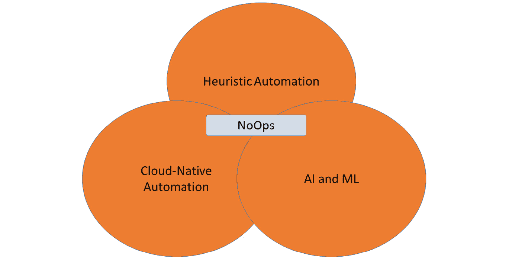

# *第十章*：迈向 NoOps 的最终一步

是否可以在没有实际操作的情况下执行 IT 运维？研究和咨询公司，如 Gartner 和 Forrester，预见到基于 NoOps 的 IT 未来。NoOps 背后的核心理念是，几乎一切都可以自动化。这意味着 AI 的作用将更为重要，并且有一种叫做**启发式自动化**的技术。企业如何向 NoOps 转型，架构师在这一领域中的角色是什么？我们将在本章中讨论这些问题。

完成本章后，你将能够解释 NoOps 这一概念，并了解为什么企业应采纳 NoOps 的原则。你将学习什么是启发式自动化，它如何推动 NoOps 的架构。你将学到的最重要的一课是，NoOps 不仅仅是指完全不需要任何运维。

本章将涵盖以下主要内容：

+   理解向 NoOps 的范式转变

+   理解 AI 在 NoOps 中的角色

+   为启发式自动化创建架构

+   定义 NoOps 的路线图

# 理解向 NoOps 的范式转变

在前几章中，我们讨论了**人工智能**（**AI**）和**机器学习**（**ML**）在运维和开发中的应用。在*第九章*《将 AIOps 融入 DevOps》中，我们学习了企业如何在 DevOps 流水线中利用 AI 和 ML。这样做的原因是通过智能自动化让大量手动任务变得过时。NoOps 将这一点推向了一个更远的层次：完全自动化 IT 系统，不再需要操作员手动干预系统。我们离这一范式转变还有多远？此外，*这是否现实？* 我们将在本节中讨论这个问题。

对于最后一个问题的回答是：NoOps 似乎更像是一种理想，而非现实实践。关于 NoOps 的讨论始于一个观点：团队实际上可以在开发过程中自动化很多流程，尤其是应用程序的部署。这一想法起源于将服务作为**软件即服务**（**SaaS**）提供，这意味着企业不再需要担心维护这些服务。SaaS 和**平台即服务**（**PaaS**）中的更新和升级由提供商负责。获取软件和维护应用程序变得像使用智能手机一样简单：晚上你把手机放到一边，手机制造商更新你的手机，早上重新启动时，所有应用程序仍然可以正常使用。事实上，要实现这一点，很多操作必须在后台执行。换句话说，NoOps 可能是表面上的。

然而，NoOps 的理念确实值得肯定。它符合 DevOps 的原则，尽可能自动化代码的开发、部署和操作。根据德勤的说法，NoOps 是自动化 IT 任务和将活动从运维转移到开发中的一种逻辑演进，专注于业务成果。这并不是什么新鲜事。DevOps，特别是**站点可靠性工程**（**SRE**），将这些作为基本原则。

要明确的是，NoOps 并不等同于自动化基础设施的配置。NoOps 是关于全栈的自动化管理——包括应用程序、中间件、数据库和基础设施。在基础设施方面，NoOps 的概念依赖于可以通过代码编写和控制的基础设施组件。虚拟机可能是一个选择，但在操作自动化方面，它们仍然不够灵活。容器，尤其是无服务器解决方案，更具逻辑性。

我们可以自动化编码、基础设施的配置、API 的部署和配置。我们可以加入技术，快速检测问题和异常，甚至可能让系统根据预定义的策略自动进行修复。我们可能能够完全自动化某个应用程序，但现实情况是，今天的企业 IT 由复杂的生态系统组成，涵盖企业内部和外部。这使得在实践中真正实现 NoOps 变得困难，甚至不可能。相反，运维变得更加复杂。但再说一遍，NoOps 并不是要完全摆脱运维。

NoOps 应该被视为一种概念和指导思想，旨在利用自动化节省成本、加快开发进程，同时保持系统的稳定性、弹性，并避免手动操作的干扰。NoOps 将帮助架构师实施 Shift-left 原则，将 AI 融入操作中，并且有助于自动化 IT。我们将在接下来的章节中进一步探讨 Shift-left 和 AI 驱动的操作。

# 理解 AI 在 NoOps 中的作用

在上一节中，我们讨论了 NoOps 是否为未来企业提供了一种切实可行的运营方式。我们的结论是，NoOps 应该被视为一种概念和思维方式，旨在通过自动化来优化运维。它并不是要完全摆脱运维——企业的 IT 环境已经过于复杂，无法做到这一点。不过，企业依然面临如何最优化使用 IT 人才的挑战。

IT 人才变得越来越稀缺，因为市场对熟练且经过培训的工程师的需求正在以高速增长。因此，人才的稀缺性也导致了员工成本的增加。为了降低成本，同时尽可能保持敏捷，企业架构师必须寻找其他方式来运营 IT。这样，IT 人才就可以专注于开发工作。

然而，仍然需要运维人员。我们需要有人来照看系统，并确保这些系统的稳定运行。不能把所有事情都交给机器。因此，将 NoOps 的定义略微缩小是好的。我们可以将 NoOps 定义为不再需要专门的运维人员来管理 IT 的阶段。它将是企业 DevOps 演进的一个逻辑步骤，在这个阶段，团队在开发、部署和运维中作为一个整体协作。

要达到这一阶段，有两个因素将起到重要作用：

+   **采用左移策略**： *第七章*，*理解 AI 对 DevOps 的影响*中，我们得出结论，左移策略同样适用于 DevOps 中的部署和运维。通过自动化模板、预批准的模式和流程，我们可以在开发的早期阶段开始测试，并将一致且稳定的代码部署到后续阶段（包括生产环境）。这无疑将减少运维的工作量。

    运维人员通常定义如何监控生产环境，而开发人员在*沙盒*、开发和测试环境中自行控制这一过程。在 NoOps 中，这一职责被移到整个生命周期的开始——DevOps 团队决定如何测试和监控代码。团队承担端到端的责任。运维人员和开发人员之间的区别变得不再重要。

+   **人工智能和机器学习**：正如我们在 AIOps 中看到的，AI 和 ML 将帮助快速检测问题，甚至可以经过训练给出建议或启动如下操作：

    - **自动化软件生命周期管理**：AI 将帮助识别何时需要更新软件，并负责更新过程，保持运行在软件上的服务的稳定性和可操作性。可以参考第一部分中的智能手机类比。当手机进行更新后，用户重新启动时，所有功能通常会恢复正常。这是因为手机*知道*不同应用程序之间的依赖关系，以及底层协议和代码。它利用 AI 来实现这一点。

    - **自动化修复**：AI 可以在问题出现之前就触发自动化操作来修复问题，从而实现预测性维护。

    - **自愈**：当出现意外问题时，AI 将检测到问题，并根据历史记录或学习的方式知道如何解决问题，最终应用修复。这一解决问题的过程称为自愈。请注意，所有这些操作——生命周期管理、修复和自愈——都需要进行日志记录，以便每个变更都可以追溯。

现在，我们已经讨论了 DevOps 中的自动化，介绍了 DevOps 中的 AI，并且还讨论了在 NoOps 中进一步利用自动化。此级别自动化的基础是启发式自动化。在下一节中，我们将研究启发式自动化的架构。

# 创建启发式自动化的架构

首先，让我们定义一下启发式：在文献中，它被指应用一种解决方案来解决问题，目的是解决当前发现的问题，而非达到最优解决方案。*试错法*显然符合这个定义。匈牙利数学家乔治·波利亚在他 1945 年首次出版的《如何解决问题》一书中使用了这个术语。他提供了一些实际的解题方法。

他的一个原则常用于应用机器学习（ML）的架构中：如果没有解决方案，可以假设自己有一个解决方案，然后看看它的效果。保留有效部分，分析不太有效的部分。再试一次迭代的解决方案，并从中学习。这是启发式自动化的基础。它使用启发式学习，可以通过能够识别和学习模式的人工智能来实现。人工智能将使用算法和自动化——它不断学习并调整分析，直到解决方案得到优化。

首先，我们需要理解学习原理。自动化中的人工智能和机器学习通常使用演绎推理。如下图所示。还有更多的学习原理，如归纳和溯因，但这些对自动化的目标没有实际帮助：

图 10.1 — ML 中的演绎原理

通过演绎，系统将通过观察事件并与先前的经验、示例和常见理论进行比较来分析事件。基于该分析，系统将得出结论。规则库将告诉系统下一步该做什么。显然，这个规则库是动态的，因为系统会将其学习到的内容添加到规则库中。

记住这一点，我们可以定义启发式自动化的组件：

+   **事件源**：从系统及其组件的事件中聚合数据。

+   **模式和关联数据**：包含已知模式和系统间关联的存储库。

+   **分析引擎**：支持分析和预测结果的算法和规则。

+   **分析过程**：告知系统在检测到异常时应做什么，以及应从规则库中应用哪些解决方案。

+   **动态规则库**：基于归纳模式的可能解决方案。这是一个动态过程，因为解决方案会不断改进。根据发现，解决方案会被更新。

启发式自动化的逻辑架构如下图所示：

图 10.2 – 启发式自动化的逻辑架构

启发式自动化将使企业能够做到以下几点：

+   通过自动分析复杂系统，识别并解决问题，无需人工干预。

+   识别、识别并理解系统之间的关系，预测问题的影响。

+   通过机器学习使用各种数据源和实时分析解决问题。

我们再次强调，NoOps 和启发式自动化绝不是为了取代操作员。它将帮助他们更快地解决问题，同时帮助企业建立更稳定、更具弹性的系统。

# 定义 NoOps 的路线图

NoOps 不是一场盲目的信任跳跃。与 DevOps 和 AIOps 一样，任何下一步都需要一个计划和路线图。利用启发式自动化和 AIOps 的原则，我们可以利用自动化实现智能自动化，与云原生自动化协作，并在 CI/CD 流水线中实现自动化应用部署。

下图显示了 NoOps 由三个主要组成部分构成。这三个部分是达到自动化水平的路线图，在这个水平上，专门的运营不再需要。DevOps 团队对代码的开发、部署、运行和维护承担端到端的责任，得到完全自动化的流程和人工智能的支持：

图 10.3 – NoOps 的组成部分

最终状态是使用预测分析的自动化，通过分析当前数据来最终做出未来的预测。它包括以下内容：

+   为未来的需求扩展，例如通过分析软件使用情况，预测未来的使用，并在系统扩展时采取相应行动

+   预见业务趋势并为此准备系统，包括通过收集和分析需求来准备代码

+   改进代码的建议，满足预测的未来需求

一个非常简化的 NoOps 路线图可能如下图所示：

图 10.4 – NoOps 路线图的简化表示

采用 NoOps 需要正确的思维方式和企业管理层的全力支持。管理层需要学会信任自动化。只有当这种信任建立起来时，他们才会愿意投资合适的工具。这将需要时间，这个时间表需要是现实的，正如路线图所反映的那样。最后，要准备面对反对和挫折。NoOps 和完全自动化更关乎采用而非技术，采用是一个过程。

NoOps 是一场盲目的信任跳跃吗？是否可以实现没有人工干预的自动化？想一想：早在 2018 年，Open Road 项目就已被定义，研究计算机设计自己新一代芯片的可能性。在 2021 年 6 月，科学杂志《自然》发表了一篇文章，指出计算机不再需要人类来设计新芯片。通过使用人工智能，计算机可以在数小时内设计芯片，而人类则需要几个月才能达到相同的结果。为此所使用的基础技术是机器学习，以及在 Google Cloud 中使用云原生分析工具运行并行会话，从而实现设计结果的可预测性。

在本书的这一部分，我们深入讨论了 DevOps、SRE 和 AIOps 的方法论。这些方法论都在开发和运营中大量使用自动化，甚至到了人类干预可能变得过时的地步。那么，随之而来的问题是——这安全吗？我们真的可以把 IT 留给自动化和 AI 吗？我们的系统安全性如何保障？我们需要将 DevOps 战略与安全标准对接，包括行业安全框架和企业专有的安全政策。这些都需要嵌入到 DevOps 中。这就是 DevSecOps 的领域。在本书的第三部分，我们将进一步讨论这个问题。

# 摘要

在本章中，我们讨论了 NoOps 的概念——无操作。我们发现这个术语可能具有误导性，因为 NoOps 并不意味着企业将完全不再需要运营。NoOps 是一个最大化自动化潜力的概念。通过自动化开发、部署和运营，稀缺的 IT 人才可以专注于新功能，因为 NoOps 会通过快速识别和解决 IT 系统中的问题来帮助他们。我们了解到，NoOps（像 AIOps 一样）使用了 AI 和 ML。但 NoOps 还意味着企业需要接受“向左迁移”的思维方式。

我们还了解到，NoOps 需要一种特定类型的架构来支持启发式自动化：应用迭代解决方案，从这些解决方案中学习，并持续改进它们。我们还讨论了启发式自动化的不同组成部分。在最后一部分，我们探讨了从 DevOps 到 NoOps 的可能路线图。我们得出结论，虽然我们已经具备了可用的技术，但企业需要采纳这些技术，才能真正实现全面自动化，进而实现 NoOps 的概念。

在本书的下一部分，我们将探讨一个与企业 DevOps 相关的重要话题——安全性。我们将学习如何将安全性与 DevOps 融合到 DevSecOps 中。

# 问题

1.  一个系统检测到一个意外问题，能够通过历史记录或学习知道如何解决它，并最终自动应用修复措施。我们如何称呼这种行为？

1.  AI 驱动的系统通常使用什么类型的学习来自动化修复操作？

1.  判断正误：预测性自动化用于预测系统未来的使用情况以进行扩展。

# 深入阅读

+   关于 NoOps 的博客，发表于 CIO.com，由 Mary K. Pratt 撰写：[`www.cio.com/article/3407714/what-is-noops-the-quest-for-fully-automated-it-operations.html`](https://www.cio.com/article/3407714/what-is-noops-the-quest-for-fully-automated-it-operations.html)

+   关于基础设施启发式自动化的博客，由 Ramkumar Balasubramanian 撰写：[`www.linkedin.com/pulse/heuristic-automation-infrastructure-ramkumar-balasubramanian/`](https://www.linkedin.com/pulse/heuristic-automation-infrastructure-ramkumar-balasubramanian/)
