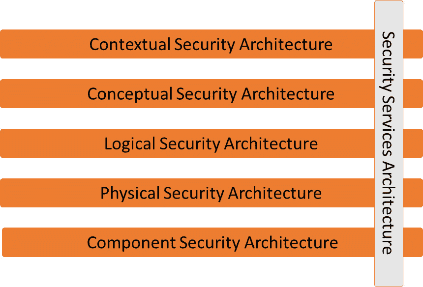
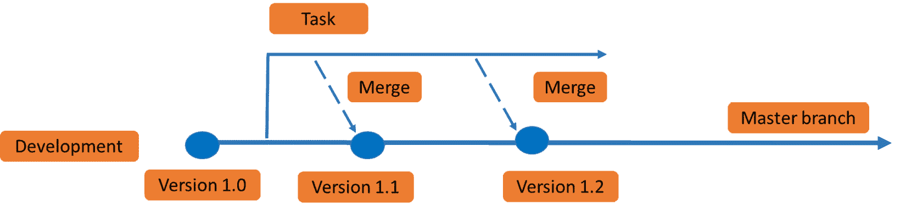
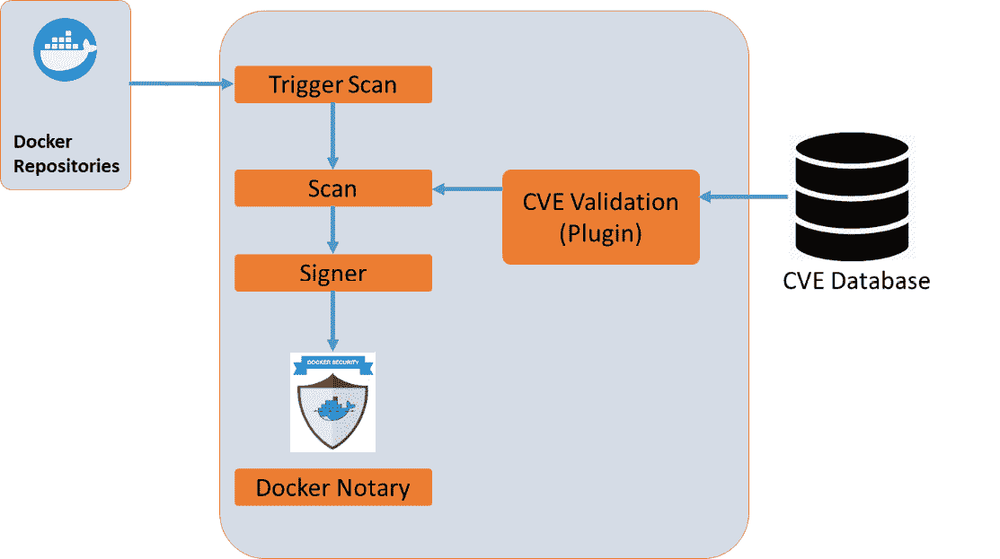

# 第十一章：理解 DevOps 中的安全性

如果不谈论安全性，你无法谈论云、现代应用程序，甚至数字化转型。一个流行的术语是*安全设计*。但即使是安全设计，也需要嵌入企业架构中。它同样适用于 DevOps 周期：DevOps 需要有*安全设计*。在我们讨论这个问题以及零信任等原则之前，我们首先需要深入理解安全性及其对 DevOps 实践的影响。本章将介绍 DevOps 中的安全性。

完成本章后，你将了解到为何在企业架构中包含安全性非常重要，以及架构师如何收集和评估风险，并能够识别 DevOps 中的具体风险。你还将学习设置安全控制措施，以及需要在 DevSecOps 中解决的主要问题。

在本章中，我们将涵盖以下主要内容：

+   将安全性嵌入企业架构中

+   理解 DevOps 中的安全风险

+   提升 DevSecOps 的安全意识

+   定义需求和指标

# 将安全性嵌入企业架构中

这是你几乎每天都能看到的话题：受到某种黑客攻击或袭击的企业。系统中的任何一个小漏洞都会被犯罪分子发现并加以利用。目前（2021 年），最*流行*的攻击类型如下：

+   勒索软件

+   网络钓鱼

+   拒绝服务攻击

前两种攻击，勒索软件和网络钓鱼，实际上是利用了企业防御层的漏洞。最后一种攻击基本上是通过大规模的流量攻击系统，直到系统崩溃。这三种攻击都相对容易执行。事实上，你可以购买软件，甚至购买可以针对特定地址发起攻击的服务。而且不，你不需要去暗网。它们就在开放的*普通*互联网中。

企业如何保护自己免受这些攻击？首先，必须认识到，任何企业的 IT 系统已经变得越来越复杂，正如我们在前几章所看到的那样。IT 系统不再仅仅存在于一个私有的数据中心，它已经变成了一个使用公共云、私有数据中心或托管服务中的私有堆栈、**平台即服务**（**PaaS**）和**软件即服务**（**SaaS**）的生态系统。安全性必须在企业使用的每项服务中内嵌。

企业安全的四个传统原则如下：

+   预防

+   检测

+   修正

+   方向

前三个是关于检测安全问题，并通过缓解措施加以纠正，但显然，如果问题能够预防，效果会更好——因此，预防是第一优先。方向性是关于指导方针和警戒线：企业制定政策和安全标准以确保所有系统的安全。这就是第五个原则——一致性——的作用所在。在一个拥有多个部门、集群和团队的企业中，你需要确保安全措施在企业的每个角落都得到实施。不能有任何一个部门或团队不遵守企业的安全要求。换句话说：链条的强度由最弱的环节决定。

那么，我们从哪里开始进行企业安全呢？企业架构框架可以帮助你入门。一个例子是**Sherwood 应用商业安全架构**（**SABSA**），它提供了一种定义安全架构的方法论。它由六个层次组成，如下图所示：



图 11.1 – SABSA 安全架构模型

**信息系统审计与控制协会**（**ISACA**）将 SABSA 与更为人知的**信息与相关技术控制目标**（**COBIT**）五个原则结合起来。这五个原则如下：

+   满足企业利益相关者的需求

+   覆盖整个企业端到端

+   应用统一的集成框架

+   实现整体方法

+   将治理与管理分开

SABSA 与 COBIT 的结合形成了一种自上而下的方式，用于定义整个企业的架构。企业架构师必须至少与首席安全架构师合作执行以下步骤：

1.  确定业务目标：这是企业架构的第一阶段。企业架构总是从商业战略、目标和宗旨开始。

1.  确定业务风险。

1.  确定管理风险所需的控制措施。

1.  设计并实施这些控制措施，例如：

    - 安全治理流程

    - 访问控制

    - 事件管理流程

    - 证书管理流程

1.  设计物理架构，包括使用的平台、网络、操作系统和数据存储等。物理架构还应包括云平台和服务，如 PaaS 和 SaaS，以及 DevOps 实践，如 CI/CD。

1.  验证业务和物理架构是否符合企业必须遵守的合规性和安全标准与协议。

1.  定义并实施操作架构，例如：

    - 配置管理

    - 监控

    - 日志记录

    - 变更管理

    注意

    上述提供的列表并不意味着穷尽。在*进一步阅读*部分，我们包含了一个关于企业安全架构的 ISACA 期刊的链接。在该期刊中，你将找到更多关于使用 SABSA 和 COBIT 描述的步骤的详细信息。

在定义安全架构中一个重要的主题是理解风险。哪些系统面临风险，对企业及其业务的影响是什么？DevOps 带来了自己的风险。我们将在下一节讨论这个问题。

# 理解 DevOps 中的安全风险

互联网上有一个经典的卡通。它展示了一个拳击比赛场地。发言人在拳台左角宣布了一套庞大的安全工具和规则。然后，在右角，他宣布了戴夫：一个穿着写着*人为错误*的衬衫、看起来呆萌的家伙。这则卡通传达的信息是：你可以拥有世界上所有的安全系统，但这并不能阻止人为错误。而开发仍然主要是人类的工作。人类会犯错。这是否是 DevOps 中最大的风险，或者还有其他需要关注的特定风险？我们将在本节讨论这个问题。

对于是否 DevOps 意味着特定风险的问题，答案是肯定的。在不关注安全性的情况下实施 DevOps 将明显增加攻击的风险，仅仅是通过增加系统的攻击面。有三个主要的主题需要解决：

+   **访问管理**：DevOps 团队可能使用开发者或工具手动访问的代码仓库。即使在开源模式下操作，代码也需要保护，并且共享代码以便更多开发者能够贡献代码。即使如此，公司也希望规范对代码的访问，以防止泄露，甚至更糟糕的是注入恶意代码。

    你需要一个基于角色的访问模型来管理代码仓库：谁有读取权限和写入权限，以及谁有完全访问权限——出于什么原因？

    跟踪账户。例如，GitHub 公司可以拥有只有分配给该公司的员工或工具才能访问的内部仓库。在该内部仓库中，管理员委派角色。凭据根据公司的安全政策设置。保持访问控制的推荐方法是实施**特权访问管理**（**PAM**）。

    由于 DevOps，团队将不得不创建更多特权账户，这些账户会在开发者和工具之间手动或自动共享。这些账户还涉及服务账户、加密密钥、SSH 密钥和 API 证书，所有这些都保存在仓库中。对这些仓库的未经授权访问是灾难性的。

    PAM 解决方案提供了一种授权和审计 DevOps 周期中任何活动的方式。大多数这些解决方案使用密钥保管库来保护访问细节，并在用户能够实际访问仓库之前对其进行身份验证和授权。

+   **缺乏 DevOps 工作方式和工具的护栏与指导方针**：访问代码是一回事，接下来我们该如何处理这些代码？企业通常不会允许 DevOps 团队直接提交并将新代码推送到生产环境。首先，企业或首席架构师——在大多数大公司中会有一群主导架构师——需要仔细思考选择的工具集。

    每个 DevOps 团队都应使用统一的工具集，而不是根据个人喜好选择自己的工具，尽管这可能很诱人。问题在于，DevOps 工具集没有统一的安全策略标准，例如访问控制。这是企业自身需要建立和实施的内容，如果选择统一的工具集会更容易做到这一点。

    同样适用于工作方式：整个企业的工作方式必须保持一致，我们无法过度强调这一点。所有这些必须在首选技术列表和 DevOps 护栏及原则中定义。通常，会有一个主分支。新代码会首先推送到一个独立的分支——通常称为特性分支——并在该分支上进行测试。经过验证的正面测试结果后，代码会合并到主分支。主代码或主分支随后会存储在代码仓库中。这个原则在下图中展示：



图 11.2 – 合并新代码的原则

护栏定义了何时从代码仓库中提取代码，如何将其提交到特性分支，如何进行测试，最终如何发布并合并到主分支。

+   **专注于开发过程和速度，而忽视安全**：DevOps 主要是为了提升开发速度。绝不能以此为借口忽视安全。在接下来的章节中，我们将通过一个实际案例来说明这一点。

总结来说，DevOps 安全包括三个主题：

+   **可追溯性**：跟踪 DevOps 循环和管道中的每一个操作。

+   **可审计性**：确保在 DevOps 中开发的系统符合企业的安全标准以及企业所遵循的行业框架。*第十三章*，*使用行业安全框架与 DevSecOps 协作*，对此进行了更详细的讨论。

+   **可见性**：建立可靠的监控系统。

现在我们已经很好地理解了 DevOps 中的安全风险。在下一节中，我们将讨论如何开始实施 DevSecOps。

# 成为 DevSecOps 专家

安全从对代码仓库的访问开始，代码仓库是 DevOps 循环开始的源头。正如我们到目前为止所学的，我们希望尽可能地自动化开发、测试和部署。接下来，通过采用 DevOps，企业希望加快新应用和功能的开发与部署。速度和敏捷性可能会导致安全风险，因为代码未经过充分测试，或者更糟糕的是，它在没有应用适当的安全策略的情况下被推送到生产环境，以节省时间。让我们通过一个实际例子来说明这一点。

开发人员从仓库中分叉代码并开始在该代码上工作。在某个阶段，代码需要推送到指定的基础设施上以运行。在开发阶段，代码运行正常，因为它尚未与生产系统进行交互。一旦代码准备好发布到生产环境，它将需要建立这些连接。通常，在企业中，需要打开特定的路由和防火墙端口，以便实现连接和流量传输。

防火墙规则，特别是开放端口和分配防火墙规则，通常不会自动执行；安全工程师需要评估请求，然后批准实施设置。在很多情况下，这实际上会减缓整个 DevOps 和敏捷流程。但几乎在每个企业中，做法都是：安全是最终部署前的最后一道关卡，而不是嵌入到 DevOps 循环中。然而，绕过这一环节是一个糟糕的主意。这将增加代码和系统的攻击面。

最终结论：安全必须嵌入到 DevOps 中——它使得开发和部署成为开发人员、运维人员和安全工程师的共同责任。安全不仅是安全团队的责任，而是整个 DevOps 团队的责任。

## DevSecOps 的起点

安全扫描从代码从仓库中拉取的那一刻就开始。第一步是对仓库应用**基于角色的访问控制**（**RBAC**）模型。RBAC 定义了谁可以访问以及访问的级别。身份是否只允许查看代码，还是授予完全访问权限，能够拉取代码、修改代码和向仓库添加代码？请注意，这不一定是指一个人。DevOps 工具也是*身份*，你需要考虑这些工具所需的访问权限。

在整个 DevOps 循环中，代码会不断地被审查、扫描和测试漏洞。一个非常简单的例子是，如果某个应用禁止访问互联网，而代码中指向了端口 `80`，它可能会被标记为风险。如果应用依赖于一个通过互联网连接的服务，可能会被允许，但这需要根据安全策略进行验证。扫描、测试和验证需要尽早在开发过程中进行。此外，这里也适用“左移”原则。

在 DevOps 中嵌入安全性最大的好处是，我们还可以实现自动化检查，甚至在发现或确认漏洞时立即应用补丁和修复。例如，如果代码库的新版本包含针对**常见漏洞和暴露**（**CVEs**）的补丁，这可以被注入到安全基线中，并与安全测试程序集成。代码会自动根据这个新基线进行检查。软件可以执行测试，验证代码是否符合要求，如果代码未通过，则标记出问题或触发自动修复程序来安装补丁。这不仅适用于应用程序代码，还适用于所使用的基础设施、操作系统和中间件。

## 使用容器的 DevSecOps

另一个例子：越来越多的企业使用容器进行代码分发。就像虚拟机一样，容器也需要符合安全政策。企业很可能会使用强化的容器，为以下内容设置策略：

+   **强化的主机操作系统**：通常，这些是 Linux 操作系统，通过防止被感染的容器侵入来保护主机。例如，应用于 Linux 主机的安全包，如 SELinux 和 seccomp；这些 Linux 发行版允许对内核设置实施**强制访问控制**（**MAC**）。企业可以选择开发自己的**Linux 安全模块**（**LSMs**）。

+   **容器运行时安全策略**：为挂载容器、特权容器、禁用容器中的 SSH、端口绑定设置以及暴露端口等设置特定权限。

下图展示了基于 CVE 的容器安全扫描原理：



图 11.3 – Docker 安全扫描概念

扫描是使用来自 CVE 数据库的数据进行的。这些数据可以来自例如**国家标准与技术研究院**（**NIST**）、MITRE 或像微软这样的供应商，后者也为其产品和服务发布 CVE 通知。扫描完成后，Docker *签名* 从仓库中拉取的镜像。为此，Docker 使用 Docker Notary，它验证镜像并防止开发人员使用未签名的镜像。

现在，我们已经拥有了强化、验证过的容器，并设置了特定的权限。接下来最重要的是控制这些设置；一旦为容器设置了权限，就不应有任何方式更改这些权限。容器不应能够获得新权限，否则就不是强化过的容器了。在 Docker 中，有一种简单的方法来检查和设置这个。使用以下命令，你可以列出所有容器的安全设置：

```
docker ps --quiet --all | xargs docker inspect --format 'SecurityOpt={{ .HostConfig.SecurityOpt }}' SecurityOpt=[label=disable]
```

它将返回有关容器强化、为容器创建独立分区以及 Docker 文件和目录审计配置的消息。

接下来，设置不授予新特权选项：

```
docker run <run-options> --security-opt=no-new-privileges <image> <cmd>
```

显然，这些设置需要不断评估。DevSecOps 与 DevOps 一样，是一个可重复的、持续的过程，旨在实现持续改进。这意味着在企业采用 DevSecOps 时，目标、需求、 newly identified risks（新识别的风险）以及减轻这些风险的控制措施需要进行评估和处理。我们将在本章的最后一部分讨论这一点。

# 定义需求和指标

在本章的第一部分，我们讨论了架构师必须采取的步骤来定义企业安全。在本部分，我们将解释如何收集、验证需求和指标，并将其转化为控制措施和关键绩效指标（KPIs）。

## 业务目标

我们在*第一章*中讨论过这个内容，*定义企业 DevOps 的参考架构*，但显然，了解一个企业想要实现的目标是很重要的。它们所在的市场是什么？它们如何在这些市场中服务客户？产品组合是什么？如果一个企业运营的是金融产品或医疗保健领域，差别是非常巨大的。它们的市场决定了风险水平。银行或投资公司面临的风险可能主要是财务风险，而医疗保健行业的最大风险可能涉及到患者的生命。目标也会不同：投资公司可能有支持尽可能多的企业获得资金的目标，而医疗保健公司则有通过具体解决方案治愈患者的目标。因此，企业及其目标将决定企业属性。

## 业务属性

属性可以是系统的可用性、数据的准确性和客户的隐私。除了业务类型和目标外，法规将规定这些属性的级别。金融机构必须遵守如 **萨班斯-奥克斯利法案**（**SOx**）和医疗保健提供商必须遵守的 **健康保险流通与问责法案**（**HIPAA**）等国内和国际金融法规。请注意，这些法规会接受审计。我们将在*第十三章*中讨论这个问题，*使用行业安全框架与 DevSecOps 协作*。

## 风险

基于业务目标和属性，我们可以定义风险。如果某些事件发生，什么将对企业构成重大威胁？如果考虑到可用性，可能会遇到这种情况：企业在关键系统停止运行时没有执行故障转移的手段。企业如何从重大故障中恢复？没有冗余系统可能是一个风险，正如应用程序中的漏洞可能被犯罪分子利用一样。MITRE ATT&CK 框架可以帮助识别风险；这一内容将在*第十三章*中讨论，*使用行业安全框架与 DevSecOps 协作*。

## 控制措施

下一步是定义风险控制。以下是一些示例：

+   制定一个适应灾难恢复的业务连续性计划。

+   实施**公钥基础设施**（**PKI**），并配备身份存储和保管库，以确保用户隐私。

+   实施应用防火墙，并设置具体的防火墙规则以保护关键系统。

+   设置控制措施来管理、更新和升级前述内容：维护业务连续性计划、管理安全策略，并定期评估防火墙设置。

验证这些控制措施是否与属性和应用的安全框架关联，以便进行审计。对于每个控制措施，必须有一个可以在审计中验证的理由。

好消息是，企业不必独自思考这些控制措施。**互联网安全中心**（**CIS**）为许多 IT 领域定义了控制措施：CIS 控制框架。基本的 CIS 控制措施包括对特权访问的受控使用、所有 IT 系统资产（包括容器）的安全配置，以及对网络端口、协议和服务的控制。对于 Azure、AWS、GCP，以及像 Kubernetes 这样的容器平台，CIS 已经定义了具体的控制措施。

CIS、MITRE 和其他框架以及它们如何影响 DevOps 将在后续章节中进一步讨论，但首先，我们将了解 DevSecOps 架构应包括哪些内容。这个话题将在下一章讨论。

# 总结

本章介绍了如何将安全集成到 DevOps 中，讨论了 DevSecOps 的概念。我们探讨了安全性在企业架构中的重要性，以及它如何推动企业 DevOps 中的安全性。我们了解了采用 DevOps 中涉及的主要安全风险，并深入研究了作为 DevOps 实践中最常用技术之一的容器安全性。通过这些内容，我们为采纳 DevSecOps 确定了一些关键的起点。

在最后一部分中，我们学习了如何从业务目标和业务属性中收集和评估风险，介绍了 CIS 等常用的安全控制框架。通过一些示例，我们探索了架构师需要采取的各个步骤，以便拥有一个也能应用于 DevOps 的安全标准。

在下一章中，我们将更详细地探讨 DevSecOps 的架构，然后开始将安全策略和行业框架与 DevOps 工作方式进行集成。

# 问题

1.  列出企业安全的四个传统原则。

1.  Docker 使用什么来验证签名的容器？

1.  判断正误：安全性不应该妨碍 DevOps 中的速度和敏捷性。

# 进一步阅读

+   关于使用 SABSA 和 COBIT 的企业安全架构的 ISACA 期刊：[`www.isaca.org/resources/isaca-journal/issues/2017/volume-4/enterprise-security-architecturea-top-down-approach`](https://www.isaca.org/resources/isaca-journal/issues/2017/volume-4/enterprise-security-architecturea-top-down-approach)

+   CIS 官网：[cissecurity.org](http://cissecurity.org)
