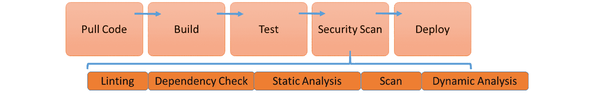
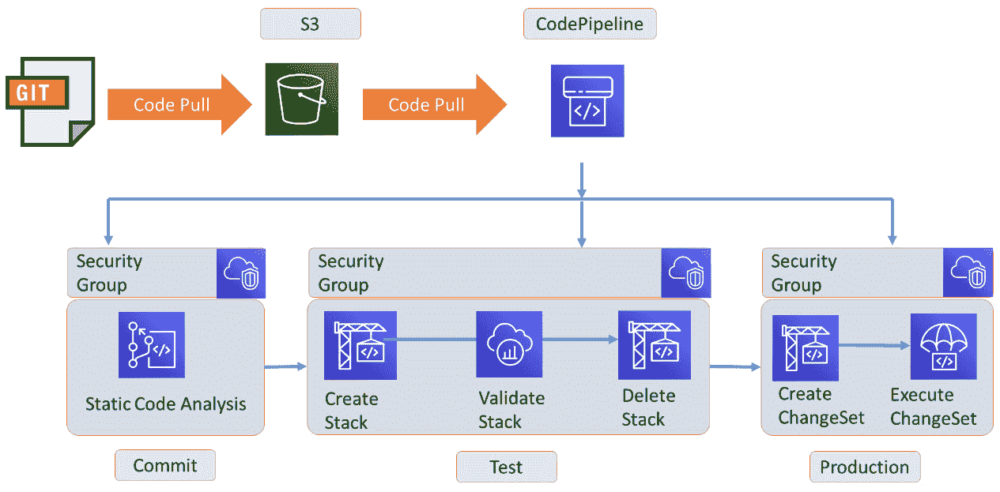
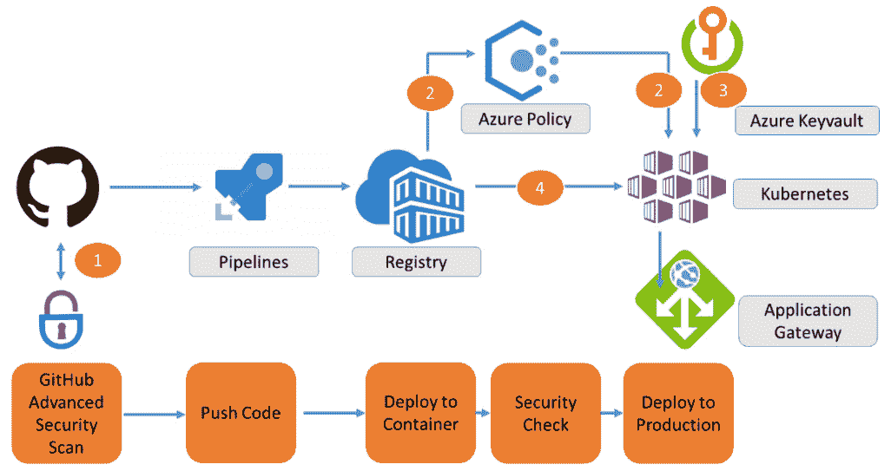
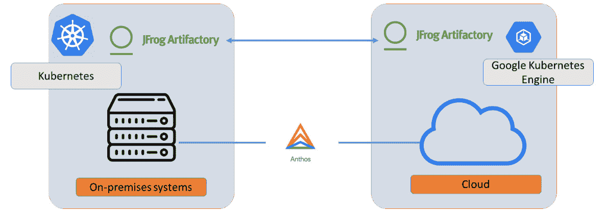
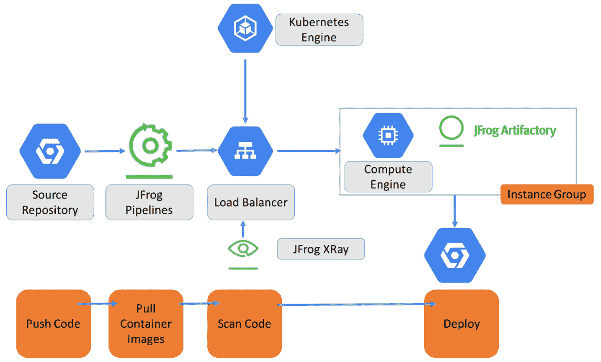

# *第十二章*：为 DevSecOps 架构设计

和企业 IT 领域的所有内容一样，DevSecOps 需要一个架构基础。在本章中，您将学习如何为 DevSecOps 实践构建参考架构，并设计 DevSecOps 管道。我们还将讨论主要公共云服务提供商的最佳 DevSecOps 实践；即 AWS、Azure 和 GCP。为此，我们将详细阐述市场上一些领先的工具。在最后一节中，您将了解企业应采取哪些步骤来实施 DevSecOps。

完成本章后，您将能够列出 DevSecOps 架构中的不同组件，以及如何将这些组件纳入 DevSecOps 管道。您还将学习如何保护容器以及在各种公共云中最佳的做法。最重要的是，您将能够解释为什么在 DevOps 中融入安全对企业至关重要。

在本章中，我们将涵盖以下主要主题：

+   理解 DevSecOps 生态系统

+   创建参考架构

+   构建 DevSecOps 管道

+   将 DevSecOps 应用于 AWS、Azure 和 GCP

+   部署规划

# 理解 DevSecOps 生态系统

在上一章中，我们讨论了安全原则以及这些原则如何影响 DevOps 的工作方式。我们得出结论，安全必须贯穿开发和部署周期的每一步，从代码从代码库拉取的那一刻起，到实际的代码提交和推送到生产环境。在本章中，我们将看看**DevSecOps**的基础，即**嵌入安全的 DevOps**。

DevSecOps 由三层组成：

+   **文化**：这不是一个技术层面，但经常被忽视的是，DevOps 远不止应用工具和创建 CI/CD 管道。显然，DevSecOps 也是如此。在 DevSecOps 中，每个团队成员都对安全负责并采取相应行动，拥有安全的责任。这并不意味着安全专家变得过时。最好在团队中有一名安全工程师或专业人士，通常称为安全冠军。此人必须主导所有应用安全标准和政策的流程，确保合规性。

+   **设计即安全**：安全被嵌入到系统的每一层。这通常意味着企业有一个明确的架构，涵盖每个安全方面并将安全策略强制应用于系统：身份验证、授权、保密性、数据完整性、隐私、问责制和可用性，包括在系统受到攻击时的修复和纠正措施。软件开发人员在设计和构建新应用或功能时不需要每次都考虑安全——安全姿态一旦开发开始就会应用。安全架构、框架、规则和标准都是集中管理的。

+   **自动化**：在 DevSecOps 中，我们希望尽可能实现自动化，其中包括安全性。自动化安全的理由是我们可以防止人为错误，并且有自动化的门槛，在那里代码会被扫描以发现可能的漏洞或不合规的组件，比如未授权的代码。安全负责人也负责自动化安全，但他们与团队一起进行。自动化还意味着在发生攻击或数据泄露时会进行自动化审计并收集证据。接下来，自动化流程确保收集安全指标并反馈到 DevSecOps 实践中。例如，如果在扫描时发现代码中的漏洞或许可证被违反，证据将被收集并发送反馈。

DevSecOps 管理这些层次时依赖以下组件：

+   利用仓库

+   应用程序（代码）安全

+   云平台安全

+   漏洞评估和测试

DevSecOps 不应与 **安全即服务** (**SECaaS**) 混淆。SECaaS 可以是 DevSecOps 实践中的一个组成部分，但 SECaaS 的概念主要是将安全责任转交给服务提供商。这是一种外包模型，允许企业通过订阅模式从服务提供商处获得网络安全服务。实施 SECaaS 有充分的理由，其中之一是服务提供商负责所有安全更新，基于最新的见解。企业可以定义服务水平协议，以确保及时响应事件并应用安全实践。如前所述，SECaaS 可以集成到 DevSecOps 中，但它也意味着企业必须依赖第三方来实施和管理安全基准。

在接下来的部分中，我们将讨论 DevSecOps 组件并定义参考架构。

# 创建参考架构

在我们讨论 DevSecOps 的参考架构之前，我们需要了解 DevOps 的角色及其如何融入安全性。DevOps 涉及软件开发生命周期。我们必须注意的一点是，开发人员越来越多地使用开源组件。这是合理的，因为它在开发新代码时提供了极大的灵活性。

开源是由社区推动的，因此开发者可以互相贡献代码并加快开发进程。项目可以共享在公开的 Git 和 GitHub 仓库中，也可以在企业内部共享。InnerSource 类型的项目就是一个很好的例子。InnerSource 在组织的边界内使用开源最佳实践进行软件开发。通常，InnerSource 项目会利用 GitHub 等平台中受保护的、访问受限的仓库。

然而，开源软件存在一些需要从安全角度解决的风险。由于开源具有其开放的社区特性——即开源的优势——这增加了将漏洞引入代码库的风险。第二个风险是许可证合规性。在开源中，许可证通常不为人们所关注，但请注意，即使是开源软件和工具也需要许可证。

让我们首先看看流程。软件开发生命周期是一个重复的过程。开发人员从仓库中拉取源代码并触发构建。代码编写完成后，代码被打包并启用以部署到下一个阶段，即测试、验收，最终是生产阶段。整个过程通过 CI/CD 流水线进行促进和监控。正如我们在前几章中总结的那样，测试代码是整个过程中的关键。我们还扫描代码以确保安全性和合规性。这应该在过程中的每一个步骤中进行。

事实上，我们从 DevOps 流程开始就需要关注安全。实际上，这意味着从代码从仓库拉取的那一刻起，我们就开始扫描安全问题。仓库也是软件开发生命周期的一部分，因此这些仓库必须防止未经授权的访问。这就需要在仓库上实施 **基于角色的访问控制**（**RBAC**）和 **身份与访问管理**（**IAM**）。

考虑到这一点，我们可以使用以下组件创建 DevSecOps 的参考架构：

+   使用 RBAC 进行仓库访问

+   **静态应用程序安全测试（SAST）**：这将检测源代码中的错误

+   **软件组成分析（SCA）**：这将检测代码中的依赖关系

+   **动态应用程序安全测试（DAST）**：这将动态扫描代码

这些组件被嵌入到 DevSecOps 流水线中，我们将在下一节中讨论。

# 组成 DevSecOps 流水线

让我们首先看一下一个常见的 DevOps 流水线。基本的流水线如以下图所示：


图 12.1 – DevOps 流水线

流水线的基本步骤如下：

+   从仓库拉取代码

+   构建

+   测试

+   部署

在 DevSecOps 中，我们将安全嵌入到流水线中，使安全标准和政策成为其集成的一部分。安全是应用于流水线每个步骤的一个层次，但它确实包括几个步骤。如下图所示：



图 12.2 – DevSecOps 流水线

这些步骤如下：

1.  `pipenv` 用于 Python 代码，`npm` 用于 Node.js。用于检查的命令分别是 `pipenv check` 和 `npm audit`。

    提示

    查看 `pipenv` 网站，了解更多脚本和教程：[`pipenv.pypa.io/en/latest/`](https://pipenv.pypa.io/en/latest/)。也可以查看 [`docs.npmjs.com/cli/v6/commands/npm-audit`](https://docs.npmjs.com/cli/v6/commands/npm-audit) 了解 npm 代码检查。

1.  **静态分析**：这会检查不良的编码实践，比如配置错误。几乎每种编程语言都有开源工具。以下是一些工具示例：

    - C# 的 ArchUnitNet 和 Puma Scan

    - Go 的 Go vet

    - Java 的 Checkstyle 和 **开放 Web 应用程序安全项目**（**OWASP**）依赖检查

    - JavaScript 的 Flow

    - PHP 的 Parse

    - Python 的 Bandit

    提示

    这份清单并不详尽。在 [`github.com/analysis-tools-dev/static-analysis`](https://github.com/analysis-tools-dev/static-analysis) 上，您将找到当前使用最广泛的工具列表。

1.  **扫描**：开发人员很可能会使用容器，进而使用容器镜像来构建和打包他们的应用程序。这些镜像需要扫描以查找已使用的二进制文件和库中的漏洞。扫描是通过已知漏洞的基础列表来进行的；这些列表由如**美国国家标准与技术研究院**（**NIST**）等机构提供，也有软件供应商以**常见漏洞和曝光**（**CVE**）通知的形式提供。一旦报告了新的 CVE，列表会被更新，扫描工具会自动更新并触发重新扫描。Clair（[`github.com/quay/clair`](https://github.com/quay/clair)）是一个开源工具，它会执行这些扫描，也适用于 Docker 镜像。扫描过程包括**代码检查**，我们将在下一节关于容器加固时详细解释。

1.  **动态分析**：对于 Web 应用程序，开发人员可以运行自动化 Web 应用程序扫描，以检查错误的头部或缺失的令牌，用于**跨站请求伪造**（**CSRF** 或 **XSRF**）。这些令牌可以防止来自受信任用户的未经授权的命令被利用——这也可以是来自其他网站的功能。这些自动化的动态扫描可以集成到流水线中。OWASP Zed Attack Proxy 是一个免费的 Web 安全工具（[`owasp.org/www-project-zap/`](https://owasp.org/www-project-zap/)）。

现在，我们已经拥有一个嵌入安全的 CI/CD 流水线，它将自动涵盖大多数常见的代码漏洞。不过，这一节中我们没有涉及到的一个特定项是容器的使用，以及我们如何保护这些容器。我们将在下一节中研究如何构建安全的容器。

## 在流水线中使用安全容器

大多数开发人员会使用容器来打包和部署他们的代码，通常是 Docker 容器。在使用和保护容器时，有一些最佳实践。为了保持容器的一致性和安全性，它们应该定期扫描，即使应用程序已经达到了稳定状态，更新变得不那么频繁，或者主动开发已停止。如果应用程序仍然在使用其底层容器托管不同的应用组件，这些容器必须进行扫描，因为总是有可能某个依赖项会产生新的漏洞。

由容器组成的应用程序由 Dockerfiles 定义。**Linting**——分析代码中使用的错误或不良语法——可以用于对 Dockerfiles 进行 **静态代码分析** (**SCA**)，并确保这些文件保持安全。一个常用的代码检查工具是 **Haskell Dockerfile Linter** (**Hadolint**)，它作为 Docker 镜像提供，可以通过以下命令轻松执行：

```
docker run --rm -i hadolint/hadolint
```

Hadolint 会扫描代码，如果一切正常，它将返回退出代码 `0`。当发现错误或不良实践时，它会呈现 **Hadolint 错误** (**DL**) 或 **SellCheck 错误** (**SC**) 键。

提示

常见错误的概述已汇总在 [`github.com/hadolint/hadolint#rules`](https://github.com/hadolint/hadolint#rules)。

除了代码检查，Docker 还推荐了一些保持容器安全的最佳实践。Docker 已经处理了命名空间和网络栈，以提供隔离，从而确保容器无法获得对其他容器的特权访问，除非在配置中明确指定。接下来，有一些重要事项需要考虑：

+   Docker 使用 Docker 守护进程。这个守护进程需要根权限，这意味着存在安全风险。首先，只有受信任的用户应被允许设置守护进程的控制权限。接下来，你需要采取行动，通过设置对 Docker 主机和客户容器的访问权限，尤其是当容器可以通过 Web 服务器的 API 来配置时，来限制守护进程的攻击面。

+   强烈建议使用 Docker 内容信任签名验证。这是一个从 `dockerd` 二进制文件开始提供的功能，允许你设置 Docker 引擎仅运行已签名的镜像。对于签名本身，你可以使用 Notary。

+   使用加强版模板来用于 Linux 托管系统，如 AppArmor 和 SELinux。

如果我们遵循 Docker 的所有建议，我们将拥有经过测试的、不可变的镜像，可以用于在 Kubernetes 上部署容器。例如，Kubernetes 将使用可信的镜像仓库，并负责容器的供应、扩展和负载均衡。Kubernetes 的一项安全功能是支持滚动更新：如果镜像仓库更新了补丁或增强功能，Kubernetes 将部署新版本并销毁旧版本。通过这一功能，开发人员可以始终确保只有最新的、经过强化的镜像版本被使用。

## 应用机密管理

数据库凭证、API 密钥、证书和访问令牌必须始终存储在安全的地方。使用 CI/CD 和容器并不会改变这一点。强烈建议使用一个位于管道访问的 CI/CD 仓库之外的保管库。机密管理的最佳实践如下：

+   静态和传输加密。建议使用 AES-256 加密密钥。

+   机密，如密钥，绝不能存储在 Git/GitHub 仓库中。

+   建议通过将机密作为环境变量注入应用程序中的安全字符串。

Hashicorp（Terraform）提供了 Vault 作为一个开源解决方案，用于安全地访问机密。该服务使我们能够轻松旋转、管理和检索数据库凭证、API 密钥以及其他机密，并贯穿其生命周期。

CyberArk 提供了一个更强大的解决方案。CyberArk Conjur 是一个平台无关的机密管理解决方案，专门设计用于保护容器和微服务。该解决方案是平台无关的，意味着它可以部署到任何云环境或本地系统。

这两个工具与本地环境中的密钥管理集成，例如，Azure 和 AWS，分别使用 Azure Key Vault 和 AWS Secrets Manager。

# 将 DevSecOps 应用于 AWS、Azure 和 GCP

在前面的部分中，我们讨论了 DevSecOps 原则以及如何构建嵌入安全性的管道。在本节中，我们将探讨如何将 DevSecOps 应用于主要公共云平台的最佳实践，即 AWS、Azure 和**Google Cloud Platform**（**GCP**）。

## 在 AWS CodePipeline 中使用 DevSecOps

在我们开始探索 AWS 中的 DevSecOps 之前，需要理解 AWS 中的部署应该基于**云采用框架**（**CAF**）的原则。该框架涵盖了特定的安全任务和责任，分为我们在*第十一章*《理解 DevOps 中的安全性》讨论的四个类别或原则，即企业安全性：

+   防范

+   检测

+   更正

+   方向

    注意

    AWS 使用不同的术语来表示这些原则，以进行更正和方向。在 CAF 中，这些原则随后被称为侦测和响应。

AWS 提供了本地解决方案来管理 CI/CD 管道中的安全态势：Amazon CloudWatch Alarms、AWS CloudTrail、Amazon CloudWatch Events、AWS Lambda 和 AWS Config。下图展示了使用这些解决方案的 DevSecOps CI/CD 管道：



图 12.3 – 在 AWS 中使用 CodePipeline 和安全组

AWS CodePipeline 用于协调管道中的不同步骤。一个重要的产物是安全组：这些是定义管道中所有开发和部署组件的安全态势的 *容器*。它包含必须应用于这些组件的模板、保护措施和策略。我们可以在管道中定义三个阶段：

1.  **来源或提交**：对从 S3 桶中拉取的代码进行静态代码分析。如果发生安全组违规，构建过程将被停止。

1.  **测试**：在此阶段，使用 CloudFormation 创建一个包含 AWS 中 **虚拟私有云**（**VPC**）的堆栈来运行测试。接下来，使用 AWS Lambda 在堆栈中运行代码并验证构建。AWS 称此为堆栈验证：Lambda 函数将根据安全组验证堆栈。如果检测到违规，Lambda 函数会删除堆栈并发送错误消息。这是为了防止堆栈和代码进入下一个阶段。

1.  **生产**：在成功的堆栈验证后，触发 Lambda 函数使用 CloudFormation 模板准备生产环境。这个 *变更集*——将测试堆栈转化为生产环境堆栈并使用生产模板——随后会执行。

    提示

    AWS 提供了 CloudFormation 模板和管道的示例，访问地址：[`github.com/awslabs/automating-governance-sample/tree/master/DevSecOps-Blog-Code`](https://github.com/awslabs/automating-governance-sample/tree/master/DevSecOps-Blog-Code)。

检查安全组中的项目示例包括验证用户访问权限、S3 桶的访问控制、以及使用 EC2 计算资源创建实例的策略等。CloudWatch 和 CloudTrail 用于监控组件、访问级别及其使用情况，并收集在管道各个步骤执行过程中触发的事件日志。

## 使用 GitHub 和 Azure 服务与 DevSecOps 一起工作

Microsoft Azure 使用不同的 DevSecOps 方法：它利用 GitHub 的扫描功能和 **Azure Kubernetes 服务**（**AKS**）的特性，除了 Azure Pipelines，它集成于 Azure DevOps 和 Azure Security Center 中，用于存储安全态势。下图展示了使用 GitHub 和 Azure 服务的嵌入式安全 CI/CD 管道的高级架构：



图 12.4 – 使用 GitHub 和 Azure 服务的 DevSecOps

上述图中的数字表示步骤的执行顺序。容器一旦推送到 **Azure 容器注册表**（**ACR**），就会根据存储在 Azure 策略中的政策进行扫描。接下来，适当的安全密钥将被获取，以验证容器是否能通过 **Azure Kubernetes Service**（**AKS**）进行认证。只有在所有检查通过后，代码才会被推送到应用网关。

让我们更详细地看一下这个过程：

1.  **来源**：该解决方案从 GitHub 中的代码分析开始，包括使用 CodeQL 和 Dependabot 来检测源代码和依赖项中的漏洞。

1.  **测试**：一旦代码经过验证，它就被打包成 Docker 容器，并通过 Azure Dev Spaces 部署到测试环境中。这一协调工作是通过 Azure Pipelines 完成的。Azure Dev Spaces 将使用 AKS 构建一个隔离的测试环境。这类似于 AWS 中 CloudFormation 构建堆栈的方式。

1.  **扫描**：容器存储在 ACR 中，在这里它们会根据安全状态进行扫描。为此，Azure 使用 Azure Security Center，它是一个庞大的库，存储了所有已注册环境的安全策略。

1.  **生产**：扫描后的容器通过 AKS 推送到 Kubernetes 集群。Azure 策略用于验证已配置集群和容器的合规性。

与 AWS 一样，Azure 使用多种不同的解决方案来提供一个端到端的解决方案，这些解决方案将安全规则、策略和状态嵌入整个 CI/CD 流程中。然而，所有这些解决方案都从一个存储并管理这些安全防护和指南的仓库开始：通过 AWS Security Hub 管理的安全组，或者在 Azure 中是 Azure Security Center。

## 在 Google Cloud 中使用 Anthos 和 JFrog 与 DevSecOps 合作

GCP 提供了一个有趣的最佳实践解决方案，用于通过 Anthos 和 JFrog 实现 DevSecOps 流水线。通过这个方案，它不仅提供了一个云原生流水线，还为混合环境提供了解决方案，能够同时使用 GCP 和本地系统进行开发和部署。

这对企业来说很有意思，因为很多企业不会将其 IT 系统完全迁移到公有云。预计大多数企业将会把越来越多的系统迁移到云端，但一些系统仍会保留在私有堆栈中。针对云端和本地解决方案的 CI/CD 流水线是比较受欢迎的，使用 Kubernetes 时，它们相对容易搭建。

架构如以下图所示：



图 12.5 – 使用 JFrog Artifactory 和 Google Anthos 的高层架构

GCP 提倡使用 JFrog Artifactory 和 JFrog Xray：

+   **JFrog Artifactory** 负责存储在构建应用程序时使用的构件。在本章中，我们看到一个管道通过从源代码库中拉取代码开始。开发人员需要依赖能够全面且安全地存储和排序构件——即代码构建块——的工具，以便将软件交付到管道中并实现自动化。

+   **JFrog XRay** 通过 Artifactory 扫描构件——即代码构建块——以检测已知漏洞和许可证合规性。XRay 倡导通过提前扫描源构件来实现“向左移动”的思维模式。

解决方案如以下图所示：



图 12.6 – 使用 JFrog XRay 的 Google Cloud 中的 DevSecOps

在这个解决方案中，**JFrog XRay** 是嵌入在管道中的安全解决方案。构建随后使用 GCP 中的 Kubernetes 和 Anthos 推送到生产环境。然而，Anthos 确保在本地云和 **Google Kubernetes Engine**（**GKE**）以及本地环境中，部署和管理 Kubernetes 集群的一致性层。这个解决方案不仅在 GCP 上可行，还可以在本地的 VMWare 堆栈以及 AWS 上使用。

## 部署规划

到目前为止，我们已经讨论了 DevSecOps 管道的参考架构以及 AWS、Azure 和 GCP 的最佳实践。如果我们有了架构，下一步就是规划在企业中部署 DevSecOps 和管道。这是最后一节的主题。

企业需要遵循三个主要步骤来实施 DevSecOps：

1.  **评估企业安全性**：企业可能已经采纳了安全策略并采取了措施来保护其系统。他们还需要遵守安全标准和框架，因为政府或行业的法规要求。安全专家将进行风险评估并分析可能的威胁。这些专家理解并管理安全控制。这是将安全性融合到 DevOps 实践中的默认起点。强烈建议 DevOps 团队在没有包括开发和部署新代码的安全策略和标准的情况下，不应开始任何项目，即使是试点项目或概念验证。安全性必须从第一天开始就是优先事项。

1.  **将安全性嵌入 DevOps**：安全政策和标准被集成到开发过程中。DevOps 工作流程与安全指南和防护措施相匹配。这包括漏洞测试和代码扫描，我们在本章中已做了广泛讨论。如果没有相应的流程和工具，DevOps 团队无法开始开发新代码。增加系统攻击面、最终给企业带来巨大损失的风险太大。无论大小企业，都在黑客和安全威胁的持续威胁之下。这就引出了第三步。

1.  **培训，培训，再培训**：DevOps 和 DevSecOps 不仅仅是技术问题——它是一种工作方式，甚至是一种思维方式。或许更准确地说，它是一种文化，员工需要经过培训来适应这种文化。这种培训不是一次性的。员工、开发人员和运维人员需要不断和一致地接受培训。开发人员、运维人员和安全工程师需要全身心地致力于在工作中应用安全控制，这意味着他们始终需要意识到企业面临的安全漏洞和黑客攻击的风险。

当然，适当的工具至关重要。建议企业至少包括以下工具：

+   **测试**：这是 DevSecOps 中至关重要的环节。市场上提供了大量用于执行测试的工具。例如 Chef Inspec、Haikiri 和 Infer。

+   **警报**：当检测到安全威胁时，需要发出警报并进行通知。Elastalert 是一个警报工具的例子。

+   **自动化修复**：像 StackStorm 这样的工具可以在安全问题被检测到时，立即提供修复措施。

+   **可视化**：开发人员和运维人员需要能够看到系统中发生了什么。Grafana 和 Kibana 是帮助可视化和共享安全信息的流行工具。

这份清单绝不打算是详尽无遗的。所提到的工具是与 DevOps 工具以及 AWS、Azure 和 Google Cloud 的原生工具兼容的第三方工具。当然，公有云平台本身也提供了广泛的安全工具。例如，Azure 中的 Sentinel 和 Azure Security Center，AWS 中的 Security Hub，GCP 中的 Security Command Center。

阅读完本章后，DevSecOps 的好处应该已经很清晰，但我们将通过总结来概括这一点：通过 DevSecOps，企业能够实现开发人员、运维人员和安全工程师之间的更好协作，从而确保在开发初期就能发现安全威胁和漏洞，最大限度地降低企业风险。

我们将在*第十四章*《将 DevSecOps 与 DevOps 集成》中详细阐述在 DevOps 中实现安全性，我们也会讨论 DevSecOps 的治理。但首先，我们将在下一章学习如何在 DevOps 中使用和集成行业安全标准。

# 总结

在本章中，我们学习了 DevSecOps 的不同组成部分。我们了解到，DevSecOps 不仅仅是工具和自动化的问题，它更是关于文化：DevOps 团队必须与企业中的安全专家协作，共同致力于将安全指南融入开发和部署新代码的过程。工具无疑可以帮助在 DevOps 中实现最大程度的安全性。本章的一个重要部分是关于架构 DevSecOps 实践。

然后，我们讨论了主要公共云提供商中 DevSecOps 的最佳实践；即 AWS、Azure 和 Google Cloud。这些实践通常包括使用 Docker 容器和 Kubernetes 作为容器编排平台。我们还学习了如何扫描代码并在将容器部署到生产平台之前确保其安全。重要的活动包括静态代码分析和动态扫描。

在本章的最后部分，我们讨论了企业必须采取的实施 DevSecOps 实践的步骤，并提供了一些关于所需工具的建议。

企业通常必须遵守政府和行业的安全标准和框架。下一章将专门讲解在 DevSecOps 中如何使用这些标准。

# 问题

1.  **软件组成分析**（**SCA**）的功能是什么？

1.  用于保持容器安全的技术是什么？

1.  AWS 中用于创建堆栈的本地工具是什么？

1.  AWS、Azure 和 GCP 等公共云服务提供商提供了各自的 Kubernetes 服务来运行容器。请列举它们的相关服务。

# 进一步阅读

+   使用 AWS CodePipeline 实现 DevSecOps 的博客：[`aws.amazon.com/blogs/devops/implementing-devsecops-using-aws-codepipeline/#:~:text=%20Implementing%20DevSecOps%20Using%20AWS%20CodePipeline%20%201,%206%20Create%20change%20set%3A.%20%20More%20`](https://aws.amazon.com/blogs/devops/implementing-devsecops-using-aws-codepipeline/#:~:text=%20Implementing%20DevSecOps%20Using%20AWS%20CodePipeline%20%201,%206%20Create%20change%20set%3A.%20%20More%20)

+   在 Azure 中应用 DevSecOps 实践的文档：[`azure.microsoft.com/en-us/solutions/devsecops/`](https://azure.microsoft.com/en-us/solutions/devsecops/)

+   使用 GCP、Anthos 和 JFrog 实现 DevSecOps CI/CD 的文档：[`cloud.google.com/architecture/partners/a-hybrid-cloud-native-devsecops-pipeline-with-jfrog-artifactory-and-gke-on-prem#best_practices`](https://cloud.google.com/architecture/partners/a-hybrid-cloud-native-devsecops-pipeline-with-jfrog-artifactory-and-gke-on-prem#best_practices)

+   Docker 中的安全性文档：[`docs.docker.com/engine/security/trust/`](https://docs.docker.com/engine/security/trust/)
