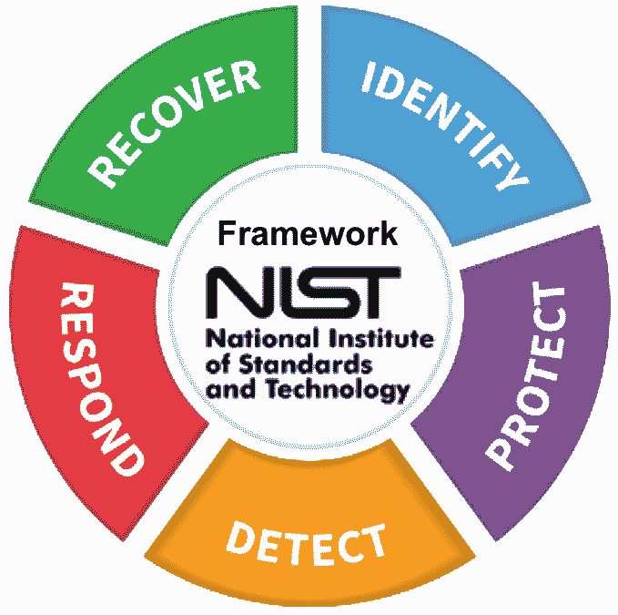

# 第十三章：使用行业安全框架与 DevSecOps 合作

安全性和 DevSecOps 中一个重要的工具是安全框架。存在通用框架，例如**互联网安全中心**（**CIS**），但通常行业必须根据特定的行业安全标准遵守并报告合规性。这些框架影响了企业内部安全处理的方式，因此也影响了 DevSecOps 的实施。

本章将解释框架的功能和影响，以及如何将它们融入到 DevSecOps 中。本章包括关于 MITRE ATT&CK 框架使用和价值的单独段落，因为它正变得越来越知名并被广泛接受，成为基础框架。

完成本章后，您将对最常用的安全框架有一个清晰的了解，并知道如何将这些框架的控制措施应用于 DevOps。

在本章中，我们将覆盖以下主要内容：

+   理解行业安全框架

+   使用 MITRE ATT&CK 框架

+   将框架应用于 DevSecOps

+   创建合规报告并指导审计

# 理解行业安全框架

随着时间的推移，IT 变得越来越复杂，IT 安全也是如此，两者之间存在关联。企业 IT 环境不再是位于公司地下室的数据中心的单一系统。如今，IT 环境由不同的组件组成，并通过互联网连接与外部世界互联。因此，系统*默认*是可以通过互联网访问的。然而，只有授权用户才能访问这些系统。因此，我们需要一些强有力的防御措施来保护系统免受安全漏洞的侵害。

所需的安全级别因行业而异。首先，金融机构需要确保银行账户无法被入侵，且资金不会被非法转移。医疗机构需要保护患者的个人和健康数据。制造商希望保护其知识产权和专利。最重要的是，安全方面有几个总体原则，即保护数据、身份，以及加强系统防范外部攻击。要跟踪这些几乎是不可能的，这时安全框架就派上了用场：它们为企业实施正确的安全政策提供了指导。

在学习安全框架如何影响 CI/CD 和 DevOps 之前，我们需要理解这些框架的概念。简而言之，框架是一套实施和管理这些政策的政策和文档化指南。政策本身专注于识别风险、减轻风险以及在发现漏洞时减少系统和程序的攻击面。这是一种通用方法，但行业框架会根据行业的具体需求对这种方法进行调整。

通用的 IT 安全框架包括 ISO IEC 27001/ISO 2700212、**美国国家标准与技术研究院**（**NIST**）的网络安全框架、**互联网安全中心**（**CIS**）和**信息与相关技术控制目标**（**COBIT**）。让我们先详细了解这些框架：

+   **ISO IEC 27001/ISO 2700212/27017**：ISO 27001 制定了国际系统安全控制标准，重点关注能检测出会严重影响系统可用性和完整性的威胁的控制。ISO 27002 则设立了额外的标准，用以管理这些控制措施，如用户访问管理和资产清单维护。ISO 27017 专门针对云计算，涉及在**平台即服务**（**PaaS**）和**软件即服务**（**SaaS**）环境中的共享责任，确保云服务的部署与移除，并监控云服务等。

+   **NIST**：NIST 网络安全框架并未指定具体的控制措施，但它提供了五个功能来增强安全性：识别、保护、检测、响应和恢复。这些功能允许组织设定控制措施以管理数据泄露风险。控制措施包括访问控制、保护数据的措施，以及员工的安全意识。响应要求控制措施描述组织应如何应对威胁和攻击，包括缓解和沟通指南。恢复是最后的手段：组织需要有明确的战略来恢复攻击后的系统和数据。NIST 的五个领域如下图所示：

图 13.1 – NIST 网络安全框架

+   **CIS**：CIS 提供了针对平台、操作系统、数据库和容器的广泛框架，并提供具体的控制措施。一些 CIS 框架嵌入在平台中，如 CIS for Azure 和 AWS。在这些场景中，可以通过 Azure 安全中心和 AWS 安全中心访问 CIS 基准。CIS 基准确保所使用的组件是*强化的*。与 NIST 相比，主要的区别在于，NIST 侧重于评估风险的指南，而 CIS 提供了大量的安全控制措施和最佳实践。

+   **COBIT**：COBIT 由**信息系统审计与控制协会**（**ISACA**）推出，ISACA 是一个国际 IT 安全与审计组织。最初，COBIT 是关于识别和缓解 IT 系统中的技术风险，但随着最近发布的框架——COBIT 5，它还涵盖了与 IT 相关的业务风险。COBIT 的实施和管理较为复杂，因为它涵盖了整个企业，包括所有 IT 管理流程，如事件管理、问题管理、配置管理和变更管理。

这些都是控制框架。所有这些框架可能有涵盖特定行业需求的*版本*，但通常情况下，行业需要遵守它们*自己的*标准，并且完全合规。这在行业进行审计时非常重要。在本章的最后一节，我们将更详细地讨论审计问题。

主要的行业框架——实际上，这些是监管认证——包括医疗保健领域的**健康保险流通与责任法案**（**HIPAA**），美国政府机构的**联邦风险与授权管理计划**（**FedRAMP**），欧盟的**通用数据保护条例**（**GDPR**），以及金融机构的**支付卡行业数据安全标准**（**PCI-DSS**）。

这些框架都在全球范围内或至少在区域内实施，但也可能有公司需要遵守的特定国家安全法规。例如，**纽约金融服务部**（**NYDFS**）的网络安全法规。该框架于 2017 年发布，对美国所有金融机构提出了安全要求。然而，这一框架中的规则与 NIST 一致，并应用了 ISO 27001 标准。然而，NYDFS 确实有一些规则，优先于这些通用框架。在 NYDFS 的规定下，数据加密和增强的多因素身份验证是所有入站连接的强制性安全控制措施。

还有一个框架我们还没有讨论，那就是 MITRE ATT&CK。MITRE ATT&CK 并不是一个真实的框架，比如我们在本节中讨论的那些框架。它是一个知识库，涵盖了系统可能遭受的攻击和突破的策略。然而，它可以作为定义风险策略和威胁模型的输入，来保护系统。在下一节中，我们将学习如何使用 MITRE ATT&CK。

# 使用 MITRE ATT&CK 框架

也许这不是一个完全公平的说法，但我们会在这里发布它：MITRE ATT&CK 在涉及安全时让您从攻击者的角度思考。该框架的强大之处在于任何人都可以为其做出贡献。它实际上并没有描述系统中的实际漏洞，而是描述攻击者可能利用这些漏洞的技术。MITRE ATT&CK 使用一个包含 14 个攻击策略的矩阵。接下来，它将这些策略分配给主要平台或技术，包括云和容器。在云中，有 Azure、AWS 和 GCP 的细分。

提示

完整的 MITRE ATT&CK 框架可以在 [`attack.mitre.org/`](https://attack.mitre.org/) 找到。但是，建议还关注 MITRE 的 Twitter 帐号 `@MITREattack`。该矩阵是开源的，因此活跃的社区正在为收集在框架中的策略和技术做出贡献。MITRE 鼓励人们加入社区并积极贡献他们的发现。

在本节中，我们将简要介绍 14 种策略，然后专门讨论容器中的策略，因为这些在**持续集成/持续部署**（**CI/CD**）中被广泛使用。

+   **侦察**：这些技术旨在收集尽可能多的信息以准备攻击。这包括扫描系统，还包括社会工程，即利用组织的员工获取信息。

+   **资源开发**：这些技术涉及创建、购买或窃取黑客可以用来执行攻击的资源。

+   **初始访问**：这是首次尝试访问系统。包括滥用有效（服务）账户和钓鱼。

+   **执行**：这项技术涉及运行恶意代码。

+   **持久性**：这种技术通过后门获取访问权限。它利用容器注入恶意代码，引导并登录初始化脚本。

+   **权限升级**：这种技术涉及利用漏洞在系统上提升权限，最终获取更多控制权。在使用容器时，这是一种常用的策略。容器应始终加固，以防止它们获取额外的权限。

+   **防御规避**：这包括使用代码绕过入侵检测、日志记录和其他预防措施的策略。在云环境中，此策略用于操纵云（编码）防火墙，例如通过未使用的不同区域中的环境或未受保护的沙盒环境进入。

+   **凭证访问**：通常涉及暴力破解以获取用户名和密码。

+   **发现**：此策略用于查找用户数据、设备、应用程序、数据和服务，以尽可能多地了解可用系统的信息。

+   **横向移动**：此战术用于将系统和数据从一个主机移动到另一个主机，有时是移动到一个不在企业控制下的环境中。常用的技术包括散列传递和远程管理员访问。

+   **收集**：此战术用于收集数据，例如键盘输入或屏幕截图等。在云环境中，收集 API 密钥以访问存储和密钥保管库是常见的技术。

+   **命令与控制**：使用此技术时，黑客尝试与系统通信，试图获得对系统的控制。

+   **数据外泄**：此战术涉及通过例如将数据发送到不同的存储环境并加密数据，来控制数据和数据流。

+   **影响**：这是一个广泛的类别，包括拒绝服务技术和资源劫持。

MITRE ATT&CK 并不是一个魔法棒：它并不能解决所有的安全问题。它应被视为另一种可以帮助你以更好的方式保护 IT 环境的资源，通过提供不同的见解。它展示了潜在的攻击模式和路径，安全工程师可以将其纳入安全策略中。MITRE ATT&CK 提供了来自特定平台和技术的见解，这使得它非常独特。常见的攻击战术在不同平台上可能有不同的路径和模式，而这正是 MITRE ATT&CK 成为一个良好护栏的地方。

注意

在 DevOps 中，扫描代码至关重要。静态和动态扫描必须是 CI/CD 中的默认操作。扫描通常是针对基线进行的。在 DevOps 中常用的基线之一是**OWASP**，即**开放网页应用程序安全项目**。OWASP 是开源的，每年列出应用程序中的十大漏洞。我们将在 *第十四章* *将 DevSecOps 与 DevOps 集成* 中更详细地讨论 OWASP。

在接下来的章节中，我们将向你展示如何使用矩阵来更好地保护容器。

## 使用 MITRE ATT&CK 战术保护容器

那么，MITRE ATT&CK 在实践中是如何工作的呢？我们以容器矩阵为例，因为容器在 CI/CD 流水线中被频繁使用。首先，我们必须访问 [`attack.mitre.org/matrices/enterprise/containers/`](https://attack.mitre.org/matrices/enterprise/containers/) 上的特定矩阵。你将会认识到我们在上一节中讨论的 14 个战术中的一些。并非所有战术都适用；对于容器，有八个战术被证明是相关的：

+   初始访问

+   执行

+   持久性

+   权限提升

+   防御规避

+   凭证访问

+   发现

+   影响

接下来，我们可以看一下这些战术中的一个。我们将以**执行**为例，如下图所示：

图 13.2 – MITRE ATT&CK 中容器的标签

执行中的前两项如下：

+   **容器管理命令**

+   **部署容器**

如果我们点击第一个，**容器管理命令**，矩阵将为我们提供有关如何在容器管理中利用特定漏洞的信息。漏洞本身可能出现在使用例如 Docker 守护进程或 Kubernetes API 管理容器时。这些可能允许在容器启动时使用远程访问和管理。MITRE 给出了两个已经使用的技术例子。第一个技术是 Hildegard，它使得可以使用 kubelet API 运行命令在运行中的容器上执行命令。MITRE 提到的第二个技术是 Kinsing，它利用 Ubuntu 入口点运行 shell 脚本来接管容器管理进程。

接下来，矩阵提供了缓解措施。在给定的例子中，缓解措施包括使用只读容器并限制通过 SSH 的远程访问来与容器服务、守护进程或 Kubernetes 进行通信。

你会发现 Kinsing 也出现在**部署容器**标签下，紧挨着 Doki 漏洞，后者是一种在 2020 年春季被发现的恶意软件，专门针对 Docker 容器。

矩阵将引导你了解各种漏洞并帮助你减轻它们。

在这方面，我们已经讨论了各种框架的内容。在接下来的章节中，我们将学习如何在 DevSecOps 中使用这些框架，以及如何创建合规性报告来展示框架的应用。

# 将框架应用于 DevSecOps

在本节中，我们将学习如何将框架的控制措施融入到 DevOps 中，并将它们嵌入为 DevSecOps。好消息是：这并不像听起来那么困难。下图展示了这个过程：

图 13.3 – 从安全框架到 DevOps 的控制应用过程

通常，我们首先评估企业需要应用到其 IT 环境中的框架。从这个评估中，衍生出不同的控制措施，并将其设置为应用和基础设施的开发和部署周期。一旦代码从仓库拉取，扫描就会针对这些控制措施开始。

我们在这里以 CIS 基准为例，因为 CIS 是最常用的安全控制框架。应用控制始于认识到，在 DevOps 中，IT 环境默认是高度动态的。一切，包括基础设施，都转化为代码，因此应用程序将运行在容器中或无服务器模式下。这需要一些特定的控制措施。

必须应用一些通用控制措施。这些包括以下内容：

+   **漏洞管理**：这必须作为一个控制措施在代码推送到生产环境之前实现，但考虑到左移原则，漏洞扫描应该从代码从仓库拉取的那一刻就开始。

+   **访问控制**：通过此控制，你可以限制和管理所有资源的权限，包括容器。

+   **日志记录**：这包括在构建和测试代码时的日志。有时，在生产环境中只收集日志，但如果你想掌控 DevOps 循环，这样是不足够的。

这些是通用的。CIS 开发了一个专门用于保护容器的框架，如下图所示：

图 13.4 – CIS Docker 基准测试

这个基准测试，CIS 称之为基准，包含以下控制项：

+   Linux 主机配置；例如，确保容器使用独立分区，并确保只有可信用户可以控制 Docker 守护进程。

+   Docker 守护进程配置；例如，如果可能的话，作为非 root 用户运行守护进程，并确保容器在获取新权限时受到限制。

+   容器镜像和构建文件配置；例如，确保容器只使用可信的基础镜像。

+   容器运行时配置；例如，限制容器中的 Linux 内核功能，并确保容器中不会映射特权端口。

CIS 还有一些通用的建议，比如确保容器经过加固，并确保 Docker 版本是最新的。

提示

所有 CIS 基准测试都可以在 [`www.cisecurity.org/`](https://www.cisecurity.org/) 上免费下载。

这个基准不仅告诉你*应该*实施哪些控制项，还提供了*如何*实施这些控制项的建议，以及*为什么*这些控制项必须存在的理由。看一下 CIS 推荐为容器设置独立分区的例子——这是 CIS v1.3.1 (2021) 中的控制项 1.1.1。

这从*配置文件适用性*开始。在控制项 1.1.1 中，这个设置为 Level 1-Linux 主机。这意味着这些设置仅适用于 Linux 主机，在不妨碍组件预期功能的情况下，提供明确的安全性好处——在这个例子中，是 Linux 主机。

接下来，描述了控制项本身及其背后的理由。在这个例子中，它描述了 Docker 如何使用 `/var/lib/docker` 作为默认路径来存储所有组件。该目录与 Linux 主机共享，这意味着它可能会很容易被完全填满，导致 Docker 和主机都无法使用。因此，推荐使用独立分区。最后，CIS 提供了一个*手动*指南，说明如何通过为 `/var/lib/docker` 挂载点创建独立分区来实现这一点。

是否必须按照这些建议执行？不一定。CIS 明确区分了关键控制和重要控制。显然，关键控制在所有情况下都应当执行，但你需要评估每个控制措施，无论它是否对你的 DevOps 实践有意义。这里的黄金法则是，如果你实施了某个控制，你需要持续遵守它，并进行合规报告。企业将根据他们已实施的规则和政策接受审计。在本章的最后一节中，我们将讨论报告和审计。

# 创建合规性报告并指导审计

DevOps 在企业中正在迅速发展，将安全嵌入 DevOps 是一个合乎逻辑的下一步。但是，企业如何确保其 DevOps 和 DevSecOps 符合我们在本章讨论的框架呢？这个问题的答案是：通过审计。IT 系统会定期审计，DevOps 实践也应如此。尽管如此，审计 DevOps 仍然是*未知领域*，尽管像 KPMG 和德勤这样的主要会计公司已就此发布了白皮书。

DevOps 审计应至少涵盖以下主题：

+   **评估 DevSecOps 策略**：策略是否清晰？治理是如何安排的？可以根据业务单元或全公司范围制定 DevOps 策略。两者都可以，只要策略始终如一地贯彻执行。目标应当清晰，并且被每个团队采纳。同样，所有团队的工作方式也应一致。测试流程和验收标准等流程必须透明并且严格遵守，没有例外。

+   **评估 DevSecOps 培训水平**：培训不仅仅是做一个幻灯片，展示**规模化敏捷框架**（**SAFe**）并说明 DevOps 循环。DevOps 强调的是文化，但有时组织会因突然改变工作方式而感到不知所措。例如，实施 DevOps 还意味着创建具备正确技能的团队。这需要组织安排，并且远不止于在组织中推出**Spotify 模型**。员工不会仅仅通过告诉他们必须这样做就自动在公会和小组中组织起来。企业需要对员工进行 DevOps 培训，并确保团队拥有所需的技能。培训还包括组织管理。

    注意

    Spotify 模型在组织中已成为一种非常流行的扩展敏捷工作方式的方案，而 DevOps 就是其中的一部分。Spotify 模型以音频流媒体服务实施的敏捷工作方式命名，提倡团队自主性，团队被组织成小组。每个小组可以选择自己的工具集和敏捷框架，如 Scrum 或 Kanban。

+   **审查 DevSecOps 工具链**：是否有架构来指定 DevOps 工具，并且它是否连贯？它是否服务于战略，并且与企业的 IT 战略一致？例如，如果企业有开源战略，那么工具必须遵循这一战略。最后，就像任何在企业中使用的工具一样，它需要受到架构变更控制。

+   **审查 DevSecOps 流程**：DevOps 并不意味着流程不再有效。企业仍然需要有基本的 IT 流程，如事件管理、问题管理和变更管理。这些流程必须有文档记录，包括它们的升级流程。同时，必须清晰地描述这些流程中的角色，并在实施 DevSecOps 时遵循这些描述。安全管理在这里占据特殊位置，因为它必须描述安全政策是如何定义的，如何在企业中实施和管理的，以及如何在 DevOps 流程中嵌入安全措施。

这样，我们已经学习了 DevOps 中安全的基本原则以及行业安全框架。现在，我们需要将安全整合，或者更确切地说，融入到我们的 DevOps 实践中。这就是 *第十四章*的主题，*将 DevSecOps 与 DevOps 整合*。

# 总结

在本章中，我们讨论了各种安全框架。这些框架是为企业的 IT 环境设置安全控制的指南。这些控制适用于系统和应用程序，也适用于 DevOps 实践。从开发人员从代码库拉取代码并开始构建，到部署和生产，IT 环境，包括 CI/CD 管道，都需要遵循安全控制。框架种类繁多，其中一些被企业广泛接受，如 NIST、CIS 和 COBIT。

我们还讨论了 MITRE ATT&CK 框架，它通过与其他安全控制框架进行对比，采用了不同的角度。MITRE ATT&CK 列出了黑客可能使用或曾经使用过的战术和技术，来利用漏洞。就像 CIS 一样，MITRE ATT&CK 列出了适用于不同平台和技术的具体内容，包括 CI/CD 中常用的容器。

在最后一节中，我们讨论了 DevSecOps 的审计。建议复审诸如工具的持续使用、流程和 DevOps 团队的技能等话题。

在下一章中，我们将把安全实践融入 DevOps，并学习企业如何采纳真正的 DevSecOps 战略。

# 问题

1.  哪项 ISO 标准专门针对云？

1.  MITRE ATT&CK 在执行战术下提到的两种容器技术是什么？

1.  判断对错：CIS 没有提到 Docker 的版本控制作为一种控制措施。

# 进一步阅读

+   KPMG，2020 年 1 月：[`advisory.kpmg.us/articles/2020/role-of-internal-audit-devops.html`](https://advisory.kpmg.us/articles/2020/role-of-internal-audit-devops.html)

+   发现 Spotify 模型，这是 Mark Cruth 在 Atlassian 上的一篇博客文章：[`www.atlassian.com/agile/agile-at-scale/spotify#:~:text=It%20is%20now%20known%20as%20the%20Spotify%20model.,by%20focusing%20on%20autonomy%2C%20communication%2C%20accountability%2C%20and%20quality`](https://www.atlassian.com/agile/agile-at-scale/spotify#:~:text=It%20is%20now%20known%20as%20the%20Spotify%20model.,by%20focusing%20on%20autonomy%2C%20communication%2C%20accountability%2C%20and%20quality)

+   CIS 网站：[`www.cisecurity.org/`](https://www.cisecurity.org/)

+   ISACA 网站，您可以在这里找到 COBIT 5 框架：[`www.isaca.org/`](https://www.isaca.org/)

+   NIST 网站：[`www.nist.gov/`](https://www.nist.gov/)

+   ISO 网站：[`www.iso.org/standards.html`](https://www.iso.org/standards.html)
