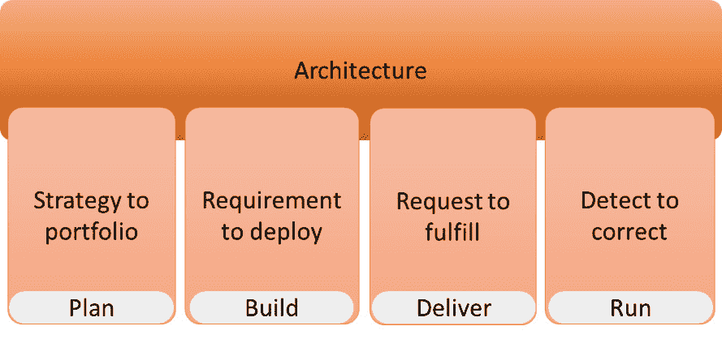
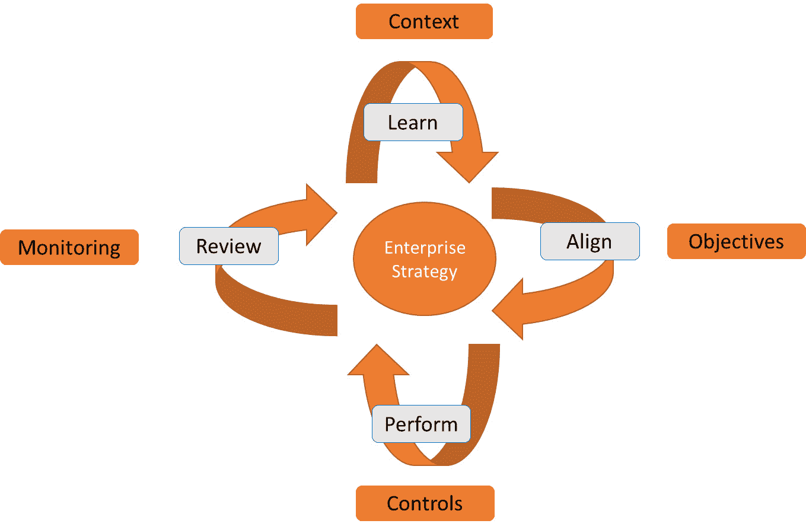
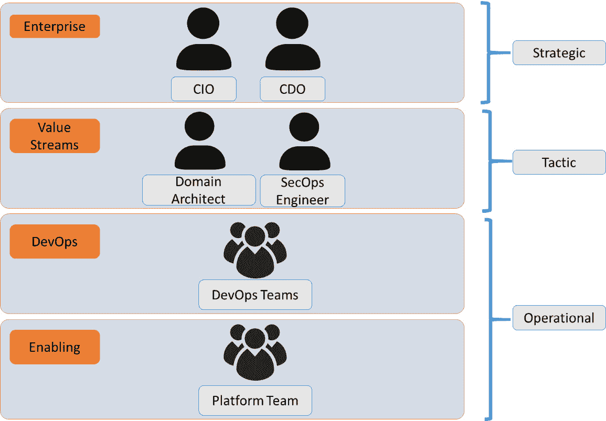
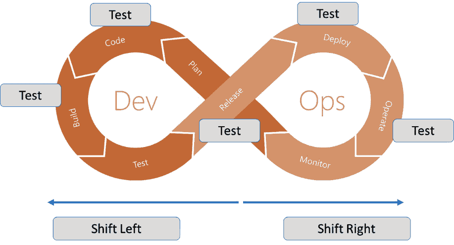

# *第十四章*：将 DevSecOps 与 DevOps 集成

本章标题可能听起来有点奇怪，但 DevSecOps 和 DevOps 并不是分开的东西。它应该是一种工作方式：安全性应与 DevOps 实践集成，而不是将安全原则加到 DevOps 之上。这意味着架构师必须定义一个总体的治理模型，将威胁建模集成到 DevOps 中，并实现一个集成的工具集。最后，集成监控需要覆盖 DevSecOps 周期的每个方面。我们将学习到，集成监控接近我们在本书早些时候讨论的内容：AIOps。在本章中，我们将把一切整合在一起。

完成本章后，您将学会如何实现治理，理解威胁建模，并理解它在安全**软件开发生命周期**（**SDLC**）中的重要性。您还将学会如何将安全性嵌入到持续集成中，并如何监控这一过程，以及该领域的一些主要工具。

本章中，我们将涵盖以下主要主题：

+   定义 DevSecOps 中的治理

+   理解并使用威胁建模

+   集成工具和自动化

+   实现监控

# 定义 DevSecOps 中的治理

到目前为止，我们已经草拟了一个 DevSecOps 架构，确定了流程，并将其与企业的业务目标对齐。下一步是管理这一切，这就是治理的主题。DevSecOps 不仅仅是一个 PowerPoint 演示文稿和一个显示 CI/CD 管道的 Visio 图表。企业需要有技能的员工来使用它，并且需要一个治理模型来描述安全的数字化运营模式。在本节中，我们将通过使用 The Open Group 的 IT4IT 框架作为最佳实践来讨论这一点。

在*第六章*《架构中的定义操作》中，我们介绍了产品的价值流，并描述了 IT 如何创造价值。该模型可在下图中看到：

图 14.1 – IT4IT 价值流

在 IT4IT 中，**治理、风险和合规性**（**GRC**）是四个价值流的支持活动。这意味着 GRC 完全嵌入到每个价值流中。GRC 做什么呢？

简单来说，GRC 是通过应用已达成一致的行业商业政策来管理不确定性，从而实现目标。每个企业都需要遵守一定的政策。这些政策可以是国际贸易规定、国家法律，也可以是行业特定的标准。包括安全性和数据隐私规定。实施 GRC 并不是一次性的努力：企业需要定期调整。这就是 GRC 能力模型的作用。该模型如下图所示：

图 14.2 – 治理、风险和合规模型

该模型由四个元素组成：

+   **学习**：企业的目标必须清晰定义，但这些目标是在企业运营的背景下设定的。例如，医院的目标是让人们变得更健康；而其背景则更为广泛，包括与制药公司和健康保险公司等的关系。目标和背景共同定义了公司的战略。

+   **对齐**：评估企业的目标和可能威胁，分析这些威胁对企业战略的危害。这将导致需求和对策，以确保企业实现目标，抓住新机遇的同时减轻威胁。

+   **执行**：这是检测到不期望事件并采取行动的阶段。

+   **回顾**：企业需要不断回顾是否及时识别了威胁，是否进行了适当评级，并且缓解措施是否成功。这反馈到学习中，因为背景可能会发生变化，战略也需要进行调整。

实施和管理这些能力需要治理。企业必须为这些能力的控制分配人员，并在企业不同级别上确定这些能力的采纳程度。这包括将 GRC 能力集成到 DevSecOps 中。我们如何安排最佳实践治理模型？

我们需要查看企业中的不同级别，这正是 IT4IT 所做的。下图展示了该模型的高层原则：

图 14.3 – 企业中不同安全治理级别的模型

让我们更详细地看看这些级别：

+   **企业级**：在企业级别，关键角色是企业架构师，负责企业架构。在这个层级，企业架构师将与**首席信息官**（**CIO**）合作。在现代企业中，我们看到 CIO 的角色在变化，并且有其他角色逐渐加入。**首席数字官**（**CDO**）和首席数据官或首席隐私官在组织架构中越来越常见。CDO 是实施数字化转型战略的重要职位，包括采用 DevSecOps。需要注意的是，DevSecOps 本身从来不是战略目标：它是一种引导数字化转型的方法论。

+   **价值流**：企业级是战略层；价值流则是战术层。在这一层级，关键角色是领域架构师和 SecOps 工程师。他们需要监督在各个 DevOps 团队中实施的全局 DevOps 架构和安全措施。

+   **DevOps 团队**：DevOps 中的黄金法则是你构建它，你运行它，你破坏它，你修复它。这并不意味着 DevOps 中没有其他规则——或者更确切地说，是指导方针。企业寻求在 DevOps 中跨不同团队保持一致性。这些团队将独立运作，但仍需要遵循企业层面设定的集中化指导方针，并在价值流层面加以实施和管理。为什么这很重要？企业服务或产品可能由不同 DevOps 团队负责的构建模块组成。如果工作方式、指导方针和安全防护没有对齐，最终产品或服务很可能无法达到企业的质量标准。

+   `@robakershoek`)，他为 IT4IT 框架做出了广泛贡献。他的其中一本书列在*进一步阅读*部分。

本节内容是关于 DevSecOps 中治理和控制流程的。在下一节中，我们将讨论安全团队和专家如何识别可能影响代码开发和部署的事件。深入理解并掌握如何使用威胁建模是必需的。

# 理解和使用威胁建模

在上一节中，我们讨论了企业安全治理以及它如何作为 DevSecOps 的一部分进行集成。在本节中，我们将学习安全问题如何影响软件开发生命周期（SDLC）。当涉及到在 DevOps 中集成安全性时，你需要对威胁建模有充分的理解，威胁建模为我们提供了关于安全威胁如何影响软件代码开发和部署的信息。我们将通过解释**开放 Web 应用程序安全项目**（**OWASP**）的定义来开始了解什么是威胁建模。OWASP 是一个提供安全威胁、工具和技术见解的在线社区。

本质上，威胁模型展示了安全威胁如何影响应用程序的完整性。该模型汇集并分析安全数据，帮助做出如何保护应用程序的决策，从而通过评估需求、重新审视设计并实施改进的安全政策来提升代码和托管环境的安全性。

什么是威胁？任何负面影响应用程序并导致失败或不希望事件的东西，如数据泄露。威胁建模识别可能的漏洞，然后定义缓解措施。在识别阶段，它可以使用我们在上一章中讨论过的 MITRE ATT&CK 框架。威胁建模不仅仅是检测安全问题，甚至不只是防止或修复它们。

建模是一项结构化、计划性强且重复进行的活动，用于持续评估环境和可能的漏洞，并帮助实施结构化的方法来减轻这些漏洞。因此，威胁建模需要贯穿整个 SDL（软件开发生命周期），其中模型以及由模型触发的后续行动需要不断审查和完善。原因在于，在开发过程中，可能会增加新的功能，甚至是新的技术。这样就有可能引入新的漏洞——威胁——因此，模型需要不断修订。

威胁建模通常包括以下步骤：

1.  **范围分析**：我们的威胁模型和分析的范围是什么？可以考虑应用代码、编程语言（例如 C#、Python 或 Java）、API、虚拟机、平台（比如 AWS 或 Azure 等云平台）、数据库引擎（例如 SQL、Postgres 或 Cassandra）和数据库。

1.  **识别威胁代理**：在 MITRE ATT&CK 框架中，我们关注的是漏洞和这些漏洞被利用的技术。在威胁建模中，我们还需要识别可能对攻击感兴趣的人。OWASP 称这些人为威胁代理：这些代理既可以是内部的，也可以是外部的。做出这一明确区分的原因是为了识别环境是否对内部人员具有*容错性*，或者是否容易从外部突破。

1.  **评估缓解措施**：OWASP 称之为对策。已知的缓解措施——例如，能够注册补丁——必须包含在模型中。

1.  **评估漏洞**：如果你已经知道了范围、可能的攻击者，并识别了可能的对策，那么我们就可以开始分析漏洞。这些漏洞是否在范围内，可能被谁利用，以及可以采取哪些具体的缓解措施来防止或最小化影响？

1.  **优先考虑风险**：分析漏洞被利用的可能性以及实际损害的程度。这定义了威胁的优先级。

1.  **执行缓解措施**：根据优先级，必须采取缓解行动，以降低已识别的风险。

    提示

    OWASP 社区管理着自己的 GitHub 页面，专门用于威胁建模。这些页面可以在[`github.com/OWASP/www-community/blob/master/pages/Threat_Modeling.md`](https://github.com/OWASP/www-community/blob/master/pages/Threat_Modeling.md)找到。

还有更多定义威胁建模的模型，但从本质上讲，它们都归结为相同的原则：评估、识别威胁、评估威胁，并识别减少风险的行动。

我们已经在治理下管理安全，并且知道如何评估我们环境中的可能威胁。下一步是将这一过程自动化，并集成到 DevOps 工具中。如果我们完成了这一点，那么我们就可以说我们已经实现了 DevSecOps。

# 集成工具和自动化

在本书中，我们已经多次讨论了测试的重要性。DevOps 提倡在生命周期的每个阶段进行测试，从开发到部署。这也包括安全测试。但是我们如何实现这种持续集成呢？目标是在开发人员提交代码时运行测试，在拉取代码时运行测试，在构建过程中运行测试，并在实际部署时（包括预发布阶段）进行测试。

首先，我们来看一下**持续集成**（**CI**）。开发人员会频繁地提交代码；在某些情况下，每天的提交次数可能达到多个。这就是 CI 的目标，以及 DevOps 中的敏捷工作方式：开发人员不再处理庞大的程序；相反，他们应用小规模的代码构建，每次添加一个功能。通过这种方式，更容易跟踪代码的变化，重要的是，如果添加的功能导致失败，能够轻松回滚。

CI 的核心是将这些变化和新增内容整合到代码中。开发人员提交代码，修改代码，并将其发布到功能分支。然后，代码被推送到生产环境并返回到仓库，源代码在极短的时间内更新了这一小块新代码。由于这些只是小规模的代码迭代，整合代码并在生产环境中实施要比处理大型发布更容易。然而，前提是代码在整个过程中都必须经过测试。每个新的构建和每个修改都必须进行测试。

在 DevOps 管道中，我们以自动化方式运行这些测试。这需要集成工具来打包代码，运行脚本以启动适当的基础设施，应用安全策略，启动监控并执行测试。

总之，测试贯穿整个开发和部署周期。下图展示了我们所说的内容，同时应用了 Shift Left 的原则：

图 14.4 – 在安全测试中应用 Shift Left

这包括安全测试。毕竟，目标是将其与 DevOps 工具集成，并自动化 CI/CD 管道。我们在以下实例中运行安全测试：

+   **代码仓库**：提交和拉取源代码

+   **构建**：编写、修改和编译代码

+   **发布前或预发布**：在实际部署到生产环境和主分支之前进行类似生产环境的测试

在*第十二章*《为 DevSecOps 架构》中，我们讨论了可以应用于管道的各种扫描类型，如**静态应用安全测试**（**SAST**）和**动态应用安全测试**（**DAST**）。

所有这些测试都可以并且应该自动化。对于许多企业来说，这是一次真正的范式转变。许多安全工程师和经理会坚持手动测试，而不是自动化安全测试。问题在于，安全测试将成为 DevOps 的瓶颈：部署会被安全测试停止，或者至少会被安全测试减慢。这就是为什么我们要将安全测试集成并自动化到我们的管道中，并在整个 SDLC 的每个阶段进行。

接下来，通过自动化和完全集成的安全测试，我们确保开发人员能即时收到关于代码中漏洞的反馈，这将有效地改进代码。

## 集成静态应用程序安全测试

SAST 至关重要。我们在*第十二章*《*为 DevSecOps 设计架构*》中简要讨论了这一点，现在我们将深入探讨。

首先，我们需要理解 SAST 有两种类型：

+   扫描原始源代码的 SAST 工具。

+   扫描库中反编译源代码的 SAST 工具，如**动态链接库**(**DLL**)或**Java 归档**(**JAR**)。

SAST 工具逐行扫描代码，报告在代码中发现的潜在漏洞，以便开发人员确切知道需要查看的位置。大多数工具还会对漏洞进行评级，甚至提供修复问题的建议。需要注意的是，SAST 工具需要具备语言感知能力。它们扫描源代码，因此必须理解代码所使用的语言。如果使用了多种语言，则可能需要多个 SAST 工具。

SAST 工具集成到 CI/CD 管道中，以便在整个开发过程中进行扫描。大多数工具识别常见的安全问题，这些问题通常会被报告并列出，比如 OWASP 提到的问题。每年，OWASP 都会发布十大 web 应用程序安全风险。目前，前十名的风险包括代码注入、敏感数据暴露和监控不足等。

提示

OWASP 前十可以在[`owasp.org/www-project-top-ten/`](https://owasp.org/www-project-top-ten/)找到。

我们将在本章的最后部分回到监控内容。

## 集成动态应用程序安全测试

DAST 不扫描代码。简而言之，DAST 工具模拟攻击。在*第十三章*《*使用行业安全框架与 DevSecOps 协作*》中，我们讨论了 MITRE ATT&CK 框架，它列出了有助于利用漏洞的技术。DAST 工具通过注入恶意代码字符串或暴力破解来执行这些技术。通过这样做，DAST 试图识别应用程序功能中的漏洞，而不是源代码中的漏洞。

DAST 是复杂的，这意味着它成本较高。它通过应用程序运行事务，并且依赖与应用程序交互的组件。例如，可以考虑前端应用程序和后端数据库。DAST 工具需要良好配置才能有效运行。

在这一点上，DAST 与渗透测试非常相似。大多数安全官员和工程师会依赖手动渗透测试来检测不同应用堆栈和服务之间的漏洞，特别是当这些堆栈和服务由不同的平台和提供商使用时。在现代 IT 中，系统通常由**基础设施即服务**（**IaaS**）、**平台即服务**（**PaaS**）和**软件即服务**（**SaaS**）组成，托管在 AWS、Azure 或私有数据中心等各种平台上，集成和测试集成点变得越来越重要。

请注意，公共云平台对于渗透测试有严格的政策。例如，AWS 仅支持对少数几个服务进行渗透测试，如其计算平台 EC2。违反这些政策可能会导致处罚，最坏情况下甚至禁止使用服务。

## 使用 CircleCI orbs 进行集成

在 DevSecOps 集成的世界中，有一个相对较新的现象值得一提，那就是 orbs —— 可重用的 YAML 代码片段，用于处理可重复的操作，如安全扫描。Orbs 允许直接与流行的安全扫描工具进行集成。这是 CircleCI 提出的概念，CircleCI 是一家位于旧金山的公司，提供自动化 CI 工具。

它声称可以将这些工具直接集成到 CI/CD 管道中。例如，Probely（一个网页漏洞扫描器）和 SonarCloud（代码分析）的 orbs 可用，但开发人员也可以创建自己的 orbs 并将其推送到开源 Orb 注册表中。

现在我们已经涵盖了集成的安全框架和工具，我们必须确保跟踪结果。在最后一节中，我们将更详细地讨论监控。

# 实施监控

安全的关键要素之一是确保必要的安全策略已到位，并且环境得到了有效保护。听起来简单，但实际上需要正确配置监控。开发人员需要信息来帮助他们修复错误，同时也要改进代码，从而改进应用程序。这不仅适用于客户体验和性能，也适用于确保应用程序保持安全。黑客并非坐以待毙：他们不断寻找新的攻击系统的方法。因此，我们需要持续监控应用程序的运行情况。

安全监控不仅仅是检测意外行为，还包括分析所有行为。这为开发人员提供了洞察，帮助他们改进代码。为了做到这一点，监控需要提供三项主要服务：

+   收集

+   分析

+   警报

有时，存储和可视化也会被加入到这些服务中。然而，存储监控数据更侧重于日志记录，而可视化则侧重于全面呈现监控数据。这些是重要的服务，但它们并不是监控本身的核心服务。当然，你仍然需要方法来接收和查看警报。例如，Grafana 是一个流行的工具，它提供跨平台的仪表盘，允许我们查询和可视化存储的监控数据。

在我们开始实施监控之前，架构师需要评估以下四个 W 问题：

+   *我们*在监控什么？

+   *我们*为什么监控*这个*（而*不是*其他任何东西）？

+   *我们*何时监控*这个*？

+   *谁*在关注（谁需要被通知）？

*什么*是收集数据，*为什么*是触发分析，*谁*是指向企业中正确的人员或实体发送警报。正如我们之前提到的，正确的监控对于我们在 DevOps 中所进行的反馈循环至关重要，包括关于可能影响系统的安全事件的警报。一个常见的误解是，只有代码的系统并且托管在云平台上的系统默认就会被监控和保护。其实并非如此。像 AWS、Azure 和 Google Cloud 这样的平台仅仅提供了巨大的工具箱，供你用来保护在这些平台上运行的代码。工程师需要自己配置监控。这包括监控基础设施，如云中使用的**虚拟机**（**VMs**）的健康状态。虚拟机的使用量增加——虚拟机的 CPU 或内存出现无法解释的峰值——可能表明出现了问题。

接下来，为了对 DevOps 有用，监控必须从应用程序本身收集指标。通过这种方式，监控可以提供应用程序运行状态的信息。应用程序必须能够向监控系统提供这些信息。这些信息通常在应用程序的代码中标记。例子包括诸如**调试**和**警告**之类的标签。监控将收集这些信息，并确保以易于理解的格式将其传递给工程师。

监控工具是如何做到这一点的呢？有几种方式可以做到这一点，但在大多数情况下，工具使用的是收集系统数据的代理，或者通过模拟——无代理——交易来实现。通过交易，工具会向应用程序发送一个交易，并在交易返回时分析响应。

注意

基于事务的监控并不意味着这些工具不能或不会使用代理。有代理和无代理的系统。一些企业有政策规定，禁止在其系统上使用代理，因为代理会增加系统的负载，或者因为企业担心代理的侵入性。

在监控代理的情况下，这些代理可以并且应该成为应用程序部署到平台时期望的状态配置的一部分。记住“左移”原则：这应当集成到整个 DevOps 链条中，以便监控从代码推送到开发、测试和预发布系统的那一刻就开始。换句话说，监控不仅仅是为了生产环境。

由于监控工具必须具备的能力，这些工具可能会变得非常庞大和复杂。代理可能会导致所谓的系统开销，即代理会增加系统资源的使用或触发更多的网络流量。这些方面应该在架构设计时加以考虑。同样，先从四个 W 问题开始。

最后，企业可能不会只使用一个监控工具，而是会形成一条工具链。他们可能使用 AWS CloudWatch 或 Azure Monitor 来监控云资源，使用 Prometheus 来收集如容器平台等高动态系统中的实时数据，使用 Sysdig 来监控云原生应用程序。具体到安全监控，企业可以使用 Splunk Security Essentials 或云原生的 Azure Sentinel。需要注意的是，许多安全工具侧重于网络和身份访问管理，而不太关注应用程序或应用代码。这就是为什么企业最终会拥有监控工具链的原因：这是有充分理由的。架构师在选择满足企业需求的工具方面有很大发言权。

注意

我们这里只提到几款工具，这绝不意味着要详尽列出所有工具，或推广特定工具。这里提到的工具在企业中广泛使用，但还有许多其他优秀的工具可供选择。

工程师们可能不希望使用多个控制台来查看这些不同工具的输出。像 ServiceNow 和 BMC Helix 这样的企业级套件提供了经纪平台，能够实现统一的“玻璃面板”视图：各种监控工具和数据收集过程可以在这个统一的套件中聚合。这些是复杂的系统，需要高技能的专业人员来实施和配置，但在 IT 日益复杂的今天，这笔投资是值得的。关于 DevOps 团队，记住他们对开发、部署和运营自己的代码负有完全责任。你可能不希望依赖这些“整体管理”类型的系统，但在拥有各种产品和服务的企业中，拥有所有资产、开发和部署状态的全面概览是至关重要的。

那么，我们已经遵守了安全框架，定义了政策，并将工具整合到我们的 DevOps 和 CI/CD 循环中，但我们真的可以开始了吗？IT 正在迅速变化，每天都变得更加具有挑战性。攻击和安全漏洞每天都在新闻中出现。这对我们如何保护系统产生了巨大影响。我们再也不能信任我们企业网络中的任何人了。另一方面，我们希望尽可能给开发人员更多的自由，以便在编码方面获得最佳结果。毕竟，DevOps 的第一条原则就是关于信任的：你构建，你运行——因为你可以。但是我们该如何处理信任问题呢？这正是本书的最后主题：零信任架构及其对 DevOps 的影响。

# 总结

DevOps 和 DevSecOps 不是分开的东西：安全必须完全与 DevOps 集成。在这一章中，我们讨论了如何在 DevOps 中集成安全性，不仅关注扫描工具，更主要的是治理、应用威胁建模并监控我们的 DevOps 环境。对于治理，我们研究了 GRC 原则，它允许企业管理不确定性——例如安全风险——同时定义实现业务目标的策略。这是将安全性整合到企业各个层面，并由此推动产品和服务发展的基础步骤。

为了检测、识别和伪造攻击，我们需要使用威胁建模。在本章中，我们讨论了 OWASP，它提供了有关安全事件如何影响业务的见解。接下来，我们将更详细地探讨安全扫描。SAST 和 DAST 是 DevSecOps 中的必需品。

在上一部分，我们了解了架构师在实施监控时需要采取的各个步骤。他们需要问自己四个基本问题：我们在监控什么？为什么要监控这些？什么时候监控？谁需要被通知？我们还查看了监控工具的特性。

安全就是信任，在现代 IT 中，随着攻击数量和种类的增加，基本规则是企业不能再信任任何人或任何事物。这导致了架构中的一个特定领域：零信任。这是本书最后一章的主题。

# 问题

1.  判断题：在 OWASP 中，威胁代理可以是内部和外部的。

1.  请列出两种 SAST 工具类型。

1.  监控的三个主要功能是什么？

# 进一步阅读

+   *IT4IT 管理 IT 业务*，Rob Akershoek 等著，《The Open Group》。

+   Mike Vizard 在 DevOps.com 上发布的关于私有 orb 引入的博客文章，2021 年：[`devops.com/circleci-adds-private-orbs-to-devops-toolchain/#:~:text=Constructing%20an%20orb%20gives%20DevOps%20teams%20a%20relatively,of%20the%20DevOps%20team%20can%20more%20easily%20consume`](https://devops.com/circleci-adds-private-orbs-to-devops-toolchain/#:~:text=Constructing%20an%20orb%20gives%20DevOps%20teams%20a%20relatively,of%20the%20DevOps%20team%20can%20more%20easily%20consume)。

+   Adrian Lane 于 2019 年在 ITSecuroty.org 发表的文章，深入探讨安全测试与集成：[`itsecurity.org/enterprise-devsecops-security-test-integration-and-tooling/`](https://itsecurity.org/enterprise-devsecops-security-test-integration-and-tooling/)。

+   关于 DevOps 中流行安全工具的概述：[`dzone.com/articles/an-overview-of-security-testing-tools-in-devops`](https://dzone.com/articles/an-overview-of-security-testing-tools-in-devops)。

+   *DevOps 中的实战安全*，作者：Tony Hsiang-Chih Hsu，Packt 出版社，2018 年。
