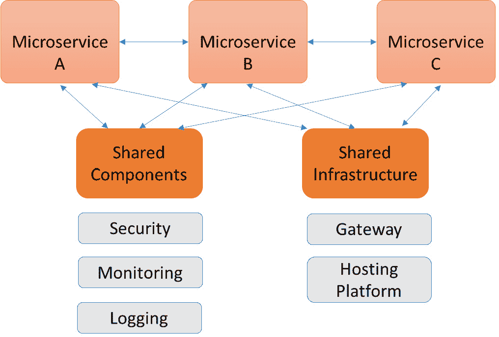
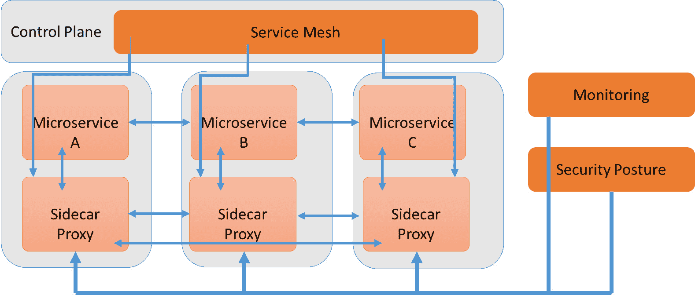
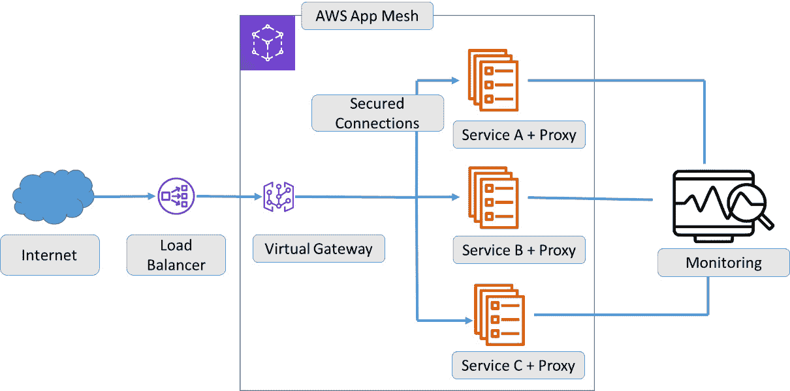
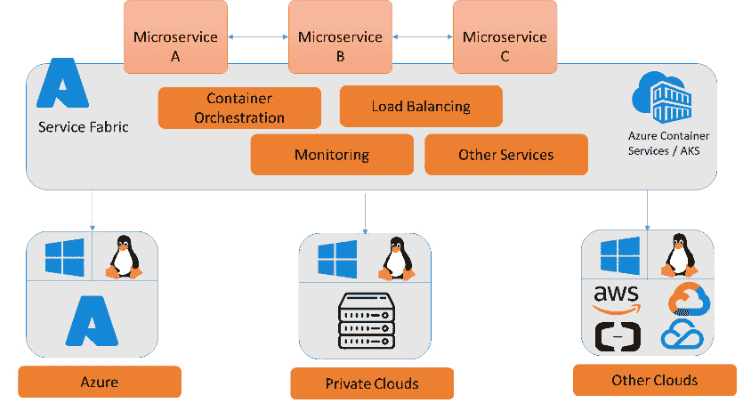

# *第十五章*：实现零信任架构

数字化转型是企业的新范式。企业正在采用数据驱动的架构，并在云中使用越来越多的原生服务，通过这种方式加速其产品和服务的发展。在这种压力下，安全必须跟上，并确保环境，很多时候甚至是关键任务环境，保持弹性。这就是零信任的领域。

本章解释了零信任是什么，以及它对 DevOps 的重要性。零信任假设企业网络内部的所有事物都是安全的，这也包括 DevOps 流水线。在零信任环境中使用的一些技术是服务网格和微服务，这个话题我们将在本章最后部分讨论。

完成本章后，你将了解零信任的含义以及它对 DevOps 的影响。你将了解到微服务和安全的服务网格如何推动安全的数字化转型。在最后部分，我们将简要讨论云平台提供的一些解决方案。

在本章中，我们将涵盖以下主要内容：

+   理解零信任原则

+   为零信任安全架构设计

+   包括架构中的微服务

+   在流水线中集成零信任

# 理解零信任原则

零信任确实意味着零信任，首先。零信任的原则在过去几年里在 IT 安全领域获得了广泛关注，这是有充分理由的。攻击不仅来自外部，还可能来自企业内部网络。零信任提倡无论用户是处于企业网络内外，所有用户或每个身份都必须进行身份验证。通过身份验证后，用户必须根据安全策略进行验证，并在授权后才能访问应用程序。数据访问应仅通过经过验证的应用程序进行，且用户必须在应用程序中经过身份验证并授权。

在我们学习零信任如何在 DevSecOps 中运作，尤其是在**持续集成**/**持续部署**（**CI**/**CD**）流水线中运作之前，我们需要更深入地了解零信任的原则。

零信任始于了解谁在企业的网络中。这一点有一个重要的事项需要注意：在云环境中，一切都是身份。它可以是一个真实的用户，一个人，但也可以是被触发来执行特定操作的服务。同时，服务有一定的权限：它们被允许执行特定的操作或获取定义的数据集，并且禁止执行其他操作。因此，所有身份，或者更准确地说，所有账户，必须被识别，并且更重要的是，必须清楚它们拥有哪些权限。这意味着企业必须不断监控并验证所有账户及其凭证和权限。这必须实时进行。

现在，你可能认为零信任主要是监控帐户。但实际上，零信任还意味着企业已采取措施，防止经过认证的用户做超出授权的事情。你可能会想到为帐户设置最小权限，但你还需要考虑网络分段和限制网络上的特定协议。基本上，你需要考虑所有包含帐户的内容，以确保其只能在授权的地方执行被授权的任务。这必须通过强有力的**身份和访问管理**（**IAM**）政策、网络分段、外部和内部防火墙、网关以及严格的路由政策（如*拒绝所有*和*仅允许白名单地址*）来强制执行。

零信任中必须包含的原则如下：

+   帐户类型和凭据始终基于最小权限原则。

+   指定的特权权限及其应用规则。

+   为服务和应用程序定义的端点。

+   认证协议。

+   安全监控包括入侵检测、入侵防御和异常检测。

+   使用最新版本和最新补丁的操作系统加固。

+   使用最新版本和最新补丁的软件生命周期。

这如何影响 DevOps？这个问题的答案是：零信任对 DevOps 和敏捷工作方式有着巨大影响。DevOps 的核心是加速应用代码的开发和部署。这需要灵活性，并且要求 DevOps 团队承担极大的责任。虽然严格的安全规则确实会妨碍开发和部署的速度，但保护企业资产没有其他方法。DevOps 团队同样有责任保护这些资产。

其结果是，DevOps 团队也必须遵守零信任原则。团队只能使用被允许访问代码仓库的帐户，使用在云中企业网络特定区域内的构建，使用经过批准的操作系统、软件和工具，并应用通过路由和防火墙规则强制执行的安全政策。

然而，零信任并不意味着 DevOps 过程默认会变慢。只有在将零信任的责任放在团队之外时，才会发生这种情况。例如：团队已准备好部署代码，但现在必须等待特定的防火墙端口被打开。如果该端口已经被列入白名单，并且自动化安全扫描已验证代码符合防火墙规则，则可以迅速完成。如果批准过程必须通过一个安全部门手动验证所有内容，那么这一过程就会显著变慢。

因此，我们需要将零信任纳入 DevOps 流程。我们将在接下来的章节中讨论这个问题。

# 零信任安全架构

在充分理解零信任概念的基础上，我们可以定义应用零信任原则的架构。以下准则将帮助定义该架构。部分原则可能显而易见，其他原则可能会导致开发人员在开发和部署应用程序时的某些限制。但最终，我们需要确保企业资产的安全：

+   评估和分析所有访问控制。必须制定严格的身份和访问管理（IAM）策略。最小权限原则必须是这些策略的一部分。这是根据**国家标准与技术研究院**（**NIST**）的定义，零信任的核心。他们为零信任架构定义了一组原则，所有这些原则都涉及企业如何处理 IAM。关键原则是拥有一个单一的身份源。在大多数情况下，企业将使用**Active Directory**（**AD**）来实现这一点。简而言之，任何用户或身份必须被*AD 所知*。

+   接下来，必须进行强身份验证。身份是否确实如其所声称的那样？**多因素认证**（**MFA**）是强烈推荐的。NIST（美国国家标准与技术研究院）还强调了验证和验证用户授权和身份验证上下文的必要性。例如：是从哪台机器访问的仓库？该设备是否符合企业的标准？许多开发人员都有自己的机器，并使用自己偏好的工具。这必须经过评估，以明确这是否符合安全策略。

+   必须定义和控制特定应用程序的访问策略。一个在营销网站上工作的开发人员可能不需要访问控制企业供应链的应用程序。在这种情况下，应限制对该应用程序的访问。因此，零信任意味着每个应用程序都有自己的策略：谁有资格访问，访问到何种级别，以及在该应用程序中的权限是什么？

+   数据分类和数据安全是零信任架构的下一个关键组成部分。数据必须受到保护。现代基于云的 IT 面临的挑战是，数据可能存在于任何地方，并且跨平台、跨应用程序和跨服务共享。企业需要清楚地知道他们的数据在哪里，数据的类型是什么，谁或什么被允许在严格的条件下访问这些数据。数据必须被识别和分类：例如，它是机密的，还是可以公开访问的？严格的隐私法规，例如欧盟的**通用数据保护条例**（**GDPR**），是数据分类的指南；应用这些指南是企业的责任。

+   美国国家标准与技术研究院（NIST）和**国家网络安全卓越中心**（**NCCoE**）也将*受信云*定义为一个构建模块。这是因为云本身具有动态特性。现在我们真正进入了 DevOps 的核心，在这里我们遵循自主工作团队的规则，团队可以在需要时即时创建环境，修改它们，甚至删除它们。这些环境将使用数据，但其中一些环境可能只是短暂的，而其他的最终将推向生产环境。云技术，通过一切代码化，促进了这一点。这对安全性是一个巨大的挑战，特别是在保持环境与安全策略一致方面。因此，安全必须融入 DevOps 中。监控应该是实时的，并能够启用控制措施，以识别任何安全策略的违规行为，即使这意味着开发会因此暂停。

总结来说，我们可以说零信任主要是关于尽可能地将网络分段、应用、数据和服务分开，并且只允许经过身份验证和授权的用户，以最小权限访问这些不同的组件。微服务将帮助架构师实现这一点。然而，微服务也带来了一些挑战。这些挑战可以通过服务网格来克服。

# 在架构中加入微服务

DevOps 旨在通过更快速的代码发布来提高生产力。DevOps 团队可以专注于特定任务和只执行该任务的代码。他们独立于其他服务开发代码，以提高关注度、交付速度和客户体验。安全原则应用于这些服务，并通过自动扫描手段不断验证。DevOps 默认是分布式架构，与单体架构形成对比，后者是将系统设计和构建为一个整体。在 DevOps 中，架构将由微服务驱动：一个应用程序被定义为由独立服务组成的集合，这些服务通过指定的协议相互通信。下图展示了微服务的原理：

图 15.1 – 微服务原理

在安全性方面，我们可以假设微服务架构比单体系统更安全。如果某个服务被突破，并不意味着整个应用堆栈都会被突破，只要受影响的服务得到了足够的隔离。不幸的是，事情并不像想象的那么简单。原因在于微服务确实需要能够相互通信。下一个问题是：我们如何以安全的方式实现这一点？答案是服务网格。

首先，让我们来看看微服务架构的最佳实践：

+   **防御策略**：微服务允许多种防御层或安全层。例如，一个 web 门户需要公开访问，但应用程序和数据应该得到保护。一个很好的例子是移动银行应用。该应用可以在任何智能手机上访问：用户可以从应用商店下载并安装它。要访问检索和呈现账户信息的应用程序，用户需要具备几件事：一个特定银行的账户，以及一个允许他们使用移动应用的账户。这是两个不同的事情。显然，账户数据也会受到保护，例如通过加密。

+   **DevSecOps**：正如我们在前几章中看到的，这一切都是将安全实践嵌入到 DevOps 中。在整个构建过程中，代码会自动扫描，遵循政策和行业安全合规框架。但这不仅仅是在构建过程中；在部署后，应用程序和代码应该持续监控以发现漏洞。

+   **MFA**：每个应用程序都应仅通过多因素认证（MFA）进行访问。仅使用用户名和密码显然不足够；认证应通过第二因素进行，例如，使用与登录设备不同的设备上的认证应用进行认证。即使已经使用 MFA 访问应用程序，当访问特定的高度机密数据时，可能仍然需要重新认证。仅访问应用程序并不意味着用户默认可以访问该应用程序能够检索到的所有数据。应用程序和数据是分开的层次或级别。

+   **依赖性**：在云环境中，我们可能会使用云服务，例如**平台即服务**（**PaaS**）和**软件即服务**（**SaaS**）。我们需要**应用程序编程接口**（**API**）来实现这些服务之间的互动。这些是依赖项，如果没有经过验证和良好的配置，可能会导致漏洞和安全威胁。必须对源代码进行扫描，以查找易受攻击的依赖项。

依赖性可能是安全方面最大的挑战。在现代架构中，如何通过使用微服务来处理这个问题？

## 理解和应用服务网格

DevOps 在微服务中得到了很好的支持。这是开发和部署新功能的完美方式，可以在不影响其他正在运行的服务的情况下进行编码。由于微服务的粒度，开发和部署也可以在较低级别进行安全保护，从而降低了服务中断用户体验的风险。使用微服务意味着配置错误或程序不当的实现仅限于正在开发和部署的特定服务，也最小化了整个应用程序堆栈的攻击面。为了支持这种工作方式，容器发挥了重要作用。服务和功能被打包并作为容器进行部署。

下一个挑战是如何让这些容器化的服务和功能安全地互相作用。这正是服务网格的核心内容。为了建立这种互动，开发者需要在应用程序代码中进行配置。他们将集成能够与应用程序外部服务通信的库，例如服务发现、负载均衡，以及设置与其他服务之间的**传输层安全性**（**TLS**）流量。首先，配置字符串和它们在应用程序代码中调用的服务需要共享一种通用语言。但更重要的是，当一个服务发生变化时，应用程序代码也需要进行相应的调整。这使得应用程序代码变得复杂。

服务网格通过将复杂性从应用程序中移除，并将其转移到服务代理来解决这个问题。这个代理现在负责处理应用程序与其他功能组件交互时使用的许多*第三方服务*。比如流量管理，包括负载均衡、身份验证，当然，还有安全性和监控。服务现在从应用程序代码中抽象出来，成为一个独立的组件。

开发者只需要关注应用程序代码，因为所有其他服务都由服务代理来处理。通过这种方式，我们实现了严格的责任分离。

听起来是个不错的解决方案，但它在实践中是如何运作的呢？我们将在本章的最后一节学习这一点。

# 在流水线中集成零信任

在前面的章节中，我们讨论了零信任架构的原理以及微服务如何帮助实现零信任。接下来，我们了解了如何通过安全的服务网格让微服务互相作用。在这一节中，我们将学习如何通过容器化应用程序以及我们从 CI/CD 流水线中瞄准的云服务来实现这一目标。像 AWS 和 Azure 这样的平台提供了相应的解决方案，我们将讨论这些解决方案。

首先，我们需要了解如何为服务网格添加安全性。一种方法是使用边车（sidecar）。简单来说，边车是容器集群中的一个节点，用于插入安全策略。你可以把它想象成一条主路，汽车在上面行驶。一辆载有特定安全策略的汽车从一条侧路驶入，插入到主路上的车队中。然而，这个插入点是固定的。

有多种工具提供旁车服务网格。常见的有 Istio、Linkerd 和 Envoy。这些工具的共同点在于，它们将所需的功能放入一个单独的容器中，并将其插入到应用容器附近，就像我们描述的插入汽车一样。由于大多数使用容器的开发者都在使用 Kubernetes，因此了解旁车容器必须与应用容器放在同一个 Kubernetes pod 中是很重要的。因为 pod 的命名空间需要相同。应用容器和旁车容器可以通过 CI/CD 流水线进行集成。

服务网格和旁车代理的整体原理如图所示：

图 15.2 – 服务网格和旁车的原理

如前所述，云平台也提供服务网格。AWS 有 AWS App Mesh，它允许服务在不考虑底层基础设施的情况下相互交互，当它使用 Envoy 旁车代理时。原生 App Mesh 可以与 AWS Fargate 的无服务器基础设施服务、EC2 计算引擎以及 **Elastic Container Services**（**ECS**）和 **Elastic Kubernetes Services**（**EKS**）的容器编排服务一起使用。AWS App Mesh 的高级架构如图所示：

图 15.3 – AWS App Mesh 的架构

在 Azure 中，我们使用 Azure Service Fabric，这是微软的容器编排器，用于部署和管理微服务。微软于 2018 年推出的完全托管的网格服务 Azure Service Fabric Mesh 已于 2021 年 4 月退役。使用 Azure 的公司可以使用 Azure 容器服务、**Azure Kubernetes 服务**（**AKS**）或 Azure Service Fabric 托管集群来创建网格功能。Azure Service Fabric 的原理如图所示：

图 15.4 – Azure Service Fabric 的高级架构

这标志着我们对企业 DevOps、AIOps 和 DevSecOps 之旅的结束。在这个数字化转型的时代，架构师面临着一个重要任务，那就是理解这些方法论如何帮助企业现代化其 IT 环境，使软件开发更加敏捷，同时确保在开发和部署过程中实现最大安全性。本书仅是一个起点，关键在于实践，所以走出去，尝试将其落实。

# 总结

在这一章节中，我们首先学习了零信任架构的原则，并了解到 DevOps 团队也需要遵守这些原则。零信任从准确知道谁可以访问代码仓库开始，并且了解构建只能部署到严格隔离的网络段，以避免影响其他服务。接下来，我们了解到微服务架构对 DevOps 有很好的支持，它们允许独立开发和部署代码中的功能，而不影响其他服务。

我们了解到，微服务是一种安全的架构类型。然而，挑战在于如何建立这些微服务之间的互动。我们研究了服务网格作为解决方案，并了解了如何将安全策略作为容器化微服务集成，使用侧车代理技术。我们还学习了如何通过使用侧车代理在微服务旁插入安全服务和监控功能。

在最后一部分，我们介绍了一些云服务提供商（如 Azure 和 AWS）提供的网格服务。此部分总结了 DevOps、DevSecOps 和 AIOps 在企业架构中的应用，这些概念在数字化转型中变得越来越重要，理解并实施它们是成功推动企业数字化转型的关键。

# 问题

1.  在零信任环境中，我们应用哪些基本规则来管理账户权限？

1.  我们使用什么类型的服务来在应用容器旁插入具有安全策略的独立容器？

1.  AWS 提供了什么服务来支持服务网格？

# 进一步阅读

+   **国家网络安全卓越中心**（**NCCoE**）关于零信任架构的网站：[`www.nccoe.nist.gov/projects/building-blocks/zero-trust-architecture`](https://www.nccoe.nist.gov/projects/building-blocks/zero-trust-architecture)

+   *Kubernetes 微服务实战*，作者 Gigi Sayfan，Packt Publishing，2019

+   微软 Azure Service Fabric 的文档：[`docs.microsoft.com/en-us/azure/service-fabric/service-fabric-overview#:~:text=%20Overview%20of%20Azure%20Service%20Fabric%20%201,application%20lifecycle...%204%20Next%20steps.%20%20More%20`](https://docs.microsoft.com/en-us/azure/service-fabric/service-fabric-overview#:~:text=%20Overview%20of%20Azure%20Service%20Fabric%20%201,application%20lifecycle...%204%20Next%20steps.%20%20More%20)

+   AWS App Mesh 的博客文章：[`aws.amazon.com/app-mesh/?aws-app-mesh-blogs.sort-by=item.additionalFields.createdDate&aws-app-mesh-blogs.sort-order=desc&whats-new-cards.sort-by=item.additionalFields.postDateTime&whats-new-cards.sort-order=desc`](https://aws.amazon.com/app-mesh/?aws-app-mesh-blogs.sort-by=item.additionalFields.createdDate&aws-app-mesh-blogs.sort-order=desc&whats-new-cards.sort-by=item.additionalFields.postDateTime&whats-new-cards.sort-order=desc)
