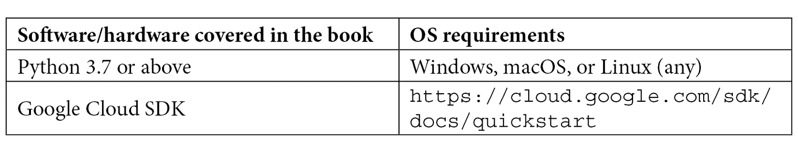

# 前言

本书是一本全面介绍**站点可靠性工程**（**SRE**）基础知识的指南，它是 Google 的 DevOps 方法论。此外，本书还深入探讨了 Google Cloud 中的一些关键服务，帮助实现**持续集成/持续部署**（**CI/CD**），并专注于通过 Kubernetes 实现容器化部署。本书还作为 Google Cloud Professional Cloud DevOps Engineer 认证的备考材料，包含基于章节的测试和模拟测试。

# 本书的适用人群

本书非常适合那些希望解决基于云的操作问题的云系统管理员和网络工程师。那些希望在 Google Cloud 服务管理领域提升职业发展的 IT 专业人士将从中受益。想要学习如何应用 SRE 原则，并专注于在**Google Cloud Platform**（**GCP**）中实施 DevOps 的用户也会受益。建议具备基本的云计算和 GCP 服务知识，了解 CI/CD，且有 Unix/Linux 基础架构的实践经验。那些有意通过 Professional Cloud DevOps Engineer 认证的读者将会发现本书非常有用。

专业云 DevOps 工程师认证具有一定的进阶性质。为了更好地准备此认证，建议先准备或通过 Associate Cloud Engineer 认证或 Professional Cloud Architect 认证。尽管这些认证不是 Professional Cloud DevOps Engineer 认证的前提条件，但它们有助于更好地准备并熟悉 GCP 上的服务。

# 本书内容简介

*第一章*，*DevOps、SRE 和 Google Cloud 服务用于 CI/CD*，讲解了 DevOps，它是一套可重复、迭代地构建、测试和发布代码的实践。这些实践旨在打破开发团队和运维团队之间的隐形壁垒。SRE 是 Google 推出的实施 DevOps 的规定方法，它使开发和运维团队的激励机制对齐，从而共同构建和维护可靠的系统。此外，Google 提倡一种云原生开发范式，在该范式中，复杂系统被分解为多个服务，采用微服务架构进行管理。

本章将涵盖的内容包括 DevOps 生命周期、SRE 的发展、关键技术和文化的 SRE 实践介绍，以及使用云原生开发范式的好处。本章还将介绍 GCP 上的服务，帮助实现云原生开发并应用 SRE 概念。

*第二章*，*SRE 技术实践 – 深度剖析*，讲述了可靠性，这是服务最关键的特性，应与业务目标保持一致。SRE 提出了特定的技术实践，用于衡量定义和跟踪可靠性的特征。这些技术实践包括**服务级别协议**（**SLA**）、**服务级别目标**（**SLO**）、**服务级别指标**（**SLI**）、错误预算以及通过自动化消除无意义工作。

本章深入探讨了 SRE 技术实践。内容将包括制定明确 SLA 的蓝图、通过 SLO 定义可靠性期望、理解可靠性目标及其影响、对用户旅程进行分类、衡量 SLI 的来源、通过跟踪错误预算探索提升服务可靠性的方法，以及通过自动化消除无意义工作。本章最后将通过两个场景展示 SLA、SLO 和错误预算的影响，相关于所测量的 SLI。

*第三章*，*理解监控与告警以针对可靠性*，讨论了实施 SRE 技术实践的关键在于确保 SLA、SLO 和 SLI 永不被违反。这样做可以实现平衡新功能发布和保持系统可靠性，因为错误预算不会被消耗殆尽。监控、告警和时间序列是跟踪 SRE 技术实践的基础概念。

本章深入探讨了监控、告警和时间序列。内容将包括监控来源、监控类型、监控策略、建议测量和监控的黄金信号、定义告警策略的潜在方法和关键属性，以及时间序列的结构和基数。

*第四章*，*构建 SRE 团队并应用文化实践*，讲述了 Google 长期以来如何将 SRE 视为确保系统可靠性的秘密武器，同时保持新功能发布的速度。Google 通过实施一套既定的文化实践，如事件管理、值班和心理安全，达成了这一目标。SRE 文化实践是实施 SRE 技术实践的必要条件，Google 强烈推荐希望开始 SRE 之旅的组织采纳这些文化实践。此外，Google 提出了建立 SRE 团队的关键因素，并提出了参与模型。

本章深入探讨了构建 SRE 团队，包括关于 SRE 团队不同实施方式、SRE 工程师的人员配置细节，以及 SRE 参与模式的见解。本章还将讨论 SRE 文化实践，其中包括有效的事件管理方面、值班时需要考虑的因素，以及促进心理安全需要克服的因素。本章最后介绍了一种旨在通过共享愿景和知识、促进协作来减少组织壁垒的文化实践。

*第五章*，*使用云源代码库管理源代码*，讨论了源代码管理是持续集成（CI）流程中的第一步。代码存储在源代码库中，例如 GitHub 或 Bitbucket，以便开发人员可以持续进行代码更改，并将修改后的代码集成到库中。**云源代码库**（**CSR**）是 Google Cloud 提供的服务，通过私人 Git 仓库提供源代码管理。

本章深入探讨了 CSR。本章将涵盖包括 CSR 关键特性、创建和访问仓库的步骤、如何将代码从 GitHub/Bitbucket 一次性同步到 CSR，以及 CSR 中的常见操作，如浏览仓库、执行通用代码搜索和检测安全密钥等内容。本章最后通过实践实验，展示了如何通过从 CSR 拉取代码将代码部署到云函数中。

*第六章*，*使用 Cloud Build 构建代码并推送到容器注册表*，讨论了代码检查到像 CSR 这样的源代码管理系统后，CI 流程中的下一个合逻辑步骤是构建代码、创建构建产物并推送到一个可以存储生成的构建产物的注册表。Cloud Build 是 Google Cloud 提供的服务，可以构建源代码，而容器注册表是存储创建的构建产物的目标位置。

本章深入探讨了 Cloud Build 和容器注册表。本章将涵盖包括理解自动化需求、构建和创建容器镜像的过程、Cloud Build 的关键要点、优化构建速度的策略、容器注册表的关键要点、容器注册表的结构以及容器分析等内容。本章最后通过实践实验，展示了如何使用 Cloud Build 触发器构建、创建、推送并将容器部署到 Cloud Run。本实验还展示了一种构建 CI/CD 管道的方法，因为它包括持续集成（CI）和将容器自动部署到 Cloud Run 的过程，Cloud Run 是一个运行容器的 GCP 计算选项。

*第七章*，*理解 Kubernetes 基础以部署容器化应用程序*，介绍了**Kubernetes**，或称**K8s**，它是一个开源的容器编排系统，能够运行容器化应用程序，但在设置和持续维护方面需要付出大量的努力。Kubernetes 起源于谷歌内部的集群管理工具；谷歌在 2014 年将其作为开源项目捐赠给了**云原生计算基金会**（**CNCF**）。

本章深入讲解了 K8s。内容涵盖 K8s 的关键特性，集群结构的详细说明，包括主控制平面组件、节点组件，Kubernetes 关键对象如 Pods、Deployments、StatefulSets、DaemonSet、Job、CronJob 和 Services，以及在调度 Pods 时需要考虑的关键因素。本章最后深入探讨 Kubernetes 中可能的部署策略，包括 Recreate、Rolling Update、Blue/Green 和 Canary。

*第八章*，*理解 GKE 基础以部署容器化应用程序*，介绍了**Google Kubernetes Engine**（**GKE**），它是 K8s 的托管版本；即一个开源的容器编排系统，用于自动化应用程序部署、扩展和集群管理。与创建集群和持续维护相比，GKE 需要更少的努力。

本章深入讲解了 GKE。内容包括 GKE 核心特性，如 GKE 节点池、GKE 集群配置、GKE 自动扩展、GKE 网络，包括 Pod 和服务的网络、GKE 存储选项，以及 GKE 的云操作。本章有两个实践实验。第一个实践实验位于本章开头，演示了使用标准模式创建集群、部署工作负载以及将 Pod 暴露为服务。本章最后有一个与第一个实验相似的实践实验，但集群创建模式是 Autopilot。

*第九章*，*使用 GKE 安全构建保护集群*，介绍了如何保护 Kubernetes 集群，这是部署过程中的一个关键部分。原生 Kubernetes 提供了一些基本的安全特性，重点关注如何验证和授权发送到集群的请求。理解如何保护主控制平面组件以及运行应用程序的 Pod 同样重要。此外，GKE 提供了对于增强集群安全性至关重要的安全功能。

本章深入讲解 GKE 安全功能。本章将涵盖 Kubernetes 中的基本安全模式、控制平面安全性和 Pod 安全性等内容。本章最后讨论 GKE 特有的安全功能，如 GKE 私有集群、容器优化操作系统、加固的 GKE 节点、通过网络策略限制 Pod 之间的流量、通过二进制授权部署时间安全服务，以及使用工作负载身份从 GKE 集群内部访问 GCP 服务。

*第十章*，*探索 GCP 云操作*，探讨了在应用程序部署后，DevOps 生命周期的下一个关键阶段是持续监控，因为它提供了一个反馈循环，以确保服务或系统的可靠性。如*第二章*，*SRE 技术实践深入剖析*中所讨论，SRE 推荐使用特定的技术工具或实践，帮助衡量定义和跟踪可靠性的特征，如 SLA、SLO、SLI 和错误预算。SRE 提倡使用可观察性来跟踪技术实践。在 GCP 上的可观察性是通过 Cloud Operations 实现的。

本章深入讲解 Cloud Operations。本章将涵盖 Cloud Monitoring 基础知识，包括工作空间、仪表板、Metrics Explorer、正常运行时间检查、配置警报、监控代理的需求，以及 Cloud Monitoring 特定的访问控制。 本章还将介绍 Cloud Logging 基础知识，包括审计日志及其分类、跨日志桶汇总日志特征、基于日志的度量、Cloud Logging 特定的访问控制、基于网络的日志类型，以及日志代理的使用。本章最后讨论与 Cloud Debugger、Cloud Trace 和 Cloud Profiler 相关的各种基础知识。

# 为了最大限度地发挥本书的作用

推荐你具备以下领域的基础知识，包括 Docker、Kubernetes 原生介绍、Git 的基本知识、Google Cloud 上的关键服务（如 Cloud Operations、计算服务）的实际操作经验，以及 Google Cloud SDK 或 Cloud Shell 的使用经验。此外，选择性编程语言（如 Python、Java 或 Node.js）的实践经验也将非常有帮助。然而，本书中的代码示例是使用 Python 编写的。



**如果你正在使用本书的电子版，我们建议你自己输入代码，或通过 GitHub 仓库访问代码（链接将在下一部分提供）。这样做可以帮助你避免因复制和粘贴代码而导致的潜在错误。**

无论你是否正在为专业云 DevOps 工程师认证而努力，建议在完成所有章节后尝试模拟考试。这将是评估从书中内容吸收的知识的一个好方法。

# 下载示例代码文件

本书的代码包也托管在 GitHub 上，网址为 [`github.com/PacktPublishing/Google-Cloud-Platform-for-DevOps-Engineers`](https://github.com/PacktPublishing/Google-Cloud-Platform-for-DevOps-Engineers)。如果代码有更新，它将在现有的 GitHub 仓库中更新。

我们还有其他来自我们丰富书籍和视频目录的代码包，欢迎访问 [`github.com/PacktPublishing/`](https://github.com/PacktPublishing/)。快来看看吧！

# 下载彩色图像

我们还提供一个 PDF 文件，其中包含本书中使用的截图/图表的彩色图像。你可以在此下载：[`www.packtpub.com/sites/default/files/downloads/9781839218019_ColorImages.pdf`](http://www.packtpub.com/sites/default/files/downloads/9781839218019_ColorImages.pdf)。

# 使用的约定

本书中使用了若干文本约定。

`文本中的代码`：表示文本中的代码词汇、数据库表名、文件夹名称、文件名、文件扩展名、路径名、虚拟网址、用户输入和 Twitter 用户名。举个例子：“你可以使用 `my-first-csr` 仓库。”

一段代码设置如下：

```
steps:
- name: 'gcr.io/cloud-builders/docker'
  args: ['build', '-t', 'gcr.io/$PROJECT_ID/builder-myimage', '.']
- name: 'gcr.io/cloud-builders/docker'
  args: ['push', 'gcr.io/$PROJECT_ID/builder-myimage']
- name: 'gcr.io/cloud-builders/gcloud'
```

当我们希望引起你对代码块中特定部分的注意时，相关的行或项目会设置为粗体：

```
apiVersion: autoscaling.k8s.io/v1
kind: VerticalPodAutoscaler
metadata:
  name: my-vpa 
```

任何命令行输入或输出均按以下方式书写：

```
gcloud builds submit --config <build-config-file> <source-code-path>
```

**粗体**：表示一个新术语、一个重要的单词或你在屏幕上看到的词语。例如，菜单或对话框中的词语会像这样出现在文本中。举个例子：“在 GCP 中导航到**源代码库**，并选择**开始使用**选项。”

提示或重要注意事项

如此显示。

# 联系我们

我们始终欢迎读者的反馈。

**一般反馈**：如果你对本书的任何方面有疑问，请在邮件的主题中提到书名，并通过 customercare@packtpub.com 与我们联系。

**勘误**：虽然我们已尽最大努力确保内容的准确性，但错误还是难免发生。如果你发现本书中的错误，我们将感激你向我们报告。请访问 [www.packtpub.com/support/errata](http://www.packtpub.com/support/errata)，选择你的书籍，点击“勘误提交表单”链接，并输入详细信息。

**盗版**：如果你在互联网上发现任何我们作品的非法副本，无论其形式如何，我们将不胜感激如果你能提供该副本的地址或网站名称。请通过 copyright@packt.com 与我们联系，并提供该材料的链接。

**如果你有兴趣成为一名作者**：如果你在某个领域具有专业知识，并且有兴趣撰写或为书籍做贡献，请访问 [authors.packtpub.com](http://authors.packtpub.com)。

# 评论

请留下评论。在你阅读并使用了本书后，为什么不在你购买书籍的网站上留下评论呢？潜在的读者可以看到并参考你的客观意见来做出购买决策，我们 Packt 能够了解你对我们产品的看法，而我们的作者也能看到你对他们书籍的反馈。谢谢！

欲了解更多关于 Packt 的信息，请访问 [packt.com](http://packt.com)。
