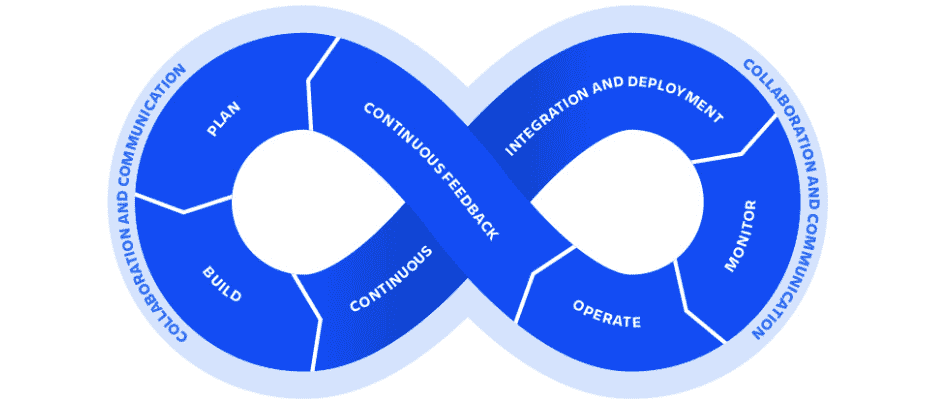
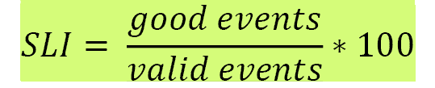
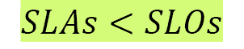
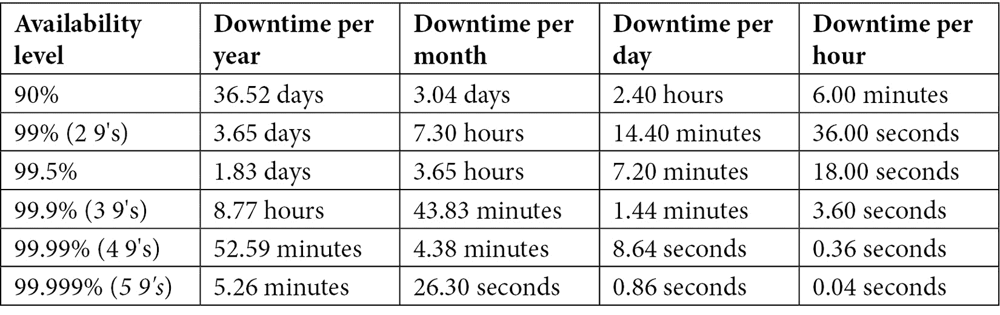
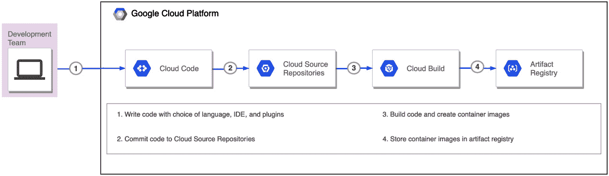
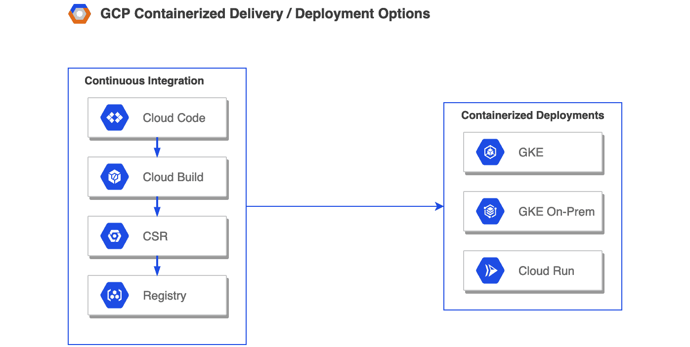
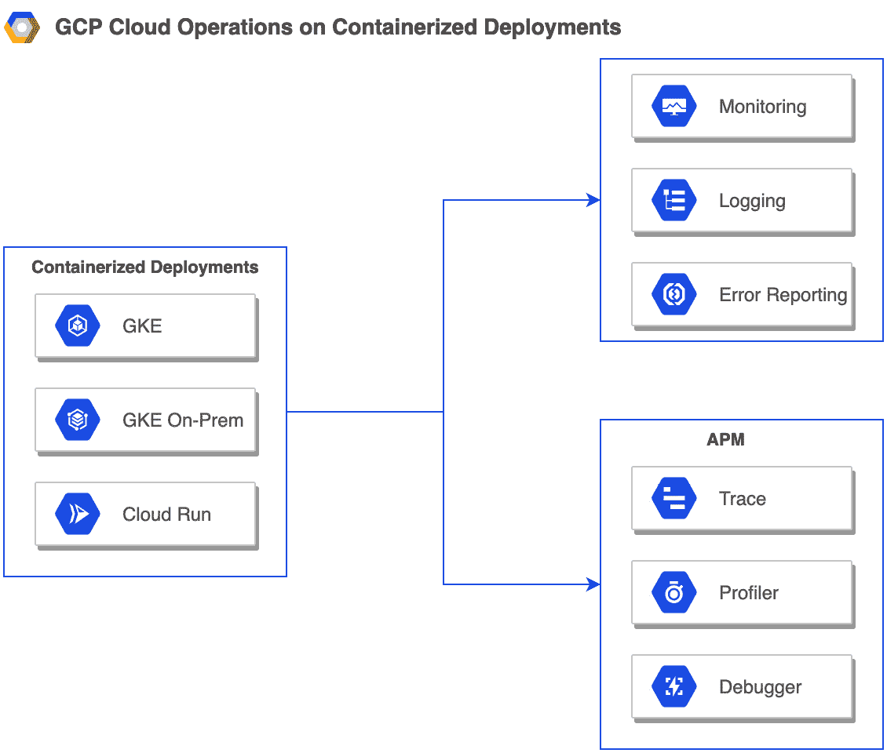
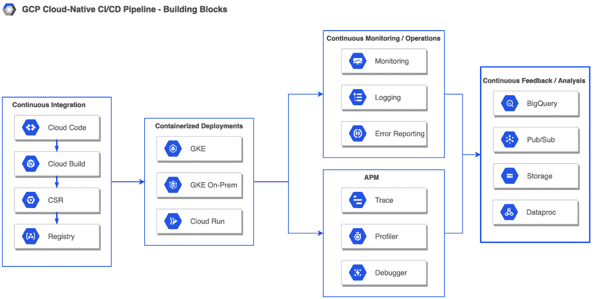

# 第一章：DevOps、SRE 和 Google Cloud CI/CD 服务

**DevOps** 是一种思维方式的转变，试图平衡发布速度与系统可靠性。它旨在提高一个组织相较于传统软件开发流程时，持续交付可靠应用和服务的能力，并保持较高的速度。

关于 DevOps 的一个常见误解是它是一种技术。实际上，DevOps 是一组支持性实践（例如构建、测试和部署），它将软件开发和 IT 运维结合在一起。这些实践建立了一种文化，打破了开发人员（旨在将新功能推向生产环境）与系统管理员或运维人员（旨在保持代码在生产环境中正常运行）之间的隐喻性壁垒。

**站点可靠性工程** (**SRE**) 是 Google 用来对齐开发和运维之间激励机制的方法，这对构建和维护可靠的工程系统至关重要。SRE 是一种规范化的方式来实施 DevOps 实践和原则。通过这些实践，目标是提高整体可观察性并减少事件发生的频率。引入 **持续集成/持续交付** (**CI/CD**) 流水线支持关键的 SRE 定义，如繁重工作、可观察性和事件管理，从而实现强大的反馈循环。

**CI/CD** 是实现这一思维转变的关键 DevOps 实践。CI/CD 强调自动化，以 *更快速地构建可靠软件*（在交付/部署到生产环境方面）。这种类型的软件交付需要敏捷性，而敏捷性通常是通过拆解现有组件来实现的。

**云原生开发**范式是一种将复杂系统分解为多个服务（如微服务架构）的方法。每个服务可以独立测试并部署到隔离的运行时环境中。**Google Cloud Platform** (**GCP**) 提供了明确的服务来实现云原生开发，并应用 SRE 概念以实现 *更快速地构建可靠软件* 的目标。

本章将涵盖以下主要内容：

+   DevOps 101 – 演变与生命周期

+   SRE 101 – 演变；技术和文化实践

+   GCP 实现 DevOps 的云原生方法

# 理解 DevOps 及其演变和生命周期

本节重点介绍 DevOps 的演变，并列出了构成 DevOps 生命周期的阶段或关键实践。

## 重访 DevOps 演变

让我们退后一步，思考一下 DevOps 是如何演变的。**敏捷软件开发方法论** 是一套基于迭代开发的实践，要求通过跨职能团队与最终用户之间的合作，构建需求和解决方案。DevOps 可以被视为 Agile 的逻辑延伸，有些人甚至认为 DevOps 是 Agile 的产物。这是因为 DevOps 从 Agile 逻辑上停止的地方开始。让我们详细探讨一下这意味着什么。

敏捷作为一种端到端的软件交付方法被引入。其核心原则在《敏捷宣言》中定义（[`agilemanifesto.org/`](https://agilemanifesto.org/)），特别强调与流程和工具的互动、提升协作、增量和迭代开发，以及对固定计划变化的灵活应对。最初的敏捷团队主要由开发人员组成，但很快扩展到了产品管理、客户和质量保证。如果我们考虑到增加的迭代测试和用户验收测试的影响，结果是可以更快地将软件交付到生产环境。

然而，敏捷方法论带来了一个新的问题，导致需要新的演变。一旦软件交付到生产环境，运维团队的主要任务是确保系统的稳定性和维护。同时，开发团队继续为已交付的软件添加新特性，以满足客户不断变化的需求，并跟上竞争的步伐。

运维人员总是小心谨慎，担心引入问题。开发人员则坚持推动更改，因为这些更改已在本地环境中经过测试，而且开发人员总认为确保更改在生产环境中正常运行是运维人员的责任。但从运维人员的角度来看，他们对代码库几乎没有了解。同样，开发人员对运维实践也知之甚少。所以，实际上，开发人员专注于更快地发布新特性，而运维人员则专注于稳定性。这迫使开发人员在将新特性推向生产环境时变得更加缓慢。这种不协调常常导致组织内部的紧张局势。

Patrick Debois，一位 IT 顾问，在 2007 年参与一个大型数据中心迁移项目时，遇到了与开发人员和运维人员合作时的类似挑战。他创造了“DevOps”这一术语，并与 Andrew Shafer 一起推动了这一运动。他们认为 DevOps 是敏捷的延伸。事实上，当他们为 DevOps 创建第一个 Google 群组时，他们称其为**敏捷系统管理**。

DevOps 运动促进了软件开发与 IT 运维之间的更好沟通，并有效地提升了软件质量，持续性成为了稳定环境运营、持续交付、改进协作和增强运维实践的核心主题，重点是创新。这导致了 DevOps 生命周期的演变，具体内容将在接下来的子章节中详细说明。

## DevOps 生命周期

DevOps 包括一些阶段或实践，这些阶段或实践共同构成了 DevOps 生命周期。在本节中，我们将详细讨论这些阶段，如下图所示：

图 1.1 – DevOps 生命周期的各个阶段

DevOps 生命周期中有六个主要阶段。具体如下：

+   计划和构建

+   持续集成

+   持续交付

+   持续部署

+   持续监控与操作

+   持续反馈

这里的关键词是**持续**。如果代码持续开发，接下来就需要持续地进行测试、提供反馈、部署、监控和操作。这些阶段将在后续部分介绍。

### 第一阶段 – 计划和构建

在**规划**阶段，核心关注点是理解愿景并将其转化为详细的计划。计划可以拆分为多个阶段，通常被称为**史诗**（在敏捷术语中）。每个阶段或史诗可以被划定为实现一组特定功能，这些功能可以进一步细化为一个或多个用户故事。这需要各方利益相关者之间大量的沟通与协作。

在**构建**阶段，代码使用选择的编程语言编写，并创建适当的构建产物。代码会保存在像 GitHub、Bitbucket 等源代码仓库中。

### 第二阶段 – 持续集成

**持续集成**（**CI**）是一种软件开发实践，开发人员频繁地将其代码更改集成到共享代码库的主分支中。最好是在一天内进行多次集成，从而进行多次合并。

重要提示

**代码更改**被认为是软件开发的基本单位。由于开发是渐进式的，开发人员会不断修改他们的代码。

理想情况下，每次集成都由自动化构建触发，并且自动化单元测试也会随之启动，以尽快发现任何问题。这可以避免*集成地狱*，换句话说，确保通过将代码更改或增量引入主分支，不会破坏应用程序。

### 第三阶段 – 持续交付

**持续交付**是一种软件开发实践，其目标是构建软件，使得一组代码更改可以随时交付或发布到生产环境中。它可以看作是 CI 的扩展，其核心关注点是自动化发布过程，以实现无需人工干预或一键部署。

核心目标是确保代码库是可发布的，并且没有回归性的问题。新添加的代码可能并不一定能正常工作。交付代码到生产环境的频率非常依赖于组织，可能是每日、每周、每两周等。

### 第四阶段 – 持续部署

**持续部署**是一种软件开发实践，其核心关注点是将自动化部署发布到生产环境中，而无需用户干预。其目的是最小化从开发人员编写新代码到这些新代码被生产环境中的活跃用户使用之间的时间间隔。

本质上，持续部署包含了强大的测试框架，并鼓励在持续交付阶段后将代码部署到测试/预发布环境中。自动化测试可以作为流水线的一部分，在测试/预发布环境中运行。如果没有问题，代码可以自动部署到生产环境中。这消除了正式发布日的需求，并建立了一个反馈循环，确保新增的功能对最终用户有用。

### 第 5 阶段 – 持续监控与运营

**持续监控** 是一种利用分析信息来识别应用程序或其基础设施问题的实践。监控可以分为两种类型：**服务器监控** 和 **应用程序监控**。

**持续运营** 是一种实践，其核心关注点是减轻、减少或消除计划停机的影响，例如计划中的维护，或在发生意外停机时，例如事故。

### 第 6 阶段 – 持续反馈

**持续反馈** 是一种实践，其核心关注点是收集改进应用程序/服务的反馈。一个常见的误解是，持续反馈仅在 DevOps 循环的最后阶段发生。

在 DevOps 流水线的每个阶段都会有反馈循环，例如当由于特定代码提交而导致构建失败、单元/集成测试或功能测试在测试部署中失败，或者客户在生产环境中发现问题时，都会传递反馈。

**GitOps** 是实现持续反馈的一种方法，在这种方法中，版本控制系统具备管理操作工作流的能力，例如 Kubernetes 部署。工作流中任何一个环节的失败都可以直接在源代码管理中跟踪，从而创建一个直接的反馈循环。

## DevOps 的关键支柱

DevOps 可以分为五个关键支柱或领域：

+   **减少组织壁垒**：通过鼓励团队合作，共同朝着公司愿景努力，缩小团队之间的差距。这减少了团队之间的摩擦，增加了沟通与协作。

+   **接受失败为常态**：在 DevOps 的*持续*方面，失败被视为持续改进的机会。系统/服务注定会失败，特别是在添加更多功能以改进服务时。从失败中学习可以减少再次发生的可能性。将失败作为常态文化来培养，将使团队成员更加积极主动。

+   **实施渐进变化**：实施渐进变化符合 DevOps 的持续方面。小的、渐进的变化不仅更容易审查，而且在生产中发生问题时，回滚更为简便，可以通过恢复到最后一个已知的正常工作状态来减少事件的影响。

+   **利用工具和自动化**：自动化是实现 CI/CD 管道连续性关键的一环，这对于 DevOps 至关重要。识别手工工作并通过自动化来实现，最终提高速度并为日常流程带来一致性，是非常重要的。

+   **衡量一切**：衡量是成功的关键指标。监控是一种衡量和观察的方式，帮助获取重要的反馈，以便持续改进系统。

这完成了我们对 DevOps 的介绍，我们讨论了它的发展历程、生命周期阶段和关键支柱。归根结底，DevOps 是一套实践方法。接下来的章节将介绍站点可靠性工程（SRE），这本质上是 Google 实现 DevOps 关键支柱的实际方法。

# SRE 的发展；技术和文化实践

本节追溯了 SRE 的发展历程，定义了 SRE，讨论了 SRE 如何通过阐述 DevOps 关键支柱与 DevOps 相关，详细解释了关键术语，并介绍了 SRE 的文化实践。

## SRE 的发展历程

在 2000 年代初，Google 正在构建庞大复杂的系统来运行搜索和其他关键服务。它们面临的主要挑战是*可靠地*运行服务。那时，许多公司通常由系统管理员部署软件组件作为服务。系统管理员，或称为*sysadmin*方法，主要通过响应事件或更新来运行服务。这意味着，如果服务的流量或复杂性增加，事件和更新也会相应增加。

sysadmin 方法有其缺陷，这些缺陷体现在两类成本中：

+   **直接成本**：使用一组系统管理员来运行服务需要手动干预。大规模的手动干预是变更管理和事件处理的一个主要缺点。然而，由于没有被认可的替代方法，这种手动方法被多家公司采用。

+   **间接成本**：系统管理员和开发人员在技能、描述情况的词汇和激励机制上有很大的不同。开发团队总是希望推出新功能，他们的激励是推动采用。系统管理员或运维团队则希望确保服务的可靠运行，并常常有*不要更改已经正常工作的东西*的思维方式。

Google 不希望采取手动方法，因为在其规模和流量下，任何需求的增加都会使扩展变得不切实际。定期向用户推出更多功能的愿望最终会导致开发人员和运维人员之间的冲突。Google 希望减少这种冲突，并消除关于期望结果的混淆。掌握了这一点，Google 考虑了一种替代方法。这种新方法最终成为了 SRE。

## 理解 SRE

SRE 就是当你要求一名软件工程师来设计一个运维团队时所发生的事情。

(*Betsy Beyer*, *Chris Jones*, *Jennifer Petoff*, & *Niall Murphy*, *网站可靠性工程*, *O'REILLY*)

上述内容摘自 Ben Treynor Sloss 的引用，他在 2003 年与七名软件工程师一起成立了谷歌的第一个 SRE 团队。在那之前，Ben 自己也是一名软件工程师，并于 2003 年加入谷歌，成为网站可靠性负责人，领导谷歌的生产软件基础设施、网络和面向用户的服务的开发和运维工作，目前是谷歌的工程副总裁。在 2003 年时，Ben 和谷歌都没有正式定义 SRE。

SRE 是一种面向 IT 运维的软件工程方法。SRE 是谷歌文化的内在组成部分。它是运行谷歌复杂系统和服务规模化的关键。在其核心，SRE 的目标是结束开发和运维之间的长期斗争。本节介绍了 SRE 的思维方式，接下来的章节将深入探讨 SRE 如何实现其目标。

谷歌构建 SRE 实践或团队的一个主要区别在于 SRE 团队的组成。一个典型的 SRE 团队由 50-60%的谷歌软件工程师组成。其余的 40-50%是具备软件工程技能的人员，除此之外，还具有与 UNIX/Linux 系统内部结构和网络专家相关的技能。团队的组成促使了两种行为模式，这些模式推动了团队的前进：

+   团队成员很快对手动执行任务或响应事件感到厌倦。

+   团队成员具备编写软件的能力，并能提供工程解决方案，以避免重复的手动工作，即使该解决方案很复杂。

简单来说，SRE 实践是在一群软件工程师通过使用工程实践，可靠地运行服务并自动化系统时逐步发展起来的。这引出了几个关键问题。SRE 与 DevOps 有何不同？哪一个更好？这些问题将在接下来的子章节中讨论。

从谷歌的角度来看，DevOps 是一种哲学，而非开发方法论。它旨在缩小软件开发与软件运维之间的差距。DevOps 的关键支柱阐明了如何实现协作、凝聚力、灵活性、可靠性和一致性。

## SRE 对 DevOps 关键支柱的做法

DevOps 没有提出一个明确的路径或机制来说明如何实现这一点。谷歌的 SRE 方法是解决 DevOps 哲学所关注问题的具体或规定性方法。谷歌使用类比来描述 SRE 与 DevOps 之间的关系：

如果你把 DevOps 看作编程语言中的一个接口，那么类 SRE 实现了 DevOps。

(*谷歌云*, *SRE 与 DevOps：竞争标准还是亲密朋友?*, [`cloud.google.com/blog/products/gcp/sre-vs-devops-competing-standards-or-close-friends`](https://cloud.google.com/blog/products/gcp/sre-vs-devops-competing-standards-or-close-friends))

让我们来看一下 SRE 如何实现 DevOps，并接近 DevOps 的关键支柱：

+   **减少组织壁垒**：SRE 通过共享开发人员和运维人员之间的所有权来减少组织壁垒。两支团队从一开始就参与产品/服务的生命周期。它们共同定义**服务级目标**（**SLOs**）、**服务级指标**（**SLIs**）和**错误预算**，并共同承担确定可靠性、工作优先级和新特性发布节奏的责任。这促进了共同的愿景，并改善了沟通与协作。

+   **将失败视为正常**：SRE 通过进行无责事后分析，将失败视为正常，其中包括不涉及个人的详细分析。**无责事后分析**有助于了解失败的原因，识别预防措施，并确保同样的失败不会再次发生。目标是找出根本原因和过程，而不是关注个人。这有助于促进心理安全。在大多数情况下，失败是由于缺少 SLO 或目标，事件通过特定指标作为时间或 SLI 的函数来追踪。

+   **实施渐进式变更**：SRE 通过有限的**金丝雀发布**来实施渐进式变更，并最终减少失败的成本。金丝雀发布指的是在生产环境中将变更发布给一小部分用户，在广泛推向所有用户之前。这可以确保影响仅限于少数用户，并为我们提供捕捉新发布反馈的机会。

+   **利用工具和自动化**：SRE 利用工具和自动化来减少**劳累工作**（指手动重复性工作），并最终促进速度和一致性。自动化是一个倍增器。然而，这可能会对变更产生很大的抵触情绪。SRE 建议通过理解变革心理来应对这种抵触情绪。

+   **衡量一切**：SRE 倡导数据驱动的决策制定，鼓励通过衡量和监控与系统健康和可靠性相关的关键因素来设定目标。SRE 还衡量手动重复性工作的量。衡量一切是设定 SLO 和**服务级协议**（**SLA**）以及减少劳累工作的关键。

这就总结了我们对 SRE 方法与 DevOps 关键支柱的介绍；我们提到了 SLI、SLO、SLA、错误预算、劳累工作和金丝雀发布等术语。接下来我们将在下一个小节中详细介绍这些概念。

## 引入 SRE 的关键概念

SRE 通过几个关键概念来实现 DevOps 理念，如 SLI、SLO、SLA、错误预算和劳累工作。

### 熟悉 SLI、SLO 和 SLA

在深入了解 SRE 术语的定义之前——具体来说是 SLI、SLO 和 SLA——这一小节试图通过一个易于理解的例子来介绍这些术语。

假设你是一个付费的视频流媒体服务用户。作为付费用户，你会对该服务有一定的期望。这个期望的一个关键方面是，服务需要是可用的。这意味着，当你通过任何允许的方式（如移动设备或桌面）访问视频流媒体服务的网站时，网站应该是可以访问的，并且服务应该始终可用。

如果你在访问该服务时经常遇到问题，不论是由于服务流量过大，还是服务提供商正在添加新功能，或是其他任何原因，你都不会是一个快乐的消费者。现在，有可能某些用户在某一时刻能够访问该服务，而另一些用户则无法在同一时刻访问。那些能够访问的用户是快乐的用户，而那些无法访问的用户是悲伤的用户。

可用性

一个服务应该提供的第一个也是最关键的功能是**可用性**。服务的可用性也可以称为其正常运行时间。可用性是指一个应用程序或服务在需要时能够运行的能力。如果系统未运行，则系统将失败。

假设你是一个快乐的用户，你可以访问该服务。你可以创建个人资料、浏览标题、筛选标题、查看特定标题的评论、将视频添加到观看列表、播放视频，或将观看过的视频添加评论。你作为用户执行的每个动作都可以被归类为**用户旅程**。对于每个用户旅程，你会有一定的期望：

+   如果你尝试浏览特定类别下的标题，比如*喜剧*，你会期望服务能够*没有任何延迟*地加载这些标题。

+   如果你选择了一个想要观看的标题，你会期望观看视频时*没有任何缓冲*。

+   如果你想观看直播，你会期望直播内容尽可能*新鲜*。

让我们探讨第一个期望。当你作为用户尝试浏览*喜剧*类别下的标题时，什么速度才算足够快？

一些用户可能期望在 1 秒内显示结果，一些用户可能期望在 200 毫秒内显示结果，另一些用户则期望在 500 毫秒内显示。因此，期望值需要是可量化的，为了能够量化，它还需要是可衡量的。期望值应该设置为大多数用户会感到满意的一个数值。它还应当在一个特定的时间段内（例如 5 分钟）进行衡量，并且在一段时间内（例如 30 天）得以满足。这不应当是一次性事件。如果期望值在用户期望的时间内没有得到满足，服务提供商需要承担一定责任，并通过退款或添加额外的服务积分来解决用户的投诉。

为了使服务可靠，服务需要具备根据用户旅程期望的关键特性。在这个例子中，用户期望的关键特性是 **延迟**、**吞吐量** 和 **新鲜度**。

可靠性

**可靠性** 是指应用程序或服务在特定时间内执行特定功能而不发生故障的能力。如果系统无法执行其预定功能，那么系统就会失败。

所以，总结一下视频流服务的例子，作为用户，你会期望以下内容：

+   服务是可用的。

+   服务是可靠的。

现在，让我们根据前面的例子介绍 SRE 术语，然后再深入了解它们的正式定义：

+   期望服务可用，或者期望服务满足特定的延迟、吞吐量、新鲜度，或其他对用户旅程至关重要的特性，这些都称为 SLI。

+   期望服务在特定时间段内可用或可靠，达到某一目标水平，这就是 SLO。

+   期望服务满足预定义的客户期望，若未能满足，导致退款或积分补偿，这就是 SLA。

让我们从对这些概念的一般理解出发，进一步探索 Google 如何看待它们，并介绍 SRE 的技术实践。

## SRE 的技术实践

SRE 特别规定使用特定的技术工具或实践，帮助定义、衡量和跟踪服务特性，例如可用性和可靠性。这些被称为 SRE 技术实践，专门指代 SLI、SLO、SLA、错误预算和无谓劳动。这些内容将在接下来的章节中进行深入介绍。

### 服务级别指标（SLI）

Google SRE 对 SLI 有以下定义：

SLI 是一个经过精确定义的定量衡量标准，用于衡量所提供服务的某些方面。

(*Betsy Beyer*, *Chris Jones*, *Jennifer Petoff*, & *Niall Murphy*, *Site Reliability Engineering*, *O'REILLY*)

大多数服务将延迟或吞吐量视为服务的关键方面，这些方面基于相关的用户旅程。SLI 是这些方面的具体测量，其中原始数据会在测量窗口中汇总或收集，并表示为比率、平均值或百分位数。

现在让我们来看看 SLI 的特点：

+   它是对服务性能或行为的直接测量。

+   指的是随着时间推移的可衡量指标。

+   可以进行汇总并转化为比率、平均值或百分位数。

+   用于确定可用性的水平。SRE 认为可用性是成功的前提。

SLI 可以用公式表示：

对于通过 HTTPS 提供请求的系统，有效性通常由请求参数决定，例如主机名或请求路径，以将 SLI 范围限定到特定的服务任务集或响应处理程序。对于数据处理系统，通常由输入的选择来决定有效性，以将 SLI 范围限定到数据的子集。良好的事件是指来自服务或系统的期望。

让我们看看一些 SLI 的例子：

+   **请求延迟**：请求返回响应的时间应少于 100 毫秒。

+   **故障率**：失败请求与所有收到的请求的比例应大于 99%。

+   **可用性**：指检查服务在特定时间点是否可用的正常运行时间。

### 服务级目标（SLO）

Google SRE 使用以下 SLO 定义：

服务级目标（SLO）指定了服务可靠性的目标水平。

(*Betsy Beyer*, *Chris Jones*, *Jennifer Petoff*, & *Niall Murphy*, *网站可靠性工程*, *O'REILLY*)

客户对服务有具体期望，这些期望通过特定指标或 SLI 进行表征，通常根据用户旅程定制。SLO 是衡量客户满意度和期望的一种方式，通过确保 SLI 始终得到满足，并在客户察觉问题之前可能就进行报告。

现在让我们来看看 SLO 的特点：

+   确定服务是否足够可靠。

+   与 SLI 直接相关。实际上，SLO 是通过使用 SLI 来进行测量的。

+   可以是单一目标，也可以是一个范围值，用于收集 SLI。

+   如果 SLI 指的是随时间变化的度量，详细描述了服务的健康状况，那么 SLO 就是关于 SLI 必须满足的频率范围的约定。

让我们看看它们是如何作为公式表示的：

 目标 或 

SLO 可以最好地表示为特定目标值，也可以表示为服务的特定方面（例如延迟或吞吐量）的 SLI 范围值，表示在特定期间内有效的可接受的下限和可能的上限。鉴于 SLI 用于衡量 SLO，SLI 应在目标值内或处于可接受值的范围之间。

让我们看看一些 SLO 的例子：

+   **请求延迟**：所有请求的 99.99%应在 1 个月内少于 100 毫秒，或所有请求的 99.9%应在 1 个月内介于 75 毫秒和 125 毫秒之间。

+   **故障率**：所有请求的 99.9%在一年内的故障率应为 99%。

+   **可用性**：应用程序在 24 小时内应可用 99.95%的时间。

### 服务级协议（SLA）

Google SRE 使用以下 SLA 定义：

SLA 是与用户之间的明确或隐含的契约，其中包括满足（或未满足）SLO 时的后果。

(*Betsy Beyer*, *Chris Jones*, *Jennifer Petoff*, & *Niall Murphy*, *网站可靠性工程*, *O'REILLY*)

SLA 是一种面向外部的协议，提供给服务的消费者。该协议明确列出了消费者可以期望从服务中获得的最低期望，并指出如果违反协议，服务提供商需要承担的后果。这些后果通常是以退款或额外积分的形式提供给服务消费者。

现在让我们来看一下 SLA 的特点：

+   SLA 基于 SLO。

+   标志着将客户与服务提供商绑定在一起的商业因素。

+   表示当可用性或客户期望未能实现时的后果。

+   相比 SLO，SLA 在触发早期警报时更宽松，因为这些是服务应满足的最低期望。

相对于 SLO，SLA 的优先级可以表示如下：

让我们看一些 SLA 的例子：

+   **延迟**：每天 99% 的请求应在 150 毫秒内响应，否则将退还 10% 的每日订阅费用。

+   **可用性**：服务应保证在 30 天内的正常运行时间为 99.9%；否则，将向用户账户添加 4 小时的额外积分。

### 错误预算

Google SRE 将错误预算定义如下：

产品团队和 SRE 团队之间共享的定量度量，以平衡创新与稳定性。

(*Betsy Beyer*, *Chris Jones*, *Jennifer Petoff*, & *Niall Murphy*, *网站可靠性工程*, *O'REILLY*)

虽然服务需要保持可靠性，但也应注意，如果不向服务中添加新特性，用户可能不会继续使用该服务。一个 100% 可靠的服务意味着该服务不会出现任何停机时间。这意味着，通过新特性进行创新，以吸引新客户并增加收入，将变得越来越困难。达到 100% 可靠性既昂贵又复杂。因此，建议找到一个服务可靠性的独特价值，使客户感到该服务已经足够可靠。

不可靠的系统会迅速削弱用户的信任。因此，减少系统故障的可能性至关重要。SRE 的目标是平衡不可用性风险与快速创新和高效服务运营的目标，以优化用户在功能、服务和性能方面的整体满意度。

错误预算基本上是可用性的倒数，它告诉我们服务被允许多不可靠。如果你的 SLO 说在一个季度内 99.9% 的请求应该是成功的，那么你的错误预算允许 0.1% 的请求失败。这种不可用性可能是由于产品团队的错误推送、计划的维护、硬件故障等原因造成的：

重要提示

错误预算与服务实际允许停机时间之间的关系如下：

如果 SLO = 99.5%，那么错误预算 = 0.5% = 0.005

每月允许停机时间 = 0.005 * 30 天/月 * 24 小时/天 * 60 分钟/小时 = 216 分钟/月

下表表示在特定时间段内，为实现特定可用性水平所允许的停机时间。有关计算特定可用性水平（除下文提到的）停机时间信息，请参考[`availability.sre.xyz/`](https://availability.sre.xyz/)：

定义错误预算有其优点：

+   在保持系统可靠性的同时发布新功能。

+   推出基础设施更新。

+   计划应对网络及其他类似事件中的不可避免故障。

尽管有错误预算的规划，但有时系统会超出预算。在这种情况下，会发生一些情况：

+   新功能的发布暂时停止。

+   增加对开发、系统和性能测试的关注。

### 劳动

Google SRE 将劳动定义如下：

劳动是与运行生产服务相关的工作，通常是手动的、重复的、可自动化的、战术性的、没有持久价值的，并且随着服务的增长而线性扩展。

(*Betsy Beyer*, *Chris Jones*, *Jennifer Petoff*, & *Niall Murphy*, *网站可靠性* *工程*, *O'REILLY*)

以下是劳动的特点：

+   **手动**：手动启动自动化任务脚本的行为。

+   **重复性**：多次重复的任务。

+   **可自动化**：由人类执行的任务，而非机器执行，尤其是当机器能以同样的效果执行时。

+   **战术性**：从中断（例如呼叫警报）中产生的反应性任务，而非策略驱动的主动任务，视为劳动。

+   **无持久价值**：执行后的任务不会改变服务的有效状态。

+   **线性增长**：任务随着流量或服务需求的增加而线性增长。

劳动通常与**开销**混淆。开销与劳动不同。开销是指与运行服务无关的行政工作，而劳动指的是可以通过自动化减少的重复性工作。自动化有助于减少疲劳，提高团队士气，提升工程标准，改善技术技能，标准化流程，并减少人为错误。代表开销而非劳动的任务例子包括电子邮件、通勤、费用报告和会议。

### 金丝雀发布

SRE 建议通过金丝雀发布实施渐进式变更，其中概念是将变更引入一小部分用户，以检测潜在的危险。

进一步说明，当需要维持一个大规模服务时，最好先对一小部分进行生产变更，未知的影响可以帮助发现潜在问题。如果发现问题，可以回滚变更，且其影响或成本远小于将变更推向整个服务时的影响。

选择金丝雀群体时应考虑以下两个因素：

+   金丝雀群体的规模应该足够小，以便在出现问题时能够迅速回滚。

+   金丝雀群体的规模应该足够大，以至于它能够代表整个群体的子集。

这结束了 SRE 重要技术实践的高级概述。接下来的部分将详细介绍 SRE 文化实践，这些文化实践是推动整个组织接受 SRE 的关键，并且对高效处理变更管理至关重要。

## SRE 的文化实践

为服务定义 SLI、SLO 和 SLA，使用错误预算平衡变更速度（将更改交付到生产环境的速度）和可靠性，识别重复劳动，并利用自动化消除重复劳动，构成了 SRE 的技术实践。除了这些技术实践外，理解并建立某些文化实践同样重要，这些文化实践最终将支持技术实践。文化实践对减少 IT 团队内部的孤岛效应同样重要，因为它们可以减少团队成员之间不兼容的做法。接下来讨论的第一个文化实践是统一愿景的需求。

### 统一愿景的需求

每个公司都需要有愿景，团队的愿景需要与公司的愿景保持一致。公司的愿景是核心价值观、目标、使命、战略和目标的结合：

+   **核心价值观**：价值观指团队成员对个人/组织目标的承诺。它还反映了成员如何在团队内运作，通过建立信任和心理安全。这创造了一种文化，使团队乐于学习并愿意冒险。

+   **使命**：团队的使命指的是团队存在的核心原因。每个团队都应该在组织的更大背景下有一个使命。

+   **使命**：团队的使命指的是一个明确的、清晰的、具有吸引力的和统一的目标。

+   **战略**：一个团队的战略是指团队如何实现其使命的计划。

+   **目标**：团队的目标提供了更详细和具体的见解，说明团队希望实现的内容。Google 推荐使用**目标与关键成果**（**OKRs**），这是大型公司常用的目标设定工具。

一旦为公司和团队建立了愿景声明，下一步的文化实践是确保团队内部以及跨职能团队之间的高效协作与沟通。接下来将讨论这一点。

### 协作与沟通

鉴于服务的复杂性以及这些服务需要全球可访问，沟通与协作至关重要。这也意味着 SRE 团队应该是全球分布的，以有效支持服务。以下是一些 SRE 的建议性指南：

+   **面向服务的会议**：SRE（站点可靠性工程）团队经常回顾服务的状态，识别改进机会并提高利益相关者的意识。这些会议对团队成员是强制性的，通常持续 30-60 分钟，议程明确，包括讨论最近的警报事件、故障以及任何必要的配置更改。

+   **平衡的团队组成**：SRE 团队分布在多个国家和时区，这使他们能够支持全球可用的系统或服务。SRE 团队的组成通常包括技术负责人（提供技术指导）、经理（负责绩效管理）和项目经理，他们跨时区进行协作。

+   **贯穿服务生命周期的参与**：SRE 团队积极参与服务生命周期的各个阶段，如*架构与设计*、*积极开发*、*有限可用性*、*一般可用性*和*弃用*。

+   **建立互动规则**：SRE 团队应清楚地描述在不同情况下应使用哪些渠道来达到什么目的，这样能带来明确感。SRE 团队应使用一套通用工具来创建和维护工件。

+   **鼓励无责后审**：SRE 鼓励无责后审文化，主题是从失败中学习，重点是识别问题的根本原因，而不是指责个人。一个撰写良好的后审报告可以作为推动积极组织变革的有效工具，因为报告中提到的建议或改进可以帮助调整现有流程。

+   **知识共享**：SRE 团队通过特定方式促进知识共享，如鼓励交叉培训、创建志愿者教学网络，以及分享事件的后审报告，方式是促进协作和知识共享。

之前的指导方针，比如通过创建一套通用工具来减少警报事件或故障的知识共享目标，可能会增加个人和团队成员的抵抗情绪。这也可能引发不安全感。接下来的文化实践将详细说明如何鼓励心理安全并减少对变化的抵抗。

### 鼓励心理安全并减少对变化的抵抗

SRE 强调自动化是应用工程原则并减少手工操作（如苦差事）的核心。尽管通过自动化消除苦差事是一项技术实践，但执行自动化将面临巨大的阻力。有些人可能比其他人更抵制自动化。个人可能会感到自己的工作处于危险之中，或者他们可能不同意某些任务不需要自动化。SRE 提出了一种文化实践，通过建立心理安全的环境来减少对变化的抵抗。

为了建立心理安全的环境，首先需要传达特定变更的重要性。例如，如果变更是自动化今年的工作，以下是自动化如何创造价值的一些原因：

+   提供一致性。

+   提供一个可以扩展并应用于更多系统的平台。

+   常见故障可以更容易地被识别并更快地解决。

+   通过尽早识别生命周期中的问题，而不是在生产环境中发现它们，从而降低成本。

一旦变更的原因得到清晰的沟通，以下是一些额外的建议，有助于建立*心理安全的环境*：

+   让团队成员参与到变更中来。了解他们的顾虑，并在需要时进行共情。

+   鼓励批评者公开表达他们的担忧，因为这为团队成员提供了自由表达意见的空间。

+   设定现实的期望值。

+   允许团队成员适应新的变更。

+   为他们提供有效的培训机会，并确保培训富有吸引力并具有回报。

这部分介绍了实施 SRE 技术实践所需的关键 SRE 文化实践。接下来，这也完成了关于 SRE 的部分，我们介绍了 SRE，讨论了它的发展，并详细说明了 SRE 如何成为实践性地实现 DevOps 关键支柱的规定性方式。下一部分讨论了如何使用 Google Cloud 服务来实现 DevOps。

# 使用 Google Cloud 实现 DevOps 的云原生方法

本节详细讲解了如何使用 Google Cloud 服务实现 DevOps，重点介绍了云原生方法——一种以云计算为核心来构建高可用、可扩展和具有弹性的应用程序的方法。

## 专注于微服务

**单体应用**具有紧耦合的架构，并在单一代码库和数据库中实现所有可能的功能。尽管单体应用可以通过模块化组件来设计，但这些组件仍然会在部署时一起打包并作为一个单独的单元进行部署。从 CI/CD 的角度来看，这可能会导致一个单一的构建管道。修复问题或添加新功能是一个非常耗时的过程，因为它会影响整个应用程序。这会降低发布速度，本质上对于处理服务中断的生产支持团队来说是一个噩梦。

相比之下，**微服务应用程序**基于面向服务的架构。微服务应用程序将大型程序分解为若干较小、独立的服务。这使得这些组件可以由更小的团队进行管理，因为这些组件本质上是更加隔离的。团队和服务都可以独立扩展。微服务从根本上支持增量代码更改的概念。在微服务中，单独的组件是可部署的。由于微服务具有特定的功能，因此一旦出现问题，故障检测和隔离会更加容易，从而可以快速高效地处理服务中断。这也使其更加适合 CI/CD 流程，并与*更快构建可靠软件*的主题非常契合！

考试小贴士

谷歌云提供多种计算服务，便于将微服务部署为容器。这些服务包括 App Engine 灵活环境、Cloud Run、**谷歌计算引擎**（**GCE**）和**谷歌 Kubernetes 引擎**（**GKE**）。从谷歌云 DevOps 考试的角度来看，核心主题是构建容器并使用 GKE 部署容器。GKE 将是一个主要关注领域，并将在接下来的章节中详细讨论。

## 云原生开发

谷歌推动并推荐使用以下云原生原则进行应用开发：

+   **使用微服务架构模式**：如前一小节所讨论的，核心是构建较小的独立服务，这些服务可以单独管理并且实现精细化扩展。

+   **将一切视为代码**：这一原则使得追踪代码、在需要时回滚代码以及查看变更版本变得更加容易。包括源代码、测试代码、自动化代码和基础设施即代码。

+   **将一切构建为容器**：一个容器镜像可以包含应用程序所需的软件依赖项、特定语言的运行时以及其他软件库。容器可以在任何地方运行，使得开发和部署变得更加容易。这使得开发人员能够专注于代码，运维团队则能减少调试和诊断环境差异的时间。

+   **为自动化设计**：自动化流程可以比人工更快地修复、扩展和部署系统。作为关键的第一步，需要一个全面的 CI/CD 流水线，它可以自动化构建、测试和部署过程。此外，作为容器部署的服务应根据流量的变化进行动态扩展或收缩。实时监控和日志记录应作为自动化的基础，因为它们提供了可能出现的问题的洞察，这些问题可以通过构建主动的措施来缓解。自动化的思想还可以扩展到通过 **基础设施即代码**（**IaC**）等技术自动化整个基础设施。

+   **尽可能设计无状态组件**：无状态组件易于扩展或缩减，通过优雅终止和潜在替换修复失败的实例，在出现问题时可以回滚到旧的实例，并使负载均衡更简单，因为任何实例都可以处理任何请求。任何需要存储持久数据的需求应发生在容器之外，例如使用 Cloud Storage 存储文件，通过 Redis 或 Memcached 存储用户会话，或者使用持久磁盘进行块级存储。

Google Cloud 提供了两种云原生开发方式——**无服务器**和**Kubernetes**。选择的关键在于关注基础设施与业务逻辑：

+   **无服务器**（通过 Cloud Run、Cloud Functions 或 App Engine）：通过提供更高层次的基础设施抽象，使我们能够专注于应用程序的业务逻辑。

+   **Kubernetes**（通过 GKE）：提供更高的粒度和控制，能够决定多个微服务如何部署、服务之间如何相互通信，以及外部客户端如何与这些服务进行交互。

    托管与无服务器服务

    托管服务使得与更新、网络、补丁、高可用性、自动备份和冗余相关的操作由云服务提供商管理。托管服务并非无服务器架构，因为需要指定机器的大小，并且服务要求至少有一个最小数量的 VM/节点。例如，在创建 Cloud SQL 实例时，需要定义机器大小，但更新和补丁可以配置为由 Google Cloud 进行管理。

    无服务器服务是**托管的**，但不需要预留服务器或保持其运行。重点是应用程序的业务逻辑，仅在需要时执行或运行代码。示例包括*Cloud Run*、*Cloud Storage*、*Cloud Firestore*和*Cloud Datastore*。

## GCP 中的持续集成

**持续集成**构成了 CI/CD 流程中的**CI**部分，其核心在于频繁提交较小的变更单元。较小的变更能最小化风险，帮助快速解决问题，提升开发速度，并提供频繁的反馈。以下是构成 CI 流程的基础模块：

+   **进行代码更改**：通过使用所选的 IDE 和可能的云原生插件

+   **管理源代码**：通过使用单一共享代码库

+   **构建并创建制品**：通过使用自动化构建过程

+   **存储制品**：通过将制品（如容器镜像）存储在仓库中，以便未来的部署过程

Google Cloud 为每个构建模块提供了适当的服务，使我们能够构建一个 GCP 原生的 CI 流水线（参见*图 1.2*）。以下是这些服务的总结，详细内容将在后续章节中讨论：

图 1.2 – GCP 中的 CI

让我们详细了解这些阶段。

### Cloud Code

这是 GCP 服务，用于编写、调试和部署云原生应用程序。Cloud Code 为*Visual Studio Code*和*JetBrains 套件*的 IDE 提供扩展，允许在 Kubernetes 和 Cloud Run 上快速迭代、调试和运行代码。主要功能包括以下内容：

+   加速开发并简化本地开发

+   扩展到 GKE 或 Cloud Run 上的生产部署，并允许调试已部署的应用程序

+   与 Cloud Source Repositories 和 Cloud Build 的深度集成

+   轻松地通过内建的库管理器添加和配置 Google Cloud APIs

### Cloud Source Repositories

这是 GCP 服务，用于管理源代码。它提供 Git 版本控制，支持任何应用程序或服务的协同开发。主要功能包括以下内容：

+   完全托管的私有 Git 仓库

+   提供与 Bitbucket 和 GitHub 源代码仓库的单向同步

+   与 GCP 服务如 Cloud Build 和 Cloud Operations 的集成

+   包括跨仓库的通用代码搜索

### Cloud Build

这是 GCP 服务，用于根据对源代码仓库（如 GitHub、Bitbucket 或 Google 的 Cloud Source Repositories）进行的提交构建和创建产物。这些产物可以是容器产物或非容器产物。GCP DevOps 考试的主要关注点将是容器产物。主要功能包括以下内容：

+   完全无服务器平台，无需预先配置服务器或为额外容量预付费用。将根据负载自动扩展或缩减

+   包括 Google 和社区构建的镜像，支持多种语言和工具

+   包括自定义构建步骤和预创建的第三方应用扩展，企业可以轻松将其集成到构建流程中

+   通过漏洞扫描并能够定义策略来阻止漏洞图片的部署，专注于安全性

### 容器/产物注册表

这是 GCP 的构建，用于存储包含容器（Docker 镜像）和非容器产物（如 Java 和 Node.js 包）的产物。主要功能包括以下内容：

+   与 Cloud Source Repositories 和 Cloud Build 无缝集成，支持将构建产物上传到容器/产物注册表。

+   能够在 Google Cloud 上设置安全的私有构建产物存储，并具备细粒度的访问控制。

+   在一个 Google Cloud 项目中创建多个区域性仓库。

## 在 GCP 中实现持续交付/部署

**持续交付**/**部署**构成了 CI/CD 过程中的**CD**部分，其核心是持续交付生产就绪代码或将代码部署到生产环境的文化。这使我们能够以高速度发布软件，同时不牺牲质量。

GCP 提供多种服务来部署代码，如*Compute Engine*、*App Engine*、*Kubernetes Engine*、*Cloud Functions*和*Cloud Run*。本书将重点介绍 GKE 和 Cloud Run。这与 Google Cloud DevOps 考试目标一致。

下图从适当的 GCP 服务视角总结了持续交付/部署的不同阶段：

图 1.3 – GCP 中的持续交付/部署

让我们详细看看这两种基于容器的部署方式。

### Google Kubernetes Engine（GKE）

这是 GCP 服务，用于部署容器。GKE 是谷歌云对**CNCF Kubernetes 项目**的实现。它是一个托管环境，使用谷歌的基础设施来部署、管理和扩展容器化应用程序。其主要特点包括：

+   自动配置并管理集群的主基础设施，且无需单独的主节点

+   自动扩展集群的节点实例数量

+   集群节点软件的自动升级

+   节点自动修复以维持节点的健康

+   与 Google 的 Cloud Operations（用于日志记录和监控）的本地集成

### Cloud Run

这是一个由 GCP 管理的无服务器平台，可部署和运行 Docker 容器。这些容器可以部署在 Google 管理的 Kubernetes 集群中，也可以通过*Cloud Run for Anthos*部署到本地工作负载。其主要特点包括：

+   通过自动扩展来抽象化基础设施管理

+   只对实际消耗的资源收费

+   与 Google Cloud 服务如 Cloud Code、Cloud Source Repositories、Cloud Build 和 Artifact Registry 的本地集成

+   通过 Google Cloud 服务（如 Cloud Scheduler、Cloud Tasks 和 Cloud Pub/Sub）支持基于事件的调用。

## 在 GCP 上的持续监控/操作

**持续监控/操作**构成了 CI/CD 流程的反馈环路，其核心是持续监控或观察服务/应用性能的文化。

GCP 提供一套服务，涵盖持续监控/操作的不同方面，称为**Cloud Operations**（前身为**Stackdriver**）。Cloud Operations 包括**Cloud Monitoring**、**Cloud Logging**、**错误报告**和**应用程序性能管理**（**APM**）。APM 还包括**Cloud Debugger**、**Cloud Trace**和**Cloud Profiler**。参见下图：

图 1.4 – 持续监控/操作

让我们详细了解这些与操作和监控相关的服务。

### Cloud Monitoring

这是 GCP 服务，用于收集来自 Google Cloud 及其他提供商的指标、事件和元数据。其主要特点包括：

+   提供许多 GCP 服务的开箱即用默认仪表板

+   支持运行时间监控并向各种类型的渠道发送警报

+   提供便捷的导航功能，能从警报、仪表盘、日志和跟踪中深入分析，快速识别根本原因

+   使用代理支持非 GCP 环境

### 云日志

这是 GCP 服务，它允许我们存储、搜索、分析、监控并对来自**Google** **Cloud**和**Amazon Web Services**的日志数据和事件进行警报。主要功能包括以下内容：

+   一项完全托管的服务，在规模化时能以亚秒级的延迟、每秒数 TB 的吞吐量运行

+   从一个地方分析跨多云环境的日志数据

+   能够从成千上万的虚拟机中摄取应用程序和系统日志数据

+   能够从流式日志中创建指标，并使用 BigQuery 实时分析日志数据

### 错误报告

这是 GCP 服务，它聚合、计数、分析并显示从运行云服务中产生的应用程序错误。主要功能包括以下内容：

+   专用的错误详细信息视图，包括时间图、出现次数、受影响的用户数、首次和最后一次出现的日期，以及清理后的异常堆栈跟踪

+   在清晰的仪表盘中列出最常见或最新的错误

+   持续分析异常并将其聚合成有意义的组

+   可以将罕见错误的发生转化为警报，以便立即处理

### 应用性能管理

这是 GCP 服务，它结合了 Cloud Logging 和 Cloud Monitoring 的监控与故障排除能力，并与 Cloud Trace、Cloud Debugger 和 Cloud Profiler 集成，帮助减少延迟和成本，并使我们能够更高效地运行应用程序。主要功能包括以下内容：

+   一种分布式跟踪系统（通过 Cloud Trace），它收集来自应用程序的延迟数据，以识别性能瓶颈

+   通过 Cloud Debugger 实时检查生产应用程序状态快照，无需停止或减慢应用程序，并提供在调试过程中注入日志消息的能力

+   通过统计技术实现低影响的生产分析（通过 Cloud Profiler），以交互式火焰图呈现相关功能的调用层次结构和资源消耗

## 整合所有内容 – 在 GCP 中构建 CI/CD 流水线的构建块

下图表示在 GCP 中构建 CI/CD 流水线所需的构建块：

图 1.5 – 表示 DevOps 生命周期的 GCP 构建块

在前述图表中，**持续反馈/分析**部分代表了 GCP 服务，用于分析或存储在持续监控/操作过程中获取的信息，这些信息来自事件驱动或合规视角。这完成了关于 Google Cloud 服务概览的部分，这些服务可以通过云原生方法实施 DevOps 生命周期的关键阶段，强调将复杂系统分解为微服务，从而可以独立测试和部署。

# 总结

在本章中，我们了解了 DevOps 实践，它打破了开发人员（他们总是希望将功能推向生产）与运维人员（他们希望可靠地运行服务）之间的隐喻性壁垒。

我们学习了 DevOps 生命周期、DevOps 的关键支柱、Google Cloud 如何通过 SRE 实现 DevOps 以及 Google 的云原生方法来实施 DevOps。我们了解了 SRE 的技术和文化实践，并且介绍了帮助构建 CI/CD 管道的关键 GCP 服务。在下一章中，我们将深入探讨 SRE 的技术实践，如 SLI、SLO、SLA 和错误预算。

# 需要记住的要点

以下是一些重要的要点：

+   如果 DevOps 是一种哲学，SRE 是实现这种哲学的规定性方法：*类 SRE* 实现 DevOps。

+   SRE 平衡开发特性的速度与可靠性风险。

+   SLA 代表外部协议，违反时会导致后果。

+   SLO 是衡量客户满意度和客户期望的方式。

+   SLI 最好以所有成功事件与有效事件的比例来表示。

+   错误预算是可用性的倒数，表示服务可以容忍的不可用程度。

+   Toil 是与生产系统相关的手动工作，但与开销不同。

+   统一愿景、沟通与协作的需求，强调无责后期分析（blameless postmortems），并需要鼓励心理安全，减少对变化的抵制，都是 SRE 文化实践的关键内容。

+   Google 强调使用微服务和云原生开发来进行应用程序开发。

+   无服务器服务是托管的，但托管服务不一定是无服务器的。

# 深入阅读

要了解 GCP 对 DevOps 方法的更多信息，请阅读以下文章：

+   DevOps: [`cloud.google.com/devops`](https://cloud.google.com/devops)

+   SRE: [`landing.google.com/sre/`](https://landing.google.com/sre/)

+   Google Cloud 上的 CI/CD: [`cloud.google.com/docs/ci-cd`](https://cloud.google.com/docs/ci-cd)

# 实践测试

请回答以下问题：

1.  以下哪项代表的是与用户体验密切相关并且对服务至关重要的一系列任务？

    a) 用户故事

    b) 用户旅程

    c) Toil

    d) 开销

1.  如果某个服务的 SLO 设置为 99.95% 的正常运行时间，可能的 SLA 目标是什么？

    a) 99.99

    b) 99.95

    c) 99.96

    d) 99.90

1.  以下哪项准确描述了 SLI 的公式？

    a) 好事件 / 总事件

    b) 好事件 / 总事件 * 100

    c) 好事件 / 有效事件

    d) 好事件 / 有效事件 * 100

1.  以下哪项表示对某些服务级别方面的量化度量的精确定义？

    a) SLO

    b) SLI

    c) SLA

    d) 错误预算

1.  选择用于计算错误预算的选项。

    a) (100 – SLO) * 100

    b) 100 – SLI

    c) 100 – SLO

    d) (100 – SLI) * 100

1.  哪组 Google 服务准确地描绘了持续反馈循环？

    a) 监控、日志记录、报告

    b) Bigtable、Cloud Storage、BigQuery

    c) 监控、日志记录、跟踪

    d) BigQuery、Pub-Sub、Cloud Storage

1.  以下哪种“持续”过程是自动将变更部署到生产环境，而无需手动干预？

    a) 交付

    b) 部署

    c) 集成

    d) 监控

1.  选择一个选项，将计算服务按从最需要管理、最具自定义能力的服务到最少管理需求、最低自定义能力的服务进行排序。

    a) Compute Engine、App Engine、GKE、Cloud Functions

    b) Compute Engine、GKE、App Engine、Cloud Functions

    c) Compute Engine、App Engine、Cloud Functions、GKE

    d) Compute Engine、GKE、Cloud Functions、App Engine

1.  Awesome Incorporated 计划将其本地 CI 流水线迁移到云端。以下哪项服务提供了托管在 GCP 上的私有 Git 仓库？

    a) Cloud Source Repositories

    b) Cloud GitHub

    c) Cloud Bitbucket

    d) Cloud Build

1.  你的目标是将 SRE 文化实践引入组织中。选择两个可以帮助实现此目标的选项。

    a) 启动并迭代。

    b) 启动每日文化会议。

    c) 临时团队组成。

    d) 创建并传达清晰的信息。

# 答案

1.  (b) – 用户旅程

1.  (d) – 99.90

1.  (d) - 好事件 / 有效事件 * 100

1.  (b) - SLI

1.  (c) – 100 – SLO

1.  (d) – BigQuery、Pub-Sub、Cloud Storage

1.  (b) – 部署（形成持续部署）

1.  (b) – Compute Engine、GKE、App Engine、Cloud Functions

1.  (a) – Cloud Source Repositories

1.  (a) 和 (d) – 启动并迭代。创建并传达清晰的信息。
