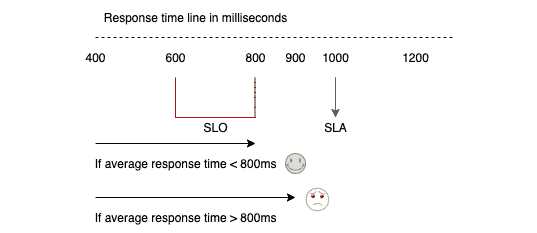
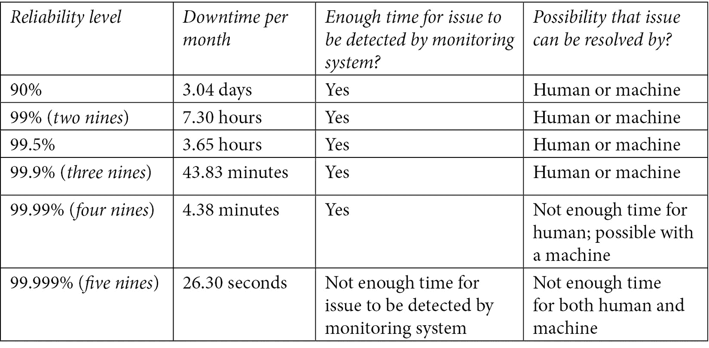
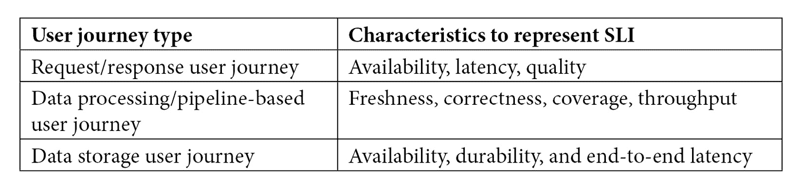
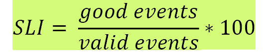
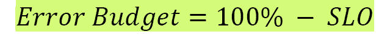
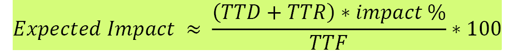
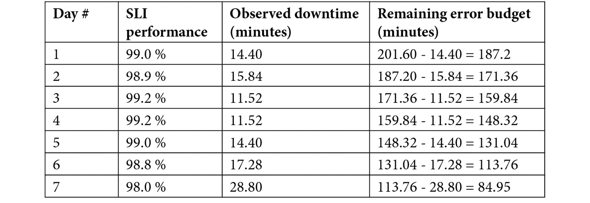
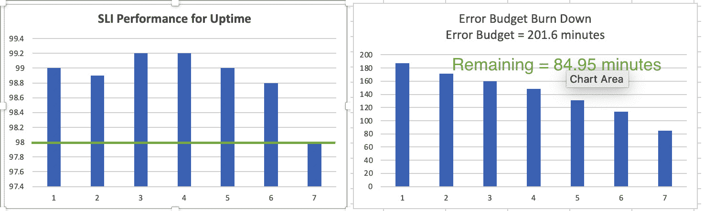
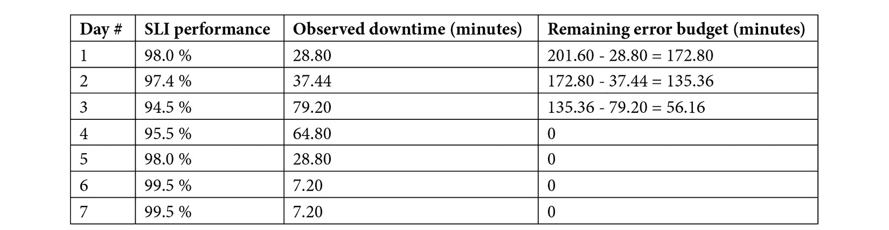
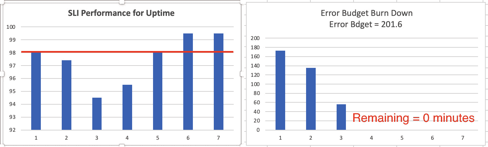

# *第二章*：SRE 技术实践——深入解析

**可靠性**是服务或系统最关键的特性，应该与业务目标对齐。这种对齐需要不断追踪，也就是说，对齐情况需要通过度量来跟踪。**站点可靠性工程**（**SRE**）规定了特定的技术工具或实践，帮助衡量定义和跟踪可靠性的特征。这些工具包括**服务级别协议**（**SLA**）、**服务级别目标**（**SLO**）、**服务级别指标**（**SLI**）和**错误预算**。

SLA 代表与客户达成的关于服务可靠性的外部协议。如果违反 SLA（即服务未能满足可靠性期望），应该会有相应的后果，这些后果通常是金钱上的惩罚。为了确保 SLA 不会被违反，重要的是设置阈值。设置这些阈值可以确保在类似或相同事件重复发生之前，及时发现并处理事故，从而避免违反 SLA。这些阈值被称为 SLO。

SLO 是定义系统可靠性的特定数值目标，SLO 是通过 SLI 来衡量的。SLI 是衡量一段时间内提供的服务水平的量化指标。错误预算是基于 SLO（基于 SLI）计算的，实质上是可用性的逆指标，表示服务可能不可靠的量化目标。所有这些工具或技术实践需要协同工作，并且每个工具都依赖于其他工具。SRE 使用这些技术实践来维持创新与系统可靠性之间的平衡，从而实现最终目标——*更快地构建可靠的软件*。

*第一章*，*DevOps、SRE 和 Google 云服务在 CI/CD 中的应用*，介绍了 SRE 的技术实践——SLA、SLO、SLI 和错误预算。本章将深入探讨这些技术实践。在本章中，我们将涵盖以下主要内容：

+   定义 SLA

+   通过 SLO 定义可靠性期望

+   探索 SLI

+   理解错误预算

+   通过自动化消除繁琐工作

+   阐述 SLA、SLO 和错误预算相对于 SLI 的影响

# 定义 SLA

SLA 是对服务用户的承诺，表示服务的可用性和可靠性应达到一定的期望水平。SLA 详细说明了服务的某个性能或期望水平。

## 关键术语

在定义哪些协议可以视为 SLA 时，有一些特定的组成部分。它们使用特定的术语，并将在以下部分中详细说明。

### 服务提供者和服务消费者

代表服务提供方和服务消费者的方根据服务的背景和性质可能会有所不同。对于面向消费者的服务，如视频流媒体或网页浏览，服务消费者指的是使用服务的最终用户，服务提供方指的是提供该服务的组织。另一方面，对于像 **人力资源**（**HR**）规划系统这样的企业级服务，服务消费者指的是使用服务的组织，服务提供方指的是提供该服务的组织。

### 服务性能或期望

消费服务的组织或最终用户会对服务行为有一定的期望，例如 **可用性**（或 **正常运行时间**）、**响应性**、**耐久性** 和 **吞吐量**。

### 协议 —— 隐式或显式

协议或合同可以是隐式或显式的。例如，隐式合同的一个例子是 Google 搜索这样的非商业服务。Google 的目标是为所有用户提供流畅的搜索体验，但并未与最终用户签署明确的协议。如果 Google 未能实现其目标，用户将不会有良好的体验。此类事件的重复发生将影响 Google 的声誉，因为用户可能会选择使用其他搜索引擎。

一个明确合同的例子是像 *Netflix* 这样的商业服务，或像 *Workday* 这样的付费企业级服务。在这种情况下，会有法律协议，规定如果服务期望未能达成，将会有相应后果。常见的后果包括财务影响或服务积分。

这部分介绍了与 SLA 相关的关键术语。下一节将详细讲解明确定义的 SLA 的蓝图。

## 明确定义的 SLA 蓝图

拥有一个明确定义的 SLA 对于其成功至关重要。以下是一些可以作为明确定义的 SLA 蓝图的因素：

+   **涉及相关方**：SLA（服务级别协议）通常由与服务实施无直接关系的人编写，因此可能导致一些难以衡量的承诺。*SLA 应由业务和产品负责人之间设定*。然而，SRE（站点可靠性工程）建议，在设定 SLA 之前，产品负责人应与开发团队和 SRE 团队合作，识别服务能够实现的期望阈值。这可以确保产品负责人与实施团队密切合作，了解从服务的角度来看，什么是可以接受的，什么是不可实现的。

+   **期望需要可衡量**：服务期望，如可用性或可靠性特征，应该以稳定性、响应性和耐久性等方面进行量化和衡量。服务期望应通过配置监控系统并跟踪特定指标来进行监控，并应配置告警系统，在期望被违反时触发告警。

+   **避免歧义**：在定义 SLA 时使用的行业术语有时可能不明确。例如，考虑一个承诺在*X*小时内解决客户发起的事件的 SLA。如果客户或客户提供的详细信息是在事件首次报告后很久才提供的，或者根本没有提供详细信息，则可能服务提供商将无法解决该事件。在这种情况下，SLA 应清楚地说明不符合 SLA 的资格条件，并应排除这类情况。这提供了更清晰的方法。

## SLI 驱动 SLO，进而确定 SLA。

SLA 应关注服务应达到的最低目标水平，以保持客户满意。然而，SLA 严格来说是外部目标，不应作为实施团队的内部目标。

为了确保不违反 SLA，实施团队应具有反映用户对服务期望的目标目标。实施团队的目标目标被用作内部目标，这些目标通常比产品团队潜在设置的外部目标更为严格。内部目标被称为 SLO，并被用作平衡发布速度和系统可靠性的优先信号。这些内部目标需要在特定时间点具体测量和量化。测量应使用反映用户期望的特定指标进行，这些指标被称为 SLI。

总结来说，为了确保服务的可靠性，需要满足以下几个标准：

+   应满足特定条件——由 SLI 表示。

+   特定条件应在特定目标范围内的特定时间段内得以满足——由 SLO 表示。

+   如果达到，客户会感到满意，否则将会有后果——由 SLA 表示。

让我们看一个假设的例子。考虑一个要求用户请求/响应时间在最短时间段内的要求。延迟度量可以用来表示用户的期望。在这种情况下，此场景中的样本 SLA 可以规定，每位客户将在 1,000 毫秒（ms）内得到响应。在这种情况下，此 SLA 的 SLO 必须更为严格，可以设定为 800 ms。

这完成了关于 SLA 的部分。我们看了 SLA 的关键结构，可能影响良好定义的 SLA 的因素，以及它对设定内部目标或 SLO 的影响，使用特定指标或影响客户满意度的 SLI。

# 通过 SLO 定义可靠性期望

服务消费者（用户）需要服务的可靠性，服务的可靠性可以通过多种特征来衡量，如可用性、延迟、时效性、吞吐量、覆盖率等。从用户的角度来看，如果服务符合他们的期望，那么服务就是可靠的。SRE 的一个关键目标是以定量的方式衡量一切。因此，为了进行衡量，需要定量表示用户期望。

SRE 推荐了一种特定的技术实践，叫做 SLO，用于指定一个目标水平（数值），以表示这些期望。每个服务消费者可能有不同的期望。这些期望应该是可衡量的，并且需要在一段时间内量化。SLO 帮助定义一致的用户期望水平，其中衡量的用户期望应当位于目标水平内或位于一个值的范围内。此外，SLO 被称为内部协议，通常比承诺给最终用户的 SLA 更为严格。这确保了在潜在问题出现之前得到解决，从而避免了重复发生时违反 SLA 的情况。

SLO 是推动业务决策的关键，它提供了一种可量化的方式来平衡服务功能的发布节奏与服务可靠性之间的关系。这个重点将在接下来的小节中讨论。

## SLO 驱动业务决策

收入增长的需求使企业不断面临压力，要求增加新功能并吸引新用户。因此，产品经理通常会向开发团队下达这些新功能的需求。开发团队构建这些需求并交给运维团队以稳定服务。开发团队继续专注于为服务添加新功能，而不是稳定现有功能。运维团队往往会过载，因为他们不仅要处理现有服务的可靠性问题，还要推出新功能。所以，最重要的问题是：*如果可靠性是系统的一个功能，那么你如何在发布其他功能的同时平衡可靠性？*

SLO（服务水平目标）是如何在可靠性和发布速度之间保持平衡的答案。SLO 使我们能够为可靠的服务定义目标水平。这些目标水平应该由组织内的所有利益相关者共同决定，包括工程团队（开发和运维）以及产品团队。达成一致的目标水平应当反映用户在使用服务时的体验。这使得监控系统能够在用户提出投诉之前识别现有问题。SLO 应该更多地作为优先级信号来处理，而不是运营问题。

SLO 应该作为决策的主要驱动力。SLO 代表了所有可靠性对话的通用语言，它基于实际指标。这将使企业能够决定何时发布新功能，何时继续专注于现有服务的可靠性。它还将使运营团队拥有一套简化的目标，防止为运行服务而采取临时行动，最终避免**操作过载**。

操作过载是一个描述持续的维护任务的术语，这些任务保持系统和服务在最佳性能下运行。如果一个团队不断被操作负载打断，无法向其关键优先事项推进，那么该团队就处于操作过载状态。

团队处于操作过载状态的主要原因是对服务应支持的可靠性水平缺乏共识。这种共识的缺乏可以从开发团队专注于为服务添加新功能，而非稳定现有功能中看出。

SLO 必须得到执行团队的强力支持。如果未达到 SLO 目标，应有充分的文档记录后果，优先将工程工作集中于稳定服务的可靠性，而不是开发或发布新功能。SLO 是消除组织壁垒的关键，并创建共享责任感和所有权感。SLO 驱动着激励机制，能够自然而然地激发开发者开始关注服务的可靠性，运营者开始关注尽快推出新功能。设置 SLO 的推荐指南将在接下来的小节中详细介绍。

## 设置 SLOs – 指南

确定服务正确的 SLOs 的过程非常复杂。有多个方面或指导方针需要考虑。每个方面对设置或定义服务的 SLO 至关重要。

### 幸福测试

SLO 目标总是由可量化和可衡量的用户期望驱动，这些期望称为 SLI。**幸福测试**是设置服务 SLO 目标的一个良好起点。根据此测试，服务应具有满足用户可用性和可靠性期望的目标 SLO，正如以下所示：

+   如果服务满足目标 SLO，则用户会感到高兴。

+   如果服务未能达到目标 SLO，则用户会感到悲伤。

平均响应时间的目标 SLO 定义为 600 到 800 毫秒之间的范围。如果平均响应时间小于 800 毫秒，则服务满足目标 SLO，用户会感到高兴。如果平均响应时间大于 800 毫秒（即使它低于 SLA 规定的限制），则服务未能达到目标 SLO，用户会感到悲伤。以下图示说明了一个例子，其中关于请求的平均响应时间的 SLA 设置为 1,000 毫秒：

图 2.1 – 基于目标 SLO 的用户满意与不满意对比

### 100%的可靠性是错误的目标

可靠性是服务最重要的特性，它反映了用户的满意度。然而，将 100%设定为 SLO（服务级目标）或可靠性目标并不是一个现实且合理的目标，原因如下：

+   **无法改善或添加新功能到服务**：维持客户满意度是一项棘手的任务。客户总是期待新功能集的出现，但同时也希望现有服务的稳定性不受影响。在运行中的服务上添加新功能可能会引入一定的风险或不可靠性。如果服务的 SLO 目标设定为 100%，这意味着服务始终可靠，停机时间为零。因此，服务无法容忍任何停机风险，并且本质上不能向服务中添加新功能。如果无法向服务添加新功能，用户会感到不满，并转向提供类似服务且功能更多的竞争对手。

+   **在技术上不可行**：运行一个服务包括多个组件和依赖关系。其中一些是内部的，而一些是外部的。尽管这些组件可以通过冗余设计来实现高可用性，但这些依赖关系带来的复杂性可能会导致潜在的停机。此外，外部组件也会影响服务的可用性——例如，如果移动网络提供商在特定位置有死区，那么移动用户无法访问该服务。

+   **呈指数增长的费用**：每增加九个可靠性级别，成本就增加 10 倍。让一个可靠的系统变得更加可靠是非常昂贵的。选择足够可靠才是更明智的选择。

### 理解可靠性目标及其影响

由于 100%可靠性是错误的目标，因此寻找一个最佳的可靠性目标是很重要的，这个目标可以确保*服务对用户足够可靠*，同时也能提供更新或添加新功能的机会。

另一个观察服务可靠性目标的角度是服务能够容忍的不可靠性程度。服务的不可靠性也被称为**停机时间**。

我们来考虑一些可靠性目标，如下所示：

+   在 30 天的时间段内，99.9%的可靠性目标（也称为三九可靠性）将导致最大可能的停机时间为 42 分钟。这段时间足够监控系统检测到问题，也足够让人工介入并可能缓解或解决问题。

+   在 30 天的时间段内，99.99%的可靠性目标（也称为四九可靠性）将导致最大可能的停机时间为 4.2 分钟。这段时间足够让监控系统检测到问题，但不够让人工介入，不过可能足够让系统自行修复完全的故障。

+   99.999%（即五个九的可靠性）在 30 天内的可靠性目标意味着最大停机时间为 24 秒。这种极短的时间不足以检测问题，甚至无法尝试自我修复。

下表总结了基于 30 天内可靠性目标，检测问题的可能性以及自愈的可能性：

总结来说，可靠性目标应该设定为一个现实的水平，在该水平下问题可以被检测并解决。推荐使用自动化的自愈过程，而不是人工干预——例如，在现有的可用区（**AZ**）发生故障时，将流量重定向到新的**可用区**。

设置过低的可靠性目标意味着问题可能频繁发生，导致长时间的停机，客户将经常受到影响。将可靠性目标设置得过高，比如 99.999% 或甚至 100%，意味着系统几乎无法失败，这使得难以向服务或应用程序添加新特性。

### 设置 SLO 是一个迭代过程。

可靠性是服务最重要的特性，设置 SLO 可以让监控系统捕获服务的表现。在首次设置 SLO 时，可以基于过去的表现设定 SLO，假设用户一开始是满意的。这些 SLO 的 SLI 基于现有的监控系统，并被视为必须达到的初始基线。这类 SLO 被称为**可实现的 SLO**，任何低于初始基线的偏差应当引导工程工作集中在恢复可靠性到初始基线。

如何开始设置可实现的 SLO

用于设置可实现 SLO 的指标可以从负载均衡器获取，或者从日志中反向填充。这两种方法都能提供对历史性能的洞察。

如果在没有历史数据的情况下需要设置 SLO，或者历史数据无法准确反映用户期望，建议设置一个可实现的目标，然后根据用户期望和业务需求精细化目标。这类 SLO 被称为**期望的 SLO**。监控系统随后将使用这些指标来跟踪这些 SLO。

一旦设定了可实现或期望的 SLO，服务可能会引入新特性，但服务不可靠的概率也会增加。这可能导致即便满足了 SLO，客户依然不满意。这表明监控指标需要重新审视。SLO 需要进行迭代设置并定期重新评估。这些指标在最初设置时可能有效，但现在可能不再适用。

以下是一些可能需要重新评估 SLO 的情况：

+   新特性在指标计算中未被考虑。

+   服务的使用已从桌面扩展到移动设备。

+   服务的使用现已扩展到多个地区。

    SLO 应该多久回顾或重新评估一次？

    建议每 6 至 12 个月回顾或重新评估 SLO，以确保已定义的 SLO 继续与业务变化和用户期望保持一致。

除了定期回顾 SLO 外，当预期流量激增时，还可以使用不同的 SLO——更精确地说，是更严格的 SLO。例如，在假日购物期间，许多企业预期流量会显著激增，在这种情况下，企业可以制定一个临时策略，将 SLO 从 99.9% 收紧到 99.99%。这意味着系统可靠性被优先考虑，而不是急于发布新功能。当正常流量恢复时，SLO 目标将恢复到原始值（在本例中为 99.9%）。

这一部分完成了关于 SLO 的讨论，深入探讨了可靠性的需求、设置可靠性目标以及 SLO 如何通过 SLIs 推动业务决策。下一小节介绍了为什么 SLO 需要 SLIs，也为深入探讨 SLIs 做了铺垫。

### SLO 需要 SLI

SLO 是定义系统可靠性的具体数值目标。*SLO 也是一种优先级信号*，用来平衡创新和可靠性之间的关系。SLO 还帮助区分快乐用户和不满用户。但引人深思的问题是：*我们如何衡量 SLO*？

SLO 通过 SLI 来衡量。SLI 定义为可量化的服务可靠性指标，具体显示服务在特定时刻的表现。服务消费者对服务有一定的期望，SLI 直接与这些期望挂钩。可量化的 SLI 示例包括 **延迟**、**吞吐量**、**新鲜度** 和 **正确性**。SLI 以有效事件中的良好事件百分比表示。SLO 是在一段时间内汇总的 SLI 目标。

我们将在下一节中深入探讨 SLIs，*探索 SLIs*。这包括按用户旅程类型对 SLIs 进行分类，并详细说明如何衡量 SLIs。

# 探索 SLIs

SLI 是一种定量衡量服务可靠性某一方面的指标。服务的各个方面直接依赖于潜在的用户旅程，而每个用户旅程可以有不同的 SLI。确定每个用户旅程的 SLI 后，下一步关键是确定如何衡量 SLI。

本节介绍了如何通过对用户旅程进行分类来识别合适的衡量指标或 SLI、衡量 SLI 的公式以及衡量 SLIs 的方法。

## 分类用户旅程

服务的可靠性是基于用户的视角。如果服务提供多个功能，则每个功能都将涉及一组用户交互或一系列任务。定义为**用户旅程**的服务提供的用户体验的关键任务序列。

使用视频流服务时的一些用户旅程示例如下：

+   在特定类别下浏览标题——例如，*小说*

+   查看用户库中现有的标题

+   购买点播节目或直播流

+   查看直播流

每个用户旅程都可能有不同的期望。这些期望可以从服务响应用户请求的速度、数据处理速度、显示数据的新鲜程度，以及数据存储的持久性等方面变化。

可能存在许多跨多个服务的用户旅程。为简单起见，用户旅程可以分为两个流行类别，如下所示：

+   **请求**/**响应** 用户旅程

+   **数据处理**/**流水线**-基于用户旅程

每个类别定义了特定的特征。每个特定特征可以代表一种 SLI 类型，用于定义服务的可靠性。这些在以下各节中指定。

### 请求/响应用户旅程

可用性、延迟和质量是请求/响应用户旅程作为 SLI 的具体方面或特征，需要进行评估。

#### 可用性

**可用性** 定义为成功服务有效请求的比例。服务的可用性对满足用户期望至关重要。

要将可用性 SLI 定义转换为实施，需要做出一个关键选择：*如何将服务成功的请求分类*？

要将成功服务的请求分类，可以使用错误代码反映用户对服务的体验——例如，搜索不存在的视频标题不应导致`500`系列错误代码。然而，无法执行搜索以检查视频标题是否存在，应导致`500`系列错误代码。

#### 延迟

**延迟** 定义为在阈值以下提供有效请求的比例。在服务用户交互请求时，及时响应是可靠性的重要指标。

对于给定请求的延迟是在计时器启动和停止之间的时间差。要将延迟 SLI 定义转换为实施，需要做出一个关键选择：*如何确定将响应分类为足够快*？

要确定将响应分类为足够快的阈值，首先要识别不同类别的用户交互，并相应地设定阈值。有三种方式来对用户交互进行分桶，具体如下：

+   **交互式**——指用户在点击元素后等待系统响应的交互。也可称为**读取**，典型的阈值为 1,000 毫秒。

+   **写入**——指对底层服务进行更改的用户交互。典型的阈值为 1,500 毫秒。

+   **后台**——指用户的异步交互。典型的阈值为 5,000 毫秒。

#### 质量

**质量**被定义为无服务降级地提供的有效请求的比例。这是一个重要的指标，用于判断当服务的依赖不可用时，服务如何优雅地失败。

要将质量 SLI 转换为实现，必须做出一个关键选择：*如何判断响应是否因质量下降而被服务*？要对质量下降的响应进行分类，考虑一个拥有多个后端服务器的分布式系统。如果传入的请求由所有后端服务提供，那么请求将不受服务降级的影响。然而，如果传入的请求仅由所有后端服务器中的一个处理，则表示响应质量下降。

如果请求在服务降级的情况下处理，则应将响应标记为降级，或者应使用计数器增加降级响应的计数。因此，质量 SLI 可以表示为 **坏事件** 与 **总事件** 的比率，而不是 **好事件** 与 **总事件** 的比率。

如何将请求分类为有效的

要将请求分类为有效的，可以使用不同的方法。一个方法是使用 `400` 错误作为客户端错误，在衡量服务可靠性时应被丢弃。`500` 错误是服务器端错误，应从服务可靠性角度视为失败。

### 基于数据处理/管道的用户旅程

新鲜度、正确性、覆盖率和吞吐量是 SLIs 需要评估的特定方面或特征，作为数据处理/管道基础的用户旅程的一部分。这同样适用于基于批处理的作业。

#### 新鲜度

**新鲜度**被定义为比某个阈值更近期更新的有效数据的比例。新鲜度是处理一批数据时可靠性的一个重要指标，因为随着时间的推移，输出可能变得不再相关。主要是因为新的输入数据会被生成，如果数据没有定期处理或通过小的增量持续重建处理，那么系统输出将无法有效反映新的输入。

要将新鲜度 SLI 转换为实现，关键的选择是：*何时开始和停止计时器来衡量数据的新鲜度*？为了将已处理的数据分类为有效的 SLI 计算，必须考虑正确的输入数据来源或正确的数据处理管道任务。例如，若要计算天气流内容的新鲜度，则无法考虑来自体育流管道的数据。这种级别的决策可以通过实现代码和规则处理系统来完成，从而映射适当的输入源。

为了确定何时开始和结束计时以衡量数据的新鲜度，生成和处理数据时包含时间戳是非常重要的。在批处理系统的情况下，如果下一批数据尚未处理和生成，则数据被视为新鲜。换句话说，新鲜度是自上次批处理系统完成以来经过的时间。

在增量流式系统中，"新鲜度"指的是已完全处理的最新记录的年龄。提供过时的数据是常见的质量下降方式。将过时的数据作为质量下降进行衡量是一种有效的策略。如果没有用户访问过时数据，则不会错过任何关于数据新鲜度的期望。为了实现这一点，一个选择是与生成数据一起包含时间戳。这允许服务基础设施检查时间戳，并准确判断数据的新鲜度。

### 正确性

**正确性**被定义为生成正确输出的有效数据的比例。它是可靠性的一个重要指标，其中处理一批数据将得到正确的输出。将正确性 SLI 转换为其实现时，一个关键的选择是：*如何确定输出记录是否正确*？

要判断输出记录是否正确，常见的策略是使用黄金输入数据，也称为一组始终产生相同输出的输入数据。通过这种方式，生成的输出可以与黄金输入数据的预期输出进行比较。

强烈建议采用主动测试实践——包括手动和自动化测试——来判断正确性。

#### 覆盖率

**覆盖率**被定义为成功处理的有效数据的比例。它是可靠性的一个重要指标，其中用户期望数据将被处理，并且随后也可以获得输出结果。

要将覆盖率 SLI 转换为实现，需要做出的选择是：*如何判断特定数据是否已成功处理*？判断特定数据是否成功处理的逻辑应内置于服务中，并且服务应跟踪成功和失败的计数。

挑战出现在本应处理的一组记录被跳过时。可以通过识别应该处理的记录总数来了解未被跳过的记录比例。

#### 吞吐量

**吞吐量**定义为数据处理速率高于某个阈值的时间比例。它是数据处理系统可靠性的重要指标，准确代表了用户的满意度，并且在数据流或小批量数据上持续运行。

要将吞吐量 SLI 转换为实施，一个关键选择是：*数据处理的度量单位是什么？* 数据处理最常见的度量单位是**每秒字节数**（**B/s**）。

并不是所有输入集都需要具有相同的吞吐量。一些输入需要更快地处理，因此要求更高的吞吐量，而另一些输入通常会被排队，稍后处理。

针对基于数据存储的用户旅程推荐的 SLI

数据处理系统还可以进一步分类为仅负责存储数据的系统。因此，**数据存储**用户旅程是另一种可能的用户旅程分类，在这种分类中，可用性、耐久性和端到端延迟是其他推荐的 SLI。可用性指的是可以按需从存储系统访问的数据。**耐久性**指的是写入的记录在需要时能够成功地从存储系统读取的比例。**端到端延迟**指的是处理数据请求的时间，从数据摄取到完成。

下表总结了具体特征，以表示不同类型的 SLI，按用户旅程类型分组：

鉴于可以选择的 SLI 种类繁多，Google 根据系统类型推荐以下特定的 SLI：

+   **面向用户的服务系统**：可用性（*是否能够响应请求？*）、延迟（*响应需要多长时间？*）和吞吐量（*能够处理多少请求？*）

+   **存储系统**：延迟（*读取或写入数据需要多长时间？*）、可用性（*数据可以按需访问吗？*）和耐久性（*数据在需要时是否仍然可用？*）

+   **大数据系统**：吞吐量（*可以处理多少数据？*）和端到端延迟（*数据从摄取到完成需要多长时间？*）

鉴于我们已经看到了影响确定特定用户旅程 SLI 的各种因素，接下来的小节将重点讨论测量 SLI 的方法论和来源。

## SLI 方程

一个 SLI 方程被定义为良好事件的有效比例，如下所示：

该方程具有以下属性：

+   SLI 以百分比表示，范围在 0%到 100%之间。 100%表示一切正常，0%表示一切故障。

+   SLI 始终转化为百分比可靠性、SLO 和错误预算，并且也是**警报逻辑**的关键输入。

+   SLI 允许我们构建通用工具来反映服务或系统的可靠性。

+   有效事件的确定方法如下：对于与**HTTP Secure**（**HTTPS**）相关的请求，有效事件是基于请求参数或响应处理程序来确定的。 请求参数可以包括主机名或请求路径。 对于与数据处理系统相关的请求，有效事件是指选择特定输入，范围限定为数据的一个子集。

这完成了我们对 SLI 方程及其相关属性的总结。 下一小节详细介绍了衡量 SLI 的各种流行来源。

## 衡量 SLI 的来源

识别服务的潜在用户旅程是识别 SLI 的第一步。 一旦确定了要衡量的 SLI，下一步是衡量 SLI，以便可以设置相应的警报。 这个过程中的关键问题是：*如何衡量以及在哪里衡量*？

有五个流行的来源或方式来衡量 SLI，具体如下：

+   服务器端日志

+   应用服务器

+   前端基础设施

+   合成客户端

+   遥测

### 服务器端日志

以下是如何利用服务器端日志中的信息来衡量 SLI 的细节：

+   日志捕获多个请求-响应交互，跨越一个长时间运行的会话。 存储的日志提供了获取服务历史性能洞察的选项。

+   如果开始设置 SLO（*SLO 需要 SLI*）以进行服务，日志数据可以用来分析历史事件、重建用户交互并追溯填充 SLI 信息。

+   可以将复杂的逻辑添加到代码本身，其中良好的事件被清楚地标识，并且信息会被记录到日志中。 (*这需要大量的工程工作。*)

以下是使用服务器端日志衡量 SLI 的局限性详情：

+   如果 SLI 需要触发紧急响应，事件发生和事件实际被衡量之间的时间应最小化。 考虑到日志需要被摄取和处理，从日志中捕获 SLI 会增加显著的延迟。

+   基于日志的 SLI 无法捕获未到达应用服务器的请求。

### 应用服务器

以下是如何利用应用服务器中的信息来衡量 SLI 的细节：

+   在应用服务器上捕获的指标被称为应用层指标。 这些指标有助于诊断与应用相关的问题。

+   应用指标可以捕获单个请求的性能，而不会增加衡量延迟。 此外，这些事件可以随时间汇总。

以下是使用应用服务器衡量 SLI 的局限性详情：

+   应用程序指标无法捕捉复杂的多请求用户旅程。

+   基于应用的 SLI 无法捕捉到未到达应用服务器的请求。

    什么是复杂的多请求用户旅程？

    一个复杂的多请求用户旅程将包括一系列请求，这是用户消费服务的核心部分，例如搜索产品、将产品添加到购物车并完成购买。应用程序指标无法捕捉用户旅程的度量，但可以捕捉与单个步骤相关的度量。

### 前端基础设施

以下是如何使用前端基础设施的信息来测量 SLI 的详细信息：

+   前端基础设施是指负载均衡器。这可以是基于供应商的负载均衡器（例如*F5*）或基于云服务提供商的负载均衡器（例如*Google Cloud Load Balancer*）。

+   大多数分布式应用程序使用负载均衡器，这是用户请求发送到实际应用程序之前的第一个交互点。这使得负载均衡器成为最接近用户的点，且较少的请求会被遗漏度量。

+   云服务提供商通常会为负载均衡器接收到的请求捕捉多个度量，这些信息可能是现成可用的，包括历史数据。如果由于某种原因未配置数据捕捉，则可以轻松配置。无论如何，这些信息将是可用的，无需投入工程精力（*与从应用日志捕捉度量相比*）。

+   负载均衡器捕捉到的度量与未到达应用服务器的请求相关。

以下是使用前端基础设施测量 SLI 的限制的详细信息：

+   负载均衡器可以是**有状态的**或**无状态的**。如果是无状态的，那么负载均衡器无法追踪用户会话，因此无法用于捕捉与用户交互相关的度量。

+   鉴于负载均衡器通常充当**交通警察**，将用户请求路由到能够处理请求的应用服务器，负载均衡器本身并不控制由应用程序返回的响应数据。相反，负载均衡器依赖于应用程序在响应信封上准确地设置元数据。

+   依赖应用程序在响应信封上设置正确的元数据是一个利益冲突，因为生成度量的正是这个应用程序。

### 合成客户端

以下是如何使用合成客户端的信息来测量 SLI 的详细信息：

+   合成客户端提供**合成监控**，这是一种通过模拟或仿真基于一组已记录的事务的用户交互来监控应用程序的监控技术。

+   合成客户端可以模拟构成用户旅程的用户交互，这些交互发生在基础设施之外，因此可以验证响应。

以下是使用合成客户端测量 SLI 的限制的详细信息：

+   合成客户端模拟用户的行为，因此它是一种近似值。

+   合成客户端需要复杂的集成测试，覆盖多个边缘情况，因此需要大量的工程工作。

+   如果出现新的用户行为模式，合成客户端需要维护以添加新的用户模拟，而这些行为模式之前并未考虑到。

### 遥测

遥测是指来自多个数据源的远程监控，不仅限于捕获与应用程序健康相关的指标，还可以扩展到捕获安全分析，如可疑的用户活动、不寻常的数据库活动等。以下是遥测信息如何用于衡量 SLI 的细节：

+   为客户端添加遥测指标有助于衡量第三方集成系统的可靠性，例如**内容分发网络**（**CDN**）。

+   **OpenTelemetry** 是最流行的仪表机制，用于捕获跟踪和指标。它取代了**OpenTracing** 和 **OpenCensus**，这两个项目分别专注于捕获跟踪和指标。

    什么是 OpenTelemetry？

    **OpenTelemetry** 是一种统一的服务仪表标准。它提供了一套**应用程序编程接口**（**API**）/库，具有供应商中立性，并标准化了如何收集和发送数据到兼容的后端。OpenTelemetry 是一个开源项目，属于**云原生计算基金会**（**CNCF**）。

以下是使用遥测来衡量 SLI 的限制细节：

+   从不同来源获取指标会增加延迟，并且会遇到捕获处理日志时所遇到的相同问题，因此这不适合用于触发紧急响应。

+   如果遥测是内部实现的，它需要大量的工程工作。然而，也有供应商提供相同的能力，但存在供应商锁定的风险。

以上完成了衡量 SLI 的五个不同来源的详细说明。由于每个来源都有其自身的限制，因此没有最佳来源来衡量 SLI。在大多数情况下，始终推荐使用多个来源的组合。例如，如果一个组织刚开始进行 SRE 实践，可以使用服务器端日志来回填 SLI，并使用前端基础设施直接从负载均衡器获取指标，作为起步的好方法。稍后可以扩展到从应用服务器捕获指标，但考虑到它不支持复杂的多请求用户旅程，组织可以根据需求转向使用遥测或合成客户端。下一小节总结了 Google 推荐的几条 SLI 最佳实践。

## SLI 最佳实践（Google 推荐）

对于希望开始 SRE 之旅的组织来说，这是一项繁琐的任务，旅程的关键部分是识别、定义和衡量 SLI。以下是 Google 推荐的最佳实践：

+   **优先考虑用户旅程**：选择反映服务所提供特性和用户对这些特性亲和力的用户旅程。

+   **优先考虑选定列表中的用户旅程**：购买或观看流媒体事件的用户旅程比给视频评分更为重要。

+   **限制 SLI 的数量**：每个用户旅程保持三到五个 SLI。更多的 SLI 会使运维人员管理起来更复杂。

+   **通过前端基础设施收集数据**：在负载均衡器级别收集数据更接近用户的体验，且需要的工程工作较少。

+   **汇总相似的 SLI**：在一段时间内收集数据。将捕获的度量信息转换为比率、平均值或百分位。

+   **保持简单**：复杂的度量需要大量工程工作，但也可能增加响应时间。如果响应时间增加，那么该度量将不适用于紧急情况。

这完成了对 SLI 的全面深入分析，重点是分类用户旅程、识别影响用户旅程的具体因素、各种度量来源以及定义 SLI 的推荐最佳实践。总结来说，选择 SLI 有四个关键步骤，列举如下：

1.  根据合适的用户旅程选择一个 SLI 规范。

1.  将规范细化为详细的 SLI 实现。

1.  跟踪用户旅程并识别实现差距。

1.  根据业务需求设定有远见的 SLO 目标。

接下来的章节聚焦于错误预算，它们用于通过保持发布速度的平衡来实现可靠性。

# 理解错误预算

一旦基于特定用户旅程的 SLI 设定了 SLO，这些 SLO 通过量化用户的期望来定义系统的可用性和可靠性，就需要理解服务允许的不可靠程度。这个可接受的不可靠性或不可用性水平被称为**错误预算**。

服务的不可用或不可靠可能由多种原因造成，如计划维护、硬件故障、网络故障、错误修复和在引入新特性时出现的新问题。

错误预算为可追踪的不可用量设定了量化目标。它们在开发和运维团队之间创造了共同的激励。这一目标用于平衡推动新特性（*从而为服务添加创新*）的冲动与确保服务可靠性之间的关系。

错误预算基本上是可用性的反面，它告诉我们服务允许的不可靠程度。如果 SLO 规定在一个季度内 99.9%的请求应成功，那么错误预算允许 0.1%的请求失败。这种不可用性可能是由于产品团队的不当推送、计划维护、硬件故障和其他问题引起的：

这是一个示例。如果 SLO 规定在一个季度内 99.9%的请求应成功，那么 0.1%就是错误预算。

让我们计算错误预算，如下所示：

*如果 SLO = 99.9%，则错误预算 = 0.1% = 0.001*

*每月允许的停机时间 = 0.001 * 30 天/月 * 24 小时/天 * 60 分钟/小时 = 43.2 分钟/月*

这引入了错误预算的概念。下一小节将介绍错误预算政策的概念，并详细说明高层支持在遵守错误预算政策方面的重要性。

## 错误预算政策和高层支持的必要性

如果可靠性是系统最重要的特性，那么**错误预算政策**代表了企业如何在可靠性与其他特性之间进行平衡。这样的政策有助于企业在服务可靠性面临风险时采取适当的行动。定义错误预算政策的关键是实际确定服务的 SLO。如果服务未达到 SLO 目标，意味着错误预算政策被违反，那么就应该有相应的后果。这些后果应通过高层支持来执行。运营团队应当影响开发团队实践的结果，如果服务接近耗尽错误预算或已超出错误预算，应暂停发布新功能。

错误预算可以被看作是计划在给定时间段内支出的资金。这些资金可以用于发布新特性、推出软件更新或管理事件。错误预算本质上是可用性的逆向概念，它告诉我们服务可以容忍的不可用程度。如果你的 SLO 规定在某个季度 99.9%的请求应该是成功的，那么你的错误预算允许 0.1%的请求失败。这种不可用性可能是由于产品团队的错误推送、计划中的维护、硬件故障等原因造成的。下一小节列出了有效错误预算政策的特征。

### 有效错误预算政策的特征

一个错误预算政策应具有以下特征：

+   服务概述

+   预期目标列表

+   非目标列表；也称为被特别排除的潜在需求

+   根据服务是否超出或未达 SLO，列出*应该做的*和*不应该做的*事项

+   当服务未能达到其 SLO 时的后果列表

+   详细的停机政策，定义何时称为事件以及需要跟进以确保该事件不再发生

+   明确的升级政策，识别在出现分歧时的决策者

前述特性列表清楚地指出，拥有良好的 SLO 文档对于定义有效的错误预算政策是极其必要的。这个问题将在下一小节讨论。

### 错误预算需要有良好的 SLO 文档

定义错误预算的关键在于实际决定服务的 SLO（服务级别目标）。SLO 清晰地区分了可靠服务和不可靠服务，从而扩展到区分高兴的用户和不高兴的用户。SLO 应该被清晰地定义，不应有任何模糊性，并且应该得到产品负责人、开发人员、SRE 和高管的一致同意。

除了实施 SLO 并配置监控系统来对 SLO 进行警报外，以下是推荐的 SLO 元数据文档特性：

+   SLO 的需求以及制定具体 SLO 目标的思考过程

+   SLO 的所有者列表

+   SLO 未达成时的影响

+   与 SLO 相关联的 SLIs（服务级别指标）

+   包括或排除在计算中的特定事件

+   SLO 文档的版本控制（*这可以洞察 SLO 在一段时间内精炼过程中的变更原因*）

下一小节将讨论设置错误预算的多种选项。

### 设置错误预算

错误预算可以被视为计划在给定时间段内使用的资金。这些资金可以用来发布新功能、推出软件更新或处理事件。但这也引发了几个问题，例如：

+   花费错误预算的最佳时机是什么？是月初还是月末？

+   如果错误预算用尽且发生了紧急情况，会怎样？

+   如果错误预算没有用尽，会怎样？可以转移到下一个周期吗？

可以使用不同的策略来确定在一个时间周期内花费错误预算的最佳时机。假设时间周期是 28 天。以下是三种潜在选项：

+   **选项 #1** 是在周期开始时（28 天的开始）花费部分错误预算来推动新功能或更新，并将剩余的错误预算用于可能的可靠性维护，以应对潜在事件。

+   **选项 #2** 是在经过一半时间周期（比如 14 天）后，使用错误预算来推动新功能或更新，因为这样可以了解在前半段时间里，为了维持系统可靠性所使用的错误预算。

+   **选项 #3** 是在时间周期的后半段，使用剩余的错误预算来推动新功能或更新，以确保在此之前，系统的可靠性得到关注。

任何上述选项或三者的组合都可以用于定义一个动态发布过程，具体取决于开发人员和运营团队基于当前业务需求和过去表现达成的共识。可以通过根据错误预算的耗尽速率设置警报来实现动态发布过程。

如果服务的错误预算用尽，但开发团队需要作为例外情况推动新功能，SRE 将使用 **银弹** 来处理这个例外。

将银弹视为可给予运营团队的令牌，用以在超过错误预算的情况下允许发布新功能。这些令牌由高级利益相关者持有，开发团队需要向利益相关者陈述使用银弹的必要性。一定数量的银弹令牌交给利益相关者，并且这些令牌不可以转移到下一个时间周期。除了使用银弹之外，SRE 还建议使用备用资金，即在处理意外事件时提供一定量的错误预算。

错误预算不能转移到下一个时间周期。因此，实际上，目标是要在当前时间周期结束之前花完错误预算。不断耗尽错误预算和重复使用银弹应当引起审查，工程团队应当投入精力通过改进服务代码和添加集成测试来提升服务的可靠性。

动态发布节奏、错误预算耗尽率、银弹策略和备用资金等方法是 SRE 提出的先进技术，用于管理错误预算。这完成了关于有效错误预算策略定义特征的小节，列出了文档完善的 SLO（服务水平目标）的特征，并讨论了设置错误预算的选项。接下来的小节详细介绍了确保服务保持可靠并避免耗尽错误预算的关键因素。

## 提高服务可靠性

当服务耗尽其错误预算或反复接近耗尽时，工程团队应将重点放在提高服务可靠性上。这引出了下一个显而易见的问题：*工程团队如何才能提高服务的可靠性，以满足用户的期望？*

为了深入了解这一点，必须考虑以下关键因素，这些因素对确定服务潜在影响至关重要：

+   **检测时间**（**TTD**）—定义为从问题首次发生到问题首次被观察或报告的时间差。例如：如果一个问题发生在上午 10 点，但在上午 10:30 被报告或观察，那么此情况下的 TTD 为 30 分钟。

+   **解决时间**（**TTR**）—定义为从问题首次观察或报告到问题解决的时间差。例如：如果一个问题在上午 10:30 被首次观察或报告，但在上午 10:45 解决，那么此情况下的 TTR 为 15 分钟。

+   **故障时间**（**TTF**）—定义为服务预期发生故障的频率。TTF 也被称为**故障间隔时间**（**TBF**）。

+   **影响百分比**（**Impact %**）—表示受影响用户或受影响功能区域的百分比。

+   预期的影响与以下公式成正比：

通过实施以下选项可以提高可靠性：

+   缩短检测时间：减少 TTD

+   减少修复时间：减少 TTR

+   减少影响百分比：减少受影响的用户/功能区域

+   减少频率：增加 TTF

+   操作性改进

接下来，让我们详细讨论每个选项。

### 减少检测时间（TTD）

可以通过以下方法减少 TTD：

+   添加自动化警报，提醒用户，而不是让用户通过注意到度量仪表板上的异常来手动检测问题。

+   添加监控以衡量 SLO 合规性。这有助于了解错误预算消耗的速度，或服务是否在目标 SLO 内运行。

### 减少修复时间（TTR）

TTR 可以通过以下方法减少：

+   制定一本操作手册，简化服务器调试日志的解析和汇总。这将帮助现场工程师快速解决当前的问题。如果检测到新模式，应更新操作手册。

+   自动化手动任务，例如将磁盘空间增加到当前磁盘空间的可接受百分比，清理区域或重新路由流量。

+   收集特定场景的相关信息，这将为值班团队节省时间，并帮助他们在调查时抢占先机。

### 减少影响百分比

影响百分比可以通过以下方法减少：

+   通过基于百分比的发布将新功能推送给有限数量的用户，并在规定的时间内逐步增加。这会将影响百分比限制在特定的用户组。发布百分比可以从 0.1%的用户逐步增加到 1%，然后到 10%，最终达到 100%。通过这种方式，发布是分阶段进行的。

+   在故障发生时，使服务以降级模式运行，例如切换到只允许读取操作而不允许写入，从而减少影响。

### 减少频率

可以通过以下方法减少频率：

+   在多个区域或区域内运行服务或应用程序。将流量从故障的区域或区域引导到另一个正常工作的区域或区域。

+   创建一个自愈的自动化脚本，减少影响和频率，但也报告问题，以便以后解决。

### 操作性改进

以下是从操作角度来看，确保服务可靠性的一些选项：

+   通过增加冗余来提高可用性，从而消除单点故障。

+   确定失败之间的共同类别，这可以指向特定区域或一组客户，这些客户消耗了大部分的错误预算。

+   标准化基础设施或最小化差异，以便在测试服务与在生产中运行服务时获得相似的结果。

+   使用设计模式，使服务在出现问题时可以回滚。

+   通过跟踪错误预算消耗率来创建警报。

+   使用事后分析（post-mortem）来识别当前的问题，并创建可操作的事项来解决这些问题。

这完成了对需要考虑的潜在因素的深入探讨，以及可实施的可行选项，以确保服务的可靠性，从而不消耗错误预算。下一小节总结了错误预算的部分内容。

## 总结错误预算

错误预算可以通过以下关键要点进行总结：

+   错误预算帮助开发和 SRE 团队平衡发布速度和稳定性。管理层认同 SLO，并给予执行支持。

+   错误预算需要 SLO，而 SLO 需要 SLIs 来监控服务的可靠性。

+   通过计算实际与目标 SLO 之间的差异，来确定是否低于错误预算，如果是的话，可以允许发布新特性。

+   如果没有，工程工作应集中在服务的可靠性上。

+   错误预算政策是一种有效实施错误预算概念的方法。

这完成了关于错误预算的部分，深入探讨了多个方面，包括如何定义有效的错误预算政策、如何设定错误预算、管理层的支持如何帮助使服务更可靠，以及如何有效平衡新特性的发布速度。

# 通过自动化消除重复性工作

**重复性工作**在*第一章*中介绍，*《DevOps、SRE 和 Google Cloud 服务用于 CI/CD》*，并定义为与生产服务相关的工作，其特点是手动、重复、可自动化、战术性、缺乏持久价值，并且随着服务的增长而线性增加。重复性工作常常与管理性工作混淆，但管理性工作指的是包括电子邮件、通勤、报销报告和开会等行政事务。重复性工作既可以是好的，也可以是坏的——这取决于重复性工作的数量。

以下是执行重复性工作的积极方面，但必须在非常短且有限的时间内进行：

+   产生满足感或成就感

+   可以作为一种低压力或低风险的活动

+   可用于培训新员工，尤其是提供他们通过亲自操作系统来学习内部工作原理的机会

然而，过多的重复性工作可能导致以下问题或困扰：

+   **职业停滞**：解决生产问题令人满足，但以重复的手动方式解决相同问题对职业发展没有帮助。这剥夺了 SRE 工程师的学习时间和意图，导致职业停滞。

+   **倦怠和无聊**：过多的重复性工作会导致倦怠和无聊。SRE 工程师每天做同样的任务会感到厌倦。有时，手动任务也可能枯燥且费力，最终导致倦怠。

+   **低特性发布速度**：如果 SRE 团队从事大量重复性工作，他们将会减少用于发布新特性的时间，从而导致特性发布速度变慢，发布频率降低。

+   **错误的优先级**：如果 SRE 团队承担的重复劳动超过了必要的范围，开发团队可能会让 SRE 团队做更多的重复劳动，特别是对于那些开发团队真正需要处理的问题，而不是仅仅消除根本原因。这将导致 SRE 工程师的角色产生混淆。

所有上述问题或挑战可能会导致人员流失，因为 SRE 工程师可能对日常工作不满意，并可能寻求其他地方的更好工作和挑战。SRE 建议将重复劳动限制在一定范围内，SRE 工程师应避免超过 50%的时间用于重复劳动。超过 50%将模糊 SRE 工程师和系统管理员之间的界限。建议 SRE 工程师将剩余的 50%时间用于支持工程团队实现服务可靠性目标。

消除重复劳动使 SRE 工程师能够添加服务功能，以提高服务的可靠性和性能。此外，可以继续关注消除已识别的重复劳动，从而清除任何手动重复工作的积压。SRE 鼓励使用工程概念来消除手动工作。这还允许 SRE 工程师比开发或运维团队更好地扩展和管理服务。

SRE 建议通过自动化消除重复劳动。自动化提供了一致性，并消除了疏忽和错误的发生。自动化帮助比人工更快地执行任务，并且可以按计划进行。自动化还确保了在问题重新发生之前加以预防。自动化通常是通过代码实现的，这也为 SRE 工程师提供了一个使用工程概念来实现所需逻辑的机会。

本节总结了重复劳动的特点、利与弊，以及使用自动化消除重复劳动的优势。接下来的部分将说明基于 SLI 表现，SLA、SLO 和错误预算如何受到影响。

# 说明 SLAs、SLOs 和错误预算相对于 SLI 的影响

本节我们将通过两个实际场景，说明如何基于 SLI 表现来达成或未达成 SLO 目标。SLO 的表现将直接影响 SLA 和错误预算。错误预算的变化将特别决定新功能发布与服务可靠性之间的优先级。为了便于说明，这里采用 7 天作为时间度量（理想情况下，建议使用 28 天的周期）。

## 场景 1 – 引入新服务功能；功能可靠；SLO 达成

以下是该场景的期望：

+   **预期 SLA**—95%

+   **预期 SLO**—98%

+   **测量的 SLI**—服务可用性或正常运行时间

+   **测量时长**—7 天

考虑到服务的预期 SLO 为 98%，以下是如何计算允许的停机时间或错误预算（您可以参考此停机时间计算器：[`availability.sre.xyz`](https://availability.sre.xyz)）：

+   **错误预算** = *100% - SLO = 100% - 98% = 2%*

+   **7 天内允许的停机时间（98%的可用性）** = *3.36 小时 = 3.36 * 60 = 201.6 分钟*

因此，如果 7 天内的总停机时间少于 201.6 分钟，则服务符合 98%的 SLO 合规性，否则服务不符合 SLO 合规性。

现在，让我们说明如何基于 SLI 测量来影响 SLO。假设在服务中引入了新功能（在 7 天期间），且这些功能稳定，问题最小。

下表表示了基于 SLI 表现的可用性 SLI 测量、相应的停机时间以及每天减少的错误预算：

下图表示了基于前述表格中的数值，服务正常运行时间的 SLI 表现（上方）和错误预算消耗率（下方）：

图 2.2 – SLI 表现和错误预算消耗率的说明

这里有一些关键观察点：

+   剩余的错误预算为 84.95 分钟，少于 201.6 分钟。因此，SLO 符合合规性，SLA 也达成。

+   SLO 表现可以根据剩余的错误预算来计算。由于剩余的错误预算为 84.95 分钟，因此 SLO 表现为 99.25%。

+   新功能的引入并没有不均匀或突然地减少错误预算。

这完成了基于 7 天期间 SLI 表现的 SLO 达成情况的详细说明。下一个场景说明了相反的情况，即基于 SLI 表现未能满足 SLO 的情况。

## 场景 2 – 引入新功能；功能不可靠；未达成 SLO

这里是该场景的预期：

+   **预期 SLA**—95%

+   **预期 SLO**—98%

+   **测量 SLI**—服务可用性或正常运行时间

+   **测量时长**—7 天

正如在*场景 1*中计算的，98% SLO 的允许停机时间为 201.6 分钟。因此，如果 7 天内的停机时间超过 201.6 分钟，则 SLO 不符合合规性。

现在，让我们说明如何基于 SLI 测量来影响 SLO。假设在服务中引入了新功能（在 7 天期间），但这些功能不稳定，导致出现重大问题，造成较长的停机时间。

下表表示了基于 SLI 表现的可用性 SLI 测量、相应的停机时间以及每天减少的错误预算：

下图表示了基于前述表格中的数值，服务正常运行时间的 SLI 表现（左侧）和错误预算消耗率（右侧）：

图 2.3 – SLI 表现和错误预算消耗率的说明

这里有一些关键观察点：

+   剩余错误预算 = 第 4 天 0 分钟。因此，SLO 不符合规定。

+   在 7 天期间的总停机时间为 253.44 分钟。

+   对应的 SLO 性能大约为 97.48，低于 98%。

+   由于 SLO 不符合要求，SLA 被违反。这将导致后果。

+   SRE 团队在第 3 天之后不应添加新功能，而应专注于系统可靠性。

这标志着*场景 2*的详细总结结束。我们已经完成了对基于 SLI 性能如何影响 SLA、SLO 和错误预算的说明。这也意味着我们已经到达了本章的结束部分。

# 总结

在本章中，我们详细讨论了关键的 SRE 技术实践：SLA、SLO、SLI、错误预算以及消除工作负担。这包括了一些关键概念，如用于定义清晰 SLA 的因素、提供设置 SLO 的指南、分类用户旅程、详细描述测量 SLI 的来源及其局限性、阐述错误预算、详细说明可以使服务可靠的因素、理解工作负担的后果，以及阐明自动化如何有助于消除工作负担。这些概念使我们能够实现 SRE 的核心原则，即在创新与系统可靠性之间保持平衡，从而实现最终目标：*更快地构建可靠的软件*。

在下一章中，我们将重点介绍跟踪 SRE 技术实践所需的概念：监控、告警和时间序列。这些概念将包括将监控作为反馈循环、监控来源、监控策略、监控类型、告警策略、告警系统的理想特性、时间序列结构、时间序列基数，以及时间序列数据的指标类型。

# 需要记住的要点

以下是一些重要的要点：

+   100% 的可靠性目标是不现实的。

+   基于日志的 SLIs 和获取遥测数据会增加延迟。

+   应用程序指标不适用于复杂的使用旅程。

+   SLO 必须根据与工程和产品团队的讨论来设置。

+   如果没有剩余的错误预算，重点应该放在可靠性上。

+   TTD 是识别问题存在或被报告的时间。

+   TTR 是解决问题所需的时间。

+   为了提高服务的可靠性，减少 TTD、减少 TTR、减少影响百分比并增加 TTF/TBF。

+   SLIs 应该与用户幸福感有可预测的关系，并且应随着时间的推移进行汇总。

+   用户期望与过去的表现密切相关。

+   为 SLIs 和 SLOs 设置值应该是一个迭代过程。

+   管理错误预算的高级技术包括动态发布节奏、设置错误预算耗尽率、备用基金和使用“银弹”。

+   识别那些导致工作负担的重复性任务并进行自动化处理。

# 进一步阅读

有关**谷歌云平台**（**GCP**）在 DevOps 方面的方法，请阅读以下文章：

+   **SRE**: [`landing.google.com/sre/`](https://landing.google.com/sre/)

+   **SRE 基础知识**: [`cloud.google.com/blog/products/gcp/sre-fundamentals-slis-slas-and-slos`](https://cloud.google.com/blog/products/gcp/sre-fundamentals-slis-slas-and-slos)

+   **SRE YouTube 播放列表**: [`www.youtube.com/watch?v=uTEL8Ff1Zvk&list=PLIivdWyY5sqJrKl7D2u-gmis8h9K66qoj`](https://www.youtube.com/watch?v=uTEL8Ff1Zvk&list=PLIivdWyY5sqJrKl7D2u-gmis8h9K66qoj)

# 实践测试

回答以下问题：

1.  以下哪个表示不与生产服务相关的工作？

    a) 琐事

    b) 手动

    c) 开销

    d) 自动化

1.  以下哪个选项表示*与用户的明确或隐含合同，包括达成或未达成 SLO 的后果*？

    a) SLI

    b) SLO

    c) SLA

    d) 错误预算

1.  以下哪种组合表示通常作为请求/响应过程一部分跟踪的指标？

    a) 可用性、延迟和持久性

    b) 延迟、覆盖率、吞吐量和可用性

    c) 覆盖率、正确性和质量

    d) 可用性、延迟和质量

1.  选择一个选项，表示在 SRE 工程师允许花费时间来处理琐事的建议：

    a) 25%-55%

    b) 45%-60%

    c) 50%-75%

    d) 30%-50%

1.  以下哪个选项是最不现实的（首选）服务可靠性目标作为 SLO？

    a) 99.9%

    b) 99.99%

    c) 99.999%

    d) 100%

1.  就最佳实践而言，关于每个用户旅程推荐的 SLI 数量，哪项选项是正确的？

    a) 2 到 3

    b) 无具体限制

    c) 3 到 5

    d) 5 到 7

1.  一个电子商务 Web 应用程序正在通过请求处理客户购买，并将销售交易存储在数据库中。目标是确保预测的销售数据基于最新的销售数据。以下哪些应选择为电子商务应用程序的 SLI（*选择两个*）？

    a) 数据库—可用性。

    b) 数据库—持久性。

    c) 数据库—新鲜度。

    d) Web 应用程序—可用性。

    e) Web 应用程序—持久性。

    f) 数据库和 Web 应用程序应该始终可用。生产环境的应用程序应具备完全的可用性。

1.  以下哪个选项表示系统可用性的精确数值目标？

    a) SLA

    b) SLO

    c) SLI

    d) 错误预算

1.  以下哪个选项表示服务行为的直接测量？

    a) SLA

    b) SLO

    c) SLI

    d) 错误预算

1.  以下哪个是最适合用于填充 SLI 的数据源？

    a) 应用服务器

    b) 前端基础设施

    c) 合成客户端

    d) 以上都不是

# 答案

1.  (c) 开销。

1.  (c) SLA。

1.  (d) 可用性、延迟和质量。

1.  (d) 30%-50%。建议的琐事工作量不应超过 50%。

1.  (d) 100%。

1.  (c) 3 到 5。

1.  (a) 和 (d)：数据库和 Web 应用程序应该保持可用，因为这些是生产应用程序。

1.  (b) SLO。

1.  (c) SLI。

1.  (d) 以上都不是。准确的答案是服务器端日志。
