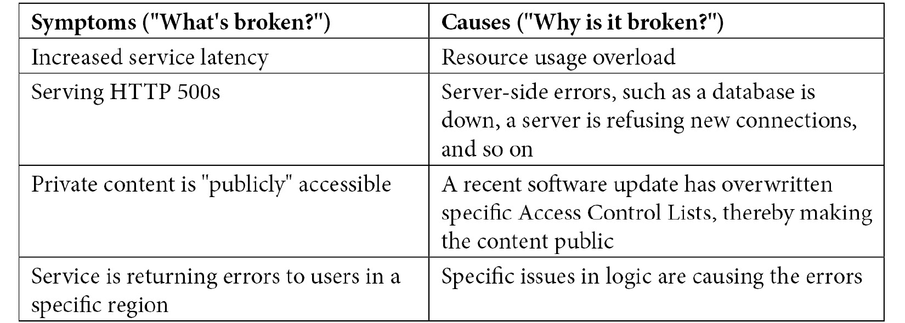
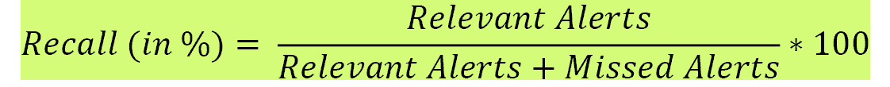
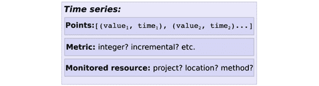
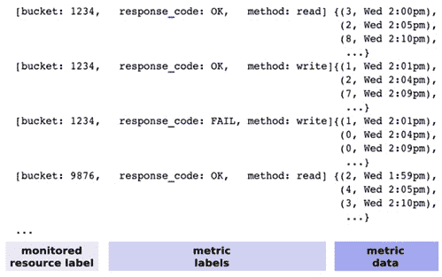

# *第三章*：理解监控和告警以针对可靠性

**可靠性**是服务或系统最关键的特性。**站点可靠性工程**（**SRE**）规定了帮助衡量特性、定义和跟踪可靠性的特定技术工具或实践，如**SLA**、**SLO**、**SLI**和**错误预算**。*第二章*，*SRE 技术实践 – 深入分析*，深入探讨了这些 SRE 技术实践，涵盖多个主题，包括制定明确 SLA 的蓝图、为实现 SLA 而需要 SLO、设定 SLO 的指南、为实现 SLO 而需要 SLI、基于用户旅程分类的不同 SLI 类型、测量 SLI 的不同来源、错误预算的重要性以及如何设定错误预算以保证服务的可靠性。

SLA（服务水平协议）是对客户的外部承诺，而 SLO（服务水平目标）是需要满足的内部承诺，以确保 SLA 不会被违反。这引发了一系列重要问题：

+   如何观察服务的 SLA，以满足用户或客户的期望

+   如何观察 SLO，以确保服务可靠并满足 SLA

+   如何观察 SLI，以确保 SLO 可靠并满足 SLA

以上问题至关重要，因为它不仅影响用户对服务的期望，还可能导致在开发新功能的速度与系统可靠性之间的不平衡。这最终会影响承诺的 SLA，从而导致财务或忠诚度方面的后果。因此，简单来说，主要目标是识别如何跟踪 SRE 技术实践，以针对系统可靠性。

为了跟踪 SRE 技术实践，需要三个基本概念：**监控**、**告警**和**时间序列**。监控是监测代表系统可靠性的关键指标的过程。告警是当监测的关键指标低于可接受阈值或条件时触发告警或报告的过程。监控和告警是基于时间来配置的。这意味着数据需要在连续、等间隔的时间点上收集，代表一系列离散时间数据。这一系列离散时间数据也称为时间序列。

本章将探讨以下主题及其在目标系统可靠性方面的作用：

+   **监控**：反馈环路、监控类型和黄金信号？

+   **告警**：告警策略的关键属性和方法是什么？

+   **时间序列**：结构、基数和度量类型？

# 理解监控

**监控**被 Google SRE 定义为收集、处理、汇总和显示系统的实时定量数据的行为，例如查询次数和类型、错误次数和类型、处理时间和服务器生命周期。

简单来说，监控的本质是验证一个服务或应用程序是否按预期行为运行。客户期望服务是可靠的，而将服务交付给客户只是第一步。但确保服务的可靠性应是目标。为了实现这一目标，重要的是探索关键数据，也就是所谓的指标。某些指标的例子可以与正常运行时间、资源使用、网络利用率和应用性能相关。

监控是探索指标数据并提供系统健康状况的整体视图的手段，系统的健康状况反映了其可靠性。除了指标数据，监控还可以包括来自文本日志、事件日志和分布式追踪的数据。下一个主题将详细说明监控如何作为一个持续的反馈循环，对通过持续反馈不断改进系统可靠性至关重要。

## 监控作为反馈循环

最终目标是建立一个可靠的系统。为了让系统具备可靠性，需要持续地观察系统，根据其外部输出理解系统的内部状态。这个过程称为**可观察性**。

可观察性有助于识别性能瓶颈或调查请求失败的原因。但为了使系统具备可观察性，重要的是收集和追踪多个与应用健康状况相关的输出。这些输出提供了应用健康状况的洞察，并识别任何潜在问题。这就是所谓的监控。因此，监控提供了有助于系统可观察性的输入。简单来说，*监控表明何时出现问题，而可观察性则帮助展示问题发生的原因*。

一旦应用程序部署完成，应用需要在四个主要领域中进行检查或监控：

+   验证应用程序的性能是否符合应用目标，并通过提出相关问题来识别性能偏差。

+   分析应用程序在一段时间内收集的数据。

+   当通过洞察或数据分析识别出关键问题时，及时通知相关人员。

+   调试捕获的信息以理解已识别问题的根本原因。

这些领域或类别提供了**持续反馈循环**，作为监控系统的一部分。这个反馈有助于通过识别问题、分析根本原因并解决问题来持续改进系统。本章将详细阐述这四个类别，提供更深入的洞察。

监控的关键方面之一是提出与系统健康相关的问题。这个内容将在下一个主题中进行讨论。

### 提出相关问题

在部署后，提出相关问题来监控系统健康至关重要。这些问题提供了关于系统性能的反馈。以下是一些问题，帮助定义如何通过监控服务/系统来有效提供反馈循环：

+   数据库的大小是否比预期增长得更快？

+   系统在更新了特定系统组件的最新软件后是否变得更慢？

+   新技术的使用是否能帮助提升系统性能（例如使用**Memcached**来提高缓存性能）？

+   为确保服务/系统能够接受来自新地理位置的流量，需要做哪些更改？

+   交通模式是否指向潜在的服务/系统攻击？

解答前面问题的关键是分析手头的数据。接下来的主题介绍了数据分析带来的可能性。

### 长期趋势分析

数据分析总是会导致一组趋势或模式。监控这些趋势可能会导致以下一种或多种可能性：

+   指向一个现有的问题。

+   发现潜在问题。

+   提升系统性能以应对突发的流量增长。

+   影响新系统功能的实验，以主动避免问题。

数据分析是确保系统按预期运行的关键，并有助于识别任何潜在的突出问题。数据分析可以由人工手动完成，也可以通过系统编程自动完成。在发生事件后识别根本原因的过程称为调试，这是本次讨论关于反馈循环的下一个关键主题。

### 调试

调试允许通过分析数据收集的信息进行临时的回顾性分析。它有助于回答诸如“在事件发生的同时，还有哪些其他事件发生”的问题。

任何软件服务或系统都难免会遇到不可预见的事件或情况。这些事件可能是由于停机、数据丢失、监控失败或需要人工干预等原因触发的。然后，自动化系统或人工将对这些主动事件作出响应。然而，响应是基于通过监控系统传来的信号数据的分析。这些信号评估影响，并在需要时提升问题，并帮助制定初步响应。

调试也是有效事后分析技术的关键，包括根据需要更新文档，进行根本原因分析，跨团队沟通事件细节以促进知识共享，并列出预防措施。

关于反馈循环的下一个主题集中在警报上。警报对于在事件发生之前或事件发生后尽快通知至关重要。

### 警报

警报是数据分析的关键后续步骤，并能够告知当前问题。实时或接近实时的警报对于缓解问题至关重要，并且有可能帮助识别根本原因。

警报规则可能在反映复杂的业务场景时变得复杂，当这些规则被违反时，可以发送通知。常见的通知方式包括：

+   一封电子邮件（表明发生了某些事情）

+   一页（要求立即关注）

+   一张票（提示需要尽快处理问题）

在 *第二章*，*SRE 技术实践 - 深度剖析* 中，我们讨论了设定可靠性目标的影响。例如，如果可靠性目标设定为 4 个 9（即 99.99%），那么这就意味着在 30 天期间最多允许 4.38 分钟的停机时间。这段时间对于人类来说不足以通知并干预。然而，系统可以接收到通知，并且有可能采取措施来修复当前问题。这是通过警报实现的。

这些主题试图阐述为什么监控可以作为一个反馈环路。这在 SRE 中至关重要，因为 SRE 的目标是保持新功能发布和系统可靠性之间的平衡。监控有助于及时识别问题（当问题发生时），提供警报（当问题发生时），并提供调试数据。这对于理解如何在一段时间内跟踪错误预算至关重要。更多的问题会导致错误预算更快地消耗，因此在此时，稳定系统比发布新功能更为重要。然而，如果监控提供的信息表明当前系统是稳定的，那么将会有相当多的错误预算剩余，从而可以将新功能优先于系统稳定性。

鉴于我们已经将监控确立为提供持续反馈以实现持续改进的必要元素，同样重要的是理解需要避免的常见误解。下一主题将讨论这一点。

## 需要避免的监控误解

在为服务或系统设置监控时，存在一些常见的误解。以下是应避免的这些误解的列表：

+   监控应被视为一种专业技能，要求对相关组件具有技术理解，并需要对应用程序甚至领域有功能性理解。这项技能需要在负责维护监控系统的团队中培养。

+   没有一种万能工具可以监控服务或系统。在许多情况下，监控是通过组合多个工具或服务来实现的。例如，API 调用的延迟可以通过*Grafana*等工具进行监控，但特定方法的 API 调用详细分解，包括数据库查询所用的时间，可以使用*Dynatrace*等工具进行监控。

+   监控不应局限于一种视角，而应涵盖多种视角。最终消费者关心的事情可能与企业关心的不同，也可能与服务提供商的视角不同。

+   监控从来不局限于单一服务。它可以扩展到一组相关或不相关的服务。例如，需要监控与 Web 服务器相关的缓存服务。同样，监控与之直接无关的服务也很重要，例如托管 Web 服务器的机器或集群。

+   监控不一定总是复杂的。可能有需要通过规则组合来检查的复杂业务条件，但在许多情况下，监控应该遵循**保持简单傻瓜**（**KISS**）原则。

+   为分布式系统建立监控应重点关注构成系统的各个服务，而不应仅仅关注整体运作。例如，请求的延迟可能比预期的更长。重点应该放在那些共同导致请求延迟的元素或底层服务上（包括方法调用和查询响应）。

+   “*单一玻璃窗*”这个短语通常与有效的监控相关联，其中“玻璃窗”比喻地指的是一个管理控制台，该控制台从多个来源收集数据，代表所有可能的服务。但仅仅显示来自多个来源的信息并不能提供数据之间关系的整体视图，也无法了解可能出现的问题。相反，单一玻璃窗应该通过建立监控信号之间的关联，将多个服务逻辑性地组合成一个工作区。

监控不应该仅仅关注症状，还应关注其原因。让我们来看一些例子：



本质上，监控的重点不应该是收集或显示数据，而应*关注建立问题和可能原因之间的关系*。监控数据可以从多个来源收集或捕获。这个话题将在下一部分讨论。

## 监控源

监控数据在监控系统中至关重要。监控数据有两个常见来源。第一个来源是**度量指标**：

+   指标代表资源使用或行为的数值度量，这些度量可以跨系统在多个数据点上定期收集并观察。收集指标的典型时间间隔可以是每秒一次、每分钟一次，等等。

+   指标可以从操作系统提供的低级指标中收集。在大多数情况下，低级指标是现成可用的，因为它们是特定于某一资源的，例如数据库实例、虚拟机和磁盘。

+   指标也可以通过与特定组件或应用程序相关的更高层次数据类型来收集。在这种情况下，应该创建自定义指标并通过仪器化过程进行暴露。

+   指标用作输入，显示仪表板中较少粒度的实时数据，或触发实时通知的警报。

下一个源是**日志**：

+   日志代表数据的细粒度信息，通常以大量写入的形式存在。

+   日志不是实时的。日志总是存在固有的延迟，即事件发生后，直到它在日志中可见之间存在时间差。

+   日志用于找出问题的根本原因，因为分析所需的关键数据通常不是以指标的形式存在。

+   日志可以用于生成详细的非时间敏感报告，使用日志处理系统进行处理。

+   可以通过使用批处理系统对日志流运行查询，将日志转换为指标。

    日志记录与监控

    **日志记录**提供了关于应用程序执行的洞察。日志记录可以捕获事件记录和最微小的细节，以及可以转换为警报的可操作错误。日志本质上描述了可能发生的情况，并提供了调查问题的数据。

    **监控**则提供了在问题发生时检测并根据需要进行警报的能力。事实上，监控需要日志作为关键信息来源。而且，反之亦然，日志也需要监控。这是因为，只有拥有出色日志记录但没有监控的应用程序，并不会帮助最终用户。

总结来说，指标和日志都是常见的监控来源。它们用于不同的情况，在大多数情况下，推荐同时使用两者的组合。如果有内部或外部组件提供有关事件和性能的信息，那么指标是一个很好的选择。日志则最适合跟踪应用程序经历的各种事件。指标也可以从日志中创建。接下来的主题讨论了几种推荐的监控策略。

## 监控策略

选择监控系统时，以下是一些推荐的策略：

+   **数据不应过时**：当查询大量数据时，数据检索的速度变得至关重要。如果检索速度慢，数据就会变得过时，可能被误解，进而可能基于错误的数据采取行动。

+   **仪表板应可配置并包含强大的功能**：监控系统应包括具备在不同格式下显示时间序列数据的能力的界面，例如*热图*、*直方图*、*计数器*或*分布*。应具备使用多种选项汇总信息的可配置功能。

+   **如果需要，警报应进行分类并抑制**：监控系统应具备设置不同严重级别的能力。此外，一旦警报被通知，如果能够在一定时间内抑制相同的警报，从而避免可能分散值班工程师注意力的不必要噪音，这将极为有用。

这些推荐策略被应用于两种类型的监控。该分类将在下一个主题中讨论。

## 监控类型

监控可以分为两种最常见的类型：

+   黑盒监控

+   白盒监控

### 黑盒监控

**黑盒监控**是指基于用户角度测试系统外部可见行为的监控。这种监控不涉及对系统技术细节、构建或配置的任何访问。监控严格基于测试可见行为，这些行为反映了最终用户如何访问系统。它被比喻为黑盒监控，因为系统的内部不透明，无法控制或看到系统内部的发生情况。它也被称为服务器或硬件监控。

黑盒监控最适合在事件发生后或事件正在进行时进行分页通知。黑盒监控是对当前问题的表示，面向系统，重点关注系统负载和磁盘/内存/CPU 的使用情况。其他示例包括对网络交换机和网络设备的监控，如负载均衡器和虚拟机监控层级资源使用。

### 白盒监控

**白盒监控**通常被称为应用监控，基于系统内部收集和暴露的指标。例如，白盒监控可以通过捕获总 HTTP 请求数、错误总数或每个请求的平均请求延迟，提供有关应用程序或端点性能的洞察。相比之下，黑盒监控只能捕获端点是否返回了成功的响应。白盒监控既面向症状，也面向原因，这取决于系统内部的可见信息量。白盒监控还可以提供对未来问题的洞察，因为从一个内部收集的信息可能是另一个内部问题的原因。白盒监控从三个关键组件收集信息——指标、日志和追踪，具体如下：

+   **度量**：这些是现成的或自定义创建的度量，用来以可度量的方式表示系统的状态，通常以计数器、仪表和分布的形式出现。

    度量必须是**SMART**的：

    a) **S**：**具体的**（例如，自动化结果至少应该达到 99%，而不是“高质量”）

    b) **M**：**可度量的**（例如，结果应该在 200 毫秒内返回，而不是“足够快”）

    c) **A**：**可达成的**（例如，服务的可用性为 99.99%，而非 100%）

    d) **R**：**相关的**（例如，观察延迟，而不是浏览视频标题的吞吐量）

    e) **T**：**有时间限制的**（例如，服务在 30 天内可用 99.99%，而不是“长期可用”）

+   **日志**：这些表示在某一时刻单一线程的工作。日志反映了应用程序的状态，并且是在应用程序开发时由用户创建的。日志可以是结构化或半结构化的，通常包括时间戳和消息代码。日志条目是通过客户端库（如 log4j 和 sl4j）来编写的。日志处理是生成统计信息的可靠来源，也可以实时处理生成基于日志的度量。

+   **追踪**：这些由跨度（spans）组成。跨度是分布式追踪的主要构建块，代表分布式系统中一个特定事件或用户操作。一个跨度表示请求在一个服务器上的路径。然而，可能会有多个跨度同时存在，其中一个跨度可以引用另一个跨度。这使得多个跨度能够汇聚成一个共同的追踪，本质上是请求在分布式系统中传递的可视化。

    黑箱监控与白箱监控——哪个更为关键？

    这两种监控方式同样至关重要，具体使用哪种方式建议根据情况和受众类型来决定。黑箱监控提供的是运维团队通常会关注的信息，例如磁盘使用情况、内存利用率和 CPU 利用率，而白箱监控则提供系统内部的更多细节，这些细节可能反映出黑箱监控产生的指标的原因。例如，像高 CPU 利用率这样的黑箱指标会表明存在问题，但像活跃数据库连接数或长时间运行的查询等白箱指标，则能指出可能会发生的潜在问题。

总结来说，系统的可靠性可以通过监控特定的度量来追踪。然而，可能存在多个需要追踪的度量，有时在优先排序这些度量时也会导致困惑。接下来的内容列出了 Google 推荐的用于用户面对面系统的最重要的度量，这些度量被称为黄金信号。

## 黄金信号

系统可靠性通过 SLO 跟踪。SLO 需要 SLIs 或特定的度量来进行监控。监控的度量类型取决于与服务相关的用户旅程。强烈建议每个服务/系统都应度量一组明确且有限的 SLI。因此，如果有可能为服务定义多个度量，则建议优先考虑要测量和监控的度量。

Google 提出了使用四个黄金信号的建议。黄金信号指的是应当为用户面向的系统测量的最重要的指标：

+   **延迟**：这是处理请求所需时间的指标，反映了用户体验。延迟能够指示潜在问题。示例指标包括 *页面加载*/*事务*/*查询持续时间*，*首次响应时间*，以及 *完整数据持续时间*。

+   **流量**：这是当前系统需求的指标，也是计算基础设施支出的基础。流量历史上用于容量规划。示例指标包括 *# 写入*/*读取操作*，*# 事务*/*检索*/*每秒 HTTP 请求*，以及 *# 活跃请求*/*连接*。

+   **错误**：这是请求失败率的指标，实际上表示单个服务和整个系统的错误率。错误表示显式或隐式失败的请求率，或由于策略导致的失败。示例指标包括 *# 400*/*500* *HTTP 状态码*，以及 *# 异常*/*堆栈跟踪*/*丢失的连接*。

+   **饱和度**：这是服务整体容量的指标，实际上代表服务的“满”度，反映出性能下降。饱和度也可以指示 SLO，从而触发告警。示例指标包括 *磁盘*/*内存配额*，*# 内存*/*线程池*/*缓存*/*磁盘*/*CPU 使用率*，以及 *# 可用连接*/*系统用户数*。

本部分完成了关于监控的内容，涵盖了监控系统的理想特性，这些特性有助于创建反馈循环，潜在的监控源，监控的类型，以及 Google 推荐的黄金信号，这些信号代表了应当为用户面向系统测量的四个关键指标。下一部分将概述告警以及如何将监控系统中的信息作为输入。

# 告警

SLI 是在某一时刻的定量度量，SLO 使用 SLI 来反映系统的可靠性。SLI 通过度量的形式捕获或表示。监控系统依据一组特定的策略来监控这些度量。这些策略表示在一段时间内的目标 SLO，称为告警规则。

**警报**是处理警报规则的过程，这些规则跟踪 SLO，并在规则被违反时通知或执行某些操作。换句话说，警报使得 SLO 可以转化为有关重要事件的可操作警报。然后，这些警报可以发送到外部应用程序、票务系统或某个个人。

触发警报的常见场景包括（但不限于）以下情况：

+   服务或系统出现故障。

+   未满足 SLO 或 SLA。

+   需要立即人工干预以进行更改。

如前所述，SLO 代表可实现的目标，而错误预算代表可接受的不可用性或不可靠性的水平。SRE 强烈建议使用警报来跟踪错误预算的消耗速率。如果错误预算消耗速率过快，在预算完全耗尽之前设置警报可以作为警告信号，使团队能够将焦点转向系统可靠性，而不是推动具有风险的功能。

警报的核心概念是跟踪事件。这些事件通过时间序列进行处理。**时间序列**定义为一系列事件数据点，这些数据点被分割成连续且间隔相等的时间窗口。可以配置每个窗口的持续时间以及应用于每个窗口内成员数据点的数学运算。有时，重要的是汇总事件，以防止误报，这可以通过时间序列来实现。最终，错误率可以持续计算，监控设定目标，并在合适的时机触发警报。

## 警报策略——关键属性

配置服务或系统警报的关键是设计有效的警报策略。为了衡量某一警报策略的准确性或效果，在设计过程中应考虑以下关键属性。

### 精确度

从效果角度来看，警报应分为相关警报和无关警报。**精确度**定义为检测到的事件中重要事件的比例。

以下是计算精确度的数学公式：


换句话说，如果精确度需要达到 100%，则无关警报的数量应该为 0。精确度是准确性的衡量标准，通常会受到误报或假警报的不利影响。这种情况通常发生在低流量期间。

### 召回率

警报需要捕捉每一个重要事件。这意味着不应漏掉任何警报。**召回率**定义为检测到的重要事件的比例。

以下是计算召回率的数学公式：



换句话说，如果召回率需要达到 100%，则每一个重要事件都应触发一个警报，且不应漏掉任何警报。召回率是完整性的衡量标准，通常会受到漏报的负面影响。

### 检测时间

**检测时间** 被定义为系统察觉警报条件所需的时间。它也被称为检测时间。较长的检测时间可能会对错误预算产生负面影响。因此，在问题发生时尽快通知或触发警报是至关重要的。然而，警报触发过快会导致误报，从而最终影响精确度。

### 重置时间

**重置时间** 被定义为在问题解决后触发警报的时间长度或持续时间。较长的重置时间会产生不利影响，因为警报会在已修复的系统上触发，导致混乱。

这部分介绍了在定义有效警报策略时至关重要的关键属性。接下来的主题将详细阐述一种定义有效警报策略的潜在方法。

## 警报策略 – 潜在方法

SRE 推荐了六种不同的方法来配置重要事件的警报。每种方法都解决了不同的问题。这些方法还在精确度、召回率、检测时间和重置时间等关键属性之间提供了一定的平衡。其中一些方法可以同时解决多个问题。

### 方法#1 – 目标错误率 >= 错误预算（使用较短的警报窗口）

在此方法中，选择较短的警报窗口或较小的窗口长度（例如 10 分钟）。较小的窗口通常会带来更快的警报检测和更短的重置时间，但也倾向于降低精确度，因为它们容易产生误报或错误警报。

根据此方法，如果目标错误率在定义的较短警报窗口内等于或超过错误预算，则应触发警报。

考虑一个具有以下输入参数的示例：

+   预期的 SLO 为 30 天内达到 99.9%，因此错误预算为 0.1%。

+   检查的警报窗口：10 分钟。

因此，潜在的警报定义如下：

*如果 SLO 为 30 天内 99.9%，且过去 10 分钟内的错误率>=0.1%，则触发警报。*

在方法#1 中，较短的时间窗口会导致警报更频繁地触发，但往往会降低精确度。

### 方法#2 – 目标错误率 >= 错误预算（使用较长的警报窗口）

在此方法中，选择较长的警报窗口或较大的窗口长度（例如 36 小时）。较大的窗口往往能获得更好的精确度，但会有更长的重置时间和检测时间。这意味着，在问题被检测到之前，消耗的错误预算部分也较高。

根据此方法，如果目标错误率在定义的较大时间窗口内等于或超过错误预算，则应触发警报。

考虑一个具有以下输入参数的示例：

+   **预期的 SLO 为 30 天内 99.9%**：因此错误预算为 0.1%

+   **检查的警报窗口**：36 小时

因此，潜在的警报定义如下：

*如果 SLO 在 30 天内为 99.9%，并且过去 36 小时内的错误率>=0.1%，则触发警报*。

在方法 #2 中，较长的时间窗口能提高精度，但警报触发的频率较低，可能导致较长的检测时间。

### 方法 #3 – 添加持续时间以提高精度

在这种方法中，可以将持续时间参数添加到警报标准中，这样警报只有在该值超过阈值并持续一段时间后才会触发。阈值的选择也变得非常重要，因为如果阈值设得过高，有些警报可能会错过。例如，如果持续时间窗口为 10 分钟，而信号数据在 9 分钟时已经恢复正常，那么错误预算虽然已经消耗，但警报将不会被触发或被遗漏。通过正确选择持续时间参数和阈值，该方法能快速发现错误，但直到达到持续时间才会将其视为异常：

+   这种方法的优点是，在定义的持续时间后触发的警报通常对应于一个重大事件，从而提高了精度。

+   这种方法的缺点是，错误会在更长的时间窗口内持续发生，因此会导致召回率下降。

推荐使用较长的警报窗口或较长的时间窗口（例如，36 小时）。较大的窗口通常能提供更好的精度，但会有更长的重置和检测时间。

根据该方法，如果目标错误率等于或超过定义的较大时间窗口内的错误预算，则应触发警报。

考虑以下输入参数的示例：

+   **期望的 SLO 为 30 天内 99.9%**：因此错误预算为 0.1%

+   **查看警报窗口**：36 小时

相应地，潜在的警报定义可能如下：

*如果 SLO 在 30 天内为 99.9%，并且过去 36 小时内的错误率>=0.1%，则触发警报*。

在方法 #3 中，较长的持续时间窗口也意味着在问题被检测到之前，已经消耗的错误预算比例较高，但很可能会指示一个重大事件。

### 方法 #4 – 关于燃尽速率的警报

在这种方法中，警报应根据燃尽速率定义。**燃尽速率**定义为相对于 SLO，服务消耗错误预算的速度。

例如，如果 30 天内错误预算为 0.1%，并且错误率在 30 天内保持恒定为 0.1%，那么预算将平均消耗，且在第 30 天结束时剩余 0 预算。在这种情况下，燃尽速率为 1。如果错误率为 0.2%，那么耗尽的时间为 15 天，燃尽速率为 2。

当基于燃尽速率进行警报时，以下是两种可能的警报策略：

+   **快速消耗警报**：因错误预算消耗发生突然而大的变化而触发警报。如果未得到通知，错误预算将比正常情况更快耗尽。对于快速消耗警报，回溯期应较短（例如 1 到 2 小时），但警报的消耗速率阈值应远高于回溯期的理想基线（例如是基线的 10 倍）。

+   **慢速消耗警报**：直到条件持续被违反较长时间后，才会触发警报。这类警报在发生时只消耗错误预算的一小部分，并且比快速消耗警报的紧急程度要低。对于慢速消耗警报，回溯期应较长（例如 24 小时），但阈值应略高（例如是基线的 2 倍）。

因此，按照方法#4，如果消耗速率在任何时刻超过期望的消耗速率，警报将被触发。该方法在较短的时间窗口内提供更好的精度和较好的检测时间。

### 方法#5 – 多种消耗速率警报

同样的警报策略并不总是适用于某项服务。这可能取决于流量量、变化的错误预算或高峰期与低谷期等因素。例如，在假期购物季节，服务的 SLO 通常会高于正常水平。这意味着高峰期的错误预算较低，而在非高峰期时，错误预算则会变得稍微宽松一些。

在这种方法中，警报策略中可以定义多个条件，以便获得更好的精度、召回率、检测时间和重置时间。每个条件可以有不同的严重级别，并根据严重性采用不同的通知渠道来通知警报。

例如，可以定义一个包含以下多个条件的警报策略：

+   *当预算的 10%在 3 天内被消耗时触发警报，并通过创建工单进行通知*。

+   *当预算的 5%在 6 小时内被消耗时触发警报，并通过页面进行通知*。

+   *当预算的 2%在 1 小时内被消耗时触发警报，并通过页面进行通知*。

在方法#5 中，可以为单个警报策略定义多个条件。每个条件可能导致不同的行动，这些行动可能代表警报的严重级别。

### 方法#6 – 跨多个窗口的多种消耗速率警报

这是方法#5 的扩展，其中主要区别在于使用多个窗口来检查错误率是否超过错误预算，而不是仅用单个窗口来检查单一条件。这将确保触发的警报始终具有重要性，并且在收到通知时，错误预算正在被积极消耗。

这有助于创建一个灵活的告警框架，能够根据事件的严重性显示直接影响。灵活的窗口强调或确认告警条件是否在最后指定的时间段内处于活动状态。这有助于在收到告警时立即进行故障排除。反过来，这些条件也涉及多个变量，可能会在长期内增加维护工作。

例如，可以定义一个包含多个条件的告警策略：

+   *如果预算的 10%在 3 天内被消耗，并且在过去 6 小时内正在被消耗，则触发告警。通过创建工单通知*。

+   *如果预算的 5%在 6 小时内被消耗，并且在过去 30 分钟内正在被消耗，则触发告警。通过页面通知*。

+   *如果预算的 2%在 1 小时内被消耗，并且在过去 5 分钟内正在被消耗，则触发告警。通过页面通知*。

方法 #6 可能是方法 #5 的扩展，其中可以为告警策略定义多个条件，每个条件被触发时，可能会导致不同的行动或通知。不同之处在于方法 #6 强调指定一个告警窗口，以确认触发的告警可能是有效的。

这些方法非常适合需要告警策略的多种情况。然而，可能会有一种特殊情况，即服务接收到的流量较少或很低。接下来的主题讨论了如何处理此类情况的方法。

## 处理低流量服务

如果服务接收到的流量较少，则单个或少量的失败请求可能会导致更高的错误率，从而表明错误预算的显著消耗。SRE 推荐几种处理低流量服务的选项：

+   **生成人工流量**：此选项提供更多的信号或请求进行处理。然而，需要大量的工程工作来确保人工流量的行为与真实用户的行为尽可能相似。

+   **合并服务**：此选项建议将相似的低请求服务按功能合并为一个组。这将提高精度并减少误报。然而，在将服务合并为一个组时需要谨慎考虑。因为单个服务的故障不一定会导致整体功能的故障，因此也不会触发重大事件的告警。

+   **修改客户端**：此选项用于处理暂时性故障，特别是当生成人工流量或将服务组合成一个组不切实际时。通过修改客户端并实施指数退避，可以减少单个请求失败的影响。此外，应该设置回退路径，以便在退避后捕获请求并最终执行。

+   **降低 SLO 或增加窗口**：此选项是处理低流量服务的最简单方法。这将减少单个故障对错误预算的影响。然而，降低 SLO 也是降低对服务行为期望的一种方式。

鉴于我们已经了解了有关创建有效警报策略的特定主题，下一步是了解建立 SLO 警报策略所需的步骤。

## 建立 SLO 警报策略的步骤

以下是建立 SLO 警报策略的步骤顺序：

1.  **选择要监控的 SLO**：选择适合该服务的 SLO。建议一次只监控一个 SLO。

1.  **构建适当的条件**：警报策略可以有多个条件，其中针对缓慢故障和快速故障的条件不同。

1.  **确定通知通道**：可以同时为警报策略选择多个通知通道。

1.  **包括文档**：建议包含有关警报的文档，以帮助解决潜在的根本问题。

1.  **创建警报策略**：应在所选的监控系统中创建该策略，可以通过配置文件、CLI 或控制台（取决于监控系统支持的功能）来实现。

这标志着建立 SLO 警报策略蓝图的完成。接下来的主题介绍了警报系统的理想特性。

## 警报系统 – 理想的特性

警报系统应控制值班工程师接收到的警报数量。以下是警报系统应具备的一些理想特性的简要清单：

+   在其他警报处于活动状态时，抑制某些警报。

+   删除或静音来自多个来源、具有相同标签集的重复警报。

+   当多个具有相似标签集的警报触发时，基于其标签集进行扇入或扇出警报。

这部分总结了警报，并提供了定义有效警报策略所需的构建块，包括可能的方法和关键属性，如精准度、召回率、检测时间和重置时间。下一部分将概述时间序列、其结构、基数和指标类型。

# 时间序列

**时间序列**数据是代表系统行为随时间变化的数据。实质上，应用程序传递的是一种数据形式，用来衡量事物随时间的变化。时间不仅仅是一个被捕捉的变量；时间是主要的焦点。时间序列数据的现实世界例子包括以下内容：

+   不断收集数据的自动驾驶汽车，以捕捉不断变化的驾驶条件或环境

+   捕捉事件的智能家居，例如温度变化或运动

    度量与事件

    **度量**是按固定间隔收集的时间序列测量值。**事件**是按不规则时间间隔收集的时间序列测量值。

以下是一些符合时间序列数据标准的特征：

+   到达的数据始终作为新条目记录。

+   数据按时间顺序到达。

+   时间是主要的轴。

    向数据集添加时间字段并不等同于时间序列数据

    与传感器相关的数据被存储在非时间序列数据库中。如果传感器收集到一组新的数据，那么写入这些数据将会用更新的时间覆盖数据库中先前存储的数据。数据库最终会返回最新的读数，但无法追踪一段时间内数据的变化。因此，非时间序列数据库将系统的变化记录为**更新（UPDATES）**，而时间序列数据库则将系统的变化记录为**插入（INSERTS）**。

下一部分将讨论时间序列的结构。

## 时间序列结构

监控数据存储在时间序列中。每个独立的时间序列数据包含三部分信息（参见*图 3.1*）：

+   **点**：指的是一系列（时间戳，值）对。值是测量结果，时间戳是测量发生的时间。

+   **度量**：指示如何解释数据点的度量类型的名称。它还包括度量标签的值组合。

+   **监控资源**：指的是作为时间序列数据源的监控资源，以及该资源标签的值组合。

以下截图展示了时间序列数据的结构：



图 3.1 – 时间序列数据的结构

让我们看一个例子：

以下截图展示了如何表示时间序列数据的示意图，适用于具有示例值的度量类型：`storage.googleapis.com/api/request_count`：



图 3.2 – GCP Cloud 存储度量的示意图，包含示例值

前面的截图展示了随着时间推移，作为度量的一部分捕捉到的各种事件。例如，以下信息可以从*图 3.2*中提取：

+   在`2:00 pm`到`2:10 pm`之间，`1234`号桶中总共有八个注册事件。

+   这包括六个成功事件（三个读取和三个写入，具有不同的时间戳）以及三个失败的写入尝试。

下一主题介绍了与时间序列数据相关的基数概念。

## 时间序列基数

每个时间序列与特定的度量类型和监控资源类型的配对相关联，但每个配对可以有多个时间序列。时间序列的数量由该配对的基数决定：标签的数量以及每个标签可以取的值的数量。

例如，时间序列度量由两个标签的组合表示：**zone** 和 **color**。每个区域有两个（东区和西区），每个区域有三种颜色（红色、绿色和蓝色）。因此，该度量的基数为六。以下是可能的时间序列数据：

```
Request_by_zone_and_color{zone="east",color="red"}
Request_by_zone_and_color{zone="east",color="green"}
Request_by_zone_and_color{zone="east",color="blue"}
Request_by_zone_and_color{zone="west",color="red"}
Request_by_zone_and_color{zone="west",color="green"}
Request_by_zone_and_color{zone="west",color="blue"}
```

关于度量基数，有几点关键要点需要记住：

+   度量基数是影响性能的关键因素。如果基数过高，意味着时间序列数据量很大，从而导致查询响应时间较长。

+   对于自定义度量，度量类型中可以定义的最大标签数为 10 个。

下一主题介绍了与时间序列数据相关的常见度量类型。

## 时间序列数据 – 度量类型

每个时间序列包含一个度量类型，用于表示其数据点。度量类型定义了如何相互解释这些值。最常见的三种度量类型如下：

+   **计数器**：计数器是一种累计度量，表示一个单调递增的函数，其值只能增加（但不能减少），或者在重启时重置为零；例如，表示请求处理次数、完成任务数或在特定时间点观察到的错误数的计数器。

+   **仪表**：仪表度量表示一个单一的数值，该值可以随意上升或下降。它适用于监控有上限的事物。

    仪表的例子包括集合或映射的大小，或者运行状态下的线程数量。仪表也通常用于测量值，如温度或当前内存使用情况，也可以用于*计数*，如并发请求的数量，且这些计数可以上下波动。

+   **分布**：分布度量用于跟踪事件在可配置桶中的分布；例如，衡量请求到达服务器时的负载大小。

这部分关于时间序列的内容已经结束，概述了与时间序列结构、基数以及可能的度量类型相关的关键概念。本章也到此结束。

# 总结

在本章中，我们讨论了与监控、警报和时间序列相关的概念，这些概念对追踪 SRE 技术实践至关重要，例如 SLO 和错误预算。我们还讨论了黑盒监控与白盒监控之间的区别。此外，我们考察了 Google 推荐的四个黄金信号，这些信号被认为是面向用户的系统的理想 SLI 指标。

在下一章中，我们将重点关注构建 SRE 团队所需的结构，并应用文化实践，例如处理事件管理的各个方面、值班、避免心理安全、促进沟通与协作以及知识共享。

# 需要记住的要点

以下是一些需要记住的重要要点：

+   黑盒监控基于测试外部可见行为。

+   白盒监控基于系统内部收集并暴露的指标。

+   指标必须是具体的、可衡量的、可实现的、相关的和有时间限制的。

+   推荐的四个黄金信号是延迟、流量、错误和饱和度。

+   延迟可能指示潜在问题，流量通常用于容量规划。

+   错误代表明确或隐式失败的请求率，或者由策略导致的失败率。

+   饱和度表示服务的满载程度，并反映出性能下降。

+   精度定义为检测到的重要事件的比例。

+   召回率定义为检测到的重要事件的比例。

+   检测时间定义为系统发现警报条件所需的时间。

+   重置时间定义为在问题解决后触发警报的持续时间或时间长度。

+   单个时间序列数据包含三个关键元素——数据点、指标和监控资源。

# 进一步阅读

有关 GCP DevOps 方法的更多信息，请阅读以下文章：

+   **SRE**: [`landing.google.com/sre/`](https://landing.google.com/sre/)

+   **SRE 基础知识**: [`cloud.google.com/blog/products/gcp/sre-fundamentals-slis-slas-and-slos`](https://cloud.google.com/blog/products/gcp/sre-fundamentals-slis-slas-and-slos)

+   **SRE Youtube 播放列表**: [`www.youtube.com/watch?v=uTEL8Ff1Zvk&list=PLIivdWyY5sqJrKl7D2u-gmis8h9K66qoj`](https://www.youtube.com/watch?v=uTEL8Ff1Zvk&list=PLIivdWyY5sqJrKl7D2u-gmis8h9K66qoj)

+   **指标、时间序列和资源**: [`cloud.google.com/monitoring/api/v3/metrics`](https://cloud.google.com/monitoring/api/v3/metrics)

# 实践测试

回答以下问题：

1.  选择基于系统内部暴露的指标工作的监控选项。

    a) 基于警报的监控

    b) 白盒监控

    c) 基于日志的监控

    d) 黑盒监控

1.  选择一个不提供近实时信息的监控来源。

    a) 日志

    b) 指标

    c) 两者都包括

    d) 以上都不是

1.  从快速触发警报策略的角度，选择相对于基线的适当阈值，用于定义的回顾时间间隔。

    a) 阈值 = 基线。

    b) 阈值 < 基线。

    c) 阈值显著高于基线。

    d) 阈值略高于基线。

1.  选择适当的选项来发送警报

    a) 电子邮件

    b) 页面

    c) 文本

    d) 以上所有

1.  选择最适合用于分页事件的监控。

    a) 基于警报的监控

    b) 白盒监控

    c) 基于日志的监控

    d) 黑盒监控

1.  以下哪项不是谷歌推荐的黄金信号的一部分？

    a) 流量

    b) 吞吐量

    c) 饱和度

    d) 错误

1.  以下哪项警报策略建议使用更长的回顾窗口？

    a) 快速触发

    b) 慢燃

    c) 两者都有

    d) 无

1.  以下哪项表示收集、处理、聚合并显示与系统相关的实时定量数据的操作，例如查询计数和类型、错误计数和类型、处理时间和服务器生命周期？

    a) 警报

    b) 监控

    c) 调试

    d) 故障排除

1.  以下哪项表示在不规则时间间隔收集的时间序列测量？

    a) 指标

    b) 事件

    c) 日志

    d) 跟踪

1.  以下哪项不是白盒监控的适用数据源？

    a) 指标

    b) 负载均衡器

    c) 日志

    d) 跟踪

# 答案

1.  (b) 白盒监控。

1.  (a) 日志。

1.  (c) 阈值显著高于基线。推荐的级别为 10 倍。

1.  (d) 以上所有，包括电子邮件、页面和短信。

1.  (d) 黑盒监控。

1.  (b) 吞吐量。四个黄金信号是延迟、错误、流量和饱和度

1.  (b) 慢燃警报策略

1.  (b) 监控

1.  (b) 事件。事件是在不规则时间间隔收集的时间序列测量。指标是以规则时间间隔收集的时间序列测量。

1.  (b) 负载均衡器。它最适合作为黑盒监控的数据源。白盒监控从三个关键组件收集信息：指标、日志和跟踪。
