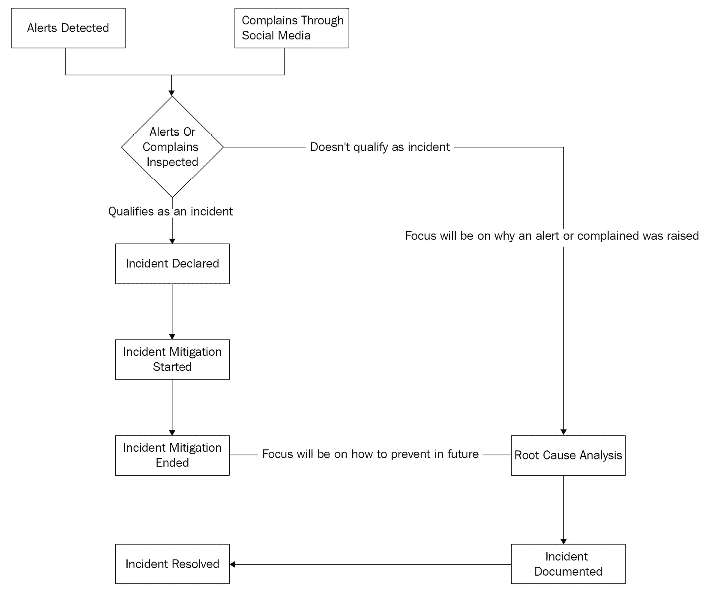
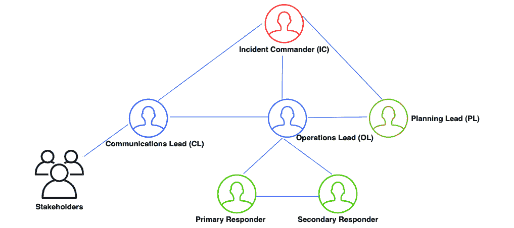

# *第四章*：构建 SRE 团队与应用文化实践

最后三章介绍了 **网站可靠性工程**（**SRE**）的基础知识，追溯了它的起源，阐明了 SRE 与 DevOps 的不同，介绍了 SRE 行话及其关键技术实践，如 **服务水平协议**（**SLAs**）、**服务水平目标**（**SLOs**）、**服务水平指标**（**SLIs**）和 **错误预算**，并专注于监控和警报概念，以确保可靠性。

本章将重点介绍构建 SRE 团队所需的基础知识，并应用诸如处理事件管理各个方面、值班、实现心理安全、促进沟通、协作和知识共享等文化实践。这些基础知识和文化实践可以作为那些希望开始 SRE 之旅的团队或组织的蓝图。

本章我们将涵盖以下主要主题：

+   **构建 SRE 团队** - 配置、创建 SRE 团队并与团队互动

+   **事件管理** - 事件生命周期及其处理构建

+   **值班** - 需要解决的挑战、操作过载和有效的故障排除

+   **心理安全与促进协作** - 实现心理安全的因素、统一的愿景、沟通、协作和知识共享

# 构建 SRE 团队

Google 通过将软件工程的概念应用于系统运维，定义了 SRE 的原则。Google 在 “DevOps” 一词出现之前就已实施这些原则。随着时间的推移，他们开发了最佳实践，并基本上将 SRE 视为高效运行产品的“秘密武器”。随着 **Google Cloud Platform (GCP)** 的出现，Google 对 SRE 原则变得更加公开，强调这些原则对那些在 GCP 上维护、运行和操作分布式系统的客户成功的重要性。

鉴于 SRE 是一种规范化的 DevOps 实践，越来越多的组织（包括非 GCP 客户）目前倾向于实施 SRE 原则，以寻找服务可靠性与开发速度之间的平衡。这些组织将面临以下挑战：

+   如何配置 SRE 团队？

+   如何实施或运营 SRE 团队？

+   SRE 团队在服务生命周期中何时以及多频繁地参与？

以下子章节根据 Google 的最佳建议回答这些问题。

## 配置 SRE 工程师（SREs）

一个 SRE 团队由 SRE 工程师或 SREs 组成。最初，SREs 也需要负责运维。寻找经验丰富的 SRE 非常困难。然而，建立 SRE 团队的一种方式是招聘那些有运维经验并具备脚本/编码经验的系统管理员。这些人员可以进一步培训，掌握软件工程技能。

以下是推荐的技能列表，招聘为 SRE 工程师或 SRE 的人员应该具备这些技能，或最终经过相关培训：

+   **运维与软件工程**：SRE 应具备运行生产系统的经验，并且了解需要支持的软件或应用程序。

+   **监控系统**：SLO（服务水平目标）对于维持服务的可靠性至关重要，SRE 需要了解监控系统的运作，以便追踪 SLO 及其相关的构件，如 SLI（服务水平指标）和错误预算（Error Budgets）。

+   **生产自动化**：SRE 可以通过确保不再手动执行同一任务，而是通过自动化来有效地扩展运维。这要求理解如何自动化这一过程。

+   **系统架构**：SRE 能够有效地扩展应用程序或服务，这要求对系统架构有深入的理解。

+   **故障排除**：SRE 经常需要随时待命，解决各种类型和复杂度的问题。这需要一种好奇且分析的思维方式来解决手头的问题。

+   **信任文化**：SRE 与开发人员通过错误预算的概念共享服务的所有权。这要求 SRE 通过有效的沟通与开发团队建立信任。

+   **事件管理**：故障或问题是不可避免的，而 SRE 的关键职能之一就是处理事件。这需要具备技术性故障排除能力，并建立一个专门用于事件管理的沟通框架。

除了推荐的技能外，SRE 工程师或 SRE 还应具备一些个人特质，如韧性、果断和灵活性。这些特质将帮助他们应对困难情境，在模糊不清的情况下使用推理，并在开发速度与可靠性之间找到平衡。接下来的主题将深入探讨 SRE 团队实施的类型。

## SRE 团队实施 – 程序与策略

推荐的六种 SRE 团队实施方式：

+   万能型/全能型 SRE 团队

+   基础设施 SRE 团队

+   工具 SRE 团队

+   产品/应用 SRE 团队

+   嵌入式 SRE 团队

+   咨询 SRE 团队

每种实施类型都适合特定的组织，具体取决于组织所提供服务的复杂性、组织的规模、开发团队的数量及其范围，以及组织在应用 SRE 原则方面的接受程度。一些组织还可以根据需求实施多个类型。我们将详细探讨不同的团队实施方式。

### 万能型/全能型 SRE 团队

**厨房水槽/全能 SRE 团队**最适合那些希望开始 SRE 之旅的组织。在大多数情况下，组织倾向于从一个 SRE 团队开始。这种团队的范围是无限的。厨房水槽/全能 SRE 团队推荐给那些当前范围有限的组织，因为应用程序较少，导致用户路径较少。

鉴于只有一个 SRE 团队，这种类型的团队可以作为开发团队之间的纽带，还可以跨项目发现模式，以便在发生事故时提供有效的解决方案。同时，选拔具备所需技能的工程师来组成 SRE 团队是相当具有挑战性的。此外，由于范围可能不断变化，厨房水槽式团队的实施可能会因为团队目标不明确而导致缺乏清晰度，并最终导致运营过载。

### 基础设施 SRE 团队

**基础设施 SRE 团队**最适合那些拥有多个开发团队，且开发团队的范围、复杂性和基础设施需求各不相同的组织。基础设施团队的核心关注点是幕后任务，帮助开发团队更轻松、更快速地完成工作。基础设施 SRE 团队更少关注面向客户的代码，更关注维护与稳定基础设施相关的共享服务和组件。

基础设施 SRE 团队的主要优势在于为开发团队提供同样高度可靠的基础设施，以模拟可能在生产环境中发生的行为。此外，基础设施团队还通过最小权限原则和遵循所需的合规标准来建立访问这些环境的结构。

另一方面，鉴于基础设施 SRE 团队并不直接与客户合作，而是与内部团队合作，因此在为开发团队定义标准时，往往会有过度工程化的倾向。此外，它们的使用行为可能与真实世界的情况有所不同。

有时，根据公司或其产品线的规模，可能会有多个基础设施团队。这可能导致在基础设施提供方式上的重复工作。这是需要密切关注的问题，并且可以通过跨基础设施团队的聚会和定期更新来避免。

### 工具 SRE 团队

**工具 SRE 团队**最适合那些拥有多个开发团队的组织，在这些组织中，开发团队需要一种标准化的方法来构建或实施软件，以衡量、维护和改进服务的系统可靠性。例如，实施一个通用框架，允许开发团队在其服务中实施自定义的度量指标仪器，从而最终帮助衡量服务的可靠性。

工具 SRE 团队旨在构建高度专业化的可靠性相关工具，并最终定义生产标准。一个主要的缺点是，很难明确区分工具 SRE 团队和基础设施 SRE 团队，因为它们的目标是为开发团队提供集中的帮助，但它们的核心焦点不同。工具 SRE 团队更加关注提高单个服务的可靠性，而基础设施 SRE 团队则更多地关注提高支撑基础设施的可靠性。

### 产品/应用 SRE 团队

**产品/应用 SRE 团队**最适合那些已经拥有厨房池、基础设施或工具 SRE 团队，并且拥有一个关键的面向用户的应用程序，其中包含多个关键服务，每个服务都需要高可靠性的组织。多个可靠服务的需求要求有一组专注于产品的 SRE 团队。这种方法有助于为团队制定清晰的使命，并与业务优先级直接相关。

另一方面，随着服务或产品的发展，始终需要添加更多的 SRE 团队。这也增加了在产品/应用 SRE 团队之间可能出现重复工作的机会。

### 嵌入式 SRE 团队

**嵌入式 SRE 团队**最适合那些只需要在特定时间段或专注于特定功能实现的组织。在这种 SRE 设置中，SRE 工程师实际上与开发团队嵌入在一起，这种参与通常是有范围限制的，或是时间有限的。

SRE 工程师在日常工作中与代码和所需配置直接接触。嵌入式 SRE 团队还可以有效地推动基础设施或工具 SRE 团队提出的提案或更改的采纳。其主要优点是能够为特定关注领域建立 SRE 专业知识。然而，另一方面，由于每个 SRE 团队将与不同的开发团队合作，可能会缺乏统一的标准化实践。

### 咨询型 SRE 团队

**咨询型 SRE 团队**最适合那些复杂性较高且现有 SRE 团队无法满足客户不断增加需求的组织。咨询型 SRE 团队与嵌入式 SRE 团队相似，但它们专注于最终客户，通常不会更改任何客户代码或配置。不过，它们可能会编写代码为自己或开发团队的同行构建内部工具，类似于工具 SRE 团队。

如果现有 SRE 团队需要额外支持，而这种支持仅是暂时性的，咨询型 SRE 团队是一个不错的选择，但另一方面，SRE 工程师可能没有足够的背景信息来做出平衡的决策。

这完成了关于各种 SRE 团队实施类型的部分。实际上，并没有推荐特定的 SRE 团队实施方式。组织通常会实施这些团队的组合，具体决策取决于多个因素，如组织的规模、SRE 采纳的成熟度以及当前的重点。

总结来说，如果一个组织的目标是开始实施 SRE，那么从全能型实施可能是最好的起点。如果开发组织规模较小，但有一个关键的面向用户的应用程序，可以从全能型实施过渡到产品/应用程序 SRE 团队实施。

然而，如果有许多开发团队具有不同的基础设施需求，那么可以从一个全能型的基础设施 SRE 团队开始，逐步实施。工具型 SRE 团队最适合那些试图通过引入常见框架来实现软件开发流程标准化的组织。工具型 SRE 团队可以与基础设施 SRE 团队互补。

嵌入式 SRE 团队更专注于特定的项目，在该项目中，开发团队和 SRE 团队紧密合作，可靠地实现服务。根据项目的关键性，这种合作模式可以出现在小型和大型团队中。最后，咨询团队最适合那些已经实施了其他类型 SRE 团队但仍然需要支持快速扩展客户需求的复杂组织。

下一个话题将详细阐述 SRE 工程师如何在服务或应用程序的生命周期中参与其中。

## SRE 参与模式

SRE 的核心原则专注于在保持可靠性的同时最大化开发速度。随着服务经历其生命周期的各个阶段，SRE 团队可以持续贡献，以优化服务，并且这些团队可以在不同的阶段（如下所述）以不同的方式参与其中。

### 架构与设计

让我们来探索一下这个阶段对于 SRE（SRE 工程师）意味着什么：

+   在这个阶段，SRE 的参与程度非常深（且高），因为 SRE 团队可以带来他们的生产经验，提供各种见解，并有效地共同设计服务。

+   SRE 通过审视设计选择和验证所有假设来验证设计和架构。这有助于避免潜在的重新设计。

+   SRE 在设计阶段提出最佳实践，例如通过识别单点故障来增强系统的韧性。

+   SRE 根据以往经验和预估负载对比潜在的资源需求，推荐最佳的基础设施系统。

+   SRE 在设计过程中识别有效的用户旅程。

下一个阶段是积极开发。

### 积极开发

让我们来探索一下这个阶段对于 SRE（SRE 工程师）意味着什么：

+   一旦设计完成，SRE（SRE 工程师）可以帮助开发团队确保服务从生产的角度来进行开发。这包括容量规划、识别负载需求以及为冗余添加资源。

+   SRE 帮助规划流量激增和过载的应对策略。应对的一种方式是使用负载均衡器，同时评估需要配置的容量。在开发环境中尽早设置负载均衡器是一个好的开始，可以在初步评估行为后，在模拟生产环境的性能测试中进一步加固。

+   SRE 会思考已识别的用户旅程，并与开发团队（以及其他相关方）合作，提出满足 SLI 和 SLO 要求的方法。

+   SRE 负责添加可观测性，包括配置监控、告警和性能调优。这有助于设置所需的基础设施来跟踪 SLI 和 SLO。

开发完成后，服务会在下一个阶段向有限数量的用户开放。

### 有限可用性

让我们来探讨一下有限可用性阶段对于 SRE（SRE 工程师）意味着什么：

+   有限可用性指的是在正式发布之前的 Alpha（一个部分完成或仍在开发中的版本）和 Beta（一个在开发完成后首次提供给有限用户使用的版本）发布阶段。在有限可用性期间，与开发阶段相比，用户数量、潜在的使用案例、复杂性和性能需求都会发生显著变化。

+   SRE 专注于基于变化的需求来衡量性能，并通过定义 SLO 来评估可靠性。

+   SRE 让开发团队参与制定类似于实时生产环境的操作实践。这有助于模拟内部团队在生产中应期待的经验。

+   SRE 通过分配专业角色、开展模拟事件演练并为真实场景做好准备来建立事件响应团队。

下一个阶段是正式可用性。这是服务已达到稳定状态并可以被更广泛的用户或其他服务使用的阶段。

### 正式可用性

让我们来探讨一下正式可用性阶段对于 SRE（SRE 工程师）意味着什么：

+   服务只有通过**生产准备评审**（**PRR**）后才能进入正式可用性阶段。这是 SRE 参与并负责的最长阶段。

+   SRE 执行大部分的运维工作并负责事件响应，开发团队会提供一些帮助。

+   可能开发团队成员会与 SRE 轮换合作，这样开发团队就能深入了解运维负载。

+   SREs 将专注于跟踪服务的操作负载及相关的 SLO（服务级别目标）。这确保了错误预算没有被耗尽，并且新功能可以推出。

当当前版本的服务即将被替换时，它将进入下一个阶段，称为折旧阶段。

#### 折旧

让我们探索一下折旧阶段对 SREs（SRE 工程师）意味着什么：

+   这指的是系统的新版本即将投入使用并取代当前版本的阶段。因此，不再添加新用户或改进功能。重点转向通过工程手段将用户从现有系统过渡到新系统。

+   SREs 继续支持现有系统直到其生命周期结束，并与开发团队并行工作，进入新服务的架构与设计阶段。

最后的阶段是废弃阶段。该阶段解释了折旧阶段过后，服务会发生什么。

#### 废弃

让我们探索一下废弃阶段对 SREs（SRE 工程师）意味着什么：

+   一旦服务达到生命周期终点，该服务便会被废弃，SREs 对该服务的参与也随之结束。当服务不再受到开发团队的支持或不再被客户需求时，就会进入生命周期结束。

+   开发团队恢复操作支持，SREs 在力所能及的基础上支持服务事件。

这一部分完成了关于 SRE 参与模型的描述，强调了 SRE 工程师在服务生命周期中的重大影响，从服务的概念化到结束生命周期的全过程。接下来的部分将详细介绍 SRE 文化实践中的一个关键环节——事件管理。

# 事件管理

事件管理是 SRE 工程师的关键角色之一。事件被定义为表明服务或应用程序可能存在问题的事件。问题的性质在最好的情况下可能是轻微的，或者在最坏的情况下是停机事件。事件可以通过作为服务或应用程序监控的一部分设置的警报触发。

警报是指示与服务相关的 SLO 目标被违反或即将违反的信号。有时，尤其是对于面向外部的应用程序，事件可能是由于最终用户通过社交媒体平台的投诉引发的。这类事件包含了对当前警报系统未能识别事件的反思。

有效的事件管理是 SRE 文化实践中的关键，它对于限制事件引起的干扰至关重要，并且对尽早恢复正常业务运营至关重要。事件管理包括两个主要部分：

+   技术故障排除方面（重点是要么减轻问题，要么解决问题）

+   有效沟通方面（强调确保正确的人在正确的角色中参与，并及时告知服务消费者的相关利益相关者）

组织在处理事件管理时采用不同的方式，但如果没有采取正确的方法，就会导致事件无法得到有效管理。以下是未管理事件的两个主要特点：

+   **过于侧重技术问题**：一个操作问题通常会产生级联效应，尤其是在复杂的系统中。因此，在试图从单一视角解决技术问题时，常常会忽视大局。

+   **沟通不畅**：在试图解决当前事件时，可能没有足够关注沟通方面的问题。这将带来内部和外部的影响。从内部来看，沟通不畅会导致资源利用效率低下。有时还可能导致临时介入，多个人可能会同时处理同一个问题，甚至在同一时间对系统进行更改（这并不是理想的情况）。从外部来看，沟通不畅会导致客户感到沮丧，进而失去对服务或应用提供者的信任。

本节的下一部分将详细介绍有效实施事件管理所需的概念，从事件生命周期的主题开始。

## 事件生命周期

在制定有效的事件管理策略之前，了解事件的生命周期非常重要。以下是一个状态图，它提供了对事件不同状态的洞察：

图 4.1 – 事件生命周期

总结来说，基于配置的警报或社交媒体上的投诉，事件被识别。识别出的事件会被验证，以检查是否符合条件。如果符合条件，则启动事件缓解。在事件缓解后，启动根本原因分析。事件的细节会被记录，创建工单，然后事件会进入已解决状态。接下来的主题将介绍与有效事件管理相关的重要概念。

## 有效事件管理的要素

有效的事件响应需要多个要素的结构化管理，这是事件管理的关键。这些要素使我们能够专注于核心的 SRE 文化实践，如沟通、协作、学习、知识共享、信息流的有序管理和有效的客户通知。这有助于团队处理不同的情况，并尽快做出反应。结构化的事件响应有助于减少重复劳动，并且使团队内每个人的活动都能得到可视化。

以下是有效事故管理的一些关键要素。

### 声明事件

在事件导致事故的情况下，SRE 或操作人员在决定何时声明该事故时通常会面临两难。如果他们等待较长时间再声明事故，可能很难减轻事故对最终用户造成的负面影响。然而，如果过早声明，可能会导致误报。

以下是一些在决定何时声明事故时起到关键作用的指南，从*定义阈值*开始。

#### 定义阈值

每个组织都应该定义一套明确的阈值，以便将事件声明为事故。这些阈值可以通过设置警报来定义。一个特定的事件可以通过单一警报或多个警报的组合来触发。也可以根据活跃警报的总数或警报的持续时间来触发事件。

下一个需要评估的指南是*评估影响*。

#### 评估影响

一旦设定了指南并定义了阈值，随着警报的触发，评估事件的影响变得至关重要。评估影响时涉及多个方面，例如事件的性质、对最终用户的影响、对业务的最终影响、风险中的相关利益方或对业务的财务损失。

以下是基于可能影响如何对事件进行分类的参考模板：

+   **微不足道**：对产品影响很小或没有影响，但可能需要后续的行动项

+   **轻微**：对内部用户的影响，但外部用户可能没有察觉

+   **重大**：对外部用户产生影响，且有明显的收入损失，但服务仍在正常运行

+   **重大/灾难性/有害**：中断严重影响用户和业务，并造成重大收入损失

从高层次来看，以下问题有助于确定事件是否属于事故。如果以下任何问题的答案是*是*，则可以声明为事故：

+   故障对用户是否可见？

+   SRE 是否需要其他团队的专业知识来评估该事件？

+   该问题是否在一小时后仍然存在？

一旦事件被确定为事故并且其严重性级别已确认，SRE 或操作人员应通过发布声明正式宣布事故，声明中应包括严重性级别、受影响服务的列表以及可能的恢复时间估算。总结了与*声明事故*相关的主题，并附带一些基本指南。接下来需要讨论的有效事故管理的关键元素是*职责分离*。

### 职责分离

一旦声明了事件，应组建事件响应团队，其主要任务是缓解或解决事件。事件响应团队的成员应有明确的职责。SRE 为团队中应指定的角色提供了一组特定的角色。规定的角色如下：

+   **事件指挥官**（**IC**）

+   **通信负责人**（**CL**）

+   **操作负责人**（**OL**）

+   **主要/次要响应者**

+   **规划负责人**（**PL**）

每个前述角色应有明确的职权和自主性，相关内容将在接下来的子节中详细说明，首先是 IC。

#### 事件指挥官（IC）

IC 的职责如下：

+   IC 领导指挥链，并为团队中的特定成员指定特定角色。事件响应团队的每个成员都需要向 IC 汇报。

+   IC 应当了解事件响应过程中重大事件的发生，积极协调响应过程，决定优先级并委派任务。

+   IC 的核心目标是确保问题得到缓解并最终解决。然而，IC 并不会亲自或单独修复问题。

+   IC 在事件得到缓解或解决后启动事后分析报告。

+   根据团队规模，IC 还可以承担 CL 的角色。

下一节将详细介绍 CL 的职责。

#### 通信负责人（CL）

CL 的职责如下：

+   CL 是事件响应的对外代表，领导与外界的沟通，提供及时的更新，并且回答与事件相关的问题。

+   CL 充当屏障，避免客户/客户与事件响应团队的其他成员直接沟通。

+   CL 维护实时事件状态文档，该文档稍后用于事后分析。

下一节将详细介绍 OL 的职责。

#### 操作负责人（OL）

OL 的职责如下：

+   OL 制定并执行事件响应计划，从而负责技术和战术工作。

+   OL 负责操作团队，该团队由主要响应者和（可选）次要响应者组成。

+   OL 始终与 IC 和 CL 保持联系。如有需要，OL 会根据事件的具体性质，向操作团队或主题专家请求额外资源。

下一节将详细介绍主要/次要响应者的职责。

#### 主要/次要响应者

主要/次要响应者的职责如下：

+   主要响应者和（可选）次要响应者是操作团队的成员，并向 OL 汇报。他们的主要目标是执行 OL 的技术响应计划。

+   次要响应者协助主要响应者，或根据 OL 的安排被指定特定任务或职能。

下一节将详细介绍 PL 的职责。

#### 计划负责人（PL）

PL 的责任如下：

+   PL 与运维团队合作，跟踪系统变更，并根据需要安排交接。

+   PL 安排团队之间的交接，并报告故障以跟踪长期变化。

图 4.2 展示了上述角色如何进行结构化：

图 4.2 - 说明事件管理角色

明确的角色定义使得 SRE 工程师能够专注于特定领域，并防止外部临时干预。建立一个通信岗位至关重要，这可以是一个物理位置，例如会议室，或者一个通信渠道，例如 Slack。此外，强烈建议在班次结束或一天结束时实施清晰的实时交接，确保事件能够明确地交接给另一个事件指挥官。

总结事件响应的原则

核心原则包括：保持明确的指挥链，指定清晰的角色，维护一个实时事件状态文档，确保及时向受影响方通报事件状态，执行实时交接以避免操作过载，准备事后分析报告以确定根本原因，根据需要更新操作手册，并计划尽可能频繁地进行**灾难恢复**（**DR**）演练。

关于有效事件管理，接下来需要讨论的关键元素是*推荐的最佳实践*。

### 推荐的最佳实践

以下是事件管理过程中推荐的最佳实践总结：

+   制定并记录程序。

+   优先考虑损害并恢复服务。

+   信任指定角色的团队成员。

+   如果不堪重负，寻求帮助。

+   考虑响应替代方案。

+   定期练习程序。

+   在团队成员之间轮换角色。

在下一个话题中，我们将讨论如何在事件发生后恢复服务，并防止类似事件未来发生。

### 恢复服务并避免重复发生

一旦宣布发生事件，事件响应团队的重点应该是排查事件。这可以通过思考服务运行过程中涉及的各种步骤并深入细节来启动。事件可能由内部或外部因素引起，应当检查这两种因素。

在检查内部因素时，应重点分析受影响领域的近期代码或配置更改。在大多数情况下，代码或配置更改可以回滚，从而恢复服务。但也会出现无法从部署角度回滚多个代码或配置更改的情况，唯一的解决办法是提供代码级修复，以便回滚这些更改。与内部因素不同，检查或处理外部因素更为复杂，因为在大多数情况下，我们对它们的控制非常有限。

无论问题的性质如何，主要目标是找到解决或减轻问题的方法。一旦问题得到减轻或解决，应该进行事后分析，目的是找出根本原因。整个过程应以无责备的方式进行，唯一目的是找到可以防止类似事故在未来再次发生的方法。

事后分析过程应产生一份事后分析报告，该报告本质上概述了事故的事件，并包含有关影响性质、可能的根本原因、触发事件、帮助识别事件的指标以及行动项列表的详细信息。此外，事后分析报告还应提供有助于未来减轻风险的清晰信息，并可作为事故后使用的案例场景。这有助于促进团队之间的学习。

本节完成了对事故管理的深入讲解。我们从尝试概述事故生命周期（*图 4.1*）开始，然后详细阐述了有效事故管理的关键构成，绘制了事故生命周期图，详细介绍了可能的角色及其各自的责任，并推荐了一套最佳实践。

本质上，重要的是区分何时需要报告事故，识别受影响的各方（内部或外部用户），评估影响程度，若发生事故时要有预定义的角色，并尽量遵循章程。这能避免沟通和协作中的模糊性。这样你可以专注于关键目标，即尽早减轻问题并恢复服务。同时，调查、识别并解决根本原因也至关重要，以防止问题再次发生。

下一部分将重点介绍值班过程（另一种 SRE 文化实践）以及需要考虑的关键因素。

# 值班

值班职责是指在工作和非工作时间内，为了支持服务或应用程序的可靠运行而进行的特定操作活动。值班职责是 SRE（站点可靠性工程师）的关键职责之一，并且从服务角度来看，它对于保持服务的可用性和可靠性也非常重要。SRE 团队（如前所述）不同于常规的操作团队，因为它的目标是强调利用工程技术来解决操作问题，并防止这些问题在大规模中发生。在值班期间，通常会涉及产品/应用程序 SRE 团队。如果是专门的服务，嵌入式 SRE 团队会参与值班工作。

当事故发生时，从启动事故管理过程到解决或缓解问题的响应时间是关键，这决定了是否能够满足所需的 SLO（服务水平目标），从而满足承诺的 SLA（服务水平协议）。在实施值班过程中，有多个因素需要考虑。以下是三项需要考虑的因素：

+   呼叫事件与非呼叫事件

+   主值班与副值班轮换

+   单站点与多站点生产团队

下一个主题讨论了*呼叫事件与非呼叫事件*，这是实施*值班*过程中的关键因素之一。

## 呼叫事件与非呼叫事件

呼叫事件是指需要立即关注或修复的高优先级警报，尤其是在面向用户的应用程序中。呼叫事件的例子可能包括服务健康检查失败，或者与服务相关的数据库无法接受更多连接的情况。

非呼叫事件是指低优先级警报，可能并不指示服务故障，而是指出需要解决的问题，以防这些问题发展成更大的事故。非呼叫事件的例子包括由于特定地区新功能发布导致的流量激增，或由于磁盘使用率上升至 80% 但随后通过自动化过程增加了额外 10% 的磁盘空间后自动解决的较低优先级工单。这为值班工程师提供了足够的时间，去调查磁盘使用率激增的根本原因。

呼叫事件始终是 SRE 团队的最高优先级。在这种情况下，第一步是验证该事件是否为事故，并采取适当的步骤启动事故管理流程。此外，SRE 团队还会审查非生产类呼叫事件，并根据操作负载在工作时间内处理这些事件。在配置警报规则时，区分呼叫事件与非呼叫事件非常重要，否则会导致警报疲劳。警报疲劳会让团队成员倾向于忽视重要警报。

下一个主题讨论了*主值班与副值班轮换*，这是实施*值班*过程中的关键因素之一。

### 主要与次要值班轮换

在某一时刻，可能会有多个 SRE 团队在值班。由于值班 SRE 团队的主要责任是通过处理分页和非分页事件（包括处理警报、工单和操作任务）来可靠地运行服务，因此通常会将 SRE 团队分为主要团队和次要团队。

将团队划分为主要团队和次要团队，实际上有助于分配任务和组织优先级。不同组织实施 SRE 的方式可能会导致团队之间的任务分配有所不同。一种实现方式是将次要团队部署为主要值班团队无法处理的分页事件的接替者，可能是因为主要值班团队正在积极处理其他事务。本质上，次要团队作为主要团队的应急团队，在出现比主要团队当前能够处理更多的分页事件时发挥作用。另一种实现方式是将主要值班团队始终指派处理分页事件，而次要值班团队则可以处理非分页的生产活动。

下一部分讨论*单站点与多站点生产团队*，这是实施*值班*流程的关键因素之一。

## 单站点与多站点生产团队

单站点生产团队指的是一个或多个 SRE 团队支持来自单一地点的运营。尽管团队之间的沟通和信息交流较为便利，但问题在于，特定团队必须参与夜班，从健康角度来看，长期进行夜班可能会带来不利影响。

多站点生产团队指的是来自多个地点的一个或多个 SRE 团队支持运营。典型的方法是确保这些地点位于地理上不同的区域，并采用*跟随太阳*轮换模式，这使得团队可以完全避免夜班。

*跟随太阳*轮换模式是一个常用术语，用于描述一种服务与支持方法，其中面向用户的应用程序由多个团队支持，这些团队分布在全球各地，以提供 24/7 支持，而不是迫使某个特定地点的支持团队加班，直到问题解决。在这种模式下，如果一个未解决的问题超出了特定团队的班次时间，该问题将转交给下一个班次的团队处理，同时提供之前团队的详细分析和已采取的步骤。多站点生产团队的缺点包括沟通挑战和协调开销。

下一部分讨论值班期间的推荐实践。

## 值班期间的推荐实践

以下是一些 SRE 在值班期间的推荐实践：

+   处理值班时的事务完全取决于方法。虽然思考需要理性和专注，但存在行动可能过于直觉和启发式的风险。应该避免这种风险。

+   直觉性的行为往往是错误的，且缺乏数据支持。直觉可能会导致值班 SRE（SRE 工程师）从一开始就走上错误的推理路径，可能浪费时间。

+   启发式方法会导致值班 SRE 在面对问题时可能采取基于假设和先前经验的方法，但这种方法可能并非最优或理性。

+   在值班时最重要的方面是拥有清晰的升级路径、明确的事件管理流程和无责文化的事后分析，以及在*操作过载*和*操作不足*之间找到平衡。

+   通过试图从根本上理解系统是如何构建、设计和应该如何工作的，培养有效的故障排除文化。这样的专业知识可以通过调查系统无法正常工作时的情况来获得。此外，还应持续关注提问，使用如*什么*、*哪里*、*为什么*和*如何*等构造，可能会引导出下一组相关的问题或答案，最终有助于故障排除。

+   避免常见的陷阱，如关注与问题无关的症状、对配置错误的影响缺乏理解、以及通过画出关联或使用不准确的假设来尝试将问题与过去的问题联系起来。

    操作过载与操作不足

    操作过载是一种由配置错误的监控系统或不正确的警报规则选择引起的状态，导致疲劳和压力。这通常会导致工单数量、警报页面和持续的操作支持增加。处理高优先级的工单和警报页面会导致紧张的局面，造成压力，并可能限制站点可靠性工程师继续从事工程工作。通过暂时将一位经验丰富的 SRE 借调给过载的团队作为专门帮助，可以缓解这种情况，为团队提供喘息空间，允许他们解决问题或让团队成员专注于工程项目。

    操作不足是指站点可靠性工程师长时间未参与生产系统的状态。这可能会导致显著的知识差距和在突然处理生产问题时缺乏信心。如果 SRE 团队的人员配置合理，确保每个工程师每季度至少值班一次或两次，这种情况是可以避免的。

本节完成了与值班相关的过程、实施过程时可能产生的影响因素以及推荐的最佳实践。下一节将重点讨论心理安全的文化 SRE 实践及实现该目标的相关因素。

# 心理安全

SRE 的一个关键支柱是将失败视为正常现象。这意味着失败是不可避免的，但关键在于从失败中学习，并确保下次不会重复同样的错误。因此，SRE 促进团队内部以及团队成员与领导之间的开放沟通，以确保从过程角度客观评估失败，而不是从个人角度评估。核心理念是提供心理安全感，这对于实施**无责事后分析**实践至关重要。

SRE 将心理安全定义为一种信念，即经理或个人贡献者不会因以下情况而被单独挑出来、羞辱、嘲笑或惩罚：

+   犯错可能导致潜在的事件或问题

+   提出与决策相关的担忧，涉及设计、实施或流程方面的问题，这些问题可能会在未来产生不利影响

+   提出问题以进一步澄清，帮助个人或团队中的多个成员有效地执行任务或协作

+   提出可以促进创新的新想法，以进一步改进过程或服务

    低心理安全的缺点

    一个心理安全感较低的工作场所或团队，最终会压制学习和创新。团队成员会对澄清问题、发声或发起对话感到忧虑。这种情况会导致自我怀疑，影响能够促进创新的思想交流。

心理安全在事件管理中也非常重要。在接下来的主题中，我们将讨论一些确保心理安全的因素。

## 为了促进心理安全，需要克服的因素

一种无责思维促进心理安全，以下两个因素应该克服，以避免首先归咎于他人：

+   **后见之明偏差**：指的是一种自以为是的态度，认为某件事情最终会失败，尽管在当时并不明显。因此，往往有倾向责怪领导者，认为他们没有采取必要的措施预见问题并避免失败。

+   **不适排解**：指的是一种人们通过指责来排解不适的倾向。这会导致团队成员倾向于隐瞒信息、事实或不进行沟通，因担心惩罚或可能对个人或团队产生负面影响的后果。

总结来说，心理安全对团队成员至关重要，它能够让团队成员在当时最佳可用信息的基础上自由地做出决策或选择。此外，创新往往需要承担风险，这也意味着可能会面临失败的机会。无论是哪种情况，如果出现问题，重点应放在导致失败的过程上，而不是事件中涉及的人员。这样可以进行客观分析，并为团队提供自由表达想法的空间，从而促进开放的沟通和持续的改进。

头脑、心灵与行动模型

头脑、心灵与行动模型是一种促进心理安全、减少对变化恐惧的方法。头脑代表理性，重点必须放在为什么变化发生上，并应包含战略使命和愿景。心灵代表情感，重点应放在变化如何带来积极影响上。行动代表行为，重点应放在实现变化所需提供的知识、技能和资源上。

下一节将深入探讨另一组 SRE 文化实践，旨在促进分享愿景和知识，推动协作。

# 分享愿景与知识，促进协作

SRE 的关键支柱之一是减少组织内的孤岛现象，这可以通过创建统一愿景、分享知识和促进协作来实现。

## 统一愿景

组织通常会有愿景声明，用于指导其工作或代表的目标。团队的愿景应与组织的愿景一致，通常该愿景包含以下构成要素：

+   **核心价值观**：帮助团队建立信任与心理安全，创造承担风险和愿意学习的氛围。

+   **目的**：指团队存在的具体意图。

+   **使命**：指向团队努力实现的明确且令人信服的目标。

+   **战略**：指实现或达成团队使命的路径；这包括识别相关资源、能力、威胁和机会的过程。

+   **目标**：指团队定义的一组目标。SRE（Site Reliability Engineering）建议使用 OKRs（目标与关键结果）来设定具有挑战性的目标，推动团队完成超出预期的成就；**OKRs**是指**目标与关键结果**，一种由个人和团队使用的协作目标设定框架，旨在设定雄心勃勃的目标并在过程中衡量成果。

OKRs（目标和关键成果）可以帮助团队集中精力进行重要的任务，完成团队原本认为不可能的目标，即使他们没有完全实现预定目标。通过清晰地定义目标，并定量地分类关键成果，确保目标的达成。设定 OKRs 的目标是确保至少达到那些定义的关键成果（如果不是全部）。OKRs 可以鼓励人们尝试新事物，优先处理工作，并从成功和失败中学习。虽然团队可能无法达到每个 OKR，但它为团队提供了共同努力的目标，推动大家朝着统一的愿景前进。

## 沟通与协作

团队之间的沟通与协作对于实施 SRE（站点可靠性工程）至关重要。这可能包括组织内多个 SRE 团队之间的沟通，或 SRE 团队与各自产品/开发团队之间的沟通。这有助于识别共同的解决问题的方法，消除模糊性，并提供解决更复杂问题的可能性。以下是 SRE 团队提出的一些选项。

### 面向服务的会议

让我们了解这些会议的目的：

+   这些是强制性的会议，旨在审查服务状态并增加所有相关方的意识。

+   推荐的时长约为 30-60 分钟，并应由指定的负责人主导，且有明确的议程。

接下来，我们将讨论团队构成。

### 有效的团队构成

让我们来看一下如何实现有效的团队构成：

+   SRE 建议每个 SRE 团队都应该有一个有效的团队构成——特别是某些角色，如技术负责人、经理和项目经理。

+   技术负责人设定团队的技术方向。经理负责团队的绩效管理，并是团队的第一联系人。项目经理负责设计文档的审核。

另一种沟通与协作的方法是知识共享。

### 知识共享

这就是该方法的核心内容：

+   跨职能培训、员工对员工的网络和工作影随是最推荐的选择。

+   跨职能培训可以通过在其他领域的培训提高团队成员的能力，从而鼓励员工不断学习和成长。

+   员工对员工的网络鼓励员工通过内部信息分享会议分享他们的知识和学习。

+   工作影随是指通过观察并可能协助专家领域内的人员进行在职培训。

这部分完成了关于 SRE 文化实践的最终章节，重点是分享统一的愿景和知识，并促进沟通与协作。这也标志着本章的结束。

# 总结

在本章中，我们讨论了构建 SRE 团队所需的关键要素。此外，我们还讨论了帮助实施技术实践的关键文化实践。本书的第一部分（*第 1-4 章*）已经结束，接下来的章节（*第 5-10 章*）将重点介绍实施 DevOps 所需的核心 Google Cloud 服务，从*第五章*，*使用 Cloud Source Repositories 管理源代码*开始。

# 需要记住的要点

以下是一些需要记住的重要要点：

+   IC：负责事件响应，指定责任，并可选择承担未指定的角色，如 CL。

+   OL：负责解决或处理事件——技术和战术；通过与主要和次要响应者合作执行行动计划。

+   CL：事件响应的公共面孔；负责与所有利益相关者沟通。

+   PL: 跟踪系统变更，通过报告错误来识别长期变更，并安排交接工作。

+   指挥中心：指的是一个会议室或 Slack 频道，沟通在这里进行。

+   现场事件状态文档：由 CL 维护，记录事件及其更新，随后用于事后分析。

+   如果需要特定的专业知识，或者如果故障可见，或在一个小时左右的努力后问题仍未解决，则应报告为事件或故障。

+   为了促进心理安全，需要克服的因素：事后偏差和不适的情绪释放。

+   团队的愿景涵盖了所有驱动其工作的因素，包括核心价值观、使命、战略和目标。

+   团队的使命是一个清晰而有说服力的目标，是团队希望实现的目标。

# 进一步阅读

欲了解更多关于 GCP 如何实施 DevOps 的信息，请阅读以下文章：

+   **SRE**: [`landing.google.com/sre/`](https://landing.google.com/sre/)

+   **SRE 基础知识**: [`cloud.google.com/blog/products/gcp/sre-fundamentals-slis-slas-and-slos`](https://cloud.google.com/blog/products/gcp/sre-fundamentals-slis-slas-and-slos)

+   **SRE YouTube 播放列表**: [`www.youtube.com/watch?v=uTEL8Ff1Zvk&list=PLIivdWyY5sqJrKl7D2u-gmis8h9K66qoj`](https://www.youtube.com/watch?v=uTEL8Ff1Zvk&list=PLIivdWyY5sqJrKl7D2u-gmis8h9K66qoj)

# 练习测试

请回答以下问题：

1.  根据 SRE 参与模型，SRE 在哪个阶段定义 SLOs？

    a) 架构与设计

    b) 活跃开发

    c) 限制可用性

    d) 一般可用性

1.  以下哪位负责在事件发生后启动事后分析报告？

    a) **事件指挥官** (**IC**)

    b) **通信负责人** (**CL**)

    c) **运营负责人** (**OL**)

    d) **规划负责人** (**PL**)

1.  根据 SRE 参与模型，SRE 的参与最深或最广泛的阶段是哪个？

    a) 架构与设计

    b) 活跃开发

    c) 限制可用性

    d) 一般可用性

1.  根据 SRE 参与模型，在哪个阶段 SRE 开始为生产做好服务准备？

    a) 架构与设计

    b) 积极开发

    c) 限制可用性

    d) 一般可用性

1.  以下哪个角色负责响应中断或事件？

    a) **事件指挥官** (**IC**)

    b) **通讯负责人** (**CL**)

    c) **运营负责人** (**OL**)

    d) **计划负责人** (**PL**)

1.  以下哪个角色负责执行中断或事件的技术响应？

    a) **事件指挥官** (**IC**)

    b) **通讯负责人** (**CL**)

    c) **运营负责人** (**OL**)

    d) **主要响应者** (**PR**)

1.  选择具有以下特征的事件严重性分类：该中断对用户可见，导致明显的收入损失，但没有持久的损害。

    a) 可忽略

    b) 次要

    c) 重大

    d) 有害

1.  以下哪个角色负责管理事件响应的立即、详细的技术和战术工作？

    a) **事件指挥官** (**IC**)

    b) **通讯负责人** (**CL**)

    c) **运营负责人** (**OL**)

    d) **计划负责人** (**PL**)

1.  以下哪个角色负责协调响应团队的工作，以应对当前的中断或事件？

    a) **事件指挥官** (**IC**)

    b) **通讯负责人** (**CL**)

    c) **运营负责人** (**OL**)

    d) **计划负责人** (**PL**)

1.  选择具有以下特征的事件严重性分类：对生产几乎没有影响，但可能需要后续低优先级的可操作项。

    a) 可忽略

    b) 次要

    c) 重大

    d) 有害

# 答案

1.  (c) 限制可用性

1.  (a) 事件指挥官

1.  (a) 架构与设计

1.  (b) 积极开发

1.  (a) 事件指挥官

1.  (d) 主要响应者

1.  (c) 重大；由于收入损失，但没有持久的损害

1.  (c) 运营负责人

1.  (a) 事件指挥官

1.  (a) 可忽略
