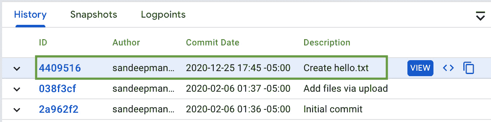

# 第五章：使用 Cloud Source Repositories 管理源代码

本书的第一部分（由四章组成）深入探讨了**站点可靠性工程**（**SRE**）的概念。内容包括 SRE 的技术实践、理解监控和警报以提高可靠性，以及通过应用 SRE 文化实践来建立 SRE 团队的见解。

本书的第二部分深入探讨了 GCP 的构件，以实现一个 CI/CD 流水线，重点关注以下核心领域：

+   使用 Cloud Source Repositories 管理源代码

+   使用 Cloud Build 构建和创建容器镜像

+   使用容器注册表推送容器镜像和工件

+   使用 Google Kubernetes Engine 编排容器并部署工作负载

源代码管理是**持续集成**（**CI**）流程的第一步。代码存储在源代码仓库中；常见的源代码仓库用于存储代码，允许开发者在必要时进行孤立修改，并将多个贡献者的更改合并到一个共同的代码流中。源代码仓库的常见例子包括 GitHub 和 Bitbucket。**Cloud Source Repositories**（**CSR**）是 Google Cloud 提供的一项服务，通过私有 Git 仓库提供源代码管理功能，并能轻松集成到多个 Google Cloud 服务中，例如 Cloud Build、Cloud Monitoring 和 Cloud Logging。

本章将涵盖以下主要主题：

+   **关键功能**：托管的私有 Git 仓库、与外部仓库的一向同步、通用代码搜索和与其他**Google Cloud Platform**（**GCP**）服务的原生集成。

+   **第一步**：通过控制台或**命令行界面**（**CLI**）创建第一个仓库，并向仓库中添加文件。

+   **从 GitHub/Bitbucket 到 CSR 的一向同步**：通过连接到外部仓库并执行近实时的一向同步来添加仓库的选项。

+   **常见操作**：浏览仓库、浏览文件、执行通用代码搜索、检测安全密钥，并分配适当的访问控制。

+   **实践实验**：逐步指导如何将 CSR 与 Cloud Functions 集成。

# 技术要求

主要技术要求有四个：

+   一个有效的 GCP 帐户，用于体验 GCP 服务：[`cloud.google.com/free`](https://cloud.google.com/free)。

+   安装 Google Cloud SDK: https://cloud.google.com/sdk/docs/quickstart。

+   安装 Git：[`git-scm.com/book/en/v2/Getting-Started-Installing-Git`](https://git-scm.com/book/en/v2/Getting-Started-Installing-Git)。

+   或者，可以跳过前两步，改为安装 Cloud Shell，其中包含 Google Cloud SDK 和 Git：[`cloud.google.com/shell`](https://cloud.google.com/shell)。

# 介绍关键功能

CSR 是 Google Cloud 提供的一个源代码管理服务。CSR 提供 Git 版本控制，并支持任何应用程序或服务的协同开发。其主要特性包括：

+   **完全托管的私有 Git 仓库**：此功能意味着无需管理托管源代码仓库所需的基础设施。开发人员可以将精力集中在代码的构建、测试、部署和调试上。

+   **提供与 GitHub 和 Bitbucket 的单向同步**：在开发者将 GitHub 或 Bitbucket 作为主要的云源代码库时，启用与其他 GCP 服务（如 App Engine、Cloud Functions、Cloud Monitoring 和 Cloud Logging）的集成相比于使用 GCP 的 CSR 要稍显复杂。例如，从 CSR 直接将代码部署到 GCP 中的无服务器服务（如 Cloud Functions）要比从 GitHub 或 Bitbucket 部署更加简便。此外，单向同步功能执行单向镜像，实质上是将 GitHub 或 Bitbucket 中的代码库实时复制到 GCP 的 CSR 中。这有助于实现与 GCP 服务的原生集成。

+   **包括通用代码搜索**：此功能允许在源代码仓库或跨多个仓库中进行代码搜索。搜索也可以限定在特定项目、仓库，甚至特定目录中。

+   **与 GCP 服务的集成**：此功能允许与多个 GCP 服务（如 Cloud Build、Cloud Operations、Cloud Functions 和 Cloud Run）进行原生集成。例如，涉及 CSR 操作的日志会自动发送到 Cloud Logging。然而，用户需要相应的 **身份访问管理（IAM）** 角色才能访问 Cloud Logging，以查看与 CSR 相关的日志。

    身份访问管理（IAM）

    IAM 是一套角色和策略框架，确保用户和应用程序能够根据最小权限原则访问所需的资源。

本章后续将详细讨论上述每个功能。接下来的部分将详细介绍创建和访问 CSR 仓库的逐步过程。

第一步 – 在 CSR 中创建和访问仓库

在使用 CSR 时，执行的第一步是实际创建一个仓库并向其中添加文件。由于 CSR 是一个托管仓库，用户无需管理用于托管仓库的空间或用于维护或执行仓库操作的计算能力。

在本节中，我们将展示如何通过 Google Cloud Console 和命令行在 CSR 中创建一个仓库。此外，我们将学习如何向空仓库中的分支添加文件并将其合并到主分支。让我们开始吧。

## 通过 Google Cloud Console 创建仓库

以下是通过 Google Cloud Console 在 CSR 中创建我们的第一个仓库的逐步过程：

1.  启用 CSR API（*图 5.1*），通过在**API 与服务**部分下的**库**子部分中进行导航：

    图 5.1 – 启用 CSR API

1.  在 GCP 中导航到**源仓库**并选择**开始使用**选项。系统将显示提示（*图 5.2*），并提供创建仓库的选项。如果仓库已在 CSR 中存在，请跳至*步骤 3*，并使用**添加仓库**选项：

    ](img/B15587_05_02.jpg)

    图 5.2 – 创建您的第一个仓库的选项

1.  系统将提示添加仓库，提供两种选项（*图 5.3*）—可以选择创建新仓库或连接到外部仓库。在这种情况下，选择创建新仓库的选项：

    图 5.3 – 创建新仓库的选项

1.  通过输入仓库名称来创建一个仓库。此外，选择一个项目，该仓库应该在其下创建（*图 5.4*）：


图 5.4 – 创建新仓库

这将通过控制台创建一个新仓库。然而，某些情况下需要通过脚本创建仓库，即通过命令行。这在自动化为核心目标并旨在消除重复劳动时特别推荐。接下来的主题将详细说明如何通过 CLI 创建仓库。

## 通过 CLI 创建仓库

要通过命令行或 CLI 创建一个云源仓库，请执行以下命令。必须安装 Google Cloud SDK 或使用 Google Cloud Shell：

```
# Enable the Cloud Source Repository API
gcloud services enable sourcerepo.googleapis.com
# Create a repository
gcloud source repos create my-first-csr --project $GOOGLE_CLOUD_PROJECT ops-2021
```

上述步骤将通过 CLI 创建一个新仓库。从本质上讲，通过控制台或 CLI 在 CSR 中创建的新仓库将是一个空仓库。接下来的主题将详细说明如何向 CSR 中的仓库添加文件。

## 向 CSR 中的仓库添加文件

一旦创建了仓库，开发人员可以创建一个分支并在该分支中进行更改。然后，在确认更改后，可以将这些更改合并到主分支中。这是一个多步骤的过程（如下面的操作步骤所示），可以通过用户的终端窗口执行，前提是安装了 Google Cloud SDK，或者通过用户选择的浏览器使用 Google Cloud Shell：

1.  将仓库克隆到本地 Git 仓库：

    ```
    gcloud source repos clone my-first-csr --project=$GOOGLE_CLOUD_PROJECT
    ```

1.  切换到新的本地 Git 仓库：

    ```
    cd my-first-csr
    ```

1.  创建一个新分支：

    ```
    git checkout -b my-first-csr-branch
    ```

1.  将文件添加到新分支：

    ```
    touch hello.txt
    git add hello.txt
    ```

1.  提交新文件的更改到分支：

    ```
    git commit -m "My first commit!!"
    ```

1.  推送更改到分支：

    ```
    git push --set-upstream origin my-first-csr-branch
    ```

1.  创建一个主分支（因为这是第一次检查进入`master`）：

    ```
         git checkout -b master
    ```

1.  将分支合并到`master`：

    ```
         git push --set-upstream origin master
    ```

这部分完成后，您可以创建一个空的仓库，并随后将文件添加到工作分支，然后检查到主分支。然而，也会有一些情况，用户可以选择使用 GCP 的 CSR 中的现有仓库，或 GitHub/Bitbucket 中的外部源仓库。无论哪种方式，克隆现有仓库的过程都是相同的。此外，CSR 允许从外部仓库（如 GitHub/Bitbucket）进行单向同步。所有这些细节将在下一部分中介绍。

# 从 GitHub/Bitbucket 到 CSR 的单向同步

CSR 提供了一种通过连接外部仓库来添加仓库并执行近实时单向同步的选项。目前，GitHub 和 Bitbucket 是唯一支持的外部源仓库。

以下是通过连接到外部 GitHub 仓库在 CSR 中创建仓库的逐步过程（类似的步骤也适用于基于 Bitbucket 的仓库）：

1.  在 Google Cloud Console 中导航到 **Source Repositories** 并选择 **Add Repository** 选项。

1.  选择连接外部仓库的选项（*图 5.5*）：

    图 5.5 – 连接外部仓库的选项

1.  选择一个适当的项目和外部 Git 提供商（本例中为**GitHub**），并授权选定的 GCP 项目存储第三方身份验证凭证，以启用连接的仓库服务（*图 5.6*）：

    图 5.6 – 连接到 GitHub

1.  输入您的 GitHub 凭据，并授权 GCP 访问提供的 GitHub 账户（*图 5.7*）：

    图 5.7 – 授权 GCP 访问 GitHub

1.  授权后，选择需要与 CSR 同步的 GitHub 仓库，然后选择 **Connect selected repository** 操作（*图 5.8*）：

    图 5.8 – 连接 GCR 到选定的 GitHub 仓库

1.  一旦 GitHub 仓库和 GCP 的 CSR 之间建立了连接，以下提示（*图 5.9*）将显示。第一次同步可能需要一些时间，但随后的同步是近实时的：

    图 5.9 – 确认已与 GitHub 建立单向同步

1.  GitHub 仓库的内容最终将与 CSR 同步，其中也包括提交历史和任何其他可用的元数据（*图 5.10*）：

    图 5.10 – 新添加的 GitHub 仓库的内容

1.  如果用户向 GitHub 仓库添加新文件，则 CSR 将执行近实时单向同步。提交和最近的更改将反映在 CSR 中的相关项目中。*图 5.11* 突出了新的提交历史记录：

    图 5.11 – 更新提交历史记录后进行近实时单向同步

1.  如果需要从外部仓库强制同步到 CSR 或断开与外部仓库的连接，可以导航到 GCP 中的仓库设置，找到相应选项（*图 5.12*）：


图 5.12 – 仓库设置以强制同步或断开与 GitHub 的连接

这完成了与外部仓库（如 GitHub/Bitbucket）建立单向同步的详细步骤。下一节将介绍用户在 CSR 中可以执行的一些常见操作，如浏览仓库和文件，以及执行通用代码搜索。

# CSR 中的常见操作

本节详细介绍了在 CSR 中可以执行的常见操作。选项包括以下内容：

+   浏览仓库。

+   浏览文件。

+   执行通用代码搜索。

+   检测安全密钥。

+   分配访问控制。

让我们从浏览仓库选项开始，详细介绍它们。

## 浏览仓库

浏览仓库有两种特定视图。这些视图分布在两个标签中：

+   **所有仓库**

+   **我的源**

### 所有仓库

CSR 显示了当前用户可以访问的所有可用仓库的汇总视图。仓库名称和项目 ID 的组合形成一个唯一的元组。

用户还可以通过星标标记选择的仓库（通常是最重要或最常用的）。所有被星标的仓库将出现在 **我的源** 标签下，方便快速访问特定仓库（*图 5.13*）：


图 5.13 – 在所有仓库下列出的仓库列表

用户可以针对 **所有仓库** 标签下显示的任何仓库执行三种特定操作（参见 *图 5.13* 中绿色方框，按以下顺序）：

+   **设置**：此选项允许用户编辑设置。

+   **克隆**：此选项提供了克隆仓库所需的详细信息。

+   **权限**：此选项允许您控制对仓库的访问权限，可以是用户、组或服务帐户级别。

用户可以通过从列表视图中选择一个仓库，或者从树状视图中选择一个（通过 **所有仓库** 的下拉控制）来访问仓库。

### 我的源

在**所有仓库**部分中，星标的仓库会列出，以便快速访问用户选择的子集。此外，最近查看的仓库（可能已经或未被星标）也会列出，并可以通过点击访问（*图 5.14*）：


图 5.14 – 我的源的内容，显示了星标和最近查看的仓库

这就介绍了用户如何浏览 CSR 中的仓库的详细信息。接下来的主题将重点介绍如何在特定仓库中浏览文件。

浏览文件

一旦用户选择了要浏览的仓库，默认视图会切换到主分支。用户可以通过树状结构（左侧）查看文件列表，选择任何文件将显示该文件的内容（右侧）。用户还可以通过使用**在云端 Shell 中编辑代码**选项来编辑文件。此时，文件将在云端 Shell 编辑器中打开（*图 5.15*），并使用与项目关联的凭证进行身份验证。身份验证会自动进行，无需额外登录：


图 5.15 – 查看/编辑文件内容的选项

用户还可以通过选择所需的分支来切换到现有的分支（*图 5.16*）。此外，用户还可以按特定的标签或提交来查看文件：


图 5.16 – 切换分支或按标签或提交浏览文件的选项

如果用户想查看特定文件的历史更改信息，可以通过**Blame**面板（右上方）或**历史**子部分（*图 5.17*）来查看更改记录：


图 5.17 – 查看特定文件的历史更改信息（CSR）

这就介绍了用户如何在特定仓库中浏览文件的详细信息。接下来的内容将重点介绍用户如何在 CSR 中执行跨仓库或单一仓库的通用代码搜索。

## 执行通用代码搜索

CSR 提供通过 CSR 控制台上的搜索框搜索代码片段或文件的功能。用户可以通过输入文本（最好用双引号括起来）或使用正则表达式进行搜索。

搜索范围可以设置为四个可能的级别之一（*图 5.18*）：

+   **所有内容**：搜索用户有权限访问的所有仓库。

+   **此项目**：搜索当前项目中的所有仓库。

+   **此仓库**：在当前仓库中进行搜索。

+   **此目录**：在当前目录中进行搜索：


图 5.18 – 执行通用代码搜索的可能范围

下一个主题涵盖了基于不同过滤条件执行代码搜索的可能方式及其相应的语法。

### 搜索过滤器

下表列出了一些可以用于搜索代码的搜索过滤器：


这部分详细介绍了用户如何执行通用代码搜索。接下来的主题将重点介绍 CSR 中的一个特定功能，该功能能够在用户尝试进行代码提交时，强制执行策略以检测安全密钥。

## 检测安全密钥

CSR 提供了检测代码库中是否存储安全密钥的选项。如果启用了此功能，当用户尝试将代码推送到代码库中的分支或主分支时，CSR 会强制执行此检查。如果文件内容包含安全密钥，则代码将无法推送，并且用户将收到通知。

当前，CSR 可以设置检查以下类型的安全密钥：

+   JSON 格式的服务账户凭据

+   PEM 编码的私钥

以下命令将提供启用、禁用或覆盖安全密钥检测的功能：

```
# To enable security key detection
gcloud source project-configs update --enable-pushblock
# To disable security key detection
gcloud source project-configs update --disable-pushblock
# To override security key detection at a commit level
git push -o nokeycheck
```

这部分详细介绍了如何在代码提交过程中检测安全密钥。下一个主题将关注在 CSR 中执行操作所需的访问控制。

## 分配访问控制

对代码库的访问可以在项目级别或代码库级别进行分配。如果用户在项目级别分配了特定角色，则该角色将应用于该项目中所有代码库的用户。然而，如果用户为某个特定代码库分配了角色，则该角色仅适用于该代码库。

下表总结了访问 CSR 或在 CSR 上执行操作所需的关键 IAM 角色：


下一个主题提供了有关如何设置跨账户项目访问的信息。

### 跨账户项目访问

如果用户属于项目 A，但需要访问项目 B 中的特定代码库，则应根据用户在项目 A 中的预期作用域，将 Source Repository Reader/Writer/Admin 角色分配给该用户，适用于项目 B 中的特定代码库。这可以通过代码库设置中的**权限**部分来实现。

这部分详细介绍了 CSR 特定的访问控制。也意味着我们已经完成了一个关于用户可以在 CSR 中执行的常见操作的主要部分。接下来的部分是一个实践实验，其中将使用托管在云源代码库中的代码部署云功能。

# 实践实验 – 与云功能集成

本实践实验的目标是演示 GCP 计算服务（如云功能）与 CSR 之间的集成。目的是说明如何通过拉取托管在 CSR 中的代码来部署代码到云功能。以下是高层次的步骤总结：

1.  通过 Cloud Shell 编辑器向现有代码库添加代码。

1.  从 Cloud Shell 编辑器（本地代码库）将代码推送到 CSR。

1.  创建云函数并从 CSR 中的代码库部署代码。

## 通过 Cloud Shell 编辑器向现有代码库添加代码

本小节专门介绍了如何向现有代码库添加代码。开发者通常使用其喜爱的编辑器进行代码更改。以下是使用 GCP 的 Cloud Shell 编辑器的示例，这是一个在线开发环境，通过 Cloud Code 插件支持云原生开发，并提供对 Go、Java、.NET、Python 和 Node.js 的语言支持。

1.  在 GCP 控制台中导航至**源代码库**。

1.  导航至您希望添加代码的代码库。您可以使用之前创建的 `my-first-csr` 代码库。

1.  选择**在 Cloud Shell 中编辑**操作。这会在 Cloud Shell 编辑器中打开代码，并将代码从 CSR 克隆到 Cloud Shell 控制台下的本地代码库。

1.  添加名为 `main.py` 的新代码文件。从 [`github.com/PacktPublishing/Google-Cloud-Platform-for-DevOps-Engineers/blob/main/cloud-build/main.py`](https://github.com/PacktPublishing/Google-Cloud-Platform-for-DevOps-Engineers/blob/main/cloud-build/) 复制此文件的内容。

1.  保存代码文件。

代码编辑和添加完成后，下一步是将代码推送到 CSR。这将作为下一个主题进行讨论。

## 从 Cloud Shell 编辑器（本地代码库）将代码推送到 CSR

本小节专门介绍如何将代码从 Cloud Shell 编辑器的本地代码库推送到 CSR。可以在 Cloud Shell 内打开终端，提供命令行指令。下面详细描述了推送代码的命令行方法：

1.  切换到 Cloud Shell 编辑器中的控制台窗口。

1.  执行 Git 操作以添加新文件并提交更改：

    ```
    # Add new code file to the repository
    git add main.py
    # Commit the changes to the repository
    git commit -m "Adding main.py"
    ```

1.  使用 Cloud Shell 编辑器将包含新更改的本地代码库推送到托管在 CSR 中的代码库中。在 `/p` 后指定适当的项目，并在 `/r` 后指定 CSR 中目标代码库：

    ```
    # Add local repository in Cloud Shell Editor as remote
    git remote add google \
    https://source.developers.google.com/p/gcp-devops-2021/r/my-first-csr 
    # The above will create a remote repository with changes from the local repository
    # Push code to Cloud Source Repositories
    git push --all google
    # The above git push command will push the changes in the remote repository with specific project and repository name to google cloud source repositories
    ```

1.  在 CSR 中导航至目标代码库（例如 `my-first-csr`），以查看新添加的 Python 文件，`main.py`。

一旦代码从远程分支推送到 CSR，代码将在主分支中可用，现在可以部署到任何计算选项中。下一个主题说明了从 CSR 下载源代码并将其部署到 GCP 无服务器计算选项（Cloud Functions）的步骤：

## 创建云函数并从 CSR 中的代码库部署代码

本小节特别说明了 CSR 如何与其他 GCP 计算选项（例如 Cloud Functions）集成：

1.  在 GCP 控制台中导航至**Cloud Functions**。

1.  选择创建函数的选项（如果在项目中首次创建函数，则此操作将启用 Cloud Functions API）。

1.  输入一个你选择的函数名称，并选择区域、触发类型和身份验证方式。保存选项并继续。以下是示例：

    a) `my-first-csr`

    b) `us-central1`

    c) `HTTP`

    d) `允许未经身份验证的调用`

1.  设置运行时为 **Python 3.8**，源代码选项设置为 **Cloud Source Repository**。

1.  输入与需要部署代码的仓库相关的详细信息，并选择 `hello_world` 作为值。

    b) `my-first-csr` 作为值。

    c) `master` 作为值。

    d) `/` 作为值：

    

    图 5.19 – 配置云源代码库作为源代码选项

1.  函数将成功部署（*图 5.20*）。可以通过列表页面中 **操作** 下的 **测试函数** 选项，或通过云函数的 **详细信息** 部分中指定的触发 URL 来测试该函数：


图 5.20 – 云函数成功部署

这完成了一个详细的实验，用户使用 GCP 的 Cloud Shell Editor 进行代码更改，通过 GCP 的 CSR 推送到一个仓库，并将代码部署到 GCP 的计算选项之一，如 Cloud Functions。

# 摘要

在本章中，我们讨论了 Google Cloud 提供的服务，用于管理源代码并提供 Git 版本控制，以支持协作开发。这是建立 CI/CD 流程中的第一个关键构建模块。此外，我们还讨论了可以在 CSR 中执行的各种操作，并通过动手实验演示了 CSR 与 Cloud Functions 的原生集成。下一章将重点介绍构建代码、创建镜像工件和管理工件所需的 Google Cloud 服务。这些服务包括 Cloud Build 和 Container Registry。

需要记住的要点

以下是一些需要记住的重要事项：

+   CSR 是一个完全托管的私有 Git 仓库。

+   CSR 提供与 GitHub 和 Bitbucket 的单向同步。

+   CSR 提供了一个功能，可以进行通用的代码搜索，搜索可以设置为特定项目、特定仓库、特定目录或全部。

+   CSR 可以设置为检测安全密钥。目前支持的类型包括 JSON 格式的服务账户凭证和 PEM 编码的私钥。

+   CSR 提供了一个功能，可以在提交级别覆盖安全密钥检测。

+   支持的访问控制包括 Source Repository Reader/Writer/Admin。

# 进一步阅读

有关 GCP 的 Cloud Source Repositories 的更多信息，请参阅以下内容：

+   **Cloud Source Repositories**: [`cloud.google.com/source-repositories`](https://cloud.google.com/source-repositories)

# 实践测试

回答以下问题：

1.  选择可以通过 CLI 创建名为 `my-first-csr` 的新仓库的命令：

    a) `gcloud create source repos my-first-csr`

    b) `gcloud source repos create my-first-csr`

    c) `gcloud create source repos my-first-csr`

    d) `gcloud source repo create my-first-csr`

1.  以下哪个选项允许与 CSR 进行单向同步？

    a) GitHub

    b) Bitbucket

    c) 以上都不是

    d) 选项 *a* 和 *b*

1.  选择从支持的仓库类型到 CSR 的单向同步频率：

    a) 每 5 分钟

    b) 可配置

    c) 实时

    d) 接近实时

1.  以下哪个不是 CSR 支持的搜索过滤器？

    a) 搜索文件内容

    b) 按语言搜索

    c) 按功能搜索

    d) 通过包含关键词进行搜索

1.  如果是 `git add`

    c) `git push`

    d) `git commit`

1.  选择覆盖提交级别安全密钥检测的命令：

    a) `git push -o keycheck`

    b) `git push -o nokeycheck`

    c) `git push -o anykeycheck`

    d) `git push -o nonekeycheck`

1.  选择两条命令来启用和禁用安全密钥检测：

    a) `gcloud source project-configs update --enable-codeblock`

    b) `gcloud source project-configs update --enable-pushblock`

    c) `gcloud source project-configs update --disable-codeblock`

    d) `gcloud source project-configs update --disable-pushblock`

1.  以下哪个不是 CSR 的有效访问控制？

    a) 源仓库读取者

    b) 源仓库写入者

    c) 源仓库编辑者

    d) 源仓库管理员

1.  以下哪个访问控制可以更新仓库，但不能创建仓库？

    a) 源仓库读取者

    b) 源仓库写入者

    c) 源仓库编辑者

    d) 源仓库管理员

1.  以下哪些访问控制可以更新仓库配置？

    a) 源仓库读取者

    b) 源仓库写入者

    c) 源仓库编辑者

    d) 源仓库管理员

# 答案

1.  (b) – `gcloud source repos create "my-first-csr"`

1.  (d) – 选项 *a* 和 *b*

1.  (d) – 接近实时

1.  (d) – 通过包含关键词进行搜索

1.  (d) – `git commit`

1.  (b) – `git push -o nokeycheck`

1.  (b) – `gcloud source project-configs update --enable-pushblock` 和 (d) – `gcloud source project-configs update --disable-pushblock`

1.  (c) – 源仓库编辑器

1.  (b) – 源仓库写入者

1.  (d) – 源仓库管理员
