# *第六章*：使用 Cloud Build 构建代码，并推送到容器注册表

上一章集中讲解了如何使用**Cloud Source Repositories**（**CSR**）管理源代码。CSR 提供了一个完全托管的私有 Git 仓库，支持与 GitHub 和 Bitbucket 的单向同步，并与 GCP 服务集成。这是**持续集成**（**CI**）流程的第一步。

本章将重点介绍构建代码、使用 Cloud Build 创建镜像工件以及使用 GCP 的容器注册表管理工件所需的构造。这构成了 CI 工作流的核心，因为代码不断构建，工件不断创建并存储在注册表中，应用程序代码也在不断地作为容器进行部署。

在本章中，我们将涵盖以下主要内容：

+   **关键术语** – Docker 和容器相关术语的快速概述

+   **理解自动化的必要性** – 通过探索 Docker 生命周期来理解自动化的必要性

+   **构建和创建容器镜像** – Cloud Build 必备内容，如云构建器和构建配置文件、构建代码、存储和查看构建日志、管理访问控制以及优化构建速度的最佳实践

+   **管理容器工件** – CSR 必须掌握的内容，包括推送和拉取镜像、管理访问控制、配置身份验证方法，以及与 CSR 的 CI/CD 集成。

+   **实践实验** – 当代码更改推送到主分支时，逐步指导如何将应用程序部署到 Cloud Run

# 技术要求

有三个主要的技术要求：

+   拥有有效的**Google Cloud Platform**（**GCP**）账户以便进行 GCP 服务的实际操作：[`cloud.google.com/free`](https://cloud.google.com/free)。

+   安装 Google Cloud SDK：[`cloud.google.com/sdk/docs/quickstart`](https://cloud.google.com/sdk/docs/quickstart)。

+   安装 Git：[`git-scm.com/book/en/v2/Getting-Started-Installing-Git`](https://git-scm.com/book/en/v2/Getting-Started-Installing-Git)。

# 关键术语（前提条件）

在尝试构建、部署和维护一个运行在容器上的分布式应用程序时，有几个关键术语是非常重要的。以下是一些处理容器时需要理解的关键术语的快速概述：

+   **操作系统** – **操作系统**（**OS**）是控制计算机硬件和软件需求的系统软件，涉及多个应用程序，如内存、CPU、存储等。操作系统协调任务，以确保每个应用程序能够获得其成功运行所需的资源。操作系统由内核和软件组成。内核负责与硬件交互，而软件则负责运行 UI、驱动程序、文件管理器、编译器等。

+   **虚拟化** – 虚拟化是通过创建计算、存储、网络等的虚拟或软件版本来以更少的资源做更多的事情。它允许在同一物理硬件上运行多个应用程序。每个应用程序及其关联的操作系统可以在单独的、完全隔离的、基于软件的机器上运行，这种机器被称为**虚拟机**或**VM**。

+   **虚拟机监控器** – 虚拟机监控器是一种软件，用于创建和运行虚拟机（VM），并实现虚拟化的概念。虚拟机监控器允许一台主机计算机支持多个客户虚拟机，通过虚拟化共享内存、存储、处理能力等资源，并负责为每个虚拟机提供所需的资源以达到最佳性能。

+   **容器** – 容器是一种软件单元，打包了代码及其所有依赖项，包括库和配置文件。这使得应用程序能够在各种计算环境中快速且可靠地运行。容器使用低级操作系统构造，允许你指定独特的系统用户、主机名、IP 地址、文件系统段、内存和 CPU 配额。

+   **Docker** – Docker 是一个开源平台，用于开发、构建、部署和管理容器化应用程序。Docker 使用操作系统级虚拟化技术，将软件打包成容器，从而提供在任何地方运行的灵活性。Docker 也可以运行任何操作系统，只要底层操作系统内核是 Linux。例如，容器可以运行不同版本的 Linux 操作系统，如 Debian、CentOS、Fedora 等等。

+   **Docker 守护进程** – Docker 守护进程表示运行一个或多个容器的服务器。它是运行主机操作系统的服务。此外，命令行界面（CLI）表示客户端，CLI 与 Docker 守护进程的结合形成了客户端-服务器架构。

+   **Dockerfile** – Dockerfile 是一个文本文件，包含一系列可以从命令行执行的命令，用于可能地构建镜像。Dockerfile 是 Docker 用来构建镜像的输入文件。该过程自动化了执行一系列指令或命令。

+   **Docker 层** – Docker 层表示通过执行 Dockerfile 中的每个指令创建的中间镜像。指令与中间镜像之间的关联存储在构建缓存中。Docker 容器本质上是一个镜像，其上建立了一个可读/写的 Docker 层，且基于多个只读镜像。

+   **Docker 镜像** – Docker 镜像由多个 Docker 层组成，这些层用于在一个或多个容器中执行代码。本质上，Docker 镜像代表着一个需要执行的计划，或者换句话说，是需要部署的计划。

下一节将说明 Docker 生命周期，并强调**网站可靠性工程**（**SRE**）的一个关键目标，即通过投资自动化来消除繁琐工作。

# 理解自动化的必要性

一旦代码提交到源代码仓库，CI 流程中的下一步是根据运行应用程序的需求构建代码并创建工件。一旦工件创建完成，它们将进一步存储在仓库中，并由**持续部署/交付（CD）**过程在后续运行应用程序。鉴于本书的主题是与容器一起工作，Docker 作为操作系统级虚拟化平台，在容器中部署应用程序时起着关键作用。

以下是 Docker 生命周期的示意图，突出显示了从创建容器镜像到实际部署运行应用程序的容器所涉及的多个步骤：

1.  开发者将代码托管在源代码仓库中。代码可以在开发或增强过程中进行更改。

1.  可以设置源代码仓库，以便在特定触发点，如提交拉取请求或将代码合并到特定分支时触发。这些触发点可以与代码构建过程挂钩。

1.  代码构建过程会查找一个 Dockerfile，它本质上是一组指令，用于创建应用程序及其依赖项。

1.  使用 Dockerfile 创建构建工件——容器镜像，命令是 `docker build`。

1.  创建的镜像可以推送到工件仓库中存储容器镜像，例如 Docker Hub 或 GCP 的容器注册表等。

1.  应用程序是通过将容器镜像从仓库下载到计算环境中并随后构建一个容器来创建的，该容器本质上是一个包含代码、库和依赖项的包。

如果将上述步骤转换为实际命令，它将如下所示：

```
#Build code using the Dockerfile
docker build -t <image-name> .
#Tag the locally created image with the destination repository
docker tag <image-name> <host-name>/<project-id>/<image-name>
#Push the tagged image to the choice of repository
docker push <host-name>/<project-id>/<image-name>
# Note that hostname refers to the location where image is stored. 'gcr.io' refers that by default the images are stored in Cloud Storage; specifically US location
#To deploy the application, pull the image from the repository as a pre-requisite
docker pull <host-name>/<project-id>/<image-name>
#To deploy or run the application
docker run –name <container-name> <host-name>/<project-id>/<image-name>
```

Docker 工作流中提到的步骤是需要按顺序执行的步骤。如果需要修复代码或进行增量代码更改，那么必须重复这些步骤，以便重新构建、推送和部署代码。这就形成了一个重复或甚至是无限循环，给开发者带来了很多痛苦和困扰。这是因为手动步骤越多，出错的机会就越大。这符合繁琐工作的定义，因为这些步骤是手动的、重复性的、没有价值的，并且可以自动化。

鉴于 SRE 的目标是通过自动化消除繁琐工作，这构成了一种可行的方法来消除痛苦和困扰的无限循环。此外，上述步骤需要在一个需要特别关注或设置的环境中执行。例如，需要设置 Docker 来执行上述命令。此外，机器需要具备足够的计算能力和存储要求，以便以重复的方式运行这些步骤。如果同时发起多个并行构建，机器还需要进行扩展。

GCP 提供了一项名为 **Cloud Build** 的服务，它是一个自动化引擎，在 CI/CD 工作流中扮演着关键角色。Cloud Build 可以导入源代码，在受管理的工作区中构建，并创建如 Docker 镜像、Java 包、二进制文件等工件。Cloud Build 实际上可以将构建、标记和推送容器镜像的步骤合并为一个配置文件。由 Cloud Build 创建的容器工件可以被推送并存储在另一个 GCP 服务——**容器注册表（Container Registry）** 中。在容器部署时，容器镜像可以从容器注册表中拉取。Cloud Build 能够将所有这些步骤自动化为声明式语法；也称为构建配置文件，可以根据需要有效地多次执行。

接下来的部分将详细介绍以下内容：

+   Cloud Build 作为 GCP 服务来构建和创建容器镜像

+   容器注册表作为 GCP 服务来管理容器工件

# 构建和创建容器镜像 – Cloud Build

Cloud Build 是一个基于源代码库提交构建和创建工件的服务。Cloud Build 生成的工件可以是容器或非容器工件。Cloud Build 可以与 GCP 的 CSR 以及流行的外部代码库如 GitHub 和 Bitbucket 集成。Cloud Build 的主要特点包括以下几点：

+   **无服务器平台**：Cloud Build 消除了预先配置服务器或为构建代码和生成工件所需的计算能力或存储付费的需求。根据并行提交的数量，扩展或缩减是一个内建的过程，不需要人工干预。

+   **访问构建器镜像的能力**：Cloud Build 提供了云构建器，它们是预先配置好的、可以立即使用的容器镜像，支持多种常见语言和工具。例如，Docker Cloud Builders 运行 Docker 工具。

+   **添加自定义构建步骤的能力**：Cloud Build 需要一个构建配置文件，用户可以在其中明确指定步骤的列表。用户还可以指定执行顺序，并根据需要包含任何依赖关系。

+   **专注于安全性**：Cloud Build 支持漏洞扫描，并提供定义策略的能力，可以阻止有漏洞的镜像被部署。

这些 Cloud Build 特性所基于的基础是一些关键要素，接下来的子部分将会讨论这些要素。

## Cloud Build 基础知识

关于 Cloud Build，有两个关键的基本概念，分别是云构建器和构建配置。

### Cloud 构建器

云构建器是运行构建过程的容器镜像。云构建器中的构建过程本质上是一组预定义的构建步骤。此外，云构建器还可以包括自定义构建步骤。云构建器镜像包含了常见的编程语言和工具。Cloud Build 可用于在云构建器的构建容器内运行特定命令。云构建器可以是 Google 管理的、社区贡献的，或是公共的 Docker Hub 镜像。

### Google 管理的构建器

Google 提供了可以用于执行一个或多个构建步骤的托管预构建镜像。这些预构建镜像存储在 Google 的容器注册表中。常见的示例包括 docker builder（执行 `docker build`、`docker tag` 和 `docker push` 命令）、gcloud builder（执行 `docker run` 命令以部署到 Google 服务，如 Cloud Run）、gke-deploy builder（在 GKE 集群中进行部署）等。Google 管理的构建器完整列表可以在 [`github.com/GoogleCloudPlatform/cloud-builders`](https://github.com/GoogleCloudPlatform/cloud-builders) 查找。

### 社区贡献的构建器

社区贡献的构建器是开源构建器，由 Cloud Build 开发者社区管理。这些不是预构建的镜像，而是由开发者社区提供源代码。个别适配者需要构建源代码并创建镜像。常见示例包括 Helm（用于管理 Kubernetes 包）、Packer（用于自动化创建镜像）等。社区贡献构建器的完整列表可以在 [`github.com/GoogleCloudPlatform/cloud-builders-community`](https://github.com/GoogleCloudPlatform/cloud-builders-community) 查找。

### 公共 Docker Hub 构建器

公共 Docker Hub 构建器指的是可以用来执行一组构建任务的公开可用的 Docker 镜像。从思维方式角度来看，这些构建器与 Google 管理的构建器非常相似，但这些镜像不存储在 Google 容器注册表中，而是存储在 Docker Hub 中。公共 Docker Hub 构建器的完整列表可以在 [`hub.docker.com/search?q=&type=image`](https://hub.docker.com/search?q=&type=image) 查找。

### 构建配置

构建配置是一个配置文件，封装了执行与构建相关任务的步骤。构建配置文件可以采用 JSON 或 YAML 格式编写。配置步骤特别使用云构建器，这些构建器可以是预构建的镜像（由 Google 管理或公共 Docker 镜像）或由开发者社区维护的代码构建的镜像，基本上代表了可以重用的模板化步骤，并且可以选择传递显式参数。这些模板化步骤可以用来获取依赖项、执行单元和集成测试，以及使用构建工具（如 Docker、Gradle、Maven、Bazel 和 Gulp）创建工件。例如，一个构建配置文件可能包含构建、打包并将 Docker 镜像推送到选定容器注册表的指令。该文件的结构将在下一小节中详细介绍。

### 结构

一个构建配置文件包含多个字段或选项。其中最重要的是构建步骤（参见 *图 6.1*）。可以定义一个或多个构建步骤，以反映构建过程中所需的任务。每个构建步骤本质上执行一个 Docker 容器，并提供灵活性以包含多个选项：

+   **Name**：指定一个云构建器，它是一个运行常用工具的容器镜像。

+   `args` 将用作该入口点的参数；如果未指定，`args` 中的第一个元素将用作入口点，其余部分将用作参数。

+   **Env**：接受一个以键值对形式列出的环境变量列表。

+   `/workspace`）或特定的绝对路径。

+   **id**：用于为构建步骤设置唯一标识符。

+   **waitFor**：如果需要某个特定的构建步骤先于其他步骤运行，则使用此选项。如果未指定，则需要完成所有前置步骤后，当前构建步骤才能执行。

+   **entrypoint**：用于覆盖云构建器提供的默认入口点。

+   **secretEnv**：允许您定义由 Cloud KMS 加密的环境变量列表。

+   **volumes**：表示一个 Docker 容器卷，该卷被挂载到构建步骤中，以便在构建步骤之间持久化工件。

+   **timeout**：指定构建可以运行的时间。默认值为 10 分钟，最大允许值为 24 小时。时间应以秒为单位指定。

*图 6.1* 显示了一个构建配置文件的骨架结构，该文件可能由一个或多个构建步骤组成：

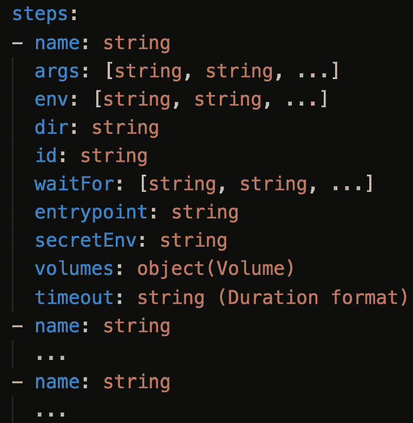

图 6.1 – 构建配置文件中的构建步骤

除了构建配置文件中构建步骤所包含的选项外，更多的可能选项及其详细信息可以在[`cloud.google.com/cloud-build/docs/build-config`](https://cloud.google.com/cloud-build/docs/build-config)找到。

## 使用 Cloud Build 构建代码

云构建器和构建配置文件的结合构成了 Cloud Build 的核心。当 Cloud Build 启动时，后台会执行以下步骤：

1.  将应用代码、Dockerfile 和其他资源压缩成一个文件。

1.  压缩后的代码然后会被上传到 Cloud Storage 存储桶，这可以是 Cloud Build 在每个项目基础上创建的默认存储桶，也可以是用户提供的 Cloud Storage 存储桶。

1.  构建以上传的文件作为输入启动，构建的输出是一个带有提供的镜像名称的容器镜像。

1.  然后，容器镜像会被推送到容器注册表或选择的目标注册表。

有多种方法可以通过 Cloud Build 手动调用构建过程，并使用触发器进行自动构建。

### Cloud Build – 通过 gcloud CLI 手动调用

有两种方法可以通过 `gcloud` 命令行工具手动启动 Cloud Build，这基本上使用了 Cloud Build API：

+   使用 Dockerfile

+   使用 Cloud Build – 构建配置文件

以下小节将详细介绍通过 Cloud Build 启动构建的两种方法。

### Cloud Build – 使用 Dockerfile 进行手动构建

Dockerfile 应包含使用 Cloud Build 构建 Docker 镜像所需的所有信息。以下命令将手动启动构建过程。此命令应从包含应用代码、Dockerfile 和任何其他所需资源的目录运行：

```
# Format to invoke the build manually using Dockerfile
gcloud builds submit --tag <host-name>/<project-id>/<image-name> <app-code-directory-path>
#Example (. Indicates current directory)
gcloud builds submit –tag gcr.io/gcp-devops-2021/manual-dockerfile-image .
```

一旦构建完成，构建 ID 将显示在终端或 shell 中，`build` 命令从中被调用。该构建 ID 可以用于过滤 Cloud Build 控制台中显示的构建，并且后续可以用于查看构建日志。此外，新的镜像将根据前面的示例推送到容器注册表。

### Cloud Build – 使用构建配置文件手动构建

另一种通过 Cloud Build 启动手动构建的方法是使用构建配置文件。构建配置文件使用云构建器，这些构建器在模板化规格文件中至关重要，能够最小化手动步骤。

以下是一个示例构建配置文件，使用 docker 云构建器来构建代码并将镜像推送到容器注册表。这里使用的容器镜像名称是 `builder-myimage`，配置文件的名称是 `cloudbuild.yaml`：

```
steps:
- name: 'gcr.io/cloud-builders/docker'
  args: ['build', '-t', 'gcr.io/$PROJECT_ID/builder-myimage', '.']
- name: 'gcr.io/cloud-builders/docker'
  args: ['push', 'gcr.io/$PROJECT_ID/builder-myimage']
- name: 'gcr.io/cloud-builders/gcloud'
```

以下命令将使用构建配置文件（在本例中是 `cloudbuild.yaml`）以及源代码路径作为输入，启动 Cloud Build 过程：

```
# Format to invoke the build manually using the build configuration file
gcloud builds submit --config <build-config-file> <source-code-path>
#Example 1 (Source code is located in the current directory)
gcloud builds submit --config cloudbuild.yaml .
#Example 2 (Source code is located in a cloud storage bucket)
gcloud builds submit --config cloudbuild.yaml gs://my-cloud-build-examples/cloud-build-manual.tar.gz
```

### Cloud Build – 使用触发器自动构建

手动调用 Cloud Build 不适用于 CI/CD 工作流，因为它增加了额外的工作量。推荐的方法是每当检测到合适的事件时自动构建代码。Cloud Build 通过触发器选项来支持此功能。

用户可以创建一个触发器，该触发器可以在以下合格事件之一发生时被触发：

+   推送到一个分支。

+   推送一个新的标签。

+   拉取请求（仅限 GitHub 应用）。

该触发器持续监控配置的仓库中的事件。如果该事件发生，触发器将使用 Dockerfile 或 Cloud Build 配置文件（如触发器上所配置的）启动构建过程，随之而来的是生成构建工件。本章节末尾将展示一个逐步的实操实验。

Dockerfile 与 cloudbuild.yaml

Dockerfile 允许你使用 `docker build` 命令构建和组合 Docker 容器镜像。Dockerfile 还允许你通过 bash 命令将构建步骤合并在一起；这些步骤可以包括特定于 Google Cloud 的命令；例如，在某个步骤中指定安装 Google Cloud SDK。

与使用 Dockerfile 相反，`Cloudbuild.yaml` 也允许你构建和组合 Docker 容器镜像，并利用 Google 管理的或社区管理的构建工具，这些工具带有预构建的镜像，并提供更多定制化选项。选择两者之间的区别在于用途、所选云平台和定制化的便利性。

这部分内容讲解了如何通过 Cloud Build 发起构建。接下来的小节将关注存储和查看构建日志的相关细节。

## 存储和查看构建日志

Cloud Build 会为作为构建过程一部分执行的操作创建日志记录。这些日志信息会存储在 Cloud Logging 中。此外，Cloud Build 还会将日志信息存储在 Cloud Storage 存储桶中。实际上，在启用 Cloud Build API 后，会为每个项目创建一个默认的 Cloud Storage 存储桶。该存储桶的命名格式为`<project-id_cloudbuild>`。与每个构建相关的日志会被压缩并存储在存储桶中。

因此，存储 Cloud Build 日志的默认选项是同时存储在 Cloud Logging 和 Cloud Storage 存储桶中。不过，你可以在构建配置文件中通过使用*logging*字段明确选择这两者之一。

+   如果设置为`CLOUD_LOGGING_ONLY`，则日志只会写入 Cloud Logging。

+   如果设置为`GCS_ONLY`，则日志只会写入 Cloud Storage 存储桶。除非显式指定 Cloud Storage 存储桶，否则将使用默认存储桶，方法是使用**logsBucket**选项。

用户可能会选择除默认选项以外的其他选项，可能是由于成本限制，或者可能是将日志引入到另一个日志框架中，而 Cloud Storage 存储桶则作为数据源。

以下是一个代码示例，演示了在构建配置文件中使用*logging*选项的方法：

```
steps: 
- name: 'gcr.io/cloud-builders/docker'
  args: ['build', '-t', 'gcr.io/myproject/myimage', '.'] 
options:
  logging: GCS_ONLY
logsBucket: 'gs://mylogsbucket'
```

可以通过 Cloud Logging 控制台查看日志。如果需要查看单个构建级别的日志，建议通过 Cloud Build 控制台查看日志。Cloud Build 控制台中的信息将来源于 Cloud Storage 存储桶（无论是默认存储桶还是显式存储桶）。为了查看日志，用户应该拥有*Storage Object Viewer* 角色或 *Project Viewer* 角色。

查看构建日志，请按照以下步骤操作：

1.  在 GCP 控制台中导航到**Cloud Build**（默认情况下，用户将被带到**构建历史**页面）。

1.  选择一个构建以查看其相应的日志（成功的构建会显示为绿色，否则为红色）。

1.  用户可以查看每个构建步骤的构建日志。此外，执行详细信息和任何相关构建工件的存储位置也会显示。可选地，还会显示云日志的来源（请参见*图 6.2*）：

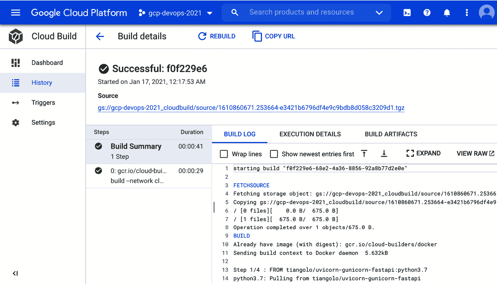

图 6.2 – 来自 Cloud Build 的构建日志

如果需要删除构建日志，则无法从 Google 创建的日志存储桶中删除日志。但是，可以从用户创建的日志存储桶中删除日志，或者通过删除包含一个或多个构建日志的用户创建的存储桶来删除日志。这需要用户具有访问 Cloud Storage 的权限以删除文件——通过 Cloud Storage，具体来说是需要具有 Storage Admin 或 Storage Object Admin 角色（具体取决于删除整个用户创建的存储桶还是删除特定的构建日志文件）。

## 管理访问控制

构建可以由用户或应用程序触发。根据 Google 的推荐做法，如果应用程序需要访问某项服务，则可以通过服务账户进行访问。因此，准确来说，Cloud Build 的访问控制可以通过**终端用户 IAM 角色**或**Cloud Build 服务账户**来管理。

### 终端用户 IAM 角色

Cloud Build 提供了一组预定义的 IAM 角色，可以提供精细的访问控制，并且可以与特定的工作角色对齐。这可以防止不必要的访问，并允许你实施最小权限原则。

以下表格总结了访问或执行 Cloud Build 操作所需的关键 IAM 角色：

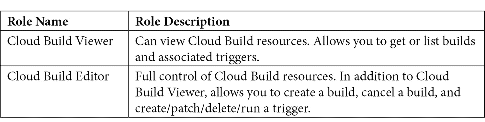

### Cloud Build 服务账户

Google 推荐在任务需要由应用程序执行或代表用户执行时使用**服务账户（SA）**。服务账户是一种特殊类型的账户，应用程序或虚拟机（VM）可以使用它来进行授权的 API 调用，但个人用户不能使用。在这种情况下的常规做法是创建一个 SA，并为该 SA 分配必要的权限，以便拥有该 SA 的应用程序可以执行必要的操作。

Cloud Build 会在启用 Cloud Build API 时为项目创建一个特定的 Cloud Build SA。此 Cloud Build SA 被分配了最小权限，例如 Cloud Storage。如果您希望使用其他服务，则需要更新 SA 以反映所需的权限。

为 Cloud Build SA 预先分配的权限集将基本允许 Cloud Build 代表用户执行以下操作：

+   创建、列出、获取或取消构建。

+   创建、修补、删除或运行构建触发器。

+   从 CSR 中拉取源代码。

+   在 Container Registry 中存储镜像并获取镜像。

+   在 Cloud Storage 中存储工件并获取工件。

+   在 Artifact Registry 中存储工件并获取工件。

+   在 Cloud Logging 中创建构建日志。

+   将构建日志存储在用户创建的日志存储桶中。

+   将构建更新推送到 Pub/Sub。

+   获取项目信息并列出项目。

本文结束了关于访问控制管理的主题，提供了所需的 IAM 角色的见解。接下来的主题将专注于执行构建过程时的最佳实践，旨在有效减少构建执行时间。

## Cloud Build 最佳实践 – 优化构建

减少构建时间有助于优化构建过程。考虑到重点是处理容器，提升构建速度有两种常见策略：

+   **构建更精简的容器**：作为该策略的一部分，如果不将构建时依赖相关文件和任何中间文件包含在容器镜像中，则可以减少容器的大小。

+   `--cache-from` 参数可以作为后续构建的起点使用。缓存的镜像将从注册中心检索。缓存的 Docker 镜像仅支持 Docker 构建，不支持云构建器。

除了构建更精简容器的通用策略来优化构建速度，Cloud Build 特别推荐以下最佳实践，这些实践也可以进一步提升构建速度：

+   Kaniko 缓存

+   用于缓存目录的 Cloud Storage

+   自定义 VM 大小

+   忽略不需要的文件

以下是上述最佳实践的详细信息。

### Kaniko 缓存

Kaniko 缓存基于开源工具 Kaniko，并且也是 Cloud Build 的一个特性，其中中间容器镜像层会直接写入到 Google 的 Container Registry，而无需显式的推送步骤。

要启用 Kaniko 缓存，作为构建配置文件 `cloudbuild.yaml` 的一部分，以下是一个可以包含它的代码片段：

```
steps: 
- name: 'gcr.io/kaniko-project/executor:latest'
  args:
  - --destination=gcr.io/$PROJECT_ID/image
  - --cache=true
  - --cache-ttl=XXh
```

以下是实施 Kaniko 缓存时应考虑的建议，通过 `kaniko-project` 云构建器实现：

+   使用 `kaniko-project/executor` 替代 `cloud-builders/docker`。

+   `destination` 标志应指向目标容器镜像。

+   `cache` 标志应设置为 `true`。

+   `cache-ttl` 标志应设置为所需的缓存过期时间。

或者，可以通过 gcloud CLI 启用 Kaniko 缓存，方法是运行以下命令：

```
gcloud config set builds/use_kaniko True
```

Kaniko 缓存通过在容器镜像注册表中存储和索引中间层，加速了构建执行时间，并最终节省了构建执行时间，因为它可以被后续构建重用。

### 用于缓存目录的 Cloud Storage

从概念上讲，这就像是一个缓存的 Docker 镜像。可以通过从 Cloud Storage 存储桶中复制上一个构建的结果来重用这些结果，同时新的结果也可以写回到 Cloud Storage 存储桶中。这个概念不仅限于 Docker 构建，还可以扩展到 Cloud Build 支持的任何构建器。

此外，Cloud Build 使用一个名为 `/workspace` 的默认工作目录，所有构建过程中的步骤都可以访问该目录。通过将步骤结果保存在默认工作目录中，可以将一个步骤的结果传递给下一个步骤。也可以通过在构建步骤中使用 `dir` 字段显式设置工作目录。

以下是一个构建配置文件的示例片段，其中使用了 Cloud Storage 来缓存目录：

```
steps: 
- name: gcr.io/cloud-builders/gsutil
  args: ['cp','gs://mybucket/results.zip','previous_results.zip']
  dir: 'my-cloud-build/examples'
# operations that use previous_results.zip and produce new_results.zip
- name: gcr.io/cloud-builders/gsutil
  args: ['cp','new_results.zip','gs://mybucket/results.zip']
  dir: 'my-cloud-build/examples'
```

上述示例还展示了如何在构建步骤中通过 `dir` 字段指定一个特定的工作目录 `my-cloud-build/examples`。与 Kaniko 缓存类似，云存储可以通过使用上一个构建的结果来优化构建速度。

### 自定义虚拟机大小

Cloud 构建是通过一个标准大小的托管虚拟机执行的。然而，Cloud Build 提供了一个选项，通过使用更高 CPU 配置的虚拟机来提高构建速度，这本质上是加速构建过程。通过指定 `--machine-type` 参数可以实现这一点。Cloud Build 特别提供了两种虚拟机类型，分别为 8 核和 32 核。具体选项如下：

+   `N1_HIGHCPU_8`

+   `N1_HIGHCPU_32`

+   `E2_HIGHCPU_8`

+   `E2_HIGHCPU_32`

以下是启动 Cloud Build 过程时指定虚拟机类型的 CLI 命令：

```
gcloud builds submit --config=cloudbuild.yaml \
  --machine-type=N1_HIGHCPU_8
```

### 忽略不需要的文件

Cloud Build 将代码目录上传到 Cloud Storage 位置。通过忽略与构建过程无关的文件，可以加速上传过程。这些文件可能包括第三方依赖项、编译后的代码、二进制文件或用于本地开发的 JAR 文件。此外，文档和代码示例对构建过程没有要求。这些文件可以作为 `gcloudignore` 文件的一部分来指定，以优化上传时间。

这完成了我们对 Cloud Build 及其关键构件的深入讲解，包括云构建器和构建配置、启动构建过程的可用选项、通过触发器自动化可用选项、查看存储在 Cloud Storage 中的构建结果、定义访问控制，以及推荐最佳实践来优化构建。

下一部分专注于制品管理的概念以及在与容器一起工作时使用 Container Registry 管理构建制品。

# 管理构建制品 – Container Registry

源代码管理是 CI 过程的第一步。接着是构建代码。代码可以根据各种触发点构建；可以是针对开发分支，也可以是在将 PR 合并到主分支时。代码构建过程可能会生成一个或多个制品。根据构建的代码性质，生成的制品可以是二进制文件、包、容器镜像或它们的组合。这些制品存储在注册表中，然后部署到计算环境中，并形成 CD 过程。在 CI 和 CD 过程之间，还有一个中间过程，其中构建制品被存储，然后随后部署。这被称为 **制品管理**。

制品管理充当单一真相源和 CI 与 CD 之间的关键集成点。许多制品管理系统提供版本控制、漏洞扫描能力、一致的配置以及统一的访问控制。

鉴于本书的主题是与容器一起工作，这种情况下的关键构建制品将是容器镜像。镜像通常存储在中央注册表中。最常见的容器注册表是 Docker Hub，用于存储公共 Docker 镜像。然而，在企业内部工作时，通常需要确保访问企业特定构建的容器镜像。在这种情况下，私有注册表比公共注册表更可取，因为私有注册表可以提供基于角色的访问控制，提供更多的安全性和治理。

Container Registry 是 GCP 的私有容器镜像注册表服务，支持 Docker 镜像清单 V2 和 OCI 镜像格式，包括 Docker。可以通过安全的 HTTPS 端点访问 Container Registry 服务，并允许用户从任何可能的计算选项推送或拉取镜像。

**Artifact Registry**

**制品注册表** 是 GCP 的托管服务，类似于 Container Registry，但还提供存储非容器制品（如 Java 包、Node.js 模块等）的选项。目前不是 GCP DevOps 专业考试的一部分。

## Container Registry – 关键概念

**Container Registry** 是 Google 的一种制品管理方法之一。与任何其他服务一样，它具有某些关键的结构和概念。以下子部分深入探讨这些细节。

### 启用/禁用 Container Registry

可以通过 GCP 控制台的 **APIs & Services** 部分启用或禁用 Container Registry 服务。此外，也可以通过以下命令在 CLI 中启用或禁用该服务：

```
# To enable container registry
gcloud services enable containerregistry.googleapis.com
# To disable container registry
gcloud services disable containerregistry.googleapis.com
```

### Container Registry 服务账户

与 Cloud Build 一样，当启用容器注册表时，会为当前项目创建一个 Google 管理的 SA（服务账户）。该 SA 允许容器注册表访问项目中的关键 GCP 服务，如 Pub/Sub 和 Cloud Storage。Google 通过将容器注册表服务代理角色分配给容器注册表 SA 来实现这一点。

### 容器注册表的结构

容器注册表服务中可能有一个或多个注册表。每个注册表由主机名、项目 ID 和镜像（标签或镜像摘要）标识。以下是两种可能的格式：

+   `HOSTNAME / PROJECT_ID / IMAGE:TAG`

+   `HOSTNAME / PROJECT_ID / IMAGE@IMAGE-DIGEST`

在前面的代码中，我们有以下内容：

+   `HOSTNAME`：指镜像存储的位置。镜像存储在 Cloud Storage 存储桶中。如果主机名是 `gcr.io`，则默认镜像存储在美国。此外，用户还可以指定特定的主机，如 `us.gcr.io`、`eu.gcr.io` 或 `asia.gcr.io`，其中每个主机都与特定的地理区域相关联，镜像存储于该区域。

+   `PROJECT_ID`：指特定的 GCP 项目 ID。

+   `IMAGE`：指镜像名称。在容器注册表中，注册表是按镜像名称列出的。单个注册表可以保存不同版本的镜像。添加 `:TAG` 或 `@IMAGE-DIGEST` 有助于区分具有相同镜像名称的镜像。如果未指定，则镜像会被标记为最新版本。

**示例**：

以下是特定镜像的注册表示例，其中镜像的版本通过添加标签或镜像摘要进行区分：

```
# Add image tag:
gcr.io/PROJECT-ID/my-image:tag1
# Add image digest:
gcr.io/PROJECT-ID/my-image@sha256:4d11e24ba8a615cc85a535daa17 b47d3c0219f7eeb2b8208896704ad7f88ae2d
```

这完成了关于容器注册表结构的主题了解，掌握这一点对于将容器镜像上传或下载到/从容器注册表至关重要。相关细节将在后续主题中详细介绍。

### 将镜像上传到容器注册表

构建过程完成后，会生成容器镜像作为构建工件。这些工件通常会在执行构建过程的本地目录中创建。这些本地 Docker 镜像需要上传到私有注册表，如容器注册表。上传镜像到容器注册表的过程，也可称为将镜像推送到容器注册表。

简而言之，将镜像推送到容器注册表有两个主要步骤：

1.  将本地镜像标记为注册表名称（如以下代码片段所示）：

    ```
    docker tag SOURCE_IMAGE HOSTNAME/PROJECT_ID/IMAGE
    #Example
    docker tag my-local-image gcr.io/gcpdevops-2021/my-gcr-image 
    ```

1.  将带标签的镜像推送到容器注册表（如以下代码片段所示）：

    ```
    docker push HOSTNAME/PROJECT-ID/IMAGE
    #Example
    docker push gcr.io/gcpdevops-2021/my-gcr-image
    ```

容器镜像可以推送到新的注册表或现有的注册表：

+   如果推送到一个新的注册表，即一个具有新主机名的注册表，则容器注册表会创建一个多区域存储桶。

+   如果推送到现有的注册表，则会使用镜像标签或镜像摘要创建新版本的镜像。如果两者都没有，则镜像会被标记为 `latest`。

    指定容器注册表的位置

    容器注册表的位置可以在主机名下指定。如果使用`gcr.io`，则默认位置是*美国*。如果需要使用特定的位置，则可以将主机指定为`eu.gcr.io`。

新创建的镜像可以使用以下 gcloud CLI 命令列出：

```
gcloud container images list –repository=HOSTNAME/PROJECT-ID
#Example
gcloud container images list –repository=gcr.io/gcpdevops-2021
```

这完成了将容器镜像上传或推送到 GCP 容器注册表的主题。现在，任何应用程序都可以通过从容器注册表下载镜像来部署新推送的镜像。下一个主题将涵盖此内容。

### 从容器注册表下载镜像

CD 过程依赖于 CI 过程的输出，CI 过程的输出本质上以 OCI 镜像的形式存储在像容器注册表这样的注册表中。因此，为了使 CD 过程能够继续进行，需要从容器注册表下载 Docker 镜像。从容器注册表下载镜像的过程与从容器注册表拉取镜像是同义的。

可以通过镜像标签或镜像摘要从容器注册表拉取镜像。如果两者都未指定，则会下载标签为`latest`的镜像（如下所示的代码片段）：

```
# Pull based on Image Tag
docker pull HOSTNAME/PROJECT-ID/IMAGE:TAG
# Pull based on Image-Digest
docker pull HOSTNAME/PROJECT-ID/IMAGE@IMAGE_DIGEST
# Pull without Image Tag or Image-Digest
docker pull HOSTNAME/PROJECT-ID/IMAGE
```

这完成了从容器注册表下载镜像的主题。要上传或下载镜像到容器注册表，用户或应用程序必须具有必要的访问控制权限。这将在下一个主题中详细讲解。

### 容器注册表访问控制

容器注册表是一个用于存储容器镜像的仓库。这些镜像物理上存储在 Cloud Storage 存储桶中。因此，为了从容器注册表推送或拉取镜像，用户或服务账户应被授予以下角色：

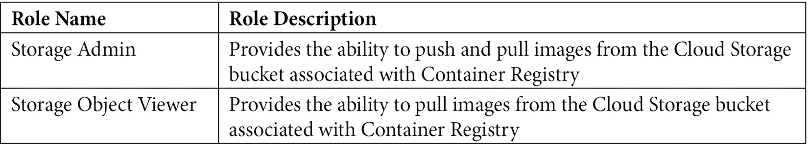

如果应用程序是使用 GCP 提供的计算选项进行部署的，例如 Compute Engine、App Engine 或 GKE，那么这些服务将拥有具有预定义角色集的默认服务账户。然而，不建议使用默认服务账户，因为这种做法不符合最小权限原则。作为替代方案，也可以让计算选项使用具有最小所需权限的自定义服务账户。无论哪种方式，了解这些服务账户的范围及其在 CD 过程中的影响都非常重要。接下来的主题将详细讨论这一点。

### 通过容器注册表的持续交付/部署集成

如前所述，制品管理是 CI 和 CD 之间的桥梁。GCP 提供了多种计算选项，可以将代码或应用程序作为 CD 过程的一部分进行部署。GCP 的每个计算选项都有与容器注册表交互和集成的方式，以下子节将详细介绍。

### 计算引擎

**计算引擎** 服务使用服务帐号或访问范围来识别身份并提供对其他服务的 API 访问。以下是成功推送或拉取源自计算引擎实例的镜像的可能性或潜在更改的总结：

+   默认的计算引擎服务帐号或默认访问范围提供对存储和服务管理的只读访问权限。这允许你从同一项目中的容器注册表下载或拉取镜像。

+   要推送镜像，应该使用读写存储访问范围，或者将默认的计算引擎服务帐号配置为具有存储对象管理员角色。

+   如果虚拟机实例使用的是非默认的计算引擎服务帐号，或者虚拟机实例位于不同于容器注册表的项目中，则应为服务帐号授予适当的权限，以访问容器注册表使用的存储桶。

### Google Kubernetes Engine

**Google Kubernetes Engine**（**GKE**）集群本质上是由代表节点池的 Google 计算引擎虚拟机组成的集合。这也意味着 GKE 使用在虚拟机实例上配置的服务帐号。因此，最终，GKE 对容器注册表的访问是基于授予虚拟机服务帐号的访问权限。因此，请参考之前关于 *计算引擎* 的小节，了解成功推送或拉取源自 GKE 中计算实例的镜像的可能性或潜在更改。

### App Engine flexible

**App Engine flexible** 支持 Docker 容器的部署。与 App Engine flexible 关联的默认服务帐号具有从容器注册表推送和拉取镜像所需的权限，前提是两者位于同一项目中。

如果应用引擎与容器注册表在不同的项目中，或者应用引擎使用的服务帐号与默认的应用引擎服务帐号不同，则应为与应用引擎关联的服务帐号授予适当的权限，以访问由容器注册表使用的存储桶。

本文完成了关于 GCP 计算选项如何与容器注册表集成的主题。在 GCP 提供的计算选项之外，还有几种用例，其中持续交付系统使用的计算选项并非 GCP 本地的。

下一部分将讨论第三方客户端如何访问 GCP 容器注册表中的工件的详细信息。

### 容器注册表身份验证方法

也有一些 Google Cloud 之外的计算选项，可能会通过从 Google Cloud 的容器注册表中拉取容器镜像来部署应用程序。此类计算选项被称为第三方客户端。**Red Hat Enterprise Linux (RHEL)** 集群是一个第三方客户端的示例，它是 Red Hat 提供的计算选项，可以从容器注册表中下载容器镜像。

除了确保第三方客户端具有拉取或推送镜像所需的访问控制外，第三方客户端必须在尝试推送或拉取镜像之前先对容器注册表进行身份验证。以下是第三方客户端可以使用的身份验证方法：

+   gcloud 凭证助手

+   独立凭证助手

第三方客户端如何与容器注册表进行身份验证的详细内容将在接下来的子章节中展开。

### gcloud 凭证助手

这是推荐的身份验证方法，并且要求安装 Google Cloud SDK 或使用 GCP 的 Cloud Shell。此方法基本上使用 gcloud 工具来配置身份验证。以下是使用此身份验证方法所需的步骤：

1.  以将执行 Docker 命令的 IAM 用户身份登录到 gcloud：

    ```
    # To configure authentication with IAM user credentials:
    gcloud auth login 
    ```

1.  如果目标是以服务帐号（SA）身份登录 gcloud，则运行以下 Docker 命令。此命令使用包含 SA 信息的 JSON 密钥文件，并检索一个有效期为 60 分钟的访问令牌：

    ```
    # To configure authentication with service account credentials:
    gcloud auth activate-service-account <service-account-name> --key-file=<key-file-name>
    ```

1.  使用以下命令配置 Docker，这将允许 Docker 进行容器注册表身份验证：

    ```
    gcloud auth configure-docker 
    ```

下一小节详细说明了如何将 Docker 独立凭证助手作为第三方客户端与 GCP 容器注册表交互的授权方法。

### 独立凭证助手

`docker-credential-gcr` 是 GCP 容器注册表的独立凭证助手。当未安装 Google Cloud SDK 或未使用 GCP Cloud Shell，但需要将 Docker 配置为与 GCP 容器注册表进行身份验证时，使用此身份验证方法。此凭证助手实现了 Docker 凭证存储 API，并支持更高级的身份验证方案，以便使用 GCP 容器注册表。它允许从应用程序默认凭证中获取凭证，并且还能够在没有明确登录操作的情况下生成凭证。有关 `docker-credential-gcr` 的更多细节，请参阅 [`github.com/GoogleCloudPlatform/docker-credential-gcr`](https://github.com/GoogleCloudPlatform/docker-credential-gcr)。

以下是将独立凭证助手用作身份验证方法所需的步骤：

1.  以将执行 Docker 命令的用户身份登录到机器。

1.  从 GitHub 发布页面下载 `docker-credential-gcr`：[`github.com/GoogleCloudPlatform/docker-credential-gcr/releases`](https://github.com/GoogleCloudPlatform/docker-credential-gcr/releases)。

1.  使用以下命令配置 Docker。在内部，凭证助手将使用一个通过 JSON 密钥文件提供的服务帐号（SA）：

    ```
    docker-credential-gcr configure-docker
    ```

### 容器分析

**容器分析** 是容器注册表和工件注册表的一个构件。这个构件的目的是分析推送到 GCP 容器注册表的镜像，以寻找可能存在的安全漏洞。漏洞扫描的元数据会被存储，并通过 API 提供供后续使用。该元数据随后会在授权过程中使用。

容器分析提供元数据存储和漏洞扫描的两个特定 API：

+   **容器分析 API**：启用元数据存储。元数据存储包括有关漏洞或构建信息的内容，也称为 *注释*。

+   **容器扫描 API**：启用跨项目的漏洞扫描。该过程包括扫描和持续分析，以发现可能导致系统故障的恶意活动或潜在漏洞。

以下是配置容器分析作为容器注册表一部分的步骤：

1.  启用容器分析 API：导航到 `Container Analysis API`，选择 **启用** 选项。

1.  启用容器扫描 API：导航到 `Container Scanning API`，选择 `按需扫描 API` 并启用它。

1.  导航到 **容器注册表**，在 **设置** 下，验证是否启用了 **漏洞扫描**。如果启用，**设置** 屏幕将类似于 *图 6.3*。如果没有启用，请启用它：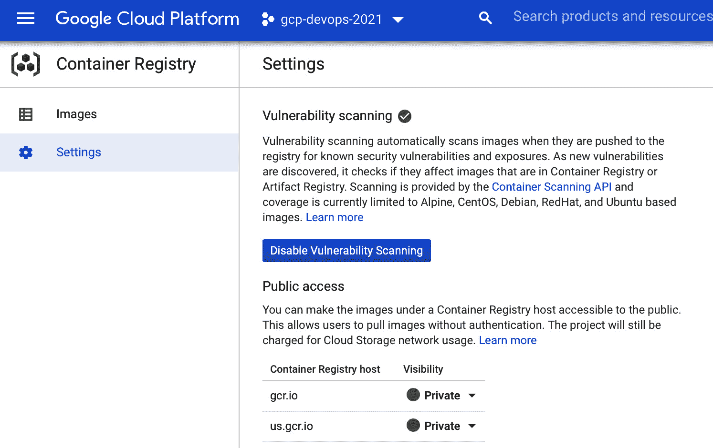

    图 6.3 – 在容器注册表中启用漏洞扫描

1.  现在，当镜像被推送到容器注册表时，容器分析和漏洞扫描将自动执行。结果将在 **容器注册表** 的 **镜像** 部分显示。*图 6.4* 表示容器分析的摘要：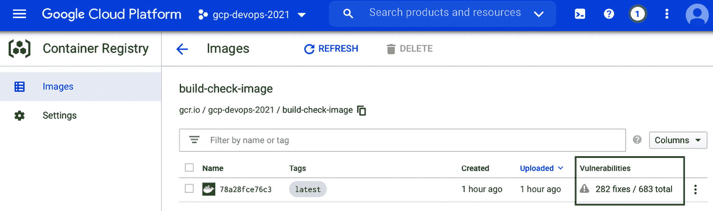

    图 6.4 – 新创建镜像的容器分析摘要

1.  所有扫描到的漏洞及其分类的详细信息，可以通过点击摘要查看。*图 6.5* 表示详细报告：

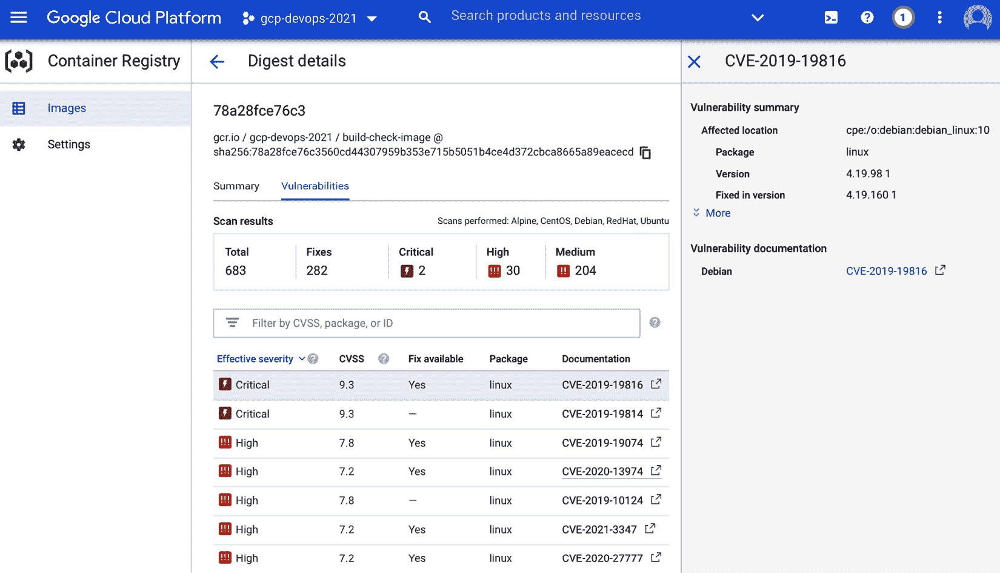

图 6.5 – 通过容器分析进行漏洞扫描的详细信息

这一部分完成了与 GCP 计算选项以及其他第三方 CD 系统如何与 GCP 容器注册表集成的多个子章节的内容。这也结束了对容器注册表相关几个关键因素的深入探讨。

下一部分是一个实操实验，旨在结合本章各节所学的多个概念。

# 实操实验 – 使用 Cloud Build 触发器构建、创建、推送和部署容器到 Cloud Run

该实践实验的目标是通过逐步演示如何自动构建、推送和部署代码到名为 Cloud Run 的计算选项。

Cloud Run

Cloud Run 是 GCP 提供的托管无服务器计算选项，它可以部署容器并抽象化基础设施管理。Cloud Run 可以根据流量从零扩展或收缩，并按按需付费模式收费。

该实践实验涵盖了 Cloud Build 和 Container Registry 的概念。以下是步骤的高层次拆解，每个步骤进一步细分为多个子步骤：

1.  在 Source Repositories 中创建一个空仓库

1.  创建一个 Cloud Build 触发器

1.  添加代码并推送到主分支

1.  代码演示：构建、创建、推送和部署容器镜像

1.  在 Cloud Build、Container Registry 和 Cloud Run 中查看构建结果

让我们详细了解这些步骤。

## 在 Source Repositories 中创建空仓库

以下是创建一个空仓库到 GCP 的 Source Repositories 所需的步骤：

1.  在 GCP 控制台中，导航到**Source Repositories**。

1.  使用`my-cloud-build-trigger`创建一个新仓库。

## 创建 Cloud Build 触发器

以下是创建一个针对特定仓库的 Cloud Build 触发器所需的步骤，触发器将在特定仓库事件发生时被调用（参见*图 6.6*）：

1.  在 GCP 控制台中，导航到**Cloud Build**下的**触发器**部分。

1.  选择**创建触发器**选项。

1.  输入触发器的适当名称，例如`build-on-push-to-master`。

1.  输入适当的描述。

1.  选择一个事件选项。可用的选项有**推送到分支**、**推送新标签**或**拉取请求**。在这个具体的示例中，选择**推送到分支**选项。

1.  选择一个源仓库。在这个具体的示例中，选择新创建的仓库，即`my-cloud-build-trigger`。

1.  选择一个分支。可以是`*`或特定的分支。在这个具体的示例中，输入选项为`^master$`。

1.  选择构建配置的来源。它可以是 Cloud Build 配置文件或 Dockerfile。在这个具体的示例中，选择`/cloudbuild.yaml`。

1.  创建 Cloud Build 触发器（参见*图 6.6*）：

![图 6.6 – 用于说明创建 Cloud Build 触发器的步骤]

](img/B15597_06_06.jpg)

图 6.6 – 用于说明创建 Cloud Build 触发器的步骤

## 添加代码并推送到主分支

我们已经创建了一个仓库并设置了一个针对该仓库的触发器。当代码推送到主分支时，触发器会构建代码。接下来的步骤是将代码添加到仓库并推送到主分支。以下步骤将演示这一过程：

1.  克隆空的仓库到本地 Git 仓库：

    ```
    gcloud source repos clone my-cloud-build-trigger --project=$GOOGLE_CLOUD_PROJECT
    #$GOOGLE_CLOUD_PROJECT is an environment variable that refers to the current project
    ```

1.  切换到新的本地 Git 仓库：

    ```
    cd my-cloud-build-trigger
    ```

1.  创建远程分支：

    ```
    git checkout -b feature/build-trigger
    ```

1.  从[`github.com/PacktPublishing/Google-Cloud-Platform-for-DevOps-Engineers/tree/main/my-cloud-build-trigger`](https://github.com/PacktPublishing/Google-Cloud-Platform-for-DevOps-Engineers/tree/main/my-cloud-build-trigger)复制`my-cloud-build-trigger`文件夹。

1.  添加文件、提交更改并推送到远程分支：

    ```
    git add *
    git commit -m "Adding files!"
    git push --set-upstream origin feature/build-trigger
    ```

1.  切换到主分支并修复上游：

    ```
    git checkout -b master
    git branch --unset-upstream
    ```

1.  将远程分支与主分支合并：

    ```
    git push –set-upstream origin git push -u master
    ```

## 代码讲解

一旦代码在前一步推送到主分支，配置的触发器就会生效，最终会构建代码、创建容器镜像、将容器镜像推送到容器注册表，并最终提供容器镜像部署的可行性。

`my-cloud-build-trigger` 仓库包含三种类型的文件：

+   应用程序代码

+   Dockerfile

+   构建配置文件

### 应用程序代码

应用程序代码代表运行应用程序的核心代码。在这个特定的案例中，代码位于`app/main.py`，是用 Python 编写的，并使用 FastAPI 框架创建了一个 Web 应用程序。以下是代码片段：

```
app = FastAPI()
@app.get("/")
def read_root():
    return {"Hello": "World"}
```

### Dockerfile

Dockerfile 代表了使用基础镜像构建应用程序代码并随后创建容器镜像所需的指令。以下是代码片段：

```
FROM tiangolo/uvicorn-gunicorn-fastapi:python3.7
COPY ./app /app
EXPOSE 8080
CMD ["uvicorn", "main:app", "--host", "0.0.0.0", "--port", "8080"]
```

### 构建配置文件

构建配置文件代表启动构建过程的配置。此外，它可以包括将容器镜像推送到容器注册表并随后进行部署的步骤。以下是代码片段：

```
steps:
- name: 'gcr.io/cloud-builders/docker'
  args: ['build', '-t', 'gcr.io/$PROJECT_ID/cloud-build-trigger', '.']
- name: 'gcr.io/cloud-builders/docker'
  args: ['push', 'gcr.io/$PROJECT_ID/cloud-build-trigger']
- name: 'gcr.io/cloud-builders/gcloud'
  args: ['run', 'deploy', 'cbt-cloud-run', '--image', 'gcr.io/$PROJECT_ID/cloud-build-trigger', '--region', 'us-central1', '--platform', 'managed', '--allow-unauthenticated'] 
```

在这个特定的示例中，配置文件有三个具体步骤：

1.  使用 Docker Cloud Builder 构建代码。代码从指定的目录中获取。在这种情况下，它是当前目录。

1.  在第一步中构建的代码创建了一个对云构建器本地的容器镜像。然后使用 Docker Cloud Builder 标记该镜像并将其推送到容器注册表。该容器镜像会推送到特定的仓库。

1.  在*步骤 2*中推送的镜像将在此步骤中用于部署到 Google 的 Cloud Run。

## 查看结果

在代码推送到主分支后，配置的触发器将启动构建过程。要查看构建结果，请导航到 GCP 控制台中**Cloud Build**的**历史记录**部分，并查找特定源代码库的构建结果（参见*图 6.7*）：

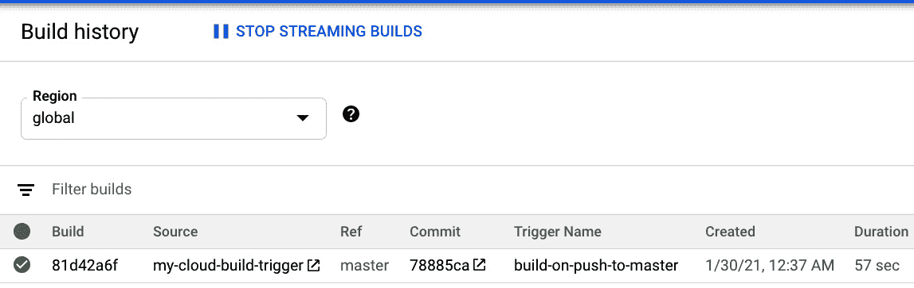

](img/B15597_06_07.jpg)

图 6.7 – 特定于 Cloud Build 触发器的构建历史摘要

要查看构建的详细信息，点击特定的构建。详情将显示执行 Dockerfile 和创建推送到容器注册表的容器镜像的步骤（参见*图 6.8*）：

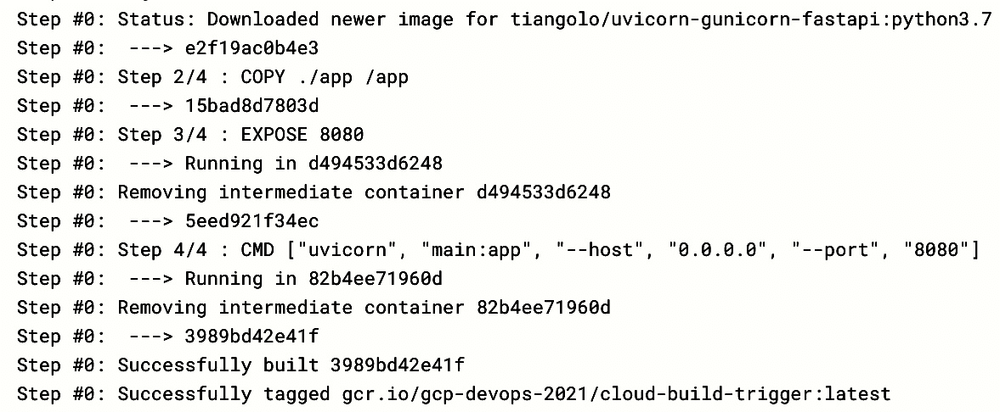

](img/B15597_06_08.jpg)

图 6.8 – 构建容器镜像并推送到容器注册表的日志

新创建的容器可以在**容器注册表**中找到（参考*图 6.9*）：

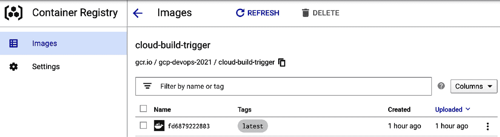

图 6.9 – 在容器注册表中查看容器镜像

构建日志的末尾将显示将容器镜像部署到 Cloud Run 的信息。这还包括访问应用程序的新增服务 URL（参考*图 6.10*）：

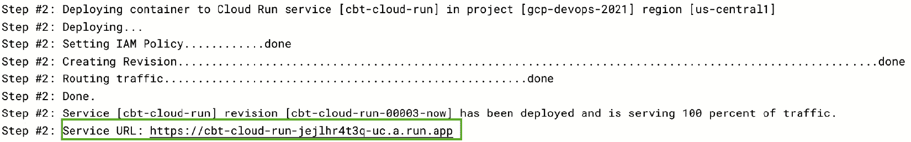

图 6.10 – 将容器日志部署到 Cloud Run

导航到高亮显示的服务 URL，查看在 Cloud Run 中部署的应用程序（参考*图 6.11*）：

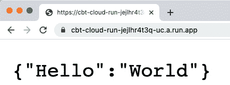

图 6.11 – 部署在 Cloud Run 中的容器镜像

这完成了动手实验，我们在开发人员更改代码并将其推送到主分支时，自动将应用程序部署到 Cloud Run。这演示了一个使用 GCP 原生构件（如 Cloud Build 和 Container Registry）构建的自动化 CI/CD 流程。

# 总结

在本章中，我们讨论了 Google CI/CD 工作流建设中的两个关键服务。这些服务是 Cloud Build 和 Container Registry。Cloud Build 对于构建应用程序代码并将容器镜像输出作为构建工件至关重要。Container Registry 使用工件管理的概念来管理这些构建工件。本章深入讨论了每个服务的关键构件，并以一个动手实验作为结尾，用户可以在检测到代码更改时通过配置的触发器自动部署代码到 Cloud Run。

Google 强烈建议使用容器部署应用程序，特别是针对 GKE，这是除 App Engine 灵活环境和 Cloud Run 之外的一个关键容器部署选项。GKE 的关键概念将在接下来的三章中讨论，其中包括了解原生 Kubernetes 的核心功能、学习 GKE 特定功能以及有关加强 GKE 集群的主题。

# 需要记住的要点

以下是一些需要记住的重要点：

+   Cloud Build 可以从 Google Cloud Storage、CSR、GitHub 或 Bitbucket 导入源代码。

+   Cloud builders 是运行构建过程的容器镜像。

+   Google 管理的 builders 是预构建镜像，可用于执行一个或多个构建步骤。

+   社区贡献的 builders 是开源的构建器，但不是预构建镜像，只有源代码可用。

+   构建配置是一个配置文件，封装了执行构建相关任务的步骤，写成 `yaml` 或 `json` 格式。

+   手动调用和通过触发器进行自动构建是通过 Cloud Build 调用构建过程的两种主要选项。

+   与 Cloud Build 相关的日志存储在 Cloud Storage 和 Cloud Logging 中。

+   Cloud Build 编辑器提供对 Cloud Build 资源的完全控制。

+   启用 Cloud Build API 后，Cloud Build 为项目创建一个特定的 Cloud Build 服务账户（具有最小权限）。

+   提高构建速度的两种常见策略是构建更精简的容器和使用缓存的 Docker 镜像。

+   Kaniko 缓存是 Cloud Build 的一项功能，其中中间容器镜像层直接写入 Google 的容器注册表。

+   Cloud Build 提供了一种通过使用更高 CPU 的虚拟机来加速构建速度的选项。

+   在 Cloud Build 过程中，可以使用 `gcloudignore` 文件忽略不需要的文件。

+   容器注册表是 GCP 的私有容器镜像注册服务，支持 Docker 镜像清单 V2 和 OCI 镜像格式。

+   如果使用 `gcr.io`，则默认位置被视为*美国*。

+   存储管理员提供将镜像推送和拉取到与容器注册表关联的 Cloud Storage 存储桶中的能力。

+   gcloud 凭据助手和独立凭据助手是第三方客户端可以用来与容器注册表进行身份验证的可能身份验证方法。

+   容器分析是一个提供软件制品的漏洞扫描和元数据存储的服务。

+   容器分析 API 使元数据存储成为可能，而容器扫描 API 使漏洞扫描成为可能。

# 深入阅读

有关 Cloud Build 和容器注册表的更多信息，请阅读以下文章：

+   **Cloud Build**：[`cloud.google.com/cloud-build`](https://cloud.google.com/cloud-build)

+   **容器注册表**：[`cloud.google.com/container-registry`](https://cloud.google.com/container-registry)

# 实践测试

请回答以下问题：

1.  选择 Cloud Build 可以从哪些来源导入源代码的所有可能选项（多选）：

    a) GitHub 和 Bitbucket

    b) Google Cloud Storage

    c) CSR

    d) 上述都不是

1.  Cloud Build 需要一个构建配置文件。选择表示此文件的选项：

    a) `cloudbuild.json`，`cloudbuild.xml`

    b) `build.json`，`build.yaml`

    c) `cloudbuild.json`，`cloudbuild.yaml`

    d) `build.json`，`build.xml`

1.  选择将配置 Cloud Build 在构建过程中将镜像存储到容器注册表中的命令：

    a) `push` 命令

    b) `docker put` 命令

    c) `put` 命令

    d) `docker push` 命令

1.  以下哪些选项可以用来存储容器镜像？

    a) 容器分析

    b) Cloud Build

    c) 容器注册表

    d) CSR

1.  选择存储在授权过程中稍后使用的受信任元数据的选项：

    a) 容器注册表

    b) 容器分析

    c) 容器扫描

    d) 容器制品库

1.  选择代表通过执行 Dockerfile 中的每个指令创建的中间镜像的选项：

    a) Docker 镜像

    b) Dockerfile

    c) Docker 层

    d) Docker 守护进程

1.  选择允许您在同一物理硬件上运行多个应用程序的选项：

    a) 操作系统

    b) 虚拟化

    c) 虚拟机监控程序

    d) 上述都包括

1.  选择所有适用于 Cloud Build 的选项：

    a) 托管服务

    b) 无服务器

    c) 既有(a)也有(b)

    d) 以上都不是

1.  以下哪个选项不是用户在构建步骤中可以提供的有效选项（选择一个）：

    a) `name`

    b) `args`

    c) `env`

    d) `uniqueid`

1.  构建配置文件可以配置为存储 Cloud Build 日志。选择适当的选项来存储日志：

    a) Cloud Storage

    b) Cloud Logging

    c) 既有(a)也有(b)

    d) 以上都不是

# 答案

1.  (a) – (b) 和 (c)。

1.  (c) – `cloudbuild.json`，`cloudbuild.yaml`。

1.  (d) – `docker push`命令。

1.  (c) – 容器注册表。

1.  (b) – 容器分析。

1.  (c) – Docker 层。

1.  (b) – 虚拟化。

1.  (c) – 托管服务和无服务器。每个无服务器服务都是托管服务。

1.  (d) – `uniqueid`。正确选项是`id`。

1.  (c) – Cloud Storage 和 Cloud Logging。
