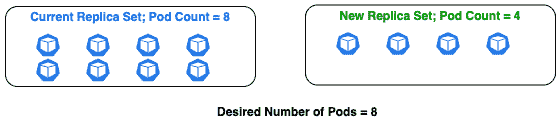

# 第七章：理解 Kubernetes 基础以部署容器化应用

最后的两章（*第五章*，*使用云源代码库管理源代码*，以及 *第六章*，*使用 Cloud Build 构建代码并推送到容器注册表*）集中讨论了通过 Google Cloud 服务来管理源代码、使用 Cloud Build 构建代码以及通过容器注册表创建镜像文件。鉴于本书的重点是部署容器化应用，接下来的三章（从 *第七章*，*理解 Kubernetes 基础以部署容器化应用*，一直到 *第九章*，*使用 GKE 安全构造保护集群*）围绕通过 Kubernetes 部署容器化应用的核心概念、通过 **Google Kubernetes Engine**（**GKE**）轻松管理集群，以及 GKE 中一些关键的安全功能，旨在加强 Kubernetes 集群的安全性。

Kubernetes，或 K8s，是一个开源的容器编排系统，可以运行容器化的应用程序。Kubernetes 起源于 Google 内部的集群管理工具，后来于 2014 年捐赠给 **Cloud Native Computing Foundation**（**CNCF**）作为开源项目。本章将重点介绍容器化部署所需的 Kubernetes 基础知识，包括理解集群结构，并了解 Kubernetes 对象，特别是与工作负载、部署策略和应用程序调度约束相关的内容。Google 将 Kubernetes 开源并捐赠给 CNCF。本章并未深入探讨如何设置 Kubernetes 集群，搭建开源版本的 Kubernetes 需要付出较大努力并进行手动干预。

Google 提供了一个托管版本的 Kubernetes，称为 Google Kubernetes Engine，简称 GKE。本质上，Kubernetes 的基础知识同样适用于 GKE。然而，GKE 使得设置 Kubernetes 集群变得更容易，并且包括了一些促进集群管理的附加功能。下一章将重点介绍 GKE 的核心功能，并包括创建集群的步骤。然而，本章主要关注并详细阐述了 Kubernetes 的基础知识，这也是 GKE 的核心内容，有助于让过渡到 GKE 更加顺利。

本章介绍了 Kubernetes 作为容器编排工具的优势，并提供了以下主题的详细信息：

+   **Kubernetes**：简要介绍

+   **Kubernetes 集群解剖**：深入探讨构成 Kubernetes 集群的结构以及构成主控平面的组件

+   **Kubernetes 对象**：提供一个关于用于部署工作负载的关键 Kubernetes 对象的高级概述。

+   **调度和与 Pods 交互**：详细说明了在 Kubernetes 上调度应用程序时评估的约束和涉及的交互。

+   **Kubernetes 部署策略**：详细说明了潜在的部署策略，从本质上重新创建应用程序的选项，到确保零停机时间的部署选项，再到将特定流量转移到新应用程序的选项。

# 技术要求

有四个主要的技术要求：

+   一个有效的**Google Cloud Platform**（**GCP**）账户，以便动手操作 GCP 服务: [`cloud.google.com/free`](https://cloud.google.com/free)。

+   安装 Google Cloud SDK: [`cloud.google.com/sdk/docs/quickstart`](https://cloud.google.com/sdk/docs/quickstart)。

+   安装 Git: [`git-scm.com/book/en/v2/Getting-Started-Installing-Git`](https://git-scm.com/book/en/v2/Getting-Started-Installing-Git)。

+   安装 Docker: [`docs.docker.com/get-docker/`](https://docs.docker.com/get-docker/)。

# Kubernetes – 简介

**容器**是一个软件单元，封装了代码及其依赖项，如库和配置文件。与在物理或虚拟机上运行应用程序相比，容器使得应用程序能够更快、更可靠地在不同计算环境中运行。容器使得构建使用微服务设计模式的应用程序变得更容易。它们对持续开发、集成和部署概念至关重要，因为可以对容器镜像进行增量更改，并迅速部署到支持进程隔离的计算环境中。

由于容器轻量且易于部署，组织可能会将其应用程序部署为多个容器。这带来了挑战，因为一些应用程序可能需要彼此交互。此外，应用程序的生命周期也应该得到监控和管理。例如，如果一个应用程序因资源限制而崩溃，则应提供该应用程序的另一个实例。同样，如果流量突然激增，应用程序应横向扩展，而当流量恢复正常时，应用程序应随之缩减。

扩展操作（向上或向下）应自动进行，而不是手动进行。这就需要容器编排，接下来将讨论这一主题。

## 容器编排

**容器编排**涉及管理容器的生命周期，特别是在大型动态环境中。容器编排可以控制和自动化诸如资源配置、部署、维持冗余、确保可用性以及通过根据需要上下扩展来处理变化流量等任务。

此外，容器编排还可以处理以下场景：

+   在主机节点故障时，将容器从一个主机节点迁移到另一个主机节点。

+   如果容器消耗的资源超过预期，设置驱逐策略。

+   提供持久存储卷的访问权限，以防容器重启。

+   通过存储密钥/秘密来确保容器之间的安全交互。

+   监控容器的健康状态。

**Kubernetes** 源自 Borg——一个内部的 Google 项目，实际上是一个集群管理器，用于运行大规模的容器化工作负载，以支持 Google 搜索等核心 Google 服务。Kubernetes 是 Borg 的下一代集群管理器。Kubernetes 中最流行的概念来自 Borg，例如 Pods、服务、标签和每个 pod 的 IP 地址。

替代容器编排选项

Docker Swarm、Apache Mesos、OpenShift 等是 Kubernetes 之外的一些容器编排替代选项。Docker Swarm 易于入门并设置集群，但在扩展方面功能有限。Mesos 是一个集群管理器，最适合大规模系统，并以最大冗余设计。它在功能和配置上较为复杂，适用于 Hadoop 和 Kafka 等工作负载，但不适用于中小型系统。

接下来的部分总结了 Kubernetes 的主要特点。

## Kubernetes 特性

以下是 Kubernetes 中的一些关键特点：

+   **声明式配置**：Kubernetes 以声明性方式管理基础设施，换句话说，Kubernetes 监控当前状态并采取必要的措施，确保当前状态与期望状态一致。

+   **自动化**：Kubernetes 的声明式配置实现本身就支持自动化。此外，Kubernetes 允许广泛的用户偏好和配置。因此，Kubernetes 可以根据多种条件自动扩展或缩减容器化应用程序，资源利用率或资源限制只是其中的一些条件。

+   **有状态与无状态**：Kubernetes 支持有状态和无状态应用程序。在有状态应用程序的情况下，用户的状态可以持久存储。此外，Kubernetes 还支持批处理任务和守护进程任务。

+   **容器管理**：Kubernetes 支持基础设施即服务的功能，如日志记录、监控和负载均衡。

下一部分概述了 Kubernetes 部署的结构，并深入探讨其关键组件及其功能。

# Kubernetes 集群结构

Kubernetes 集群是具有计算能力的机器集合。这些机器可以是实际的物理计算机，甚至可以是 **虚拟机** (**VMs**)。

关于云部署，Kubernetes 集群将是虚拟机的集合。每个虚拟机被称为一个节点。集群中的节点被分类为*主节点*或*工作节点*。工作节点运行在容器中部署的应用程序。主节点运行控制平面组件，负责协调工作节点之间的任务。

*为了方便参考，本章中运行控制平面组件的节点将称为主节点，而工作节点将称为节点。*

主节点有以下职责：

+   它跟踪集群中所有节点的信息，例如节点正在运行的应用程序或容器。

+   它通过根据要求（如资源、亲和性或反亲和性约束）识别节点来调度应用程序到节点上。

+   它确保始终按照部署规范运行所需数量的实例，并协调集群中的所有操作。

*图 7.1* 显示了一个 Kubernetes 集群的示意图，该集群包括主节点和节点，这些节点由具备计算能力的机器组成：


图 7.1 – Kubernetes 集群概述

主节点通过一组关键组件执行其职责，这些组件构成了**Kubernetes 控制平面**，将在接下来的主题中详细介绍。

## 主节点组件 – Kubernetes 控制平面

Kubernetes 控制平面由一组组件组成，这些组件负责在集群内进行操作决策并响应集群特定的事件。事件可能包括但不限于，当平均 CPU 利用率超过特定配置的阈值时，按应用程序的需求扩展实例数量。

以下是 Kubernetes 控制平面的关键组件：

+   **kube-apiserver**：Kubernetes 的前端，用于集群交互

+   **etcd**：用于存储集群特定信息的分布式键值存储

+   **kube-scheduler**：负责在节点之间分配工作负载

+   **kube-controller-manager**：跟踪节点或应用程序是否出现故障

+   **cloud-controller-manager**：嵌入云特定的控制逻辑

*图 7.2* 显示了在主节点上运行并组成 Kubernetes 控制平面的组件示意图：


图 7.2 – 主节点上的 Kubernetes 控制平面

控制平面组件可以在集群中的任何机器上运行，但建议运行在相同的机器上并避免使用任何特定于用户的容器。构建高可用集群时，也可以拥有多个控制平面。每个关键组件将在接下来的子章节中介绍。

### kube-apiserver

`HTTP`、`gRPC` 和 `kubectl`）。控制平面的所有其他组件都可以视为 `kube-apiserver` 的客户端。此外，`kube-apiserver` 还负责认证、授权和管理准入控制。

认证、授权和准入控制

从集群的角度来看，认证是关于谁可以与集群交互（这可以是用户或服务账户）；授权是关于哪些特定操作被允许，准入控制表示一组插件，这些插件可以限制创建、删除、修改或连接代理的请求。ResourceQuota 是一个准入控制器的例子，其中一个命名空间可以被限制只使用一定容量的内存和 CPU。

任何对集群的查询或更改都由 `kube-apiserver` 处理。它还通过部署多个实例来水平扩展，以处理对集群的传入请求。

### etcd

`etcd` 是一个分布式键值存储，Kubernetes 使用它来存储管理集群所需的信息，例如集群配置数据。这些数据包括节点、Pods、配置、密钥、账户、角色和绑定。当对集群发出 `get` 请求时，信息将从 `etcd` 中检索。对集群发出的任何 `create`、`update` 或 `delete` 请求，只有当更改反映在 `etcd` 中时，才算完成。

### kube-scheduler

`kube-scheduler` 考虑多个因素，例如应用程序的资源需求、节点可用性、亲和性和反亲和性规范。亲和性和反亲和性规范是政策定义，允许将某些应用程序部署到特定节点，或防止将应用程序部署到特定节点。

### kube-controller-manager

`kube-apiserver` 确保集群的当前状态与期望状态匹配。`kube-controller-manager` 负责集群的实际运行，并通过使用多个控制器功能来完成这项工作。例如，节点控制器在节点离线时监视并响应。其他示例包括复制控制器、命名空间控制器和端点控制器。

### cloud-controller-manager

**cloud-controller-manager** 包含控制器功能，使 Kubernetes 能够与云提供商的服务进行集成。控制器功能负责处理与云提供商特定的构造，如网络、负载均衡器和存储卷。

主控接收到执行特定操作的请求后，控制平面中的组件调度、计划并管理将在节点上执行的操作。Kubernetes 本身并没有开箱即用的集成（比如与 Google 或 AWS 的集成）。节点上的操作由一组组成节点控制平面的组件执行，接下来的子章节将详细介绍这些组件。

## 节点组件

节点从主节点接收指令，特别是从`kube-apiserver`。节点负责运行部署在容器中的应用程序，并在集群内建立服务间的通信。节点通过使用一组关键组件来执行这些职责。这些组件如下：

+   `kube-apiserver`并根据 Pod 规范运行容器

+   **kube-proxy**：一个网络代理，允许服务之间的通信

+   **容器运行时**：负责运行容器的软件

*图 7.3*展示了构成节点控制平面的组件示意图：


](img/B15587_07_03.jpg)

图 7.3 – 节点控制平面组件

节点组件在集群中的每个工作节点上运行，并提供 Kubernetes 运行时环境。每个工作节点的关键组件将在接下来的主题中介绍。

### kubelet

`kube-apiserver`通过`kubelet`（节点的代理）与节点连接。`kubelet`监听指令，并在接收到指令时部署或删除容器。`kubelet`不管理那些不是由 Kubernetes 创建的容器。

### kube-proxy

`kube-proxy`在集群中的每个节点上运行。

### 容器运行时引擎

`containerd`和 CRI-O。

Kubernetes 弃用 Docker 作为容器运行时引擎

根据 Kubernetes v1.20 的发布说明，`dockershim`将被弃用，并且从 v1.22 开始无法使用。`dockershim`是`kubelet`中的一个模块，是 Kubernetes 社区提出的临时解决方案，用于将 Docker 作为容器运行时。由于维护负担，`dockershim`将被弃用，Kubernetes 社区将只维护 Kubernetes 的`containerd`和 CRI-O，它们是符合 CRI 标准的运行时示例。

这完成了对 Kubernetes 集群结构的深入探讨，具体包括来自主控制平面和节点控制平面的组件。主控制平面内部的通信由`kube-api`服务器驱动，`kube-api`服务器将指令发送到相应节点的`kubelet`。`kubelet`执行`kube-api`服务器发送的指令。*图 7.4*展示了整个集群结构的示意图：


](img/B15587_07_04.jpg)

图 7.4 – Kubernetes 集群结构

需要理解的是，任何针对 Kubernetes 对象的操作，如创建、修改或删除，只能通过 Kubernetes API 来执行。这些操作也可以通过 CLI 使用`kubectl`命令执行。接下来的主题将详细介绍如何使用`kubectl`命令。

## 使用 kubectl

`kubectl` 通常由管理员使用。`kubectl` 使得可以对特定对象类型及其对象名称执行操作，如获取或删除，并支持请求参数。`kubectl` 与主节点上的 `kube-apiserver` 通信，并将 CLI 发出的命令转换为 API 调用。`kubectl` 可用于创建 Kubernetes 对象、查看现有对象、删除对象以及查看/导出配置。`kubectl` 的语法结构如下：

```
#kubectl syntax
kubectl [command] [type] [name] [flags]
#Example – Command to get specification of a specific pod called 'my-pod' in yaml format
kubectl get pod my-pod -o=yaml
```

使用 `kubectl` 命令的第一步是配置集群的凭证，例如集群名称和位置。`kubectl` 将此配置存储在一个名为 `config` 的文件中，并将文件保存在主目录下的隐藏文件夹 `.kube` 中。可以使用 `view` 命令检索当前配置：

```
# Get current config
kubectl config view
```

集群上的操作是通过 Kubernetes 对象执行的。每个对象都有特定的用途和功能。Kubernetes 中有许多这样的对象。接下来的部分介绍了 Kubernetes 对象的概念，并详细介绍了最常用的对象。

# Kubernetes 对象

Kubernetes 对象是一个持久化实体，表示意图的记录。对象可以使用 **YAML** 配置定义。它将具有两个主要字段——spec 和 status。spec 表示规范，status 表示期望的状态。对象创建后，Kubernetes 系统将确保该对象按指定的声明式配置存在。

Kubernetes 支持多种对象类型。每种对象类型都有其特定的用途。以下是本章将使用的一些关键 Kubernetes 对象，这并不是一个详尽无遗的列表：

+   Pods – Kubernetes 中最小的原子单位

+   部署（Deployment）– 为 Pods 和 ReplicaSets 提供声明式更新

+   有状态集（StatefulSet）– 管理有状态的应用，并保证顺序

+   守护进程集（DaemonSet）– 在每个节点上运行 Pod 的副本

+   任务（Job）– 创建一个或多个 Pod，并会继续重试执行，直到指定数量的 Pod 成功终止

+   CronJob – 一个基于 cron 表达式的定时任务

+   服务（Services）– 暴露运行一个或多个 Pod 的应用

部署（Deployment）、副本集（ReplicaSet）、有状态集（StatefulSet）、守护进程集（DaemonSet）、任务（Jobs）和定时任务（CronJobs）被专门分类为 **工作负载资源（Workload Resources）**。所有这些工作负载资源都运行一个或多个 Pod。本章将详细介绍上述 Kubernetes 对象。请注意，提供的信息从对象功能的角度并不全面，而是提供了对象目的的深入回顾。

## Pod

**Pod** 是一个 Kubernetes 对象，是 Kubernetes 集群中最小的可部署计算单元。应用程序代码存在于容器镜像中，容器镜像通过容器运行，容器在 Pod 内运行。Pod 存在于节点内部。

一个 Pod 可以包含一个或多个容器。Pod 提供了一个规范，说明如何运行这些容器。Pod 中的容器共享文件系统、命名空间和网络资源。Pod 还分配了一组端口或端口范围。Pod 中的所有容器具有相同的 IP 地址，但端口不同。Pod 内的容器可以通过本地主机上的端口号进行通信。以下是一个声明式的 Pod 规范，用于运行一个 `nginx` 容器：

```
apiVersion: v1
kind: Pod
metadata:
  name: my-nginx
spec:
  containers:
  - name: nginx
    image: nginx:1.14.2
    ports:
containerPort:80
```

以下是一个等效的命令式命令，用于创建类似的 Pod：

```
kubectl run my-nginx –image=nginx
```

什么是 CrashLoopBackOff？

在某些情况下，Pod 尝试启动、崩溃、再次启动，然后再次崩溃；本质上，这是一个 Pod 报告的情况，表示 Pod 中的容器在多次尝试后未能启动。

在 Kubernetes 平台上，Pod 是最小的单位，并运行一个或多个容器。如果多个容器形成一个服务的整体单元，则 Pod 包含多个容器。Sidecar 模式是一个常见的实现方式，Pod 中有多个容器。此模式广泛应用于 ETL 特定的用例。例如，`hello-world` 容器的日志需要实时分析。`logs-analyzer` 是一个专门用于分析日志的应用程序。如果每个容器分别运行在其各自的 Pod 中，名为 `pod-hello-world` 和 `pod-logs-analyzer`，那么 `logs-analyzer` 容器可以通过 `GET` 请求获取 `hello-world` 容器的日志。参考 *图 7.5*：


](img/B15587_07_05.jpg)

图 7.5 – 不同 Pods 中容器之间的通信

然而，由于这两个容器位于不同的 Pod 中，网络延迟会最小化。如果这两个容器都属于同一个 Pod，形成一个 Sidecar 模式，即 `pod-hello-world-etl`，那么该 Pod 将包含两个容器——`logs-analyzer` 作为侧车容器，将分析来自另一个容器 `hello-world` 的日志。然后，这些容器可以在本地主机上进行通信，因为它们共享相同的网络接口，实现实时通信。参考 *图 7.6*：


](img/B15587_07_06.jpg)

图 7.6 – Sidecar 模式中容器之间的通信

使用单个包含多个容器的 Pod，可以让应用程序作为一个整体运行，并减少网络延迟，因为容器之间在相同的网络接口上进行通信。以下是一个声明式的 Pod 规范，运行多个容器，并按照 *图 7.6* 中所示的特定示例：

```
apiVersion: v1
kind: Pod
metadata:
  name: pod-hello-world-etl
spec:
  containers:
  - name: hello-world
    image: hello-world
    ports:
    - containerPort:8059
  - name: logs-analyzer
    image: custom-logs-analyzer:0.0.1
    ports:
    - containerPort:8058
```

Job 和 CronJob

Job 和 CronJob 是工作负载资源。Job 代表执行 Pod 的任务。如果任务执行成功，Job 就完成了，换句话说，Pod 会成功运行并完成指定次数。如果删除一个 Job，则与该 Job 相关的 Pod 也会被删除。如果 Job 被挂起，则活动 Pod 会被删除。多个 Job 可以并行运行。CronJob 是一种工作负载资源，实际上是一个通过 cron 表达式设置了调度的 Job。

*图 7.7* 汇总了与单容器 Pod `my-nginx` 和多容器 Pod `pod-hello-world-etl` 相关的示例，并说明了这些 Pod 如何在节点内潜在地连接：


图 7.7 – 节点内的 Pod 连接性

Pods 本质上是短暂的，Pod 关联的存储也是如此。因此，Pods 更适合无状态应用程序。然而，Pods 也可以用于有状态应用程序，但在这种情况下，Pods 应该附加到持久存储或卷上。Pods 也旨在运行单个应用程序实例。要进行水平扩展，应使用多个 Pod 实例。这被称为复制。因此，Pods 不能单独进行扩展。

活跃性、就绪性和启动探针

活跃性探针用于检查应用程序是否按预期运行，如果没有，容器将被重启。就绪性探针用于检查应用程序是否已启动并准备好接收流量。启动探针指示容器应用程序何时启动。如果配置了启动探针，则在启动探针成功之前，将禁用活跃性和就绪性检查。有关更详细的信息，请参阅[`kubernetes.io/docs/tasks/configure-pod-container/configure-liveness-readiness-startup-probes/`](https://kubernetes.io/docs/tasks/configure-pod-container/configure-liveness-readiness-startup-probes/)。

Kubernetes 使用特定的工作负载资源来创建和管理多个 Pods。最常见的资源是 Deployment、StatefulSet 和 DaemonSet，接下来的子章节将详细介绍这些资源。

## 部署

**Deployment** 是一个 Kubernetes 对象，它提供了 Pod 和 ReplicaSet 的声明式更新。Deployment 是 Kubernetes API 组中的一部分，属于应用程序组。

API 组

API 组是一种扩展 Kubernetes API 的方式。所有支持的 API 请求或未来的请求都被放置在特定的组中以便于分类，并包括版本控制。最常见的组是核心组，也称为传统组。核心组通过 `apiVersion` 指定为 `v1`。Pods 属于核心组。Deployment 属于应用程序组，并通过 `apiVersion` 指定为 `apps/v1`。

部署提供了一种声明性方式来管理一组 Pod 副本。部署规范包括 Pod 模板、Pod 规范和所需的 Pod 副本数。集群将有控制器不断监视并工作以保持所需状态，并根据需要创建、修改或删除副本 Pods。部署控制器根据匹配的标签选择器来识别 Pod 副本。以下是一个声明性规范，封装了三个 **nginx** Pod 副本的部署：

```
apiVersion: apps/v1
kind: Deployment
metadata:
  name: my-deploy
  labels:
    app: nginx
spec:
  replicas: 3
  selector:
    matchLabels:
      app:nginx
  template:
    metadata:
      labels:
        app: nginx
    spec:
      containers:
      - name: nginx
        image: nginx
        ports:
        - containerPort: 80
```

以下是一组等效的命令，用于创建类似的部署：

```
kubectl create deployment my-deploy --image=nginx
kubectl scale –replicas=3 deployments/my-deploy
```

部署支持使用 **HorizontalPodAutoscaler**（**HPA**）概念进行自动扩缩，基于 CPU 使用率等指标。以下是实现 HPA 的命令。HPA 将在 *第八章* 中详细讨论，*理解 GKE 基础知识以部署容器化应用程序*，该部分重点介绍 GKE：

```
kubectl autoscale deployment my-deploy --cpu-percent=80 --min=5 --max=10
```

部署可以使用滚动更新策略进行更新。例如，如果镜像版本被更新，则会创建一个新的 ReplicaSet。滚动更新将确保部署将 Pods 从旧的 ReplicaSet 逐步迁移到新的 ReplicaSet，从而确保 0% 的停机时间。如果在执行滚动更新时发生错误，新的 ReplicaSet 将永远无法达到 *Ready* 状态，而旧的 ReplicaSet 不会终止，从而实现 0% 的停机时间。部署和 Pods 通过标签连接。每个 Pod 都会被分配一个标签。部署具有标签选择器。因此，任何部署的更新都会按标签匹配的 Pods 进行推广。

部署非常适合无状态应用程序，其中请求可以由任一副本 Pod 以相似方式处理。然而，还有一种资源是有状态的，称为 StatefulSets。下一个主题将介绍这一内容。

## StatefulSets

`sample`，则 Pod 的名称将是 `sample-0`。如果有三个副本，则会创建名为 `sample-1` 和 `sample-2` 的额外 Pods。这与部署完全不同，在部署中，所有 Pods 共享相同的卷。

以下是具有三个副本的 StatefulSet 的声明性规范：

```
apiVersion: apps/v1
kind: StatefulSet
metadata:
  name: sample
spec:
  selector:
    matchLabels:
      app: nginx
  serviceName: nginx
  replicas: 3
  updateStrategy:
    type: RollingUpdate
  template:
    metadata:
      labels:
        app: nginx
    spec:
      containers:
      - name: nginx
        image: ...
        ports:
        - containerPort: 80
        volumeMounts:
        - name: nginx-stateful-volume
          mountPath: ...
  volumeClaimTemplates:
  - metadata:
      name: nginx-stateful-volume
      annotations:
        ...
    spec:
      accessModes: [ "ReadWriteOnce" ]
      resources:
        requests:
          storage: 1Gi
```

如果 StatefulSet 被缩减，那么 StatefulSet 中的最后一个 Pod 将被删除（换句话说，按照逆序）。在前面的例子中，如果副本数从三减少到两，则 `sample-2` Pod 将被删除。如果有任何变更，StatefulSet 支持滚动更新。特定副本的旧版本 Pod 会在该副本的新版本 Pod 启动时被替换。例如，`sample-0` 将被新的 `sample-0` 版本替换。下一个主题将概述 DaemonSets。

## DaemonSets

`kube-proxy` 是一个 DaemonSet，因为它的副本会在集群中的每个节点上运行，作为节点控制平面的一部分。其他示例包括以下内容：

+   在每个节点或某些子集节点上运行日志收集守护进程

+   在每个节点或某些子集节点上运行集群存储守护进程

+   在每个节点或某些子集节点上运行节点监控守护进程

进一步解释，在日志收集守护进程的情况下，日志通过像 `fluentd` 这样的日志收集器从每个节点导出。这可以通过一个 `fluentd` Pod 来完成，并且应该在集群中的每个节点上运行。以下是一个声明式的日志收集 DaemonSet 配置：

```
apiVersion: apps/v1
kind: DaemonSet
metadata:
  name: log-collector-daemon
  labels:
    app: daemon
spec:
  selector:
    matchLabels:
      app:log-collector
  template:
    metadata:
      labels:
        app: log-collector
    spec:
      containers:
      - name: fluentd
        image: quay.io/fluent/fluentd-kubernetes-daemonset
        ports:
        - containerPort: 9200
```

与 Deployments 类似，DaemonSet 也支持滚动更新。因此，当 DaemonSet 被更新时，会创建一个新的 Pod，并且当新 Pod 启动后，当前的 Pod 将被删除。

接下来的主题将讨论一个名为 Service 的 Kubernetes 对象。它对于在集群内部和集群外部建立与应用程序的通信至关重要。

## 服务

如前所述，Pods 本质上是短暂的。Pods 的 IP 地址不是长期有效的，可能会不断变化。如果需要通过 IP 地址向 Pod 的容器发送 API 请求，这会带来挑战。

Kubernetes 为一组 Pods 提供了一个稳定的抽象点，称为 **Service**。每个 Service 都有一个固定的 IP 地址，不会改变，并且会注册到集群的内建 DNS 中。Service 使用标签选择器来识别关联的 Pods。

此外，当创建 Service 对象时，Kubernetes 会创建另一个名为 **EndPoint** 的对象。EndPoint 对象会维护所有符合标签选择器的 Pods 的 IP 地址列表，并在 Pods 被删除和创建时不断更新。Service 对象会从 EndPoint 对象获取当前活动的 Pods 列表。

*图 7.8* 展示了基于匹配标签选择器，Service 对象、endpoint 对象与关联 Pods 之间的交互：


图 7.8 – 基于匹配标签选择器的 Service 对象交互

以下是一个声明式配置，它将一组 Pods 暴露为一个 Service。这样，Pod 就可以通过 Service 进行访问，因为 Service 不是短暂的，并且会有一个固定的 IP 地址：

```
apiVersion: v1
kind: Service
metadata:
  name: my-service
spec:
  selector:
    app: nginx
  ports:
  - protocol: TCP
    port: 80
    targetPort: 8080 
```

以下是一个等效的命令，它可以将 Pods 暴露为 Service：

```
#Syntax
kubectl create <cluster-type> NAME [--tcp=port:targetPort]
kubectl create service clusterip nginx --tcp=80:80
```

有四种类型的 Service，每种类型的 Service 暴露 Pods 的方式不同：

+   ClusterIP

+   NodePort

+   LoadBalancer

+   ExternalName

上述配置表示一个 ClusterIP 类型的 Service，因为这是默认的 Service 类型。接下来将介绍这个内容。

### ClusterIP

**ClusterIP** 是默认的 Service 类型。每个 Service 会获得一个只能在集群内的其他服务访问的 IP。这本质上是一个内部 IP，因此 Pods 中的应用程序无法被公共流量或外部集群中的 Service 访问。如果没有指定，默认的 Service 类型为 ClusterIP。前面的声明性规范是一个 ClusterIP Service 的示例。

### NodePort

**NodePort** 是一种 Service 类型，Service 获得一个内部 IP，可以被集群内的其他服务访问。此外，NodePort Service 会获得一个全局端口。只有当请求发送到节点的 IP 地址并携带全局端口时，外部集群中的 Service 才能访问这个端口。任何发送到全局端口的流量都会被重定向到与 Service 关联的 Pods。以下是一个声明性规范，公开了一个节点端口服务，用于一组 Pods：

```
apiVersion: v1
kind: Service
metadata:
  name: my-service
spec:
  type: NodePort
  selector:
    app: nginx
  ports:
  - protocol: TCP
    nodePort: 30200
    port: 80
    targetPort: 8080
```

### LoadBalancer

**LoadBalancer** 是一种 Service 类型，Service 获得一个内部 IP，可以被集群内的其他服务访问。此外，Service 还会获得一个外部 IP 地址，允许应用程序接收来自外部集群的 Service 的流量。这是通过附加在 Service 上的公共云负载均衡器来实现的。以下是一个声明性规范，公开了一个负载均衡器服务，用于一组 Pods：

```
apiVersion: v1
kind: Service
metadata:
  name: my-service
spec:
  type: LoadBalancer
  selector:
    app: nginx
  ports:
  - protocol: TCP 
    port: 80
    targetPort: 8080
```

### ExternalName

`ExternalName` 类型：

```
apiVersion: v1
kind: Service
metadata:
  name: my-service
spec:
  type: ExternalName
  externalName: hello.com
```

因此，来自内部客户端的请求将会发送到 `my-service.default.svc.cluster.local`，然后请求被重定向到 `hello.com`。

这完成了对 Kubernetes 中最常见的 Service 类型的概述。使用服务时需要考虑的一个因素是将服务映射到 Pods，也称为服务解析。Kubernetes 有一个附加功能，叫做 `kube-dns`，它是一个 DNS 服务器，本质上是一个将 IP 地址与易记的名称及记录类型进行映射的目录：

`kube-dns` 服务器会监视 API 服务器以检测新的 Service 创建。当新服务创建时，`kube-dns` 服务器会创建一组 DNS 记录。Kubernetes 配置为使用 `kube-dns` 服务器的 IP 来解析 Pods 的 DNS 名称。Pods 可以通过查询 `kube-dns` 服务器，使用 Service 名称、Pod 的命名空间和默认集群域来解析它们的 Service IP：

+   如果 Pod 和 Service 在同一个命名空间中，那么 Pod 可以通过直接使用 Service 名称查询 `kube-dns` 服务器来解析 Service 的 IP。

+   如果 Pod 和 Service 不在同一个命名空间中，那么 Pod 可以通过查询 `kube-dns` 服务器，使用 Service 名称和 Service 命名空间来解析 Service 的 IP。

+   在其他命名空间中的 Pod 可以通过使用完全限定域名 `foo.bar.svc.cluster.local` 来解析 Service 的 IP 地址。

`kube-dns` 为 Pods 和服务维护以下类型的 DNS 记录：

+   集群中定义的每个 Service 都会分配一个 DNS A 记录。

+   集群中每个命名 Pod 都会分配一个 DNS SRV 记录。

以下表格表示`kube-dns`记录，其中主机名为`foo`，命名空间为`bar`：


这部分内容总结了特定 Kubernetes 对象的概述，并为下一章讨论 GKE 提供了良好的基础。还有其他一些对象，如作业、CronJob、卷和持久卷，但对这些对象的深入探讨超出了本书的范围。

下一节将详细介绍与 Pod 调度和交互相关的几个概念。

# 调度和与 Pod 交互

Pod 是 Kubernetes 集群中最小的部署单元，运行容器化的应用程序。`kube-scheduler`主控平面组件负责为 Pod 找到合适的节点，并与其他控制平面组件进行交互。此外，`kube-scheduler`还需要考虑多个配置选项，如 NodeSelector、NodeAffinity 和 PodAffinity，以找到适合 Pod 的节点。本节详细描述了 Pod 创建过程中发生的交互，并详细介绍了调度 Pod 时需要考虑的因素。

## 总结 Pod 创建时主控平面交互

Pod 是需要在 Kubernetes 集群中部署的工作负载。Pod 需要在节点上运行，并托管一个应用程序。Pod 可以处于不同的阶段。以下是有效 Pod 阶段的总结：

+   **待定**：Pod 已被 Kubernetes 集群接受，但正在等待调度。

+   **运行中**：Pod 已经绑定到某个节点，并且 Pod 中的容器正在运行。

+   **成功**或**已完成**：Pod 中的所有容器都已成功终止，并且不会重新启动。

+   **失败**：Pod 中的所有容器都已终止，并且至少一个容器以非零状态或失败退出。

+   **未知**：由于 Pod 应该运行的节点之间发生通信错误，无法获取 Pod 的状态。

从接收到创建 Pod 的请求到 Pod 被创建完成，主控平面各个组件之间会有一系列的交互，这些组件将会在工作节点上创建 Pod。交互的顺序如下所示。这反映了一个 Pod 正在创建的场景。其他交互（如列出或删除 Pod），或者其他工作负载（如作业或部署），也遵循相同的模式：

1.  `kube-apiserver`接收到创建 Pod 的请求。该请求可以来自`kubectl`命令或直接的 API 交互。

1.  `kube-apiserver`对传入请求进行身份验证和授权。

1.  在成功验证后，`kube-apiserver`创建 Pod 对象，但不会将新创建的 Pod 对象分配给任何节点。

1.  `kube-apiserver` 会更新关于新创建的 Pod 对象的信息到 `etcd` 数据库，并向原始请求返回响应，表示 Pod 已创建。

1.  `kube-scheduler` 持续监控并发现有新的 Pod 对象，但没有分配节点。

1.  `kube-controller` 确定合适的节点以放置 Pod，并将此信息传回 `kube-apiserver`。

1.  `kube-apiserver` 会更新 Pod 对象在 `etcd` 数据库中的节点信息。

1.  `kube-apiserver` 将指令传递给节点上的 `kubelet`（工作节点），以物理创建 Pod 对象。

1.  `kubelet` 在节点上创建 Pod，并指示容器运行时引擎部署应用程序镜像。

1.  `kubelet` 将状态更新回 `kube-apiserver`，并且 `kube-apiserver` 更新 `etcd` 数据库。

这是通过 `kubectl` 或 Kubernetes 客户端向 Kubernetes 集群发送请求时，主控平面组件之间的交互总结。下一节将重点讨论在将 Pod 调度到节点时需要考虑的重要因素。

## 调度 Pod 时需要考虑的关键因素

`kube-scheduler` 在调度 Pod 到节点时会考虑多个因素。一个常见的因素是资源请求和最大限制。Pod 可选地允许指定 CPU/内存请求，并在容器级别设置相应的最大限制。这些容器级别的请求和限制会汇总到 Pod 中，并由 `kube-scheduler` 用来确定适合的节点。`kube-scheduler` 会将 Pod 调度到一个节点，该节点的资源请求和限制在节点的可用容量范围内。

Pod 提供了额外的属性，以便在某些条件满足时，强制 `kube-scheduler` 只调度这些 Pod。节点也提供了一些在调度时会被考虑的属性。以下是这些属性：

+   **NodeSelector**：将 Pod 调度到具有匹配标签值的节点上

+   **节点亲和性**：将 Pod 调度到具有匹配灵活条件的节点上；还会考虑反亲和性条件，避免将 Pod 调度到特定节点。

+   **Pod 间亲和性和反亲和性**：将 Pod 调度到具有匹配属性的节点上的 Pod；还会考虑反亲和性条件，避免将 Pod 调度到具有特定属性的 Pod 所在的节点。

+   **NodeName**：将 Pod 调度到一个特定的节点上。

+   **污点和容忍**：避免将 Pod 调度到已打上污点的节点上，但如果 Pod 上定义了容忍规则，则可以做例外处理。

接下来的子章节将详细介绍上述属性。

### 节点选择器

`kube-scheduler` 只将 Pod 调度到具有匹配标签和值的节点上。

例如，考虑一个集群，其中集群中的节点属于不同的 CPU 平台。这些节点通过标签选择器和一个适当的值标记，指示节点的 CPU 平台。如果需要在特定 CPU 平台的节点上运行一个 Pod，则可以使用 Pod 属性 `nodeSelector`。`kube-scheduler` 会查找与 Pod 上的 `nodeSelector` 规范匹配的节点，并与节点上的匹配标签进行比较。如果没有找到符合条件的节点，则该 Pod 不会被调度。

*图 7.9* 显示了在 Pod 中使用 `nodeSelector` 以及它与节点规范匹配的相关性：


](img/B15587_07_09.jpg)


在前面的例子中，`kube-scheduler` 将把 Pod 调度到标签为 `cpuPlatform` 且对应值为 `Skylake` 的节点上。

### 节点亲和性和反亲和性

`nodeSelector`，其中只能指定标签匹配的精确值。这些偏好只会在调度时考虑，在执行时会被忽略。这意味着，一旦 Pod 被调度到某个节点，尽管节点的标签发生了变化，Pod 仍会继续在该节点上运行。

此外，节点亲和性和反亲和性偏好可以设置为两种属性，这两种属性可以作为硬性或软性约束。以下是这两种属性：

+   **requiredDuringSchedulingIgnoredDuringExecution**：这是一个硬性限制，只有满足条件时才会调度 Pod。

+   **preferredDuringSchedulingIgnoredDuringExecution**：这是一个软性限制，调度器会尝试将 Pod 部署到符合指定条件的节点上。如果找不到匹配的节点，Pod 仍然会部署到节点上。

以下是一个涉及使用 `nodeAffinity` 的 Pod 规范。该 Pod 规范指示该 Pod 不应该调度到具有特定 CPU 平台的节点上：

```
apiVersion: v1
kind: Pod
metadata:
  name: pod-node-anti-affinity
spec:
  containers:
  - name: my-pod
    image: nginx
  affinity:
    nodeAffinity:
      requiredDuringSchedulingIgnoredDuringExecution:
        nodeSelectorTerms:
        - matchExpressions:
          - key: cpuPlatform
            operator: Not In
            values:
            - Skylake
            - Broadwell
```

在前面的例子中，`kube-scheduler` 不会将 Pod 调度到 CPU 平台为 `Skylake` 或 `Broadwell` 的节点上。

### Pod 之间的亲和性和反亲和性

这是对节点亲和性（Node Affinity）的扩展，基本原理相同。该规范允许根据已经在节点上运行的 Pod 上的标签，将 Pod 调度到节点上。同样，反亲和性（Anti-Affinity）将确保，如果节点上已经运行了具有特定标签的其他 Pod，则不会将一个 Pod 调度到该节点。

Pod 亲和性和反亲和性的规则可以如下所示：

+   **pod-affinity**：仅当节点 N 上运行有与规则 A 匹配的其他 Pod 时，Pod P 才应该调度到节点 N 上。

+   **pod-anti-affinity**：如果节点 N 上有其他与规则 B 匹配的 Pod 运行，则 Pod P 不应该调度到节点 N 上。

*图 7.10* 显示了一个带有 Pod 亲和性和反亲和性定义的 Pod 规范：


](img/B15587_07_10.jpg)

图 7.10 – 带有 Pod 间亲和性和反亲和性的 Pod 定义

在前面的示例中，`kube-scheduler` 会在其他已在节点上运行的 Pod 标签与 `app` 匹配且为 `webserver` 或 `elasticserver` 的节点上调度 Pod。另一方面，`kube-scheduler` 不会在其他已在节点上运行的 Pod 标签与 `app` 匹配且为数据库的节点上调度 Pod。简而言之，这个 Pod 定义试图将 Pod 调度到不运行数据库应用程序的节点上。

### 节点名称

**nodeName** 是在 Pod 定义文件中可以指定的属性，也是指定节点选择约束的最简单方式。这种指定方式的最大局限性在于它是一个全有或全无的方案。

例如，如果节点可用于调度，则 Pod 可以在该特定节点上调度。然而，如果节点不可用，则 Pod 不会有其他节点可选。只有当节点能够处理更多工作负载时，Pod 才能被调度。此外，节点可以是临时的，尤其是当节点是虚拟机时。因此，指定节点名称可能不是一个好的设计方案，因此这种方法是最不推荐的。以下是带有 `nodeName` 属性的 Pod 定义：

```
apiVersion: v1
kind: Pod
metadata:
  name: my-pod
spec:
  containers:
  - name: nginx
    image: nginx
  nodeName: node01
```

在前面的示例中，`kube-scheduler` 会尝试将 Pod 调度到节点名称为 `node01` 的节点上。

### 污染与容忍

节点亲和性和 Pod 亲和性是 Pod 用于寻找节点集合的属性。污点是节点的一个属性，可以排斥一个或多个 Pod。节点根据定义的键、操作符以及可选的值属性与特定效果一起被污点化。以下是可能指示节点被污染的情况：

+   **NoSchedule**：表示不能再在该节点上调度 Pod。

+   **NoExecute**：表示不能再在该节点上运行 Pod，且现有 Pod 应该被终止。

+   **PreferNoSchedule**：表示一个软限制，即不能再在该节点上调度更多 Pod。

容忍是一个功能，允许 Pod 在具有匹配污点的节点上进行调度。因此，容忍是抵消污点影响的一种方式。

以下是污染节点的 CLI 命令：

```
# Taint a node
kubectl taint nodes node01 sky=blue:NoSchedule
```

以下是一个定义容忍已污染节点的 Pod 规范，使得 Pod 仍然能够被调度到该节点：

```
kind: Pod
metadata:
  name: my-pod
spec:
  containers:
  - name: nginx
    image: nginx
  tolerations:
  - key: "sky"
    value: "blue"
    operator: "Equal"
    effect: "NoSchedule"
```

这是一个分为两部分的例子，用于污染一个节点：

+   CLI 命令通过指定不调度具有匹配标签键值对 `sky=blue` 的 Pod 来污染 `node01`。

+   然而，Pod 定义为 `node01` 定义了一个容忍。

因此，`kube-scheduler` 可能会在 `node01` 上调度 Pod。这就完成了在调度 Pod 到节点时需要考虑的关键因素的深入探讨。

在 Kubernetes 部署中，新的功能或 bug 修复通过部署更新的容器镜像来反映。更改部署或应用新部署有几种策略。这些将在接下来的章节中讨论。

# Kubernetes 部署策略

如果需要通过增加副本数量来水平扩展应用程序，或者需要通过更新容器镜像来更改应用程序，则需要更改 Kubernetes 中的部署规范。这将导致自动更新，可能是通过部署额外的 Pods 来水平扩展，或部署新的 Pod 来更新镜像并替换当前运行的 Pod。

部署的更改可以通过应用更新的部署规范、编辑现有部署或专门更新部署中的镜像来完成。所有这些操作都可以通过 `kubectl` 命令进行。然而，执行部署所使用的策略对最终用户的影响非常大。部署策略有四种，每种策略有不同的使用场景。以下将详细说明这些策略，并在接下来的子章节中进行详细阐述：

+   Recreate

+   滚动更新

+   蓝绿部署

+   金丝雀发布

第一个详细介绍的部署策略将是 *Recreate* 策略。

## Recreate 策略

**Recreate** 策略是一种基本策略，相比其他策略，它也是最直接的。基本上，当前运行的 Pods 会被销毁或关闭，然后根据新的 ReplicaSet 启动所需数量的 Pods。

以下是一个示例代码片段，说明了一个 Recreate 更新：

```
[...]
kind: deployment
spec:
  replicas: 4
  strategy:
    type: Recreate
[...]
```

根据前面的示例代码片段，Kubernetes 将首先关闭当前 ReplicaSet 上的所有四个运行中的 Pods。然后，Kubernetes 会创建一个新的 ReplicaSet，并启动四个新的 Pods。请参见 *图 7.11*：


图 7.11 – 说明 Kubernetes 部署中的 'Recreate' 策略

Recreate 策略会导致停机，因为应用程序将暂时不可用。这将导致中断，因此对于拥有活跃用户群的应用程序，建议避免使用该策略。然而，在某些场景中，旧版本和新版本的应用程序无法或不应该在同一时间为用户提供服务时，仍然会使用该策略。

这就完成了 Recreate 策略。明显的缺点是不可避免的停机。这个缺点可以通过另一种部署策略来解决，称为滚动更新策略，下一小节将介绍该策略。

## 滚动更新策略

**滚动更新（Rolling update）**策略允许应用程序进行增量部署而不会导致停机。当前运行的 Pod 实例将逐渐被新的 Pod 实例替代，直到所有实例都被替换。应用程序始终保持可用。滚动更新策略是 Kubernetes 的默认部署策略。然而，这种策略并不会控制新 Pod 实例与旧 Pod 实例之间流量的分配。

部署过程会随着时间推移而逐步更新，这个过程是耗时且渐进的。有特定字段控制滚动更新策略，具体内容如下，从**最大不可用（Max unavailable）**开始。

### 最大不可用（Max unavailable）

`.spec.strategy.rollingUpdate.maxUnavailable`是一个可选字段，表示在部署过程中，最多可以不可用的 Pods 数量。这个值可以作为一个绝对数值或所需 Pods 数量的百分比来指定。如果未明确指定此字段，则默认值为 25%。此外，如果该字段被明确指定为`0`，则始终认为使用默认值。

举个例子。如果所需的 Pods 数量是 5，而`maxUnavailable`为 2，这意味着在任何时刻，旧版本和新版本的 Pods 总数的最小值应该为 3。

下一小节将介绍**最大突增（Max surge）**。这表示在当前和新的副本集之间，任何时候最多可以存在的 Pods 数量。

### 最大突增（Max surge）

`.spec.strategy.rollingUpdate.maxSurge`是一个可选字段，表示在部署过程中，除了所需 Pods 数量外，最多可以创建的 Pods 数量。这个值可以作为一个绝对数值或所需 Pods 数量的百分比来指定。如果未明确指定此字段，则默认值为 25%。此外，如果该字段被明确指定为`0`，则始终认为使用默认值。

举个例子。如果所需的 Pods 数量是 5，最大突增为 3，这意味着部署过程可以通过先推出三个新 Pods 来开始，并确保总的运行 Pods 数量不会超过 8（所需 Pods + 最大突增）。如果最大突增以百分比形式指定，且值设为 20%，则新旧部署中总的运行 Pods 数量不会超过 6（所需 Pods + 所需 Pods 的 10%）。

下一小节将介绍**最小就绪时间（Min Ready）**。这表示容器应该运行的最小时间，以确保 Pod 准备就绪。

### 最小就绪时间（Min ready）

`.spec.minReadySeconds` 是一个可选字段，表示新创建的 Pod 在就绪状态下应持续的最少秒数，即容器运行且没有任何失败或崩溃。如果未指定该值，默认值为 `0`，表示 Pod 在创建后即视为就绪。然而，如果指定了 `10` 秒，例如，Pod 必须在就绪状态下持续 10 秒，且没有任何容器失败，才会被视为可用。

下一小节将介绍**进度截止时间**；这是判断部署是否没有进展的最小等待时间。

### 进度截止时间

`.spec.progressDeadlineSeconds` 是一个可选字段，表示在报告部署失败进展之前的等待时间。如果未明确指定，默认值为 600（秒）。如果明确指定，则此值必须大于 `.spec.minReadySeconds`。

在滚动更新策略中，始终会创建一个新的副本集。新 Pods 会在新的副本集中创建，当前正在运行的 Pods 会逐步从旧副本集中移除。以下是一个示例片段，展示了滚动更新策略，并包含了影响滚动更新执行方式的关键字段：

```
[...]
kind: deployment
spec:
  replicas: 8
  minReadySeconds: 5
  strategy:
    type: RollingUpdate
    rollingUpdate:
      maxSurge: 4
      maxUnavailable: 50%
[...]
```

根据前面的示例片段，以下是用于说明该示例的具体值：

+   期望的 Pods 数量 = 8 个 Pods。

+   最大突增 = 4。在任何时刻，旧副本集和新副本集中的 Pods 总数不能超过 12。

+   最大不可用 = 期望的 50% = 4。在任何时刻，旧副本集和新副本集中应该至少有 4 个 Pods 正在运行。

Kubernetes 会创建一个新的副本集，并启动 4 个新的 Pods。然后，Kubernetes 会在 Pods 创建后等待 5 秒，以判断这些 Pods 是否可用。因此，此时，旧副本集和新副本集中的 Pods 总数为 12，这是允许的最大值。这在*图 7.12*中得到了说明：



图 7.12 – 滚动更新；在新副本集中创建最多突增的 Pods

现在，鉴于在此示例中，最少有 4 个 Pods 正在运行，跨旧副本集和新副本集，Kubernetes 有可能会终止所有 8 个旧副本集中的 Pods，因为它会在新副本集中保留 4 个。因此，核心值仍然没有违反。这在*图 7.13*中得到了说明：


图 7.13 – 滚动更新；在当前副本集中删除最多不可用的 Pods

现在，Kubernetes 将在新的 ReplicaSet 中启动四个新的 Pods，并将达到期望的 Pods 数量。这在 *图 7.14* 中得到了说明。这完成了滚动更新，整个过程中满足了指定的限制：


图 7.14 – 滚动更新；在新的 ReplicaSet 中创建新的 Pods 直到达到期望的数量

滚动更新策略确保零停机，但缺点是无法控制部署完成所需的时间，也无法控制流量在旧版本和新版本之间的切换时间。下一个策略解决了这一特定缺点。

## 蓝绿策略

在 **蓝绿** 策略中，将有两个版本的部署在运行。这意味着有两个副本集，每个部署一个副本集。然而，每个副本集会有一组不同的标签来区分 Pods。流量通过服务发送到 Pods。服务最初会有标签，将流量发送到第一个部署或副本集。第二个部署也会运行，但不会处理任何流量。当服务被打补丁，并且服务上的标签被更新以匹配第二个部署中 Pods 的标签时，流量将被切换到第二个部署，而不会发生任何停机。

以下是 Kubernetes 集群中两个运行中的部署示例。在此示例中，部署的名称为 `demo-app`。这两个部署都在运行相同的应用程序，但使用不同版本的应用镜像。部署中的差异也通过 Pod 标签选择器得以体现，其中当前版本的部署有一个标签选择器，版本为 *blue*，而新部署的标签选择器则是版本为 *green*。

示例如 *图 7.15* 所示。服务最初指向版本为蓝色的部署。这是因为服务的标签选择器将版本设置为 *blue*，并与当前部署中的 Pod 标签选择器匹配。因此，流量仅由 *blue* 部署中的 Pods 处理。虽然 *green* 部署中的 Pods 正在运行，但它们没有处理任何流量：


图 7.15 – 蓝绿部署；仅由蓝色版本处理流量

*图 7.16* 显示了一个反映服务规范更新的片段，其中服务的标签选择器被更新为将版本从蓝色改为绿色：


图 7.16 – 更新服务规范以切换到新部署版本

*图 7.17* 反映了更新服务标签选择器后流量如何分配。在这种情况下，传入的流量将由绿色部署中的 Pods 提供，因为 Pod 标签选择器与服务的匹配。蓝色部署中的 Pods 将不再提供传入流量，尽管这些 Pods 可以继续运行：


图 7.17 – 蓝绿部署；流量仅由绿色版本提供

部署的推出就像更新服务的标签，将流量指向匹配蓝色部署的 Pods 一样简单。

蓝绿部署也被称为红黑部署，或 A/B 部署。虽然蓝绿部署能够控制流量发送到特定部署或回滚到哪个部署，但缺点是总是有两倍数量的应用程序在运行，这显著增加了基础设施成本。此外，它是一种全有或全无的场景，应用程序与更新部署相关的 bug 或问题会影响所有用户。这一缺点通过使用下一个部署策略——金丝雀部署来解决。

## 金丝雀部署

**金丝雀部署**提供了更多的控制，能够决定向新部署发送多少流量。这确保了应用程序的更改只会影响部分用户。如果更改效果不如预期，那么它也只会影响一小部分活跃用户，从而控制客户的感知。金丝雀部署在持续部署过程中被越来越多地使用，因为它是一种渐进式变化，新的功能可以持续添加到活跃用户中，但以受控的方式进行。

*图 7.18* 展示了金丝雀部署的情况，其中只有 10% 的流量被发送到新的部署（版本=绿色），而剩余的 90% 流量则发送到当前的部署（版本=蓝色）：


图 7.18 – 金丝雀部署；流量根据加权百分比发送到两个版本

金丝雀部署是真正可靠的持续部署模型的体现，因为对应用程序的更改可以通过 CI/CD 管道流动，并可以部署到生产环境。此外，部署也可以仅针对特定用户群体或用户基础进行。这确保了新功能会被实际用户（如 beta 用户）测试，同时也能确保新功能的故障不会对整个用户基础产生负面影响。金丝雀部署在现实世界中通常通过使用 Istio 这类资源来实现。Istio 可以根据预定义的权重在两个版本之间拆分和路由流量。随着新版本变得更加稳定，流量可以通过改变加权百分比逐渐转移到新部署。

这完成了对 Kubernetes 中可能的部署策略的详细说明。也总结了这一章，主要关注理解 Kubernetes 中用于容器化部署的关键构造。

# 总结

在这一章中，我们详细讨论了 Kubernetes 工作负载，并将 Kubernetes 作为部署容器化应用程序的选项。我们了解了 Kubernetes 集群的构造，特别是关注理解构成主控制平面和节点控制平面的关键组件。此外，我们重点学习了对在集群中部署应用至关重要的 Kubernetes 对象，以及可能的部署策略。最后，我们深入探讨了主平面组件在执行针对对象（如 Pod）操作时如何交互，并讨论了调度 Pod 到 Kubernetes 节点上的各种因素。

下一章将重点介绍 Kubernetes 的托管版本，称为 GKE 或 GKE。我们在本章中研究的 Kubernetes 基本构造，例如集群构造或 Kubernetes 对象，对于 GKE 来说基本相同。然而，GKE 使得集群创建变得更容易，此外，GKE 还提供了额外的集群管理功能。本章将详细介绍与 GKE 特定的主题，例如节点池、集群配置选项和自动扩展。

# 需要记住的要点

以下是一些需要记住的重要事项：

+   Kubernetes 集群中的节点被分类为*主节点*或*工作节点*。主节点运行控制平面组件。

+   Kubernetes 控制平面的关键组件包括`kube-apiserver`、`etcd`、`kube-scheduler`、`kube-controller-manager`和`cloud-controller-manager`。

+   建议将控制平面组件运行在同一节点上，并避免在该节点上运行任何用户特定的容器。

+   高可用集群可以有多个控制平面。

+   `kube-apiserver`处理对集群的任何查询或更改，并且可以进行水平扩展。

+   `etcd`是一个分布式键值存储，用于 Kubernetes 存储集群配置数据。

+   `kube-scheduler`选择一个合适的节点来部署应用程序。

+   `kube-controller-manager`运行多个控制器功能，确保集群的当前状态与期望状态一致。

+   `cloud-controller-manager`包括控制器功能，使 Kubernetes 能够与云提供商的服务进行集成。

+   工作节点的关键组件包括`kubelet`（一个 Kubernetes 代理，监听来自`kube-apiserver`的指令，并根据 Pod 规范运行容器）、`kube-proxy`（一个网络代理，用于启用服务之间的通信）以及容器运行时（负责运行容器的软件）。

+   Deployment、ReplicaSet、StatefulSet、DaemonSet、Jobs 和 CronJobs 被归类为工作负载资源，每个资源运行一个或多个 Pod。

+   Pod 是 Kubernetes 集群中最小的可部署单元，可以包含一个或多个共享文件系统、命名空间和网络资源的容器。

+   部署提供了一种声明性方式来管理一组 Pod，这些 Pod 是副本。

+   StatefulSets 管理有状态应用程序，可以扩展一组 Pod，但每个副本是独特的，并具有自己的状态。

+   DaemonSets 确保 Pod 的副本在集群的每个节点或某些子集节点上运行。

+   EndPoint 对象将维护与标签选择器匹配的 Pod 所有 IP 地址的列表，并会随着 Pod 的删除和创建而不断更新。

+   ExternalName 是一种服务类型，其中服务使用 DNS 名称而非标签选择器。

+   调度 Pods 时需要考虑的关键因素包括 NodeSelector、NodeAffinity、Pod 间亲和性与反亲和性、污点与容忍度以及 NodeName。

+   Kubernetes 部署的可能策略包括重建、滚动更新、蓝绿发布和金丝雀发布。

# 进一步阅读

有关 GCP 在 DevOps 方面的方法，阅读以下文章：

+   **Kubernetes**: [`kubernetes.io/docs/home/`](https://kubernetes.io/docs/home/)

# 实践测试

回答以下问题：

1.  用户更改 Kubernetes 集群中运行的 Pod 中容器的镜像，并更新部署规范。选择描述准确行为的选项：

    a) 与部署绑定的 Pod 的容器镜像会立即更新，运行中的 Pods 会使用新的容器镜像。

    b) 将创建一个新的 ReplicaSet，新的镜像会在新的 Pod 中运行，并与旧的 ReplicaSet 中的旧镜像并行运行。

    c) 当前运行的 Pod 会立即停止，新的 Pod 会使用新的镜像创建，并会有一些停机时间。

    d) 将创建一个新的 ReplicaSet，新的镜像会在新的 Pod 中运行，并会逐渐替换旧的 ReplicaSet 中的 Pods。

1.  选择 Kubernetes 中最小的部署单元：

    a) 部署

    b) 容器

    c) Pod

    d) ReplicaSet

1.  选择对象以及服务对象指引流量的依据：

    a) 服务对象根据元数据将流量发送到部署。

    b) 服务对象根据标签选择器将流量发送到 Pods。

    c) 服务对象根据标签选择器将流量发送到容器。

    d) 服务对象根据 Pod 和 Service 使用相同名称来将流量发送到 Pods。

1.  Pod 虽处于就绪状态，但在启动时进行一些内部操作，因此无法提供传入流量。来自服务的流量失败。选择可能的解决方案：

    a) 配置启动探针。

    b) 配置存活探针。

    c) 配置就绪探针。

    d) 以上都不是。

1.  需要在 GKE 集群中部署多个可以根据需求独立扩展的应用程序。这些应用程序中有一些是内存密集型的，有些是 I/O 密集型的，还有些是 CPU 密集型的。选择表示最合适集群设计的选项：

    a) 选择应用程序所属的主要类别，并创建一个集群，该集群使用 CPU 密集型、内存密集型或 I/O 密集型的机器类型。

    b) 创建一个节点具有最大 CPU 和内存的集群。

    c) 创建一个具有多个节点池的集群。每个节点池可以用来运行具有特定 CPU、内存或 I/O 要求的特定类型的应用程序。

    d) (b) 和 (c)。

1.  哪个特定的部署选项允许在生产环境中以少量实际流量测试应用程序的新版本？

    a) 百分比部署

    b) 滚动更新

    c) 金丝雀部署

    d) 蓝绿部署

1.  选择适当的服务类型，服务获取一个内部 IP 地址：

    a) ClusterIP

    b) NodePort

    c) 负载均衡器

    d) 以上所有选项

1.  以下哪个部署选项可以在备用状态下运行最后一个成功的部署，以便如果最新的部署出现问题时可以使用？（选择所有适用选项）

    a) 滚动更新

    b) A/B 部署

    c) 金丝雀部署

    d) 红黑部署

1.  以下哪个控制器允许多个开发团队使用同一个集群，但对 CPU 和内存的使用进行特定控制？

    a) 授权控制器

    b) `kube-controller-manager`

    c) ResourceQuota 准入控制器

    d) `cloud-controller-manager`

1.  DaemonSet 的功能是什么？

    a) 它在集群的每个节点上运行特定的 Pod。

    b) 它在集群的每个节点上运行特定 Pod 的多个副本。

    c) 它在集群的每个节点或选定节点的子集上运行特定的 Pod。

    d) 它在集群的每个节点或选定节点的子集上运行 Pod 的多个副本。

1.  有一个特定的需求，如果容器 C1 当前使用的内存或 CPU 是指定请求限制的三倍，则应终止容器 C1。选择所有符合指定要求的选项并应添加到 Pod 规范中：

    a) 请求：CPU=1000m, 内存=500Mi

    限制：CPU=3000m, 内存=1250Mi

    b) 限制：CPU=3000m, 内存=1500Mi

    请求：CPU=1000m, 内存=500Mi

    c) 请求：CPU=750m, 内存=1000Mi

    限制：CPU=2250m, 内存=3000Mi

    d) 限制：CPU=1200m, 内存=500Mi

    请求：CPU=3600m, 内存=1500Mi

1.  一个名为`log-collector`的 StatefulSet 包含三个副本。假设 Pods 被标记为`log-collector-0`、`log-collector-1`和`log-collector-2`。现在副本数缩减到两个副本。以下哪个 Pod 将被删除？

    a) 按顺序创建的第一个 Pod 将被删除（`log-collector-0`）。

    b) 随机删除一个 Pod。

    c) 最后创建的 Pod 将被删除（`log-collector-2`）。

    d) 无法缩减 StatefulSet 的规模。

1.  选择描述 CrashLoopBackOff 错误原因的选项：

    a) 在对 Pod 进行更新时，容器将被终止。

    b) Pod 中的一个容器在多次尝试后未能成功启动。

    c) 在对部署进行更新时，容器将被终止。

    d) 以上都不是。

1.  选择描述所有容器在 Pod 中成功终止并且不会被重启的状态的选项：

    a) 未知

    b) 等待中

    c) 已完成

    d) 失败

1.  选择适当的服务类型，其中服务获得集群范围内的端口：

    a) ClusterIP

    b) NodePort

    c) LoadBalancer

    d) 以上所有

# 答案

1.  (d) – 将创建一个新的 ReplicaSet，并在新的 Pod 中运行新的镜像，逐步替换旧 ReplicaSet 中的 Pods。

1.  (c) – Pod。

1.  (b) – 服务对象根据标签选择器将流量发送到 Pods。

1.  (c) – 配置就绪探针。

1.  (c) – 创建一个包含多个节点池的集群。

1.  (c) – 金丝雀部署。

1.  (d) – 以上所有。

1.  (b) 和 (d) – A/B 和 Red/Black 与 Blue/Green 相同。

1.  (b) – ResourceQuota 是一种入驻控制器的示例，其中一个命名空间可以被限制为仅使用一定容量的内存和 CPU。每个开发团队可以在自己的命名空间中独立工作。

1.  (c) – 它会在集群中的每个节点或选定节点的子集上运行一个特定的 Pod。

1.  (b) 和 (c)。

1.  (c) – 最后创建的 Pod 将被删除（`log-collector-2`）。

1.  (b) – Pod 中的一个容器在多次尝试后未能成功启动。

1.  (c) – 已完成。

1.  (b) – NodePort。
