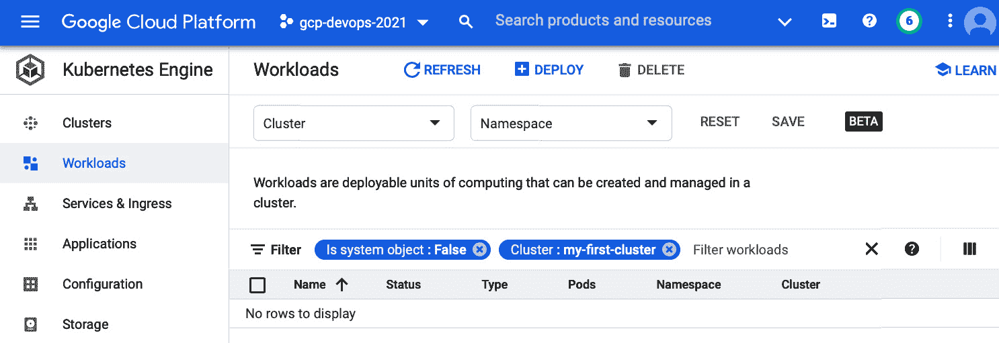
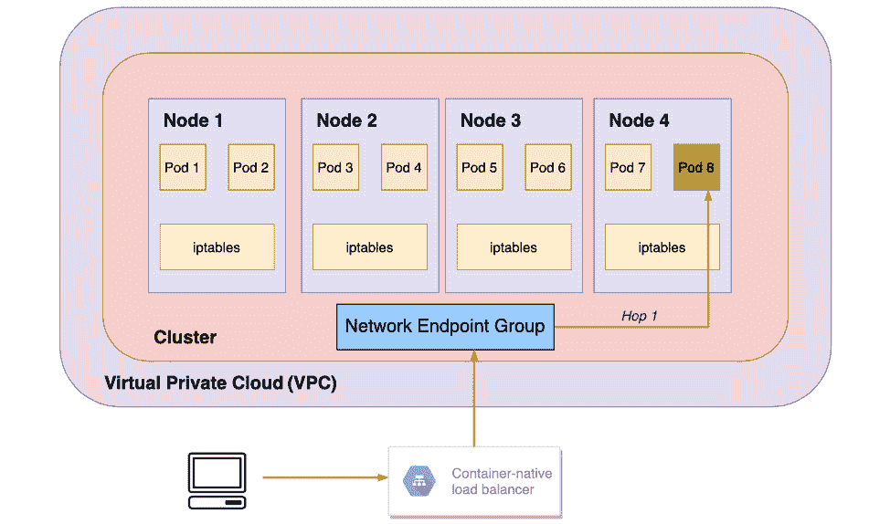

# *第八章*：理解 GKE 基础知识以部署容器化应用

Kubernetes 或 K8s 是一个开源的容器编排系统，用于自动化应用程序的部署、扩展和管理运行容器化应用程序的集群。前一章介绍了 K8s 的基础知识，包括集群结构、主平面组件、Kubernetes 对象（如 Pods 和 Services）、工作负载（如 Deployments、StatefulSets、DaemonSets 等），并深入探讨了部署策略。然而，搭建一个开源的 Kubernetes 集群涉及大量基础设施层面的工作，并且需要花费大量时间来设置。此外，还包括后期的维护活动，如更新、升级或修复集群。GCP 提供了一个计算服务，提供一个托管的 Kubernetes 或 K8s 环境，称为 **Google Kubernetes Engine** (**GKE**)。

本章介绍了作为 GCP 中托管 Kubernetes 选项的 Google Kubernetes Engine，并使用在 *第七章* 中介绍的概念，*理解 Kubernetes 基础知识以部署容器化应用*，来创建一个托管的 GKE 集群，将容器化应用程序部署到集群中，并使该应用程序可供外部客户端访问。本章随后详细介绍了 GKE 的关键特性，包括以下内容：

+   **Google Kubernetes Engine (GKE) – 介绍**

+   **GKE – 核心特性**

+   **GKE 自动驾驶模式 – 实操实验**

# 技术要求

有四个主要的技术要求：

+   一个有效的 **Google Cloud Platform** (**GCP**) 账户，以便使用 GCP 服务： [`cloud.google.com/free`](https://cloud.google.com/free)

+   安装 Google Cloud SDK: [`cloud.google.com/sdk/docs/quickstart`](https://cloud.google.com/sdk/docs/quickstart)

+   安装 Git: [`git-scm.com/book/en/v2/Getting-Started-Installing-Git`](https://git-scm.com/book/en/v2/Getting-Started-Installing-Git)

+   安装 Docker: [`docs.docker.com/get-docker/`](https://docs.docker.com/get-docker/)

# Google Kubernetes Engine (GKE) – 介绍

GKE 是一个托管的 K8s，能够从用户的角度抽象出管理主平面组件的需求。创建 GKE 集群比创建 K8s 集群要简单得多。这是因为 GKE 集群创建过程中无需手动创建节点、配置节点和证书、以及建立节点间的网络通信。GKE 还提供了自动扩展和管理集群节点软件自动升级的选项。

以下是 GKE 集群的关键特性，这些特性使 GKE 与开源 Kubernetes 或 K8s 区别开来：

+   完全托管，抽象出用户无需提供底层资源的需求。

+   使用一种容器优化的操作系统，这是一种由 Google 维护的操作系统，专为快速扩展且资源需求最小化而设计。

+   支持自动升级，并提供选项，可以选择获取最新的功能，或是选择更稳定的版本，而无需手动干预。

+   提供自动修复节点的功能，通过持续监控节点的状态。如果节点不健康，会优雅地将其排空并重新创建。

+   根据需要自动扩展集群，添加更多的节点。

除了前述功能，以下是一些 K8s 中可用的关键功能，这些功能需要作为附加组件添加并显式维护。而这些功能在 GKE 中是标准配置，使得 GKE 相比 K8s 更加可行和优选：

+   负载均衡器——GKE 提供了一个 HTTP(S) 负载均衡器。

+   DNS——GKE 实现了服务发现，并提供了托管 DNS。

+   日志、监控和仪表板——由于与 Google Cloud 操作的集成，GKE 提供了这些内置功能。

直到最近，GKE 只提供了一种操作模式，称为 **标准** 模式（也称为默认模式）。标准模式允许用户选择运行工作负载所需的配置，例如节点的机器类型。此模式还允许选择安全配置功能，提供将运行相似工作负载的节点分组的能力，提供配置网络的选项等。总的来说，通过 GKE 标准模式创建集群比在开源 K8s 中要容易，但仍然有学习曲线。

GKE 最近引入了一种新的操作模式，称为 Autopilot。Autopilot 预先选择了许多配置，基本上创建了一个从安全角度强化的生产级集群。虽然有一些配置选项，但最重要的是，只有在工作负载部署时才会配置节点。Autopilot 模式将在本章后面通过动手实验详细讨论。

重要提示

当前章节重点讲解 *标准* 模式，除非明确说明。本章将帮助你了解在创建 GKE 集群时可用的选项，并提供 GKE 功能的洞见。后续章节会详细介绍 Autopilot 模式，强调标准模式和 Autopilot 模式之间的主要区别，并附带一个动手实验。

GKE 与 GCP 的多项服务提供无缝集成。GKE 提供选项，通过使用 Cloud Build 构建存储在源代码仓库中的代码自动化部署，从而生成可以存储在 Google 容器注册表中的私有容器镜像。此外，通过 Google 的**身份和访问管理**（**IAM**）可以控制访问集群的权限和配置 GKE 集群选项。GKE 与 GCP 的网络服务集成，因为 GKE 集群作为 Google 的虚拟私有云（VPC）的一部分创建。GCP 提供对 GKE 集群及其资源的洞察，GKE 与 Google 的 Cloud operations 集成，Cloud operations 是 Google 提供的一套旨在提供与监控和日志相关的集成服务的工具。

我们将通过逐步过程创建一个 GKE 集群，这将提供对可能配置选项的洞察。集群创建完成后，用户将能够通过 Deployment 的概念部署应用，并通过 Service 的概念暴露应用。应用运行在由 Pod 包裹的容器中。Deployment 规格将管理 Pod。Pod 随后通过 Service 的概念进行暴露。Pod、Deployment 和 Service 这些概念是 K8s 基础知识，已经在*第七章*《理解 Kubernetes 基础知识以部署容器化应用》中讨论过，这些概念将在实际的 GKE 集群中付诸实践。

## 创建 GKE 集群

创建 GKE 集群有多种方式——Cloud Console、CLI 或 REST。要创建集群，用户或服务帐户应具备以下预定义角色之一：Kubernetes 引擎管理员或 Kubernetes 引擎集群管理员。

以下是通过 Google Cloud Console 创建 GKE 集群的逐步过程。此示例中的操作模式为**标准**模式：

1.  导航至 GCP 控制台并选择计算服务 – **Kubernetes 引擎**。

1.  选择创建集群的选项并选择**标准**模式。

1.  输入集群名称为 `my-first-cluster`。

1.  保留其余选项的默认选择。请参见 *图 8.1*：

    ](img/B15587_08_01.jpg)

    图 8.1 – 从 GCP 控制台创建 GKE 集群

1.  选择**创建**集群的选项。这将启动集群创建过程。

1.  新创建的集群将在集群主页显示。请参见 *图 8.2*：


](img/B15587_08_02.jpg)

图 8.2 – GKE 集群列表页面显示新创建的集群

新创建的集群使用了默认选项。除集群名称外，集群创建过程中没有进行任何实际更改。以下是使用默认选项创建 GKE 集群时需要了解的一些重要事项。列表中提到的每个默认选项都可以在集群创建过程中显式更改：

+   集群的默认**位置类型**为**区域性**。**位置类型**指的是基于可用性要求的集群类型。可选项有**区域性**和**区域级别**。

+   默认值为`us-central1-c`。这表示控制平面组件的创建区域。

+   默认值为`us-central1-c`。这表示节点创建的位置。可以选择区域内的多个位置来形成一个集群，其中位置类型是多区域集群。

+   默认**控制平面版本**为**发布通道**。**控制平面版本**提供了指示集群版本的选项。集群版本代表了在稳定性方面首选的功能集。

+   `3`，表示工作节点的数量。集群默认只有 1 个节点池。需要注意的是，集群大小不包括主节点的数量。客户仅需为工作节点付费。主节点及其相关的主平面组件完全由 GKE 管理。

+   `default-pool`。节点池是虚拟机的集合。

+   默认节点池由 3 个节点组成，节点的机器类型为`e2-medium`（2 个 vCPU，4 GB 内存）。

+   默认**维护窗口**为**随时**。这意味着 GKE 维护可以在集群上的任何时间进行。这不是在运行生产工作负载时的首选选项。

+   基于网络的默认集群类型为**公共集群**，默认**VPC 网络**为**default**。这表示客户端如何访问控制平面，以及集群中的应用程序如何彼此之间以及与控制平面进行通信。

+   高级网络选项，如**VPC 原生流量路由**和**HTTP 负载均衡**，默认是*启用*的。这些选项将在本章稍后的子章节*GKE 中的网络*中详细讨论。

+   `110`。

+   安全功能**Shielded GKE 节点**已*启用*。该功能为加入集群的节点提供强加密身份，并将在*第九章*中详细讨论，章节标题为*使用 GKE 安全构件保护集群*。

+   GKE 的云操作已启用，并设置为**系统、工作负载日志记录和监控**。此功能会聚合基础设施和应用级工作负载的日志、事件和指标。

也可以通过**命令行界面**（**CLI**）创建集群。以下是使用默认选项创建集群的 CLI 命令。CLI 中使用的默认选项与之前从控制台创建集群时使用的默认选项相同。一个显著的区别是，在通过 CLI 执行时，必须显式指定一个区域。然而，在 UI 中，区域会自动填充，除非进行了修改：

```
# Create a GKE cluster with default options
gcloud container clusters create my-first-cli-cluster --zone us-central1-c
```

该 CLI 命令可以从本地计算机的终端窗口运行，该计算机已经安装并配置了 Google Cloud SDK。或者，也可以通过 Google Cloud Console 激活 Google Cloud Shell 来执行该命令。

在 GKE 集群创建后，下一步是将应用程序部署到 GKE 集群，并将其公开给外部客户端。接下来将讨论这一主题。

## GKE 集群 – 部署并公开应用程序

在*第六章*中，*使用 Cloud Build 构建代码并推送到容器注册表*，我们创建了一个容器镜像，并使用 Cloud Run 部署了该容器镜像。在本章及本小节中，我们将重用此镜像，并通过创建适当的工作负载将其部署到新创建的 GKE 集群中。应用程序部署后，将通过服务公开，以便外部客户端（如网页浏览器）可以访问该应用程序。

重要提示

为了保持示例的连续性，我们将使用在*第六章*中创建的容器镜像，*使用 Cloud Build 构建代码并推送到容器注册表* – `gcr.io/gcp-devops-2021/cloud-build-trigger`。建议使用你有权限访问的适当容器镜像。例如，如果你按照*第六章*中的逐步说明，*使用 Cloud Build 构建代码并推送到容器注册表*，并最终在你的项目中创建了一个容器镜像，你可以在本章中重用相同的镜像。

我们将以两种不同的方式部署并公开应用程序：

+   GKE 控制台

+   通过 Cloud Shell 的 CLI 方法

需要注意的是，在大多数情况下，集群通常通过命令行部署。然而，我们将首先探索 GKE 控制台的方法，因为这将使我们深入了解可用的配置选项。接下来将讨论这一主题。

## GKE 控制台

第一步是通过 GKE 控制台将应用程序部署到 GKE 集群中。

### 将应用程序部署到 GKE 集群

以下是在 GKE 控制台中部署应用程序的逐步过程：

1.  在 GCP 控制台的 **Kubernetes Engine** 部分，导航到 **Clusters** 页面。

1.  选择之前创建的集群 – `my-first-cluster`。

1.  在左侧面板中，选择**工作负载**部分。从 GKE 的角度来看，工作负载指的是 Deployments、StatefulSets、DaemonSets、Jobs 和 CronJobs。目前没有工作负载，当前状态如下所示，参见*图 8.3*：

    图 8.3 – 新创建集群的工作负载部分

1.  通过选择**部署**选项来创建工作负载。此操作允许您通过两步过程创建 Deployment 对象。

1.  创建 Deployment 的第一步是定义 Deployment 所需的容器。选择在*第六章*中创建的容器镜像，*使用 Cloud Build 构建代码并推送到容器注册表*。对于这个示例，选择容器镜像 `gcr.io/gcp-devops-2021/cloud-build-trigger`。参见*图 8.4*。可选地，添加容器的环境变量，并点击**完成**：

    图 8.4 – 在定义 Deployment 容器时选择容器镜像

1.  可选地，可以通过使用**添加容器**选项将多个容器添加到 Pod 中。请参阅*图 8.5*：

    图 8.5 – 向 Deployment 添加多个容器的选项

1.  创建 Deployment 的第二步是配置 Deployment。这包括指定应用程序名称、命名空间、标签以及应用程序应该部署到的集群。对于这个具体示例，设置 `hello-world`、`default`、`app` 和 `hello-world`，并选择名为 `my-first-cluster` 的集群。参见*图 8.6*：

    图 8.6 – 通过指定所需属性来配置 Deployment

1.  在选择**部署**选项之前，可以通过选择**查看 YAML**选项来查看配置的 YAML，如*图 8.6*所示。默认情况下，副本数定义为 3。这可以根据需要更改为所需的副本数量。

1.  通过选择**部署**选项来启动部署创建过程。

1.  新创建的 Deployment – `hello-world` – 将如下所示显示。此 Deployment 创建了三个副本，使用相同的镜像。请参阅*图 8.7*：


图 8.7 – 新创建的 Deployment 的详细信息

需要注意的是，新创建的部署 – `hello-world` – 不能被外部客户端（如 Web 浏览器或通过 `ping` 命令）访问，因为该部署没有被暴露为 Service。然而，仍然可以通过使用 `port-forward` 选项进行测试。执行此选项所需的 CLI 命令如下所示。这些命令可以通过 Google Cloud Shell 执行：

```
# Connect to the cluster – 'my-first-cluster'
gcloud container clusters get-credentials my-first-cluster --zone us-central1-c --project gcp-devops-2021
# Find the list of pods for the deployment hello-world
kubectl get pods
# For a specific pod, create a port-forward option to access the application running inside the pod
kubectl port-forward hello-world-6755d97c-dlq7m 10080:8080
```

一旦执行上述 `port-forward` 命令，来自 `127.0.0.1:10080` 的流量将被转发到端口 `8080`。端口 `8080` 是与 `hello-world` 部署相关的容器端口。参见 *图 8.8*：


图 8.8 – 将流量转发到 Pod 内部的容器

为了测试流量是否被转发，打开另一个 Cloud Shell 窗口并运行如下 `curl` 命令。这将对在 Pod 容器内运行的应用进行 REST 调用。参见 *图 8.9*：


图 8.9 – 通过端口转发访问 Pod 中应用的结果

或者，你也可以在 Cloud Shell 中使用 `10080` 端口的 Web 预览选项来查看应用。由于应用已经部署并按预期工作，下一步是将该应用暴露为 Service。

### 将应用暴露为 Service

以下是通过 GCP 控制台将应用暴露为 Service 的逐步过程：

1.  导航到 GCP 控制台中 **Kubernetes Engine** 部分的 **Clusters** 页面。

1.  选择之前创建的集群 – `my-first-cluster`。

1.  选择之前创建的部署 – `hello-world`。

1.  在部署详情页面的 **Actions** 菜单下，选择 **EXPOSE** 选项。这将打开一个弹出窗口，需要选择 **端口**、**目标端口**、**协议** 和 **Service 类型**。

1.  输入 `80`（表示 Service 监听传入流量的端口）、`8080`（表示容器监听的端口）、`TCP` 和 `负载均衡器`。选择 **EXPOSE** 选项。参见 *图 8.10*：

    图 8.10 – 指定端口映射，将 Pod 暴露为负载均衡器类型的 Service

1.  一旦 Pod 被暴露，就会创建一个 Service，如下图所示。由于该 Service 是 **LoadBalancer** 类型，Service 将具有一个外部端点。参见 *图 8.11*：

    图 8.11 – 通过暴露 Pod 创建的 LoadBalancer Service

1.  选择外部端点。这将在浏览器中打开应用程序，如下图所示。这基本上是将应用程序部署到 GKE 集群后的输出。输出与在 *第六章*，*使用 Cloud Build 构建代码并推送到容器注册表* 中，使用相同的容器镜像部署到 Cloud Run 时的输出相同。参见 *图 8.12*：


图 8.12 – 通过负载均衡器服务访问应用程序的输出

这完成了将应用程序部署到 GKE 集群并通过 GKE 控制台将应用程序暴露为负载均衡器服务的主题。下一个子章节基本上是一个类似的示例，但提供了如何通过 Cloud Shell 使用 CLI 方法完成相同任务的见解。

### 通过 Cloud Shell 使用 CLI 方法

在这个子章节中，我们将通过 CLI 使用 Cloud Shell 部署应用程序并将其暴露为负载均衡器服务。我们将使用之前创建的相同集群 — `my-first-cluster`。同时，建议使用作为练习一部分创建的容器镜像，位于 *第六章*，*使用 Cloud Build 构建代码并推送到容器注册表*。在本示例中，将使用容器镜像 `gcr.io/gcp-devops-2021/cloud-build-trigger`。

### 将应用程序部署到 GKE 集群

以下是通过 Cloud Shell 部署应用程序的逐步过程：

1.  打开 Cloud Shell 并使用以下 CLI 命令连接到集群：

    ```
    # Connect to the cluster
    gcloud container clusters get-credentials my-first-cluster --zone us-central1-c --project gcp-devops-2021
    ```

1.  创建一个名为 `hello-world-cli.yaml` 的新文件，内容如下。这个文件本质上创建了一个包含容器及其对应镜像的部署。还指定了副本数，在本例中为 1：

    ```
    apiVersion: "apps/v1"
    kind: "Deployment"
    metadata:
      name: "hello-world-cli"
      namespace: "default"
      labels:
        app: "hello-world-cli"
    spec:
      replicas: 1
      selector:
        matchLabels:
          app: "hello-world-cli"
      template:
        metadata:
          labels:
            app: "hello-world-cli"
        spec:
          containers:
          - name: "cloud-build-trigger-sha256-1"
            image: "gcr.io/gcp-devops-2021/cloud-build-trigger:latest"
    ```

1.  通过运行以下命令创建部署：

    ```
    kubectl apply -f hello-world-cli.yaml
    ```

一旦部署创建完成，可以通过 CLI 查询该部署及其相应的 Pod。请注意，此部署将只创建一个 Pod。参见 *图 8.13*：


图 8.13 – 通过 CLI 查询部署情况

部署的应用程序无法通过外部客户端访问。然而，在前一个子章节中解释的端口转发方法也可以在此上下文中完全适用。鉴于应用程序已经部署，下一步是将应用程序暴露为服务。

### 将应用程序暴露为服务

以下是通过 Cloud Shell 将应用程序暴露为服务的逐步过程：

1.  创建一个名为 `hello-world-cli-service.yaml` 的新文件，定义如下。这将创建一个负载均衡器服务，将暴露带有匹配标签选择器的 Pod：

    ```
    apiVersion: v1
    kind: Service
    metadata:
      name: hello-world-cli-service
    spec:
      type: LoadBalancer
      selector:
        app: hello-world-cli
      ports:
      - protocol: TCP 
        port: 80
        targetPort: 8080
    ```

1.  通过运行以下命令创建负载均衡器服务：

    ```
    kubectl apply -f hello-world-cli-service.yaml
    ```

1.  一旦创建了服务，负载均衡器将被创建并分配一个外部端点。根据服务定义，该服务将在`80`端口监听流量，并将流量转发到`8080`端口的容器。可以通过如下方式查询服务来获取服务的外部端点。请参见*图 8.14*：

    图 8.14 – 查询负载均衡器服务以获取外部端点

1.  通过浏览器窗口访问外部端点。输出将与*第六章*《使用 Cloud Build 构建代码并推送到容器注册表》中的输出或通过控制台在 GKE 中部署的应用程序的输出相同。这是因为我们使用的是相同的镜像。请参见*图 8.15*：


图 8.15 – 通过外部端点查看负载均衡器服务的输出

本节结束，介绍了 GKE 并深入探讨了创建 GKE 集群、将应用程序部署到集群并将已部署的应用程序公开为外部客户端可访问的服务的步骤。实际上，这种方法的输出与控制台方法的输出相同。目标是理解通过 CLI 创建集群、部署工作负载并通过服务暴露工作负载的过程。

在创建集群或部署应用程序时使用的概念与构成 K8s 基础的概念相同（在*第七章*《理解 Kubernetes 基础以部署容器化应用》中已学习）。然而，集群创建的性质更加简单，因为主控平面组件的维护已完全抽象化，不再是用户的责任。接下来的部分将重点介绍 GKE 的核心功能和可能的集群类型，并介绍 GKE 中与网络和云操作的集成。

# GKE – 核心功能

本节涵盖以下主题。这些主题将提供大量信息，帮助您构建对 GKE 的良好理解和操作知识。这些 GKE 概念大多是 Kubernetes 部分学习的主题的扩展。将要覆盖的主题如下：

+   GKE 节点池

+   GKE 集群类型

+   GKE 中的自动扩展

+   GKE 中的网络

+   GKE 的云操作

接下来小节将详细介绍的第一个 GKE 构建块是 GKE 节点池。

## GKE 节点池

Kubernetes 集群中的节点（即工作节点）部署工作负载。分布在所有节点上的工作负载性质可能不同。有些工作负载可能是 CPU 密集型的，有些可能是内存密集型的，还有些可能需要特定版本的 CPU 平台。工作负载还可能是容错的批处理任务，或者需要特定类型的存储，如 SSD。

`nodeConfig` 规范。所有符合 `nodeConfig` 规范的节点将使用节点标签标记，其中键为 `cloud.google.com/gke-nodepool`，值为节点池的名称。

以下是一个包含特定机器类型、OAuth 范围和磁盘类型的 `nodeConfig` 规范示例：

```
nodeConfig: {
        machineType: "n2-highmem-32",
        oauthScopes: [
            "https://www.googleapis.com/auth/compute",
            "https://www.googleapis.com/auth/logging.write",
            "https://www.googleapis.com/auth/monitoring"
        ],
        diskType: "pd-ssd"
    }
```

集群总是与默认节点池一起创建，默认节点池具有特定数量的节点和特定的机器类型（以及其他属性）。可以根据各自的 `nodeConfig` 和工作负载需求添加额外的自定义节点池。

以下是节点池的一些关键特性：

+   新创建的节点池默认运行最新的稳定 Kubernetes 版本。

+   现有节点池上的 Kubernetes 版本可以配置为自动升级，也可以手动升级。

+   可以单独调整节点池的大小、升级或删除，而不影响其他节点池。对节点池的任何更改都会影响池中的所有节点。

以下是一些 CLI 命令，可以对节点池执行操作。这些命令可以在本章之前创建的集群 `my-first-cluster` 上执行。

以下 CLI 命令会创建一个特定机器类型的节点池：

```
gcloud container node-pools create my-high-mem-pool --machine-type=n1-highmem-8 --cluster=my-first-cluster --num-nodes=2 –zone=us-central1-c
```

创建的节点池将在 GKE 控制台中反映出来，显示在集群对应位置（参见*图 8.16*）：


图 8.16 – 新建自定义节点池 – 创建了 my-high-mem-pool

以下是其他 CLI 命令，用于调整节点池大小、升级到特定版本或删除节点池：

```
# Resize node pool
gcloud container clusters resize my-first-cluster --node-pool=my-high-mem-pool --num-nodes=1 –zone=us-central1-c
# Upgrading node pool to specific cluster version
gcloud container clusters upgrade my-first-cluster --cluster-version="1.17.17-gke.3000" --node-pool=my-high-mem-cluster --zone=us-central1-c
# Delete a node pool
gcloud container node-pools delete my-high-mem-pool --cluster=my-first-cluster --zone=us-central1-c
```

在区域性或多区域集群中的节点池会被复制到多个区域。此外，可以通过明确指定节点池名称使用 `nodeSelector`，或者找到满足工作负载资源请求的节点池，来将工作负载部署到特定节点池中。

如果节点池名称通过 `nodeSelector` 属性明确指定，则 `kube-scheduler` 会将工作负载部署到指定的节点。否则，`kube-scheduler` 会找到符合工作负载资源请求的节点池。

这完成了 GKE 节点池的概述。接下来的主题将深入探讨 GKE 中的各种集群配置。

## GKE 集群配置

GKE 提供多种集群配置选择，基于集群可用性类型、集群版本、网络隔离和 Kubernetes 特性。以下子章节将详细讨论这些配置选项。

### 集群可用性类型

GKE 允许你根据工作负载的可用性要求创建集群。根据可用性类型，有两种集群配置——区域集群（单区域或多区域）和区域集群。这些将在以下子章节中讨论。

#### 区域集群

**区域集群**将拥有一个在单一区域运行的控制平面副本。节点（即工作节点）可以运行在单一区域，也可以跨多个区域运行。如果节点与控制平面运行在同一区域，则表示为**单区域集群**。然而，如果节点跨多个区域运行，则表示为**多区域集群**。请注意，GKE 允许每个区域最多创建 50 个集群。

多区域集群将仅有一个控制平面的副本。选择单区域集群还是多区域集群取决于应用程序所需的可用性级别。对于多区域集群，如果发生集群升级或区域故障，节点上运行的工作负载将继续运行，但直到集群控制平面可用之前，无法配置新的节点或工作负载。

以下是创建区域集群（单区域和多区域）的 CLI 命令：

```
#Syntax
gcloud containers clusters create CLUSTER_NAME \
  --zone COMPUTE_ZONE \
  --node-locations COMPUTE_ZONE, COMPUTE_ZONE, [..]
#Single Zone Cluster
gcloud containers clusters create single-zone-cluster \
  --zone us-central1-a
#Multi Zonal Cluster
gcloud containers clusters create single-zone-cluster \
  --zone us-central1-a \
  --node-locations us-central1-a,us-central1-b, us-central1-c
```

与区域相关的输入参数是指控制平面的位置。节点位置指的是工作节点的所在位置，对于单区域集群来说并不需要指定，因为它与主控制平面的位置相同。

这就是 GKE 区域集群的简要概述。下一个主题将概述 GKE 区域集群。

#### 区域集群

区域集群提供了在工作节点和控制平面方面的高可用性。区域集群在多个区域内运行多个控制平面副本。工作节点也跨多个区域进行复制，并且工作节点与控制平面在同一区域内共同运行。区域集群不能转换为区域集群。

以下是创建区域集群的 CLI 命令：

```
#Syntax
gcloud containers clusters create CLUSTER_NAME \
  --region COMPUTE_REGION \
  --node-locations COMPUTE_ZONE, COMPUTE_ZONE, [..]
#Regional Cluster
gcloud containers clusters create single-zone-cluster \
  --region us-central1 \
  --node-locations us-central1-a,us-central1-b, us-central1-c
```

与 `region` 相关的输入参数是指控制平面的位置。节点位置指的是工作节点的位置。对于多区域集群，这是必需的，因为节点位置可能分布在多个区域。

这就是基于集群可用性类型的 GKE 集群配置的简要概述。下一个主题将概述基于集群版本的 GKE 集群配置。

### 集群版本

GKE 允许你选择集群版本。集群版本可以是非常特定的版本、当前默认版本，或者基于发布渠道，发布渠道是基于早期可用性和稳定性的功能组合。这些集群版本配置将在以下子章节中讨论。

### 特定版本

可以通过指定特定版本来创建 GKE 集群。在从控制台创建集群时，这些信息可以作为*静态版本*选择的一部分提供给用户。用户将获得集群版本的选择，并可以选择一个可用的版本。

### 发布渠道

开源 Kubernetes 或 K8s 持续发布新版本。这些版本可能出于以下目的而需要：

+   修复已知问题

+   添加新功能

+   解决任何安全风险/问题

运行 Kubernetes 集群上应用程序的 Kubernetes 用户，更倾向于控制发布的频率或采用新功能的速度。Google 通过**发布渠道**的概念为客户提供这一选择。

每个发布渠道都提供**普遍可用**（**GA**）功能，但功能的成熟度会根据其最初发布的日期在不同渠道之间有所不同。此外，Google 还可以根据发布渠道的类型添加最新的 GKE 特定功能。这确保了某个特性或修复程序在一段时间内经过了验证，并确保其正确性和一致性。

GKE 提供三个发布渠道：

+   **快速**：与其他发布渠道相比，这个发布渠道包括最新的 Kubernetes 和 GKE 特性，但这些特性距离它们各自的开源 GA 版本发布仍有几周的时间。

+   **常规**：这是默认的发布渠道，包括 Kubernetes 和 GKE 特定的功能，这些功能相对较新，但稳定性较好。这些功能在快速发布渠道发布后至少已有 2-3 个月的历史，且距离开源 GA 版本发布已经有几个月。

+   **稳定**：这是最稳定的发布渠道，因为添加到此渠道的功能是在加入常规渠道后至少 2-3 个月添加的。实际上，这些功能经过充分验证和测试，以提供极致的稳定性。

以下是将集群注册到发布渠道的 CLI 命令：

```
#Syntax
gcloud containers clusters create CLUSTER_NAME \
  --zone COMPUTE_ZONE \
  --release-channel CHANNEL \
  ADDITIONAL_FLAGS
# Release Channel Example
gcloud containers clusters create my-cluster \
  --zone us-central1-a \
  --release-channel rapid
```

总结一下，新版本的 Kubernetes 和 GKE 特性会从快速发布渠道、常规发布渠道到稳定发布渠道依次推广，提供用户在使用新特性和稳定特性之间的选择。一旦集群被加入到发布渠道，GKE 会处理版本的可用性和升级节奏。每个发布渠道都会继续接收关键的安全更新。

### 默认版本

如果没有指定特定的版本或发布渠道，则 GKE 会创建一个使用当前默认版本的集群。GKE 会根据使用情况和实际性能选择默认版本，并定期更改默认版本。历史上，Kubernetes 的新版本每三个月发布一次。

这完成了基于集群版本的 GKE 集群配置的简要概述。下一个主题将提供基于网络隔离选择的 GKE 集群配置概述。

### 网络隔离选择

有两个与网络隔离相关的特定选择——公有集群或私有集群。公有集群是默认配置。然而，这并不强制执行网络隔离，集群可以从任何公共端点访问。这使得集群在安全性方面存在漏洞。配置公有集群的缺点可以通过私有集群来解决，私有集群将在以下小节中介绍。

### 私有集群

GKE 提供了创建私有集群的选项，在该集群中，节点只有内部 IP 地址。这意味着节点和运行在节点上的 Pods 与互联网隔离，因此天然不会与公共互联网进行进出连接。

私有集群将拥有一个包含私有端点的控制平面，此外还有一个公共端点。可以通过多种选项来控制对公共端点的访问。此外，控制平面将在 Google 拥有的项目中的 VPC 网络中的虚拟机上运行。有关私有集群的详细信息将在 *第九章*，*使用 GKE 安全构件保护集群* 中进行深入讨论。

### Kubernetes 功能——alpha 集群

Kubernetes 中的新功能通常通过发布渠道推广到 GKE。发布渠道包括快速、常规和稳定的选择。然而，alpha 功能仅在特殊的 GKE alpha 集群中提供。以下小节将讨论这一点。

#### Alpha 集群

Alpha 集群是 GKE 的一个特定功能，旨在用于采用那些尚未准备好投入生产或尚未普遍开放源代码的新功能。GKE 创建的 alpha 集群是短期存在的集群，并将在 30 天后自动删除。

以下是创建 alpha 集群的 CLI 命令：

```
#Syntax
gcloud container clusters create cluster-name \
    --enable-kubernetes-alpha \
    [--zone compute-zone] \
    [--cluster-version version]
#Alpha Cluster Example
gcloud container clusters create my-cluster \
    --enable-kubernetes-alpha \
    --region us-central1
```

这些集群不会接收安全更新，不能自动升级或自动修复，且不受任何 GKE 特定的 SLA 保障。因此，永远不建议将 alpha 集群用于生产工作负载。

这完成了基于网络隔离选择的 GKE 集群配置的简要概述。这也结束了关于 GKE 集群配置的一般小节。下一个主题将详细介绍 GKE 中可能的自动扩展选项。

## GKE 中的自动扩展

在 GKE 中有三种潜在的自动扩展选项。这些选项适用于特定的需求和场景：

+   **集群自动扩展器**：用于调整 GKE 集群中节点池大小的扩展选项

+   **水平 Pod 自动扩展器**（**HPA**）：一个选项，用于根据当前利用率指示何时应自动扩展应用实例

+   **垂直 Pod 自动缩放器** (**VPA**): 一种选项，根据当前利用率为 Pod 建议推荐资源。

接下来的话题详细说明了先前的自动缩放机制，从集群自动缩放器开始。

### 集群自动缩放器

**集群自动缩放器**是自动调整 GKE 集群中节点池大小的机制。缩放基于节点池内部署的工作负载的需求。这允许您实现云计算的核心概念，称为弹性，从而消除了过度或不足提供节点的需要。

集群自动缩放器基于节点池的基础工作，并基于资源请求（作为 Pod 规范的一部分定义）而非实际资源利用率。当需要部署新的 Pod 时，Kubernetes 调度器根据 Pod 的资源请求来寻找节点进行部署。如果没有节点满足 Pod 的资源需求以及可用容量，那么 Pod 将处于挂起状态，直到现有的 Pod 终止或者添加新节点。

集群自动缩放器会跟踪处于挂起状态的 Pod，并随后尝试增加节点的数量。同样，如果节点未充分利用，集群自动缩放器也会减少节点的数量。可以为集群自动缩放器定义最小或最大节点数，以使其在指定的限制内运行。

当集群缩小规模时，可能需要新的工作负载等待新节点的添加。这可能导致潜在的中断。GKE 配置文件类型提供了在平衡和激进缩小规模之间进行选择的选项:

+   **平衡**: 默认的配置选项，性质不激进。

+   **优化利用率**: 缩小比较激进，更快地移除未充分利用的节点。

以下是一些与集群自动缩放器相关的 CLI 命令:

```
# Create cluster with autoscaler limits
gcloud container clusters create my-autoscaler-cluster \
  --zone us-central1-b \
  --num-nodes 3 --enable-autoscaling --min-nodes 1 --max-nodes 5
# Update autoscaling profile to optimize-utilization
gcloud beta container clusters update my-autoscaler-cluster \
  -autoscaling-profile optimize-utilization
```

在使用集群自动缩放器时需要考虑的一些限制如下:

+   在将 Pod 重新调度到不同节点之前，对原始节点进行强制终止之前会进行 10 分钟的优雅终止。

+   节点池缩放限制由区域可用性决定。如果集群跨越 4 个区域拥有 3 个节点（`min_nodes` = `1` 和 `max_nodes` = `5`），那么如果其中 1 个区域失败，集群的大小可以从每个集群的 4-20 个节点变为 3-15 个节点。

这里结束了对集群自动缩放器的概述。下一个主题关注**水平 Pod 自动缩放器** (**HPA**)。

### 水平 Pod 自动缩放器

HPA 是一个 Kubernetes 控制器对象，根据观察到的 CPU 或内存利用率自动调整复制控制器、Deployment、ReplicaSet 或 StatefulSet 中 Pod 的数量。HPA 指示需要对其进行缩放的 Deployment 或 StatefulSet。HPA 不适用于 DaemonSets。

要实现 HPA，需要考虑以下因素：

+   每个 Deployment 或 StatefulSet 需要定义一个 HPA 对象。

+   `--horizontal-pod-autoscaler-sync-period`属性允许您将 HPA 实现为控制循环。默认值为每周期 15 秒。

+   `kube-controller-manager`（按周期获取）从资源管理器 API 或自定义指标 API 获取指标，并将其与每个 HPA 定义中指定的指标进行比较。

以下是一些可以定义 HPA 配置的关键参数：

+   `--horizontal-pod-autoscaler-initial-readiness-delay`：一个可配置的窗口，确保 Pod 成功过渡到就绪状态。

+   `--horizontal-pod-autoscaler-cpu-initialization-period`：一个可配置的窗口，用于设置 Pod 转变为就绪状态后的 CPU 初始化时间。默认值为 5 分钟。

+   `--horizontal-pod-autoscaler-downscale-stabilization`：一个可配置的窗口，自动扩展器在当前扩展操作完成后需要等待多长时间才能启动缩减操作。默认值为 5 分钟。这样可以防止频繁波动。

以下是基于 CPU 利用率的 HPA 对象示例定义：

```
apiVersion: autoscaling/v1
kind: HorizontalPodAutoscaler
metadata:
  name: nginx
spec:
  scaleTargetRef:
    apiVersion: apps/v1
    kind: Deployment
    name: my-nginx
  minReplicas: 1
  maxReplicas: 5
  targetCPUUtilizationPercentage: 75
```

在上述示例中，`kube-controller-manager`将根据 HPA 对象规范扩展 Deployment，如果目标 CPU 利用率超过 75%，最大可扩展至 5 个实例。这是 HPA 概述的总结，接下来的主题将重点讲解**垂直 Pod 自动扩展器**（**VPA**）。

### 垂直 Pod 自动扩展器（VPA）

集群自动扩展器基于工作负载的 CPU 和内存请求限制进行操作。如果这些限制没有适当定义，则始终存在过度配置或配置不足的风险，因为参考值将不准确。

VPA 是一个 Kubernetes 资源，推荐 CPU 和内存请求/限制的值。此外，如果 VPA 的`updateMode`属性设置为*开启*，VPA 还可以自动更新工作负载。这可能会驱逐现有 Pod，因为需要更改 Pod 的资源请求，并且会生成一个具有更新推荐值的新 Pod。

这确保了集群节点得到最佳利用，并可能不再需要运行基准测试来确定 CPU 和内存请求的正确值。VPA 与集群自动扩展器进行通信，以便在与节点池相关的节点上执行适当的操作。

以下是一个 VPA 对象的示例定义：

```
apiVersion: autoscaling.k8s.io/v1
kind: VerticalPodAutoscaler
metadata:
  name: my-vpa
spec:
  targetRef:
    apiVersion: "apps/v1"
    kind:       Deployment
    name:       my-nginx
  updatePolicy:
    updateMode: "On"
```

上述代码片段中的`kind`属性指示 Kubernetes 资源是 VPA 对象。`updateMode`属性指示 VPA 建议的推荐值会自动应用于正在运行的工作负载。

以下是一些特定于 VPA 的 CLI 命令：

```
# To view recommendations of VPA is updateMode was set to Off
kubectl get vpa my-vpa --output yaml
# To disable VPA
gcloud container clusters update my-cluster --no-enable-vertical-pod-autoscaling
```

如果配置了一个 HPA 对象来评估 CPU 或内存的指标，建议 HPA 不应与 VPA 一起使用。

多维 Pod 自动扩展（MPA）

这是一个新的自动扩展选项，目前处于预 GA 阶段。根据该选项，可以配置自动扩展以基于 CPU 进行横向扩展，并同时基于内存进行纵向扩展。MPA 支持 1.19.4-gke.1700 或更高版本的集群。

这一部分总结了 GKE 中的自动扩展，详细介绍了多种机制。接下来的部分将重点介绍与 GKE 相关的网络构建。将涵盖有关 Pod 网络、服务网络的详细信息，并深入探讨使用 GKE 负载均衡器来暴露服务以供外部使用。

## GKE 中的网络

应用程序作为容器部署在 Kubernetes 中。Pods 运行容器。Pods 的期望状态由 Deployments 控制，应用程序通过 Services 暴露供内部和外部网络使用。已部署的 pods 在 GKE 的节点上运行。GKE 中的节点由虚拟机或 VM 表示。这些节点部署在**虚拟私有云**（**VPC**）中。

VPC 定义了一个虚拟网络拓扑，类似于传统网络。它是一个逻辑隔离的网络，并提供已部署资源之间的连接。VPC 还提供了启动资源、选择 RFC 1918 地址范围、创建子网等方面的完全控制。

GCP 中的 VPC 为每个 GCP 区域预分配了一个 IP 子网。当在 VPC 中部署 GKE 集群时，可以选择特定的区域或区域。在 GKE 节点由计算引擎虚拟机（VM）组成且这些虚拟机需要 IP 地址时，IP 地址范围将从分配给区域的 IP 子网中分配。GCP 中的 VPC 被视为全球资源，因为单一的 Google Cloud VPC 可以跨多个区域而无需通过公共互联网进行通信。并不要求在每个区域都建立连接。

GCP 提供了配置别名 IP 范围的选项。这使得虚拟机可以拥有额外的二级 IP 地址。因此，虚拟机可以在独立的 IP 地址上运行多个服务。这些二级 IP 地址可以在 VPC 内进行路由，而无需配置额外的路由。

GKE 集群可能需要运行集群范围的服务。GCP 建议将 GKE 集群部署为**VPC 原生集群**。VPC 原生集群使用三个独特的子网 IP 地址范围：

+   用于节点 IP 地址的子网主 IP 地址范围

+   所有 Pod IP 地址的二级 IP 地址范围

+   用于所有服务 IP 地址的附加二级 IP 地址范围

GKE 提供了灵活性，允许配置集群中节点的数量和每个节点的最大 pod 数。接下来的话题详细介绍了当 pods 在 GKE 集群中部署时，如何为 pod 分配 IP 地址。

### Pod 网络

当 Pod 被调度到某个节点时，Kubernetes 会在该节点的 Linux 内核中为 Pod 创建一个网络命名空间，并通过虚拟网络接口将该节点的物理网络接口连接到 Pod，从而允许同一节点内的 Pod 之间进行通信。

Kubernetes 会将一个 IP 地址（即 Pod 的 IP 地址）分配给 Pod 的网络命名空间中的虚拟网络接口，这些 IP 地址来自为节点上的 Pod 保留的地址范围。此地址范围是集群为 Pod 分配的 IP 地址范围的一个子集，创建集群时可以配置此范围。

GKE 会自动配置 VPC 以识别这一 IP 地址范围为授权的次级子网地址范围。因此，Pod 的流量可以通过网络上的防伪过滤器。同时，由于每个节点为其 Pod 保持独立的 IP 地址库，节点不需要对 Pod 的 IP 地址进行网络地址转换。下一个主题将详细讲解服务网络，特别是如何通过使用 GKE 负载均衡器有效地接收来自外部源的流量。

### 服务网络

服务是一个 Kubernetes 资源，它创建一个名为端点的动态 IP 地址集合。这些 IP 地址属于与服务标签选择器匹配的 Pod。Kubernetes 通过分配一个静态虚拟 IP 地址来创建服务，这个 IP 地址从集群为服务保留的 IP 地址池中分配。

在可用的服务类型中，`LoadBalancer` 服务类型通过 GCP 的 `LoadBalancer` 在 GKE 中实现，该负载均衡器是在 GKE 集群内创建的。随后，GCP 会分配一个静态的 `LoadBalancer` IP 地址，该地址可以从集群外部以及项目中访问。

对于发送到 GCP NLB 的流量，*图 8.17* 展示了 NLB 与 GKE 集群内节点之间的交互。这些交互按步骤列出如下：


图 8.17 – NLB 与 GKE 集群在 VPC 中的交互

**逐步交互**：

1.  NLB 会从集群中随机选择一个节点并转发流量（例如根据 *图 8.17*，选择 **Node 2**）。

1.  服务可能会绑定到多个分布在集群节点上的 Pod。节点上的 `kube-proxy` 服务接收客户端请求，并会随机选择一个匹配该服务的 Pod。所选的 Pod 可能在同一节点或不同节点上。

1.  如果选择的 Pod 位于不同的节点（例如 **Pod 8**），则客户端请求将从原节点（**Node 2**）发送到其他节点（**Node 4**）。响应将返回到接收请求的原节点（**Node 2**），然后再返回给客户端。

前面的过程提供了一种通过外部客户端访问服务的方式，并保持与 Pod 使用的平衡。然而，在 Kubernetes 集群中，响应可能需要经过多个节点，因为请求从一个节点被引导到另一个节点，这就可能导致**双重跳跃**问题。

为了避免`externalTrafficPolicy`。如果设置为本地，`kube-proxy` 将选择本地节点上的一个 Pod（无论是**Pod 3**还是**Pod 4**），并且不会将客户端请求转发到另一个节点。然而，这会导致负载不平衡，用户必须在更好的负载均衡和低延迟通信之间做出选择。GKE 通过使用容器原生负载均衡的概念解决了这个问题。

### 容器原生负载均衡

容器原生负载均衡的核心思想是，流量不再被引导到节点，而是直接发送到 Pod，从而避免了额外的跳跃。连接直接在负载均衡器与 Pods 之间建立。GKE 通过利用 **GCP HTTP(S) Load Balancing** 和称为 **Network Endpoint Group**（**NEG**）的数据模型实现这一点。GKE 需要在 VPC 原生模式下运行，才能使用容器原生负载均衡功能。

NEG 是一组表示 IP 到端口对的网络端点。因此，负载均衡流量不再使用节点 IP，而是使用 Pod IP 和端口的组合作为元组。此信息在 NEG 中进行维护。*图 8.18* 展示了 GKE 容器原生负载均衡与 GKE 节点中的 Pods 之间的交互，通过 NEG 实现。如 *图 8.18* 所示，发往容器原生负载均衡器的请求会转发到 NEG，NEG 根据请求选择特定的 Pod，并直接将流量转发到与 Pod 关联的节点，实现单跳转发，从而避免了*双重跳跃*问题：



](img/B15587_08_18.jpg)

图 8.18 – 使用容器原生负载均衡解决双重跳跃问题

除了建立与 Pod 的直接连接外，容器原生负载均衡还允许直接查看 Pod，从而实现准确的健康检查。源 IP 地址得以保留，从而可以获得客户端与负载均衡器之间的往返时间信息。

本文总结了 GKE 特定的网络构造的高级概述。下一节将总结 GKE 中容器化应用可用的存储选项。

## GKE 的存储选项

Kubernetes 提供了以卷（Volumes）和持久卷（Persistent Volumes）形式的存储抽象。这些被用作存储选项，提供直接可供在 Kubernetes 集群中运行的应用程序访问的文件系统容量。持久卷的存在超出了容器的生命周期，且可以进一步作为耐久性文件存储或数据库后端存储使用。

在 GKE 中，Compute Engine 持久磁盘用作持久卷。GKE 还提供了各种托管后端存储服务，如 Cloud SQL、Cloud Datastore 等，这样就不需要在 GKE 集群内运行数据库应用程序，而是将 GKE 集群中的应用程序连接到托管的数据存储。例如，GKE 集群中的前端应用程序可以连接到 Cloud SQL，而不是将前端应用程序连接到运行 MySQL 服务器的其他应用程序。更具体地说，前端应用程序可以通过 Cloud SQL 代理连接到 Cloud SQL 以满足数据库需求。该代理可以作为一个 side-car 容器运行在前端应用程序的 Pod 内。

这抽象了基础设施需求并减少了维护，让您可以专注于应用程序。GCP 提供了跨关系型、非关系型和缓存服务的托管服务，供在 GKE 集群中运行的应用程序连接。

除了可能需要后端数据存储的应用程序外，GKE 集群中可能还会有需要对象存储的应用程序。**Google Cloud Storage**（**GCS**）是一个对象存储服务。对象存储指的是存储一组有序字节的方式，其中这些字节的结构和语义并不重要。它可用于各种应用程序，例如以下几种：

+   为网站提供图像服务

+   流式传输音乐、视频和媒体托管

+   为分析和机器学习工作负载构建数据湖

GKE 集群中的应用程序可以通过 Cloud Storage API 访问 Cloud Storage。这是 GCP 中为部署在 GKE 中的应用程序提供的存储选项的总结。接下来的部分总结了从 GKE 角度出发的云操作细节。

## GKE 的 Cloud 操作

**Google Kubernetes Engine**（**GKE**）提供与 **Google Cloud 操作**的本地集成——一套工具，允许您监控工作负载、收集应用程序日志、捕获指标并在关键指标上提供警报或通知选项。Cloud 操作及其相关服务套件将在*第十章*《探索 GCP 云操作》中详细阐述。

GKE 的 Cloud 操作在创建集群时默认启用。然而，用户可以选择在 GKE 集群配置中禁用 Cloud Monitoring 或 Cloud Logging。GKE 的 Cloud 操作监控 GKE 集群并提供一个量身定制的开箱即用仪表板，包含以下功能：

+   查看按基础设施、工作负载或服务分类的集群资源

+   检查命名空间、节点、工作负载、服务、Pod 和容器

+   查看 Pod 和容器的应用日志

+   查看与集群相关的关键指标，例如 CPU 利用率、内存利用率等

日志记录和监控是可靠运行 GKE 集群中的服务或应用程序的两个关键方面。这些内容将在后续的 Cloud Operations 相关主题中进行详细介绍。

### GKE 日志记录

GKE 部署应用程序并在集群内协调多个操作或事件。这会产生各种日志，如应用日志、系统日志、事件日志等。日志提供了对各种操作的可见性，也被认为是一种被动的监控方式。

查看 GKE 集群日志有两种方式：

+   Kubernetes 原生日志

+   GKE Cloud Logging

### Kubernetes 原生日志

Kubernetes 支持将日志原生输出到标准输出和标准错误流。在 Kubernetes 中，*容器引擎* 可以将容器的标准输入/输出和标准错误流重定向到日志驱动程序。该驱动程序被配置为将容器日志以 JSON 格式写入并存储在节点级别的 `/var/log` 目录中。这包括来自容器的日志和来自节点控制平面组件（如 `kubelet` 和 `kube-proxy`）的日志。这些日志可以通过 `kubectl logs` 命令检索。

`kubectl logs` 命令可用于检索 Pod 或 Pod 中特定容器的日志。该命令还提供了检索特定时间段日志的选项，或者你可以使用 `tail` 选项检索日志的某一部分。以下是一些示例：

```
# Stdout container logs; pod has a single container
kubectl logs <pod-name>
# Stdout container logs; pod has multiple containers
kubectl logs <pod-name> -c <container-name>
# Stdout container logs – most recent 50 lines
kubectl logs --tail=50 <pod-name>
# Stdout most recent container logs in the last 1 hour
kubectl logs --since=1h <pod-name>
# Stream pod logs
kubectl logs -f <pod-name>
```

Kubernetes 原生日志可能导致节点饱和，因为日志文件会持续增长，最终占满节点存储目录的空间。GKE 通过运行 Linux 日志轮转工具来清理日志文件，从某种程度上解决了这一问题。任何超过一天或者大小超过 100 MB 的日志文件会被自动压缩并复制到归档文件中。

GKE 只会在节点上存储最近的五个归档日志文件，并会删除之前的归档日志文件。尽管这样可以确保节点在磁盘空间方面不至于饱和，但如果需要分析或研究旧的应用日志，仍然会带来一定问题。

默认情况下，开源 Kubernetes 或 K8s 会在删除容器或与容器相关联的 Pod 被删除时删除相关日志。GKE 解决了与节点饱和相关的问题，并通过将日志流式传输到 Cloud Logging，为分析与已删除 Pods/Containers 相关的日志提供了能力，作为 Cloud Operations 的一部分。应用日志、系统日志和日志事件可以被流式传输到 Cloud Logging，相关内容将在后续章节中讨论。

### GKE Cloud Logging

开源 Kubernetes 或 K8s 并未提供集群级别日志存储解决方案。GKE 通过将日志事件流式传输到 Cloud Logging 来处理此问题。**Cloud Logging** 是一个集中式日志管理工具，且为完全托管的服务。Cloud Logging 可以自动扩展，且每秒可摄取数 TB 的日志数据。

GKE 使用 `FluentD` 日志代理将日志流式传输到 Cloud Logging。`FluentD` 代理作为 DaemonSet 实现，因为它需要在集群中的每个节点上运行。

日志代理已预安装在每个节点上作为 DaemonSet，并预配置为将日志数据推送到 Cloud Logging。`FluentD` 收集来自节点的容器日志和系统日志。FluentD 汇总日志，附加额外的元数据，并将其推送到 Cloud Logging。

*图 8.19* 说明了通过集群中每个节点上的 `FluentD` DaemonSet Pod 将日志从 GKE 发送到 Cloud Logging 的交互过程：


图 8.19 – FluentD 代理捕获日志并发送到 Cloud Logging

**事件日志**也会流式传输到 Cloud Logging。事件日志指的是集群中发生的操作日志，如 Pod 的创建/删除、部署的扩展等。事件作为 API 对象存储在 Kubernetes 主控或控制平面上。GKE 在集群主控中使用事件导出器来捕获事件，并自动将它们推送到 Cloud Logging。

Cloud Logging 提供了从流式日志中捕获指标并根据需要创建告警策略的能力。集群操作（如自动扩展）可以根据自定义指标进行配置。默认情况下，与集群相关的 GKE 特定日志会在 Cloud Logging 中保存 30 天。对于更长时间的保留，Cloud Logging 提供了通过日志接收器将日志导出到 Cloud Storage 或 BigQuery 的选项。*第十章*, *深入探索 GCP Cloud Operations*，详细阐述了与 Cloud Logging 相关的主题。

### GKE 监控

监控提供了有关应用程序或服务功能的见解，基于与 GKE 集群相关的关键内部指标。此外，监控还从用户的角度提供见解，基于用户与服务的互动。前几章关于站点可靠性工程的内容（*第一章*, *DevOps、SRE 和 Google Cloud 服务用于 CI/CD*，以及 *第四章*, *建立 SRE 团队和应用文化实践*）明确指出服务可靠性是关键方面之一。监控是确保服务可靠运行的基础输入。

监控提供了对决策至关重要的数据，帮助你做出有关应用程序的决策。这些数据还可以进一步用于解决正在进行的事件并执行无责后分析，你还可以使用它进一步改进现有的测试套件，并为产品和开发团队提供改进或微调的建议。

**云监控**是谷歌提供的托管解决方案，它使用关键参数（如延迟、吞吐量等）来监控服务状态，并识别性能瓶颈。从 GKE 的角度来看，监控可以分为两个领域：

+   `kube-apiserver`、`etcd` 和其他基础设施元素。

+   **Pod 级监控**：这包括使用容器特定的指标监控资源、跟踪特定部署的系统指标、跟踪实例、监控正常运行时间检查以及监控由应用程序开发者设计的应用程序特定指标。

Kubernetes 使用标签的概念来对资源进行分组或跟踪。这个概念可以扩展，资源可以通过标签在云监控中进行筛选。云监控提供了跟踪所有相关指标并将其展示在定制仪表板上的方式，从而实现对 GKE 集群的可视化。*图 8.20* 展示了来自云监控的内置 **GKE 仪表板**（以折叠模式显示的选项）。GKE 仪表板总结了有关集群、命名空间、节点、工作负载、Kubernetes 服务、Pods 和容器的信息：


图 8.20 – 来自云监控的内置 GKE 仪表板

这部分内容涵盖了 GKE 的云操作，并结束了关于 GKE 的部分，其中详细讨论了许多关键概念和核心功能。接下来的部分将详细介绍 GKE 中的最新操作模式 —— **自动驾驶模式**。

# GKE 自动驾驶 – 动手实验

**GKE 自动驾驶或自动驾驶模式**是 GKE 支持的两种操作模式之一。另一种模式是标准模式（在本章开头有详细说明）。自动驾驶模式消除了在集群创建过程中执行 **DIY**（**自助**）操作的需求，取而代之的是根据行业标准的网络和安全建议创建集群。此外，自动驾驶模式还消除了配置节点池或预估集群大小的需求。节点会根据已部署工作负载的类型自动配置，用户基本上是根据运行中的工作负载来收费。

自动驾驶模式不仅是托管的，而且是 GKE 提供的无服务器 K8s 解决方案。然而，自动驾驶模式并未提供标准模式下的所有集群配置选项。下表展示了自动驾驶模式与标准模式在配置选项方面的对比：


以下是创建 GKE 集群的逐步指南，采用自动驾驶模式：

1.  访问 GCP 控制台并选择计算服务 – **Kubernetes 引擎**。

1.  选择创建集群的选项，并选择 **自动驾驶** 模式。请参见 *图 8.21*：

    图 8.21 – 在集群创建期间选择自动驾驶模式

1.  输入集群名称为`my-autopilot-cluster`。其余选项保持默认选择，并选择**创建**操作。参见*图 8.22*：

    图 8.22 – 在自动驾驶模式下创建集群

1.  这将启动集群创建过程，但以自动驾驶模式进行。一旦集群创建完成，该集群将在集群列表页面上列出，如*图 8.23*所示：


图 8.23 – 在自动驾驶模式下创建的新集群

以下是从新创建的自动驾驶集群中观察到的一些情况。这些观察结果将自动驾驶集群与标准模式集群区分开来：

+   自动驾驶集群创建时不会预先分配任何节点。

+   自动驾驶集群始终作为区域集群创建。

+   自动驾驶集群的发布通道是*常规通道*。

+   默认情况下启用了节点自动配置和垂直 Pod 自动扩展。

+   默认情况下启用了高级网络选项，如节点间可见性、NodeLocal DNSCache 和 HTTP 负载均衡。

+   安全选项，如工作负载身份和受保护的 GKE 节点，默认启用。这些安全选项在*第九章*《使用 GKE 安全结构保护集群》中有讨论。

一旦在自动驾驶模式下创建了集群，工作负载可以以与在标准模式下部署工作负载完全相同的方式部署到自动驾驶集群中。*图 8.24*指的是在自动驾驶集群上创建的部署：


图 8.24 – 自动驾驶集群中的部署细节

运行工作负载所需的资源被分配给自动驾驶集群。*图 8.25*显示了分配给`my-autopilot-cluster`的资源。在这个特定的案例中，分配了 0.5 vCPU 和 2 GB 内存来运行一个 Pod。因此，用户只需为这个工作负载付费：


图 8.25 – 部署工作负载后自动驾驶集群的资源分配

本实验完成了与 GKE 自动驾驶相关的实践内容。本实验提供了关于自动驾驶配置的见解，以及工作负载部署后如何将资源分配给集群。这也标志着本章的结束。

# 总结

由于开源 Kubernetes 或 K8s 涉及大量的设置和维护，我们深入研究了 Google Kubernetes Engine（GKE），这是 Google Cloud Platform（GCP）的一项计算服务，专门用于运行容器化应用。*第七章* 中学到的 Kubernetes 基础知识——*理解 Kubernetes 基础以部署容器化应用*——同样适用于 GKE。我们还探索了 GKE 的核心特性，如 GKE 节点池、GKE 集群配置、自动缩放以及 GKE 与其他 GCP 服务在网络和操作方面的集成。下一章将重点介绍与 Google Kubernetes Engine 相关的安全特性，目的是加强集群的安全性。

# 记住要点

以下是一些重要的记住要点：

+   GKE 是完全托管的，使用优化的容器操作系统，并支持自动缩放、节点自动修复和自动升级。

+   GKE 支持两种操作模式——标准模式和自动驾驶模式。

+   GKE 标准模式支持 VPC 原生流量路由和 HTTP 负载均衡作为默认选项。

+   GKE 的云操作默认启用。

+   私有 Kubernetes 引擎集群无法公开访问。

+   节点池代表具有相同配置的节点组。

+   默认情况下，新的节点池运行最新的 Kubernetes 版本，可以配置为自动升级，也可以手动升级。

+   区域集群或多区域集群中的节点池会复制到多个区域。

+   多区域集群将仅有一个控制平面副本。

+   区域集群在多个区域中运行多个控制平面副本。

+   发布渠道用于修复已知问题、添加新功能或解决安全风险和关注点。

+   如果没有指定特定版本或发布渠道，GKE 会使用默认版本创建集群。

+   Alpha 功能仅在特定的 GKE alpha 集群中可用，不能作为发布渠道的一部分使用。

+   GKE 中的自动缩放选项包括集群自动缩放器、HPA、VPA 和 MPA（预发布阶段）。

+   集群自动缩放器会自动调整 GKE 集群中节点池的大小。

+   HPA 根据当前的资源利用情况指示何时应该扩展应用实例。

+   HPA 不支持 DaemonSets。

+   VPA 根据当前的资源利用情况建议 Pod 的推荐资源配置。

+   如果 `updateMode` 属性设置为 *On*，VPA 可以自动更新工作负载。

+   MPA 允许同时基于 CPU 水平扩展和基于内存垂直扩展。这是预发布功能。

+   自动缩放器提供两种缩小的配置选项：平衡型和优化利用率型。

+   Kubernetes 的原生选项避免双跳的方法是将 `externalTrafficPolicy` 设置为 `local`。

+   GKE 使用 GCP HTTP(S) 负载均衡器和 NEG 避免双跳。

+   NEG 是一组网络端点，表示 IP 与端口的配对。

+   GKE 运行 Linux 的日志旋转工具来清理日志文件。任何超过一天或超过 100MB 的日志文件将自动压缩并复制到归档文件中。

+   GKE 只在节点上存储最近归档的五个日志文件，并会删除之前归档的日志文件。

+   GKE 通过使用 FluentD 日志代理将流式数据传输到 Cloud Logging。

+   事件日志是指来自集群上发生的操作的日志。

+   事件作为 API 对象存储在集群主节点上。GKE 使用事件导出器将事件推送到 Cloud Logging。

+   GKE 特定的集群日志在 Cloud Logging 中保留 30 天。

+   对于较长时间的日志保存，Cloud Logging 可以通过日志接收器导出日志。

+   GKE 自动驾驶模式支持以下集群配置：可用性类型为*区域性*，版本为*发布渠道*，网络隔离为*私有*或*公共*，Kubernetes 功能为*生产*。

# 进一步阅读

有关 GCP 在 DevOps 方面的更多信息，请阅读以下文章：

+   **Kubernetes**: [`kubernetes.io/docs/home/`](https://kubernetes.io/docs/home/)

+   **Google Kubernetes Engine**: [`cloud.google.com/kubernetes-engine`](https://cloud.google.com/kubernetes-engine)

# 练习测试

回答以下问题：

1.  如何在 GKE 中创建控制平面组件？

    a) 创建工作节点，然后在工作节点上创建控制平面组件。

    b) GKE 集群不要求创建控制平面组件。

    c) 在名为`master`的节点组上创建控制平面组件，工作节点放在名为`worker`的节点组中。

    d) 控制平面组件由 GKE 自动创建并由 GKE 代表用户管理。

1.  Pod `p1`包含三个容器——`c1`、`c2`和`c3`。用户希望查看容器`c2`的日志。请选择表示适当 CLI 命令的选项来查看日志：

    a) `kubectl logs -p p1 -c c2`

    b) `kubectl logs p1 -c c2`

    c) `kubectl logs pod=p1 container=c2`

    d) `kubectl logs p1 container=c2`

1.  公司*Alpha*即将推出一款无状态的 Web 应用程序，提供全新的电子商务服务。该 Web 应用程序将有稳定的流量，并在宣布特别优惠时出现高峰流量。请选择适合此情况的集群设计选项：

    a) 部署一个标准集群，并使用带有 HPA 的 Deployment。

    b) 部署一个带有自动扩展的集群，并使用带有 HPA 的 Deployment。

    c) 部署一个标准集群，并使用带有 VPA 的 Deployment。

    d) 部署一个带有自动扩展的集群，并使用带有 VPA 的 Deployment。

1.  选择一个能够承受 GCP 区域丢失的集群配置：

    a) 创建一个区域性集群。

    b) 创建一个 Redis 集群，用于缓存集群资源所在区域的资源信息。

    c) 在不同区域创建两个集群，并在它们之间创建负载均衡器。

    d) 以上都不是。

1.  选择可以使用 Docker 镜像的 Google Cloud 服务，私有 GKE 集群可以使用：

    a) Cloud Source Repositories

    b) 容器注册表

    c) Cloud Build

    d) 以上全部

1.  选择每个区域允许的最大集群数：

    a) 25

    b) 50

    c) 100

    d) 无限

1.  选择获取与名为 `my-cluster` 的集群交互的身份验证凭据的命令：

    a) `gcloud containers clusters get-credentials my-cluster`

    b) `gcloud container clusters get-credentials my-cluster`

    c) `gcloud container cluster get-credentials my-cluster`

    d) `gcloud containers cluster get-credentials my-cluster`

1.  选择可以检索集群中 Pod 的命令：

    a) `gcloud get pods`

    b) `kubectl list pods`

    c) `gcloud list pods`

    d) `kubectl get pods`

1.  公司 *Real World* 决定使用第三方监控解决方案来监控部署在 GKE 集群中的应用程序。选择部署第三方监控解决方案的最佳方法：

    a) 无法在 GKE 中使用第三方监控解决方案。

    b) 从 Cloud Marketplace 下载监控解决方案。

    c) 将监控解决方案部署为 Pod，作为 DaemonSet。

    d) 将监控解决方案部署为 Pod，作为 ReplicaSet。

1.  Google Cloud 上的 VPC 是：

    a) 区域资源

    b) 全球资源

    c) 区域资源

    d) 多区域资源

1.  在 GKE 中名为 *my-app* 的应用程序需要访问一个托管的 MySQL 数据库。请选择最合适的选项：

    a) 在集群中将 MySQL 作为应用程序运行。*my-app* 应用程序将通过 ClusterIP 服务连接到 MySQL 应用程序。

    b) 使用 Cloud SQL 运行 MySQL 数据库。将 Cloud SQL 代理作为应用程序 Pod 内的边车容器运行。

    c) 在集群中将 MySQL 作为应用程序运行。*my-app* 应用程序将通过 `LoadBalancer` 服务连接到 MySQL 应用程序。

    d) 使用 Cloud SQL 运行 MySQL 数据库。将 Cloud SQL 代理作为 ClusterIP 服务运行。

1.  Google 网络负载均衡分配以下流量：

    a) TCP

    b) UDP

    c) TCP 或 UDP

    d) 以上皆非

1.  从可用性角度来看，*Autopilot* 模式下创建的集群是：

    a) 区域

    b) 多区域

    c) 区域

    d) 区域和区域

1.  选择一个在 GKE 中不受支持的发布通道：

    a) 常规

    b) Alpha

    c) 快速

    d) 稳定

1.  选择基于网络隔离的可能集群配置：

    a) 标准和私有

    b) 标准和公共

    c) 标准和默认

    d) 私有和公共

# 答案

1.  (d) – 控制平面组件，如 `kube-api` 服务器、调度器等，构成集群主控，并由 GKE 设置和管理。

1.  (b) – `kubectl logs p1 -c c2`

1.  (b) – 创建一个具有自动扩展的集群，并使用带 HPA 的 Deployment。

1.  (a) – 创建一个区域集群，因为工作负载分布在一个区域内的多个区域中。

1.  (b) – 容器注册表

1.  (b) – 50

1.  (b) - `gcloud container clusters get-credentials my-cluster`

1.  (d) - `kubectl get pods`

1.  (c) - 将监控解决方案部署为 Pod，作为 DaemonSet。

1.  (b) – 全球资源

1.  (c)

1.  (c) – TCP 或 UDP

1.  (c) – 区域

1.  (b) – Alpha

1.  (d) – 私有和公共
