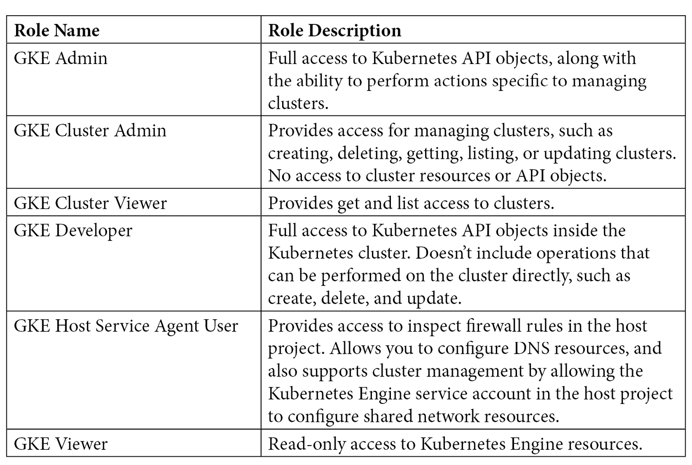

# *第九章*：使用 GKE 安全构造保护集群

Kubernetes（或 K8s）是一个开源的容器编排系统，用于运行容器化应用程序，但它需要大量的工作来设置和维护。**Google Kubernetes Engine**（**GKE**）是 K8s 的增强版本，具有托管性质，将主控组件从用户中抽象出来，提供自动升级功能，并支持如 DNS、日志记录和监控仪表板等内建功能，而不是将这些功能作为外部插件进行维护。Kubernetes 包含许多关键概念、术语和对象。最后两章（*第七章*，*理解 Kubernetes 基本知识以部署容器化应用*，和 *第八章*，*理解 GKE 基本知识以部署容器化应用*）专注于原生 Kubernetes 的功能，如集群结构，详细讲解了 Kubernetes 的关键对象，并讨论了应用程序如何在集群中调度。此外，还扩展了对特定 GKE 功能的学习，例如节点池、集群配置、自动扩展工作负载的选项，并理解 GKE 如何与其他 GCP 服务交互。

本章特别专注于理解 Kubernetes 中的基本安全构造及其应用，然后是 GKE 中的特定安全功能，这些功能对于加固集群的安全性至关重要。这里的关键是使用 GKE 特定的功能来保护运行在集群中的应用程序。

本章将涵盖以下主题：

+   **Kubernetes 中的基本安全模式**：本节深入探讨了原生 Kubernetes 中的基本安全构造，如身份验证、授权、控制平面安全性和 Pod 安全性。我们还将查看每个安全构造及其在 GKE 中的实现。

+   **加固集群安全性**：本节深入探讨了 GKE 特定的安全功能，这些功能为在 GKE 集群中运行的应用程序提供了安全选项。包括私有集群、二进制授权、容器优化操作系统等功能。

# 技术要求

本章有两个主要的技术要求：

+   一个有效的**Google Cloud Platform**（**GCP**）账户，以便实际操作 GCP 服务：[`cloud.google.com/free`](https://cloud.google.com/free)

+   安装 Google Cloud SDK：[`cloud.google.com/sdk/docs/quickstart`](https://cloud.google.com/sdk/docs/quickstart)

# Kubernetes 中的基本安全模式

一个 Kubernetes 集群可以运行多种类型的工作负载。这包括有状态应用程序、无状态应用程序、作业和 DaemonSets。然而，保护这些工作负载免受潜在安全攻击是至关重要的。原生 Kubernetes 提供了一些基本的安全构建模块，专注于基础内容，包括请求发送到集群的方式以及如何对请求进行身份验证和授权。此外，了解如何确保主控平面组件的安全，以及如何确保运行应用程序的 Pod 也能得到保护是非常重要的。我们将从原生 Kubernetes 的角度探讨这些内容，但在 GKE 中的实现也会进行讨论。我们将深入探讨的第一个安全构建模块是身份验证。

## 身份验证

**身份验证** 是确定用户身份的过程。它本质上确认用户是否如其所说的那样，并且在身份验证成功后，最终会提供对合格资源的访问权限。

Kubernetes 支持两种类别的身份验证或用户：

+   用户账户

+   Kubernetes 服务账户

让我们详细看一下这些。

### 用户账户

默认情况下，Kubernetes 没有任何支持普通用户账户的对象。因此，这些账户不能通过 API 调用创建。在 Kubernetes 中，普通或常规用户可以通过以下方式创建：

+   由管理员分发私钥

+   使用包含用户名及其关联密码列表的文件

+   通过外部身份服务提供商

在 GKE 的情况下，普通的 **用户账户** 可以由 Cloud IAM 用户提供。这些用户账户被称为成员。成员也可以作为 G Suite 域或 Cloud Identity 域的一部分进行定义。也可以通过 Google Cloud Directory Sync 将成员或用户链接到现有的活动目录，从而将其添加到 Cloud IAM。除了 Cloud IAM 用户外，GCP 服务账户也被视为成员，类似于用户。这些与 Kubernetes 服务账户不同。

**GCP 服务账户** 由 Google Cloud IAM 管理，专门用于当 GCP 资源需要与应用程序或虚拟机绑定身份，而非人类时。与此不同，Kubernetes 服务账户为运行在 Pod 内的进程提供身份，并提供对集群的访问权限。

### Kubernetes 服务账户

**Kubernetes 服务账户**是由 Kubernetes API 管理的用户。这意味着与常规用户账户不同，服务账户可以通过 API 调用进行创建和管理。事实上，Kubernetes 中的每个命名空间都有一个默认的 Kubernetes 服务账户。这些账户由 API 服务器自动创建。*服务账户接纳控制器*将创建的服务账户与运行的 Pod 关联。实际上，服务账户作为秘密存储，并在 Pod 创建时挂载到 Pod 上。这些秘密由运行在 Pod 内部的过程使用，用于访问集群内的 API 服务器。

此外，Kubernetes 服务账户用于为需要与 Kubernetes API 通信的长期运行的任务创建身份，例如运行 Jenkins 服务器。您可以使用以下 CLI 命令创建 Kubernetes 服务账户：

```
# Create kubernetes service account
kubectl create serviceaccount jenkins 
```

上述命令会创建一个 `serviceaccount` 对象，为服务账户生成一个令牌，并创建一个秘密对象来存储该令牌。可以使用以下 CLI 命令检索包含令牌的秘密：

```
# Get the definition of the service account
kubectl get serviceaccounts jenkins -o yaml
```

上述命令将产生以下输出：

```
apiVersion: v1
kind: ServiceAccount
metadata:
  # ...
secrets:
- name: jenkins-token-78abcd
```

在秘密部分显示的秘密将包含 API 服务器的公共 **证书颁发机构**（**CA** – 一个颁发数字证书的实体）、特定的命名空间和一个签名的 **JSON Web 令牌**（**JWT**）。该签名的 JWT 可以用作持有账户来验证提供的服务账户。这个服务账户最终可以用于集群内通信，甚至用于从集群外部进行身份验证，例如在 Jenkins 服务器的情况下。

每个对 Kubernetes 的请求在被处理之前需要经过身份验证。传入请求由 `kube-api` 服务器处理，它通过监听端口 `443` 并使用 HTTPS 协议进行身份验证。身份验证可以通过多种方式完成。GKE 支持以下身份验证方法：

+   OpenID Connect 令牌

+   x509 客户端证书

+   使用静态密码的基本身份验证

**OpenID Connect** 是建立在 OAuth 2.0 协议之上的一层，它允许客户端通过查询授权服务器来验证最终用户的身份。**x509 客户端证书和静态密码**相比 OpenID，呈现了更大的攻击面。在 GKE 中，默认情况下禁用了 x509 和静态密码身份验证，特别是在 Kubernetes 1.12 及更高版本创建的集群中。这有助于提高默认安全态势，因为在发生攻击时，影响的范围大大减少或降低。

这完成了关于 Kubernetes 中身份验证的主题。下一个主题将介绍 Kubernetes 中的授权。

## 授权

**授权**是确定用户是否有权限访问特定资源或执行特定功能的过程。在 Kubernetes 中，用户必须先进行身份验证或登录，并获得授权才能访问或使用特定资源。通常建议作为安全最佳实践，执行最小权限原则，因为这确保用户仅根据访问要求拥有访问资源所需的最低权限。

特定于 GKE，用户通过 Cloud Identity 进行身份验证后，可以使用两种方法进行授权。实际上，GKE 推荐同时使用这两种方法来授权访问特定资源：

+   Cloud **身份与访问管理** (**IAM**)

+   Kubernetes **基于角色的访问控制** (**RBAC**)

**Cloud IAM** 是用于管理 GCP 资源的访问控制系统。Google 账户、服务账户和 Google 群组是 Cloud IAM 中具有身份的实体。Cloud IAM 允许用户在项目级别（例如列出项目中的所有 GKE 集群）或集群级别（例如查看集群）执行操作，但主要是在集群外部进行操作。这包括向现有集群或新集群添加特定的 GKE 安全配置选项。然而，**Kubernetes RBAC** 提供了对集群内部的访问，甚至可以细化到命名空间级别。RBAC 允许您微调规则，以便为集群内的资源提供精细化的访问控制。

总结一下，Cloud IAM 定义了谁可以查看或更改 GKE 集群的配置，而 Kubernetes RBAC 定义了谁可以查看或更改特定 GKE 集群内的 Kubernetes 对象。GKE 将 Cloud IAM 和 Kubernetes RBAC 集成在一起，根据用户是否拥有必要的权限来授权用户在资源上执行操作。现在，让我们从通过 Cloud IAM 授权 GKE 开始，了解这两种授权方法。

通过 Cloud IAM 授权 GKE

Cloud IAM 访问控制由三个主要元素组成，具体如下：

+   **谁**：指的是身份验证；具体来说，是发出请求的成员的身份。

+   **什么**：指的是授权；具体来说，是授权请求所需的权限集。权限不能直接分配给成员；而是通过一组权限组成角色，然后将角色分配给成员。

+   **哪个**：指的是请求已通过身份验证和授权可以访问的资源。在 GKE 中，这指的是 GKE 资源，如集群或集群内部的对象。

GKE 提供了多个预定义的 Cloud IAM 角色，这些角色为 Kubernetes 引擎资源提供细粒度访问权限。下表总结了授权或执行 GKE 操作所需的关键预定义 IAM 角色：



你始终可以使用自定义角色并指定最小所需的权限集。这在 GKE 预定义角色权限过于宽松或不适合当前用例时尤为重要，以确保符合最小权限原则。

接下来，我们将了解 Kubernetes RBAC。

### Kubernetes RBAC

**Kubernetes RBAC** 是一种授权机制，可以基于分配给个别用户的角色限制对特定资源的访问。RBAC 是 Kubernetes 的本地安全功能，提供了管理用户帐户权限的选项。Kubernetes RBAC 可以作为 Cloud IAM 的补充。如果 Cloud IAM 可以定义操作集群及集群内 API 对象的角色，则可以使用 RBAC 来定义对集群内特定 API 对象的精细访问权限。

Kubernetes RBAC 主要有三个元素，具体如下：

+   **主体**：指一组可以向 Kubernetes API 发出请求的用户或流程（包括 Kubernetes 服务帐户）。

+   **资源**：指一组 Kubernetes API 对象，例如 Pod、Deployment、Service 等。

+   **操作符**：指可以对资源执行的一组操作，例如获取（get）、列出（list）、创建（create）、观察（watch）、描述（describe）等。

上述元素通过两个 RBAC API 对象连接：

+   **角色**：连接 API 资源和操作符

+   **RoleBindings**：将角色与主体连接

角色和 RoleBindings 可以应用于集群级别或命名空间级别。接下来的子章节将讨论这些内容，首先是 *角色*。

### 角色

**角色** 连接 API 资源和操作符（verbs）。RBAC 中有两种类型的角色。RBAC 角色在命名空间级别定义，而 RBAC ClusterRole 在集群级别定义。我们将在接下来的子章节中详细介绍这些内容，首先从 RBAC 角色开始。

RBAC 角色

以下是为特定命名空间定义的 RBAC 角色：

```
apiVersion: rbac.authorization.k8s.io/v1
kind: Role
metadata:
  name: viewer
  namespace: production
rules:
apiGroups: [""]
   resources: ["pods"]
   verbs: ["get", "list"]
```

该定义表示一个 `viewer` 角色，该角色将资源 pod 与特定操作符（`get` 和 `list`）连接，在 `production` 命名空间中定义。每个角色只能定义一个命名空间。对于核心组，`apiGroups` 部分是可选的。但是，`apiGroups` 应该为非核心组指定。此外，还可以定义一个更精细的角色，其中还会指定特定的资源名称。

可以向角色添加多个规则。规则是累加的。RBAC 角色不支持拒绝规则。以下是对先前 RBAC 角色的扩展，现在包括多个规则并指定资源名称：

```
apiVersion: rbac.authorization.k8s.io/v1
kind: Role
metadata:
  name: viewer
  namespace: production
rules:
apiGroups: [""]
   resources: ["pods"]
   verbs: ["get", "list"]
apiGroups: [""]
resources: ["ConfigMap"]
resourceNames: ["prodEnvironmentVariables"]
verbs: ["get", "list"]
```

在上述规范中，viewer RBAC 角色现在可以对 *Pods* 和 `ConfigMap` 执行 `get` 和 `list` 操作。但是，对 `ConfigMap` 的操作严格限制为名为 `prodEnvironmentVariables` 的特定 `ConfigMap`。

这完成了关于 RBAC Role 的这一小节，这是两种可能的 RBAC 角色之一。另一个——*RBAC ClusterRole*——将在接下来的小节中详细介绍。

#### RBAC ClusterRole

RBAC ClusterRole 在集群级别授予权限，因此你无需定义特定的命名空间。其余元素及其用法与 RBAC Role 相同。

命名空间范围与集群范围

有些资源是按命名空间级别作用的，有些则是按集群级别作用的。Pods、Deployments、Services、Secrets、ConfigMaps、PersistentVolumeClaim、Roles 和 RoleBindings 是命名空间级别的资源。Nodes、PersistentVolume、CertificateSigningRequests、Namespaces、ClusterRoles 和 ClusterRoleBindings 是集群级别的资源。

以下是 RBAC ClusterRole 的定义，目的是定义一个可以对集群中的节点执行 `list`、`get`、`create` 和 `delete` 操作的角色：

```
apiVersion: rbac.authorization.k8s.io/v1
kind: ClusterRole
metadata:
  name: node-administrator
rules:
apiGroups: [""]
   resources: ["nodes"]
   verbs: ["get", "list", "create", "delete"]
```

这完成了关于角色的这一小节。接下来的小节将解释如何通过 *RoleBindings* Kubernetes API 对象将角色与用户绑定。

### RoleBindings

**RoleBindings** 通过 Kubernetes API 对象将主题与角色连接。RBAC 中有两种类型的 RoleBindings。RBAC RoleBindings 定义在命名空间级别，而 RBAC ClusterRoleBindings 定义在集群级别。两者将在接下来的子节中讨论。

RBAC RoleBindings

以下是为特定命名空间定义的 RBAC RoleBinding 的定义，用于将用户与 RBAC 角色连接：

```
apiVersion: rbac.authorization.k8s.io/v1
kind: RoleBinding
metadata:
  name: viewer-rolebinding
  namespace: production
subjects:
- kind: User
  name: joe@organization.com
  apiGroup: rbac.authorization.k8s.io
roleRef:
  kind: Role
  name: viewer
  apiGroup: rbac.authorization.k8s.io
```

上述 RBAC RoleBinding 已为生产命名空间定义，并将主题部分下定义的元素与 `roleRef` 下定义的元素连接起来。具体来说，RBAC RoleBinding 将用户 `joe@organization.com` 连接到 `viewer` RBAC 角色。

需要注意的是，主题部分下的 `kind` 可以是 *User*、*Group* 或 *ServiceAccount* 类型。从 GKE 的角度来看，这些值可以来自 Cloud IAM 用户、Cloud IAM 服务账户或 Kubernetes 服务账户。

#### RBAC ClusterRoleBindings

RBAC ClusterRoleBindings 将主题与集群级别的 RBAC ClusterRole 绑定，并且不受命名空间级别的限制。你只能绑定集群范围的资源，而不能绑定命名空间范围的资源。

以下是 RBAC `ClusterRoleBindings` 的定义，目的是将特定的管理员用户绑定到名为 `node-administrator` 的 RBAC `ClusterRole`，以便对 GKE 节点执行操作：

```
apiVersion: rbac.authorization.k8s.io/v1
kind: ClusterRoleBinding
metadata:
  name: node-administrator-clusterrolebinding
subjects:
- kind: User
  name: theadmin@organization.com
  apiGroup: rbac.authorization.k8s.io
roleRef:
  kind: ClusterRole
  name: node-administrator
  apiGroup: rbac.authorization.k8s.io
```

这完成了关于 RoleBindings 的这一小节，其中解释了两种类型的 RoleBindings。总体而言，这也结束了关于 Kubernetes RBAC 和 Kubernetes 授权的这一小节。接下来的小节将讨论另一个关键的 Kubernetes 安全构件——*控制平面安全*——它专注于保护主控制平面组件。

## 控制平面安全

根据 GCP 的共享责任模型，GKE 的 `etcd` 数据库、控制器管理器等由 Google 管理。因此，Google 负责保护控制平面，而最终用户负责保护节点、容器和 Pod。

每个 GKE 集群都有自己的根证书颁发机构（CA）。这个 CA 代表一个发行受信证书的实体。这个受信证书用于保护机器之间的连接。CA 的根密钥由 Google 的内部服务管理。集群中的主节点与节点之间的通信是基于由 CA 颁发的证书所提供的共享信任根来进行加密的。默认情况下，GKE 使用单独的集群 CA 来为集群内的 `etcd` 数据库提供证书。由于每个集群使用不同的 CA，一个集群中的 CA 被破坏时无法用来破坏另一个集群。

Kubernetes API 服务器和 `kubelet` 使用安全的网络通信协议，如 TLS 和 SSH。它们通过使用集群根 CA 颁发的证书来实现这一点。当集群中创建一个新节点时，该节点会在创建时注入一个共享密钥。然后，`kubelet` 使用这个密钥向集群根 CA 提交证书签名请求。这使得 `kubelet` 能够在节点创建时获取客户端证书，并在需要更新或轮换时获得新证书。`kubelet` 使用这些客户端证书与 API 服务器进行安全通信。

您必须定期轮换证书或凭证，以减少泄露的影响。但有时，可能很难平衡凭证应轮换的频率。这是因为集群 API 服务器会在短时间内不可用。请注意，API 服务器和客户端使用的凭证可以进行轮换，除了 `etcd` 证书，这些由 Google 管理。

**以下是您应遵循的逐步凭证轮换过程**：

1.  轮换过程从为集群主节点创建一个新的 IP 地址开始，同时保留现有的 IP 地址。

1.  在轮换过程中，`kube-apiserver` 将不可用，但现有的 Pod 会继续运行。

1.  由于新 IP 地址的结果，新的凭证会被颁发给控制平面。

1.  一旦 GKE 重新配置了主节点，节点会自动由 GKE 更新为使用新的 IP 地址和凭证。此外，节点版本也会更新为最接近的支持版本。

1.  每个 API 客户端必须更新为新地址。轮换过程必须完成，集群主节点才能开始使用新的 IP 地址和新的凭证，并移除旧的 IP 地址和旧的凭证。

1.  主节点将停止提供旧的 IP 地址。

1.  如果轮换过程已开始但在 7 天内未完成，则 GKE 会自动完成轮换。

Pod 运行在节点上，默认情况下，Pod 可以访问它们所在节点的元数据。这包括节点的密钥，用于节点配置。因此，如果 Pod 被攻破，节点密钥也会被攻破，从而对整个集群产生负面影响。为防止这种事件发生并保护集群元数据，应该采取以下步骤：

+   绑定到节点的服务帐户不应包括`compute.instance.get`权限。这样可以阻止对这些节点的计算引擎 API 调用。

+   传统的计算引擎 API 端点应禁用（版本 0.1 和 v1-beta-1），因为这些端点支持直接查询元数据。

+   使用工作负载身份从运行在 GKE 中的应用程序访问 Google Cloud 服务。这可以防止 Pod 访问计算引擎元数据服务器。

这完成了本小节关于如何在 GKE 中保护主控平面组件的内容。接下来，我们将通过查看 Pod 安全性来了解如何保护集群中运行的 Pod。

## Pod 安全性

一个或多个容器运行在 Pod 内。默认情况下，这些容器可以部署为特权提升。它们也被称为特权容器。**特权容器**具有主机机器的 root 权限，可以访问普通容器无法访问的资源。以下是特权容器的一些使用场景：

+   在 Docker 容器内运行 Docker 守护进程

+   需要直接硬件访问容器

+   在开源自动化服务器（如 Jenkins）上自动化 CI/CD 任务

运行特权容器很方便，但从安全角度来看是不可取的，因为它允许对主机资源的关键访问。如果被网络犯罪分子利用，这种特权可能会成为一个缺点。攻击者将获得 root 访问权限，这意味着他们可以识别和利用软件漏洞以及可能的配置错误，例如没有身份验证或最低强度凭据的容器。对于加密货币矿工来说，基本上这是一个可以利用这种特权进行未经授权需求的游乐场。

有两种可能的方式来定义对 Pod 中容器操作的限制。它们如下：

+   Pod 安全上下文

+   Pod 安全策略

让我们更详细地了解这些选项。

Pod 安全上下文

Pod 的安全设置可以通过 Pod 规格中的`securityContext`字段进行指定。这适用于 Pod 内的所有容器，并强制执行特定的安全措施。它们可以定义是否可以运行特权容器，以及容器中的代码是否可以提升到 root 权限。

安全上下文可以在 Pod 级别和容器级别定义。容器级别的安全上下文优先于 Pod 级别的安全上下文。以下是`securityContext`的 Pod 清单 YAML 摘录：

```
apiVersion: v1
kind: Pod
metadata:
  name: my-pod
spec:
  securityContext:
    runAsUser: 3000
  containers:
  - name: nginx
    image: nginx
    securityContext:
      runAsUser: 1000
      allowPrivilegeEscalation: false
  - name: hello
    image: hello-world
```

上述规范表示一个包含两个容器的 pod：`nginx` 和 `hello`。pod 中的 `securityContext` 定义指定容器内的进程以用户 ID `3000` 运行。重要的是要指定一个非零的数字，因为在 Linux 中，0 表示特权用户的用户 ID。不指定 0 会去除容器内运行代码的 root 特权。pod 上的 `securityContext` 适用于 pod 内的所有容器，除非每个单独的容器定义了可选的 `securityContext`。在这种情况下，容器上的 `securityContext` 优先。因此，在上面的例子中，`hello` 容器将在其容器内以 `3000` 作为用户 ID 运行进程，而 `nginx` 容器则以 `1000` 作为用户 ID 运行进程。

在容器中使用 allowPrivilegeEscalation

我们可以以多种方式使用这个字段。一种情形是，当 pod 层没有定义 `securityContext`，但需要在特定容器层面避免权限提升时，可以显式地使用此字段。

安全上下文允许你控制主机命名空间、网络、文件系统和卷类型的使用。安全上下文可以用来控制其他安全设置：

+   `NET_ADMIN` 允许你执行与网络相关的操作，例如修改路由表、启用多播等。`SYS_TIME` 允许你设置系统时钟：

    ```
    . . .
    spec:
      containers:
      - name: security-context-example
        image: gcr.io/demo/security-context-example
        securityContext:
          capabilities:
            add: ["NET_ADMIN", "SYS_TIME"]
    ```

+   **启用 seccomp**：阻止容器中的代码进行系统调用。

+   **启用 AppArmor**：使用安全配置文件限制单个程序的操作。

为每个 pod 甚至每个容器配置 `securityContext` 的缺点是它需要大量的工作，尤其是在集群中涉及成百上千个 pod 时。这可以通过使用 *Pod 安全策略* 来解决。

### Pod 安全策略

**Pod 安全策略** 是一个集群级别的资源，基于定义的策略管理创建和更新 pod 的访问权限。策略是一组需要满足的条件。Pod 安全策略使得定义和管理安全配置变得更容易。这允许你将安全限制应用于多个 pod，而不需要在每个 pod 定义中指定和管理这些细节。

Pod 安全策略可以强制执行以下内容：

+   **禁用特权容器**：可以禁用特权容器，并且可以选择性地针对特定的命名空间和特定的服务账户应用。

+   `readOnlyRootFilesystem` 可以设置为 `true`。

+   `MustRunAsNonRoot` 标志设置为 `true`。

+   对特定目录使用 `hostpath`，而不是整个文件系统。

定义 Pod 安全策略时需要的两个元素是：

+   `PodSecurityPolicy`对象代表一组限制、要求和默认值，这些值的定义类似于 Pod 内的安全上下文。此对象还指定了需要满足的所有安全条件，以便 Pod 能够被接纳到集群中。这些规则在 Pod 创建或更新时会被特别应用。

+   `PodSecurityPolicy`控制器是一个准入控制器。准入控制器根据一个或多个 Pod 安全策略验证和修改请求。该控制器实质上决定 Pod 是否可以创建或修改。

#### 创建 PodSecurityPolicy 对象

如果您需要创建一个`PodSecurityPolicy`对象，以便在特定命名空间和特定服务账户中不能运行特权容器，您应该遵循以下步骤：

1.  使用`pod-security-policy.yaml`文件定义一个`PodSecurityPolicy`Kubernetes 对象。以下是一个示例规范：

    ```
    PodSecurityPolicy resource using the following CLI command:

    ```

    # 创建 Pod 安全策略

    kubectl apply -f pod-security-policy.yaml

    ```

    ```

1.  要授权特定的`PodSecurityPolicy`，请定义一个 ClusterRole，其资源设置为`podsecuritypolicies`，并且针对特定策略的资源名称。以下是`my-cluster-role.yaml`的`ClusterRole`示例：

    ```
    apiVersion: rbac.authorization.k8s.io/v1
    kind: ClusterRole
    metadata:
      name: my-cluster-role
    rules:
    - apiGroups:
      - policy
      resources:
      - podsecuritypolicies
      verbs:
      - use
      resourceNames:
      - my-pod-security-policy
    ```

1.  使用以下 CLI 命令创建您的`ClusterRole`：

    ```
    # Create ClusterRole
    kubectl apply -f my-cluster-role.yaml
    ```

1.  要授权已创建的 ClusterRole 针对特定主体（可以是服务账户），并且可选地在特定命名空间中定义一个`RoleBinding`。以下是`my-role-binding.yaml`的示例规范，其中将 RoleBinding 应用于特定服务账户：

    ```
    # Bind the ClusterRole to the desired set of service accounts
    apiVersion: rbac.authorization.k8s.io/v1
    kind: RoleBinding
    metadata:
      name: my-role-binding
      namespace: my-namespace
    roleRef:
      apiGroup: rbac.authorization.k8s.io
      kind: ClusterRole
      name: my-cluster-role
    subjects:
      - kind: ServiceAccount
        name: sa@example.com
        namespace: my-namespace
    ```

1.  使用以下 CLI 命令创建您的`RoleBinding`：

    ```
    # Create RoleBinding
    kubectl apply -f my-role-binding.yaml
    ```

1.  在集群创建时或更新现有集群时启用`PodSecurityPolicy`控制器。以下是这两种选项的 CLI 命令：

    ```
    # To enable at the time of cluster creation
    gcloud beta container clusters create <cluster-name> --enable-pod-security-policy
    # To enable on an existing cluster
    gcloud beta container clusters update <cluster-name> --enable-pod-security-policy
    ```

1.  如果您需要禁用`PodSecurityPolicy`控制器，请使用以下 CLI 命令：

    ```
    To disable PodSecurityPolicy controller
    gcloud beta container clusters update <cluster-name> --no-enable-pod-security-policy
    ```

在 GKE 中，`PodSecurityPolicy`控制器在集群创建时默认是禁用的，或者没有启用。因此，您需要显式启用它。然而，控制器应该仅在定义了所有相关的`PodSecurityPolicy`对象及其授权要求之后启用。如果有多个 Pod 安全策略，这些策略将按字母顺序进行评估。

本节内容已结束，讨论了控制平面（身份验证）、工作节点和部署（授权）中的基本安全概念。本节还参考了 GKE 及这些概念如何在 GKE 中实现。接下来的部分将重点讨论 GKE 在加固集群安全方面的具体建议，以确保在集群内运行的应用程序安全。GKE 提供了一些功能来支持这些建议，所有这些功能将详细列出。

# 在 GKE 中加固集群安全

在保护集群内部运行的应用程序时，确保 Kubernetes 集群的安全应当是首要任务。GKE 提供了许多功能来强化集群的安全性。例如，GKE 控制平面会根据共享责任模型自动打补丁和升级。此外，新的 GKE 集群还会启用节点自动升级功能。

以下是一些可用于保护和强化集群的 GKE 关键功能。这些功能中的部分会在创建 GKE 集群时默认启用：

+   GKE 支持一种名为**私有集群**的集群类型，它提供了限制控制平面和节点访问的选项。需要在集群创建时指定此配置。

+   GKE 支持**容器优化操作系统**镜像。这是一个为运行容器量身定制、优化和强化的容器优化操作系统。

+   GKE 支持**受保护的 GKE 节点**，通过使用可验证的节点身份和完整性来增强集群安全性。此功能可以在集群创建时启用，也可以更新现有集群来启用。

+   GKE 允许在新建或现有集群上强制使用**网络策略**。网络策略可以限制集群内 pod 之间的通信，从而在发生安全事件时减少影响范围。

+   GKE 推荐使用**二进制授权**，这是一种确保供应链软件安全的过程。通过此方法，您可以控制只部署集群中受信任的镜像。

+   GKE 可以通过**工作负载身份**与其他 Google 服务和 API 进行身份验证。这是推荐的做法，应该避免在节点级别使用服务账户密钥。

+   GKE 通过与 Google Secret Manager 集成，为敏感数据（如机密信息）提供额外的保护层。**Secret Manager** 是一个 GCP 服务，用于保护 API 密钥、密码、证书和其他敏感数据。GKE 还支持使用第三方密钥管理工具，如 HashiCorp Vault。

以上每个 GKE 特性将在各自的章节中进行详细讲解。我们将从 GKE 私有集群开始。

## GKE 私有集群

**GKE 私有集群**是 GKE 中的一种可能的集群配置，特别是在网络隔离方面。这种集群配置隔离了节点与公共互联网的连接，包括集群的入站流量和出站流量。因为集群中的节点将没有公开的 IP 地址，仅拥有内部 IP 地址。

如果节点需要外部互联网访问，可以使用托管的 `NodePort` 或 `LoadBalancer` 类型。如果服务是 `LoadBalancer` 类型，则可以使用 GCP 的 HTTP(S) 负载均衡器，并将提供一个外部 IP 地址，以允许流量进入集群。GKE 私有集群的关键在于其控制平面的功能，因为这是与非私有集群的主要区别。我们接下来会详细讨论这一点。

### 私有集群中的控制平面

在 GKE 中，`kube-apiserver` 由控制平面管理。Google 在 Google 自有项目中的 VPC 网络上运行控制平面。对于私有集群，主控制平面位于 Google 自有的 VPC 网络中，并通过 VPC 网络对等连接到你的集群的 VPC 网络。节点和控制平面之间的流量通过内部 IP 地址进行路由。

你可以通过端点访问控制平面。一般来说，端点有两种类型：

+   `kubectl` 工具通过公共端点访问。

+   **私有端点**：这表示控制平面 VPC 网络中的内部 IP 地址。这个设置非常特定于私有集群。私有集群中的节点通过内部 IP 地址与控制平面中的组件进行通信。

总结来说，公共集群控制平面具有面向互联网的端点，而私有集群控制平面可以通过私有端点和公共端点进行访问。此外，私有集群只能在 VPC 本地模式下创建（参见 *第八章*，*理解 GKE 基础知识以便部署容器化应用程序*）。可以通过以下三种配置之一来控制通过端点访问私有集群的级别：

+   已禁用公共端点访问

+   已启用公共端点访问；已启用授权网络以进行有限访问

+   已启用公共端点访问；已禁用授权网络

接下来的子章节将详细讨论每种配置，从 *已禁用公共端点访问* 开始。

#### 已禁用公共端点访问

此配置表示一个没有公共端点访问权限的私有 GKE 集群。这非常安全，因为没有通过公共互联网访问控制平面的方式。集群只能从子网以及用于 pod 的次要范围进行访问。可以通过更新主授权网络并使用虚拟机的私有 IP（CIDR 格式）将同一区域的虚拟机添加到集群中。

如果需要从外部访问集群，则可以通过 Cloud VPN 或 Cloud Interconnect 连接到 GKE 私有集群的 VPC 网络。连接通过内部 IP 地址建立。可以通过使用 `master-authorized-networks` 来限制可以访问控制平面的内部 IP 地址列表。这不包括公共 IP 地址，因为公共端点的访问已被禁用。

如果你需要创建一个不允许客户端访问公共端点的私有 GKE 集群，请使用以下 CLI 命令：

```
# For Standard Clusters
gcloud container clusters create my-private-cluster \
    --create-subnetwork name=my-subnet \
    --enable-master-authorized-networks \
    --enable-ip-alias \
    --enable-private-nodes \
    --enable-private-endpoint \
    --master-ipv4-cidr 172.20.4.32/28
```

上述 CLI 命令中的关键标志如下：

+   `--enable-master-authorized-networks`：集群控制平面的访问仅限于内部 IP 地址列表。不能包含外部 IP 地址。

+   `--enable-private-nodes`：表示集群节点没有外部 IP 地址。

+   `--enable-private-endpoint`：表示该集群仅由主 API 端点的私有 IP 地址管理。

下一部分聚焦于一个配置，其中启用了公共端点访问，但访问受限。

#### 启用公共端点访问；授权网络启用以进行有限访问

该配置表示一个私有 GKE 集群配置，其中对控制平面的访问既受内部也受外部 IP 地址的限制。可以将特定的内部和外部 IP 地址作为授权网络的一部分进行指定。因此，只有当外部 IP 地址包含在授权网络中时，具有外部 IP 地址的机器才能与 GKE 私有集群通信。

如果你需要创建一个仅对公共端点提供有限访问的私有 GKE 集群，请使用以下 CLI 命令：

```
# For Standard Clusters
gcloud container clusters create my-private-cluster-1 \
    --create-subnetwork name=my-subnet-1 \
    --enable-master-authorized-networks \
    --enable-ip-alias \
    --enable-private-nodes \
    --master-ipv4-cidr 172.20.8.0/28
```

请注意，这些标志大部分与前一部分相同，唯一不同的是省略了 `--enable-private-endpoint` 标志。省略此标志意味着集群控制平面既可以通过私有端点也可以通过公共端点访问，但访问仅限于作为主授权网络的一部分的允许 IP 地址。

下一部分聚焦于一个配置，其中启用了公共端点访问，且访问没有受到限制。

启用公共端点访问；禁用授权网络

这是创建私有 GKE 集群时的默认配置选项。本质上，集群可以从任何 IP 地址访问控制平面。这是最不限制的选项。

如果你需要创建一个允许不受限制访问公共端点的私有 GKE 集群，请使用以下 CLI 命令：

```
# For Standard Clusters
gcloud container clusters create my-private-cluster-2 \
    --create-subnetwork name=my-subnet-2 \
    --no-enable-master-authorized-networks \
    --enable-ip-alias \
    --enable-private-nodes \
    --master-ipv4-cidr 172.20.10.32/28
```

请注意，这些标志大部分与启用了公共端点访问但未启用主授权网络的配置中的标志相同。因此，在通过私有端点或公共端点访问私有 GKE 集群的控制平面时，不会有 IP 地址访问限制。

这一部分结束了关于私有集群的讨论，私有集群中的节点可能会被隔离或限制访问公共互联网。接下来的主题将重点介绍容器优化操作系统，它通过强化容器镜像并添加关键的安全特性，从而保护应用程序。此功能在 GKE 中可用。

## 容器优化操作系统

`cos_containerd` 镜像是一个基于 Linux 的内核，经过 Google 定制，基于 Chromium OS。它可以持续扫描内核级别或操作系统任何包的漏洞。在发现漏洞时，可以修补和更新任何包。它特别针对生产环境中的容器运行进行优化和加固。以下是其一些关键特性：

+   **最小化操作系统占用空间**：不包含不必要的包，从而减少操作系统的攻击面。

+   **不可变根系统和验证启动**：根文件系统始终以只读方式挂载。这可以防止攻击者在文件系统上进行更改。校验和也会在构建时计算，并在每次启动时由内核进行验证。

+   `/etc/`。这很有用，因为您可以在运行时允许写入配置，例如向文件系统添加用户。然而，这些更改在重启后不会持久化。

+   **安全加固内核**：支持 seccomp 和 AppArmor 等功能，以强制执行精细化的安全策略。

+   **自动更新**：支持自动更新以获取新的安全功能或运行中的 GCE 虚拟机的安全补丁。

+   `22`。

容器优化操作系统确保用于容器化应用程序的基础镜像是安全的并且具有最小的占用空间，但同样重要的是，这些容器需要在同样安全或受保护的节点上运行。我们将在下一个主题中讨论这一点。

## 受保护的 GKE 节点

**受保护的 GKE 节点**是一个 GKE 功能，通过提供强大且可验证的节点身份和完整性来增强集群的安全性。这些节点基于计算引擎受保护的虚拟机（Shielded VMs）。

受保护的虚拟机

受保护的虚拟机是 GCP 的一项功能，确保虚拟机实例在启动或内核级别不会被攻破。GCP 通过使用安全启动和 **虚拟受信平台模块**（**vTPM**）来实现这一点。受保护的虚拟机会在启动过程中强制执行并验证所有组件的数字签名，在失败时停止启动过程。

受保护的 GKE 节点功能可防止攻击者在 Pod 漏洞被利用时伪装成集群中的节点。如果启用了受保护的 GKE 节点功能，GKE 控制平面将通过加密方式验证以下内容，并限制攻击者伪装集群中节点的能力：

+   GKE 集群中的每个节点都是在 Google 数据中心运行的 GCE 虚拟机。

+   每个节点都是集群提供的托管实例组的一部分。

+   `kubelet` 使用集群提供的证书与节点进行身份验证。

您可以使用以下 CLI 命令在新的/现有集群中启用受保护的 GKE 节点，验证是否启用了受保护的 GKE 节点，并禁用受保护的 GKE 节点：

```
# Enable Shielded GKE nodes on new cluster
gcloud container clusters create <cluster-name> --enable-shielded-nodes
# Enable Shielded GKE nodes on existing cluster
gcloud container clusters update <cluster-name> --enable-shielded-nodes
# Verify that Shielded GKE nodes are enabled (check for enabled under shieldedNodes as true)
gcloud container clusters describe <cluster-name>
# Disable Shielded GKE nodes (This will recreate the control plane and nodes thus leading to downtime)
gcloud container clusters update <cluster-name> --no-enable-shielded-nodes
```

运行受保护的 GKE 节点不会产生额外费用。然而，它们比常规节点产生更多的日志，从而导致 Cloud Logging 的总体费用增加。下一个主题将解释另一个 GKE 安全功能，该功能通过限制集群中 pod 之间的流量，在发生安全威胁时减少攻击面。

## 网络策略——限制 pod 之间的流量

Kubernetes 集群中的所有 pod 可以相互通信。然而，Kubernetes 提供了在 pod 之间的流量需要在 IP 地址或端口级别进行控制时的选项。强烈建议采取这种思路，以确保整个集群不会受到攻击，并且在发生安全攻击时可以控制攻击面。Kubernetes 网络策略帮助你限制集群内 pod 之间的流量。

**网络策略**在 Kubernetes 中允许你根据具有匹配标签选择器的 pod、具有匹配标签选择器的命名空间，或具有特定 IP 地址和端口组合的网络实体，指定 pod 如何与这些网络实体进行通信（包括能够指定例外 IP 地址）。这可以为入口或出口流量在两个方向上进行定义。

GKE 提供了在创建集群时强制使用网络策略的选项，如下所示：

```
# Enforce network policy for a new GKE cluster
gcloud container clusters create <cluster-name> --enable-network-policy
```

可选地，我们可以通过使用以下 CLI 命令在现有集群上强制执行此操作：

```
# Enable add-on to enforce network policy on existing cluster
gcloud container clusters update <cluster-name> --update-addons=NetworkPolicy=ENABLED
# Enforce network policy after enabling add-on for existing cluster. This will recreate the cluster node pools
gcloud container clusters update <cluster-name> --enable-network-policy
```

可以在[`kubernetes.io/docs/concepts/services-networking/network-policies/`](https://kubernetes.io/docs/concepts/services-networking/network-policies/)找到一个示例网络策略。

除了指定具体的策略外，Kubernetes 还允许你定义默认的网络策略。以下是一些支持的默认策略：

+   默认拒绝所有入口流量

+   默认拒绝所有出口流量

+   默认拒绝所有入口和所有出口流量

+   默认允许所有入口流量

+   默认允许所有出口流量

如果没有定义特定的网络策略或默认策略，则集群将允许 pod 之间的所有入口和出口流量。

下一个主题详细介绍了另一个关键的 GKE 功能——二进制授权，它可以控制确保仅受信任的镜像被部署到 GKE 集群中。

二进制授权

**二进制授权**是 Google 提供的一个部署时安全服务。它通过部署策略确保只有受信任的容器被部署到 GKE 集群中。该策略的目标是确定允许哪些镜像，哪些镜像可以豁免。为了实现这一目标，二进制授权与容器分析（Container Analysis）集成——这是一个 GCP 服务，用于扫描存储在容器注册表中的容器镜像的漏洞。此外，**容器分析**还存储了在授权过程中使用的受信任元数据。

二进制授权策略是安全导向的，并包括一个或多个规则。规则是在图像部署到 GKE 集群之前需要通过的约束条件。已认证的图像是已由*签名者*验证或保证的图像。最常见的规则之一是需要数字签名的验真书来验证图像是否已经被认证。当通过 Cloud Build 构建容器图像时，图像的摘要会由签名者进行数字签名，从而创建验真书。在部署时，二进制授权会强制使用签名者来验证验真书。二进制授权仅允许*已认证*的图像部署到集群中。任何未经授权的图像如果不符合二进制授权策略将被拒绝。此外，如果没有找到有效的并由签名者信任的键签名的验真书，还可能返回*由签名者拒绝*错误。要解决*由签名者拒绝*错误，请创建一个验真书并提交给二进制授权。

以下是一些包含验真书的常见用例：

+   **构建验证**：验证容器图像是否由特定的构建系统构建，或者是否来自特定的**持续集成**（**CI**）流水线。

+   **漏洞扫描**：验证 CI 构建的容器图像是否已通过 Container Analysis 进行漏洞扫描，并且结果已定义在可接受的水平上。

配置二进制授权是一个多步骤的过程。以下是涉及的步骤的高级摘要：

1.  启用所需的 API。这包括 GKE、Container Analysis 和二进制授权的 API。

1.  创建启用了二进制授权的 GKE 集群。

1.  设置一个注释。这是与一个签名者相关联的 Container Analysis 存储中的元数据。

1.  使用 PKIX 密钥设置加密密钥，以安全地验证签名者的身份；仅强制验证方可以授权容器图像。**公钥基础设施**（**PKIX**）密钥是指在 X.509 标准中定义的公钥证书。

1.  创建一个签名者；也就是说，一个可以证明图像真实性的人或过程。

1.  创建一个二进制授权策略。默认策略是允许所有图像。其他选项包括拒绝所有图像或拒绝特定签名者的图像。

1.  可选地，可以配置图像以使其免于二进制授权策略。

正如我们之前提到的，二进制授权（Binary Authorization）可以拒绝部署违反策略条件或未满足的镜像。然而，您可以在 Pod 部署中指定一个名为“break-glass”的标志作为注释，这样即使镜像违反了策略，也允许创建 Pod。这个“break-glass”注释标志会被记录下来，审计日志中的事件响应团队可以通过它在查看或调试部署时识别出来。以下是包含“break-glass”标志注释的 Pod 规格片段：

```
apiVersion: v1
kind: Pod
metadata:
  name: my-break-glass-pod
  annotations:
    alpha.image-policy.k8s.io/break-glass: "true"
```

本节内容已结束，接下来的主题详细介绍了另一个关键的 GKE 安全功能，该功能通过工作负载身份允许将 Google Cloud IAM 服务账户作为 Kubernetes 服务账户使用，从而为在 GKE 集群内运行的应用程序提供更安全的 GCP 服务访问。

## 工作负载身份

GKE 集群可以运行可能需要访问 Google 特定 API 的应用程序，如计算 API、存储 API、数据库 API 等。GKE 推荐使用 *工作负载身份* 来从在 GKE 内运行的应用程序访问 GCP 服务。工作负载身份允许您将 Kubernetes 服务账户作为 Google 服务账户使用。这使得每个应用程序能够拥有独立的身份和细粒度的授权。

工作负载身份使用集群工作负载身份池的概念，该池允许 Google Cloud IAM 信任并理解 Kubernetes 服务账户凭据。集群的工作负载身份池将设置为 `PROJECT_ID.svc.id.goog`，并在项目级别自动创建。在这种情况下，Cloud IAM 将通过以下成员名称对 Kubernetes 服务账户进行身份验证：

```
serviceAccount:PROJECT_ID.svc.id.goog[K8S_NAMESPACE/KSA_NAME]
# PROJECT_ID.svc.id.good - workload identity pool on the cluster
# KSA_NAME Kubernetes - service account making the request
# K8S_NAMESPACE Kubernetes - namespace with Kube SA is defined
```

由于集群的工作负载身份池、服务账户名称和 Kubernetes 命名空间的关系，前述成员的名称是唯一的。因此，具有匹配的三元组的多个服务账户将映射到相同的成员名称。

### 启用工作负载身份

按照以下步骤在 GKE 集群上启用工作负载身份：

1.  导航到 `IAM 服务账户凭据` API 并启用它。

1.  使用以下 CLI 命令创建一个启用了工作负载身份的新集群：

    ```
    # Create cluster with workload identity enabled
    gcloud container clusters create <CLUSTER_NAME> \
      --workload-pool=<PROJECT_ID>.svc.id.goog
    ```

1.  使用以下 CLI 命令更新启用了工作负载身份的现有集群：

    ```
    # Update existing cluster with workload identity enabled
    gcloud container clusters update <CLUSTER_NAME> \
     --workload-pool=<PROJECT_ID>.svc.id.goog
    ```

本节关于工作负载身份的内容已经结束，同时也结束了关于 GKE 安全功能的这一主要部分，Google 推荐这些功能来强化集群的安全性。

总结

在本章中，我们讨论了一些从原生 Kubernetes 或 K8s 角度出发的基本安全概念。我们还扩展了这些概念，探讨了它们在 GKE 中的等效用法或实现方式。随后，我们深入探讨了某些 GKE 特有的安全功能，这些功能对于加强集群安全至关重要。这包括使用节点自动升级，确保节点运行最新版本的 Kubernetes，或使用 Google 的容器优化操作系统，而不是通用的 Linux 发行版系统。我们还探讨了使用私有集群，其中可以限制访问集群主节点的权限以增强安全性，或者可以控制只允许从授权网络访问。我们还讨论了二进制授权（Binary Authorization），它确保只有受信任的镜像可以部署到集群中，以及工作负载身份（Workload Identity），它允许我们将 Cloud IAM 服务账户作为 Kubernetes 服务账户使用，从而在 GKE 集群中的应用程序与其他 GCP 服务（如 Cloud Storage、Secret Management 等）之间提供更多灵活性。

在下一章中，我们将介绍与云操作相关的服务，以及 Google Cloud 中为跟踪服务可靠性而引入的特定功能：服务监控。这个特定的功能/选项将 SRE 技术实践（SLI、SLO 和错误预算）与 Google Cloud Operations 中可用的功能联系起来，从而让我们能够监控服务并在服务的可靠性出现问题时发出警报。

# 需要记住的要点

以下是一些需要记住的重要要点：

+   如果 GCP 资源必须有一个与应用程序或虚拟机相关联的身份，则使用 GCP 服务账户。

+   Kubernetes 服务账户是由 Kubernetes API 管理的用户。

+   Cloud IAM 定义了谁可以查看或更改 GKE 集群的配置，而 Kubernetes RBAC 定义了谁可以查看或更改特定 GKE 集群内的 Kubernetes 对象。

+   工作负载身份（Workload Identity）用于从 GKE 内运行的应用程序访问 Google Cloud 服务。这防止了 pod 访问计算引擎元数据服务器。

+   在 RBAC 中，角色连接 API 资源和动词。RBAC 角色是集群范围的，而 RBAC ClusterRole 是命名空间范围的。

+   在 RBAC 中，RoleBindings 将角色与主体连接。RoleBinding 是集群范围的，而 ClusterRoleBinding 是命名空间范围的。

+   每个 GKE 集群都有自己的根 **CA**。

+   Pod 安全上下文和 Pod 安全策略是我们可以定义容器在 pod 内可以执行的操作限制的两种方式。

+   GKE 私有集群允许您限制对控制平面和节点的访问。

+   break-glass 标志用于部署时作为注解；它允许创建 pod，即使镜像违反了策略。

+   `enable-private-nodes`：节点没有外部 IP 地址。

+   `enable-private-endpoint`：集群通过主节点的私有 IP 地址进行管理。

+   `enable-master-authorized-networks`：对集群的公共端点访问仅限特定的源 IP 地址集。

+   容器分析是一个提供漏洞扫描和软件工件元数据存储的服务。

+   容器分析存储在授权过程中使用的受信元数据。

+   二进制授权根据您配置的策略，允许或阻止镜像部署到 GKE。

+   一个容器优化的操作系统或 `cos_containerd` 镜像是一个基于 Linux 内核的系统，可以持续扫描内核级别的漏洞。

+   受保护的 GKE 节点通过使用可验证的节点身份和完整性提高集群安全性。可以使用 `--enable-shielded-nodes` 选项启用此功能。

+   您可以使用网络策略来限制 Pods 之间的流量。

+   您可以配置与 GKE 集群集成的秘密管理器。

+   您可以使用准入控制器来强制执行 Pod 安全策略。

+   就工作负载身份而言，您可以使用 K8 的服务帐户和命名空间作为 GCP 服务帐户来认证 GCP API。

# 进一步阅读

有关 GCP 在 DevOps 中的应用方法，请阅读以下文章：

+   **Kubernetes**: [`kubernetes.io/docs/home/`](https://kubernetes.io/docs/home/)

+   **Google Kubernetes Engine**: [`cloud.google.com/kubernetes-engine`](https://cloud.google.com/kubernetes-engine)

# 实践测试

回答以下问题：

1.  网络策略用于限制以下哪个项之间的流量？

    a) 部署

    b) 容器

    c) Pods

    d) 容器镜像

1.  选择连接用户和角色的 RBAC 选项：

    a) 用户角色绑定

    b) 角色绑定

    c) 角色

    d) 角色用户绑定

1.  在私有集群中，哪项 Google 服务可以下载 Docker 镜像？

    a) Cloud Build

    b) Cloud Source Repository

    c) 弹性容器注册表

    d) 容器注册表

1.  如果凭证轮换的过程开始了，但从未完成，会发生什么？

    a) GKE 将不会完成集群轮换。

    b) GKE 将暂停集群轮换。

    c) GKE 将在 7 天内完成集群轮换。

    d) GKE 将立即完成集群轮换。

1.  以下哪项策略会禁用特权容器？

    a) 网络策略

    b) Pod 安全策略

    c) 网络安全策略

    d) Pod 策略

1.  选择允许您管理集群（包括创建、删除、获取、列出或更新集群）的 GKE 角色。此角色不授予访问集群资源或 API 对象的权限：

    a) GKE 管理员

    b) GKE 集群管理员

    c) GKE 开发者

    d) GKE 集群开发者

1.  关于**Pod 安全策略**（**PSP**），请选择操作顺序：

    a) 启用 PSP 控制器，创建 PSP，定义授权要求

    b) 创建 PSP，启用 PSP 控制器，定义授权要求

    c) 创建 PSP，定义授权要求，启用 PSP 控制器

    d) 启用 PSP 控制器，定义授权要求，创建 PSP

1.  如果没有定义特定的网络策略或默认策略，则以下哪项是正确的？

    a) 拒绝所有的入口流量和出口流量。

    b) 允许所有入口流量和所有出口流量。

    c) 拒绝所有的入口流量并允许所有出口流量。

    d) 允许所有入口流量并拒绝所有出口流量。

1.  选择强制执行 GKE 部署时策略的选项：

    a) 云 IAM 策略

    b) AppArmor

    c) Cloud Armor

    d) 二进制授权

1.  *服务帐户准入控制器*将创建的服务帐户与正在运行的 Pods 关联。服务帐户是如何存储和访问的？

    a) 作为纯文本存储，并作为环境变量在运行时访问

    b) 作为 Kubernetes 密钥存储，通过密钥管理服务访问

    c) 作为 Kubernetes 密钥存储，作为环境变量在运行时访问

    d) 作为纯文本存储，通过密钥管理服务访问

# 答案

1.  (c): Pods

1.  (b): 角色绑定

1.  (d): 容器注册表

1.  (c): GKE 将在 7 天内完成集群轮换。

1.  (b): Pod 安全策略

1.  (b): GKE 集群管理员

1.  (c): 创建 PSP，定义授权要求，启用 PSP 控制器

1.  (b): 允许所有入口流量和所有出口流量。

1.  (d): 二进制授权

1.  (c): 作为 Kubernetes 密钥存储，作为环境变量在运行时访问
