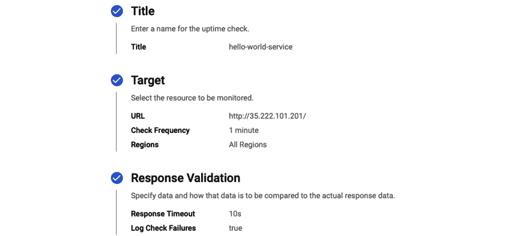
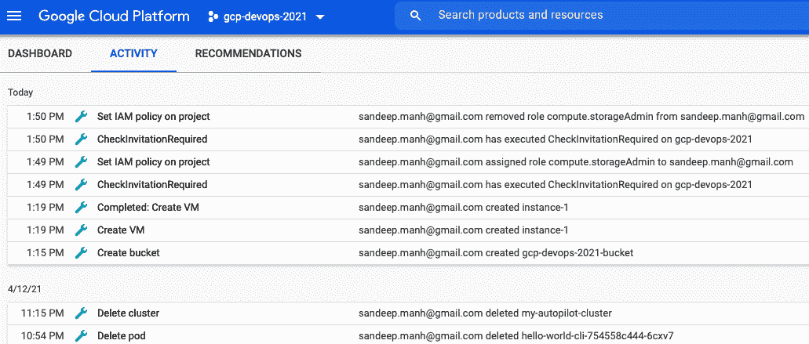
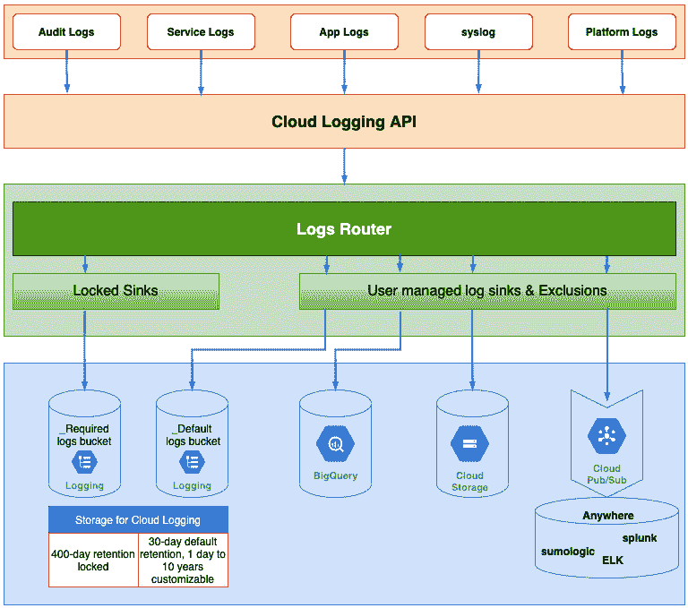
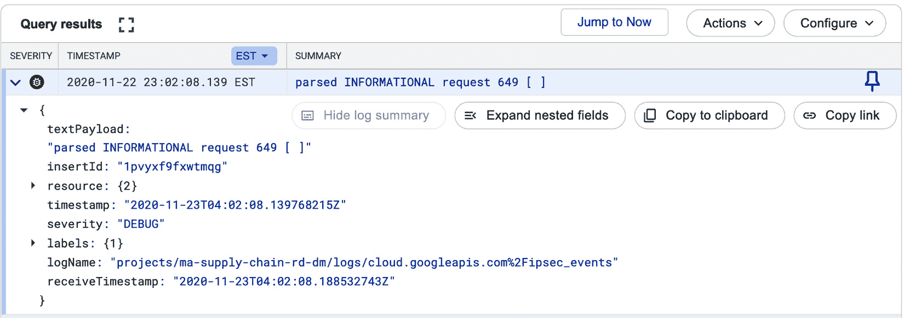

# *第十章*：探索 GCP Cloud Operations

**可靠性**是服务或系统最关键的特性。**站点可靠性工程**（**SRE**）规定了一些特定的技术工具或实践，帮助衡量定义并跟踪可靠性的特征，如**SLAs**、**SLOs**、**SLIs**和**错误预算**。

在*第二章*中，*SRE 技术实践深度剖析*，我们详细讨论了 SLAs 的关键构成、实现 SLA 所需的 SLOs、设置 SLOs 的指南，以及实现 SLOs 所需的 SLIs。此外，我们了解了基于用户旅程分类的不同类型的 SLIs、用于衡量 SLIs 的不同来源、错误预算的重要性，以及如何设置错误预算以确保服务的可靠性。

这引出了一个系列的基础性问题：

+   我们如何观察服务的 SLIs，以确保不违反 SLOs？

+   我们如何跟踪我们的错误预算是否被消耗完了？

+   我们如何保持关键 SRE 技术工具之间的和谐？

SRE 对上述问题的回答是可观测性。在**Google Cloud Platform**（**GCP**）上，可观测性是通过运营来建立的。从 Google 的角度看，Cloud Operations 是关于在 Google Cloud 环境中监控、故障排除和提升应用性能。Cloud Operations 的关键目标如下：

+   从任何来源收集日志、指标和追踪。

+   查询捕获的指标并分析追踪。

+   在内置或可定制的仪表板上可视化信息。

+   建立性能和可靠性指标。

+   在可靠性指标未达到或遇到问题的情况下触发警报并报告错误。

Google 通过一组名为 Cloud Operations 的服务实现运营的关键目标。Cloud Operations 是一套 GCP 服务，包括 Cloud Monitoring、Cloud Logging、Error Reporting 和**应用性能管理**（**APM**）。此外，APM 包括 Cloud Debugger、Cloud Trace 和 Cloud Profiler。本章将探讨与 Cloud Operations 相关的服务。之后，我们将重点关注 Google Cloud 中引入的一项特性，用于通过服务监控来追踪服务的可靠性。这个特性/选项将 SRE 技术实践（SLIs、SLOs 和错误预算）与 Google Cloud Operations 中可用的监控服务功能相连接，从而告诉我们服务的可靠性。

本章我们将覆盖以下主要主题：

+   **Cloud Monitoring**：工作区、仪表板、指标探查器、正常运行时间检查和告警。

+   **Cloud Logging**：审计日志、日志摄取、日志探查器和基于日志的指标。

+   **Cloud Debugger**：设置、使用、调试日志点和调试快照。

+   **Cloud Trace**：追踪概述、追踪列表和分析报告。

+   **Cloud Profiler**：配置文件类型。

+   **绑定 SRE 和云操作**：我们将通过实践实验室将 SRE 技术实践与 Cloud Operations 结合，以衡量服务的可靠性。

# 云监控

**云监控**是一个 GCP 服务，能够实时收集来自多云和混合基础设施的度量、事件和元数据。云监控帮助我们了解资源的性能以及是否存在需要立即关注的问题。云监控是实施 SRE 最佳实践的途径，并确保应用程序达到其设定的 SLA。云监控包括开箱即用的仪表盘，这些仪表盘可用于可视化对影响 SLI 和 SLO 的关键因素的洞察，如延迟、吞吐量等。云监控对事件管理也至关重要，因为可以从关键指标中生成警报，并将这些警报作为通知发送到配置的通知通道。

本节深入探讨了云监控的几个关键领域/属性，如工作区、仪表盘、指标资源探索器、正常运行时间检查、警报、访问控制和监控代理。我们将从工作区开始。

## 工作区

**Google 工作区**是一个集中式的中心，用于组织和展示有关 GCP 和 AWS 资源的监控信息。工作区提供集中视图，并作为访问资源仪表盘、正常运行时间检查、组、事件、警报和图表的单一入口点。Google 将这种集中视图称为*单一窗口*（请参阅以下截图）。可以对工作区执行的操作包括查看内容，这些内容由**身份与访问管理**（**IAM**）控制：


图 10.1 – 云监控工作区概述

在详细说明工作区与项目之间的关系之前，以下是我们需要了解的一些关键术语：

+   **主机项目**：指的是创建工作区的项目。

+   **监控项目**：指的是工作区可以监控的 GCP 项目或 AWS 账户。

+   **AWS 连接器项目**：指的是将监控的 AWS 账户与工作区连接的 GCP 项目。

接下来的子章节将深入探讨工作区与项目之间的关系。

### 工作区/项目关系

以下是关于工作区/项目关系的一些关键要点：

+   一个工作区始终是在一个项目内创建的，这个项目被称为主机项目。

+   一个工作区是单个主机项目的一部分，并以主机项目命名。

+   一个工作区可以同时监控来自多个监控项目的资源。这可以包括大约 200 个 GCP 项目/AWS 账户。

+   一个工作区可以访问其他监控项目的度量数据，但实际数据存储在监控项目中。

+   每个被监控项目只能与一个工作区关联，并且一个被监控项目可以从一个工作区移动到另一个工作区。

+   多个工作区可以合并为一个工作区。

+   创建工作区本身没有费用。然而，与日志记录和指标数据获取相关的费用将由与*被监控项目*关联的账单账户承担。

    提示 – 如何将 AWS 账户连接到工作区

    需要一个 GCP 连接器项目。这个项目可以是一个现有的项目，或者是一个为此目的创建的空项目（优选）。GCP 连接器项目需要与工作区处于相同的父组织下。一个账单账户应该与连接器项目绑定，并且此账户将被用来监控 AWS 账户下的资源。

以下部分讨论了创建工作区的潜在策略。

### 工作区创建 – 策略

在实时场景中，可能会有多个项目，这些项目要么按客户区分，要么按环境类型（如开发、测试、预发布和生产）区分。由于一个工作区可以监控来自多个项目的资源，因此创建工作区时采用的策略/方法变得至关重要。我们可以遵循多种策略来创建工作区，具体策略将在以下部分详细介绍。

#### 所有被监控项目的单一工作区

所有被监控项目资源的信息都可以从单一工作区中获取。下图展示了一个工作区，监控了一个应用程序`app`，该应用程序已部署到多个项目中，如`app-dev`、`app-test`和`app-prod`。这些项目按环境类型进行了分类。这种方法有其优缺点。

优点是，工作区为所有与应用程序相关的资源提供了一个统一视图，这些资源来自多个项目，代表了不同的环境类型。缺点是，非生产用户可以访问生产项目中的资源，这在大多数情况下可能是不可接受的。这种方法不适合那些在生产和非生产环境之间有严格隔离的组织：


图 10.2 – 所有相关项目的单一工作区

#### 每组被监控项目的工作区

一个工作空间将监控一组特定的项目。可以有多个工作空间监控可用的项目。以下图表是与前面的图表所示的工作空间创建策略相比的另一种选择。具体来说，以下图表代表两个工作空间，其中一个工作空间监控非生产项目，而第二个工作空间监控生产项目。通过单个工作空间的主机项目控制对该特定组的访问控制，这允许我们区分跨环境类型（例如生产与非生产）或甚至跨客户的用户：


图 10.3 – 每组受监控项目一个工作空间

#### 每个受监控项目一个单一工作空间

实质上，需要进行监控的每个项目都由同一项目中的一个工作空间托管。这可以在以下图表中看到。这意味着源和托管项目将是相同的。这种方法在提供对项目资源进行监控访问方面提供了最精细的控制。但是，如果应用程序跨多个项目分布，这也可能仅提供信息的一部分：


图 10.4 – 每个受监控项目一个单一工作空间

重要提示 – 工作空间管理

可以向工作空间添加或删除一个或多个 GCP 项目或 AWS 账户。此外，可以将所选工作空间中的所有项目合并到当前工作空间中，但所选工作空间中的配置将被删除。这些操作是通过 Cloud Monitoring 的设置页面执行的。只有当工作空间托管项目被删除时，才能删除工作空间。

这结束了关于工作空间创建策略的子节。首选策略取决于组织需求。工作空间的基本操作包括创建工作空间、将项目添加到工作空间、在工作空间之间移动项目以及合并工作空间。有关如何创建工作空间的详细说明，请参阅 [`cloud.google.com/monitoring/workspaces/create`](https://cloud.google.com/monitoring/workspaces/create)。接下来的子节将讨论 IAM 角色，这些角色用于确定谁有权限监控监控工作空间内的资源。

### 工作空间 IAM 角色

下面是可以应用于工作空间项目的 IAM 角色，以便我们可以查看监控数据或在工作空间上执行操作：

+   **监控查看者**：仅具有查看工作空间内指标的只读访问权限。

+   **监控编辑者**：监控查看者，以及编辑工作空间、创建警报、以及对监控控制台和监控 API 具有写访问权限的能力。

+   **监控管理员**：监控编辑者，以及管理工作空间的 IAM 角色的能力。

+   **监控指标写入者**：一种授予应用程序而非用户的服务帐户角色。这样，应用程序可以将数据写入工作区，但不提供读取权限。

这就是我们对工作区及其概念（如工作区创建策略）的简要了解。接下来，我们将关注仪表板。

## 仪表板

**仪表板**提供了关键信号数据（称为指标）的图形化表示方式，适合最终用户或运维团队使用。建议单个仪表板展示特定视角下的指标（例如，带有特定标签的无服务器资源）或特定资源（例如，持久磁盘、快照等）。仪表板有两种类型：预定义仪表板和自定义仪表板。

以下截图是 Cloud Monitoring 中的 **仪表板概览** 页面。该页面展示了可用仪表板的列表，按仪表板类型分类，并提供快速链接到最近使用的仪表板：


图 10.5 – Cloud Monitoring – 仪表板概览

Cloud Monitoring 同时支持预定义仪表板和自定义仪表板。接下来的小节将提供不同类型仪表板的概述，并介绍如何创建自定义仪表板的步骤。

### 预定义仪表板

Cloud Monitoring 提供了一组预定义的仪表板，这些仪表板按特定的 GCP 资源（例如防火墙或 GKE 集群）进行分组。这些仪表板按 **类型** 分类。该设置为 **Google Cloud Platform**，由 Google Cloud 维护。它们不需要任何显式的设置或配置工作。

然而，预定义仪表板是不可自定义的。这些仪表板以特定方式组织，并且具有一组预定义的过滤器，基于仪表板的上下文，用户不能更改视图内容或添加新的过滤条件。用户只能使用预定义的过滤器来控制显示的数据。

### 自定义仪表板

用户或运维团队可以创建 **自定义仪表板**，以展示特定的内容。这些仪表板按 **类型** 分类，设置为 **自定义**。通过配置一个或多个小部件来添加内容。小部件有多种类型。仪表板可以通过 Google Cloud Console 或 Cloud Monitoring API 创建。此外，Cloud Monitoring API 允许你从 GitHub 导入仪表板配置并根据需要进行修改。

自定义仪表板通过图表展示关于某个指标的信息。这个图表显示了来自一个在可配置时间窗口内对齐的指标的原始信号信息。每个图表都是特定的小部件类型。Cloud Monitoring 支持多种小部件类型，例如线形图、堆叠区域图、堆叠条形图、热图、仪表盘、记分卡和文本框。让我们简要了解一下不同类型的小部件：

+   折线图、堆叠区域图和堆叠条形图最适合用来显示时间序列数据。每种小部件类型都可以配置，以便在颜色/透视/统计/异常模式下显示，并且可以选择是否显示图例。

+   热力图图表用于表示具有分布值的指标。

+   仪表盘以数字形式显示最新的测量值。这通过仪表周围的粗线条表示。视觉上，这些数值被分类为良好区、警告区和危险区。

+   积分卡与仪表盘类似，也以数字形式显示最新的测量值，但它们可以使用不同的视图展示，而不仅限于仪表盘，例如火花线、火花条、图标或数值。

+   文本框允许我们添加任何自定义信息，如快速笔记或链接，关于相关资源。

接下来的子节将展示如何创建自定义仪表盘。

#### 创建自定义仪表盘

按照以下步骤从 GCP 控制台创建自定义仪表盘：

1.  导航到`VM Instance – Mean CPU Utilization`。

1.  选择图表类型或小部件。这将打开左侧窗格中的**Metrics explorer**，并将图表添加到仪表盘。

1.  选择选项以选择资源类型、指标类型和分组标准。然后，**保存**仪表盘以添加图表类型。

1.  重复上述步骤，将多个图表添加到同一仪表盘。

以下截图展示了一个自定义仪表盘，显示了所有虚拟机实例的平均 CPU 使用率，并包含七种可能的小部件类型：


图 10.6 – 自定义仪表盘，包含七种可能的小部件类型

本节结束后，我们将进入下一节，重点介绍如何使用*Metrics explorer*作为探索预定义和用户创建的指标的选项。

## 指标资源浏览器

**指标**是监控数据的关键来源之一。指标代表了资源使用或行为的数值测量，可以在系统中跨多个数据点以定期的时间间隔收集和观察。GCP 中大约有 1,000 个预创建的指标，包括 CPU 使用率、网络流量等。然而，一些更为精细的指标，如内存使用率，可以通过可选的监控代理进行收集。此外，用户可以通过内置的监控 API 或通过 OpenCensus（一种开源库）创建自定义指标。在创建自定义指标之前，始终建议先检查是否已存在默认或预创建的指标。

度量资源浏览器提供了探索现有度量的选项（包括预定义的或用户创建的），使用度量构建图表，向现有或新建的仪表盘添加图表，通过 URL 分享图表，或以 JSON 格式获取图表配置数据。度量资源浏览器是一个提供 DIY 方法的接口，您可以选择自己选择的度量来构建图表。

以下截图显示了**度量资源浏览器**部分，其中为**虚拟机实例**绘制了**CPU 利用率**度量，并按系统状态进行了分组。左侧显示配置区域，右侧显示所选度量的图表。配置区域有两个选项卡：

+   **度量**：此选项卡用于选择度量并进行探索。

+   **查看选项**：此选项卡用于更改图表的显示特性：


图 10.7 – 云监控 – 度量资源浏览器

以下部分讨论了使用度量资源浏览器配置度量的可用选项。

### 通过度量资源浏览器了解度量配置。

要为监控资源配置度量，我们可以使用以下选项。

**资源类型**和**度量**选项可以通过以下任一方式选择：

+   **标准模式**：选择特定的度量类型，或根据特定的 GCP 资源浏览可用的度量类型。

+   **直接筛选模式**：手动在文本框中输入度量类型和资源类型。

**筛选器**选项可用于根据筛选标准过滤结果。筛选标准可以使用可用操作符或正则表达式进行定义。筛选器有两种可能的类型：

+   `project_id`、`instance_id` 和 `zone` 可作为可用的筛选选项。

+   **按度量标签**：指的是跨项目的用户创建标签。

**按组**选项可用于按资源类型和度量标签对时间序列数据进行分组。这将基于按组值的组合创建新的时间序列数据。

**聚合器**选项可用于描述如何对多个时间序列中的数据点进行聚合。常见的选项包括最小值、最大值、总和、计数和标准差。默认情况下，聚合结果会应用于所有时间序列，从而得到一条单一的线。如果选择了**按组**标签，聚合结果将为每个匹配标签组合生成一个时间序列。

**周期**选项可用于确定聚合发生的时间间隔。默认选择是 1 分钟。

**对齐器**选项可用于将每个单独时间序列中的数据点按相等的时间段对齐。

其他选项包括以下内容：

+   **二级聚合器**：用于包含多个度量的图表。

+   **图例模板**：为更好地阅读性。

可以使用多个**查看选项**来绘制度量图表，这些选项通过可用的图表模式进行区分，具体如下：

+   **颜色模式**：这是默认模式，其中图形线条以颜色显示。

+   **X-Ray 模式**：以半透明灰色显示图形线条，并在重叠区域中显示亮度。

+   **统计模式**：显示常见的统计值，如第 5 百分位数、第 95 百分位数、平均值、中位数等。

+   **异常值模式**：允许选择多个时间序列进行显示，并提供按升序或降序排列时间序列的选项。

此外，每种图表模式都支持指定特定的阈值，并允许比较过去的时间序列数据。此外，对于数据集中某些值远大于其他值的情况，可以将*y*轴应用对数刻度，以更好地区分较大的数值。

提示 - 监控查询语言（MQL）- 创建图表的高级选项

云监控支持**MQL**，这是一种使用基于文本的界面和表达性查询语言创建图表的高级选项，可以对时间序列数据执行复杂查询。潜在的用例包括选择时间序列的随机样本或计算请求比率，从而得出特定类别的响应代码。

本节介绍了指标浏览器，允许用户探索预定义和自定义指标。这些指标可以用于创建图表。与配置指标相关的选项也已详细讨论。接下来的部分将重点介绍在线检查——一种验证服务是否正常运行的选项。

## 在线检查

**在线检查**是一个云监控功能，通过定期请求监控资源，检查资源是否真正可用。在线检查可以检查 GCP 虚拟机、App Engine 服务、网站 URL 和 AWS 负载均衡器的可用性。在线检查也是跟踪服务错误预算的一种方式。在线检查本质上是在特定的超时区间内测试外部服务的可用性，确保服务的错误预算不会不必要地被耗尽。可以从一个或多个 GCP 地理区域发起这些测试，必须选择至少三个活跃的地理位置作为测试区域。或者，选择**全球**选项将从所有可用位置发起测试。

可以配置在线检查的执行频率，默认间隔为 1 分钟。在线检查支持多种协议选项，如 HTTP、HTTPS 和 TCP，并可针对以下资源类型进行定义：

+   **URL**：需要指定主机名和路径。

+   **App Engine 服务**：需要指定服务和路径。

+   **实例**：需要指定单个实例（GCP 或 EC2）或预定义组的路径。此组需要明确配置。

+   **弹性负载均衡器**：需要指定 AWS ELB 的路径。

创建正常运行时间检查的配置包括执行响应验证的选项。这些选项包括以下内容：

+   **提供响应超时**：这是请求完成所需的时间。必须在 1 到 60 秒之间，默认值为 10 秒。

+   **启用响应内容**：此选项允许您选择响应内容匹配类型，使用特定操作符来包含或不包含特定文本，或使用正则表达式匹配。

+   **记录检查失败**：此选项将保存与正常运行时间检查失败相关的所有日志到 Cloud Logging。

此外，在正常运行时间检查失败并持续一定时间的情况下，可以配置警报和通知。必须先存在警报策略，并且通知通道必须预先创建。下图显示了目标资源类型为 URL 的正常运行时间检查的汇总配置：



图 10.8 – 检查 URL 作为目标资源类型的正常运行时间

上述截图中使用的 URL 是作为 *第八章*的一部分创建的 `hello-world-service` 负载均衡器服务的 URL，*理解 GKE 基础知识以部署容器化应用程序*。配置的正常运行时间检查可能会导致失败。接下来的子章节列出了正常运行时间检查失败的潜在原因。

### 正常运行时间检查失败的潜在原因

以下是一些正常运行时间检查失败的潜在原因：

+   **连接错误**：找不到或没有响应的主机名/服务，或者指定的端口未打开或无效。

+   `403`（禁止访问服务），`404`（路径错误），和 `408`（端口号错误或服务未运行）。

+   `GoogleStackdriverMonitoring-UptimeChecks`

这就是我们对正常运行时间检查的详细概述。接下来的主题将深入探讨警报——这是一个关键的云监控选项，适用于事件管理。警报提供了报告监控指标和适当地发送通知的选项。

## 警报

**警报**是处理警报规则的过程，这些规则跟踪 SLO（服务级别目标），并在规则违反时通知或执行某些操作。*第三章*，*理解监控和警报以提高可靠性*，深入探讨了警报，描述了警报如何将 SLO 转化为可操作的警报，讨论了关键的警报属性，并详细讲解了警报策略。Cloud Monitoring 中的警报 UI 提供了与当前触发的事件、已确认的事件、已配置的活动警报策略、开放和关闭的事件详情以及所有与事件相关的事件的信息。此外，警报还允许我们创建警报策略并配置通知通道。

### 配置警报策略

配置警报策略的步骤与使用 Metrics Explorer 创建图表的步骤非常相似。本质上，警报需要针对某个指标创建。配置警报包括通过 Metrics Explorer 添加指标条件并设置指标阈值条件。

指标阈值条件将定义具体的值。如果特定的指标值超过或低于阈值（根据策略定义的方式），则会触发警报，并通过配置的通知渠道通知我们。如果策略是通过控制台定义的，则使用策略触发字段；如果策略是通过 API 定义的，则使用组合器字段。

或者，要基于指标阈值条件定义警报策略，也可以基于指标缺失条件来定义警报策略。指标缺失条件定义为某个特定时间段内某个指标的时间序列数据不存在的条件。

重要说明 – 对齐周期是一个回顾间隔。

对齐周期是从某个特定时间点回顾的间隔。例如，如果对齐周期是 5 分钟，那么在下午 1:00 时，对齐周期包含了下午 12:55 到 1:00 之间接收到的样本。在下午 1:01 时，对齐周期滑动 1 分钟，并包含下午 12:56 到 1:01 之间接收到的样本。

下一节将描述用于发送与触发警报相关的特定信息的可用通知渠道。

### 配置通知渠道。

如果警报策略违反了指定的条件，则会创建一个状态为“打开”的事件。关于该事件的信息可以发送到一个或多个通知渠道。收到通知后，操作团队可以通过控制台确认该事件。这将把事件的状态更改为“已确认”。这表示事件正在被检查。如果在接下来的 7 天内条件不再被违反，或者该事件没有收到数据，则该事件最终将变为“已关闭”状态。

支持的通知渠道如下：

+   **移动设备**：应通过 Cloud Console 移动应用的事件部分注册移动设备。

+   **PagerDuty 服务**：需要一个服务密钥来进行身份验证和授权。

+   `pagerduty.com` 及相应的 API 密钥用于身份验证和授权。

+   **Slack**：提示用户通过自定义 URL 进行身份验证和授权到 Slack 渠道，然后提示用户提供 Slack 渠道的名称。

+   **Webhooks**：需要端点 URL，并可选择使用 HTTP Basic Auth。

+   **电子邮件**：需要一个电子邮件地址，以便在创建新事件时接收通知。

+   **短信**：需要一个电话号码来接收通知。

+   `service-[PROJECT_NUMBER]@gcp-sa-monitoring-notification.iam.gserviceaccount.com`。应将 `pubsub.publisher` 角色添加到上述服务帐户，以通过 Cloud Pub/Sub 配置警报通知。

本节关于警报的内容到此结束，我们查看了如何配置警报策略和通知渠道。下一节介绍云监控代理。

## 监控代理

云监控提供许多默认指标，无需任何额外配置，例如 CPU 利用率、网络流量等。然而，更多细粒度的指标，如内存使用、网络流量等，可以通过可选的 `collectd` 守护进程（守护进程是指在后台运行的程序）从未管理的虚拟机或第三方应用程序收集，来收集来自操作系统、应用程序、日志和外部设备的系统统计信息。

监控代理可以安装在未管理的 GCE 虚拟机或 AWS EC2 虚拟机上。其他 Google 计算服务，如 App Engine、Cloud Run 和 Cloud Functions，内置支持监控，无需显式安装监控代理。GKE 也内置支持监控，并可以通过 *Cloud Operations for GKE* 启用，后者是一个集成的监控和日志记录解决方案，可以在新建或现有集群中启用。

从概念上讲，您必须遵循此过程，在未管理的虚拟机上安装/配置监控代理：

+   通过提供的脚本添加代理的包存储库，该脚本检测虚拟机上运行的 Linux 发行版并相应地配置存储库。

+   使用 `stackdriver-agent` 代理安装监控代理以获取最新版本，或者使用 `stackdriver-agent-version-number` 安装特定版本。

+   重启代理以使已安装的代理生效。

在单个虚拟机/GCE 虚拟机/AWS EC2 实例上安装日志代理的逐步过程可以在 [`cloud.google.com/monitoring/agent/installation`](https://cloud.google.com/monitoring/agent/installation) 中找到。至此，我们简要介绍了监控代理。下一小节提到了与云监控相关的可能访问控制。

## 云监控访问控制

以下表格总结了访问或执行云监控操作所需的关键 IAM 角色：


组 – 定义为监控组的资源集合

注意

云监控允许您创建监控组。这是查看 GCP 资源、事件、事故和可视化的关键指标的便捷方式，所有信息集中展示。监控组是通过定义一个或多个标准来创建的，这些标准可以是名称、资源类型、标签、安全组、云项目或区域。如果指定多个标准，则可以使用 OR/AND 运算符。

这部分内容总结了我们对云监控及其相关构件的深入探讨，如工作区、仪表板、指标探查器、正常运行时间检查、告警策略和访问控制。接下来的部分将详细介绍另一个属于云操作的 GCP 构件，专注于日志记录；即，云日志。

# 云日志

日志被定义为状态或事件的记录。日志记录本质上描述了发生了什么，并提供了数据，以便我们可以调查问题。在涉及多个服务和产品的分布式基础设施中，能够读取和解析日志至关重要。**云日志**是一个 GCP 服务，允许你存储、搜索、分析、监控以及针对来自 Google Cloud 和 AWS、第三方应用程序或自定义应用程序代码的日志数据和事件发送告警。日志条目中的信息以负载的形式结构化。该负载包含与时间戳、日志条目适用的资源以及日志名称相关的信息。日志条目的最大大小为 256 KB。每个日志条目都会指示资源的来源、标签、命名空间和状态码。云日志还是其他云操作服务（如云调试和云错误报告）的输入来源。

以下是云日志的主要特性：

+   **审计日志**：日志被捕获并分类为管理员活动、数据访问、系统事件和访问透明度日志，每个类别都有默认的保留期。

+   **日志摄取**：可以通过使用云日志 API 或通过日志代理从许多来源摄取日志，包括 GCP 服务、内部部署或外部云提供商。

+   **日志探查器**：可以通过引导式过滤配置或灵活的查询语言搜索和分析日志，从而实现有效的可视化。结果还可以以 JSON 格式保存。

+   **基于日志的度量**：可以从日志数据中创建度量，并通过指标探查器将其添加到图表/仪表板中。

+   **日志告警**：可以根据日志事件的发生以及基于日志创建的度量指标来创建告警。

+   **日志保留**：日志可以根据用户定义的标准保留自定义的保留期。

+   **日志导出**：可以将日志导出到云存储进行归档，导入到 BigQuery 进行高级分析，通过 Pub/Sub 进行基于事件的处理，使用 GCP 服务进行用户定义的云日志接收器，或启动外部第三方集成，以便通过 Splunk 等服务导出。

云日志的功能将在接下来的子章节中详细讨论，从审计日志开始。

## 审计日志

**云审计日志**是了解项目中某些部分的基础来源（*谁做了什么，在哪里，何时做的？*）。云审计日志为每个项目（包括文件夹和组织级别的信息）维护日志。云审计日志可以分为不同的类别。让我们来看一下。

### 管理活动日志

**管理员活动日志**特指任何修改资源配置或元数据的管理操作。管理员活动日志的示例包括但不限于以下内容：

+   设置或更改云存储存储桶的权限

+   分配/取消分配 IAM 角色

+   更改资源的任何属性，如标签/标签

+   创建/删除 GCE、GKE 或 Cloud Storage 资源

以下截图显示了创建 GCE VM 或存储桶时的管理员活动日志。访问这些活动日志的最简单方法是从 GCP 控制台首页的**活动**选项卡查看。这会拉取管理员活动日志的实时流，但默认不包括数据访问日志：



图 10.9 – 管理员活动日志

下一小节提供了与*数据访问*相关的审计日志类别概述。

### 数据访问日志

**数据访问日志**对于读取资源的配置或元数据非常有用。它还包括用户级别的 API 调用，这些调用会读取或写入资源数据。数据访问审计日志需要显式启用（Big Query 除外），并可以通过指定应捕获审计日志的服务来进行控制。此外，数据访问日志还可以针对由特定用户或用户组执行的操作进行豁免，从而提供细粒度的控制。数据访问日志可以进一步细分为三种子类型：

+   **管理员读取**：对服务元数据或配置数据的读取尝试。例如，列出可用的存储桶或列出集群中的节点。

+   **数据读取**：在服务内的数据读取尝试。例如，列出存储桶中的对象。

+   **数据写入**：向服务写入数据的尝试。例如，在存储桶中创建一个对象。

以下是通过 IAM 配置单个 GCP 服务的详细数据访问的截图 —— **审计日志** UI：


图 10.10 – 配置服务的 IAM 审计日志

上述截图还显示了配置**豁免用户**的选项。此选项允许您豁免某些用户的审计日志生成，具体取决于配置。数据访问日志可以通过 GCP 首页的**活动**选项卡查看，其中**活动类型**为**数据访问**，或者通过**日志浏览器**UI 查看（稍后会讨论）。下一小节提供了与系统事件相关的审计日志类别概述。

### 系统事件日志

**系统事件日志**在 Google 系统或服务对资源进行更改时使用。它们不是特定于用户对资源的操作。系统事件日志的示例包括但不限于以下内容：

+   自动重启或重置计算引擎

+   系统维护操作，例如迁移事件，由计算引擎执行，以将应用迁移到不同的主机。

下一小节提供了一个关于访问透明度的审计日志类别概述。

### 访问透明度日志

**访问透明度日志**是 Google 人员在访问用户/客户内容时使用的日志。通常这种情况发生在 Google 的支持团队在处理客户问题（例如某个服务未按预期工作或发生故障）时，因而需要访问客户的项目。如果你希望遵循法律和监管义务，这类日志至关重要。此外，你还可以追踪事件，回溯 Google 支持人员执行的操作。通过联系 Google 支持，你可以启用访问透明度日志，并且它们适用于客户支持级别，个人账户除外。一个例子是，支持人员在尝试解决 VM 实例的支持问题时访问的日志。

### 策略拒绝日志

**策略拒绝日志**是指当 Google Cloud 服务拒绝对某个用户或服务账户的访问时所捕获的日志。可以通过日志排除功能排除这些日志的摄取。

这一部分关于审计日志的内容已完成，我们提供了各种子类别的概述。在进入下一部分之前，先看一下下面的表格，表格列出了特定于访问日志的 IAM 角色：


下一部分将解释如何从多个源将日志摄取到 Cloud Logging 中。

## 日志摄取、路由和导出

Cloud Logging 支持从多个源摄取日志，例如审计日志、服务日志、应用日志、系统日志和平台日志。这些日志被发送到**Cloud Logging API**。Cloud Logging API 将传入的日志条目转发给一个名为**日志路由器**的组件。日志路由器的基本职能是将日志路由到其相应的目标。

这些目标可以分为四个可能的类别。日志路由器将检查传入的日志与现有规则，决定是否摄取（存储）、导出或排除这些日志，并将日志路由到四个目标类别中的一个。

这些目标类别如下：

+   **_ 必需的日志存储桶 _**：这是管理活动、系统事件和访问透明度日志的主要存储目标。这些日志不收费，并且该存储桶不能被修改或删除。

+   `_ 默认`日志接收器可以被禁用。

+   `_Required` 日志桶和 `_Default` 日志桶。将日志写入用户管理的日志汇聚点的过程也可以被描述为 **日志导出**（如果目的是导出进行外部处理）或 **日志保留**（如果目的是从合规性角度导出以长期保留日志）。

+   `_Default` 日志桶。换句话说，符合 `_Required` 日志桶条件的日志永远不能被排除。如果任何日志排除过滤器与符合 `_Default` 日志桶条件的条目匹配，则这些条目将被排除并且永远不会被保存。

    提示 – 什么是日志桶？

    日志桶是 Google Cloud 项目中一种对象存储形式，用于通过 Cloud Logging 存储和组织日志数据。项目中生成的所有日志都存储在这些日志桶中。Cloud Logging 会在每个项目中自动创建两个桶：`_Required` 和 `_Default`。`_Required` 代表审核桶，其保留期为 400 天，而 `_Default` 代表*其他所有*桶，其保留期为 30 天。此外，用户还可以创建自定义日志桶，也称为用户管理的日志汇聚点。

    每个项目的日志桶可以通过 **Logs Storage UI** 在 Cloud Logging 中查看。也可以从 Logs Storage UI 发起其他操作，例如创建用户定义的日志桶和使用警报。

以下图示展示了如何通过 Cloud Logging API 从多个来源接收日志，并随后由日志路由器将其路由到可能的目标：



图 10.11 – 描述日志接收和日志路由

导出日志需要遵循三个步骤：

1.  创建一个汇聚点。

1.  创建一个表示导出日志筛选标准的过滤器。

1.  创建目标 – Cloud Storage 桶、BigQuery 或 Pub/Sub 主题。

    创建/修改/查看汇聚点的 IAM 角色

    创建或修改汇聚点需要拥有 Owner 或 Logging/Logs Configuration Writer 角色。查看现有汇聚点需要拥有 Viewer 或 Logging/Logs Viewer 角色。Project Editor 角色无法创建或编辑汇聚点。

总结来说，日志可以来自多个来源，例如本地环境、Google Cloud 或第三方云服务。这些日志通过 Cloud Logging API 注入到 Cloud Logging，然后发送到 Logs Router。Logs Router 会根据配置的过滤器，将日志路由到日志存储桶（`_Required` 或 `_Default` 存储桶）。此外，基于配置的过滤器条件，日志的副本可以发送到用户管理的存储桶，目标可以是 Cloud Storage、BigQuery 或 Pub/Sub。日志导出可用于多种用途，如出于合规原因进行长期保留（使用 Cloud Storage）、大数据分析（使用 BigQuery），或将日志流式传输到其他应用程序（使用 Pub/Sub）。如果这些日志被发送到 Pub/Sub 消息服务，它们可以被导出到 Google Cloud 以外的第三方工具，如 Splunk、Elastic Stack 或 SumoLogic。需要注意的是，配置的日志存储桶只会捕获新日志，因为导出是新创建的，不会捕获之前的日志或补充日志。

如何跨文件夹/组织导出日志

可以从特定文件夹或组织中的所有项目导出日志。目前只能通过命令行使用 gcloud logging sink 的 `create` 命令来完成此操作。除了存储桶的名称、目标和日志过滤器外，命令还应包括 `--include-children` 标志，并且需要指定 `--folder` 或 `--organization` 属性及其相应的值。

本小节关于日志摄取、路由和导出的内容已完成。接下来的小节将以表格形式总结日志存储桶中的日志特性，便于理解。

## 总结日志存储桶中的日志特性

每种日志类型都会分配到特定的 Cloud Logging 存储桶。此外，每种日志类型在访问日志所需的最低 IAM 角色、默认保留期以及自定义保留期配置能力方面都有特定的特点。以下表格详细说明了相关信息：


所有其他日志

这指的是通过日志代理生成的用户日志，或由 GCP 服务、VPC 流量日志或防火墙日志生成的平台日志。

除了前面的表格外，还需要注意以下几点：

+   系统事件日志由系统发起，而管理员活动、数据访问和访问透明度日志由用户发起。

+   管理员活动日志和系统事件日志记录资源配置的更改，而数据访问日志记录的是记录内部所做的更改。

+   管理员活动、系统事件和访问透明度日志始终启用。

本节关于日志摄取的概述已完成。下一个主题聚焦于 **Logs Explorer** 用户界面，用户可以通过该界面探索摄取的日志。

## Logs Explorer 用户界面

**日志资源管理界面（Logs Explorer UI）** 是查看通过 Cloud Logging API 导入到 Cloud Logging 中的日志的集中方式，最终通过 Cloud Router 路由到 Cloud Logging 存储桶或用户管理的接收端。该界面允许我们通过编写高级搜索查询来筛选日志，通过配置时间窗口来可视化时间序列数据，并执行关键操作来创建基于日志的指标或创建用户。该界面包含多个选项和部分，如下所示的屏幕截图所示：


图 10.12 – 日志资源管理界面

要通过日志资源管理界面筛选 Cloud 审计日志，请为 **日志名称** 字段选择以下选项：

+   `cloudaudit.googleapis.com%2Factivity`

+   `cloudaudit.googleapis.com%2Fdata_access`

+   `cloudaudit.googleapis.com%2Fsystem_event`

让我们来看看在日志资源管理界面中导航选项时的一些关键重要信息。

### 查询构建器

本部分构建查询以筛选日志。查询可以通过选择适当的字段和值组合，用查询构建器语言表示，如以下屏幕截图所示。用户可以通过两种方式提供输入：

+   通过选择有关 **资源**、**日志名称** 和 **严重性** 的下拉菜单中的选项。这是基本的查询界面。

+   通过从 **日志字段** 部分选择字段，开始时选择 **资源** 类型或 **严重性** 类型。这是高级查询界面：


图 10.13 – 日志资源管理界面下的查询构建器部分

### 查询结果

本部分显示与查询构建器中定义的筛选标准匹配的结果。如果匹配，则结果以一行或多行的形式显示。每一行代表一个日志条目，如下所示：


图 10.14 – 查询结果部分

### 日志条目

返回的每个查询结果都是一个日志条目，显示有时间戳和摘要文本信息。当展开时，日志条目会以 JSON 负载格式显示更多细节。JSON 负载有多个字段，并且可以通过 **展开嵌套字段** 选项进行详细说明。此外，用户可以将负载复制到剪贴板，或通过复制共享链接来共享特定的负载，如下所示：



图 10.15 – 查看日志条目的 JSON 负载

### 特定负载的操作

有多个选项执行操作，针对特定负载和字段，如下屏幕截图所示。具体如下：

+   **显示匹配条目**：将从 JSON 负载中选择的键值对添加到现有筛选条件中，并在配置的时间窗口内显示匹配的条目。

+   **隐藏匹配条目**：将选定的键值对从 JSON 负载添加到现有的过滤器条件中，以否定形式出现，并在配置的时间窗口内从用户显示中移除匹配条目。

+   **将字段添加到摘要行**：将选定的键添加到摘要部分：


图 10.16 – 针对特定字段的可能负载特定操作

### 页面布局

此选项允许用户配置页面布局，并可以选择包含 **日志字段** 和/或 **直方图**。**查询构建器** 和 **查询结果** 是必填部分，不能排除：


图 10.17 – 页面布局部分的选项

### 操作（执行查询过滤器）

操作允许用户在查询过滤器定义的潜在结果上进行操作。包括 **创建度量**、**下载日志** 和 **创建接收器**：


图 10.18 – 在查询过滤器上可以执行的操作

这完成了关于日志资源管理器和所有可能的 UI 选项用于过滤和分析日志的部分。下一部分将概述 *基于日志的度量*。

## 基于日志的度量

**基于日志的度量** 是基于日志条目内容创建的 Cloud Monitoring 度量。它们可以从包括和排除的日志中提取。当找到匹配的日志条目时，与度量相关的信息会随着时间的推移逐步构建。这形成了度量所需的时间序列数据，至关重要。基于日志的度量用于创建 Cloud Monitoring 图表，也可以添加到 Cloud Monitoring 仪表板中。

重要提示

使用基于日志的度量需要启用计费的 Google Cloud 项目。此外，基于日志的度量会在创建度量后记录匹配的日志条目。对于已经存在于 Cloud Logging 中的日志条目，不会回填度量。

基于日志的度量可以分为以下几种类型：

+   系统（基于日志的）度量

+   用户定义的（基于日志的）度量

这两种基于日志的度量将在接下来的子章节中介绍。

### 系统（基于日志的）度量

**系统（基于日志的）度量** 是 Google 提供的开箱即用的预定义度量，且非常特定于当前项目。这些度量记录在特定时间段内发生的事件数量。可以在 Cloud Operations 的 **Logging** 部分的 **基于日志的度量** UI 中找到可用的系统（基于日志的）度量列表。示例如下：

+   **byte_count**：表示日志条目中接收的总字节数

+   **excluded_byte_count**：表示日志条目中排除的字节总数

用户可以从预定义的度量标准创建警报，或在度量标准资源管理器中查看度量标准的详细信息及其当前值：


图 10.19 – 系统（基于日志的）度量标准及其合格操作

下一部分将概述用户定义的度量标准。

### 用户定义（基于日志的）度量标准

**用户定义（基于日志的）度量标准**，顾名思义，是由用户定义的，且特定于用户配置这些度量标准的项目。这些度量标准可以是**计数器**或**分布**类型：

+   **计数器**：计算与查询匹配的日志条目的数量

+   **分布**：累积与查询匹配的日志条目的数值数据

用户可以通过**基于日志的度量标准 UI**的**创建度量标准**操作，或通过查询结果上方的操作菜单在**日志浏览器 UI**中创建用户定义的度量标准。一旦用户启动这些操作，他们可以在度量标准编辑器面板中选择度量标准的类型，即**计数器**或**分布**。

此外，用户还需要配置度量标准的名称、描述以及任何可选的标签和单位，例如`s`、`ms`等。


图 10.20 – 创建基于日志的度量标准

有关创建分布式度量标准的更多细节，请参考[`cloud.google.com/logging/docs/logs-based-metrics/distribution-metrics`](https://cloud.google.com/logging/docs/logs-based-metrics/distribution-metrics)。

### 基于日志的度量标准的访问控制

下表展示了访问或执行与基于日志的度量标准相关的操作所需的关键 IAM 角色，以及它们的最小权限（根据最小权限原则）：


以下部分将通过探索 Google Cloud 上可用的基于网络的日志类型，来结束这一部分的 Cloud Logging 介绍。

## 基于网络的日志类型

有两种基于网络的日志类型，主要捕获与网络交互相关的日志。它们如下：

+   VPC 流日志

+   防火墙日志

让我们详细了解它们。

### VPC 流日志

**VPC 流日志**捕获启用子网上的 VPC 资源的实时网络活动（传入/传出）。流日志仅捕获 TCP/UDP 协议的活动，并且在 VPC 子网级别启用。流日志会生成大量收费的日志文件，但它们并不能捕获 100%的流量；相反，流量是按照 1/10 的数据包进行采样，且无法调整。流日志用于网络监控——以预测流量增长，以及用于取证——评估网络流量（进/出）的流量来源。流日志可以导出到 BigQuery 进行分析。在共享 VPC 的情况下——多个服务项目连接到一个公共 VPC——流日志流向主项目，而不是服务项目。

### 防火墙日志

**防火墙日志**捕获特定防火墙规则的效果，记录该规则允许或拒绝的流量。类似于 VPC 流日志，防火墙日志仅捕获 TCP/UDP 流量，主要用于审计、验证和分析已配置规则的效果。防火墙日志可以为单个防火墙规则进行配置。防火墙规则应用于整个 VPC，不能像流日志那样应用于特定子网。防火墙日志力求尽可能捕获每个防火墙连接尝试。防火墙日志也可以导出到 BigQuery 进行进一步分析。

每个 VPC 都有一组隐藏的预配置规则，最低优先级为`65535`。防火墙规则的优先级可以在`0`到`65535`之间（`0`表示最高，`65535`表示最低）。这些规则如下：

+   `deny all ingress`：默认情况下，这拒绝所有传入 VPC 的流量。

+   `allow all egress`：默认情况下，这允许所有从 VPC 发出的传出流量。

然而，防火墙日志无法为隐藏规则启用。因此，为了捕获被拒绝的传入流量或被允许的传出流量，建议显式配置一条适当优先级的防火墙规则，用于控制被拒绝/允许的流量，并在该规则上启用防火墙日志。

本节介绍了基于网络的日志类型，涵盖了 VPC 流日志和防火墙日志。

## 日志代理

`fluentd` —— 一种开源日志或数据收集器。日志代理可以安装在未管理的 GCE 虚拟机或 AWS EC2 虚拟机上。其他 Google 计算服务，如 App Engine、Cloud Run 和 Cloud Functions，已内置日志支持，无需显式安装日志代理。GKE 也有内置的日志支持，可以通过*GKE 的 Cloud Operations*启用，无论是新集群还是现有集群，都可以使用这一集成的监控和日志解决方案。

要配置日志代理，您必须配置一个额外的配置文件，但一个配置文件作为捕获所有类型日志的通用配置，包括操作系统日志和第三方应用程序日志（如 Apache、MySQL、Nginx、RabbitMQ 等）。然而，在某些场景下，代理的配置文件需要修改，以便我们可以修改日志。这些场景如下：

+   在重新格式化日志字段时，可以改变顺序或将多个字段合并为一个

+   在移除任何**个人身份信息**（**PII**）或敏感数据时

+   当使用`fluentd`插件（例如`filter_record_transformer`）修改记录时，该插件用于在将日志发送到 Cloud Logging 之前，添加/修改/删除日志中的字段。

从概念上讲，以下是安装/配置代理在 GCE 虚拟机上的过程：

1.  通过提供的脚本添加代理的包仓库，该脚本会检测虚拟机上运行的 Linux 发行版，并相应地配置仓库。

1.  安装日志代理，并安装`google-fluentd-catch-all-config`代理用于非结构化日志记录，安装`google-fluentd-catch-all-config-structured`代理用于结构化日志记录。

1.  重启代理以使已安装的代理生效。

安装单个虚拟机/GCE 虚拟机/AWS EC2 实例上的日志代理的详细过程，请参考 [`cloud.google.com/logging/docs/agent/installation`](https://cloud.google.com/logging/docs/agent/installation)。

这完成了我们对日志代理的高级概述。接下来，这也完成了 Cloud Logging 部分，我们回顾了审核日志类型、日志采集、日志浏览器 UI、基于日志的指标和访问控制等功能。下一部分将深入探讨*云调试器*，这是 Cloud Operations 提供的一个 GCP 构造，可以通过拍摄应用程序快照来检查生产应用程序，而无需停止或减慢其速度。

# 云调试器

**云调试器**允许我们实时检查运行中应用程序的状态。云调试器不需要在此过程中停止应用程序，也不会让应用程序变慢。用户可以在源代码的任何位置捕获调用堆栈和变量。这本质上使用户能够分析应用程序状态，尤其是在复杂情况下，而无需添加额外的日志语句。

此外，云调试器可用于生产环境，而不限于开发或测试环境。当云调试器捕获应用程序状态时，它增加的请求延迟小于 10 毫秒，从实际角度来看，用户几乎不会察觉到。

Cloud Debugger 支持运行在 GCP 上的应用程序，如 App Engine、Compute Engine、GKE、Cloud Run 等，以及使用多种语言编写的应用程序，包括 Java、Python、Go、Node.js、Ruby、PHP 和 .NET。Cloud Debugger 需要访问应用程序代码，并支持从 App Engine、Google Cloud 源代码库或第三方代码库（如 GitHub、Bitbucket 等）读取代码。

## 设置 Cloud Debugger

启用/设置 Cloud Debugger 涉及以下基本步骤：

1.  每个项目需要一次性启用 Cloud Debugger API。

1.  提供适当的访问权限，确保 Cloud Debugger 将运行的 GCP 服务可以上传遥测数据或调用 Cloud Debugger。

1.  App Engine 和 Cloud Run 必须已为 Cloud Debugger 配置。

1.  运行在 Compute Engine、GKE 或外部系统中的应用程序需要拥有 Cloud Debugger Agent 角色的服务账户。

1.  如果应用程序运行在 Compute Engine 虚拟机或集群节点，并且使用默认服务账户，则应将以下访问范围添加到虚拟机或集群节点：[`www.googleapis.com/auth/cloud-platform`](https://www.googleapis.com/auth/cloud-platform) 和 [`www.googleapis.com/auth/cloud_debugger`](https://www.googleapis.com/auth/cloud_debugger)。

1.  选择源代码位置。如果无法访问源代码，可以拍摄一个调试快照，捕获调用堆栈和局部变量。

1.  如果可以访问源代码，则 App Engine standard 会自动选择源代码。App Engine flex、GCE、GKE 和 Cloud Run 会根据应用程序根目录中的配置文件自动选择源代码；即 `source-context.json` 文件。

1.  或者，可以从可选的源代码位置中选择一个，包括本地文件、Cloud Source Repositories、GitHub、Bitbucket 和 GitLab。

1.  要从应用程序代码启用 Cloud Debugger，必须遵循特定于应用程序编写语言的指令。以下是一个示例代码片段：

    ```
    try:
      import googleclouddebugger
      googleclouddebugger.enable()
    except ImportError:
      pass
    ```

现在我们已经设置好了 Cloud Debugger，让我们学习如何使用它。

## 使用 Cloud Debugger

使用 Cloud Debugger 涉及了解调试快照、调试日志点和访问日志面板的功能。

### 调试快照

**快照**捕获应用程序源代码中特定位置的局部变量和调用堆栈。在拍摄快照之前的基本步骤是设置断点。断点生效大约需要 40 秒。Cloud Debugger 的断点不会停止代码执行。当执行流经过调试点时，会拍摄一个非侵入性的快照。可以添加额外的条件，只有在数据条件通过时，才会拍摄快照。捕获的快照将包含局部变量的详细信息和调用堆栈的状态。

在下面的截图中，断点被设置在特定文件的第 39 行。该断点有一个限定条件，如果条件满足，则会拍摄快照。变量的详细信息会显示在**变量**部分：


图 10.21 – 在云调试器中拍摄调试快照

在配置快照时，表达式也可以作为可选项包含在内。表达式可以作为特殊变量，在拍摄快照时评估值。在那些通常不会通过本地变量捕获的值场景中，表达式尤为有用。

在下面的截图中，我们可以看到在配置快照时定义了多个表达式，并在拍摄快照时捕获了这些表达式：


图 10.22 – 在配置快照时定义表达式

以下是与快照相关的一些关键指针：

+   快照只会拍摄一次。要捕获同一位置代码中的另一个应用程序数据快照，用户需要通过快照面板中的相机图标手动重新拍摄快照。

+   可以通过点击断点上的**x**图标手动移除快照位置。

+   云调试器会为每个拍摄的快照生成一个新的 URL，并且该 URL 从拍摄时间起有效期为 30 天。这个 URL 可以与项目中的其他成员共享。

下一个小节提供了调试日志点的概述，以及如何将它们注入正在运行的应用程序。

### 调试日志点

在解决复杂问题时，添加日志消息是一种常见做法。在这种情况下，开发人员通常会对生产环境中的代码进行更改，实质上是添加额外的日志语句来帮助分析。如果问题比较复杂，这个过程需要重复多次，这意味着生产代码需要进行多次更改，以包括日志语句。云调试器不同于传统的调试方法，提供了一种动态方式，通过**调试日志点**来添加日志消息。

调试日志点可以在不停止、编辑或重启应用程序的情况下将日志注入正在运行的应用程序。日志点按照开发者的需求，添加到指定的位置。当这部分代码被执行时，云调试器会记录一条日志消息，并将该日志消息发送到托管应用程序的相应服务中。因此，如果应用程序托管在 App Engine 上，日志消息可以在与 App Engine 相关的日志中找到。

在下图中，已添加带有条件的日志点，并将消息日志级别设置为**信息**。指定条件与日志点一起使用的概念称为*日志点条件*。这是一个应用语言中的表达式，必须评估为真，才能记录日志点。每次执行该特定行时，如果日志点有效，都会评估日志点条件：


图 10.23 – 通过 Cloud Debugger 添加调试日志点

以下是与日志点相关的一些关键提示：

+   即使无法直接访问源代码，仍然可以创建日志点。可以通过指定文件名、创建日志点的行号、日志级别、可选条件和适当的消息来创建日志点，如下所示：


图 10.24 – 配置没有源代码访问权限的日志点

+   日志点在创建后 24 小时变为不活跃，此后与这些日志点相关的消息将不会被评估或记录。

+   日志点会在创建后 30 天自动删除。用户还可以选择手动删除日志点。

下一子节展示了*日志面板*的使用和可用选项。

### 日志面板

Cloud Debugger 包括一个页面内的日志面板，显示当前正在检查的应用程序的运行日志。这样，开发人员可以在相应代码旁边查看日志。用户可以使用日志面板进行搜索变体，包括基于文本的搜索，还可以按日志级别、请求或文件进行过滤。搜索结果会在上下文中高亮显示，或显示在日志查看器中：


图 10.25 – 在 Cloud Debugger 中查看调试日志的日志面板

接下来的子节提供了对 Cloud Debugger 所需访问控制的概述。

## Cloud Debugger 的访问控制

下表展示了访问或执行与 Cloud Debugger 相关操作所需的关键 IAM 角色及其最小权限（符合最小权限原则）：


提示 – 如何在调试时隐藏敏感数据

Cloud Debugger 在 Pre-GA 中有一个功能，通过配置文件可以隐藏敏感数据。该配置文件包含一系列规则，这些规则可以表示为 `黑名单` 或 `黑名单例外`（以指定反向模式）。如果符合条件，则数据将被隐藏，并且调试器会将其报告为`管理员屏蔽`。此功能目前仅支持 Java 编写的应用程序。

本节介绍了 Cloud Debugger，我们学习了如何设置 Cloud Debugger，利用调试日志点添加日志消息，并创建快照以捕获调用堆栈及其本地值。我们查看了日志面板中可用的选项，并了解了执行与 Cloud Debugger 相关操作所需的访问控制。在下一节中，我们将查看 *Cloud Trace*，它是 Cloud Operations 的一部分，代表一个分布式跟踪系统，收集来自应用程序的延迟数据以识别瓶颈。

# Cloud Trace

**trace** 是一组 spans 的集合。**span** 是一个对象，它将延迟特定的度量和其他上下文信息包裹在应用程序中的一项工作单元周围。**Cloud Trace** 是一个分布式跟踪系统，捕获来自应用程序的延迟数据，跟踪请求的传播，获取实时性能洞察，并在 Google Cloud Console 中显示结果。这些延迟信息可以是单个请求的，或者可以是整个应用程序的聚合信息。这些信息帮助我们识别性能瓶颈。

此外，Cloud Trace 还可以自动分析可能反映最近应用程序性能变化的应用程序 traces，识别来自延迟报告的性能下降，捕获来自容器的 traces，并根据需要创建警报。

Cloud Trace 提供了针对 Java、Node.js、Ruby 和 Go 的特定语言 SDK。这些 SDK 可以分析运行在虚拟机上的项目。这些虚拟机不一定必须仅在 Google Cloud 上运行。除了 SDK 之外，还可以使用 Trace API 提交和检索来自任何来源的 trace 数据。可以使用 Zipkin 收集器，允许 Zipkin 跟踪器将数据提交到 Cloud Trace。此外，Cloud Trace 还可以使用 OpenCensus 或 OpenTelemetry 工具生成 trace 信息。Cloud Trace 由三个主要部分组成：Trace Overview、Trace List 和分析报告。我们来详细看看它们。

## Trace Overview

**Trace Overview** 页面提供跨多个信息窗格分布的延迟数据摘要：

+   **洞察**：显示性能洞察的列表（如果适用）

+   **最近的 Traces**：突出显示项目的最新 traces

+   **频繁的 URI**：显示过去 7 天内对应用程序最频繁的请求及其平均延迟的 URI 列表

+   **频繁的 RPC**：显示过去 7 天内最频繁调用的 RPC 及其平均延迟列表

+   **可计费的 trace spans**：总结了当前和前一个月由 Cloud Trace 创建和接收的 trace spans 数量：


图 10.26 – 从 Trace Overview 页面查看可计费的 trace spans

下一小节提供了**追踪列表**窗口的概览，可以用来详细检查追踪。

## 追踪列表

**追踪列表**窗口允许用户查找、筛选并详细检查单个追踪。这些追踪以热图的形式显示，如果希望查看特定窗口片段中的追踪，可以选择热图的特定部分：


图 10.27 – 过去 30 天内按 POST 方法筛选的所有追踪列表

点击单个追踪（由圆圈表示）可查看该追踪的详细信息。它以瀑布图的形式呈现：


图 10.28 – 单个追踪的瀑布图

下一小节提供了关于请求延迟的追踪分析报告概览。

## 分析报告

分析报告展示了所有请求或某一子集请求相对于应用程序的延迟的整体视图。这些报告分为每日报告或自定义分析报告。

### 每日报告

Cloud Trace 会自动为前三个端点创建每日报告。Cloud Trace 会将前一天的性能与前一周同一天的性能进行对比。报告内容无法由用户控制。

### 自定义分析报告

用户可以创建自定义分析报告，报告内容可以通过控制哪些追踪被包括来进行定制。报告可以包含延迟数据，以直方图或表格格式显示，并提供指向示例追踪的链接。报告还可以选择包含瓶颈面板，列出对延迟有重大影响的**远程过程调用**（**RPCs**）。

自动生成或手动创建追踪报告的条件

要使每日报告自动生成，或者用户在特定时间范围内创建自定义报告，必须确保在该时间段内至少有 100 个追踪可用，否则将无法生成追踪报告。

本节内容完成了关于 Cloud Trace 的介绍，Cloud Trace 是一个 GCP 构造，用于表示分布式追踪系统，收集应用程序的延迟数据并识别性能瓶颈。下一节将重点介绍 Cloud Profiler，这是 Cloud Operations 的一项服务。Cloud Profiler 是一个低影响的生产性能分析系统，通过交互式火焰图呈现调用层次和资源消耗。

# Cloud Profiler

Cloud Profiler 提供低影响的持续性能分析，帮助用户了解生产系统的性能。它提供诸如 CPU 使用率、内存消耗等信息的见解。Cloud Profiler 允许开发人员分析运行在 Google Cloud、其他云提供商或本地部署的应用程序。

云性能分析器使用统计技术和极低影响的插桩方式，提供应用程序性能的完整图景，而不会拖慢其运行速度。云性能分析器可以在所有生产应用实例中运行，呈现调用层次结构，并通过交互式火焰图解释相关功能的资源消耗。这些信息对开发者至关重要，可以帮助他们了解哪些路径消耗了最多资源，并展示代码的实际调用方式。支持的编程语言包括 Java、Go、Node.js 和 Python。

云性能分析器支持以下类型的配置文件：

+   **CPU 时间**：CPU 执行一段代码所花费的时间。此时间不包括 CPU 等待或处理其他任务的时间。

+   **堆**：堆或堆使用量是指在收集配置文件时，分配给程序堆的内存量。

+   **分配堆**：分配堆或堆分配是指程序堆中分配的总内存量，包括已释放并不再使用的内存。

+   **竞争**：竞争提供了关于被卡住的线程和等待其他线程的线程的信息。理解竞争行为对代码设计至关重要，并提供了性能调优的依据。

+   **线程**：与线程相关的信息提供了关于已创建但未实际使用的线程的洞察。这为识别泄漏的线程奠定了基础，其中线程数量不断增加。

+   **墙时间**：墙时间是执行一段代码所需的时间，包括等待时间。墙时间永远不会少于 CPU 时间。

以下截图总结了按语言支持的配置文件类型：


图 10.29 – 按语言支持的配置文件类型

以下截图展示了性能分析器界面，描绘了**CPU 时间**配置文件类型的示例交互式火焰图。配置文件数据保留 30 天，并且配置文件信息可以下载以进行长期存储：


图 10.30 – 设置为 CPU 时间的交互式火焰图

接下来的子节将解释执行与云性能分析器相关的操作所需的访问控制。

## 云性能分析器的访问控制

下表展示了访问或执行与云性能分析器相关操作所需的关键 IAM 角色及其最小权限（遵循最小权限原则）：


本节内容已结束，涵盖了云性能分析器支持的配置文件类型，并学习了如何使用交互式火焰图。

# 绑定 SRE 和云操作

*第二章*，*SRE 技术实践 – 深入分析*，介绍了 SRE 技术实践，如 SLA、SLO、SLI 和错误预算。总结来说，本章建立了这些实践之间的关系，并将它们直接与服务的可靠性挂钩。为了确保服务满足其 SLA，服务需要可靠。SRE 建议使用 SLO 来衡量服务的可靠性。SLO 需要 SLIs 来评估服务的可靠性。如果这些 SLIs 未达标，则 SLO 将无法达到目标。这将最终消耗错误预算，错误预算是计算可接受的不可用或不可靠水平的衡量标准。*第三章*，*理解监控和警报以目标可靠性*，介绍了与监控、警报、日志记录和跟踪相关的概念，并阐明了这些在跟踪服务可靠性中的关键作用。然而，这两章的内容更多是概念性内容。

本章的重点是云操作（Cloud Operations）。到目前为止，我们已经描述了 Google Cloud 如何捕获监控指标、日志信息和跟踪数据，并允许我们调试应用程序或服务。此外，Cloud Operations 提供了一项名为 SLO 监控的选项。该选项允许您定义并跟踪服务的 SLO（服务级别目标）。目前，该选项支持三种自动导入的服务类型：Anthos Service Mesh、GKE 上的 Istio 和 App Engine。不过，该选项也支持用户自定义微服务。下一小节将深入探讨 SLO 监控。

## SLO 监控

鉴于 SLO 是使用 SLI 进行衡量的，且 SLO 被定义为衡量服务可靠性的可量化指标，且这些指标会随时间变化，定义 SLO 通过 SLO 监控有三个具体步骤。如下所示：

1.  设置 **SLI**

1.  定义 SLI 细节

1.  设置 **SLO**

让我们更详细地看一下这些步骤。

### 设置 SLI

这是第一步，有两个具体目标：选择一个作为 SLI 的指标，并选择衡量该指标的评估方法。

#### 选择一个指标

SLO 监控允许您选择 **可用性** 或 **延迟** 作为 Anthos Service Mesh、GKE 上的 Istio 和 App Engine 配置的服务的开箱即用的 SLI。这些选项不适用于未通过前述选项配置的 GKE 上的微服务，这些通常被称为自定义服务。然而，无论服务如何配置，您都有选择 **其他** 的选项。在这里，用户可以选择自己跟踪的指标作为 SLI。

#### 基于请求或基于窗口

有两种评估方法可以选择，这将影响如何衡量与 SLI 的合规性。这些方法是基于请求的和基于时间窗口的。基于请求的选项计算单个事件，并评估服务在合规期内的表现，而不考虑负载如何分配。另一方面，基于时间窗口的选项则根据时间来衡量性能（良好时间与不良时间），而不管负载如何分配。

### 定义 SLI 细节

这是第二步，提供了供用户选择的性能指标选项。用户可以选择使用 Cloud Monitoring 中的预定义指标，或者使用通过日志（通过基于日志的指标）创建的任何用户自定义指标。一旦选择了某个指标，就需要定义该指标的性能标准。与 Anthos Service Mesh、GKE 上的 Istio 和 App Engine 相关的服务的性能标准是预定义的。然而，对于自定义服务，用户需要通过使用三个过滤器选项中的两个——**Good**（良好）、**Bad**（不良）和**Total**（总数）——手动定义。

### 设置 SLO

这是第三步也是最后一步，具有两个特定目标：设置合规期和设置性能目标。

#### 合规期

合规期选项允许你设置一个时间段来评估 SLO。可以选择两种方式：

+   **Calendar**：性能从周期开始时开始测量，每个新周期开始时会进行硬重置。周期长度的可选项有：日历日、日历周、日历两周和日历月。

+   **Rolling**：性能是在固定的时间段内进行测量；例如，过去 10 天。用户可以指定固定的天数作为时间段。

现在，让我们来看一下如何设置性能目标。

#### 性能目标

性能目标表示在合规期内设定的目标，即*良好服务*与*需求服务*的比例。随着系统行为信息的增多，这个目标可以进一步细化。

这完成了我们对 SLO 监控的概述，我们可以使用它来定义 SLO 以衡量服务的可靠性。下一小节提供了如何针对 GKE 服务（我们之前在*第八章*中创建的服务，*理解 GKE 基础知识以部署容器化应用*）配置 SLO 监控的实践演示。

## 实践实验 – 使用 SLO 监控跟踪服务可靠性

SLO 监控允许我们将 SRE 技术实践与 Google Cloud 中可用的实际选项联系起来。这些帮助我们监控服务的可靠性，并在服务未达到可靠性阈值时，提醒值班工程师。

本小节是一个动手实验，将展示如何使用 Cloud Monitoring 中的 SLO 监控选项。SLO 监控选项通过定义 SLO 来跟踪服务的可靠性。在本实验中，我们将使用`hello-world-service`，这是在*第八章*《了解 GKE 基本知识以部署容器化应用程序》中创建的`my-first-cluster` GKE 集群中的一个服务。这个实验有三个主要目标：

+   为服务定义 SLO

+   创建一个 SLO 烧录率警报策略

+   验证 SLO 监控

让我们更详细地了解这些目标。

### 为服务定义 SLO

按照以下步骤为`hello-world-service`定义 SLO：

1.  从`my-first-cluster`集群中的`hello-world-service`部分导航，如下图所示。将显示名称设置为`hello-world-service`。系统将创建需要监控的服务，并将用户导航到服务概览仪表板：

    图 10.31 – 通过选择自定义服务来定义服务

1.  选择**创建 SLO**操作以定义 SLO。此操作将打开一个弹出窗口，如以下截图所示。请注意，正如在*第二章*《SRE 技术实践深入解析》中讨论的那样，SLO 需要一个 SLI。因此，要定义 SLO，我们必须先选择 SLI 指标，然后定义它。

1.  由于本实验使用的服务不属于 Anthos Service Mesh、GKE 上的 Istio 或 App Engine，因此唯一可选项是选择**其他**。在这里，用户可以配置一个选择的指标来衡量服务的性能。此外，将评估方法设置为**基于请求**：

    图 10.32 – 作为 SLO 监控的一部分设置 SLI

1.  要定义 SLI 的详细信息，请选择一个性能指标。在此案例中，我们将选择`kubernetes.io/container/restart_count`指标。将过滤器设置为**总计**和**坏**，如图所示：

    图 10.33 – 作为 SLO 监控的一部分定义 SLI 详细信息

1.  选择合规周期；即，选择`90%`，如图所示：

    图 10.34 – 作为 SLO 监控的一部分设置 SLO

1.  审查配置并通过提供适当的显示名称保存它，例如`90% - 重启计数 - 日历日`，如图所示：

    图 10.35 – 审查并保存 SLO，作为 SLO 监控的一部分

1.  保存后，SLO – `90% - 重启计数 - 日历天` – 将在 `hello-world-service` 服务下创建，如下截图所示。此时，错误预算为 **100%**，因为没有容器被重启：


图 10.36 – 为服务创建的 SLO，作为 SLO 监控的一部分

通过此步骤，我们已经学习了为服务定义 SLO 所需的步骤。在下一个主题中，我们将探讨创建 SLO 燃烧速率警报策略的步骤。

### 创建 SLO 燃烧速率警报策略

本章之前讨论的 Cloud Monitoring 中的警报和通知渠道概念将用于创建警报。在我们查看相关步骤之前，让我们回顾一下在 *第三章* 中讨论的重要术语，*了解监控与警报以确保可靠性*。在通过 Cloud Monitoring 定义警报时，必须配置这些元素：

+   **回溯时长**指的是要回溯多长时间才能获取监控数据。

+   **快速燃烧警报**指使用较短的回溯时长来帮助快速检测问题。然而，这会导致警报触发更频繁，并且可能会出现误报。

+   **慢燃警报**指使用较长的回溯时长来确保问题存在的时间较长，避免误报。然而，缺点是警报会在更长时间后触发，尽管问题当前对服务造成了负面影响。

按照以下步骤设置当 SLO 的错误预算在指定时间内超过某一燃烧速率时触发警报：

1.  点击 `1` 分钟和 `10` 分钟。以下是我们为快速燃烧警报配置的内容：

    图 10.37 – 设置 SLO 警报条件

1.  选择一个已经预先配置好的通知渠道。在此案例中，选择电子邮件通知渠道，如下图所示：

    图 10.38 – 选择通知渠道以发送警报

    现在，创建 SLO 燃烧速率警报策略。可选择添加文档，指明在发生警报时，现场 SRE 工程师应检查或执行的操作。

1.  配置完警报后，SLO 状态将如下所示，其中 **错误预算** 当前为 100%，且没有警报触发：


图 10.39 – 显示完整的 SLO 监控设置，包括其警报和初始错误预算

这样，我们创建了一个 SLO 燃烧速率警报策略。现在，让我们通过执行测试来验证 SLO 监控。

### 验证 SLO 监控

在本次关于 SLO 监控的实验的前两个子节中，我们为一个服务（之前在 *第八章*，*理解 GKE 基础知识以部署容器化应用程序* 中创建）创建了 SLO，并且创建了 SLO 燃烧速率警报策略。本节将展示如何测试配置，并验证我们的 SLO 监控选项是否验证我们服务的健康状况；也就是说，`hello-world-service`：

1.  鉴于我们之前在定义 SLO 时选择了性能指标 `kubernetes.io/container/restart_count`，让我们重新启动容器，查看错误预算是否发生变化，并进一步检查警报是否触发。连接到集群后，使用以下命令重新启动容器。根据实际情况替换 `pod-name` 和 `container-name`。`pod-name` 可以通过服务找到，`container-name` 可以通过 `pod-name` 找到：

    ```
    kubectl exec -it <pod-name> -c <container-name> -- /bin/sh -c "kill 1"
    ```

1.  一旦命令执行完成，`hello-world-service` 容器所在的 Pod 将重新启动。这意味着已定义的 SLI 将无法达到，从而 SLO 也无法满足。结果，错误预算将被消耗。如果错误预算被消耗的速率超过了定义的燃烧速率——即 1 分钟内 10 次——则也会触发警报。以下截图显示了 `hello-world-service` 的 SLO 状态更新。SLO 状态已更新为 **不健康**：

    图 10.40 – 显示服务为“不健康”，触发警报，并减少的错误预算

1.  警报触发通知，将发送到配置的电子邮件地址，以下截图显示了这一点：


图 10.41 – 警报通知已设置为配置的电子邮件地址

这完成了我们关于 SLO 监控的详细实践实验，其中我们将 SRE 技术实践与 Google Cloud 操作中可用的选项相结合，以监控和警告用户服务的可靠性。这也完成了本章关于云操作的内容。

# 总结

在本章中，我们讨论了 Cloud Operations 工具套件。Cloud Operations 对于形成 CI/CD 过程的反馈循环至关重要，并且是建立 GCP 可观察性的基础。可观察性对于确保 SRE 的技术实践——特别是 SLIs、SLOs、SLAs 和错误预算——不被违反是关键。这是通过从多个来源收集日志、指标和跟踪信息，并通过仪表板将这些信息可视化来实现的。这些信息用于建立性能和可靠性指标。然后，这些指标可以通过可配置的警报进行跟踪。当存在潜在违规时，这些警报会触发，并通过可配置的通知渠道进行通知。Cloud Operations 还提供服务，使我们能够在不减慢速度的情况下调试应用程序并捕获跟踪信息。最终目标是确保服务的可靠性。本章的结尾提供了一个关于 SLO 监控的实践实验室，这是 Google Cloud 的一项功能，旨在通过结合 Cloud Operations 和 SRE 技术实践来跟踪服务的可靠性。

这是本书的最后一章。下一部分提供了关于准备成为专业云 DevOps 工程师的见解，以及总结了最后 10 章未涉及但可能出现在考试中的一些主题。我们还提供了一个模拟考试，它将作为准备资源非常有用。

# 需要记住的要点

以下是需要记住的一些重要要点：

+   Cloud Monitoring 是一项 GCP 服务，用于实时收集来自多云和混合基础设施的指标、事件和元数据。

+   一个工作区提供与 GCP 资源相关的*单一视图*。

+   一个工作区可以监控来自多个被监控项目的资源。

+   然而，一个被监控项目只能与一个工作区关联。

+   仪表板以适合最终用户或操作团队的方式提供关键信号数据（称为指标）的图形表示。

+   指标代表资源使用的数值度量，这些度量可以在系统中定期观察和收集。

+   MQL 可用于通过基于文本的界面创建图表，并使用表达式查询语言对时间序列数据执行复杂查询。

+   正常运行时间检查测试在特定超时时间间隔内外部服务的可用性。

+   连接错误、40x 客户端错误以及未配置防火墙规则是导致正常运行时间检查失败的潜在原因。

+   警报处理是处理跟踪 SLO 的警报规则的过程，当规则被违反时，警报规则会通知或执行某些操作。

+   对齐周期是从特定时间点回溯的时间间隔。

+   监控代理基于 `collectd` 守护进程，用于从多个来源收集系统统计信息，包括操作系统、应用程序、日志和外部设备。

+   云日志是一个 GCP 服务，允许你存储、搜索、分析、监控以及对应用程序的日志数据和事件发出警报。

+   策略拒绝日志是指当 Google Cloud 服务拒绝访问用户或服务账户时捕获的日志。

+   基于日志的指标是基于日志条目内容创建的，可以从包含和排除的日志中提取。

+   VPC 流日志捕获启用子网中与 VPC 资源相关的实时网络活动（进站/出站）。

+   防火墙日志捕获特定防火墙规则所允许或拒绝的流量影响。

+   日志代理基于 `fluentd`，并捕获其他 VM 日志，如操作系统（OS）日志以及第三方应用程序日志。

+   监控和日志代理都可以安装在非托管的 GCE VM 上。

+   GKE 内置支持日志记录，可以通过 *Cloud Operations for GKE* 启用新集群或现有集群的日志记录。

+   Cloud Debugger 实时检查正在运行的应用程序的状态。

+   快照捕获应用程序源代码中特定位置的局部变量和调用堆栈。

+   快照仅会拍摄一次，用户需要手动重新拍摄，如有需要。

+   调试日志点可以在不中断、编辑或重新启动的情况下，将日志注入到正在运行的应用程序中。

+   即使没有直接访问源代码的权限，也可以创建日志点。

+   日志点在 24 小时后变为非活动状态，并在 30 天后自动删除。

+   Cloud Trace 是一组跨度（span）的集合。跨度是包装特定延迟指标的对象。Cloud Trace 是一个分布式追踪系统。

+   Cloud Trace 提供适用于 Java、Node.js、Ruby 和 Go 的特定语言 SDK。

+   Cloud Profiler 提供低影响的持续分析，帮助我们理解生产系统的性能。

+   Cloud Profiler 支持的编程语言包括 Java、Go、Node.js 和 Python。默认情况下，性能数据会保存 30 天。

# 深入阅读

欲了解更多 GCP 在 DevOps 方面的内容，请阅读以下文章：

+   **云操作**: [`cloud.google.com/products/operations`](https://cloud.google.com/products/operations)

+   **云监控**: [`cloud.google.com/monitoring`](https://cloud.google.com/monitoring)

+   **云日志**: [`cloud.google.com/logging`](https://cloud.google.com/logging)

+   **Cloud Debugger**: [`cloud.google.com/debugger`](https://cloud.google.com/debugger)

+   **Cloud Trace**: [`cloud.google.com/trace`](https://cloud.google.com/trace)

+   **Cloud Profiler**: [`cloud.google.com/profiler`](https://cloud.google.com/profiler)

# 实践测试

请回答以下问题：

1.  用户执行了修改资源配置或元数据的管理操作。以下哪个选项最适合快速查看与管理操作相关的日志？

    a) 转到错误报告并查看管理员活动日志。

    b) 转到 Cloud Logging 并查看管理员活动日志。

    c) 转到 Cloud Monitoring 并查看管理员活动日志。

    d) 转到 Cloud Console 的“活动”选项卡，查看管理员活动日志。

1.  数据访问审计日志的默认保留期限为 ___________。

    a) 7 天

    b) 30 天

    c) 400 天

    d) 无限

1.  选择最适合通过单一工作空间监控多个 GCP 项目及其资源的选项。

    a) 无法通过单一工作空间监控多个 GCP 项目。

    b) 为 Cloud Monitoring 工作空间配置一个单独的项目作为 `host` 项目。通过 Pub/Sub 将每个项目的度量和日志配置到主机项目。

    c) 为 Cloud Monitoring 工作空间配置一个单独的项目作为 `host` 项目。使用该主机项目管理所有其他项目。

    d) 为 Cloud Monitoring 工作空间配置一个单独的项目作为 `host` 项目。通过 Cloud Storage 为主机项目配置来自每个项目的度量和日志。

1.  ____________ 日志记录已重置的 Google Compute Engine 实例的操作。

    a) 管理员活动

    b) 系统事件

    c) 数据访问

    d) 访问透明度

1.  日志条目的最大大小为 __________。

    a) 64 KB

    b) 128 KB

    c) 256 KB

    d) 512 KB

1.  数据透明度日志的默认保留期限为 ___________。

    a) 7 天

    b) 30 天

    c) 400 天

    d) 无限

1.  ___________ 日志特定于 Google 人员在访问用户/客户内容时执行的操作。

    a) 管理员活动

    b) 系统事件

    c) 数据访问

    d) 访问透明度

1.  SRE 团队在 GCP 中支持多个生产工作负载。SRE 团队希望通过将错误报告和堆栈跟踪发送到集中服务来更好地管理问题。以下哪个最适合实现这一目标？

    a) 云错误日志

    b) 云错误报告

    c) 云跟踪

    d) 云性能分析

1.  ___________ 日志记录分配/取消分配 IAM 角色时执行的操作。

    a) 管理员活动

    b) 系统事件

    c) 数据访问

    d) 访问透明度

1.  _________ 日志分析应用程序的网络日志。

    a) VPC 流量

    b) 防火墙

    c) 审计

    d) 活动

1.  选择表示从 Cloud Logging 中正确日志条目特征的选项：

    a) 时间戳

    b) 日志名称

    c) 与日志条目相关联的资源

    d) 以上所有

1.  选择两个用户希望将一部分日志发送进行大数据分析的操作：

    a) 在 Cloud Logging 中创建一个接收器，标识要发送的日志子集。

    b) 将日志导出到 Cloud Storage。

    c) 将日志导出到 BigQuery。

    d) 将日志导出到 Pub/Sub。

1.  管理员活动日志的默认保留期限为 ___________。

    a) 7 天

    b) 30 天

    c) 400 天

    d) 无限

1.  以下哪项表示导出日志的正确步骤顺序？

    a) 选择目标，创建接收器，创建过滤器

    b) 创建接收器，创建过滤器，选择目标

    c) 创建接收器，选择目标，创建过滤器

    d) 选择目标，创建过滤器，创建接收器

1.  ___________ 日志将记录如何为 Google Compute Engine 创建资源：

    a) 管理员活动

    b) 系统事件

    c) 数据访问

    d) 访问透明度

1.  选择管理对 Cloud Logging 中日志访问的选项：

    a) 服务账户

    b) 云 IAM 角色

    c) (a) 和 (b) 两者

    d) 以上都不是

1.  选择允许我们管理监控工作区 IAM 角色的角色：

    a) 监控查看器

    b) 监控编辑器

    c) 监控管理员

    d) 监控指标写入者

1.  选择表示具有分布值的指标的云监控小组件：

    a) 折线图

    b) 热图图表

    c) 仪表盘

    d) 记分卡

1.  要执行正常运行时间检查，最少需要选择多少个作为地理区域的活动位置？

    a) 二

    b) 三

    c) 四

    d) 五

1.  监控代理基于 _________，而日志代理基于 __________。

    a) `fluentd`, `collectd`

    b) `google-collectd`, `google-fluentd`

    c) `collectd`, `fluentd`

    d) `google-fluentd`, `google-collectd`

1.  以下哪个不是数据访问日志的有效分类类型？

    a) 管理员读取

    b) 管理员写入

    c) 数据读取

    d) 数据写入

1.  选择允许我们查看数据访问和访问透明度日志的角色：

    a) 日志查看器

    b) 私有日志查看器

    c) 项目查看器

    d) 项目编辑者

1.  防火墙日志的默认保留期限是 ___________。

    a) 7 天

    b) 30 天

    c) 400 天

    d) 无限

1.  每个 VPC 都有一组具有最低优先级的隐藏、隐含、预配置规则。选择两个有效的预配置规则：

    a) `allow all ingress`

    b) `deny all ingress`

    c) `allow all egress`

    d) `deny all egress`

1.  系统事件审计日志的默认保留期限是 ___________。

    a) 7 天

    b) 30 天

    c) 400 天

    d) 无限

# 答案

1.  (d): 转到 Cloud Console 的活动标签页查看管理员活动日志。

1.  (b): 30 天。

1.  (c): 配置一个单独的项目作为 Cloud Monitoring 工作区的 `host` 项目。使用此主机项目来管理所有其他项目。

1.  (b): 系统事件。

1.  (c): 256 KB。

1.  (c): 400 天。

1.  (d): 访问透明度。

1.  (b): 云错误报告。

1.  (a): 管理员活动。

1.  (a): VPC 流量。

1.  (d): 以上所有。

1.  (a) 和 (c)。

1.  (c): 400 天。

1.  (b): 创建接收器，创建过滤器，选择目标。

1.  (a): 管理员活动。

1.  (b): 云 IAM 角色。

1.  (c): 监控管理员。

1.  (b): 热图图表。

1.  (b): 三。

1.  (c): `collectd`, `fluentd`。

1.  (b): 管理员写入；这不是数据访问日志的有效分类。

1.  (b): 私有日志查看器。

1.  (b): 30 天。

1.  (b) 和 (c): `deny all ingress` 和 `allow all egress`。

1.  (c): 400 天。
