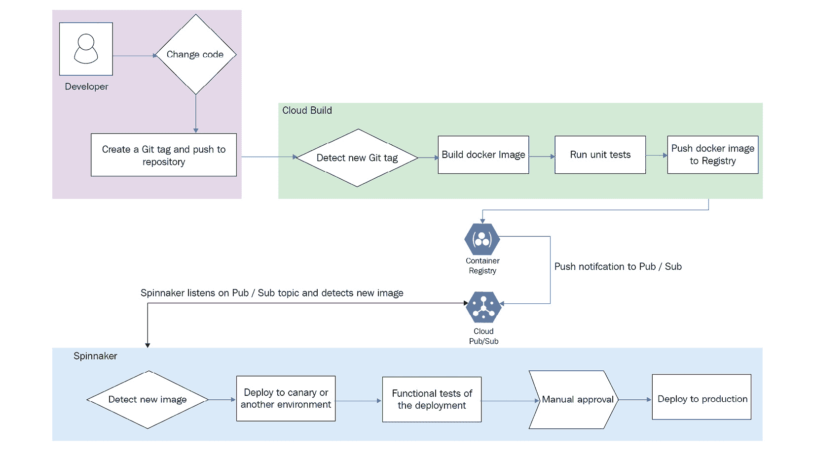

# 第十一章：*附录：*为专业云 DevOps 工程师认证考试做准备

本书是一本实用指南，旨在学习和理解**网站可靠性工程**（**SRE**），这是一种实施 DevOps 的规定性方法。书中还深入探讨了在 Google Cloud Platform 上实施 DevOps 所必需的 Google Cloud 服务。

此外，本书还帮助为专业云 DevOps 工程师认证考试做好准备。专业的云 DevOps 工程师负责高效的开发运维，并平衡服务的可靠性与交付速度。他们擅长使用 Google Cloud Platform 构建软件交付管道、部署和监控服务，并管理和学习事故。官方考试指南可以在[`cloud.google.com/certification/guides/cloud-devops-engineer`](https://cloud.google.com/certification/guides/cloud-devops-engineer)找到。要注册认证考试，请访问[`cloud.google.com/certification/register`](https://cloud.google.com/certification/register)。

高层次上，认证主要围绕 SRE、**Google Kubernetes Engine**（**GKE**）和 Google Cloud 的运维套件展开。这些话题可能占据认证考试的 80%以上。关于 SRE、GKE 和 Google Cloud 运维套件的章节广泛涵盖了在专业云 DevOps 工程师认证考试中评估的关键概念。*记住要点*部分以及本章节末尾的练习测试将帮助你复习本章的关键概念。

此外，还将高层次地覆盖可能出现在认证考试中的三个额外话题。部分话题与 Google 的其他认证考试有所重叠，例如专业云架构师认证或专业云开发者认证。

以下是将要总结的主题。请注意，这些主题在此处并没有完全详细展开，而是仅做介绍。建议查阅相关的具体文档以获取深入信息：

+   Cloud Deployment Manager

+   Cloud Tasks

+   Spinnaker

# Cloud Deployment Manager

**基础设施即代码**（**IaC**）是通过代码管理和配置基础设施的过程，而不是手动创建所需资源。**Cloud Deployment Manager**是 Google Cloud 的一项服务，提供 IaC 功能。Cloud Deployment Manager 可以创建一组 Google Cloud 资源，并帮助将这些资源作为一个整体进行管理，通常称为部署。例如，可以通过配置文件使用声明性代码创建**虚拟私有云**（**VPC**），而不是通过控制台手动创建。以下是 Cloud Deployment Manager 的一些关键特性：

+   可以并行创建多个资源，例如多个虚拟机

+   可以提供输入变量，以创建具有特定用户定义值的资源。

+   可以获取新创建资源的返回值，例如新创建的 Google Compute Engine 实例的实例 ID。

+   可以创建依赖关系，其中一个资源定义可以引用另一个资源，并且一个资源可以在创建另一个资源后创建（使用`dependsOn`）。

Cloud Deployment Manager 允许通过配置文件指定应用程序所需的所有资源。这是实现 Cloud Deployment Manager 的第一步。此配置文件以声明式格式编写，使用 YAML。

每个配置文件可以用来定义一个或多个资源。每个资源部分包含三个主要组件：资源的名称、资源类型和资源属性。需要使用的资源属性在大多数情况下是特定于资源类型的。配置文件中指定的资源是通过调用 API 创建的（这可能带来一定的风险，因为某些 API 可能在未来被弃用）。配置文件可以完全明确列出，或者 Cloud Deployment Manager 允许使用模板（模板更适合创建类似类型的资源）。

配置可以包含模板，这些模板引用了被抽象为单独构建块的配置文件部分。模板文件可以用 Python 或 Jinja2 编写。Python 模板功能更强大，提供了通过编程方式创建或管理模板的选项。Jinja2 是一种更简单但功能较弱的模板语言，使用与 YAML 相同的语法。可以使用预览模式（通过`--preview`标志）在应用之前验证资源的潜在操作。有关 Cloud Deployment Manager 的更多信息，请参见 [`cloud.google.com/deployment-manager`](https://cloud.google.com/deployment-manager)。

# Cloud Tasks

**Cloud Tasks** 是 Google Cloud 提供的完全托管服务，它允许你将可以独立执行并异步处理的工作单元从用户或服务到服务的请求中分离出去。一个独立的工作单元称为任务。Cloud Tasks 实际上用于当应用程序接受来自用户的输入，并需要相应地启动后台任务以执行自动化的异步操作时。

以下是 Cloud Tasks 的关键特性总结：

+   Cloud Tasks 旨在显式调用，其中发布者保留对执行的完全控制。

+   Cloud Tasks 最适用于任务生产者可以控制执行的场景。

Cloud Tasks 与 Pub/Sub 的核心区别在于显式调用与隐式调用的概念。如前所述，Cloud Tasks 旨在显式调用。而 Pub/Sub 支持隐式调用，其中发布者通过发布事件隐式地触发订阅者执行。有关 Cloud Tasks 的更多深入信息，请参考 [`cloud.google.com/tasks`](https://cloud.google.com/tasks)。

# Spinnaker

**Spinnaker** 是一个开源的多云持续交付平台，最初由 Netflix 开发，后来由 Google 扩展。Spinnaker 不是一个官方的 Google Cloud 服务，也不是一个原生集成服务，目前 Google Cloud Platform 尚未推出用于持续部署的原生服务。Google 大力推荐 Spinnaker 用于在 Google Cloud Platform 上实现 CI/CD 管道。Spinnaker 有助于高效、可靠地发布软件变更。Spinnaker 由多个独立的微服务组成。Spinnaker 创建了一个 Cloud Storage 存储桶，并使用 Redis 数据库来维护其资源。Spinnaker 还创建了一个 Pub/Sub 主题。

Spinnaker 可被视为一个应用程序管理工具，允许查看和管理 GKE 组件，包括工作负载资源、服务和负载均衡器。Spinnaker 支持多种部署模型，包括滚动更新、蓝绿部署或金丝雀发布。

Spinnaker 将所有操作置于自动驾驶模式，无需人工干预，换句话说，无需手动执行 `kubectl` 命令。Spinnaker 可以创建和管理 YAML 文件，并可以执行自动化部署，甚至为负载均衡器作为服务创建/执行 YAML 文件。唯一需要手动操作的步骤是提供批准以完成部署。

以下图示展示了使用 Spinnaker 部署到 GKE 集群时的交互高层概述：

使用 Spinnaker 部署到 GKE 时的交互示意图

上图中的交互如下：

1.  开发者通过创建 Git 标签并推送到云源代码库来更改代码。

1.  云源代码库配置为检测新的 Git 标签。这会触发 Cloud Build 根据提供的规范执行构建过程，可能包括运行单元测试。完成后，生成构建产物，如 Docker 镜像。

1.  创建的构建产物存储在容器注册表（Container Registry）或 Artifact Registry 中，一旦可用，如果已配置，会向 Cloud Pub/Sub 发送一条消息。

1.  安装在 GKE 上的 Spinnaker 将监听 Pub/Sub 主题，以接收新创建的镜像。

1.  一旦镜像可用，Spinnaker 将通过金丝雀发布方式将新容器部署到 QA/预生产环境中，从而确保只有少部分用户受到影响。

1.  如果可用，会在金丝雀环境中运行功能测试，以验证部署的质量。如果部署符合预期的质量标准，在手动批准后，该镜像将部署到生产环境。

需要注意的是，无论是在执行蓝绿部署还是金丝雀部署时，Spinnaker 都可以在原地更新 ReplicaSet。当使用 Deployment 部署 ReplicaSet 且 Deployment 不存在时，Spinnaker 会先创建一个包含 `0` 副本的 ReplicaSet，然后再创建 Deployment，后者会调整 ReplicaSet 的大小。当 Deployment 已经存在时，Spinnaker 会执行相同的操作，但会直接编辑现有的 Deployment，而不是创建新的。

有关在 Google Cloud Platform 上安装和管理 Spinnaker 的更多信息，请参考 [`cloud.google.com/docs/ci-cd/spinnaker/spinnaker-for-gcp`](https://cloud.google.com/docs/ci-cd/spinnaker/spinnaker-for-gcp)。

这部分总结了包括 Cloud Deployment Manager、Cloud Tasks 和 Spinnaker 等其他主题的内容。

你已阅读完本书内容。通过尝试模拟测试来检验你的知识。本书包括 2 次模拟测试，每次包含 50 道问题。这些测试可以作为参考。如果你正在参加认证考试，祝你好运！
