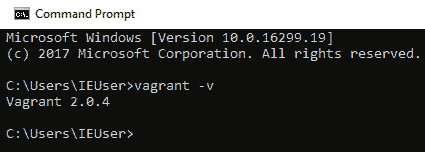
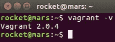
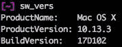
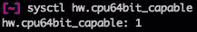
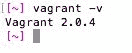

# 安装 VirtualBox 和 Vagrant

VirtualBox 是一个非常重要的软件，我们称之为**提供者**。它的工作是进行繁重的工作，创建和维护虚拟机和环境。Vagrant 本质上是对提供者（在我们的例子中是 VirtualBox）进行的封装，并暴露出一个强大的 API，允许您通过代码和配置（如 Vagrantfile）来创建和管理虚拟机。

安装 VirtualBox 后，我们将几乎不再需要直接操作它。它将在后台等待 Vagrant 的命令来管理虚拟机。

在本章中，我们将开始亲自操作 Vagrant。我们将关注以下主题：

+   查找操作系统版本

+   查找您的 CPU 架构

+   在 Windows、Linux 和 macOS 上安装 VirtualBox

+   在 Windows、Linux 和 macOS 上安装 Vagrant

+   通过命令行/终端运行 Vagrant，以查看您拥有的 Vagrant 版本

到本章结束时，您将拥有一个完全工作的 Vagrant 和 VirtualBox，准备开始创建虚拟环境。

# 在 Windows 上安装 VirtualBox 和 Vagrant

本节中，您将学习如何在 Windows 环境中安装 VirtualBox 和 Vagrant，如何查找您的 CPU 架构，以及您正在运行的 Windows 操作系统版本。我们将以 Windows 10 64 位企业版作为示例操作系统和计算机设置。

# 前提条件

在安装 VirtualBox 和 Vagrant 之前，我们需要了解您的系统的一些基本信息。这些信息有助于您选择下载哪个软件包。

# 系统版本

查找您正在运行的 Windows 版本将有助于选择下载哪个软件包安装程序。每个版本的 Windows 都不同，但我们将介绍如何在 Windows 10 上执行此操作。

有两种方法可以做到这一点；第一种是使用 Windows 中的命令提示符，这是一个相对快速简单的方法：

1.  按下 Windows 键 + *R*键（或点击开始并搜索`run`）

1.  这将打开一个提示窗口，在该窗口中输入`winver`

1.  按下*Enter*键，您应该会看到一个新的`关于 Windows`屏幕弹出，其中包含您操作系统的所有信息

第二种方法需要稍微多一点的努力，但可以通过 Windows 图形用户界面来实现：

1.  进入 Windows 设置并点击“关于”

1.  您可以通过点击任务栏中的齿轮图标或在任务栏中输入`settings`来访问系统设置

1.  在`关于`屏幕中，您会看到一个名为“Windows 规格”的部分

1.  在这一部分中，我们需要关注的是“编辑值”

1.  该值为`Windows 10 Enterprise Evaluation`

# CPU 架构

系统的 CPU 架构通常是 32 位或 64 位。当您下载 VirtualBox 或 Vagrant 软件包安装程序时，您需要定义所需的版本。

要查找 Windows 10 系统的 CPU 架构，请按照以下步骤操作：

1.  进入 Windows 设置并点击“关于”

1.  您可以通过点击任务栏中的齿轮图标或在任务栏中输入`设置`来访问系统设置。

1.  在`关于`屏幕上，您将看到一个标题为“设备规格”的部分。

1.  在本部分中，我们需要关注的内容是“系统类型”值。

1.  值为`64 位操作系统，x64 架构处理器`

# 在 Windows 10 上安装 VirtualBox

在进入此部分之前，值得一提的是，Vagrant 版本 1.8 及之后的版本会自动将 VirtualBox 安装到您的系统中，以提供更顺畅的体验。您可以跳过本部分，继续进行名为*在 Windows 10 上安装 Vagrant*的部分。如果您遇到任何问题，欢迎随时返回此部分并尝试手动安装 VirtualBox。

在我们安装 Vagrant 之前，建议先安装其提供者——VirtualBox。要开始，您需要访问官方的 VirtualBox 网站，[`www.virtualbox.org/`](https://www.virtualbox.org/)。最好的方法是使用系统的浏览器，如 Internet Explorer。

按照以下步骤进行安装：

1.  点击左侧菜单中的“下载”链接。我们将关注最新版本（截至撰写时为版本 5.2.10）。

1.  在此部分下方，您应该看到四个平台包链接的列表。

1.  点击 Windows 主机选项。系统会提示您选择版本，例如 x86（32 位 CPU）或 AMD64（64 位 CPU）。如果是这种情况，请根据“关于”部分（CPU 架构）中的信息下载相应的包。

1.  当您点击该包时，浏览器应自动开始下载。下载完成后，选择“运行”以立即开始安装。安装程序启动后，您将看到欢迎界面。

1.  点击“下一步”按钮继续。

1.  为了简单起见，我们将保持默认配置。如果需要，您可以在此处进行更改。这可能只是更改安装位置等简单操作。准备好后，点击“下一步”按钮继续。

1.  您应该看到另一个包含自定义选项的屏幕。为了简单起见，我们将保留所有选项勾选。

1.  点击“下一步”继续。

在此阶段，您将看到一条大的红色`警告`信息。不要担心，这是安装过程中的正常现象。安装程序需要暂时禁用并重新启动您计算机上的网络服务。这会影响您当前需要互联网连接的任何操作，例如下载或流媒体播放：

1.  当您准备好时，点击“是”以继续到下一个屏幕。

1.  这是在 VirtualBox 软件安装到您的系统之前，您进行任何更改的最后机会。如果您愿意继续，请点击“安装”按钮继续。

1.  根据您的用户访问控制安全设置，Windows 可能会要求您确认安装。点击“是”以允许软件安装程序继续。

1.  安装将开始。如果你需要取消安装，只需点击“取消”按钮。

1.  安装应该已经完成。我建议保持勾选“安装后启动 Oracle VM VirtualBox 5.2.10”框，因为这将允许你看到 VirtualBox 软件启动。点击“完成”按钮继续。

1.  如果你在安装阶段勾选了该选项，你应该在桌面上看到一个 Oracle VM VirtualBox 快捷方式。你可以点击该快捷方式打开 VirtualBox，或者通过搜索框输入`virtualbox`并点击结果来打开它。

完成后，你将看到有关默认安装的屏幕。恭喜你完成了这一步。接下来我们将通过安装 Vagrant 来结束。

# 在 Windows 10 上安装 Vagrant

现在是安装 Vagrant 的时候了。以下是安装 Vagrant 的步骤：

1.  访问 Vagrant 的官方网站，[`www.vagrantup.com/`](https://www.vagrantup.com/)。最好的方式是使用你系统的互联网浏览器，比如 Firefox。我们将使用 Vagrant 的最新版本。

1.  点击“下载 2.0.4”链接或顶部导航菜单中的“下载”链接。你应该会看到下载页面。

1.  我们可以专注于 Windows 部分，但你需要根据你的系统选择 32 位或 64 位选项。我的系统是 64 位的，所以我会选择那个选项。下载应该会自动开始。

1.  选择“运行”，这将自动下载软件并启动安装程序。

下载完成后，安装程序应该会自动启动。你将看到安装程序的欢迎屏幕：

1.  点击“下一步”按钮继续。

1.  阅读完条款和条件后，如果你同意并接受，请勾选相应选项。点击“下一步”按钮继续。

1.  如果需要，你可以更改安装目标位置。当你满意后，点击“下一步”按钮继续到下一屏幕。

1.  在 Vagrant 安装到你的系统之前，你可以选择进行任何更改。如果你不再需要做任何更改，点击“安装”按钮。

1.  Windows UAC 会询问你是否同意允许安装程序继续。点击“是”按钮。

1.  Vagrant 将开始安装。如果你需要取消安装，请点击“取消”按钮。

1.  在成功安装 Vagrant 后，点击“完成”按钮以关闭安装程序。

1.  你必须重启系统，才能使 Vagrant 在你的系统上完全安装。

1.  点击“是”按钮以重启。这将打断你当前在系统上的工作，因此请确保保存所有需要保存的文件。

1.  要验证 Vagrant 是否已安装并正在运行，我们需要使用命令提示符。要访问命令提示符，请在系统的搜索功能中搜索`cmd`：

1.  通过输入 `vagrant -v` 命令并按下 *Enter* 键运行。你应该看到类似于前面截图的输出。我的 Vagrant 版本是 `2.0.4`。

# 在 Linux 上安装 VirtualBox 和 Vagrant

在本节中，你将学习如何在 Linux 环境中安装 VirtualBox 和 Vagrant。你还将学习如何查找你的 CPU 架构以及你正在运行的 Linux 操作系统版本。在本节中，我们将使用 Ubuntu 16.04 64 位作为示例操作系统和计算机设置。

# 先决条件

在安装 VirtualBox 和 Vagrant 之前，我们需要了解一些关于系统的基本信息。这些信息将帮助你选择要下载的包。

# 系统版本

查找你正在运行的 Ubuntu 版本将帮助你选择下载哪个包安装程序。

查找 Ubuntu 版本最简单快捷的方法是进入终端并运行 `cat /etc/*-release` 命令。

现在你应该会看到一些输出。我们可以关注几个部分，它们是 `DISTRIB_DESCRIPTION`、`VERSION` 和 `VERSION_ID`。在我的情况下，是 Ubuntu 版本 16.04。

# CPU 架构

系统的 CPU 架构通常是 32 位或 64 位。当你下载 VirtualBox 或 Vagrant 软件包安装程序时，你需要确定你需要哪个版本。

查找 Ubuntu 系统的 CPU 架构最简单快捷的方法是进入终端并运行 `uname -mrs` 命令。

现在你应该会看到一些输出。我们要找的是最后一部分；在我的情况下，显示的是 `x86_64`。

这表明我有一个 64 位的 CPU 架构。如果你的系统是 32 位的，你可能会看到 `i686` 或 `i386`。

# 在 Ubuntu 16.04 上安装 VirtualBox

在安装 Vagrant 之前，最好先安装它的提供者，即 VirtualBox：

1.  访问官方 VirtualBox 网站，[`www.virtualbox.org/`](https://www.virtualbox.org/)。最好的方式是使用系统的浏览器，例如 Firefox。

1.  点击左侧导航菜单中的 Downloads 选项。

1.  在这一节下面，你应该会看到四个平台包的链接列表。点击 Linux 发行版选项。

1.  选择一个版本，如 x86（32 位 CPU）或 AMD64（64 位 CPU）。使用关于（CPU 架构）中的信息，并下载相应的包。我将选择与我的系统匹配的 Ubuntu 16.04 AMD64 版本。点击链接，下载应自动开始。你的系统可能会提示你选择“用某个应用程序打开”或“保存文件”。

1.  我将选择“用软件安装（默认）”选项，因为这将下载包并自动启动安装程序。当你选择好选项后，点击 OK 按钮。

Ubuntu 安装程序应该会打开。点击“安装”选项以开始软件安装。根据系统的安全设置，您可能会被要求输入密码。如果是这种情况，请输入密码并点击“认证”按钮继续。我们现在可以检查安装情况：

1.  应该在您的系统上安装 VirtualBox，除非在安装过程中出现任何错误信息。为了确认 VirtualBox 是否已安装，可以使用 Ubuntu 的搜索功能并输入`virtualbox`。

1.  您应该看到它出现在“应用程序”部分下方。

1.  打开 VirtualBox 时，您将看到一个欢迎界面。这是默认的安装界面。

1.  如果您在系统中找不到 VirtualBox，也可以在 Ubuntu 的终端中运行`virtualbox`命令。如果软件被找到，它应该会打开 VirtualBox。

完成后，您将看到与默认安装相关的屏幕。恭喜您完成了这一步。接下来我们将通过安装 Vagrant 完成安装过程。

# 在 Ubuntu 16.04 上安装 Vagrant

现在是安装 Vagrant 的时候了：

1.  访问官方 Vagrant 网站，[`www.vagrantup.com/`](https://www.vagrantup.com/)。最好的方法是使用您系统的互联网浏览器，如 Firefox。

1.  我们将坚持使用最新版本的 Vagrant。点击“下载 2.0.4”链接或顶部导航菜单中的“下载”链接。您应该会看到下载页面。

1.  由于我们使用的是基于 Debian 的 Ubuntu，我们将重点关注该软件包。根据之前的知识，我们知道应该选择 64 位下载选项。

1.  当您点击该链接时，系统应该会提示您下载软件。我选择了“用软件安装程序打开（默认）”选项，因为这将下载软件并自动启动安装程序。

1.  点击“安装”按钮以开始。

1.  系统会要求您输入密码以开始安装。输入您的密码并点击“认证”按钮。

1.  当 Vagrant 安装完成后，您应该注意到安装按钮已经变成了移除按钮。如果您想删除 Vagrant，可以使用此选项：

您还可以在 Ubuntu 终端中运行`vagrant -v`命令。如果 Vagrant 安装成功，您应该看到一些输出。您可以看到我系统的版本是`Vagrant 2.0.4`。

# 在 macOS 上安装 VirtualBox 和 Vagrant

在本节中，您将学习如何在 macOS 环境中安装 VirtualBox 和 Vagrant。您将了解如何查找您的 CPU 架构以及运行的 macOS 操作系统版本。在本节中，我们将使用 macOS High Sierra 10.13.3 64 位作为我们的示例操作系统和计算机设置。

# 前提条件

在安装 VirtualBox 和 Vagrant 之前，我们需要了解一些关于您系统的基本信息。这些信息对于帮助您选择要下载的软件包非常重要。

# 系统版本

了解你运行的是哪个版本的 macOS，有助于你选择要下载的安装包。

查找 Mac 系统信息最简单快捷的方法之一是运行 `sw_vers` 命令，在终端中输入：

这里有两个关键值可以关注：`ProductName`，它是 `Mac OS X`；以及 `ProductVersion`，它是 `10.13.3`。

# CPU 架构

系统的 CPU 架构通常是 32 位或 64 位。当你下载 VirtualBox 或 Vagrant 软件包安装程序时，你需要定义所需的版本。

我们可以运行 `sysctl hw.cpu64bit_capable` 命令，这样可以知道我们的系统是否支持运行 64 位软件。在这张我的系统截图中，你可以看到返回值是 `1`：

这意味着我有一个支持 64 位的 Mac 系统。如果你的值返回为空或 `0`，则表示你的系统仅支持 32 位。

# 在 Mac OS 10.11.3 上安装 VirtualBox

在进入这一部分之前，值得一提的是，Vagrant 1.8 版本及之后的版本会自动在你的系统上安装 VirtualBox，以提供更顺畅的体验。你可以跳过这一部分，继续下一部分，即 *在 macOS 上安装 Vagrant*。如果遇到问题，请随时返回此部分并尝试手动安装 VirtualBox。

在安装 Vagrant 之前，最好先安装它的提供者，即 VirtualBox：

1.  访问 VirtualBox 官方网站，[`www.virtualbox.org/`](https://www.virtualbox.org/)。最好的方法是使用你系统的互联网浏览器，如 Firefox。

1.  点击左侧导航菜单中的下载链接。

1.  这应该会加载网站的下载页面。对于本书，我们将使用 VirtualBox 版本 5.2.10，请导航到该页面的相关部分。当页面出现时，点击 OS X hosts 链接，下载应该会自动开始。

1.  下载完成后，点击 `.dmg` 文件以运行 VirtualBox 安装包。你的 Mac 系统将打开并验证安装程序。你将看到一个临时屏幕，显示几个不同的选项。按步骤 1 点击并打开 `VirtualBox.pkg` 文件。

1.  VirtualBox 安装程序将运行。点击继续按钮。

1.  系统已验证你可以安装此 VirtualBox 软件。点击继续按钮开始安装过程。

1.  在下一个屏幕上，你可以选择更改安装位置。你可以根据需要进行更改，但为了简洁和一致性，我们将其保持为默认位置。如果你同意继续，点击安装按钮。

1.  系统可能会要求你登录以允许安装程序继续。请输入你的用户名（此项可能已经自动填写）和系统密码。然后点击安装软件按钮继续。

1.  安装程序将安装所需的文件和配置。如果安装过程中没有问题，你应该会看到 `The ivag`

1.  要验证并运行 VirtualBox，你可以在应用程序文件夹中找到它，可能也会出现在桌面上。当你打开安装程序时，应该会看到 VirtualBox 默认的欢迎界面。

恭喜！你已成功在 macOS 系统上安装了 VirtualBox。

# 在 macOS 10.13.3 上安装 Vagrant

现在是时候安装 Vagrant 了：

1.  访问 Vagrant 官方网站，[`www.vagrantup.com/`](https://www.vagrantup.com/)。最好的方法是使用你系统的互联网浏览器，例如 Firefox。

1.  点击主页上的下载 2.0.4 或顶部右侧导航菜单中的下载链接。这将加载 Vagrant 下载页面。

1.  当前版本的 Vagrant 仅支持 64 位 macOS 系统。我们将使用该版本。点击链接开始下载。

1.  下载完成后，点击 `.dmg` 文件以打开 Vagrant 安装程序。Mac 系统将会打开并验证 Vagrant 安装程序。

1.  验证完成后，你将看到一个临时的启动屏幕。点击 `vagrant.pkg` 图标运行安装程序。

1.  你应该会看到安装程序的 `介绍` 页面。点击继续按钮开始安装过程。

1.  你可以选择更改 Vagrant 的安装位置。你可以根据需要进行更改，但为了简洁性和一致性，我们将保持默认位置。如果你同意继续，请点击安装按钮。

1.  系统可能会要求你登录以允许安装程序继续进行。请输入你的用户名（可能已经填写好）和系统密码。点击安装软件按钮继续。

1.  安装将开始。如果安装成功，你应该会看到 `安装成功` 页面。

现在你可以点击关闭按钮来关闭安装程序。Vagrant 没有图形用户界面，因此我们可以通过运行 `vagrant -v` 命令来验证它是否已安装成功，命令将输出我们正在运行的 Vagrant 版本：

如你在我的终端输出中所见，macOS 系统正在运行 Vagrant 版本 `2.0.4`。恭喜！你已成功将 Vagrant 安装到 macOS 系统上。

# 概要

在本章中，我们学习了如何在 Windows、Mac 和 Linux 机器上安装 Vagrant 及其提供者 VirtualBox。现在你已经拥有了基础环境，可以开始使用 Vagrant 创建虚拟环境。

在第三章，*命令行界面 - Vagrant 命令*，我们将学习 Vagrant 的所有命令和子命令。这些强大的命令为我们提供了 Vagrant 的完整功能集，从基本功能（例如返回 Vagrant 的软件版本），到管理 Box（例如从 Vagrant Cloud 导入并安装它们）。
