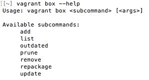
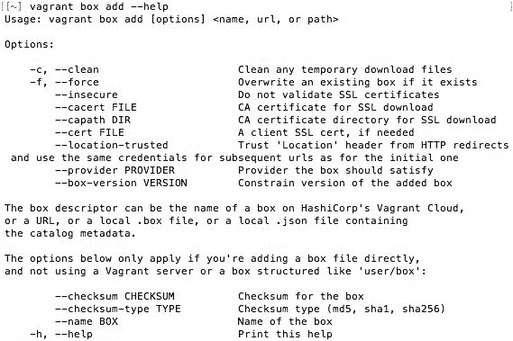

# 第三章：命令行界面 - Vagrant 命令

在本章中，我们将学习如何通过各种命令和子命令控制 Vagrant。Vagrant 没有图形用户界面，因此我们将通过终端/命令提示符运行命令。通过本章的学习，您将对 Vagrant 命令及其用法有扎实的基础知识。我们将涵盖以下主题：

+   Vagrant 命令、子命令和标志

+   格式化命令

+   一般 Vagrant 命令和子命令

+   Vagrant 配置命令和子命令

+   日常 Vagrant 命令和子命令

+   应用程序特定的 Vagrant 命令和子命令

+   故障排除

# Vagrant 命令概述

Vagrant 主要是一个命令行工具。默认情况下，没有图形用户界面，尽管您可以在网上找到一些第三方的图形界面。Vagrant 提供了一个简单且强大的命令和子命令集合，共有 25 个以上的命令。

要开始使用 Vagrant 命令，请打开命令提示符/终端并运行`vagrant --help`命令。您现在应该能看到一系列常见命令，其中包括`box`、`destroy`和`status`。

要查看完整的可用命令列表（包括不常用命令），请运行`vagrant list-commands`。您将看到更长的命令列表，并附有每个命令的简要说明。

要获取某个特定命令的更多信息并查看其子命令，请在命令末尾添加`--help`标志。举例来说，`vagrant box --help`命令会返回以下信息：



当某个命令有子命令时，您还可以为子命令添加`--help`标志，以了解更多信息。在这种情况下，我们的命令将是`vagrant box add --help`，其返回内容为：



如您在截图中看到的，关于该子命令的信息非常丰富。Vagrant 的文档非常完善，您在命令行/终端中无法找到的信息，您应该能在 Vagrant 网站上找到：[`www.vagrantup.com/`](https://www.vagrantup.com/)。

# 深入了解 Vagrant 命令

在本节中，您将学习所有可用的 Vagrant 命令和子命令。我们将探讨最常见的命令及其功能。我们还会讨论与命令相关的错误以及如何克服这些问题。

我们将把命令和子命令分为以下四个类别：

+   一般

+   配置

+   日常

+   应用程序特定

在本节结束时，您将对可用的命令和子命令有较好的了解，知道它们的作用以及如何在日常工作中使用它们。

# 格式化命令简要说明

在本章中，我将使用某些关键词作为占位符。这些占位符是供你在命令和子命令中输入值的。例如，一个典型的占位符会像这样：[INSERT VALUE]。例如，`vagrant login --user [INSERT VALUE]`，其中`[INSERT VALUE]`可能是`myusername`，最终你输入的命令就是`vagrant login --user myusername`。不需要使用大写字母或方括号。

当你看到`[VMNAME]`占位符时，它指的是你想要在系统上运行该命令的特定 Vagrant 机器名称。默认的 Vagrant 机器名为`default`，例如，命令`vagrant resume default`将从暂停状态恢复该机器。

# 一般的 Vagrant 命令和子命令

Vagrant 中的一般命令和子命令没有特定类别。它们可能只使用一次，或执行非常特定的任务。

# list-commands 命令

`list-commands`命令将列出主`vagrant`命令范围内的所有可用命令。它将按字母顺序列出每个命令并给出简要描述。

# 选项/标志

该命令只有一个标志`-h`/`--help`，它将打印该命令的帮助屏幕。

一个例子是`vagrant list-commands --help`命令。

# 帮助命令

`help`命令将显示命令的正确语法，并列出一些最常用的 Vagrant 命令。

# 版本命令

`version`命令将返回当前安装在系统上的 Vagrant 版本、最新的可用版本，并提供一个 Vagrant 官方网站下载页面的 URL。

# 选项/标志

该命令只有一个标志`-h`/`--help`，它将打印该命令的帮助屏幕。

一个例子是`vagrant version --help`命令。

# global-status 命令

`global-status`命令将返回当前用户所有 Vagrant 环境的信息。它将返回 Vagrant 环境 ID、名称、提供者、状态和目录。此命令对于给你一个系统中 Vagrant 环境的概览非常有用。

# 选项/标志

该命令有两个标志：

+   `-h`/`--help`：打印该命令的帮助屏幕

+   `--prune`：修剪任何无效的条目

一个例子是`vagrant global-status --help`命令。

# Vagrant 的配置命令和子命令

在本节中，我们将查看 Vagrant 的配置命令和子命令。这些命令通常用于配置 Vagrant，比如安装包或创建环境快照。

# 登录命令

`login`命令用于登录到你的 HashiCorp Vagrant Cloud 账户。登录 Vagrant Cloud 后，你可以访问并下载受保护的盒子以及 Vagrant Share 服务，这使你能够与任何人分享你的 Vagrant 环境。

# 选项/标志

这个命令有六个标志：

+   `-c`/`--check`：检查你是否已经登录。

+   `-d`/`--description [INSERT VALUE]`：接受一个参数，用来设置 token 的描述。

+   `-k`/`--logout`：如果你已经登录，则登出。

+   `-t`/`--token [INSERT VALUE]`：接受一个参数，用来设置 Vagrant Cloud token。

+   `-u`/`--username [INSERT VALUE]`：接受一个参数，指定你的 Vagrant Cloud 邮箱或用户名。

+   `-h`/`--help`：打印该命令的帮助屏幕。

一个例子是 `vagrant login --check` 命令。

# package 命令

`package` 命令允许你从运行中的 Vagrant 环境创建一个 Vagrant box。

# 选项/标志

这个命令有五个标志：

+   `--base [INSERT VALUE]`：接受一个参数，指定一个虚拟机的名称（在 VirtualBox 中）作为基础 box 进行打包。这个标志仅在你使用 VirtualBox 提供者时有效。

+   `--output [INSERT VALUE]`：接受一个参数，用来命名输出文件。

+   `--include [INSERT VALUE, INSERT VALUE]`：接受以逗号分隔的参数，以便在打包过程中包含额外的文件。

+   `--vagrantfile [INSERT VALUE]`：接受一个参数，指定你希望打包到该 box 中的 Vagrantfile。

+   `-h`/`--help`：打印该命令的帮助屏幕。

一个例子是 `vagrant package --help` 命令。

# snapshot 命令

`snapshot` 命令允许你管理 Vagrant 环境的快照。你可以保存、删除和恢复快照。只有某些提供者支持快照功能，如果你的提供者不支持，运行此命令时 Vagrant 会返回一个警告。

# 子命令

`snapshot` 命令有六个子命令：

+   `vagrant snapshot delete [INSERT VALUE] [INSERT VALUE]`：第一个参数是虚拟机名称，第二个参数是你希望删除的快照名称。

+   `vagrant snapshot list [INSERT VALUE]`：参数可以选择是 Vagrant 机器名称。此命令将列出系统上所有可用的快照，或者如果指定了参数，则列出某个 Vagrant 机器的所有快照。

+   `vagrant snapshot push`：用于创建正在运行的 Vagrant 环境的新快照。它会将此快照添加到快照堆栈中。

+   `vagrant snapshot pop`：可以作为 `push` 命令的反向操作，用来撤销已推送的快照。

+   `vagrant snapshot save [INSERT VALUE] [INSERT VALUE]`：保存当前机器的快照。它类似于 `push` 命令，但不建议将此命令与 `push` 或 `pop` 混用，因为它不安全。第一个参数是虚拟机名称，第二个参数是快照名称。

+   `vagrant snapshot restore [INSERT VALUE] [INSERT VALUE]`：恢复一个指定的快照。第一个参数是虚拟机名称，第二个参数是你希望恢复的快照名称。

# provider 命令

`provider` 命令会返回当前运行机器的提供者，或者它可以接受一个环境 ID。

# 选项/标志

此命令有三个标志：

+   `--install`：尝试安装提供者。

+   `--usable`：检查提供者是否可用。

+   `-h`/`--help`：打印此命令的帮助屏幕。

一个示例是`vagrant provider --install`命令。

# plugin 命令

`plugin`命令允许你管理 Vagrant 插件。你可以安装、列出、修复、卸载和更新插件。

# 子命令

`plugin`命令有七个可用的子命令：

+   `vagrant plugin expunge`：删除所有用户安装的插件。这将删除与这些插件相关的数据和依赖项。如果你希望一次性删除所有插件，这是一个有用的命令。

+   `vagrant plugin install [INSERT VALUE]`：通过提供插件名称作为命令参数来安装插件。你可以从已知的 Gem 或系统中的本地 Gem 文件安装插件。

+   `vagrant plugin license [INSERT VALUE] [INSERT VALUE]`：安装专有的 Vagrant 插件许可证。第一个参数是插件名称，第二个是许可证文件。

+   `vagrant plugin list`：列出你系统上所有已安装的插件。它将列出插件信息，如其版本。此命令对于找出你已安装的插件及其版本非常有用。

+   `vagrant plugin repair`：尝试修复任何存在问题且无法正常工作的插件。问题可能出现在自定义插件的安装过程中，或者是`plugins.json`文件的错误。

+   `vagrant plugin uninstall [INSERT VALUE]`：使用提供的插件名称作为第一个参数删除插件。此命令支持多个参数，每个参数都是一个插件名称。你可以使用此命令删除一个或多个插件。

+   `vagrant plugin update [INSERT VALUE]`：如果提供了插件名称作为第一个参数，则更新特定插件。如果没有提供参数，此命令将更新所有已安装的插件。

# cap 命令

`cap`命令允许你运行或检查来宾机器的功能。这些功能通常是特定于来宾的，并且是专门配置的，例如在 Vagrant 插件开发中。

# 选项/标志

此命令有两个标志：

+   `--check [INSERT VALUE] [INSERT VALUE]`：检查某个功能。第一个参数是功能名称，第二个参数是功能参数。此命令不会运行该功能。

+   `-h`/`--help`：打印此命令的帮助屏幕。

一个示例是`vagrant cap --help`命令。

# 日常的 Vagrant 命令和子命令

日常的 Vagrant 命令和子命令是你最常使用的。这些命令通常用于管理你的 Vagrant 盒子，例如创建、启动和停止它们。

# `box`命令

`box`命令允许你管理系统上的 Vagrant 盒子。你可以安装、更新、删除和修剪盒子。

# 子命令

`box`命令有七个可用的子命令：

+   `vagrant box add [INSERT VALUE]`：将 Vagrant box 添加并下载到你的系统中。然后可以在 Vagrantfile 中使用该 box 来创建 Vagrant 虚拟机。

+   `vagrant box list`：列出系统中已安装的所有 Vagrant box。

+   `vagrant box outdated`：检查当前使用的 Vagrant box 是否过时。你可以添加 `--global` 标志，它会检查所有已安装的 Vagrant box。

+   `vagrant box prune`：删除已安装 box 的旧版本。如果你当前使用的是旧版本的 box，它想删除时会要求确认。

+   `vagrant box remove [INSERT VALUE]`：根据提供的第一个参数（名称）删除 Vagrant box。

+   `vagrant box repackage [INSERT VALUE] [INSERT VALUE] [INSERT VALUE]`：使用第一个参数作为名称，第二个参数作为提供程序，第三个参数作为版本，将 Vagrant box 打包为 `.box` 文件。你可以通过 `vagrant box list` 命令获取参数值。然后可以分发该 box。

+   `vagrant box update`：检查并更新当前使用的 box。你可以使用 `--box [INSERT VALUE]` 标志，其中第一个参数是你希望特定更新的 box 名称。

# `destroy` 命令

`destroy` 命令将停止并删除 Vagrant 虚拟机。

# 选项/标志

这个命令有三个标志：

+   `-f`/`--force`：在不询问确认的情况下销毁 Vagrant 虚拟机。

+   `--parallel`/`--no-parallel`：仅在提供程序支持时启用或禁用并行性。在本书中我们使用 VirtualBox 作为提供程序，而在写作时它不支持并行执行。运行此标志也会启用 `force` 标志。

+   `-h`/`--help`：打印此命令的帮助信息。

一个示例是 `vagrant destroy --force` 命令。

# `halt` 命令

`halt` 命令将停止/暂停正在运行的 Vagrant 虚拟机。

# 选项/标志

这个命令有两个标志：

+   `--force [INSERT VALUE]`：强制关闭正在运行的虚拟机。如果你的虚拟机未保存，运行此命令时可能会丢失数据，就像断开计算机电源一样。你可以使用可选参数指定机器名称或 ID。

+   `-h`/`--help`：打印此命令的帮助信息。

一个示例是 `vagrant halt --force` 命令。

# `init` 命令

`init` 命令生成一个新的 Vagrantfile，用于配置新的 Vagrant 环境。

# 选项/标志

这个命令有六个标志：

+   `--box-version [INSERT VALUE]`：将提供的第一个参数的 box 版本添加到 Vagrantfile 中

+   `-f`/`--force`：如果同一目录下已经存在 Vagrantfile，则覆盖该文件

+   `-m`/`--minimal`：生成一个最小的 Vagrantfile，删除不必要的部分，如注释

+   `--output [INSERT VALUE]`：使用第一个参数指定的输出路径

+   `--template [INSERT VALUE]`：当提供的路径作为第一个参数时，使用自定义 Vagrantfile 模板

+   `-h`/`--help`：打印该命令的帮助屏幕。

一个例子是 `vagrant init --force` 命令。

# port 命令

`port` 命令返回从客机到 Vagrant 环境的端口映射。

# 选项/标志

此命令有三个标志：

+   `--guest [INSERT VALUE]`：当第一个参数是客机上的端口时，输出特定的端口信息。它将返回主机映射的端口。此命令对于某些网络级别的调试或测试非常有用。

+   `--machine-readable`：返回/显示更易机器读取的输出。

+   `-h`/`--help`：打印该命令的帮助屏幕。

一个例子是 `vagrant port --machine-readable` 命令。

# provision 命令

`provision` 命令将根据可用的 Vagrantfile 为 Vagrant 机器提供配置。如果成功，你将获得一个正在运行并且已完全配置的 Vagrant 环境。

# 选项/标志

此命令有两个标志：

+   `--provision-with [INSERT VALUE]`：使用指定的配置器为 Vagrant 机器提供配置。你可以通过提供一个以逗号分隔的列表来使用多个配置器类型。

+   `-h`/`--help`：打印该命令的帮助屏幕。

一个例子是 `vagrant provision --help` 命令。

# push 命令

`push` 命令将使用你在 Vagrantfile 中配置的方法部署代码。你可以使用 FTP/SFTP 和 Heroku 作为部署方法。

# 选项/标志

该命令只有一个标志 `-h`/`--help`，它将打印该命令的帮助屏幕。

一个例子是 `vagrant push --help` 命令。

# reload 命令

`reload` 命令用于在你更改 Vagrantfile 并希望将更改应用到正在运行的机器时使用。此命令会停止当前环境，应用新的 Vagrantfile，并重新启动环境。

# 选项/标志

此命令有三个标志：

+   `--provision`/`--no-provision`：在重新加载过程中启用或禁用配置。

+   `--provision-with [INSERT VALUE]`：使用指定的配置器为 Vagrant 机器提供配置。可以通过提供以逗号分隔的参数列表来使用多个配置器类型。

+   `-h`/`--help`：打印该命令的帮助屏幕。

一个例子是 `vagrant reload --no-provision` 命令。

# resume 命令

`resume` 命令将启动一个暂停的 Vagrant 环境。它可以在执行 `vagrant halt` 命令后使用。

# 选项/标志

此命令有三个标志：

+   `--provision`/`--no-provision`：在机器恢复时启用或禁用配置。

+   `--provision-with [INSERT VALUE]`：仅使用第一个参数中指定的某些配置器。要使用多个配置器，可以提供一个以逗号分隔的列表。提供的值可以是配置器的名称或类型。

+   `-h`/`--help`：打印该命令的帮助屏幕。

一个例子是 `vagrant resume --no-provision` 命令。

# status 命令

`status`命令将返回 Vagrant 机器的状态。它会返回诸如`stopped`或`running`之类的信息。

# 选项/标志

这个命令只有一个标志，`-h`/`--help`，它将打印该命令的帮助页面。

一个示例是`vagrant status --help`命令。

# `suspend`命令

`suspend`命令类似于`vagrant halt`命令，但它不会完全停止并关闭机器，而是会保存状态，这会占用额外的磁盘空间，但当你重新启动机器时，它会快速从该精确点开始，不会像冷启动那样经历长时间的启动过程。

# 选项/标志

这个命令只有一个标志，`-h`/`--help`，它将打印该命令的帮助页面。

一个示例是`vagrant suspend --help`命令。

# `up`命令

`up`命令将启动一个 Vagrant 环境。在启动过程中，它还将配置机器，类似于`vagrant provision`命令。

# 选项/标志

这个命令有七个标志：

+   `--provision`/`--no-provision`：启用或禁用在 Vagrant 机器启动时的配置。

+   `--provision-with [INSERT VALUE]`：仅使用在第一个参数中指定的特定配置器。要使用多个配置器，可以使用逗号分隔的列表。提供的值可以是配置器的名称或类型。

+   `--destroy-on-error`/`--no-destroy-on-error`：如果发生致命错误，将销毁机器。除非使用`--no-destroy-on-error`标志，否则这是默认行为。

+   `--parallel`/`--no-parallel`：仅在提供者支持的情况下启用或禁用并行处理。本书中使用的是 VirtualBox 作为提供者，在写作时，它不支持并行执行。如果你运行此命令，则不会发生任何事情。

+   `--provider [INSERT VALUE]`：使用作为第一个参数提供的提供者。

+   `--install-provider`/`--no-install-provider`：如果可能并且尚未安装，将尝试安装提供者。

+   `-h`/`--help`：打印该命令的帮助页面。

一个示例是`vagrant up --no-parallel`命令。

# `validate`命令

`validate`命令将验证 Vagrantfile 并返回任何错误。它会检查 Vagrantfile 中的问题，如语法错误。

# 选项/标志

这个命令只有一个标志，`-h`/`--help`，它将打印该命令的帮助页面。

一个示例是`vagrant validate --help`命令。

# 针对特定应用的 Vagrant 命令和子命令

针对特定应用的 Vagrant 命令和子命令，专注于外部应用程序或与 Vagrant 或 VirtualBox 不直接相关的软件。在本节中，我们将讨论 Docker、RDP、RSync、SSH 和 PowerShell 命令及其子命令。

# `docker-exec`命令

`docker-exec`命令用于直接在运行的`docker`容器中执行命令。当使用 Docker 作为 Vagrant 的提供者时，执行此操作。

# 选项 / 标志

该命令有八个标志：

+   `--no-detach`/`--detach`：启用或禁用命令在后台运行。

+   `-i`/`--interactive`：即使未附加，也保持标准输入（STDIN）打开。

+   `--no-interactive`：即使未附加，也不保持标准输入（STDIN）打开。

+   `-t`/`--tty`：启用伪终端（pseudo-tty），即 pty。

+   `--no-tty`：禁用伪终端（pseudo-tty），即 pty。

+   `-u [INSERT VALUE]`/`--user [INSERT VALUE]`：将用户或 UID 作为第一个参数与命令一起发送。

+   `--prefix`/`--no-prefix`：启用或禁用带有机器名称的前缀输出。这在区分不同的机器/容器时很有用。

+   `-h`/`--help`：打印该命令的帮助页面。

一个示例是 `vagrant docker-exec --no-tty` 命令。

# `docker-logs` 命令

`docker-logs` 命令将返回正在运行的容器的日志。这在将 Docker 作为 Vagrant 提供程序时使用。

# 选项/标志

该命令有三个标志：

+   `--no-follow`/`--follow`：启用或禁用将 Docker 日志数据流式传输到输出中。

+   `--no-prefix`/`--prefix`：启用或禁用带有机器名称的前缀输出。这在区分不同的机器/容器时很有用。

+   `-h`/`--help`：打印该命令的帮助页面。

一个示例是 `vagrant docker-logs --no-follow` 命令。

# `docker-run` 命令

`docker-run` 命令与 vagrant `docker-exec` 命令非常相似，都允许你在 Docker 容器上运行命令。与 `docker-exec` 命令相比，它的选项更少，配置性也较差。再次提醒，这个命令是在将 Docker 作为 Vagrant 提供程序时使用的。

# 选项/标志

该命令有六个标志：

+   `--no-detach`/`--detach`：启用或禁用命令在后台运行。

+   `-t`/`--tty`：启用伪终端（pseudo-tty），即 pty。

+   `--no-tty`：禁用伪终端（pseudo-tty），即 pty。

+   `-r`/`--rm`：执行后删除容器。

+   `--no-rm`：执行后不删除容器。

+   `-h`/`--help`：打印该命令的帮助页面。

一个示例是 `vagrant docker-run --no-detach` 命令。

# `rdp` 命令

`rdp` 命令用于在 Vagrant 环境中创建远程桌面客户端。此命令只能用于支持远程桌面协议的 Vagrant 环境。

# 选项/标志

该命令有一个标志 `-h`/`--help`，它将打印该命令的帮助页面。

一个示例是 `vagrant rdp --help` 命令。

# `rsync` 命令

`rsync` 命令将强制同步任何已配置为使用 RSync 作为同步选项的文件夹到远程机器。同步通常只有在你手动启动或重新加载 Vagrant 环境时才会发生。

# 选项/标志

该命令有一个标志 `-h`/`--help`，它将打印该命令的帮助页面。

一个示例是 `vagrant rsync --help` 命令。

# `rsync-auto` 命令

如何运行`vagrant rsync-auto`：`rsync-auto`命令类似于`vagrant rsync`命令，它强制同步任何配置的 RSync 文件夹，但现在它会监听所有配置的目录，自动同步文件更改。

# 选项/标志

这个命令有三个标志：

+   `--poll`：强制轮询文件系统。此选项性能较差，可能比较慢。

+   `--no-poll`：禁用文件系统的轮询。

+   `-h`/`--help`：打印此命令的帮助信息。

一个例子是`vagrant rsync-auto --no-poll`命令。

# ssh 命令

`ssh`命令将通过 SSH 协议/连接将你连接到远程 Vagrant 虚拟机。此命令使你能够访问虚拟机的 shell，允许你直接在虚拟机上运行命令。

# 选项/标志

这个命令有五个标志：

+   `-c [插入值]`/`--command [插入值]`：通过 SSH 直接运行使用第一个参数提供的命令。

+   `-p`/`--plain`：以普通模式连接，允许你选择身份验证方式。

+   `-t`/`--tty`：启用`tty`，当你运行 SSH 命令时使用。默认值为启用。

+   `--no-tty`：禁用`tty`，当你运行 SSH 命令时。

+   `-h`/`--help`：打印此命令的帮助信息。

一个例子是`vagrant ssh --plain`命令。

# ssh-config 命令

`ssh-config`命令将生成一个配置，可以在 SSH 配置文件中使用，然后可以用来通过 SSH 连接到 Vagrant 虚拟机。

# 选项/标志

这个命令有两个标志：

+   `--host [插入值]`：在提供第一个参数时，为配置指定主机名称。

+   `-h`/`--help`：打印此命令的帮助信息。

一个例子是`vagrant ssh-config --host testname`命令。

# powershell 命令

`powershell`命令将打开到 Vagrant 虚拟机的 PowerShell 连接。`powershell`命令只适用于支持此命令的客户端机器和 Vagrant 虚拟机。例如，当你尝试在客户端机器（如 Mac）上运行此命令时，将返回以下错误：

```
Your host does not support PowerShell. A remote PowerShell connection can only be made from a windows host.
```

# 选项/标志

这个命令有两个标志：

+   `--c [插入值]`/`--command [插入值]`：运行通过第一个参数提供的 PowerShell 命令。

+   `-h`/`--help`：打印此命令的帮助信息。

一个例子是`vagrant powershell --help`命令。

# 使用命令的典型 Vagrant 工作流

在本节中，你将看到如何通过几个 Vagrant 命令和子命令创建一个基本的工作流：

1.  确保你在一个新的空目录中（这不是必须的，但有助于将项目与其他文件分开）。

1.  运行`vagrant init ubuntu/xenial64 https://vagrantcloud.com/ubunutu/xenial64.box`。这将创建一个默认的 Vagrantfile，但 box 会设置为 Ubuntu 16.04.4 64 位版本。第一个参数是官方的 box 名称，第二个参数是它的下载 URL。

1.  运行`vagrant validate`命令，确保 Vagrantfile 没有错误且可以正常使用。由于我们只使用了基本的默认 Vagrantfile，这里应该不会有任何错误。你应该能看到`Vagrantfile validated successfully`的提示信息。

1.  启动 Vagrant 虚拟机。为此，运行`vagrant up`命令。如果你还没有安装那个 Ubuntu box，Vagrant 将在配置过程中下载它。根据你的网速，这可能需要一些时间。

1.  在启动过程中，你会看到许多操作发生。Vagrant 将配置网络连接，导入 box，配置并启动 SSH 服务，转发你机器与虚拟 Vagrant 机器之间的端口，并挂载共享文件夹。

1.  当 box 启动完成且 Vagrant 配置完毕后，你将能够通过 SSH 登录并直接在 Vagrant 环境中运行命令。为此，运行`vagrant ssh`命令。

1.  几秒钟后，你应该会看到 Ubuntu 终端和当天的消息。第一行应该类似于`Welcome to Ubuntu 16.04.04 LTS`。你现在可以在 Vagrant 环境内运行命令，比如安装 Ubuntu 软件包。

1.  退出并停止 Vagrant 虚拟机。在 Ubuntu 终端中运行`exit`命令。

1.  你可以通过运行`vagrant status`命令来检查 Vagrant 环境的状态。此命令将返回系统上 Vagrant 机器的列表。你应该看到你的机器仍在运行，机器名称可能是`Default`，状态将是`running (virtualbox)`，其中 VirtualBox 是我们用来提供 Vagrant 机器的虚拟化工具。

1.  让我们保存当前环境的快照。我们可以运行`vagrant snapshot save default first_snapshot`命令，这将告诉 Vagrant 使用名为 default 的机器保存快照，并将该快照命名为`first_snapshot`。

1.  为了确认快照是否已保存，运行`vagrant snapshot list`命令，应该会返回`first_snapshot`。该命令初次运行时只会返回一个快照，因为这是我们保存的唯一快照，但随着你保存更多快照，最终你会看到一个列表。然后，你可以使用快照来恢复环境到保存时的状态。

1.  通过运行`vagrant suspend`命令停止 Vagrant 虚拟机。这将花费几分钟时间。

恭喜你！你已经成功创建了一个 Vagrant 虚拟机，安装了 Ubuntu，使用了 SSH，保存了 Vagrant 机器的快照，并挂起了它。

这是一个相当简单的工作流程，因为我们没有在机器上做任何操作，也没有安装任何额外的功能。在后续章节中，我们将学习如何自定义 Vagrantfile 并更改配置过程。我们还将探讨如何使用配置管理工具（如 Chef 和 Ansible）为 Vagrant 虚拟机进行配置。

# 故障排除

在如此众多的 Vagrant 命令、子命令、参数和标志中，很容易输入命令后出现错误信息。

如果你输入错误的命令，Vagrant 会非常善于返回错误。有几种原因可能导致命令返回错误：

+   当没有 Vagrant 机器在运行时，你尝试运行命令。

+   你尝试在一个不存在或名称/ID 错误，或者已被删除的 Vagrant 机器上运行命令。

+   你的命令中有一个拼写错误。

+   你把参数放错顺序了。

+   当需要时，你没有指定任何参数。

+   你把标志放错顺序了。

+   当需要时，你没有指定任何标志。

+   当你没有使用那个提供程序时，你正在运行特定于该提供程序的命令。

+   当你没有使用那个操作系统时，你却在运行特定于该操作系统的命令。

这里有一些故障排除的小贴士：

+   慢慢阅读错误信息，看看你可能遗漏了什么。

+   运行`vagrant [INSERT VALUE] --help`命令，其中`[INSERT VALUE]`是你尝试运行的命令。这将给你该命令的语法、顺序、参数和标志。

+   确保你的命令字符串中没有拼写错误。

+   检查 Vagrantfile 也是值得的，看看它是否在某种程度上引起了问题或干扰。你可以运行`vagrant validate`命令，确保它没有问题。

+   你可以随时访问 Vagrant 的官方网站，确保你所使用的 Vagrant 版本包含你正在尝试运行的命令或支持该命令。

+   如果你完全卡住，无法排查问题，搜索具体的错误信息可能非常有用。你很可能会找到有相同问题的人，通常他们会在像 Stack Overflow 或 Vagrant 项目的 GitHub 问题版块上发布。

+   在最极端的情况下，你可能需要卸载 Vagrant（有时还包括 VirtualBox），然后重启你的机器。之后你需要重新安装 Vagrant（可能还需要重新安装 VirtualBox）。全新安装有时是最后的选择，但往往是正确的答案！

# 总结

在本章中，我们涵盖了 Vagrant 的命令和子命令。你现在应该对每个命令的功能及其适用场景有了良好的理解。你可以随时翻阅本章，作为参考。

在第四章，*发现 Vagrant Boxes - Vagrant Cloud*中，我们将学习 Vagrant boxes 和 Vagrant Cloud。你将学习如何安装 Vagrant box，管理它，创建你自己的 Vagrant box，并在 Vagrant Cloud 平台上搜索其他社区和公司创建的 boxes。
