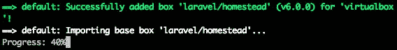
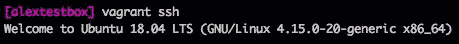

# 发现 Vagrant Boxes - Vagrant Cloud

在本章中，你将全面了解 Vagrant boxes。你将学习什么是 box，以及如何通过我们在前一章中介绍的 Vagrant 命令和子命令来管理它。我们还将学习 Vagrant Cloud，它是一个公共和私有 Vagrant box 的在线目录，供你搜索并安装到系统中，准备好用于你的 Vagrant 环境！

到本章结束时，你将对 Vagrant boxes 和 Vagrant Cloud 有扎实的基础知识。你还将学习以下主题：

+   Vagrant box 的结构

+   如何安装 Vagrant box

+   如何删除 Vagrant box

+   box 版本管理

+   什么是 Vagrant Cloud？

+   如何创建自己的 box（重新打包）

+   如何将自定义 box 上传到 Vagrant Cloud

+   企业级解决方案用于 Vagrant boxes

# 理解 Vagrant boxes

Vagrant box 是一种用于包含 Vagrant 环境的特定包格式。Vagrant box 文件使用 `.box` 文件扩展名。Vagrant box 可以在任何 Vagrant 支持的平台和系统上使用，通过按照 box 文件中的步骤来创建相同的环境。

# Vagrant box 文件结构

Vagrant box 文件由三个组成部分组成：box 文件、box 元数据和 box 信息。这些组件有助于将所需的所有内容打包成一个文件。在使用和安装新 box 时，Vagrant 会使用这些组件中的不同部分来创建正确的环境。让我们深入了解这三大组件，看看它们各自的作用。

# box 文件

box 包含的不同信息取决于提供商。它是特定于提供商的，可能采用不同的格式，如 ZIP、`tar.gz` 或 TAR。Vagrant 不使用这些信息，而是将其传递给提供商。

# box 元数据

box 目录元数据通常用于 Vagrant 云平台。它包含诸如 box 名称、不同版本、描述、不同支持的提供商以及指向特定 box 文件的 URL 等信息。这些元数据通常以 JSON 文档形式存储，文件名为 `metadata.json`。

# box 信息

box 信息是你可以添加的额外细节。这些额外的细节会在用户运行 `vagrant box list --box-info` 命令时显示。你可以设置作者姓名/公司名和 URL。此文件是一个 JSON 文档，文件名通常为 `info.json`。

# 如何安装 Vagrant box

在本节中，你将学习如何安装 Vagrant box。有多种方式可以安装 Vagrant box：

+   一个指向 box 文件的 URL

+   公共 box 名称的简写/别名，如 `debian/jessie64`

+   指向特定目录中 box 的文件路径或 URL

通常，最简单的选项是使用简写，因为它不需要你知道完整的 box URL 或目录 URL。

当一个 Vagrant box 支持多个提供商时，你将可以选择你希望安装的提供商：

您还可以使用`--provider`标志来指定要安装的盒子的提供者版本。Vagrant 提供了易于使用的选项，如前面的截图所示，或者在使用命令行时提供更全面的工具。

# 直接 URL 到盒子文件

使用此选项需要知道完整的盒子文件 URL，并且必须使用`--name`标志，以便 Vagrant 能够引用该盒子。此引用有助于更新和版本管理。

下面是命令的示例：`vagrant box add --name "mybox" http://www.example.com/boxname.box`。

此命令将安装`boxname.box`盒子，命名为`mybox`，并从`www.example.com`域下载。

# 盒子文件的简称/别名

如果您知道盒子的简称/别名名称，使用此方法相对简单直接。

下面是命令的示例：`vagrant box add debian/jessie64`。

此命令将安装 64 位的*Jessie*版本的 Debian 操作系统。您通常可以通过搜索引擎或使用 Vagrant Cloud 平台来查找盒子的简称/别名。

# 指定目录中盒子文件的文件路径或 URL

这种方法与*直接 URL 到盒子文件*部分中提到的第一种方法类似，您可以使用 URL 或文件路径直接下载并安装盒子文件。

下面是命令的示例：`vagrant box add https://app.vagrantup.com/ubuntu/boxes/trusty64`。

此命令将安装 64 位的*Trusty*版本的 Ubuntu。对于此方法，您无需使用`--name`标志，因为 Vagrant 会从盒子元数据和盒子信息文件中获取该信息。

# 如何删除 Vagrant 盒子

在某些时候，您可能需要从系统中删除 Vagrant 盒子。可能有以下几个原因：

+   释放系统空间

+   删除损坏版本

+   删除不再需要的旧版本

无论您的原因是什么，在本节中，您将学习如何删除 Vagrant 盒子。在删除盒子之前，建议您获取正确的名称/格式，以防不小心删除了错误的盒子！

要列出系统上可用的盒子，请运行`vagrant box list -i`命令，该命令将返回系统上已安装的盒子、它们的名称、提供者以及最新版本。使用`-i`标志将提供额外的描述，帮助您选择正确的盒子。

# 删除特定版本的盒子

您可以在不完全删除系统中盒子的情况下，删除特定版本的 Vagrant 盒子。这样可以释放不再使用的旧版盒子占用的空间。

您可以运行`vagrant box prune --dry-run`命令查看系统中过时的盒子版本列表。此命令的输出将显示将保留的盒子（如果您选择运行`prune`命令）以及将被删除的盒子。

下面是前述命令的示例输出：

如果你希望从系统中移除所有过时的盒子，可以运行`vagrant box prune`命令。

要删除特定版本的盒子，你可以运行`vagrant box remove [BOXNAME] --box-version [BOXVERSION]`命令，其中第一个参数是盒子的名称，第二个参数是特定版本。以下是示例输出：

# 删除所有版本的盒子

要删除所有版本的 Vagrant 盒子，你可以运行`vagrant box remove [BOXNAME]`命令，其中第一个参数是盒子的名称。在运行此命令时，你的终端会在删除盒子之前要求确认。

以下是示例输出：

如果你因为某种原因希望直接删除盒子而不需要确认，你可以运行`vagrant box remove [BOXNAME] --force`命令，使用`--force`标志。

# 盒子版本控制

Vagrant 盒子可以有多个版本，可以在你的系统上安装。在前面的章节中，我们讨论了如何`prune`过时的盒子版本以及如何通过特定版本删除盒子。

# Vagrant Cloud

在本节中，我们将重点讨论 Vagrant Cloud。我们将了解它是什么，如何使用它，你可以如何使用它，以及如何在 Vagrant Cloud 中搜索可以安装到你系统上的 Vagrant 盒子。

# 了解 Vagrant Cloud

Vagrant Cloud 是 HashiCorp 的云平台，它允许你搜索、上传和下载 Vagrant 盒子。它允许你创建帐户，并提供三种不同的帐户层级，这些层级结合了免费和付费选项。

# Vagrant Cloud 网站

你可以通过访问[`app.vagrantup.com`](https://app.vagrantup.com)来访问 Vagrant Cloud 网站，尽管它可能会将你重定向到[`app.vagrantup.com/boxes/search`](https://app.vagrantup.com/boxes/search)。

目前有三种不同的定价层级，根据你的需求提供不同的功能。以下是这三种层级：

+   **免费**：此选项提供无限量的公共盒子。

+   **个人**：此选项提供无限量的公共盒子，并且每个私有盒子的费用为每月$5。

+   **组织**：此选项提供无限量的公共盒子，每个私有盒子的费用为每月$25，并且可以与团队共享私有盒子。

选择合适的定价层级，实际上取决于你的使用场景以及你希望如何使用 Vagrant Cloud。你可以从免费层级开始，如果需要，随时升级。

# 在 Vagrant Cloud 上安装 Vagrant 盒子–第一部分，搜索

让我们使用搜索功能来查找可以安装到我们系统上的盒子。搜索功能非常简单，但提供了一些筛选器。你可以访问搜索框：[`app.vagrantup.com/boxes/search`](https://app.vagrantup.com/boxes/search)。

你应该会看到类似以下截图的部分：

Vagrant Cloud 提供三种不同的搜索选项：

+   主要的文本输入区域，你可以在这里输入几乎任何内容 —— box 名称、操作系统、架构以及包含的软件。

+   你可以根据 Provider 进行筛选，例如 virtualbox、vmware 和 docker。如果你没有特别偏好，可以选择任何选项。

+   你还可以根据下载量（总下载次数）、最近创建时间和最近更新时间对结果进行排序。

让我们搜索一个支持 VirtualBox 提供者的 `Laravel`（这是一个 PHP 框架）box，并按下载量排序：

让我们点击第一个结果，查看更多关于该 box 的信息：

此页面包含大量信息，包括 box 版本历史。最新的 box 版本按时间顺序列出，你应该总能看到最新的版本在最上面。

第一部分，标题为 *如何使用此 box 与 Vagrant*，提供了两个关于在系统上安装和使用该 box 的基本示例。默认显示的是 Vagrantfile 标签页，其中显示了可以添加到 Vagrantfile 中的三行内容。第二个标签页，标题为“新建”，展示了如何通过终端命令安装和运行该 box，你可以在这里看到该选项：

让我们来看一下 6.0.0 版本，这是 *当前发布的版本*。你可以看到这个版本的创建时间（在我们的例子中，它是 20 天前创建的），并且提供了一个 GitHub URL，方便你查看该版本的发布信息。

在这一部分，你还可以查看该版本支持哪些提供者以及该 box 的文件大小。在我们的例子中，我们可以看到 6.0.0 版本支持三个提供者：hyperv、vmware_desktop 和 virtualbox。我们可以看到 hyperv 的文件大小是 1.26 GB，而 vmware_desktop 和 virtualbox 的文件大小是 1.38 GB。

# 安装来自 Vagrant Cloud 的 Vagrant box – 第二部分，安装

现在我们已经找到了想要的 Vagrant box，接下来我们将安装并在系统上使用它。我们将使用 `init` 命令创建一个新的 **Vagrantfile** 并安装该 box。

首先创建一个新的空目录，进入该目录，并运行 `vagrant init laravel/homestead` 命令，正如 Vagrant Cloud 网站所描述的那样：

你现在应该能在当前目录中看到一个新的 Vagrantfile，运行 `ls` 命令查看：

让我们来看看 Vagrantfile。我已经使用 Atom 文本编辑器打开了 Vagrantfile。让我们关注前几行（忽略注释部分）：

你可以在第 15 行看到，`config.vm.box` 键已设置为 `laravel/homestead`。这就是 `init` 命令的作用，它创建/初始化一个新的 Vagrantfile，并根据命令的参数设置指定的值。

现在我们可以启动 Vagrant box，这将安装 `laravel/homestead` box。运行 `vagrant up` 命令：

如果你的系统上没有安装该盒子，首先需要下载`.box`文件。这个文件大约是 1.38 GB（根据我们尝试下载的当前版本 6.0.0 在 Vagrant Cloud 网站上的信息）；下载可能需要一些时间，具体取决于你的网络连接和速度。

安装完成后，你应该看到绿色的成功信息，盒子开始导入：

一旦导入，Vagrant 将继续初始化盒子，这将配置网络、SSH 和存储挂载。你可以通过运行`vagrant ssh`命令连接 SSH 来开始实验：

让我们运行一个简单的命令来确保 Vagrant 盒子一切正常。在运行`ssh`命令后，运行`php -v`命令，这将输出系统上安装的 PHP 版本。PHP 应该已安装，因为这是 Laravel 框架的要求之一。你应该看到类似以下的输出：

我们可以看到 PHP 已安装，版本是`7.2.4-1`。如果你想退出 Vagrant 盒子，只需运行`exit`命令。你可以通过运行`vagrant status`查看 Vagrant 盒子的状态，状态值应该是`virtualbox (running)`。你可以通过运行`vagrant halt`命令来停止盒子：

你现在可以再次运行`vagrant status`命令来检查状态：

你可以看到状态已经变更为`poweroff (virtualbox)`。

# 上传 Vagrant 盒子到 Vagrant Cloud

在本节中，你将学习如何创建自己的 Vagrant 盒子，并将该盒子上传到 Vagrant Cloud。你将学习如何将基础盒子打包，以便与 VirtualBox 提供者一起使用。

在继续之前，请在 Vagrant Cloud 平台上创建一个帐户。你可以通过访问[`app.vagrantup.com/account/new`](https://app.vagrantup.com/account/new)来完成此操作，或者访问 Vagrant Cloud 网站并点击菜单中的“Create an Account”链接。

# 创建一个 Vagrant 盒子

在我们能将任何东西上传到 Vagrant Cloud 平台之前，我们需要创建一个盒子。我们的 Vagrant 盒子将是`ubuntu/xenial64`基础盒子的重新打包版本，可以在 Vagrant Cloud 平台上找到。为了简化，我们将仅重新打包这个盒子，并使用不同的名称上传它。

首先，你需要确保你的系统上已经安装了`ubuntu/xenial64`盒子。你可以通过运行`vagrant box list`命令来检查。你可以看到我已经在系统上安装了它，如下图所示：

如果你没有安装它，请运行`vagrant box add ubuntu/xenial64`命令来将盒子安装到你的系统中。

让我们运行这个盒子，确保它能正常工作。运行`vagrant init ubuntu/xenial64`命令生成一个基本的 Vagrantfile，然后运行`vagrant up`命令启动盒子并使其运行。

一旦运行起来，你应该能够通过`vagrant ssh`进入机器。一切应该正常工作，现在我们可以`exit`退出盒子并运行`vagrant halt`命令来停止机器。

现在是时候在 Vagrant Cloud 仪表板中设置 Vagrant 盒子了。登录你的账户并点击“Dashboard”按钮，你应该会看到一个名为“New Vagrant Box”的按钮。点击该按钮，你应该会看到以下屏幕：

名称分为两部分：你的用户名和盒子名称，中间用斜杠分隔。我的盒子将通过`abraunton/alextest`访问，但最好使用更具描述性的名称。除非你有付费账户，否则不能使用私人模式。我建议尽可能添加简短描述。准备好后，点击“Create box”按钮继续。

现在我们需要为这个盒子添加一个版本。让我们从`0.0.1`开始，因为这是我们盒子的第一个版本。你也可以为这个特定版本添加描述：

准备好后，点击“Create version”按钮。现在我们需要为 Vagrant 盒子添加一个提供商。你可以在新版本中点击“Add a provider”按钮来完成：

现在你需要选择这个盒子文件支持的提供商。在这个示例中，我们将继续使用 VirtualBox，并选择“Upload to Vagrant Cloud”选项，因为我们希望直接上传盒子文件：

在继续之前，我们必须将盒子打包成文件。你可以通过在与要打包的盒子所在目录中运行`vagrant package --output alextest.box`命令来实现：

这可能需要几分钟时间，具体取决于你的机器大小。完成后，返回 Vagrant Cloud 页面并点击“Continue to upload”按钮：

选择文件（必须是`.box`文件），上传应该会自动开始。根据你的网络速度，可能需要一些时间。完成后，状态应该会变成“Upload Complete”。

恭喜！你已经成功创建并将 Vagrant 盒子上传到 Vagrant Cloud。你可以通过点击“Dashboard”菜单来查看；这将列出你添加的所有盒子：

你可以看到在“My Vagrant Boxes”部分，我的`abraunton/alextest`盒子已经出现。它显示了我们添加的描述，并且指出没有已发布版本。这意味着该盒子无法下载，但我们可以改变这一点。点击进入该盒子，你应该能看到以下信息：

向下滚动，你应该能看到我们上传的 0.0.1 版本的盒子。点击“Release...”按钮开始发布过程：

现在你会看到一个确认页面，系统会要求你点击“Release version”按钮来完成过程：

现在你应该看到一个绿色的成功发布消息。恭喜你！你已经将第一个 Vagrant box 公布到 Vagrant Cloud：

现在进行真正的测试；让我们检查一下确保我们的 box 可用，并且可以在系统上安装和运行它。运行`vagrant init abraunton/alextest --box-version 0.0.1`命令：

这将生成一个 Vagrantfile，指示 Vagrant 使用 abraunton/alextest box 和特定版本 0.0.1。接下来，运行`vagrant up`命令。这将从 Vagrant Cloud 安装我们的 box，并创建我们的环境：

如果你的 box 可用并且有发布版本，你应该能够成功下载它。如果一切顺利，你应该在终端中看到这条绿色的消息：

Vagrant box 现在应该已经启动并运行，让我们使用`vagrant ssh`进入 box，看看有什么内容。SSH 连接后，你应该看到 Ubuntu 欢迎信息。没错，因为我们重新打包了一个 Ubuntu box：

恭喜！你已成功从 Vagrant Cloud 安装并运行了你的 Vagrant box。你现在可以停止机器、删除 box 或进行实验。祝你玩得开心！

# 企业级 Vagrant box 解决方案

如果你在寻找更多企业级的解决方案来托管和管理你的 boxes，现有一些服务可以满足你的需求。

这些服务提供的产品和功能包括：

+   Box 托管

+   Box 版本管理

+   私有 box 访问与安全性

+   离线 box 访问的本地仓库

+   高级/智能搜索

这种类型的服务的一个例子是**Artifactory**，由 JFrog 开发。Artifactory 是一个二进制工件管理工具。Artifactory 允许你以安全的方式托管、管理和版本化 Vagrant boxes。它们对安全的关注通常吸引那些可能需要托管敏感数据的企业客户。

Artifactory 提供一种通过使用本地仓库的现场托管方式。它仍然允许你在组织内部的员工和团队之间共享访问。这些仓库如果需要共享到本地网络外部，还可以克隆到其他 Artifactory 服务。

根据你的需求和公司规定，这种解决方案可能值得考虑。Vagrant Cloud 是一个值得考虑的优秀服务。

# 总结

在本章中，我们涵盖了 Vagrant boxes 的许多方面。我们了解了 Vagrant box 是什么，box 的构成，如何安装 box，如何删除 box，box 版本管理，以及我们自己创建了（重新打包的）box 并将其上传到 Vagrant Cloud。然后，我们从 Vagrant Cloud 安装了该 box，并在我们的系统上进行了测试。

在第五章，*使用 Vagrantfile 配置 Vagrant*中，我们将重点讨论 Vagrantfile。我们之前简要提到过这个文件，但还没有充分利用它的潜力。Vagrantfile 用于配置 Vagrant，并提供了一种非常强大且易于使用的语法。你将学习如何创建 Vagrantfile，如何验证它，以及它所使用的语法。
