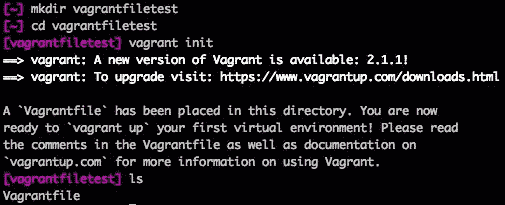
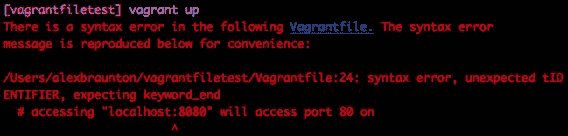
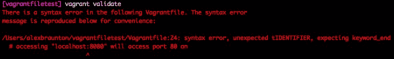
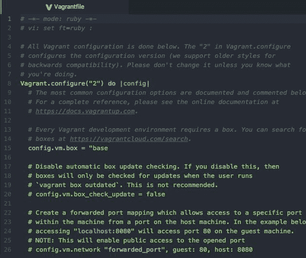
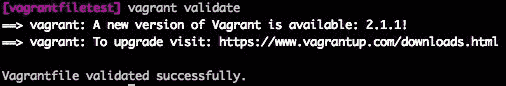

# 第五章：使用 Vagrantfile 配置 Vagrant

在本章中，我们将重点介绍如何通过使用 Vagrantfile 来配置 Vagrant。我们将关注 Vagrantfile 的关键方面，如其结构和语法。在本节结束时，我们将涵盖以下主题：

+   理解 Vagrantfile

+   创建 Vagrantfile

+   Vagrantfile 的结构和语法

+   排查 Vagrantfile 问题

# 理解 Vagrantfile

Vagrantfile 是配置 Vagrant 环境的主要方式。这个文件没有扩展名；它只是作为`Vagrantfile`出现在您的系统上，而不是`.Vagrantfile`或`vagrantfile.Vagrantfile`。

使用 Vagrantfile 可以管理 Vagrant 环境的依赖和设置。最好每个 Vagrant 项目有一个 Vagrantfile，并将 Vagrantfile 包含在源代码管理中。

使用 Vagrantfile 的主要好处之一是能够将该文件与任何安装了 Vagrant 的开发人员共享。他们只需运行`vagrant up`命令，就能拉取任何依赖项，如 boxes，并设置任何配置，使 Vagrant 环境与您的一致。

# 创建 Vagrantfile

在我们创建自己的 Vagrantfile 之前，首先创建并进入一个新的目录。在这个示例中，我们将创建一个名为`vagrantfiletest`的新目录，简化操作！按照以下顺序运行命令：

1.  `mkdir vagrantfiletest`

1.  `cd vagrantfiletest`

1.  `vagrant init`

通过使用`vagrant init`命令，我们已经在当前的`vagrantfiletest`目录中初始化了一个新的 Vagrantfile，如下图所示：



默认的 Vagrantfile 有一个基本结构，可以帮助您入门。如果您希望创建一个非常简洁的 shell，您可以运行`vagrant init --minimal`或`vagrant init -m`命令，任一命令将生成一个非常基础的 Vagrantfile，没有注释或额外设置，如下所示：

```
Vagrant.configure("2") do |config|
 config.vm.box = "base"
 end
```

现在让我们继续进入下一部分，深入了解 Vagrantfile 的语法。

# Vagrantfile 语法

Vagrantfile 使用 Ruby 语言语法，但不需要了解 Ruby。使用 Vagrantfile 时，它是一种简单、表达力强且易于理解的语言。在大多数情况下，您只需设置一个变量和一个值，例如`config.vm.box = "ubuntu/trusty64"`，该设置将 box 设置为`ubuntu/trusty64`，即 64 位版本的 Ubuntu 14.04。

一个 Vagrantfile 的配置包含在`configure`块中。第一行是`Vagrant.configure("2") do |config|`，最后一行是`end`。在这个块内，我们可以定义各种值，例如 Vagrant box、网络、文件系统、配置和更多。

# Vagrantfile 选项

在本节中，我们将介绍 Vagrantfile 中可配置的各个部分。你将学习如何直接配置虚拟机、配置提供者（VirtualBox），以及配置 Vagrant 如何通过 SSH 或其他通信工具连接到你的机器。

# Vagrant 机器配置（config.vm）

使用 `config.vm` 命名空间，我们将查看配置 Vagrant 机器的某些部分，如 box 信息和其他设置，包括同步文件夹、配置和提供者。可配置的元素如下：

+   `config.vm.boot_timeout` 用于指定（以秒为单位）Vagrant 等待机器启动并准备好使用的时间。默认时间为 300 秒。

+   `config.vm.box` 用于为机器设置特定的 box。你可以引用已经安装在系统上的 box，或者使用 Vagrant 云中的简写语法，如 `ubuntu/trusty64`。

+   `config.vm.box_check_update` 被 Vagrant 用来检查你选择的 box 或当前机器正在使用的 box 是否是最新的。默认设置为 `true`，但只有某些类型的 box 可以检查更新——主要是 Vagrant 云上的 box。如果在 Vagrant 启动过程中发现更新，屏幕上会显示黄色消息提示用户。

+   `config.vm.box_download_checksum` 用于比较 box 的校验和与给定的校验和；如果它们不匹配，则会抛出错误。Vagrant 仅在需要下载 box 时执行此检查。此值需要设置 `config.vm.box_download_checksum_type` 的值。

+   `config.vm.box_download_checksum_type` 是在比较 `config.vm.box_download_checksum` 值使用的校验和哈希类型。这里有几个支持的选项，分别是 `md5`、`sha1` 和 `sha256`。

+   `config.vm.box_download_client_cert` 用于提供在下载 box 时使用的客户端证书路径。此设置没有默认值。

+   `config.vm.box_download_ca_cert` 用于提供直接下载 box 时使用的 CA 证书包的路径。默认值使用 Mozilla CA 证书包。

+   `config.vm.box_download_ca_path` 用于提供在直接下载 box 时包含 CA 证书的目录路径。类似地，默认使用的值是 Mozilla CA 证书包。

+   `config.vm.box_download_insecure` 用于验证服务器的 SSL 证书。如果设置为 `true`，则不进行验证。如果 box 的 URL 是 HTTPS，则会验证 SSL 证书。

+   `config.vm.box_download_location_trusted` 用于在值设置为 `true` 时信任所有重定向。默认过程中，Vagrant 会信任初始请求，并使用任何指定的凭据。

+   `config.vm.box_url` 用于设置特定的盒子 URL。这类似于 `config.vm.box`，但不支持 Vagrant 云的简写语法，如果在 Vagrantfile 中已设置 `config.vm.box`，则无需在此处指定值。指定的值可以是单个 URL 或多个 URL，Vagrant 会按顺序尝试这些 URL。如果您已经配置了其他设置（如证书），它们将应用于所有提供的 URL。Vagrantfile 也支持使用 `file://` 缩写和方案来指定本地文件。

+   `config.vm.box_version` 用于指定要使用的盒子版本。此值支持以逗号分隔的约束条件，例如 (大于或等于) >= 0.2 和 < 2.0（小于），Vagrant 会在这些约束范围内查找盒子版本。Vagrant 将尽力获取符合这些约束条件的最新盒子版本。默认值为 >= 0，表示使用最新版本。

+   `config.vm.communicator` 用于设置连接到来宾机器的通信类型。默认值为 `ssh`，但建议 Windows 客户端使用 `winrm`。

+   `config.vm.graceful_halt_timeout` 用于设置 Vagrant 等待机器停止的时间（单位为秒）。当使用 `vagrant halt` 命令时应用此设置，默认值为 60 秒。

+   `config.vm.guest` 用于设置将运行在机器中的来宾操作系统。Vagrant 会尝试自动检测使用的正确操作系统。这些信息对于执行某些操作系统特定的操作（如网络配置）是必要的。默认值为 `:linux`。

+   `config.vm.hostname` 用于为机器设置主机名。值应作为字符串提供，例如 `elite`。默认值为 `nil`，这意味着 Vagrant 不会管理主机名。如果这是一个提供者，它将在启动时设置该主机名。

+   `config.vm.network` 用于设置机器的网络选项。这个设置有很多可用选项，稍后的章节中会详细讲解。其中一些主要选项包括 `forwarded_port`、`private_network` 和 `public_network`。每个选项有各种子值或子选项可以设置。

+   `config.vm.post_up_message` 用于在运行 `vagrant up` 命令后显示一条消息给用户。这类似于服务器或其他软件上找到的每日消息，您可以登录查看。

+   `config.vm.provider` 是一个配置块，用于设置特定于提供者的值。每个提供者支持不同的值，但可以有多个配置块针对不同的提供者。由于我们使用 VirtualBox 作为提供者，可以设置特定的值，例如 `memory`（设置内存）、`cpus`（设置 CPU 核心数）和 `gui`（当设置为 `true` 时，Vagrant 会在 GUI 中打开虚拟机，您可以与其交互）。

+   `config.vm.provision` 用于指定一个配置器，它可以在创建过程中安装和配置软件。这是一个相当高级的话题，我们将在后续章节中讨论。支持的某些提供程序包括 Chef、Ansible、Puppet 和标准脚本。

+   `config.vm.synced_folder` 用于配置主机和来宾机器之间的同步文件夹。这将允许你在系统上（在同步文件夹中）创建或编辑文件，并使该更改在 Vagrant 机器中生效并可见。

+   `config.vm.usable_port_range` 用于指定 Vagrant 可用的端口范围。默认值或端口范围为 `220..2250`。Vagrant 会使用这些值来处理发生的任何端口冲突。

# Vagrant SSH 配置（config.ssh）

使用 `config.ssh` 命名空间，我们将配置 Vagrant，使其通过 SSH 连接到来宾机器。在这里，我们将查看一些值，如 SSH 用户名、密码、端口和密钥，如下所示：

+   `config.ssh.username` 用于设置 Vagrant 在尝试通过 SSH 连接时使用的用户名。默认用户名为 `vagrant`。

+   `config.ssh.password` 用于设置 Vagrant 在尝试通过 SSH 连接时使用的密码。

+   `config.ssh.host` 用于设置在 SSH 连接时使用的主机名或 IP 地址。默认情况下，这个值通常为空，因为提供者可以自动检测正确的值。

+   `config.ssh.port` 用于设置用于 SSH 连接的端口。默认值为 22。

+   `config.ssh.guest_port` 用于设置在来宾机器上运行 SSH 的端口号。Vagrant 可以将此与 `config.ssh.port` 一起使用，以智能地连接到正确的 SSH 端口。如果存在转发端口，通常会使用此设置。

+   `config.ssh.private_key_path` 用于设置连接机器时要使用的私钥路径。默认值是一个不安全的密钥，Vagrant 和许多公共箱子都使用这个密钥。

+   `config.ssh.keys_only` 用于在希望使用 Vagrant 提供的 SSH 密钥时使用。默认设置为 `true`。

+   `config.ssh.verify_host_key` 用于执行主机密钥验证。默认值为 `false`。

+   `config.ssh.forward_agent` 用于启用 SSH 的代理转发。默认值为 `false`。

+   `config.ssh.forward_x11` 用于启用通过 SSH 转发 X11。默认值为 `false`。

+   `config.ssh.forward_env` 用于向来宾机器提供一组主机环境变量。

+   `config.ssh.insert_key` 在设置为 `true`（根据默认设置）时用于插入一个新的密钥对，以便与 SSH 一起使用，替代不安全的默认 Vagrant 密钥对。当设置为 `true` 时，该值也会与 `config.ssh.password` 选项一起使用。

+   `config.ssh.proxy_command` 用于通过 `stdin` 通过 SSH 代理一个命令行命令。

+   `config.ssh.pty` 不建议使用，除非你真的需要使用它。设置为 `true` 时，将使用 `pty` 进行配置。`pty` 可能会破坏 Vagrant 的某些功能，因此使用时要小心。

+   `config.ssh.keep_alive` 在设置为 `true` 时，将每 5 秒通过 SSH 发送保持连接的包，以保持连接活跃。

+   `config.ssh.shell` 用于设置在 Vagrant 中运行 SSH 命令时使用的 shell。

+   `config.ssh.export_command_template` 是生成活动会话中的环境变量时使用的模板。

+   `config.ssh.sudo_command` 用于设置运行 `sudo` 命令时的命令。默认值为 `sudo -E -H %c`，其中 `%c` 被替换为要运行的命令。

+   `config.ssh.compression` 用于在通过 SSH 连接时发送压缩设置，如果设置为 `true`。要禁用此功能，将值设置为 `false`。

+   `config.ssh.dsa_authentication` 用于在通过 SSH 连接时发送 DSA 身份验证设置，如果设置为 `true`。要禁用此功能，将值设置为 `false`。

+   `config.ssh.extra_args` 用于将额外的命令传递到 SSH 可执行文件中。它支持单个值或一个值的数组。通过此设置，可以启用 SSH 的更多高级操作，如反向隧道。

# Vagrant 设置（config.vagrant）

使用 `config.vagrant` 命名空间，我们将专门看一下如何配置 Vagrant。与我们已经看过的其他命名空间相比，这个命名空间中的选项并不多。`config.vagrant` 命名空间的命令如下：

+   `config.vagrant.host` 用于设置运行 Vagrant 的主机。默认值为 `:detect`，允许 Vagrant 智能地自动检测主机。Vagrant 提供的某些功能是特定于主机的，只有在自动检测失败时才建议更改此值。

+   `config.vagrant.sensitive` 用于提供一个不在 Vagrant 输出或日志输出中显示的项目列表或数组。这些值通常是密码或密钥。

# 其他 Vagrantfile 设置

还有两个其他的命名空间设置可以在 Vagrantfile 中进行配置。虽然本书不会详细讲解这些设置，但以下章节将概述它们。

# WinRM 设置（config.winrm）

`config.winrm` 命名空间用于在使用 Windows 客户机时配置 Vagrant。要使用这些设置，必须将 `config.vm.communicator` 设置为 `winrm`。

有大约 12 个不同的配置选项可用，包括 `config.winrm.username`、`config.winrm.password`、`config.winrm.port` 和 `config.winrm.transport`。使用 `config.winrm` 命名空间可以让你对使用 Windows 客户机时 Vagrant 的行为有更多控制。

# WinSSH 设置（config.ssh 和 config.winssh）

这使用了`config.ssh`命名空间，类似于我们之前讨论的命名空间。它使用了 WinSSH 软件，这是 OpenSSH 的 Windows 原生版本。Vagrant 的官方文档指出，WinSSH 处于*预发布*阶段，因此尚未准备好生产环境使用。

有大约 17 个不同的选项可用，它们是`config.ssh`和`config.winssh`命名空间的组合，包括：`config.ssh.username`、`config.ssh.password`、`config.winssh.forward_agent`、`config.winssh.upload_directory`以及`config.winssh.export_command_template`。

# 排查 Vagrantfile 的错误

Vagrantfile 可以是一个相当复杂的配置选项集合。它包含多个选项，如基本的字符串值、配置块、数组值等等。编写完 Vagrantfile 后，运行`vagrant up`或类似命令时遇到错误是非常常见的。

运行`vagrant up`命令后，Vagrant 错误的一个示例如下：



让我们分析前面截图中的错误。第一个线索是指向行号`Vagrantfile:24`，换句话说，就是 Vagrantfile 的第 24 行。这个错误还给出了错误的类型：`syntax error, unexpected tIDENTIFIER, expecting keyword_end # accessing "localhost:8080" will access port on`。这可能意味着某个配置块或循环没有设置结束值，或者我们尝试设置了一个不完整的变量。

在对 Vagrantfile 进行任何更改并尝试运行或配置 Vagrant 虚拟机后，检查 Vagrantfile 的一个简单方法是使用`vagrant validate`命令。在下面的截图中，您可以看到即使使用`vagrant validate`命令，我们仍然会收到相同的错误和 Vagrant 的输出：



现在让我们打开 Vagrantfile，仔细查看第 24 行，如下图所示：



查看第 24 行，我们可以看到错误中提到的值# `accessing "localhost:8080" will access port 80 on`。现在，虽然这只是一个注释，但我们可以看到`localhost:8080`的值被暴露出来，因为它被双引号（`"`）包裹。如果我们回溯到文件的开头，我们应该能找到第 15 行，它看起来有点奇怪。这里，我们看到的值是`config.vm.box = "base`，但没有关闭的双引号。

所以，让我们在这一行的末尾加上一个双引号，保存文件，并运行`vagrant validate`命令：



太好了！正如您在前面的截图中看到的，我们成功找到了错误并已修复。

# 总结

在本章中，我们学习了如何使用 Vagrantfile 配置 Vagrant。我们还查看了 Vagrantfile 的各个部分，例如如何创建它、它支持的命令、选项和值、它的语法和布局，以及如何在出现问题时进行故障排除。在接下来的章节中，我们将更多地使用 Vagrantfile，重点关注 Vagrant 的特定领域，如配置。

在第六章，*Vagrant 中的网络配置*，我们将了解 Vagrant 中的网络配置。在这一章中，我们将学习三种主要的网络配置类型：端口转发、公共网络和私有网络。
