# 第六章：Vagrant 中的网络

在本章中，我们将重点讲解 Vagrant 中的网络。到本章结束时，你将对 Vagrant 中不同的网络选项有一个清晰的了解。你将能够使用简单的方法（如端口转发）来配置 Vagrant 中的网络，或者使用公共和私有网络设置自定义 IP 地址。

以下是 Vagrant 中存在的三种网络类型，你将在本章中学习到：

+   端口转发

+   私有网络

+   公共网络

# 端口转发

配置 Vagrant 中的网络设置有一个强大而简单的方法——使用端口转发。这不需要你具备任何高级知识或配置。

端口转发是将宿主机上的端口链接到客机上的端口。操作就是这么简单，但它可以非常强大，因为它允许你快速启动和运行。

以下是配置端口转发的步骤：

1.  打开我们的 Vagrantfile。我们将从一个非常基础的 Vagrantfile 开始，使用`ubuntu/xenial64`盒子和一个基本的 shell 配置脚本来安装 nginx 网页服务器：

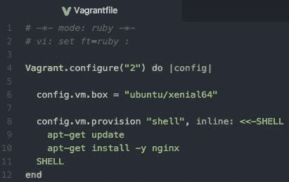

1.  保存 Vagrantfile 后，运行`vagrant up`命令：

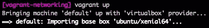

1.  一旦盒子安装完 nginx 并启动运行，打开浏览器并尝试访问`localhost:8080`：

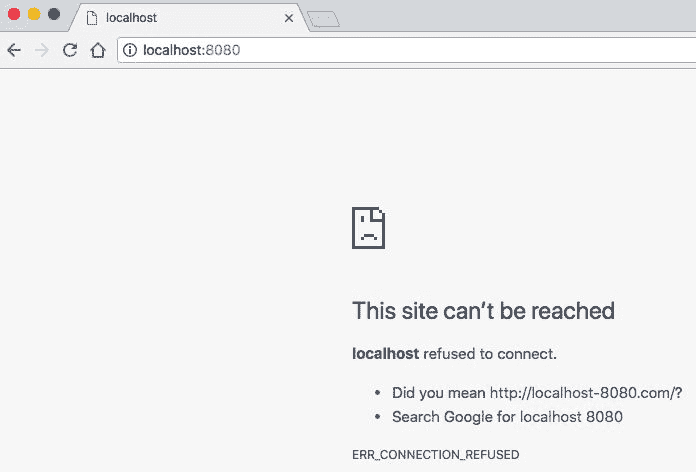

1.  nginx 应该可以访问（可能不在`port 8080`端口），但如你所见，我们无法访问它。这是因为我们还没有设置端口转发。如果我们从 Vagrant 机器内部访问 localhost，就能正常访问。

1.  运行`vagrant ssh`命令。进入 Vagrant 机器后，运行`curl localhost`命令。此时应返回 nginx 的默认页面 HTML 代码：

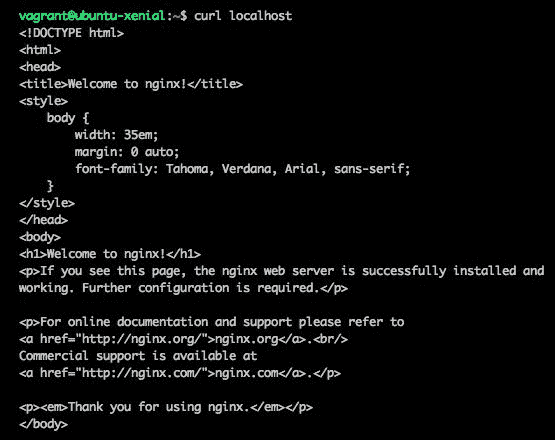

1.  设置端口转发，以便我们能够从宿主机（Vagrant 外部）访问该页面。

1.  退出机器并重新打开 Vagrantfile。在以下代码中（你可以在以下截图的第 8 行看到）– `config.vm.network "forwarded_port", guest: 80, host: 8080`：

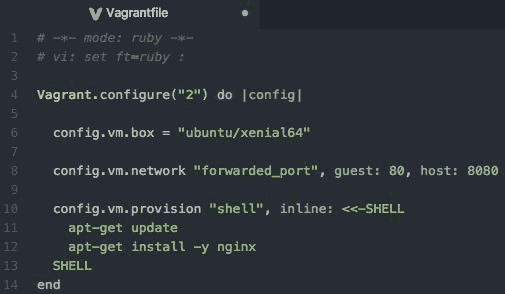

让我们来逐步分析我们刚刚在 Vagrantfile 中添加的那行代码。首先，我们调用了`config.vm.network`命名空间，告诉 Vagrant 我们想要更改网络设置。我们传递的第一个参数是`forwarded_port`，后面跟着两个不同的端口号。第一个端口是我们将在客机/Vagrant 机器内部访问的端口。在上面的示例中，我们将访问端口 80，这通常是网站/网页服务器的默认端口。最后一个参数是宿主机端口，这是我们从宿主机连接到的端口。在我们的示例中，它是`8080`，通过 URL 我们可以在`http://localhost:8080`访问它，这将连接到 Vagrant 并访问机器的`port 80`。

1.  保存 Vagrantfile 并运行`vagrant reload --provision`命令。

1.  这将重启 Vagrant 虚拟机并强制重新执行配置过程。你会看到，在以下屏幕截图的底部，现在已经包含了我们新端口的 `default: Forwarding ports...` 部分：

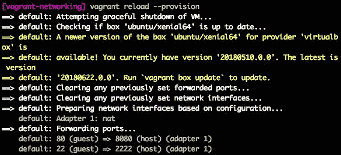

1.  一旦 Vagrant 虚拟机完成配置并启动，尝试在浏览器中打开 `localhost:8080`：

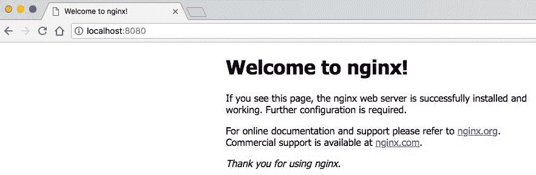

你应该看到 "Welcome to nginx!" 默认页面。恭喜！你已经成功配置了 Vagrant 虚拟机的端口转发。

# 端口转发注意事项

在 Vagrantfile 中使用端口转发选项时，有一些技巧可以帮助你。

如果你希望转发多个端口，只需创建新的一行并添加新的 guest/host 端口。如果需要管理很多端口，可能会显得有些混乱。此时，你可能需要考虑本章后面介绍的公共和私有网络选项。

你可以使用更多的选项/参数来配置此设置：

+   `auto_correct`：用于端口冲突处理。如果设置为 `true`，Vagrant 会检查是否与已使用的端口发生冲突。如果发现冲突，Vagrant 会自动更改端口号。

+   `guest_ip`：你希望绑定到转发端口的虚拟机的 IP 地址。

+   `host_ip`：你希望绑定到转发端口的主机的 IP 地址。

+   `protocol`：通过转发端口允许的协议。你可以选择 `udp` 或 `tcp` 作为选项。

+   `id`：在 VirtualBox 中可见的规则名称。它的格式为 *[protocol][guest]*，例如 `udp111`。

这些参数是可选的。然而，你必须指定 `guest` 和 `host` 端口值。

# 私有网络

私有网络允许将你的 Vagrant 虚拟机分配并通过私有地址空间 IP 地址进行访问。一个私有 IP 地址的例子可能是你在本地网络中见过的，如 `192.168.1.2`。

使用这种方法可以比端口转发方法提供更少的限制，因为默认情况下，你可以访问该本地 IP 地址上的任何可用端口。

要使用私有网络，有两种主要选项。你可以允许 IP 地址由 **动态主机配置协议** (**DHCP**) 自动分配，或者你可以手动添加静态 IP 地址。

# DHCP

按照以下步骤使用 DHCP 选项：

1.  你必须选择 `dhcp` 作为 `type` 参数的值。在你的 Vagrantfile 中，添加以下行来启用 DHCP 私有网络：

```
config.vm.network "private_network", type: "dhcp"
```

1.  保存 Vagrantfile 后，你可以运行 `vagrant up --provision` 来查看更改：

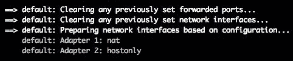

1.  要查找新启动的 Vagrant 虚拟机的 IP 地址，我们必须通过 SSH 进入虚拟机本身。

1.  运行 `vagrant ssh` 命令。进入 Vagrant 虚拟机后，运行 `ifconfig` 命令（此网络命令依赖于操作系统）。以下是示例输出：

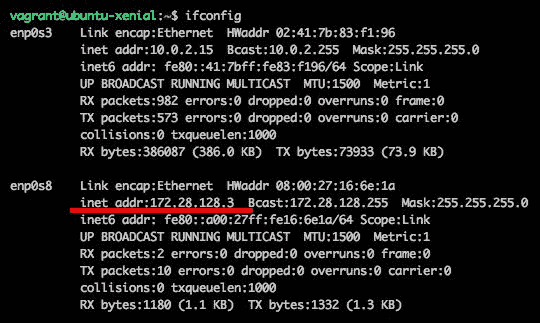

1.  在`enp0s8`部分，您可以看到以`inet addr:`开头的红色下划线数值。这是我们的 Vagrant 机器正在使用的私有 IP 地址。该数值为`172.28.128.3`。让我们看看是否现在可以通过此 IP 地址访问该机器。

1.  在主机机器上打开 Internet 浏览器，输入在 Vagrant 机器内返回的 IP 地址。

您应该仍然在 Vagrant 机器内运行`port 80`上的 nginx，以查看结果。

1.  以下是我导航到该私有 IP 地址并查看从 Vagrant 机器内部提供的 nginx Web 服务器默认页面的示例：

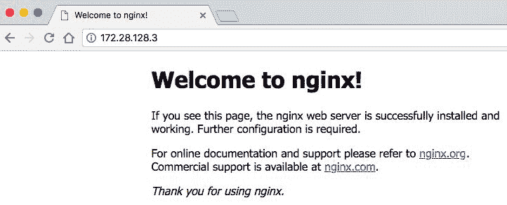

# 静态 IP

要使用静态 IP 选项：

1.  将一个私有地址空间 IP 地址作为`ip`参数的值。在您的 Vagrantfile 中，添加以下行以启用静态 IP 私有网络：

```
config.vm.network "private_network", ip: "10.10.10.10"
```

1.  当您保存 Vagrantfile 后，请运行`vagrant up --provision`以强制更改。为确认更改已生效，请在主机机器上的 Internet 浏览器中输入`10.10.10.10` IP 地址，查看是否显示 nginx 主页：

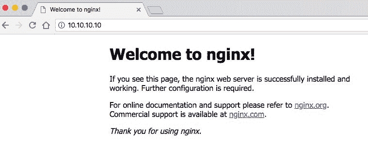

1.  您还可以`vagrant ssh`进入机器，运行`ifconfig`命令（这取决于操作系统），并查找返回值中的该 IP 地址：

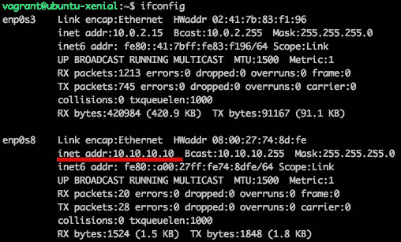

1.  在使用（静态 IP）选项与私有网络时，您可以提供一个可选参数。`auto_config`参数允许您启用或禁用自动配置。如果希望手动配置网络接口，可以使用`false`值将其禁用：

```
config.vm.network "private_network", ip: "10.10.10.10", auto_config: false
```

我发现在某些情况下，有时必须禁用`auto_config`才能使静态 IP 地址正常工作。

# IPv6

您还可以在 Vagrantfile 中使用类似格式指定 IPv6 地址：

```
config.vm.network "private_network", ip: "fd12:3456:789a:1::1"
```

使用 IPv6 地址不受 DHCP 选项支持，必须由主机机器/网络适配器支持。值得一提的是，IPv6 的默认子网是`/64`。

# 公共网络

Vagrant 中的公共网络可能是一个令人困惑的概念。本质上，它是私有网络，但 Vagrant 将尝试允许从主机机器外部访问（如果您的提供商和机器允许），而不仅仅允许从主机机器内部访问。

通过执行以下步骤，您应该能够通过本地网络上的另一设备的 IP 地址访问您的 Vagrant 机器。确保已安装 nginx，以便在成功通过 HTTP 连接到 IP 地址时获得通知。我已经能够在同一本地网络上使用我的智能手机查看 nginx 默认页面。如果使用`private_networking`选项，则此操作将无效，我的智能手机将无法加载页面或找到设备，这将导致超时。

有两种设置公共网络的主要方式：您可以使用 DHCP 或手动分配静态 IP 地址。

# DHCP

开始使用公共网络的最快和最简单的方法是允许 DHCP 为 Vagrant 虚拟机分配 IP 地址：

1.  在你的 Vagrantfile 中，使用`config.vm.network "public_network"`来启动它。

不需要像在私有网络的 DHCP 配置中那样指定`type`参数。

1.  运行`vagrant up --provision`命令启动 Vagrant 虚拟机。由于我们使用的是公共网络，你将被提示选择一个桥接网络接口。根据你的需求和可能的试错过程，选择一个。我将选择第一个选项，`1) en0: (Wi-Fi) Airport`：

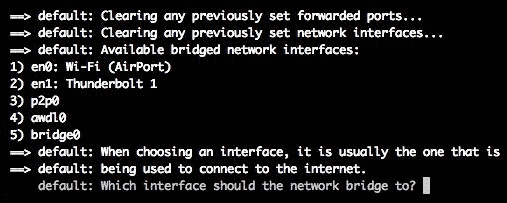

1.  要找出新启动的 Vagrant 虚拟机的 IP 地址，我们必须 SSH 进入虚拟机本身。运行`vagrant ssh`命令。进入 Vagrant 虚拟机后，运行`ifconfig`命令（这个网络命令将根据操作系统有所不同）。

使用 DHCP 时可以提供一个可选参数。这是*DHCP 分配的默认路由*。在某些情况下，这个选项可能是必需的。

1.  这个参数的示例可以是将`config.vm.network "public_network", use_dhcp_assigned_default_route: true`添加到你的 Vagrantfile 中。

# 静态 IP

配置你选择的静态 IP 地址与公共网络结合使用非常简单。你只需要在 Vagrantfile 中提供`ip`参数，并添加你希望使用的 IP 地址。以下是我 Vagrantfile 中的配置示例：

```
config.vm.network "public_network", ip: "192.168.1.123"
```

保存你的 Vagrantfile 并运行`vagrant up --provision`命令，启动 Vagrant 虚拟机。由于我们使用的是公共网络，你将被提示选择一个桥接网络接口。根据你的需求和可能的试错过程来选择一个。我将选择第一个选项，`1) en0: (Wi-Fi) Airport`：


# 网络桥接

正如你在公共网络 DHCP 和静态 IP 地址中看到的，当你运行`vagrant up`或`vagrant up --provision`命令时，系统会要求你选择使用哪个网络桥接。为了避免这一步，你可以在 Vagrantfile 中提供默认的网络桥接作为额外参数：`config.vm.network "public_network", bridge: "en0: Wi-Fi (AirPort)"`。

# 摘要

在本章中，我们讨论了如何配置和管理 Vagrant 中的网络设置。我们重点介绍了三种主要的网络类型：端口转发、私有网络和公共网络。你现在应该能够根据你的网络需求配置 Vagrant。

在第七章《多机配置》中，我们将介绍 Vagrant 的多机功能。这个酷炫的功能允许我们从一个 Vagrantfile 配置中配置并管理多个 Vagrant 虚拟机。我们将创建一个真实世界的场景，其中有多台 Vagrant 虚拟机——一台作为负载均衡器，分发 HTTP 流量到两台 Vagrant 虚拟机上，其中一台作为 Web 服务器。
