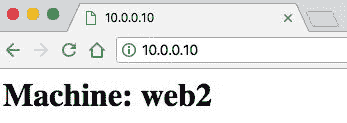

# 多机器

在本章中，您将了解 Vagrant 的多机器功能。我们将通过多机器的各个方面，最终您应该能很好地理解以下主题：

+   Vagrant 多机器简介

+   在 Vagrantfile 中配置多机器

+   通过网络连接多机器

# Vagrant 多机器简介

使用 Vagrant 的多机器功能，您可以轻松管理一个 Vagrantfile 中的多个 Vagrant 机器。如果您希望将测试环境的模型与生产环境类似，这将非常有用。您可以轻松地将服务器分离，例如 Web 服务器、文件服务器和数据库服务器。

在本节中，我们将通过以下两个用例来了解如何使用多机器：

+   在第一个用例中，我们将管理三个 Vagrant 机器。在这里，我们将创建一个基本的负载均衡设置，其中一台机器将在两台提供网站服务的机器之间分配流量。

+   在第二个用例中，我们将管理两台 Vagrant 机器。我们将创建一台提供网站的机器和另一台运行 MySQL 数据库的机器。Web 机器将与数据库机器通信，以在网页上显示数据。

# 使用 Vagrant 多机器进行负载均衡

在本节中，我们将使用 nginx 作为 HTTP 负载均衡器，将流量分配到两台 nginx Web 机器之间。我们将使用轮询方法进行负载均衡，该方法均匀分配传入的流量。

首先，让我们设置我们的 Vagrantfile，包含这三台机器，然后使用 Ubuntu 16.04 64 位操作系统安装 nginx。

为了开始，让我们通过运行`vagrant init -m`命令来创建一个最小化的 Vagrantfile。之后，让我们编辑 Vagrantfile，并按如下方式创建三个配置区域：

```
Vagrant.configure("2") do |config|
    # Configure load balancer machine
     config.vm.define "lb1" do |lb1|
    end
    # Configure first web machine
     config.vm.define "web1" do |web1|
     end
    # Configure second web machine
     config.vm.define "web2" do |web2|
    end
 end
```

现在我们的 Vagrantfile 应该包含主要的`|config|`块，该块封装了所有代码和其中的三个`define`块。Vagrant 中的多机器设置非常简单；您只需定义一个新机器，然后在该块中配置该机器即可。

定义新块时，您必须为新机器指定一个名称，该名称将在配置过程中成为其引用。我设置的第一台机器命名为`lb1`，即负载均衡器 1。这种命名约定在处理大型 Vagrantfile 和多台机器时非常有用；当团队中多位开发人员使用和查看 Vagrantfile 时，它也很有帮助。

要定义一个新机器，请输入以下两行代码：

```
config.vm.define "lb1" do |lb1|
 end
```

这台机器现在已经准备好进行配置！如果我们运行`vagrant up`，什么也不会发生，因为该盒子没有值——没有盒子、网络、配置或文件处理。

让我们通过设置一个盒子和一个 IP 地址来开始配置我们的负载均衡器机器。可以通过访问`lb1`命名空间，在我们的配置块中进行配置，如下所示：

```
config.vm.define "lb1" do |lb1|
     lb1.vm.box = "ubuntu/xenial64"
     lb1.vm.network "private_network", ip: "10.0.0.10"
 end
```

如前面的示例所示，我们已经设置了`lb1.vm.box`和`lb1.vm.network`的值。现在我们为两个 Web 机器做相同的配置，但设置不同的 IP 地址，以便我们能够单独访问它们并避免冲突，具体如下：

```
 config.vm.define "web1" do |web1|
     web1.vm.box = "ubuntu/xenial64"
     web1.vm.network "private_network", ip: "10.0.0.11"
 end
 config.vm.define "web2" do |web2|
     web2.vm.box = "ubuntu/xenial64"
     web2.vm.network "private_network", ip: "10.0.0.12"
 end
```

我们现在已经配置了三个 Vagrant 机器，但在我们启动并测试它们之前，我们需要为它们配置 nginx 并设置 nginx 以支持我们的负载均衡设置。

让我们创建两个 shell 脚本来配置我们的机器。（我们将在后续章节中更深入地讲解 shell 脚本；这里我们使用它来展示它如何在多机器环境中工作。）

在你`Vagrantfile`所在的目录下，创建一个`lb.sh`文件和一个`web.sh`文件。

# lb.sh

让我们先关注`lb.sh`文件。将以下行添加为该文件的内容：

```
#!/bin/bash
echo 'Starting Provision: lb1'
 sudo apt-get update
 sudo apt-get install -y nginx
 sudo service nginx stop
 sudo rm -rf /etc/nginx/sites-enabled/default
 sudo touch /etc/nginx/sites-enabled/default
 echo "upstream testapp {
     server 10.0.0.11;
     server 10.0.0.12;
 }
server {
     listen 80 default_server;
     listen [::]:80 default_server ipv6only=on;
    root /usr/share/nginx/html;
     index index.html index.htm;
    # Make site accessible from http://localhost/
     server_name localhost;
    location / {
         proxy_pass http://testapp;
     }
}" >> /etc/nginx/sites-enabled/default
 sudo service nginx start
 echo "Machine: lb1" > /var/www/html/index.html
 echo 'Provision lb1 complete'
```

上面的代码片段包含了很多内容，我们来逐一分析。

在第一部分，我们声明了应该运行此脚本的程序位置（`bin`/`bash`），这在 shebang（`#!`）之后。

在第 2 到第 7 行，我们正在更新 Ubuntu、安装 nginx 并删除默认的 nginx 配置文件。

在第 8 到第 22 行，我们插入了新的配置作为默认的 nginx 配置，基本上设置了负载均衡并将我们的可用 Web 服务器设置为`10.0.0.11`和`10.0.0.12`。

在第 23 到第 25 行，我们启动了 nginx 服务（它将读取我们的新默认配置文件并应用这些设置），设置了默认的 index HTML 文件，并完成了配置过程。

我们在配置脚本的开始和结束时分别使用`echo`输出`Starting Provision: lb1`和`Provision lb1 complete`。这虽然不是必须的，但当你运行`vagrant up --provision`命令时，你会看到这些信息输出到终端，这在你尝试理解发生了什么以及当前处于配置过程的哪个阶段时非常有用。

# web.sh

现在让我们创建`web.sh` bash 脚本，它将处理我们 Web 服务器的配置。这个脚本比我们之前创建的负载均衡器脚本简单很多，内容如下：

```
#!/bin/bash
echo 'Starting Provision: web'$1
 sudo apt-get update
 sudo apt-get install -y nginx
 echo "<h1>Machine: web"$1 "</h1>" > /var/www/html/index.html
 echo 'Provision web'$1 'complete'
```

同样，在前面的代码片段中，我们在配置进度的开始和结束时回显了进度信息。在第 2 到第 4 行，我们更新了 Ubuntu 并安装了 nginx。在第 5 行，我们用一个基本的标题覆盖了默认的 index HTML 文件，这将帮助我们区分两个 Web 服务器。

在这个脚本中，你会注意到使用了`$1`。这是 bash 中的一个变量，引用的是第一个参数。在接下来的章节中，你将学习如何将参数传递给 shell 脚本，因为这将帮助我们区分 Web 服务器 1 和 Web 服务器 2。

# Vagrant 多机器 shell 配置

现在我们已经设置好了`lb.sh`和`web.sh`配置脚本，让我们将它们添加到 Vagrantfile 中，准备好设置和测试我们的负载均衡应用。

以下代码块是我们完整的 Vagrantfile 副本：

```
Vagrant.configure("2") do |config|
    # Configure load balancer machine
     config.vm.define "lb1" do |lb1|
         lb1.vm.box = "ubuntu/xenial64"
         lb1.vm.network "private_network", ip: "10.0.0.10"
         lb1.vm.provision :shell do |shell|
             shell.path = "lb.sh"
         end
     end
    # Configure first web machine
     config.vm.define "web1" do |web1|
         web1.vm.box = "ubuntu/xenial64"
         web1.vm.network "private_network", ip: "10.0.0.11"
         web1.vm.provision :shell do |shell|
             shell.args = "1"
             shell.path = "web.sh"
        end
    end
    # Configure second web machine
     config.vm.define "web2" do |web2|
         web2.vm.box = "ubuntu/xenial64"
         web2.vm.network "private_network", ip: "10.0.0.12"
         web2.vm.provision :shell do |shell|
             shell.args = "2"
             shell.path = "web.sh"
        end
     end
end
```

我们可以使用 `.vm.provision` 命名空间来配置一个盒子。在前面的示例中，你可以看到我们通过 `shell.args` 值将参数传递给 `web1` 和 `web2`。这些值将可以在我们的 `web.sh` 脚本中访问。

现在，保存你的 Vagrantfile 并运行 `vagrant up --provision` 命令来启动并配置机器。你会注意到启动过程比平时要长，因为现在需要管理三台机器，而不是通常的那一台。

在启动过程中，你应该会注意到我们在配置过程的不同阶段打印的回显语句，如下图所示：


在前面的截图中，你会看到 `lb1` 的配置器已经启动。在接下来的截图中，你会看到 `web2` 的配置器已经完成：


当 Vagrant 机器启动完成后，我们可以继续并测试负载均衡器。为此，我们将负载均衡器的 IP 地址设置为 `10.0.0.10` 并在浏览器中打开。你应该能看到其中一台网页服务器机器，如下图所示：


现在，如果你刷新页面，负载均衡器应该会将你的请求发送到另一个网页服务器机器，正如下图所示：



如果你持续刷新页面，你会在两台网页服务器之间切换。你还可以通过直接访问它们的 IP 地址，去到某一台网页服务器。例如，如果你在浏览器中访问 `10.0.0.11`，你将只会看到网页服务器 1 机器，如下图所示：


恭喜！你已经成功配置了一个多机器的 Vagrant 环境，并设置了基本的 HTTP 负载均衡。

# 多机 SSH

现在，机器已启动并运行，你可能想通过 SSH 连接到它们，进行一些更改并进行测试。为此，我们可以运行 `vagrant ssh` 命令。这时会给出一个错误，如下图所示：


在这里，我们必须指定机器名称，否则 `ssh` 命令将不知道我们要连接哪台机器。提供的名称应该是我们在 Vagrantfile 中定义的名称，例如 `lb1`、`web1` 或 `web2`。现在，我们通过运行 `vagrant ssh lb1` 命令来 SSH 连接到负载均衡机器，如下所示：


你现在可以通过 SSH 单独管理每台机器。

让我们通过停止并销毁机器来完成机器生命周期。我们可以通过运行 `vagrant halt` 命令来停止所有三台机器，如下图所示：


接下来，如果你愿意，你可以销毁你的机器以释放系统内存。运行 `vagrant destroy -f` 命令。在我们的示例中，我们使用 `-f` 标志强制销毁机器，否则会提示我们每台机器都进行确认。运行以下命令：


如你在前面的截图中看到的，命令告诉 Vagrant 循环遍历每台机器并销毁它们。

# 使用 Vagrant 多机配置的 Web 服务器和数据库设置

在本节中，我们将使用 Vagrant 的多机功能来创建一个传统的 Web 服务器和数据库设置。我们将在一台机器上安装 Web 服务器（nginx 和 PHP），在另一台机器上安装数据库服务器（MySQL）。

这个设置比上一节中的更简单，但它仍然有助于加深对如何设置和管理 Vagrant 多机环境的理解。

首先，让我们在一个新的文件夹中创建一个新的 Vagrantfile。我们将创建两台机器来开始，具体如下：

```
Vagrant.configure("2") do |config|
    # Configure web server machine
     config.vm.define "web1" do |web1|
         web1.vm.box = "ubuntu/xenial64"
         web1.vm.network "private_network", ip: "10.0.0.50"
         web1.vm.provision :shell do |shell|
             shell.path = "web.sh"
         end
     end
    # Configure database server machine
     config.vm.define "db1" do |db1|
         db1.vm.box = "ubuntu/xenial64"
         db1.vm.network "private_network", ip: "10.0.0.51"
         db1.vm.provision :shell do |shell|
             shell.path = "db.sh"
         end
     end
end
```

同样，我们将为这些机器使用 shell 配置。我们将使用 Ubuntu 16.04 镜像，并启用私有网络，每台机器将获得自己的私有 IP 地址。

# web.sh

现在让我们创建我们的 web 服务器配置脚本来安装 nginx 和 PHP。在 `web.sh` 文件中，我们输入以下代码：

```
#!/bin/bash
echo 'Starting Provision: web server'
 sudo apt-get update
 sudo apt-get install -y nginx
 touch /var/www/html/index.php
 sudo apt-get install -y php-fpm php-mysql
 echo 'Provision web server complete'
```

我们将需要登录到机器上手动进行一些配置更改，但前面的代码片段将为我们提供一个良好的开端。

# db.sh

我们现在可以创建我们的数据库服务器配置脚本来安装 MySQL。在 `db.sh` 文件中，我们输入以下代码：

```
#!/bin/bash
echo 'Starting Provision: database server'
 sudo apt-get update
 echo 'Provision database server complete'
```

这个阶段还需要一些手动配置，我们可以通过登录到数据库机器来完成。

现在让我们通过运行 `vagrant up --provision` 命令启动我们的 Vagrant 机器。

# Nginx 和 PHP 配置

现在让我们在我们的 web 服务器机器上配置 Nginx 和 PHP。通过运行 `vagrant ssh web1` 命令登录到该机器。

一旦登录，我们需要完成 nginx 的配置。这可以通过以下命令编辑默认配置文件来完成：

```
sudo nano /etc/nginx/sites-available/default
```

我们现在需要在这个文件中添加 PHP，以便 nginx 处理 PHP 文件和代码。我们需要编辑的第一行是索引文件列表，找到以下行：

```
index index.html index.htm index.nginx-debian.html;
```

将其更改为以下内容：

```
index index.php index.html index.htm index.nginx-debian.html;
```

我们需要执行的最后一个更改是添加 PHP 处理。这需要我们在主 `server {}` 块中编辑一个代码块。以下代码片段是我们需要编辑的内容：

```
 #location ~ \.php$ {
 #    include snippets/fastcgi-php.conf;
 #
 #    # With php7.0-cgi alone:
 #    fastcgi_pass 127.0.0.1:9000;
 #    # With php7.0-fpm:
 #    fastcgi_pass unix:/run/php/php7.0-fpm.sock;
 #}
```

将前面的代码片段更改为以下内容：

```
location ~ \.php$ {
     include snippets/fastcgi-php.conf;
    # With php7.0-fpm:
     fastcgi_pass unix:/run/php/php7.0-fpm.sock;
 }
```

现在保存并关闭文件。如果需要，你可以使用 `sudo nginx -t` 命令来测试你刚刚编辑的配置文件的代码和语法。成功消息如下：


现在让我们重新启动 nginx 以应用新的设置；为此，请运行以下命令：

```
sudo systemctl reload nginx
```

为了确认 PHP 已安装并正常工作，请在 `/var/www/html/` 目录中创建一个 `test.php` 文件。在 `test.php` 文件中，添加以下行：

```
<?php
phpinfo();
?>
```

保存文件后，在主机机器的 web 浏览器中，打开 `http://10.0.0.50/test.php`。你现在应该能够看到 PHP 信息页面，如下图所示：


在我们这里时，应该返回到 `test.php` 文件并编辑其内容。接下来，我们将创建一个基本的 PHP 脚本，连接到我们的 MySQL 数据库并检索一些数据。请编辑文件，使其包含以下代码段：

```
<?php
$conn = new mysqli("10.0.0.51", "external", "password", "VagrantDatabase");
$result = $conn->query("SELECT VagrantText FROM VagrantTable WHERE VagrantId = 1");
while($row = $result->fetch_assoc()) {
     echo $row['VagrantText'];
 }
?>
```

这是一个非常基础的脚本，用于帮助您入门。此脚本并不安全，也未必遵循 PHP 最佳实践。建议不要在生产环境中使用此脚本。

在继续之前，我们必须在另一台 Vagrant 机器上设置 MySQL 服务器，否则 PHP 脚本将因没有数据库而失败。

# MySQL 配置

让我们通过安装和配置 MySQL 数据库来完成设置。在本节的末尾，您应该能够看到最终的工作代码，并且您的 Web 服务器可以通过 PHP 访问数据库服务器。

不建议在生产环境中使用此配置。我们没有遵循安全最佳实践，而是进行了基本的配置设置。

按照以下步骤配置 MySQL 数据库：

1.  首先，通过运行 `vagrant ssh db1` 命令 SSH 进入数据库机器。

1.  现在通过运行以下命令安装 MySQL：`run sudo apt-get install mysql-server`。

接下来，系统会要求您设置一个 root 密码。您可以设置任何密码，因为我们并没有将其用作生产环境。接着，系统会要求您重复并确认 root 密码。

现在，您可以通过终端运行 `mysql -u root -p` 登录 MySQL。请输入您刚刚设置的 root 密码。

我们现在必须创建一个基本的 MySQL 用户，并赋予其正确的权限，以便从本地主机以外的地址和网络访问数据库。如果没有这个设置，我们将无法从 `web1` 机器访问数据库，所以请运行以下命令：

```
CREATE USER 'external'@'localhost' IDENTIFIED BY 'password';
GRANT ALL PRIVILEGES ON *.* TO 'external'@'localhost' WITH GRANT OPTION;
CREATE USER 'external'@'%' IDENTIFIED BY 'password';
GRANT ALL PRIVILEGES ON *.* TO 'external'@'%' WITH GRANT OPTION;
FLUSH PRIVILEGES;
```

现在，我们可以创建一个表并插入一些测试数据，这些数据将通过 `web1` 机器上的 PHP 进行访问。运行以下命令来创建一个新数据库、新表，并插入一些数据：

```
CREATE DATABASE VagrantDatabase;
USE VagrantDatabase;
CREATE TABLE VagrantTable (VagrantId int, VagrantText varchar(255));
INSERT INTO VagrantTable (VagrantId, VagrantText) VALUES (1, "This text is from MySQL");
```

现在，您可以退出 MySQL CLI 工具。接下来，我们必须配置最后一个 MySQL 设置，以允许来自 `web1` 机器的连接。我们需要编辑 `mysqld.cnf` 配置文件，可以通过运行以下命令来完成：

```
sudo nano /etc/mysql/mysql.conf.d/mysqld.cnf
```

查找以下行：

```
bind_address = 127.0.0.1 
```

将其更改为以下内容：

```
bind_address = 0.0.0.0
```

现在，您可以保存文件并运行以下命令。这将重新启动 MySQL，使其使用新的配置：

```
sudo service mysql restart
```

现在，我们可以退出 MySQL CLI，并访问 `http://10.0.0.50/test.php` 来访问我们的数据库，如下图所示：


恭喜！您已经成功设置了 Vagrant 多机环境，使用两台机器分别作为 Web 服务器和数据库架构。

# 总结

在本章中，我们了解了 Vagrant 的多机功能，并创建了两个使用案例：三个机器进行负载均衡和两台机器的 Web 服务器与数据库架构。

在第八章，*探索 Vagrant 插件与文件同步*，我们将学习 Vagrant 插件以及如何在主机和 Vagrant 客机之间同步文件。
