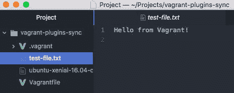

# 探索 Vagrant 插件和同步文件

本章将介绍 Vagrant 中强大且额外的功能。我们将学习 Vagrant 插件以及如何在主机和客户机之间同步文件。到本章结束时，你将对以下内容有一个较好的理解：

+   了解 Vagrant 插件

+   管理 Vagrant 插件

+   Vagrant 插件命令和子命令

+   查找、安装和使用 Vagrant 插件

+   Vagrant 文件同步

+   文件同步 — 共享文件夹、Rsync 和 NFS

# 了解 Vagrant 插件

Vagrant 提供了许多选项和功能，但当你需要的功能不可用时，可以通过插件的形式扩展其功能。Vagrant 提供了一个强大且灵活的内部 API，易于使用且开发灵活。Vagrant 实际上为许多核心功能使用了自己的 API。

# Vagrant 插件的构成

Vagrant 插件由多个部分组成。有些部分用于开发，其他部分则用于插件的常规使用。我们将重点关注两个核心部分：**gem** 和 **bundler**。

# Gem

gem 是一个特定的 Ruby 文件，使用 `.gem` 文件扩展名。gem 由三部分组成：包括逻辑、测试和实用工具的代码；文档；以及包含作者信息和其他元数据的 gemspec。gem 文件是 Vagrant 插件的核心部分，并且是你在 Vagrant 虚拟机中使用插件时运行的代码。

# bundler

bundler 是 Vagrant 使用并与之交互的应用程序，用于管理插件及其插件依赖。它通常用于 Ruby 项目中，用于管理 gem 以及 gem 的版本控制。你经常会在安装 Vagrant 插件失败时在控制台中看到 bundler 的输出。由于 Vagrant 插件是用 Ruby 编写并保存为 gem 文件，使用 bundler 是一个很好的选择。

# 管理 Vagrant 插件

在这一部分，我们将讨论插件的常规管理，包括安装和卸载。管理 Vagrant 插件时最常用的命令是 `list` 命令。运行以下命令可以查看你在系统上安装了哪些插件：

```
vagrant plugin list
```

有可能你没有安装任何插件，这时你会看到 `No plugins installed` 消息。如果你已经安装了插件，你会看到类似以下的插件列表：


# Vagrant 插件安装方法

要开始使用 Vagrant 插件，你必须先在系统上安装它。目前有两种安装插件的方式：你可以使用本地文件或 gem 源。我们将探讨这两种方式。

# 从本地文件安装 Vagrant 插件

从本地源安装插件相当快捷且简单。你可能有本地文件，因为你自己开发了该插件，或者朋友或公司私下提供了此插件代码给你。

本地文件将使用 `.gem` 扩展名。要安装插件，你必须知道相对于你希望安装/使用插件的文件夹的位置。我将安装名为 `testplugin.gem` 的插件，它位于当前 Vagrant 项目目录中的 `test-plugin` 文件夹里。以下是要运行的示例命令：

```
vagrant plugin install /test-plugin/testplugin.gem
```

Vagrant 和 bundler 将尝试定位并安装插件。如果无法找到插件，将显示以下错误信息：


如果插件有问题，比如 gem 文件中的语法错误，你将看到类似以下的消息：


# 从已知的 gem 源安装 Vagrant 插件

安装插件的第二种方式是从已知的 gem 源安装。已知的 gem 源是一个远程仓库，bundler 系统将尝试从中定位并安装 gem。最流行的 gem 源是 RubyGems，这是一个 Ruby gem 托管服务。

让我们通过这种方法安装一个新插件。以下是要运行的示例命令：

```
vagrant plugin install vagrant-hostsupdater
```

你将在接下来的章节中学习更多关于安装和管理插件的内容。

# Vagrant 插件命令和子命令

Vagrant 中的 `plugin` 命令提供了多个命令和子命令。我们在第七章《多机配置》中已经介绍过这些内容，*多机配置*，但我们将在这里作为基本参考和提醒。

你可以通过运行 `vagrant plugin help` 命令查看插件命令的列表。让我们深入了解每个可用插件子命令：

+   要删除所有用户安装的插件和插件数据，运行 `vagrant plugin expunge` 命令。

+   要安装插件，运行 `vagrant plugin install` 命令。需要额外的参数，可以通过运行 `vagrant plugin install -h` 命令查看。

+   要为专有的 Vagrant 插件安装许可证，运行 `vagrant plugin license` 命令。需要额外的参数，可以通过运行 `vagrant plugin license -h` 命令查看。

+   要查看已安装的 Vagrant 插件列表，运行 `vagrant plugin list` 命令。

+   要尝试修复插件损坏或安装过程中的问题，运行 `vagrant plugin repair` 命令。

+   要卸载 Vagrant 插件，运行 `vagrant plugin uninstall` 命令。需要额外的参数，可以通过运行 `vagrant plugin uninstall -h` 命令查看。

+   要更新 Vagrant 插件，运行 `vagrant plugin update` 命令。需要额外的参数，可以通过运行 `vagrant plugin update -h` 命令查看。

在后续章节中，我们将把这些命令应用到更真实的场景中，学习如何与 Vagrant 插件进行互动。

# 查找、安装和使用 Vagrant 插件

在本节中，我们将学习如何查找、安装和使用 Vagrant 插件。这将帮助你更好地理解 Vagrant 插件生态系统，并提供一些查找好插件的技巧。

Vagrant 插件没有官方的仓库或网站（像 Vagrant boxes 的 Vagrant cloud），但有一些网站可以帮助你找到完美的插件：

+   RubyGems ([`rubygems.org/`](https://rubygems.org/))

+   GitHub ([`github.com/`](https://github.com/))

+   搜索引擎

+   社区更新的 GitHub，列出了流行的插件 ([`github.com/hashicorp/vagrant/wiki/Available-Vagrant-Plugins`](https://github.com/hashicorp/vagrant/wiki/Available-Vagrant-Plugins))

RubyGems 和 GitHub 都是基于代码托管的网站，并提供强大的搜索功能。当搜索插件时，我发现 Google 非常有用。尝试使用不同的搜索词来找到符合要求的插件。例如，如果我正在寻找一个用于管理或与 Vagrant 中的 DNS 交互的插件，可以尝试 `vagrant plugin dns` 或 `vagrant dns plugins`。

# 安装 Vagrant 插件

让我们从 RubyGems 网站安装一个插件。我搜索了 `vagrant`，找到了一个名为 vagrant-hostsupdater 的插件，它的当前版本是 `1.1.1.160`，并且已经有超过 50 万次下载。以下是插件在 RubyGems 搜索结果中的截图：


这个插件会尝试在 Vagrant 虚拟机创建和销毁时编辑你的 `/etc/hosts` 文件，添加或删除主机。这意味着你可以通过像 `machine.dev` 这样的域名而不是 `192.168.10.10` 来访问 Vagrant 虚拟机。

我们可以通过运行以下命令来安装这个插件：

```
vagrant plugin install vagrant-hostsupdater
```

你应该看到类似于以下内容的输出：


我们可以通过运行 `vagrant plugin list` 命令来验证该插件是否已安装，如下所示：


现在让我们使用并测试我们的 Vagrant 插件。这个特定的插件已在 Vagrantfile 中配置，所以我们先创建一个基本的 Vagrantfile 来开始使用：

1.  运行 `vagrant init -m` 命令。

1.  编辑你的 Vagrantfile，添加以下代码：

```
Vagrant.configure("2") do |config|
  config.vm.box = "ubuntu/xenial64"
  config.vm.network :private_network, ip: "192.168.100.23"
  config.vm.hostname = "vagrant.dev"
  config.vm.provision "shell", inline: <<-SHELL
    sudo apt-get update
    sudo apt-get install -y nginx
  SHELL
end
```

我们创建一个基本的 Vagrant 虚拟机来测试我们的插件。我们关注的主要行是 `config.vm.network` 和 `config.vm.hostname`，因为它们是插件所必需的。

我们创建了一个使用私有静态 IP 地址、主机名为 `vagrant.dev` 的 Ubuntu 虚拟机，并使用基本的 shell 提供者来更新系统，然后安装 nginx Web 服务器。这将使我们能够快速查看一切是否正常工作，因为 nginx 安装并启动后，默认页面可以通过 80 端口访问。

1.  运行 `vagrant up --provision` 命令来启动并运行 Vagrant。

现在你应该会看到来自 `[vagrant-hostsupdater]` 插件的消息，它会尝试将虚拟机的 IP 地址和主机名写入 `/etc/hosts` 文件。`hosts` 文件是一个重要的系统文件，需要 root 权限才能编辑。系统会提示你输入主机机器的 root 密码：


1.  为了测试插件是否正常工作，我们可以在启动 vagrant 机器之前检查 `/etc/hosts` 文件。以下是一个基本示例。如果你之前编辑过文件，可能会看到更多条目：


1.  一旦你输入了 root 密码并且插件成功写入了 `/etc/hosts` 文件，你应该在 `vagrant up` 过程的一部分中看到这个消息：


1.  一旦机器启动并运行，重新检查 `/etc/hosts` 文件，看看是否添加了新条目。所有新条目都会被添加到文件的底部。在下面的截图中，我们可以看到我们的条目已经添加，IP 地址是 `192.168.100.23`，主机名是 `vagrant.dev`。插件还使用 `#` 字符添加了注释：


1.  很棒！现在让我们测试主机名，看看会得到什么。在终端中，我们可以运行 `curl vagrant.dev` 命令，它将尝试加载该 URL 并返回内容。我们可以看到返回的是默认的 nginx 页面：


1.  Ping 主机名以查看是否有活动连接、丢包情况以及我们得到的连接时间。由于机器是本地的，速度非常快（小于 1 毫秒），我们将看到返回的 IP 地址，这个例子中是 `192.168.100.23`：


1.  `vagrant halt` 机器。你会在终端中看到插件开始起作用并从 `/etc/hosts` 文件中移除该条目。你需要再次输入 root 密码：


# 卸载 Vagrant 插件

现在让我们卸载 `vagrant-hostsupdater` 插件。我们可以通过运行 `vagrant plugin uninstall vagrant-hostsupdater` 命令来卸载它。如果你不确定插件的名称，可以运行 `vagrant plugin list` 命令查看系统中已安装的插件列表。插件现在应该已经被移除，你应该看到 `Successfully uninstalled` 消息：


我们还可以通过运行 `vagrant plugin list` 命令来验证插件是否已被移除。我们应该看到 `No plugins installed` 消息（前提是系统中没有其他插件）：


# Vagrant 文件同步

文件同步是共享主机和在 Vagrant 中运行的虚拟机之间文件的方式。它允许你在主机上编辑文件，并能在虚拟机中看到这些变化，反之亦然。

Vagrant 称之为 **同步文件夹**，并提供了五种方式来实现：

+   基本同步

+   SMB

+   VirtualBox

+   RSync

+   NFS

在本节中，我们将介绍基本用法、RSync 和 NFS。

# 设置同步文件夹

要开始使用，先通过运行 `vagrant init -m` 命令创建一个 Vagrantfile。我们将从基本的同步用法开始，然后介绍 RSync，最后讲解 NFS。

我们将在宿主系统上创建一个文件，修改其内容，然后在 Vagrant 机器上查看该文件。接着，我们将在 Vagrant 机器上编辑文件，并查看它在宿主机上的变化。这将证明文件可以通过宿主机和 Vagrant 机器双向编辑。

我们需要在 Vagrantfile 中创建并编辑 `config.vm.synced_folder` 设置。

# 基本用法的同步文件夹

Vagrant 中同步文件夹的基本用法很容易设置。我们可以通过一个基本的 Vagrantfile 就开始：

```
Vagrant.configure("2") do |config|
    config.vm.box = "ubuntu/xenial64"
    config.vm.synced_folder ".", "/home/vagrant/files"
end
```

我们先关注第三行。`synced_folder` 配置接受两个参数。第一个参数是宿主机上的文件夹，第二个参数是 Vagrant 机器内的文件夹。

在这个示例中，我们将第一个参数设置为 `"."`，这是宿主机上 Vagrantfile 所在的当前目录。在第二个参数中，我们将文件夹设置为 Vagrant 机器上的`"/home/vagrant/files"`。

Vagrant 机器上的默认文件夹是`"/home/vagrant"`，但如果我们尝试将其设置为第二个参数，当该文件夹挂载到`"/home/vagrant/.ssh/authorized_keys"`时，会发生错误，导致无法通过 SSH 访问 Vagrant 机器，因为 SSH 密钥无法上传和检查。

现在我们来测试新的文件夹同步配置：

运行 `vagrant up --provision` 命令。你应该会看到 Vagrant 机器输出类似的内容：


现在我们可以通过 SSH 进入机器，查看 `files` 文件夹是否已经创建（如果尚未创建）。你可以运行 `ls` 命令来列出当前目录中的文件和文件夹。现在应该能看到 `files` 文件夹：


现在我们在 `files` 文件夹内创建一个文件：

1.  通过运行 `cd files` 命令进入该文件夹

1.  通过运行 `touch test-file.txt` 命令创建一个文本文件

1.  通过运行`echo "Hello from Vagrant!" > test-file.txt`命令添加一些内容

现在，我们可以通过运行`exit`命令退出 Vagrant 机器。现在，你可以在宿主机的目录中查找文件。你可以通过终端或文本编辑器来完成这项操作。我将使用 Atom 文本编辑器。

在以下截图中，我们可以看到我们在目录中创建的文件及其内容：



恭喜！你已经成功配置了同步文件夹，并在宿主机和 Vagrant 机器之间同步了文件。

# 使用 RSync 的同步文件夹

当在 Vagrant 中使用 RSync 作为 *同步文件夹* 选项时，它的设置稍微复杂一些。当其他文件同步选项不可用时（例如我们之前看过的基本用法，或下一个章节中的 NFS 选项），可以使用 RSync。

要开始使用 RSync，我们的 Vagrantfile 只需要在 `config.vm.synced_folders` 选项中添加一个额外的参数：

```
config.vm.synced_folder ".", "/home/vagrant/files", type: "rsync"
```

要使用此选项，主机和 Vagrant 虚拟机都必须安装 `rsync`。如果可能，Vagrant 会尝试在 Vagrant 虚拟机上安装 `rsync`，如果不能，它会显示错误信息。

有一些额外的参数可以与 RSync 选项一起使用。请查看官方文档，获取最新的参数列表。这些包括排除某些文件的功能。

RSync 通常会执行一次性从主机到虚拟机的同步，除非在 Vagrantfile 中将 `rsync_auto` 选项设置为 `true`。这是 Vagrant 的默认值，但可以通过将 `rsync_auto` 选项设置为 `false` 来更改。

# 使用 NFS 同步文件夹

使用 NFS 作为同步主机和 Vagrant 虚拟机之间文件夹的解决方案，通常可以提供性能优势或更好地适应所需的环境。

使用 NFS 与 Vagrant 中的 `basic usage` 版本的同步文件夹非常相似。我们的 Vagrant 文件只需要在 `config.vm.synced_folders` 选项中添加一个额外的参数：

```
config.vm.synced_folder ".", "/home/vagrant/files", type: "nfs"
```

我们添加了 `type` 选项，值为 `nfs`。要使其生效，Vagrant 虚拟机中的操作系统必须支持 NFS。

主机也必须支持 NFS，通过运行 NFS 服务器守护进程 `nfsd` 软件包。macOS X 默认预装此包，但如果主机使用 Linux，你可能需要自行安装它。

Vagrant 的 NFS 同步文件夹在 Windows 主机上无法使用。如果你尝试在 Vagrantfile 中配置此选项，Vagrant 会忽略它。如果你使用 VirtualBox 作为提供程序，在使用 NFS 时，还需要配置私有网络。如果你使用 VMWare，则无需担心。

# 总结

在本节中，我们学习了 Vagrant 的两个主要功能。我们了解了 Vagrant 中的插件，学习了它们是什么、如何工作，以及如何安装/卸载和使用它们。我们还了解了 Vagrant 中的文件同步，明白了如何使用多种不同的方法在主机系统和 Vagrant 虚拟机之间同步文件。

在第九章，*Shell 脚本 - 配置*，我们将开始配置系列章节的第一部分。我们将学习 Vagrant 中的配置，并了解如何使用 Shell 脚本来配置 Vagrant 虚拟机。接下来的章节将深入介绍如何使用配置管理工具（如 Chef）进行配置。
