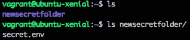

# 第九章：Shell 脚本 - 配置

在本章中，我们将研究 Vagrant 配置。我们将重点介绍基本概念以及 Shell 脚本配置。到本章结束时，你将对以下内容有一个很好的理解：

+   Vagrant 配置

+   理解配置管理

+   使用文件进行 Vagrant 配置

+   Vagrant shell 配置

+   Vagrant 内联脚本、外部脚本和脚本参数

# Vagrant 配置介绍

在 Vagrant 中配置的思想是创建一个脚本，准备并安装软件到 Vagrant 机器上。配置可以通过在 Vagrantfile 中使用 shell 配置器或外部文件进行内联。配置会在 *vagrant up* 过程中发生，机器正在创建时。

在配置 Vagrant 机器时，有许多选项：

+   安装软件

+   修改配置

+   操作系统级别的更改

+   系统设置

# 理解配置管理

在后续章节中，我们将进一步了解如何在 Vagrant 中使用配置管理工具进行配置。在讨论 Vagrant 配置时，这将是一个良好的配置管理入门。

配置管理工具包括 Chef、Ansible 和 Salt。我们将专注于这三种工具。配置管理本质上是另一个表示配置的词汇，用于将机器设置为所需状态——这可以是安装软件或配置某些设置。

配置管理工具通常具有专门的文件类型或语法。我们将重点关注以下软件：

+   **Ansible**（使用剧本）

+   **Chef**（使用食谱）

+   **Docker**（使用镜像）

+   **Puppet**（使用清单）

+   **Salt**（使用状态）

配置管理通常在开发和部署过程中需要更强大和灵活的选项时使用。使用配置管理工具的一个好处是关注点的分离。本质上，你不会依赖 Vagrant 处理太多操作，以防你遇到问题，或者你希望具备能够更换配置管理工具的灵活性。这可能是由于公司决策，考虑到预算或安全性等因素。

# Vagrant 配置的基础用法

为了开始配置我们的 Vagrant 机器，我们可以创建一个新的 Vagrantfile。我们可以通过运行 `vagrant init -m` 命令来实现。

在我们的 Vagrantfile 中，我们可以使用 `config.vm.provision` 代码定义配置块，并传递一个值声明我们将使用哪种类型的配置器。在下面的示例中，我们将使用 shell 类型：

```
config.vm.provision "shell"
```

使用 shell 配置器时，可以在内联中定义额外的值：

```
config.vm.provision "shell", inline "sudo apt-get update -y"
```

或者使用配置块，在其中我们可以在管道字符内定义我们的 shell 值：

```
config.vm.provision "shell" do |shell|
     shell.inline = "sudo apt-get update -y"
 end
```

在这个例子中，两种选项都会更新系统包。使用配置块方法更容易阅读，因为每个值可以单独占一行。

# Vagrant 配置命令

一旦你创建了配置值，就该将这些更改应用到 Vagrant 虚拟机了。你有几个选项：

+   当你第一次运行`vagrant up`命令时，系统会读取 Vagrantfile 并运行配置脚本。

+   如果你的机器已被停止，或者你希望强制配置，可以运行`vagrant up --provision`来启用配置。

+   你也可以使用`--no-provision`标志来禁用配置。

+   在配置块中，你可以设置`run`键并指定`always`值，这将强制配置脚本在每次启动机器时运行。例如，`config.vm.provision "shell", inline: "sudo apt-get update -y", run: "always"`。

最后一种选择仅在没有设置`--no-provision`标志时有效。

# 使用文件进行 Vagrant 配置

Vagrant 文件选项提供了一种简便的方法，在启动过程中将文件从主机复制到 Vagrant 虚拟机。

这是一种上传配置文件的绝佳方式，这些文件通常需要由软件创建，或者在软件开始工作之前可能是必需的。例如，`.env`文件用于存储环境变量，如数据库连接信息或特殊密钥。

有两个可用的选项——你可以从主机复制/上传一个单独的文件或整个目录到虚拟机中。

使用这个选项时，我们在 Vagrantfile 中将配置选项设置为`file`，例如：

```
config.vm.provision "file"
```

# 单个文件

从主机上传文件到虚拟机既快速又简单。我们只需要将配置类型设置为`file`，源文件设置为主机上的文件，目标文件夹设置为：

```
Vagrant.configure("2") do |config|
     config.vm.provision "file", source: "secret.env", destination: "secret.env"
 end
```

这将把我们的`secret.env`文件复制到 Vagrant 虚拟机的主目录中。

如果`secret.env`文件不存在，Vagrant 将在启动过程中抛出错误：


如果文件确实存在，你将在启动过程中看到类似以下内容的输出：


在运行`vagrant ssh`命令并连接到虚拟机后，我们可以运行`ls`命令列出目录中的文件。现在我们将看到`secret.env`文件：


# 目录

另一种选择是将文件和文件夹的目录从主机上传到虚拟机。如果你需要多个资源文件，如图像或配置文件，并且希望它们在一个独立且可管理的方式中，这将非常有用。

将这个选项添加到 Vagrantfile 中时，它与文件选项非常相似：

```
Vagrant.configure("2") do |config|
     config.vm.provision "file", source: "secretfolder", destination: "$HOME/newsecretfolder"
 end
```

我们将源值设置为当前 Vagrant 目录中的一个文件夹。如果文件夹位于主机系统的其他位置，你也可以指定绝对路径。

目标文件夹可以使用`$HOME`变量，在我们的来宾机器的主文件夹中创建新文件夹。此文件夹可以与来宾机器上的现有文件夹同名，或使用一个新名称，这取决于你的需求。

我们可以运行`vagrant up --provision`命令来启动 Vagrant 机器。在此过程中，我们将在输出中再次看到该消息：


一旦机器启动并运行，我们可以运行`vagrant ssh`命令连接到机器并运行`ls`命令。然后我们将在主目录中看到该文件夹。如果我们运行`ls newsecretfolder/`命令查看新文件夹的内容，将看到`secret.env`文件：



请注意**：**与同步文件夹功能相比，使用此选项时，主机/本地机器上的任何更改将不会反映到来宾机器上。

# Vagrant Shell 配置器

我们已经看到如何使用基本的 shell 配置器，但根据你的设置和所需的环境，你可能会有一个非常大且复杂的配置器脚本。这个脚本可能需要参数或环境变量，或者可能链接到其他地方托管的外部资源。

在本节中，我们将查看使用 shell 作为 Vagrant 配置器时提供的众多选项。这通常是初学者使用的，但它非常强大且灵活，尤其是当你不想设置像 Chef 和 Ansible 这样的配置管理工具时。

使用 shell 配置器时，有一些可选的配置设置：

+   **args**：这些是你为配置脚本指定的参数。可以是一个字符串或一个值的数组。

+   **env**：这是传递给脚本的键值对（哈希）列表，作为环境变量。

+   **binary**：默认情况下，Vagrant 会将 Windows 的行结束符替换为 Unix 的行结束符，除非你将此值更改为 true。

+   **特权**：这允许你更改脚本是否由特权用户运行，例如`sudo`。默认值为 true。

+   **upload_path**：这是脚本将上传到的来宾机器上的路径。SSH 用户帐户必须有权限写入该文件夹/文件位置，否则会失败。

+   **保持颜色**：Vagrant 当前将成功消息输出为绿色，错误消息输出为红色。如果将此值更改为 false，则会停止此行为。

+   **name**：这可以用于标识多个不同配置器在该过程中运行时的输出。

+   **powershell_args**：这些是如果在 Windows 上使用 PowerShell 时可以传递给配置器的参数。

+   **powershell_elevated_interactive**：当在 Windows 上尝试以交互模式提升脚本时使用。你必须启用 Windows 自动登录，并且用户必须已登录才能使其生效。

+   **md5**：MD5 值（校验和）用于验证已下载的 shell 文件。

+   **sha1**：SHA1 值（校验和）用于验证已下载的 shell 文件。

+   **敏感**：如果你在`env`选项中指定值，它将把这些值标记为敏感并且不会在输出中显示。

我们将重点讨论内联脚本、外部脚本和脚本参数。

# 内联脚本

我们简要提到了内联脚本，但还有更多可添加到配置中的选项，用于配置安装。

你可以使用以下语法来运行内联脚本：

```
config.vm.provision "shell", inline: "sudo apt-get update -y && echo updating finished"
```

或者，你可以在块外创建一个变量，并使用该变量来获得更简洁、更易读的格式：

```
$shellscript = <<-SCRIPT
 sudo apt-get update -y
 echo updating finished
 SCRIPT

config.vm.provision "shell", inline: $shellscript
```

你可以尝试这两种选项，看看哪种最适合你。在开发团队中工作时，你可能会发现他们已经有了你必须遵循的语法，用于创建和编辑 Vagrantfile。

# 外部脚本

使用 shell 配置的另一个选项是使用外部脚本。这是一种很好的方法，可以将脚本与其他内容分开，这样更容易管理，并有助于保持 Vagrantfile 的整洁。

要使用外部脚本，我们可以使用以下语法：

```
config.vm.provision "shell", path: "[FILELOCATION]"
```

在上面的例子中，`"[FILELOCATION]"`占位符可以是两种不同的选项之一：

+   本地脚本，位于你的机器上；例如值为`script.sh`

+   一个托管在外部的远程脚本；例如值为`https://example.com/dev/script.sh`

使用远程脚本的一个好处是，任何使用该 Vagrantfile 运行特定机器配置的人都将始终获得最新版本。如果你在一个开发团队中，当对配置脚本进行更改时，其他开发人员只需要运行`vagrant up --provision`命令，然后就可以使用相同的机器配置。

# 脚本参数

shell 配置的另一个好处是可以使用参数。这些是可以作为变量传入的值，当数据是动态时，它们可以更容易地管理。

脚本参数可以作为字符串或数组传入。字符串在仅需一个参数时很有用，而数组在需要多个参数时很有用。

# 脚本参数 – 字符串

下面是在 Vagrantfile 中使用字符串脚本参数时的语法示例：

```
config.vm.provision :shell do |shell|
     shell.inline = "echo $1"
     shell.args = "'this is a test'"
 end
```

当*vagrant up*进程进入配置阶段时，我们将看到一个值为`this is a test`的输出回显到屏幕上：


请注意：你必须记得正确转义字符串。在这种情况下，我们将字符串包裹在单引号中。系统会看到`'this is a test'`回显，这不会抛出任何错误。

# 脚本参数 – 数组

下面是使用数组脚本参数时在 Vagrantfile 中的语法示例：

```
config.vm.provision :shell do |shell|
     shell.inline = "echo $1 $2"
     shell.args = ["this is", "a test"]
 end
```

与字符串参数选项类似，当在*vagrant up*进程中启动此配置器时，我们将在屏幕上看到值为`this is a test`的输出：


请注意：不必为数组中的单个值加引号，但建议你转义任何特殊字符，以减少错误。

# 总结

在本章中，我们学习了 Vagrant 的配置与管理。我们通过基本用法类型、文件类型和 shell 类型，使用内联和外部脚本带参数来配置 Vagrant 虚拟机。

在第十章，*Ansible - 使用 Ansible 配置 Vagrant Box*，我们将深入了解 Ansible 配置管理工具，并使用它来配置 Vagrant 虚拟机。我们将学习如何使用 Ansible 和 Ansible playbooks，包括其语法。
