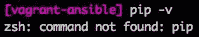
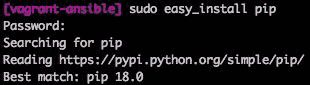
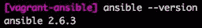
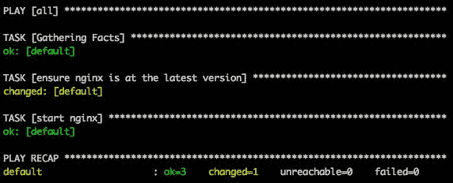
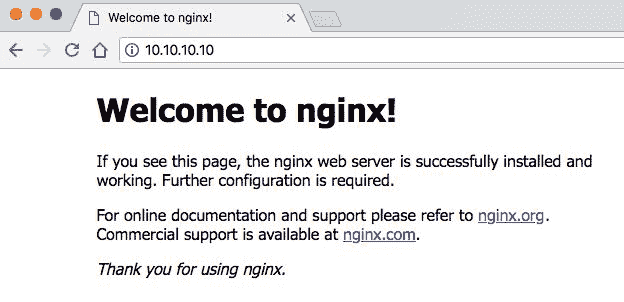
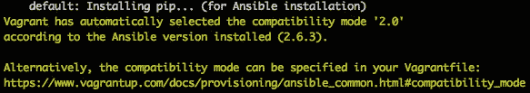
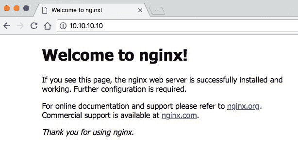
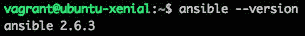

# 第十章：Ansible - 使用 Ansible 配置 Vagrant Box

在我们的配置系列的第二部分中，我们将学习关于 Ansible 的知识，如何使用它来配置 Vagrant 机器。本章将覆盖以下主题：

+   理解 Ansible

+   在 macOS 上安装 Ansible

+   使用 Ansible 在主机机器上提供 Vagrant

+   在来宾机器上使用 Ansible 配置 Vagrant

+   Ansible Playbooks

到本章结束时，你将能够自信地使用 Ansible 来配置 Vagrant 机器。你将对 Ansible 的工作原理有一个很好的理解，并且能通过 Playbooks 配置你所需的内容，能够在主机和 Vagrant 机器上使用 Ansible。

# 理解 Ansible

Ansible 是一个开源软件，用于使*IT 自动化更简单*，并为*每个人提供自动化*。Ansible 是一个用于配置管理、软件供应和应用程序部署的工具。它是一个功能强大的工具，提供了许多功能。这些功能包括以下内容：

+   它可以在主机或来宾机器上本地运行

+   它拥有丰富的插件生态系统

+   它可以使用许多云提供商来协调基础设施

+   它可以安装在许多不同的操作系统上

+   它具有简单的库存管理

+   它拥有简单而强大的自动化功能，通过 Playbooks 来实现

+   编写良好的详细文档

Ansible 提供了一种简单的方式来配置软件，拥有易于学习的语法，并且构建可靠、安全。我们将在本章中通过安装 Ansible、创建和测试 Playbooks、以及配置 Vagrant 机器来进一步了解 Ansible。

关于 Ansible 还有一些有趣的事实：它是 Red Hat 的一部分，使用 Python 和 PowerShell 编写，首次发布是在 2012 年 2 月，并且有一个基于 Web 的界面，叫做 Ansible Tower，可以用来简化 Ansible 的管理。

# 安装 Ansible

在第一部分中，我们将学习如何在主机机器上安装 Ansible，本例中为 macOS。稍后在本章中，我们将学习如何在 Ubuntu 上安装 Ansible，而 Ubuntu 将运行在我们的来宾 Vagrant 机器中。

# 在 macOS High Sierra (版本 10.13) 上安装 Ansible

在我们开始使用 Ansible 配置 Vagrant 机器之前，我们首先需要在主机上安装它。我们不会讨论任何高级安装方法——仅仅是安装 Ansible 并使其运行的基础内容。如果你使用的是其他操作系统，请随时参考[Ansible 的官方文档](https://docs.ansible.com/)。

1.  我们首先需要访问[安装指南页面](https://docs.ansible.com/ansible/latest/installation_guide/intro_installation.html)。

1.  这里列出了支持的操作系统，但我们需要点击 macOS 部分的最新版本。

1.  在这里，我们会看到首选的选项是通过 `pip` 安装 Ansible。

1.  你可以通过运行 `pip -v` 命令来检查是否已安装 pip：



1.  如果你没有安装，可以运行 `sudo easy_install pip` 命令：



你需要输入系统密码，因为该命令需要 `sudo` 权限。

1.  现在你可以通过运行 `sudo pip install ansible` 命令来安装 Ansible：


再次提示，你需要输入系统密码，因为该命令需要 `sudo` 权限。

1.  最后，我们可以通过运行 `ansible --version` 命令来检查 Ansible 是否已成功安装：



你可以看到我安装的是最新版本：2.6.3。

恭喜——你已经成功安装了 Ansible！现在我们可以开始配置和配置我们的 Vagrant 机器。

# 使用 Ansible 配置 Vagrant

在本节中，我们将研究两种不同的通过 Ansible 配置 Vagrant 的方式。第一种是通过在我们的主机（macOS）机器上运行 Ansible，第二种是在 Vagrant 内运行的客机（Ubuntu）上运行 Ansible。

**请注意：**我们将使用 ubuntu/xenial64 盒子，版本号为 `virtualbox, 20180510.0.0`。

# 在主机上使用 Ansible 配置 Vagrant

让我们设置一个基本的 Vagrant 环境，并通过 Ansible 从主机配置它。我们将学习如何在 Vagrantfile 中配置 Ansible，并安装软件到我们运行 Ubuntu 的 Vagrant 客户机中：

1.  让我们在一个新目录中创建一个新的 Vagrantfile，从头开始。我们可以运行 `vagrant init -m` 命令来做到这一点。

1.  在我们的 Vagrant 文件中，我们通过添加 `config.vm.box = "ubuntu/xenial64"` 这一行来设置盒子为 Ubuntu，还要添加网络配置行：

```
config.vm.network "private_network", ip: "10.10.10.10"
```

1.  现在我们可以创建一个 `provision` 块：

```
  config.vm.provision "shell", inline: "sudo apt-get update; sudo ln -sf /usr/bin/python3 /usr/bin/python"   
  config.vm.provision "ansible" do |ans|    ans.playbook = "vagrant_playbook.yml"
 end
```

1.  保存 Vagrant 文件并退出文本编辑器。

如果现在运行 `vagrant up --provision` 命令，在最后的配置阶段你会看到一个错误：


这是因为 Ansible 和 Vagrant 无法找到 playbook `vagrant_playbook.yml`。在与你的 Vagrantfile 相同的目录下，我们现在来创建 playbook 文件。

添加以下代码（我们稍后会详细讲解，以便你清楚它的作用）：

```
---
 -
  hosts: all
  sudo: true
  tasks:
   -
    apt: "name=nginx state=latest"
    name: "ensure nginx is at the latest version"
   -
    name: "start nginx"
    service:
     name: nginx
     state: started
```

请注意：Playbook 文件在格式和语法上非常严格。在 YAML 文件中只能使用空格，不能使用制表符（Tab）。如果遇到问题，尝试去除所有空格，并添加适当的缩进（顶级使用 1 个空格，子级使用 2 个空格，以此类推）。你可以使用在线 YAML 代码/语法验证工具（这是我使用的网站/工具：[`www.yamllint.com`](http://www.yamllint.com/)）。

这个标记会将最新版本的 Nginx 安装到 Vagrant 机器上。然后它会启动 Nginx 服务，使其运行并准备好使用。如果你已经有运行中的机器，可能需要先运行 `vagrant destroy -f` 命令。

运行 `vagrant up --provision` 命令以开始启动过程并启动 Ansible。你将在配置阶段看到大量新的彩色输出，这些输出表示 Ansible 正在安装和配置 Nginx。

配置器将开始运行我们在 Vagrantfile 中指定的 `ansible_local`：


然后它将运行 ansible-playbook 处理程序：


最后，你将看到 Ansible 所做工作的概览（或者有时没有做工作，这会导致红色的失败）。我们可以看到绿色的 `ok=3` 值表示有 3 项已成功运行，而黄色的 `changed=1` 值表示有一项已成功更改：



我们现在应该能够使用 `10.10.10.10` 的 IP 地址访问我们的 Vagrant 机器，因为我们在 Vagrantfile 中设置了网络配置。

打开浏览器并访问该 IP 地址，你应该能看到默认的 Nginx 欢迎页面：



恭喜！你已经成功使用 Ansible 从宿主机配置 Vagrant 安装了 Nginx。我们在这里讲解了很多内容，但在下一节中，我们将学习更多关于 Playbook 的知识。

# 在客户机上使用 Ansible 配置 Vagrant

现在我们已经成功配置了 Vagrant 机器并使用宿主机方法安装了 Nginx 服务，接下来我们可以学习如何在客户机（Vagrant 机器）上使用 Ansible 配置 Vagrant。

这种方法更简单，因为它允许在客户机内完成所有操作。你不需要在宿主机上安装任何额外的软件。如果找不到或无法访问 Ansible，Vagrant 会智能地尝试在客户机上安装它。

接下来的步骤与之前的步骤相似，但我们将向 Vagrantfile 中添加一些额外的配置：

1.  运行 `vagrant init -m` 命令以创建一个新的 Vagrantfile（如果你按照之前的步骤操作，可能需要清空当前目录或使用一个新的空目录）。

1.  在我们的 Vagrantfile 中，我们将通过添加 `config.vm.box = "ubuntu/xenial64"` 行来设置盒子为 Ubuntu，并且还需要添加网络配置行：

```
 config.vm.network "private_network", ip: "10.10.10.10"
```

1.  现在我们可以创建一个 `provision` 块：

```
 config.vm.provision "ansible_local" do |ans|
       ans.playbook = "vagrant_playbook.yml"
       ans.install = true
       ans.install_mode = "pip"
 end
```

1.  保存 Vagrantfile 并运行 `vagrant up --provision` 命令，以启动并运行 Vagrant 机器。

我们会看到类似的过程，直到 Vagrant 进入配置阶段。我们的客户机没有安装 Ansible，因此它将开始安装它。我们可以看到这里使用了 `ansible_local` 配置器：


由于我们在 Vagrantfile 中指定了安装模式为 `pip`，因此 pip 包管理器将被安装到我们的客户机上：



Vagrant 配置器将找到并运行 Ansible Playbook：


Ansible 现在将在客户机内运行，以安装 Playbook 中的内容。我们可以在以下截图中看到，Nginx 已成功安装并启动，并且没有失败的元素：


现在我们可以在浏览器中访问 `10.10.10.10`，并看到 Nginx 的默认页面。这将确认 Nginx 已成功安装并且服务正在运行：



现在让我们通过运行 `vagrant ssh` 命令 SSH 进入 Vagrant 客户机。连接后，我们可以运行 `ansible --version` 命令来确认 Ansible 是否已安装在目标系统上：



我们可以看到已安装的 Ansible 版本是 2.6.3。在我们的 Vagrantfile 中，我们使用了一些额外的 Ansible 值，我们将在下一部分深入了解。

# 额外的 Ansible 选项

Vagrant 在使用 Ansible 和 Ansible local 作为配置器时支持额外的选项。这些选项允许您向配置过程添加额外的功能和自定义设置。

# 配置器 – Ansible

在本节中，我们将探讨可以与 Ansible 配置器一起使用的其他选项：

+   `ask_become_pass`：当设置为 true（布尔值）时，它会在使用 Ansible 中的 `sudo` 提升权限时提示输入密码。

+   `ask_sudo_pass`：这基本上是 `ask_become_pass`，但将在 Vagrant 的未来版本中被淘汰。它用于向后兼容性。

+   `ask_vault_pass`：当设置为 true（布尔值）时，它会强制 Ansible 提示输入密码。Ansible Vault 用于将敏感数据和密码加密存储，以便您不必担心它们在 Playbook 中以明文形式暴露。

+   `force_remote_user`：此选项将要求 Vagrant 在清单中设置 `ansible_ssh_user`。Ansible 将使用 Vagrantfile 中的 `config.ssh.username` 值，而不是使用 Ansible Playbook 中的 `remote_user` 参数。

+   `host_key_checking`：此选项将要求 Ansible 启用 SSH 主机密钥检查。

+   `raw_ssh_args`：此选项可用于应用一组 OpenSSH 客户端选项。该值通常是一个字符串数组。

请注意：建议查看官方的 Vagrant 和 Ansible 文档，获取这些选项的更深入解释，并了解是否有任何您可能需要的内容，但不确定其名称或如何应用。

# 配置器 – Ansible local

在本节中，我们将探讨可以与 Ansible local 配置器一起使用的其他选项：

+   `install`：此选项默认启用，如果目标系统未安装或无法运行 Ansible，则会尝试在目标系统上安装 Ansible。

+   `install_mode`：此选项允许您选择如何在目标系统上安装 Ansible。您可以选择默认选项、`pip` 或 `pip_args_only`。默认选项将尝试使用目标操作系统的包管理器。`pip` 选项将使用 Python 包管理器。`pip_args_only` 选项与 `pip` 选项类似，但不允许 Vagrant 自动设置 pip 选项。

+   `pip_args`：当`install_mode`设置为使用 pip 时，此选项会使用。它允许你将 pip 参数传递到命令行。

+   `provisioning_path`：这是 Ansible 文件存储的目录路径。诸如`ansible-playbook`之类的命令都从此位置运行。

+   `tmp_path`：这是在客户机上的绝对路径，用于 Ansible 本地提供者临时存储文件。

请注意：值得查看官方的 Vagrant 和 Ansible 文档，以便获得更深入的解释，并了解是否有你需要的内容，但不太确定其名称或如何应用。

# Ansible Playbooks

Ansible Playbook 是 Ansible 使用的配置文件。你可以把它看作是 Vagrant 的 Vagrantfile。它使用 YAML（Yet Another Markup Language）标记语言作为语法，并且易于阅读：

```
---
 - hosts: all
     sudo: yes
     tasks:
         - name: ensure nginx is at the latest version
             apt: name=nginx state=latest
         - name: start nginx
             service:
                 name: nginx
                 state: started
```

让我们来看一下我们在上一节中创建的示例 Playbook，如上面代码块所示，并对其进行剖析，以便更好地理解它的含义：

+   第一行始终是三个短横线，用于标志文件的开始。

+   然后我们必须定义这些配置适用于哪些主机。通常可以在 Ansible 的库存文件中定义这些主机，通过设置类似[db]的值，并为该节点提供 IP 地址。

+   然后我们将`sudo`值设置为`yes`，因为我们需要 sudo/root 权限来在 Vagrant 客户机上安装 Nginx。

+   然后我们进入任务部分，这就是我们希望 Ansible 执行的操作——配置阶段。我们将通过名称部分分隔每个任务。它描述了我们希望任务做什么，例如，`start nginx`。

+   在一个任务中，我们可以定义操作。在我们第一个名为`apt`的任务中，我们调用包管理器（apt-get）来安装最新版本的 Nginx 包。

+   然后我们进入最后一个任务，确保 Nginx 服务已经启动。

我希望你能从这个例子中看到，Ansible Playbooks 非常易于阅读，并且按逻辑流程工作。你会遇到比这个例子更复杂的 Playbooks，以及一些相似的 Playbooks，但始终遵循每个块中的缩进，以更好地理解每个部分的功能。

# 总结

在本章中，我们学习了如何在主机和客户机上使用 Ansible 来配置 Vagrant。我们还学习了 Ansible 是什么，以及 Ansible Playbooks。如果你在公司中使用 Ansible，那么我建议你尝试将其与 Vagrant 结合使用，以帮助你的开发工作流。

在第十二章，*Docker - 在 Vagrant 中使用 Docker*，我们将继续我们的配置系列，学习 Chef 以及如何使用该配置管理工具来配置 Vagrant。我们将研究多个 Chef 选项（solo 和 client），并了解 Chef cookbooks。
