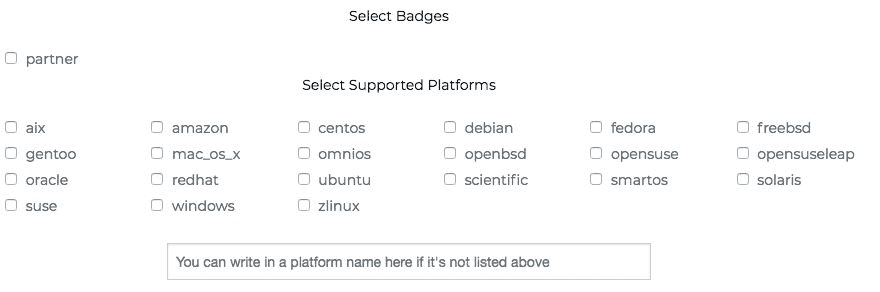
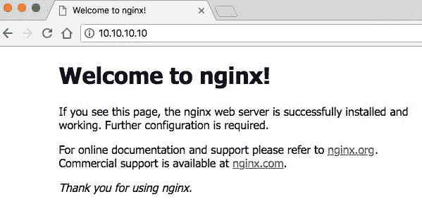

# 第十一章：Chef - 使用 Chef 配置 Vagrant Box

在本章中，我们将继续使用流行的 DevOps 配置管理工具来配置 Vagrant 的系列教程。我们将重点介绍 Chef，并涵盖以下主题：

+   理解 Chef

+   Chef Cookbook

+   在 macOS 上安装 Chef

+   使用 Chef Solo 配置 Vagrant 机器

+   使用 Chef Client 配置 Vagrant 机器

本章结束时，你将对 Chef 的概念以及其工作组件有一个清晰的了解。你将能够自信地使用 Chef 来配置 Vagrant 机器，无论是在宿主机上还是在 Vagrant 机器本身。你将明白如何创建一个 Cookbook，这可以是一个非常强大且灵活的工具，用于管理机器的状态。

# 理解 Chef

Chef 是一个流行的配置管理工具，用于配置和维护服务器。它由名为 Chef 的公司创建，使用 Ruby 和 Erlang 编写。它最初于 2009 年 1 月发布，并提供了两个不同的版本——免费（开源）和付费（企业版）。

Chef 支持并与许多云平台集成，如 Amazon EC2、OpenStack、Rackspace 和 Microsoft Azure。Chef 可以在独立模式下运行（无依赖），也可以在客户端/服务器模式下运行，客户端与服务器通信并发送有关安装节点的信息。

Chef 使用 Cookbook 和配方作为其配置的一部分，我们将在下一部分中详细讨论这一点。

# Chef Cookbook

Chef 使用 Cookbook 作为其过程中的核心元素，Cookbook 用于描述节点/服务器的期望状态。

Chef Cookbook 是使用 Chef 配置机器时的重要组成部分。它描述了机器的期望状态。这类似于在 Ansible 中使用 Playbooks。Chef Cookbook 包含五个关键元素，每个元素都有其特定的作用：

+   配方

+   模板

+   属性值

+   扩展

+   文件分发器

这些元素通常是一些元数据，它们协同工作，创建机器的概览。让我们深入了解这五个元素，进一步学习它们。

当我们提到节点时，我们指的是一台机器——无论是物理机器还是虚拟机。节点可以是计算机、服务器、网络设备或其他机器。

# 配方

配方是 Cookbook 的关键部分。它用于详细描述应该在节点上发生什么。这类似于设置 Vagrant 虚拟机状态时使用的 Vagrantfile。

配方是用 Ruby 编写的，必须添加到节点的运行列表中，节点将根据该列表运行相应的配方。一个 Cookbook 可以使用一个或多个配方，或依赖外部的配方。

配方的主要目的是管理资源。资源可以是软件包、服务、用户、组、文件、目录、定时任务等。

# 模板

模板是一种特定类型的文件，包含嵌入式 Ruby。这些文件使用 `.erb` 扩展名，可以用来创建动态配置文件。

这些文件可以访问属性值（您将在下一部分中学习）。这就像是在文件中使用变量，而不必硬编码设置。您可以有多个模板引用相同的属性，当其中一个发生变化时，它会在所有模板文件中更改该值。

# 属性值

Chef 中的属性值本质上是设置。它们通常以键值对的形式显示。这些设置可以在 Cookbook 中使用。

属性设置在 Cookbook 的 `attributes` 子目录中，然后可以在 Cookbook 的其他部分中引用。属性可以在顶部（Cookbook）级别设置，但也可以通过任何特定于节点的设置/属性在节点级别进行覆盖。

# 扩展

这些只是 Chef 的扩展，如库和自定义资源。这些也可以被称为 *工具*，您可以在 *Chef 超市* 部分了解更多内容。

# 文件分发器

静态文件用于包含简单的配置。它们放置在文件的子目录中，通常通过配方移到节点上。这些文件通常不会更改，可以视为简单的、非动态的模板。

# Chef 超市

如果您正在寻找特定的 Cookbook/软件，那么您可以使用 Chef 超市。您可以将 Chef 超市视为 HashiCorp 的 Vagrant Cloud。它托管了您可以查看和下载的 Cookbooks。超市界面简单易用，提供了一个快速的用户界面。其主要特点是易于使用的搜索功能。

# 搜索

如果您在寻找特定的 Cookbook 或只是想看看有哪些可用的内容，您可以使用强大的搜索功能。它提供了全文搜索和筛选功能，帮助缩小结果范围。您可以通过访问 Chef 超市主页来使用搜索，链接如下：[`supermarket.chef.io/`](https://supermarket.chef.io/)：


在前面的截图中，您可以看到 `搜索` 功能。您可以搜索特定的软件包，例如 nginx，或者搜索更一般的内容，看看有哪些可用的，如 `web server`。

在缩小搜索范围时，有两个选项。第一个选项是您可以使用“高级选项”搜索功能，位于搜索栏下方，右侧：



在前面的截图中，您可以看到“高级选项”展开菜单，它允许您按 Badge 和/或选定的支持平台过滤搜索。如果平台不在列表中，您还可以使用底部的文本搜索栏搜索特定的平台。

目前只有一个 Badge 选项可用，即 partner。这个选项用于搜索 Chef 合作伙伴 Cookbooks，这些是由 Chef 工程团队精心挑选或他们创建的 Cookbooks。我们将在这里查看其他筛选选项：


在搜索栏的左侧，您可以选择您希望搜索的类型。目前有两个选项——Cookbooks 和 Tools。默认选项是 Cookbooks，这将搜索可用的 Cookbooks。Tools 选项将搜索可用的 Chef 工具。Tools 是可以与 Chef 一起使用的软件——这些不是插件，而是附加组件：


在前面的截图中，我们正在搜索 `nginx`，这是一个 Web 服务器。您可以看到它找到了 43 个 Cookbooks，您可以选择按“Most Followed”和“Recently Updated”排序。您将看到一些重要信息，如 Cookbook 版本、最后更新的日期/时间、支持的平台、安装代码和关注者数量。

您可以点击 Cookbook 的名称（此例中为 `nginx`）以获取有关该 Cookbook 的更多信息：


在前面的截图中，您可以看到 Cookbook 页面。它包含更多信息，包括 Cookbook 的创建者/维护者，并提供了详细的 README 文件。还有其他信息，如依赖项、更新日志、安装说明/选项等。

# 使用 Chef 配置 Vagrant

有四种不同的方式可以使用 Chef 来配置 Vagrant 支持的虚拟机。这意味着 Chef 在 Vagrant 中配置时有最多的选项。四种选项如下：

+   Chef Solo

+   Chef Zero

+   Chef Client

+   Chef Apply

在本章中，我们将重点关注 Chef Solo 和 Chef Client。这将为您提供在主机和 Vagrant 虚拟机上进行配置的良好组合。

# 在 macOS 上安装 Chef

在我们开始使用 Chef 之前，首先需要安装它。我们将学习如何在 macOS 操作系统（High Sierra 10.13 版本）上安装 Chef。

我们将安装 Chef DK（开发工具包），它包含所有依赖项、实用程序和主要的 Chef 软件。安装的软件列表包括以下内容：

+   Chef 客户端

+   OpenSSL

+   嵌入式 Ruby

+   RubyGems

+   命令行实用程序

+   键值存储

+   解析器

+   实用工具

+   库

+   如 Kitchen 和 ChefSpec 等社区工具

请注意：在安装 Chef 之前，必须先安装 Apple XCode 软件包。

现在，让我们在系统上安装并测试 Chef：

1.  访问 Chef DK 下载页面（以下是 macOS 部分的链接：[`downloads.chef.io/chefdk#mac_os_x`](https://downloads.chef.io/chefdk#mac_os_x)）。

1.  找到您当前在系统上运行的版本，然后点击橙色的下载按钮，如下所示：


1.  运行 `.dmg` 文件安装程序。您需要先运行安装文件。点击 `.pkg` 文件以运行它。

1.  安装程序将运行，您将被提示通过六个步骤。请按照这些步骤操作。在此安装过程中我们不会更改任何值：


1.  完成后，您应该看到*绿色勾选*的成功界面。点击关闭按钮关闭此窗口。接着，您可以将安装包移动到垃圾桶中。

1.  为了确认 Chef 是否已经安装，打开终端窗口并运行`chef -v`命令，它应该列出 Chef 的版本和其他依赖项：


如您所见，Chef 运行时有许多软件组成部分。包括 DK 版本、chef-client 版本、kitchen 版本等。了解这些版本会很有帮助，尤其是当您将来需要调试某些软件问题时。

恭喜！您现在已经在系统上安装了 Chef。接下来，让我们看看如何使用 Chef 来配置 Vagrant 虚拟机。

# 使用 Chef Solo 来配置 Vagrant 虚拟机

与前几章类似，我们将继续使用安装 nginx 网页服务器的示例。虽然这是一个简单的示例，但它让我们能够使用一款流行的软件，配置网络，并且是验证成功与否的一种简单方法。

使用 Chef Solo 作为 Vagrant 的配置工具，是开始使用 Chef 的快捷简便方式。它没有依赖项（除了 Chef 本身），适合初学者或高级用户使用。

我们首先需要通过运行`vagrant init -m`命令来创建 Vagrantfile。

在我们的 Vagrantfile 中，让我们指定虚拟机盒子和网络设置，以便配置 IP 地址。我们还将指定配置工具，并在 Vagrantfile 中配置 chef-solo。您的完成文件应该如下所示：

```
Vagrant.configure("2") do |config|
     config.vm.box = "ubuntu/xenial64"
     config.vm.network "private_network", ip: "10.10.10.10"
     config.vm.provision "chef_solo" do |ch|
         ch.add_recipe "nginx"
     end
 end
```

我们将`config.vm.provision`设置为`chef_solo`，并且在这个块内我们将`add_recipe`值设置为`nginx`。这意味着我们告诉 Vagrant 专门使用`nginx`的 recipe。Vagrant 会在项目的根目录下（即 Vagrantfile 所在位置）的`cookbooks`文件夹内查找相应的文件。

在我们运行 Vagrant 虚拟机之前，我们需要做一些 Chef 的基础配置。这里，我们将创建`nginx`的 recipe。我们将使用 Chef 超市中的官方 nginx Cookbook，可以通过以下链接找到：[`supermarket.chef.io/cookbooks/nginx`](https://supermarket.chef.io/cookbooks/nginx)。

默认情况下，Vagrant 会在项目根目录（即 Vagrantfile 所在位置）寻找一个`cookbooks`目录。我们首先通过运行`mkdir cookbooks`命令在主机上创建该文件夹。然后，通过在终端运行`cd cookbooks`命令进入该目录。

为了满足超市命令，我们需要一个本地的 git 仓库。让我们创建一个基础仓库并提交以开始使用。运行以下命令来实现最低要求：

+   `git init`

+   `touch null`

+   `git add -A`

+   `git commit -m 'null'`

让我们使用之前安装的`knife`命令行工具来安装这个 recipe。在 Chef 超市页面，我们可以看到两个命令。我们运行`install`命令：

```
knife supermarket install nginx --cookbook-path .
```

这应该会将 `nginx` Cookbook（文件夹）安装到你的 Cookbook `目录` 中。我们可以通过在项目目录中运行 `ls` 和 `ls cookbooks` 命令来确认这一点：


现在让我们运行 `vagrant up --provision` 命令（回到根目录，而不是 Cookbook 目录）来启动并配置 Vagrant 机器。在配置阶段，你应该会看到 `Running chef-solo...` 消息，这表示配置器已启动。你将看到大量绿色输出，这是 Chef 启动、安装依赖项并运行 nginx Cookbook 的过程。一旦安装完成，`nginx` 服务应该会自动启动：


如果你现在在浏览器中访问 [`http://10.10.10.10`](http://10.10.10.10)，你应该能看到 nginx 的默认页面：



恭喜！你已经成功通过 Chef Solo 配置器将 nginx 安装到 Vagrant 机器上。

这是一个使用 Chef Solo 配置 Vagrant 的简单示例。请不要被误导以为这种技术不强大，你可以使用它来实验更复杂的 Cookbook。

# 使用 Chef Client 配置 Vagrant 机器

虽然 *Chef Client* 配置器可以被看作是高级选项，但它实际上比我们在上一节中介绍的 *Chef Solo* 配置器更简单、更快捷。

Chef Client 配置器之所以更简单、更快速，是因为它只是一个客户端。它本质上是一个僵尸，不会自主思考。它通过 Chef 服务器获取指令和 Cookbook 文件。在管理大型基础设施时，使用这种客户端与服务器的方式比分别管理多个节点要容易得多。

本书中不会介绍如何设置 Chef 服务器，因为这超出了本书的范围，但你可以从官方 Chef 文档网站了解更多：[`docs.chef.io/install_server.html`](https://docs.chef.io/install_server.html)。

本节内容不多，因为 Chef 服务器处理了大部分工作，但我们可以在 Vagrantfile 中添加一些配置设置。以下是一个配置块的示例（位于 Vagrantfile 中）：

```
config.vm.provision "chef_client" do |ch|
     ch.chef_server_url = "https://www.examplechefserver.com"
     ch.validation_key_path = "cert.pem"
 end
```

我们在这里使用了两个新键：`chef_server_url` 和 `validation_key_path` —— 这两个键都需要连接 Vagrant 机器（在本例中是节点）到 Chef 服务器。

我们必须设置 Chef 服务器的 URL 和验证密钥的路径（一个 `.pem` 文件）。这将把 Vagrant 机器注册为一个节点，下载运行列表（配方），然后进行配置。

# 总结

在这一章中，我们学习了如何使用 Chef 配置 Vagrant 机器。我们通过使用 Chef Cookbook 创建一个配方来控制安装到 Vagrant 机器上的软件，使用的是 Chef Solo 或 Chef Client。

在第十二章，*Docker - 使用 Docker 配合 Vagrant*中，我们将学习如何使用 Docker 来配置一个 Vagrant 虚拟机。我们将了解 Docker 镜像、容器和 Docker Hub。接着，我们将探索在配置 Vagrant 虚拟机时可用的多种 Docker 选项。
