# Docker - 使用 Docker 与 Vagrant

在本章中，我们将学习如何使用 Docker 配置 Vagrant 虚拟机。这与 Docker 提供者不同，Docker 提供者用于支持和管理 Vagrant 虚拟机。目前，我们使用的是 VirtualBox 提供者。

我们将深入探讨 Docker 提供者，了解在使用 Docker 时 Vagrant 中有哪些可用的功能。具体来说，你将学习以下内容：

+   理解 Docker

+   Docker 的关键组件（Docker Hub、容器和镜像）

+   如何从 Docker Hub 查找并拉取镜像

+   基本用法，如运行容器

+   Vagrant 中的 Docker 特定配置

到本章结束时，你应该能够很好地理解 Docker 是什么，以及它如何作为 Vagrant 的配置工具使用。

# 理解 Docker

你可能听说过 Docker——即使你从未使用过。它目前非常流行，并且被许多公司采用。Docker 是一个工具，允许你使用一种称为容器化的虚拟化方式来管理应用程序。应用程序被打包到容器中，可以托管在云端或使用你自己的硬件。管理 Docker 容器有多种工具，比如 Docker Swarm 和 Kubernetes。

Docker 由 Solomon Hykes 于 2015 年 3 月发布。当前版本为 18.06.1，使用 Go 编程语言编写。它可以在 Windows、Linux 和 macOS 上运行。

Docker 属于与 Vagrant、VMWare 和 VirtualBox 相同的虚拟化家族。它也属于与 Chef、Puppet 和 Ansible 相同的配置和基础设施家族。

使用 Docker 相对于其他虚拟化软件有很多好处。它主要是一种更轻量、更快速的替代方案，因为它的运行方式不同于传统的虚拟机。

Docker 使用 Docker 引擎，该引擎位于操作系统之上，并共享主机操作系统的内核、库和二进制文件（这些是只读的）。这意味着容器可以快速启动，并且体积小巧。传统的虚拟化使用位于操作系统之上的虚拟机管理程序（Hypervisor）；这会创建出具有自己库和二进制文件的完整新操作系统。这种方式的优点是可以打包整个系统，但也意味着它的启动较慢，并且文件体积较大。当然，这两种方法各有优缺点，具体取决于你的需求。

# Docker 的关键组件

在谈论 Docker 时，有一些主要组件是你会听到的。接下来，我们将详细了解每个组件。

# 容器

容器是便携、轻量的，它是一个包含运行应用程序所需所有内容的软件包。容器运行在 Docker 引擎上，并与其他容器共享主机操作系统的内核。容器本质上是 Docker 镜像的一个运行实例。

# 镜像

Docker 镜像是由不同层次组成的文件。这些层包括工具、依赖项和系统库，然后用来创建容器。通常有一些可以使用的基础镜像，比如 Ubuntu 镜像。你可以使用多个镜像来分离你的应用程序，例如，为你的 Web 服务器（Nginx）使用一个镜像，为你的数据库（MySQL）使用另一个镜像。

# 注册表

Docker 提供了一个托管注册表，称为 Docker Hub。它允许你浏览、拉取和存储 Docker 镜像。你可以将其视为 Vagrant Cloud，它提供 Vagrant box 的托管以及其他功能，比如下载和搜索 box。在接下来的部分中，我们将深入了解 Docker Hub。

# 服务

在 Docker 中，服务可以被看作是特定应用逻辑的组合。服务通常是生产环境中的容器，帮助管理你的 Docker 设置。有一些特定的工具被用来管理和编排 Docker，比如 Docker Swarm 和 Kubernetes。当你达到一定规模或需要更多控制时，这些工具就非常有用。

# 使用 Docker Hub 查找 Docker 镜像

Docker Hub 是 Docker 的在线托管注册表，用于 Docker 镜像。它允许你搜索、拉取和存储云中的镜像。它类似于 Hashicorp 的 Vagrant Cloud 或 Chef 超市。你可以通过访问其网站 [`hub.docker.com/`](https://hub.docker.com/) 来访问 Hub。

Docker Hub 还提供了一些非常有趣的功能，包括以下内容：

+   构建和测试你的镜像

+   它链接到 Docker Cloud，允许你将镜像部署到主机上

+   工作流/流水线自动化

+   用于容器发现的集中资源

+   用户账户

+   公共和私有注册表

让我们来看一下 Docker Hub，并使用搜索功能查找一个镜像：

1.  访问网站 [`hub.docker.com/`](https://hub.docker.com/)。

1.  点击右上角菜单中的“探索”链接。

1.  你现在会看到“探索”页面，它列出了最受欢迎的官方仓库。

1.  在左上角，有一个搜索框。我们来搜索 `memcached` 并查看结果：

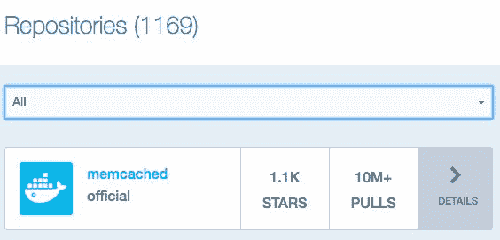

我们可以看到它找到了 1169 个仓库，排名第一的是官方仓库，拥有超过一千颗星和 1000 万次拉取。

1.  你现在可以通过点击下拉菜单来过滤搜索结果，选择了“All”选项：

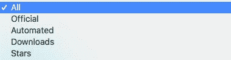

1.  让我们点击第一个结果，了解更多关于官方 memcached 仓库的信息：

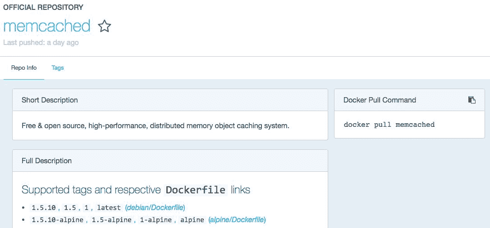

在这里，你可以看到与该镜像相关的很多信息。包括简短描述和完整描述。完整描述中有关于如何使用镜像、许可信息和不同版本的详细内容。在右侧，你可以看到 Docker 拉取命令 `docker pull memcached`。这是你可以运行的命令，用来拉取镜像，以便在你的 Docker 安装中使用。

# 基本用法 – 运行一个容器

我们不会深入探讨如何将 Docker 作为独立工具使用。本章的重点是使用 Docker 来配置 Vagrant 虚拟机，这一过程在 Vagrant 启动时进行。我们将学习一些基本的 Docker 命令——主要是那些在配置过程中使用的命令——以帮助你更好地理解发生了什么。

如果你不确定需要什么特定命令，或者想了解更多信息，可以运行`docker`命令，这将列出所有可用的命令。它会显示使用方法、命令选项、管理命令和常规命令。

请注意：你必须安装 Docker 才能运行这些命令，否则会收到错误提示。

# pull

要从 Docker Hub 拉取镜像，可以使用`docker pull`命令。该命令的一个示例是通过运行以下命令来拉取`nginx`镜像：

```
docker pull nginx
```

这将生成一个与以下截图类似的输出：

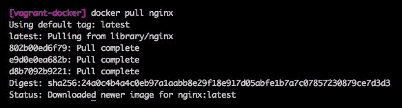

然后我们可以通过运行`docker images`命令来检查该镜像是否可用：

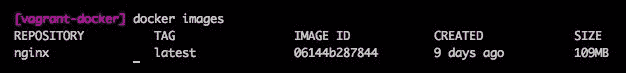

# run

要启动一个新的容器，可以使用`docker run`命令。该命令的一个示例是运行`nginx`镜像：

```
docker run nginx
```

这将启动 Nginx 容器。你不会在屏幕上看到除命令外的任何内容：

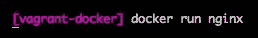

如果你在终端中打开另一个标签页并运行`docker ps -a`命令，你将看到所有正在运行的容器。在以下截图中，你将看到我们的 Docker 容器：

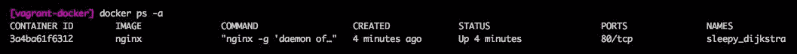

# stop

要停止 Docker 容器，可以使用`docker stop`命令。该命令的一个示例是运行以下命令：

```
docker stop sleepy_dijkstra
```

我们从前面的示例中传入了`sleepy_dijkstra`容器名称。通过运行`docker ps -a`我们找到了镜像名称。如果我们现在再次运行`docker ps -a`命令，我们会看到状态为`Exited (0) 3 seconds ago`。在下图中，你将看到这两个命令及其输出：

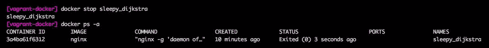

# start

此命令用于启动一个之前停止的 Docker 容器。为此，你可以使用`docker start`命令。该命令的一个示例是运行以下命令：

```
docker start sleepy_dijkstra
```

我们从前面的示例中传入了`sleepy_dijkstra`容器名称。通过运行`docker ps -a`我们找到了镜像名称。如果我们现在再次运行`docker ps -a`命令，我们会看到状态为`Up 4 seconds`。在下图中，你将看到这两个命令及其输出：

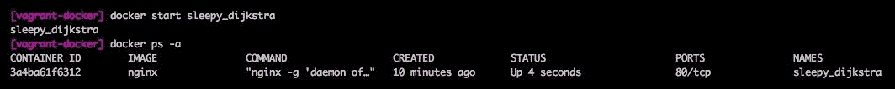

# search

你可以通过命令行使用`docker search`命令来搜索 Docker Hub。该命令的一个示例是使用以下命令搜索`ubuntu`：

```
docker search ubuntu
```

这将生成一个与以下截图类似的输出：

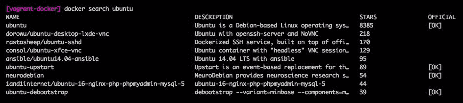

类似于在 Docker Hub 网站上搜索，你将看到一个搜索结果列表。结果按从高到低排序。你会看到镜像名称、描述、星级评分以及是否为官方镜像。然后，你可以使用`docker pull [imagename]`命令拉取一个镜像。

# 使用 Docker 来配置 Vagrant 机器

现在我们已经了解了 Docker 的一些基本知识，接下来是有趣的部分！在本节中，我们将通过一个示例来演示如何使用 Docker 配置 Vagrant 机器。需要注意的是，Vagrant 会尝试安装 Docker，这样你就不需要手动安装了。有趣的是，Docker 是在 Vagrant 机器内运行的，而不是在宿主机上运行。你将会看到，当你 SSH 进入 Vagrant 机器时，可以运行 Docker 命令。

让我们开始并使用 Docker 来配置我们的 Vagrant 机器：

1.  首先，运行`vagrant init -m`命令来创建一个最小化的 Vagrantfile。

1.  在我们的 Vagrantfile 中，添加一个配置块：

```
 Vagrant.configure("2") do |config|
     config.vm.box = "ubuntu/xenial64"
     config.vm.network "forwarded_port", guest: 80, host: 8081
     config.vm.provision "docker" do |doc|
         doc.run "nginx", args: "-p 80:80"
     end
 end
```

我们设置了一些默认值来开始。我们使用`"ubuntu/xenial64"`盒子，并指定网络配置使用从宿主机（`8081`端口）到来宾机（`80`端口）的端口转发。

在配置块中，我们将`docker`设置为我们的配置工具。我们使用`run`选项并传入`"nginx"`镜像。同时，在`run`选项的基础上，我们传入了`args`选项并将其值设置为`"-p 80:80"`，这告诉 Docker 将容器的端口映射到宿主机。这就是为什么我们将端口转发设置为来宾的`port 80`。因此，我们可以访问 Docker 容器：

1.  现在，让我们运行`vagrant up`命令以启动机器。在配置阶段，你应该会看到类似以下截图的内容：

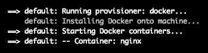

这里有几个步骤。首先，它会运行`docker`配置工具，然后将 Docker 安装到机器上。安装完成后，它会启动 Docker 容器（这是我们在 Vagrantfile 中通过`run`选项指定的），你会看到容器的输出为`-- 容器：nginx`。

1.  为了测试是否一切成功，我们可以打开浏览器并访问以下链接：`http://localhost:8081`。这应该会通过 Vagrant 的端口转发将我们连接到容器：

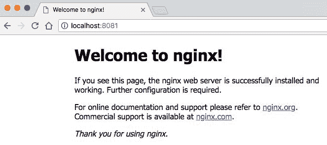

在前面的截图中，我们可以看到 Nginx 的默认欢迎页面。这是个好消息，意味着一切都在正常运行。

1.  我们还可以 SSH 进入 Vagrant 机器，通过终端访问 Docker。运行`vagrant ssh`命令即可访问。

1.  进入机器后，运行`docker ps -a`命令列出所有正在运行的容器：

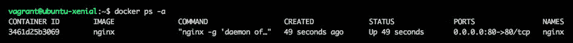

在前面的截图中，我们可以看到`nginx`容器正在运行。

恭喜！您已成功使用 Docker 配置 Vagrant 虚拟机。这是一个相当简单的过程，但非常强大。如果您在应用的其他部分使用 Docker，那么现在可以尝试在开发中使用它。

# Vagrant 中 Docker 的特定配置

关于 Vagrantfile 中与 Docker 相关的选项，没有必须的选项。如果不输入任何选项，那么 Vagrant 将简单地尝试安装 Docker —— 除非您已经安装了它。

# Images

如果要 Docker 使用特定的镜像，则可以在 Vagrantfile 中传递一个镜像名称数组。例如，您的 Vagrantfile 如下所示：

```
Vagrant.configure("2") do |config|
     config.vm.provision "docker", images: ["nginx"]
 end
```

这将尝试拉取 `nginx` 镜像。还有其他可以用来处理镜像的选项：`build_image` 和 `pull_images`；我们将在接下来的部分中讨论这些选项。

# build_image

除了运行和拉取镜像之外，您实际上可以在作为其过程一部分使用之前构建镜像。构建是在 Vagrant 客户机上完成的，并且必须对 Docker 可用。它运行 `docker build` 命令，所以您只需传递 Dockerfile 的位置。

在 Vagrantfile 中使用此选项的示例如下：

```
Vagrant.configure("2") do |config|
     config.vm.provision "docker" do |dock|
         dock.build_image "/vagrant/provision"
     end
 end
```

在此示例中，我们在 provision 块中使用 `dock.build_image` 键来设置目录（我们的 Dockerfile 所在的位置）。

# args

使用 `build_images` 键时，还有一个名为 `args` 的额外参数。这允许您传递作为 `docker build` 命令的一部分运行的参数。该值将作为字符串传递。

要在构建过程中添加 `--pull` 标志（始终尝试拉取镜像的最新版本），Vagrantfile 可能如下所示：

```
Vagrant.configure("2") do |config|
     config.vm.provision "docker" do |dock|
         dock.build_image "/vagrant/provision", args: "--pull"
     end
 end
```

要传递多个参数/标志，只需将它们添加到字符串中即可。无需使用数组。

# pull_images

在配置过程中处理镜像的另一种方法是在 Vagrantfile 中使用 `pull_images` 选项。此选项将尝试从 Docker 注册表中拉取镜像并使用这些镜像。

一个示例 Vagrantfile 如下所示：

```
Vagrant.configure("2") do |config|
     config.vm.provision "docker" do |dock|
         dock.pull_images "nginx"
         dock.pull_images "mysql"
     end
 end
```

此代码尝试拉取 `nginx` 和 `mysql` 镜像。`pull_images` 选项可以多次使用，并将它们附加在一起，而 `images` 选项只能使用一次。

# run

`run` 选项用于在 Vagrantfile 中启动和运行特定的 Docker 容器。这在 `vagrant up` 过程中完成。它运行 `docker run` 命令来实现此目的。

在 Vagrantfile 中如何使用它：

```
Vagrant.configure("2") do |config|
     config.vm.provision "docker" do |dock|
         dock.run "nginx"
     end
 end
```

在上述示例中，我们正在指示 Docker 配置程序运行 `nginx` 容器。您可以多次使用 `run` 选项，但如果使用相同的镜像，则必须为它们定义不同的名称/标识符。以下是使用 `nginx` 镜像两次并使用不同名称的示例：

```
Vagrant.configure("2") do |config|
     config.vm.provision "docker" do |dock|
         dock.run "load-balancer", image: "nginx"
         dock.run "web-server", image: "nginx"
     end
 end
```

一个可以被识别为负载均衡器，另一个作为 Web 服务器。你可以在这里选择名称，但我发现描述性名称通常是最好的，最容易理解的。

# 镜像

这实际上是使用`run`选项时的默认值，它是你传递的第一个参数，例如镜像名称。然而，当你希望运行两个相同的镜像时，可以将其作为选项传递，就像前面的示例一样。

在你的 Vagrantfile 的配置块中，示例如下：

```
dock.run "lb1", image: "nginx"
```

在前面的示例中，我们引用了`run`选项和`image`选项。我们选择的镜像是`nginx`。

# 命令

这个`cmd`选项允许你传递一个将在容器内运行的命令。如果省略此值，则会使用容器的默认值。这可能是 Dockerfile 中提供的`cmd`值。

在你的 Vagrantfile 的配置块中，示例如下：

```
dock.run "ubuntu", cmd: "echo $HOME"
```

在前面的示例中，我们引用了`run`选项和`cmd`选项。`cmd`选项将简单地在容器内运行该命令。它仅访问`$HOME`环境变量，这是用户的主目录路径。

# 参数

使用`args`选项允许你将参数传递给`docker run`命令。这类似于在`build_image`部分使用的额外`args`选项。如果你需要比一般命令更细粒度的设置，这将非常有用。

在你的 Vagrantfile 的配置块中，示例如下：

```
dock.run "ubuntu", args: "--name ubuntumain"
```

在前面的示例中，我们引用了`run`命令和`args`选项。`args`选项将在需要时传递参数给`docker run`命令。在我们的示例中，它传递了`--name`标志，并将其值设置为`ubuntumain`。这将是容器的名称。

# 自动分配名称

使用`auto_assign_name`选项允许你自动为 Docker 容器命名。它的工作原理是通过传递`--name`标志和一个值来实现的。默认情况下启用此功能，且值为 true。需要注意的一点是，镜像名称中的任何斜杠（例如，`base/archlinux`）都将被替换为短横线，因此镜像将变为`base-archlinux`。名称由 `run` 的第一个参数选择。

在以下示例中，我们将`run`选项的值设置为`nginx`，以便容器会自动命名为`nginx`。唯一可以覆盖此设置的方式是将`auto_assign_name`值设置为`false`，我们将在下面执行此操作：

```
dock.run "nginx", auto_assign_name: false
```

# 守护进程化

这个选项允许你将容器守护进程化。此选项的默认值为 true，它将`-d`标志传递给`docker run`命令。如果你不希望守护进程化容器，可以将该值设置为 false。

在你的 Vagrantfile 的配置块中，示例如下：

```
dock.run "nginx", deamonize: false
```

在前面的示例中，我们使用了 `run` 选项和 `deamonize` 选项。deamonize 选项传递了 false 值，让 Docker 知道我们不希望它作为守护进程运行，因此 `-d` 标志不会传递给 Docker。

# restart

这个选项允许你设置容器的重启策略。默认值为 `always`，但它也支持 `no`、`unless-stopped` 和 `on-failure`。如果你有特定的需求，并且需要控制一个或多个容器的重启策略，这个选项可能会很有用。

你 Vagrantfile 配置块中的一个示例如下：

```
dock.run "nginx", restart: "no"
```

在前面的示例中，我们使用了 `run` 选项和 `restart` 选项。restart 选项传递了 `no` 值，告诉 Docker 在容器退出时不要重启。

# post_install_provisioner

使用 `post_install_provisioner` 选项为你提供了一种在原始配置器运行后运行一个新的配置器的简单方法。这听起来有点混乱，但它本质上允许你在 Docker 配置块内创建一个新的配置块。你可以将 Docker 作为主要配置器，然后在其中使用一个 shell 配置器，当 Docker 配置器完成时，shell 配置器将运行。

一个示例 Vagrantfile 看起来是这样的：

```
Vagrant.configure("2") do |config|
    config.vm.box = "ubuntu/xenial64"
    config.vm.network "forwarded_port", guest: 80, host: 8081
    config.vm.provision "docker" do |dock|
        dock.post_install_provision "shell", inline:"touch /vagrant/index.html && echo '<h1>Hello World!</h1>' > /vagrant/index.html"
        dock.run "nginx",
            args: "-p 80:80 -v '/vagrant:/usr/share/nginx/html'"
    end
end
```

上述代码将运行 `nginx` Docker 镜像，然后使用 shell 配置器。Shell 配置器将在 Vagrant 虚拟机内部运行一个脚本，简单地修改 Nginx 默认登录页面的内容。

当你运行前面的示例时，你应该能够在宿主机上访问 `http://localhost:8081`（当配置完成后），并看到一个大的 `Hello World!` 消息。

# 总结

在本章中，我们学习了 Docker 以及如何使用它来配置 Vagrant 虚拟机。我们还学习了 Docker 的工作原理、如何使用 Docker Hub，以及可用的各种 Docker 特定的 Vagrantfile 选项。现在你应该能够将 Docker 作为提供者进行实验。

在第十三章，*Puppet – 使用 Puppet 来配置 Vagrant Box*，你将学习如何使用 Puppet 来配置 Vagrant 虚拟机。我们将重点介绍两种主要的支持类型——Puppet Apply 和 Puppet Agent。
