# Puppet - 使用 Puppet 配置 Vagrant Box

在本章中，我们将继续学习配置过程，并了解如何使用 Puppet 软件配置 Vagrant 机器。本章中，你将学习以下主题：

+   了解 Puppet

+   Puppet apply 和 Puppet agent 是什么

+   Puppet 清单是什么

+   如何使用 Puppet 配置 Vagrant 机器

在本章结束时，你将对 Puppet 如何与 Vagrant 一起工作来配置机器有一个很好的理解。

# 了解 Puppet

Puppet 是一种配置管理工具，用于部署、配置和管理节点（服务器）。

Puppet 由 Luke Kanies 于 2005 年发布，采用 C++ 和 Clojure 编写，并运行在 Linux、Unix 和 Windows 上。当前版本是 5.5.3，于 2018 年 7 月发布。作为一款软件，Puppet 属于基础设施即代码（Infrastructure as Code）类别，这意味着你通过代码和配置文件来进行配置和修改。Puppet 使用清单文件来帮助配置节点/服务器（我们将在后面的章节中深入学习）。

Puppet 使用拉取配置（主从）架构，其中节点（Puppet 代理）从主服务器拉取配置文件和更改。在这个主从过程中，有一个四步生命周期：

1.  节点将有关自身的事实发送给主服务器。

1.  主服务器使用这些事实来编译一个目录，描述节点应如何配置。然后，它将目录发送回节点。

1.  节点使用目录根据清单文件中描述的内容配置自身至预期状态。

1.  节点现在将向主服务器发送报告，包含任何更改或错误。这些报告随后可以在 Puppet 仪表板中查看。

Puppet 还支持多主架构，以减少停机时间并提供高可用性。当主服务器故障或遇到任何问题时，另一个主服务器可以替代它。Puppet 代理随后将轮询这个新的主服务器，查看是否有任何配置更改。

作为配置过程的一部分，Puppet 执行多个步骤，将配置文件中的代码转换并将节点配置到预期状态。

# 资源

Puppet 配置通常从资源开始。你可以把资源看作是描述节点某部分预期状态的代码。这可能是一个需要安装的特定包，例如 nginx。

# 清单

Puppet 程序被称为清单。清单包含 Puppet 配置代码，并以 `.pp` 文件扩展名结尾。这些代码块就是我们在前一节中提到的资源。

# 编译

编译过程是当 Puppet 主服务器将清单文件编译成目录时进行的。该目录随后被节点用于配置和达到预期状态。

# 目录

Puppet 目录是由主服务器创建的文档。它是通过编译 Puppet 清单文件生成的。它也可以处理多个清单文件。然后，目录由节点使用来设置所需的系统状态。

# Apply

如果一个节点/服务器有一个目录，那么它必须将该配置应用到自己。这是安装必要的文件、服务和软件的过程。它允许节点达到期望的状态。

# 期望状态

当谈论 Puppet 和配置时，你会听到*期望状态*。就 Puppet 而言，它仅仅意味着节点/服务器已经完全配置，并且现在处于正确的状态。软件和服务已经安装并正常运行。

# Puppet apply 和 Puppet agent

在本节中，我们将了解 Vagrant 中提供的两种 Puppet 配置选项——`puppet apply`和`puppet agent`。在接下来的部分，我们将使用这两种选项来配置我们自己的 Vagrant 机器。

# Puppet apply

使用 Puppet apply 选项为 Vagrant 机器提供服务，可以让你在不需要 Puppet 主机的情况下使用 Puppet。它通过在客户机上调用`puppet apply`命令来工作。如果你没有 Puppet 主机，或者只是需要快速启动并运行，这将对测试 Puppet 配置很有帮助。

# 选项

使用 Puppet apply 时，有 14 个不同的选项可用。这些选项可以在你的 Vagrantfile 中应用，并帮助你对 Puppet 提供程序进行更多的控制：

+   `binary_path`:

**类型**: `string`

**描述**: 这是客机上 Puppet 的 bin 目录的路径。

+   `facter`:

**类型**: `hash`

**描述**: 这是一个包含可用 facter 变量（也称为 facts）的 hash。

+   `hiera_config_path`:

**类型**: string

**描述**: 这是（位于主机上的）hiera 配置文件的路径。

+   `manifest_file`:

**类型**: `string`

**描述**: 这是 Puppet 将使用的清单文件的名称。默认值是`default.pp`。

+   `manifests_path`:

**类型**: `string`

**描述**: 这是包含清单文件的目录路径。默认值是`manifests`。

+   `module_path`:

**类型**: `string`/`array of strings`

**描述**: 这可以是包含任何 Puppet 模块的目录路径（位于主机上）。

+   `environment`:

**类型**: `string`

**描述**: 这是 Puppet 环境的名称。

+   `environment_path`:

**类型**: `string`

**描述**: 这是包含环境文件的目录路径（位于主机上）。

+   `environment_variables`:

**类型**: `hash`

**描述**: 这是一个环境变量集（以键/值对的字符串形式），将在 Puppet apply 运行之前使用。

+   `options`:

**类型**: `array of strings`

**描述**: 这些是 Puppet 执行时可以传递给 Puppet 可执行文件的选项。

+   `synced_folder_type`:

**类型**: `string`

**描述**：此选项允许您指定要使用的同步文件夹类型。默认情况下将使用同步文件夹类型。

+   `synced_folder_args`:

**类型**：`array`

**描述**：这是一个传递给文件夹同步的参数数组（值）。您可以根据所选择的同步文件夹类型发送特定的参数（参见前面的选项）。

+   `temp_dir`:

**类型**：`string`

**描述**：这是 Puppet 运行数据将存储的目录（在客户端机器上），例如清单文件。

+   `working_directory`:

**类型**：`string`

**描述**：这是 Puppet 运行时的工作目录（在客户端机器上）。

# Puppet 代理

在使用 Puppet 代理来配置 Vagrant 虚拟机时，您需要连接到一个 Puppet 主服务器。主服务器将提供模块和清单供节点使用。该配置程序通过使用 `puppet agent` 命令来工作，该命令由 Puppet 提供。

# 选项

在 Vagrant 中使用 Puppet apply 时，有七个不同的选项。这些选项将应用到您的 Vagrantfile 中，可以帮助您更好地控制 Puppet 配置程序：

+   `binary_path`:

**类型**：`string`

**描述**：这是 Puppet 的 bin 目录在客户端机器上的路径。

+   `client_cert_path`:

**类型**：`string`

**描述**：这是节点的客户端证书的路径。默认值为空，表示不会上传客户端证书。

+   `client_private_key_path`:

**类型**：`string`

**描述**：这是节点的客户端密钥的路径。默认值为空，表示不会上传客户端密钥。

+   `facter`:

**类型**：`hash`

**描述**：这是可用的 facter 变量（也称为事实）的哈希值。

+   `options`:

**类型**：`string`/`array`

**描述**：这些是运行 puppet agent 命令时可以传递给 Puppet 的选项。

+   `puppet_node`:

**类型**：string

**描述**：这是您希望为节点指定的名称。如果未设置值，则 Vagrant 将尝试使用主机名（如果在 Vagrantfile 中设置）或回退到使用的 box 名称。

+   `puppet_server`:

**类型**：`string`

**描述**：这是 Puppet 服务器的主机名。如果未设置值，则默认值将设置为 `puppet`。

# Puppet 清单示例和语法

清单是一个 Puppet 程序。它由告诉 Puppet 执行操作的代码组成，如执行命令、安装软件和运行服务。清单文件或多个清单文件是模块的主要部分之一。清单文件使用 `.pp` 文件扩展名，并可以在 `manifests` 文件夹中找到。

在清单文件中可以找到各种部分，如 exec、package、service 和 file。让我们深入了解清单文件的语法。

# 语法

清单文件包含声明的资源，这些资源可以分组到类中。清单文件使用一种称为 Puppet 的领域特定语言，这种语言类似于 YAML 或 Ruby（在编写 Vagrantfile 时）。

这是一个示例清单，它安装并运行 nginx web 服务器。让我们创建一个新的清单并将其命名为 `nginx.pp`：

```
package { "nginx":
     ensure => installed
 }

 service { "nginx":
     require => Package["nginx"],
     ensure => running,
     enable => true
 }
```

在上述示例中，有几点需要注意。每个资源（部分）从类别开始。我们使用了两种类别——包和服务。在资源块中，我们将值放在大括号 `{}` 中，然后引用名称（`nginx`）并设置所需的值。

在资源块中，我们使用了几个关键字——ensure、require 和 enable。这些关键字有助于描述节点达到期望状态时应该发生的事情。`ensure` 关键字用于确保包或服务执行你想要的操作，例如安装或运行。`require` 关键字用于当某个特定资源依赖另一个资源时。在服务资源中，我们使用了 `enable` 关键字，它允许我们指定服务是否启用。如果你需要在测试时临时禁用某个服务，它会很有用。

你可以通过使用井号/井号符号将注释添加到清单文件中。以下是一个示例：

```
# This comment wont be parsed by Puppet but it will be useful for other developers/DevOps
```

# 使用 Puppet 进行配置

现在进入令人兴奋的部分！我们将使用 Puppet apply 和 Puppet agent 来配置 Vagrant 机器。我们将查看这两种选项，并安装 nginx web 服务器。我们将使用 Vagrantfile 作为基础进行配置，同时还会添加 Puppet 特定的配置，如清单。

# 使用 Puppet apply 进行配置

Vagrant 中的 Puppet apply 配置选项允许你快速启动和运行 Puppet。使用此选项时，你无需独立的 Puppet 主服务器。让我们开始吧：

1.  为这个项目创建一个新目录，并进入该目录。

1.  创建一个目录，并命名为 `manifests`。

1.  在 manifests 文件夹中，创建一个名为 `nginx.pp` 的清单文件。在此文件中，我们将插入以下指令：

```
 package { "nginx":
     ensure => installed
 }
 service { "nginx":
     require => Package["nginx"],
     ensure => running,
     enable => true
 }
```

让我们逐步解析这个清单文件。首先，我们执行 `apt-get update` 命令以更新 Ubuntu 中的包。然后我们安装 nginx 包，并将其作为服务启动。我们确保它正在运行并已启用。

1.  回到 Vagrant。让我们运行 `vagrant init -m` 命令来创建一个最小化的 Vagrantfile。

1.  让我们在 Vagrantfile 中添加一些配置：

```
 Vagrant.configure("2") do |config|
     config.vm.box = "ubuntu/xenial64"
     config.vm.network "private_network", ip: "11.11.11.11"
     config.vm.provision "shell", :inline => <<-SHELL
         apt-get update
         apt-get install -y puppet
     SHELL
     config.vm.provision "puppet" do |pup|
         pup.manifest_file = "nginx.pp"
     end
 end
```

我们来逐步解析 Vagrantfile。首先，我们设置盒子使用 Ubuntu Xenial 64 位，然后将网络设置为使用私有网络和静态 IP 地址 `11.11.11.11`。我们需要在来宾机器上安装 Puppet，否则你将收到以下错误：

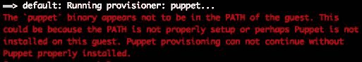

为了绕过这个错误，我们使用 `shell` 供应商首先更新包，并在我们的 Ubuntu 箱上安装 Puppet 软件。完成后，Puppet 供应商将开始运行。它将安装并启动 nginx：

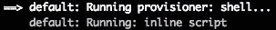

前面的截图显示了 shell 供应商。在下面的截图中，您可以看到 Puppet 供应商：

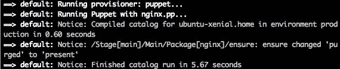

1.  完成后，在浏览器中访问 `http://11.11.11.11`，您应该看到 nginx 的默认页面：

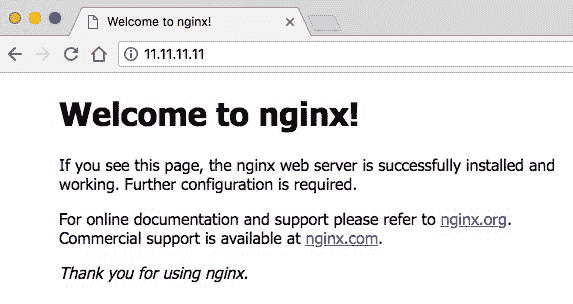

我们还可以通过使用 `vagrant ssh` 命令 SSH 进入 Vagrant 机器来检查 Puppet 是否正在运行。进入后，运行 `puppet help` 命令。我们应该看到类似下面截图的输出：

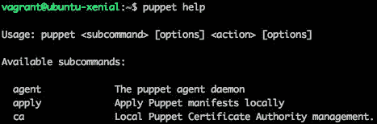

恭喜！您已成功使用 Puppet apply 配置了 Vagrant 机器。您已创建了一个 Vagrantfile 和一个 Puppet 清单文件，安装了 nginx，并测试了服务是否正确运行。

这是一个相当简单的例子，但 Puppet 实际上是一个非常灵活和强大的供应商。使用 Puppet 和 Vagrant 你可以做很多事情。我建议你通过测试一些可用的选项来进行实验和学习更多。

# 使用 Puppet agent 供应商

在使用 Puppet 作为供应商的第二个选项是 Puppet agent。尽管这个选项增加了复杂性（需要 Puppet 主服务器），但在涉及 Vagrant 时本地需要的配置较少。我们不会在主机上创建清单文件或任何与 Puppet 相关的配置。所有这些都将由 Puppet 主服务器处理。

Puppet agent 只是作为从服务器接收命令的客户端。在下面的示例中，我们将创建一个多机设置，用于提供 Puppet 主和 Puppet agent 机器：

1.  让我们首先创建一个新目录并进入其中。我将称其为 `vagrant-puppet-agent` 并使用以下注释来创建和移动它：

```
 mkdir vagrant-puppet-agent && cd vagrant-puppet-agent
```

1.  在我们的新目录中，通过运行 `vagrant init -m` 命令可以创建一个 Vagrantfile。

1.  现在我们需要编辑我们的 Vagrantfile，这需要相当多的配置。对于使用 `puppet_server` / Puppet agent 供应选项，不是所有这些都是必需的，但我们还在创建一个 Puppet 主服务器：

```
Vagrant.configure("2") do |config|
     config.vm.box = "ubuntu/xenial64"
         # Puppet master configuration
         config.vm.define "puppetmaster" do |pm|

                 pm.vm.provider "virtualbox" do |v|
                         v.memory = 2048
                         v.cpus = 2
                 end

                 pm.vm.network "private_network", ip: "10.10.10.11"

                 pm.vm.provision "shell", :inline => <<-SHELL
                         sudo echo "10.10.10.11 master.example.com" | sudo tee -a /etc/hosts
                         sudo echo "10.10.10.12 node.example.com" | sudo tee -a /etc/hosts
                         wget https://apt.puppetlabs.com/puppetlabs-release-pc1-xenial.deb
                         sudo dpkg -i puppetlabs-release-pc1-xenial.deb
                         sudo apt-get update -y
                         sudo apt-get install -y puppetserver
                         sudo awk '{sub(/-Xms2g -Xmx2g -XX:MaxPermSize=256m/,"-Xms512m -Xmx512m")}1'                   /etc/default/puppetserver > tmp.txt && mv tmp.txt /etc/default/puppetserver
                         sudo echo "*" | sudo tee -a /etc/puppetlabs/puppet/autosign.conf
                         sudo echo "autosign = true" | sudo tee -a /etc/puppetlabs/puppet/puppet.conf
                         sudo echo "certname=master.example.com" | sudo tee -a /etc/puppetlabs/puppet/puppet.conf
                         sudo echo "[agent]" | sudo tee -a /etc/puppetlabs/puppet/puppet.conf
                         sudo echo "certname=node.example.com" | sudo tee -a /etc/puppetlabs/puppet/puppet.conf
                         sudo echo "exec { 'apt-get update': path => '/usr/bin' } package { "nginx": ensure => installed } service { "nginx": require => Package["nginx"], ensure => running, enable => true }" | sudo tee -a /etc/puppetlabs/code/environments/production/manifests/default.pp
                         sudo systemctl enable puppetserver
                         sudo systemctl start puppetserver
                 SHELL
         end

         # Puppet Node configuration
         config.vm.define "pnode" do |pn|

                 pn.vm.network "private_network", ip: "10.10.10.12"

                 pn.vm.provision "shell", :inline => <<-SHELL
                 sudo echo "10.10.10.11 master.example.com" | sudo tee -a /etc/hosts
                 sudo echo "10.10.10.12 node.example.com" | sudo tee -a /etc/hosts
                 apt-get update
                 apt-get install -y puppet
                 sudo puppet agent --enable
                 sudo echo "autosign = true" | sudo tee -a /etc/puppet/puppet.conf
                 sudo echo "certname=master.example.com" | sudo tee -a /etc/puppet/puppet.conf
                 sudo echo "[agent]" | sudo tee -a /etc/puppet/puppet.conf
                 sudo echo "certname=node.example.com" | sudo tee -a /etc/puppet/puppet.conf
         SHELL

         pn.vm.provision "puppet_server" do |pup|
                 pup.puppet_node = "nginxplease"
                 pup.puppet_server = "master.example.com"
                 pup.options = "--verbose --waitforcert 10"
         end

     end
 end
```

这是我们迄今为止创建的最大的 Vagrantfile，但它涵盖了很多配置，并创建了多个 Vagrant 机器。让我们逐步分解它：

1.  我们首先将箱子设置为使用 Ubuntu Xenial 64 位（这将适用于两台机器，因为它在它们的配置块之外）。

1.  其次，我们定义了一个`puppetmaster`块，用于配置 Puppet 主机。在此块中，有大量自定义配置。其中一些部分用于帮助抑制错误，并不总是必需的。我们需要一台强大的机器以满足最低要求，因此我们将设置 RAM 内存和 CPU 数量。然后我们创建一个 shell 提供器，安装 Puppet 服务器软件并对多个文件进行各种配置更改。

1.  第三步，我们定义了一个`pnode`配置块，用于配置 Puppet 节点/代理机。我们使用 shell 提供器安装 Puppet 并对多个文件进行配置更改。我们还设置了提供器使用`puppet_server`，也就是 Puppet 代理。我们设置节点名称、服务器主机和一些附加选项，这些选项将在 Puppet 执行时传递给命令。

1.  现在我们运行`vagrant up --provision`命令。这将需要一些时间，因为它必须先配置 Puppet 主机，然后再配置 Puppet 代理机。

在 `up` 过程中，你将看到大量输出——主要是绿色的，也有一些红色的。不要太担心红色输出，因为在我们的场景中它不是错误，而是另一层输出。绿色是来自 Vagrant 虚拟机的输出，而红色可能是来自运行在 Vagrant 虚拟机中的 Puppet 主机的输出。

1.  我们将首先看到 Puppet 主机提供器开始工作。在此过程中，我们还会看到来自 `echo` 语句的输出，该语句将两个记录添加到`/etc/hosts`文件中：

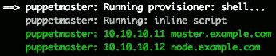

在配置 Puppet 主机接近尾声时，我们会看到更多输出信息，同时我们会将额外的信息添加到`puppet.conf`文件中。在红色部分，我们可以看到 Puppet 主机的输出，表示它正在启动服务：

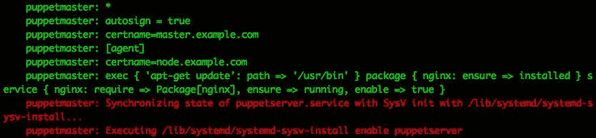

1.  现在我们开始配置第二台 Vagrant 虚拟机，它在本例中充当客户端/节点，并使用 Vagrant 提供选项`puppet_server`。我们将看到节点创建并缓存一个 SSL 证书：

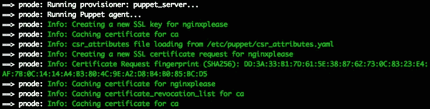

在节点配置完成后，我们将看到它正在`retrieving pluginfacts`（检索插件信息），然后是`applying configuration`（应用配置）。它将创建一个 YAML 文件来存储状态，然后使用清单来达到`desired state`（期望状态）。在以下截图中，我们可以看到这一步骤在 7.14 秒内迅速完成：

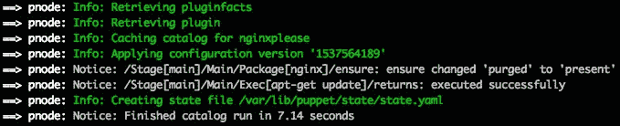

现在，让我们检查确保我们的 Puppet 配置已正确工作，并且我们的节点已处于所需状态（正在运行 nginx）。在浏览器中访问 `http://10.10.10.12`，你应该能看到 nginx 的默认页面：

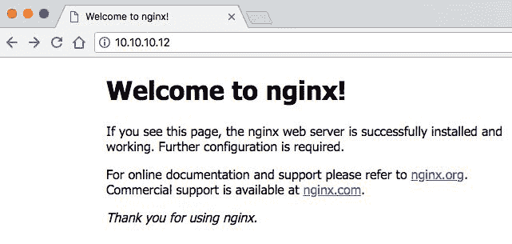

我们也可以单独通过 SSH 登录到各台机器，查看它们的状态。运行 `vagrant status` 命令查看每台机器的状态及其名称（因为我们需要这些信息来执行 SSH 命令）：

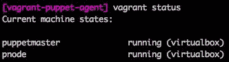

首先，我们通过运行`vagrant ssh puppetmaster`命令 SSH 进入 Puppet 主机。进入后，运行`puppetserver --version`命令确认一切正常运行，并查看当前版本：

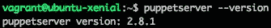

现在，让我们通过运行`vagrant ssh pnode`命令 SSH 进入 Puppet 节点/代理。进入后，运行`puppet --version`命令确认一切正常运行，并查看当前版本：

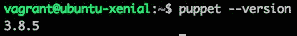

如果你希望停止两个机器，可以运行`vagrant halt`命令。通过这样做，你可以运行`vagrant destroy`命令删除机器状态和任何相关文件。

恭喜！你已经成功地使用 Puppet agent 选项配置了一个 Vagrant 机器。我们通过在 Vagrant 中使用多机器选项以及各种配置和网络选项，创建了一个传统的 Puppet 服务器和客户端设置。

# 总结

在本章中，我们了解了所有关于 Puppet 的内容，以及如何将其作为 Vagrant 机器的配置工具。我们还学习了 Puppet 的两种支持的配置方法：Puppet apply 和 Puppet agent。

在第十四章，*Salt - 使用 Salt 配置 Vagrant Box*，我们将专注于 Vagrant 支持的另一种配置工具。我们将学习 Salt 及其如何用于配置 Vagrant 机器。你将深入了解 Salt 以及 Salt 状态。
