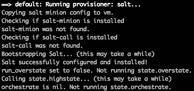
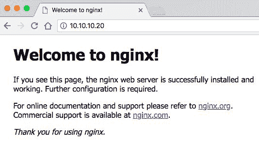

# Salt - 使用 Salt 配置 Vagrant Box

你已经到达了本书的最后一章，以及我们的配置迷你系列。在本章中，我们将更深入地了解可以与 Vagrant 一起使用的 Salt 配置工具。在本章结束时，你将对如何使用 Salt 配置 Vagrant 有一个清晰的理解，并进一步了解 Salt 作为一款独立的配置管理软件。我们将学习 Salt 及其工作原理。

具体来说，我们将涵盖以下主题：

+   了解 Salt

+   Salt 状态

+   Salt 状态的语法

+   使用 Salt 配置 Vagrant 机器

+   使用 Salt 时 Vagrantfile 的可选项

# 了解 Salt

Salt 是配置和基础设施作为代码家族的另一员。它可以直接与 Chef、Ansible 和 Puppet 进行比较。Salt 是用 Python 语言编写的，首次发布于 2011 年 3 月。

Salt 有时被称为 SaltStack 平台。这是因为该软件采用了模块化的方法设计和构建。其可扩展、灵活的方式使你可以添加和移除模块。

Salt 有一个主要的设置——客户端和服务器。你可以将其视为 Puppet 主控和 Minion 设置。Salt 使用服务器（Master）和客户端（Minion）进行配置管理。Salt 支持的另一种设置选项称为**Masterless**（无主模式）。

# Salt Master

Salt Master 用于管理基础设施及其中的服务器。它可以向 Minion 服务器发送远程执行命令并管理它们的状态。它还可以在主控层级设置中运行，其中命令可以通过更低层级的 Master 服务器传递。Salt Master 管理 Salt Minion，并用来捕捉从 Minion 发送的**grain**数据。然后它可以使用这些数据来决定如何管理特定的 Minion。它运行一个名为`salt-master`的守护进程。

# Salt Minion

Salt Minion 是一个通常由 Salt Master 控制的服务器/机器。Minion 也可以在`masterless`（无主模式）设置中运行。Salt Minion 运行一个名为`salt-minion`的守护进程，其主要目的是执行从 Master 发送的命令，报告数据并以**grain**的形式发送有关自身的信息。

# 模块

Salt 提供了六种不同的模块。每种模块都提供不同的操作或功能。我们将在这里深入了解每个模块。

# 执行

你可以将执行模块视为`ad hoc`命令。这些命令在 Minion（命令行）机器/节点上运行。它们是使用 Python/Cython 编写的。

# 状态

状态是 Salt 配置管理的核心部分。状态是一个文件，用来配置和描述机器应处于的状态。这与 Puppet 清单类似，后者描述了机器的期望状态。

# Grains（粒度）

Grains 是关于 Minion 的静态信息。这些信息包括有关 Minion 的核心细节，例如操作系统、型号、内存等，这些数据会在初次连接时收集并发送到 Master。这可以帮助 Master 针对不同的 Minion 群组进行目标设定，例如指定操作系统类型。

# 渲染器

在 Salt 中，渲染器用于将 **Salt 状态文件**（**SLS**）中描述的数据类型转换为 Python，以便 Salt 进行处理和使用。一个常见的例子是将一个 SLS 文件渲染为 Jinja 模板，然后解析为 YAML 文档。目前支持几种不同的组合：

+   Jinja 和 YAML

+   Mako 和 YAML

+   Wempy 和 YAML

+   Jinja 和 JSON

+   Mako 和 JSON

+   Wempy 和 JSON

# 返回器

在 Salt 中，返回器用于处理和输出在 Minion 机器上运行命令的结果。输出/结果数据总是返回到 Master，但使用返回器允许你决定数据的去向。你可以选择任何可以接收数据的服务，例如 Redis 或 MySQL。这些数据可以用于分析或存档，帮助你更好地了解 Minions 上发生的情况，以及哪些命令执行得最好。

# 执行器

Salt 执行器与执行模块非常相似。唯一的区别是执行器是一个在 Master 服务器上执行的命令。执行器可以简单也可以复杂。可以使用 `salt-run` 命令运行它们。

# Salt 状态

Salt 状态也被称为状态模块。它们构成了 Salt 中状态系统的重要部分。Salt 状态用于描述应该在 Minion 上安装哪些软件包，以及其他选项，如用户帐户、正在运行的服务和文件夹权限。接下来我们将看一下 Salt 状态语法。

# 语法和示例

Salt 状态文件通常位于 `roots` 目录下。它采用 `.sls` 文件扩展名，并使用 **另一种标记语言**（**YAML**）格式存储内容。Salt 状态文件内部有一定的层级结构，根据需求和配置，这个层级结构可能相当深。

让我们分解一个示例 Salt 状态文件：

```
lampstack:
     pkg.installed:
         - pkgs:
         - mysql-server
         - php5
         - php-pear
         - php5-mysql
```

我们首先为本节设置一个名称，在这个示例中它被称为 `lampstack`。然后我们调用 `pkg.installed`，它验证某些软件包是否已安装。我们使用 `- pkgs` 选项并设置 `- mysql-server`、`- php5`、`- php-pear` 和 `- php5-mysql` 等值。

# 使用 Salt 配置 Vagrant

让我们进入本章的主要部分：使用 Salt 配置 Vagrant 虚拟机。在本节中，我们将研究 `masterless` 配置设置。我们将学习如何将 Nginx Web 服务器安装到我们的 Vagrant 虚拟机上：

1.  为此示例创建一个新的文件夹/目录。我将我的命名为 `vagrant-salt`。

1.  进入新文件夹并运行 `vagrant init -m` 命令以创建一个新的 Vagrantfile。

1.  我们需要为 Salt 创建一些文件夹和文件。创建一个 `roots` 文件夹和一个 `minionfiles` 文件夹。在 `roots` 文件夹内，创建一个名为 `top.sls` 的文件并输入以下内容：

```
 base:
     '*':
         - base
```

在同一文件夹（`roots`）内，创建另一个名为 `base.sls` 的文件并输入以下内容：

```
 nginx:
     pkg.installed:
         - name: nginx
```

顶部文件决定了要目标的主机。我们可以在这里使用 `*` 图标来表示我们将目标定位到所有主机。虽然这并不总是最佳选择，但在这种情况下是可行的。它还决定了使用哪个 Salt 文件。`- base` 值表示我们创建的 `base.sls` 文件。

`base.sls` 文件非常简洁。它规定应该安装 `nginx` 包（`pkg`）。现在，让我们进入 `minionfile` 文件夹并创建我们的基础 Minion 文件。创建 `minion.yml` 文件并输入以下内容：

```
 master: localhost
 file_client: local
```

在这里，我们将 `master` 值设置为 `localhost`（因为我们使用的是无主设置），并将 `file_client` 也设置为 `local`。保存这些文件并返回到 Vagrantfile 所在的 `roots` 文件夹。

1.  设置 Vagrantfile。编辑文件以包含以下内容：

```
 Vagrant.configure("2") do |config|
     config.vm.box = "ubuntu/xenial64"
     config.vm.network "private_network", ip: "10.10.10.20"
     config.vm.synced_folder "roots/", "/srv/salt"
     config.vm.provision :salt do |sa|
         sa.masterless = true
         sa.minion_config = "minionfiles/minion.yml"
         sa.run_highstate = true
     end
 end
```

Vagrantfile 文件相当简洁，但有许多可供配置 Salt 的选项。在接下来的章节中，你将了解更多这些选项。

在这个 Vagrantfile 中，我们首先设置了使用 Ubuntu Xenial 64 位的 box，并设置了私有网络 IP 地址为 `10.10.10.20`。然后，我们设置了 Vagrant 的 `synced_folder` 选项，将我们的 `roots` 文件夹与 Salt 共享，以便它可以访问我们的 `top.sls` 和 `base.sls` 文件。在接下来的部分，我们设置了 provision 块来使用 Salt 并设置一些基本值。我们将 Masterless 选项设置为 `true`，并将 `minion_config` 设置为使用我们在 `minionfiles` 文件夹内创建的 `minion.yml` 文件。我们还将 `run_highstate` 选项设置为 `true`，以抑制任何错误并运行文件。

1.  保存 Vagrantfile 文件并运行 `vagrant up --provision` 来启动 Vagrant 机器。

1.  在 `vagrant up` 过程中，我们将看到一些新输出，这些输出是由 Vagrantfile 和 Salt 配置选项定义的。我们将首先看到文件夹同步的设置。在以下截图中，我们可以看到 Vagrant 的 `/srv/salt` 文件夹链接到主机上的 `/roots` 文件夹：


然后我们将看到 `Running provisioner: salt...` 部分，这里会显示来自 Salt 提供程序的输出。我们可以看到 Salt 检查了许多内容，例如是否安装了 `salt-minion`，或者输出 `Salt successfully configured and installed!`。

Salt 已经安装，并且 Salt 状态文件和 minion 文件已经解析并执行：



一旦完成并且 Vagrant 机器运行起来，打开网页浏览器并访问我们在 Vagrantfile 中设置的私有网络 IP 地址。打开 `http://10.10.10.20`，你应该能看到默认的 Nginx 欢迎页面：



恭喜！您已成功使用 Salt 配置了一个 Vagrant 虚拟机。我们使用了`sls`文件来指定安装 Nginx 包。这里有许多不同的选项可以实验，特别是在使用主节点和 minion 配置时。

# Vagrant 中的 Salt 选项

由于 Salt 本质上已内置于 Vagrant 中，因此有许多选项可供选择。目前，有六种不同类型的选项可以在 Vagrantfile 中进行管理。这些选项类型包括：

+   安装

+   Minion

+   主节点

+   执行状态

+   执行运行器

+   输出控制

让我们逐一分析这些选项组，看看有哪些可用的特定选项可以配置。

# 安装选项

这些是相当通用的选项，用于管理 Salt 的安装。以下是可用的选项：

+   `install_master`：如果此选项设置为`true`，将安装`salt-master`守护进程

+   `no_minion`：如果设置为 true，则此选项将不安装 minion

+   `install_syndic`：指定是否安装`salt-syndic`

+   `install_type`：指定通过包管理器安装时的安装渠道，如稳定版、每日版或测试版

+   `install_args`：使用 Git 时，可以指定附加参数，如分支或标签

+   `always_install`：指定是否安装二进制文件，即使已经检测到这些文件

+   `bootstrap_script`：这是您的自定义引导`sh`脚本的路径

+   `bootstrap_options`：传递给自定义引导`sh`脚本的附加选项

+   `version`：指定要安装的 Minion 版本

+   `python_version`：指定要在 Minion 上安装的主要 Python 版本

# Minion 选项

这些是仅适用于 minion 的选项。只有当`no_minion`选项设置为 true（默认值）时，这些选项才会被使用。以下是可用的选项：

+   `minion_config`：自定义 minion 配置文件的路径

+   `minion_key`：这是您 minion 密钥的路径

+   `minion_id`：Minion 的唯一标识符

+   `minion_pub`：这是您 minion 公钥的路径

+   `grains_config`：自定义 grains 文件的路径

+   `masterless`：在本地模式下调用`state.highstate`

+   `minion_json_config`：这是用于配置 salt minion 的有效 JSON

+   `salt_call_args`：如果使用无主配置进行预配，则传递给`salt-call`命令的附加参数

# 主节点选项

这些是仅适用于主节点的选项。只有当`install_master`选项设置为 true 时，这些选项才会被使用。以下是可用的选项：

+   `master_config`：这是主节点配置文件的路径

+   `master_key`：这是您主节点密钥的路径

+   `master_pub`：这是您公钥的路径

+   `seed_master`：用于将密钥上传到主节点

+   `master_json_config`：这是用于配置主节点 minion 的有效 JSON

+   `salt_args`：如果使用无主配置进行预配，则传递给`salt`命令的附加参数

# 执行状态

这里只有一个选项，用于控制在预配过程中执行状态：

+   `run_highstate`：在`vagrant up`时执行`state.highstate`

# 执行运行器

这些选项控制在配置过程中运行器的执行。以下是可用的选项：

+   **`run_overstate`：** 决定是否在`vagrant up`过程中运行`state.over`

+   `orchestrations`：决定在`vagrant up`过程中是否运行`state.orchestrate`

# 输出控制

这些选项用于控制状态执行的输出：

+   `colorize`：决定是否将输出进行颜色化

+   `log_level`：输出的级别，默认值为`debug`

+   `verbose`：决定是否显示 salt 命令的输出

# Vagrant 备忘单

通过本章内容，我向你展示了使用 Vagrant 时的一些技巧和窍门。学习正确的做事方法总是有帮助的，当你熟练后，采用你自己学习到的更快速的方法也会非常有效。在本节中，我们将重点介绍一些我常用的 Vagrant 快捷方式，希望对你有所帮助。

# 测试 Vagrantfile

在处理 Vagrantfile 时，无论是大还是小，测试它的过程是非常有用的。如果编写一个复杂的 Vagrantfile，边写边测试某些部分会比写完整个文件再测试要方便许多，避免出错。

运行`vagrant validate`命令以测试你的 Vagrantfile，而无需运行`vagrant up`或经过整个过程。

# 保存快照

你可以快速轻松地保存 Vagrant 机器的快照，并在以后某个时间点回滚到该快照。这对于测试、版本控制以及一般用途都很有用。

运行`vagrant snapshot save [options] [vm-name] [snapshot-save-name]`命令。最后一个参数用于为快照命名，以便你可以回滚到该快照。

# 状态

Vagrant 提供了两个状态命令。一个是查看当前工作目录中机器的状态（如果有的话），另一个是查看系统中所有机器的状态。

使用`vagrant status`或`vagrant global-status`命令。

# 盒子

盒子是 Vagrant 生态系统中的重要组成部分，有时可能会很难管理。以下是一些有用的命令：

+   使用`vagrant box list`查看系统上安装的所有盒子

+   使用`vagrant box outdated --global`检查已安装的盒子的更新

+   使用`vagrant box prune`删除旧的盒子版本

# 硬件规格

如果你需要更强大的 Vagrant 机器，你可以在 Vagrantfile 中使用特定于提供商的代码来增强硬件规格。在以下示例中，我们将使用`memory`值来设置更高的内存（RAM），并且还设置`cpus`值来提高处理器数量。最后，我们设置`gui`值，以便通过图形用户界面访问机器：

```
config.vm.provider "virtualbox" do |vb|
     vb.memory = 4096
     vb.cpus = 2
     vb.gui = true
 end
```

这是特定于 VirtualBox 的代码。

请注意：你不能指定比主机机器更高的硬件规格。

# 代码部署

你可以通过运行 vagrant push 命令来从 Vagrant 部署代码。你需要先做一些配置，但这可以是同时管理代码和机器的好方法。你需要在 Vagrantfile 中指定一个远程服务器（例如 FTP），然后才能运行该命令。以下是一个示例块：

```
config.push.define "ftp" do |push|
     push.host = "ftp.yourdeploymentexample.com"
     push.username = "yourftpusername"
     push.password = "yourftppassword"
 end
```

你可以使用 FTP、SFTP（通过在 FTP 版本中将安全选项设置为 true）、Heroku，或者执行你为推送代码所创建的命令。

# 多机器

使用 Vagrant 的多机器功能是创建基础设施的一种强大且简便的方式。这可以用于测试或紧密地复制生产环境。你可以在一个 Vagrantfile 中设置多个 Vagrant 机器，然后分别管理它们。

每台机器在 Vagrantfile 中都有自己的块，因此任何选项都仅适用于该台机器。你可以在每个块中使用不同的配置器、硬件规格和其他选项。

# 一般设置

我们已经讨论了一些具体的部分，但当尝试解决问题或了解特定功能时，回顾基础知识通常是值得的。

你可以运行 `vagrant help` 命令列出系统中的所有命令，显示每个命令的描述和用法。要获取关于特定命令的更多信息，你可以运行 `vagrant [命令名称] -h` 命令。

官方的 Vagrant 网站和文档写得很好，容易理解且易于使用。我在使用新的工具或长时间未使用的工具时，经常参考它。

Vagrant 中的错误信息通常很有帮助，并且以一种相对容易理解的方式描述错误。如果遇到问题，尝试根据错误信息进行排查。我经常使用搜索引擎查找如何修复错误的方法。

# 总结

在本章中，我们学习了如何使用 Salt 软件来配置 Vagrant 机器。我们了解了在将 Salt 与 Vagrant 配置时可用的选项，并了解了 Salt 状态及其语法。

本章的结束标志着我们为期一段时间的配置小系列的结束，同时也意味着本书的结束。我鼓励你继续探索 Vagrant 及其众多不同的功能。本书主要集中在配置方面，但你也可以查看 Vagrant 中的提供者选项。这让你可以管理实际上驱动虚拟机的软件。我们在本书中使用了 VirtualBox，但也有其他选项，例如 VMWare 和 Docker。一切都取决于你的环境和可用软件，但 Vagrant 是灵活的，通常能够满足你的需求。
