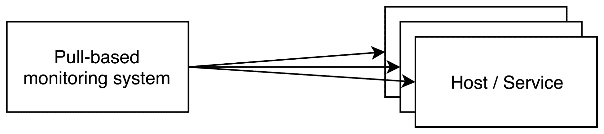

# 第一章：监控基础

本章为本书中将要使用的几个关键概念奠定了基础。从监控的定义开始，我们将探讨不同的视角和因素，强调为何系统化分析在不同层面上具有重要性，并对组织产生影响。你将了解不同监控机制的优缺点，深入了解 Prometheus 在收集指标方面的做法。最后，我们将讨论一些在 Prometheus 堆栈的设计和架构中至关重要的有争议的决策，及其在设计你自己的监控系统时应当考虑的原因。

本章将涵盖以下主题：

+   监控的定义

+   白盒监控与黑盒监控

+   理解指标收集

# 监控的定义

监控的共识定义很难达成，因为它很快就会在行业甚至职位特定的上下文中发生变化。观点的多样性、监控系统的组成组件，甚至数据的收集或使用方式，都是导致难以形成清晰定义的因素。

如果没有共同的基础，很难维持有效的讨论，通常期望会不一致。因此，在接下来的主题中，我们将概述一个基础框架，旨在获得一个监控的定义，帮助我们在本书中进行导航。

# 监控的价值

随着基础设施复杂度的增加，特别是由于微服务架构的采用，获取基础设施各个组成部分的全局视图变得至关重要。手动验证每个实例、缓存服务、数据库或负载均衡器的健康状态几乎是不可想象的。移动的组件太多，数目庞大——更不用说还要紧密关注它们了。

如今，监控被期望能够跟踪这些组件的数据。然而，数据可能有多种形式，这使得它可以用于不同的目的。

报警是监控数据的标准应用之一，但这些数据的应用可以远远超出报警。你可能需要历史信息来帮助进行容量规划或事件调查，或者你可能需要更高的分辨率来深入挖掘问题，甚至需要更高的时效性以减少故障期间的平均恢复时间。

你可以将监控视为维持系统健康的一个信息来源，既包括生产系统，也包括业务系统。

# 组织背景

从组织的角度来看，系统管理员、质量保证工程师、**站点可靠性工程师**（**SRE**）或产品负责人等角色对监控有不同的期望。了解每个角色的需求有助于更容易理解为什么在讨论监控时上下文如此重要。我们可以扩展以下几个陈述，并举些例子：

+   系统管理员关注的是高分辨率、低延迟和高多样性的数据。对于系统管理员来说，监控的主要目标是获取基础设施的可视化，管理从 CPU 使用率到**超文本传输协议**（**HTTP**）请求率等数据，以便快速发现问题并尽早识别根本原因。在这种方法中，呈现高分辨率的监控数据至关重要，这样才能深入分析受影响的系统。如果出现问题，你不能等待几个小时才能看到下一个数据点，因此数据必须接近实时提供，换句话说，具有低延迟。最后，由于没有简单的方法可以识别或预测哪些系统容易受到影响，我们需要从所有系统收集尽可能多的数据，即需要高度多样化的数据。

+   质量保证工程师关注的是高分辨率、高延迟和高多样性的数据。除了收集高分辨率的监控数据，这对于质量保证工程师深入了解影响因素至关重要外，延迟对他们来说并不像对系统管理员那么关键。在这种情况下，历史数据对于比对软件版本之间的差异比数据的新鲜度更为关键。由于我们无法完全预测新版本发布的后果，因此需要将可用数据分布到尽可能多的基础设施中，触及每一个可能使用、调用或与软件版本互动的系统（直接或间接），以确保我们能够获得尽可能多的数据。

+   专注于容量规划的 SRE 关注的是低分辨率、高延迟和高多样性的数据。在这种情况下，历史数据对 SRE 来说比数据呈现的分辨率更为重要。例如，在预测基础设施增长时，对于 SRE 来说，知道几个月前凌晨 4 点某个节点在 10 秒内出现了 CPU 使用率达到 100%的峰值并不至关重要，但理解节点负载的趋势，以推测为应对新的规模需求所需的节点数量，则非常有用。因此，对于 SRE 来说，广泛地了解受这些需求影响的基础设施各个部分也很重要，比如预测日志存储量、网络带宽增长等，这使得高多样性的监控数据变得至关重要。

+   产品负责人关注的是低分辨率、高延迟和低多样性的数据。在产品负责人的关注点中，监控数据通常不再局限于基础设施，而是转向业务领域。产品负责人力图理解特定软件产品的趋势，其中历史数据至关重要，分辨率并非那么关键。考虑到评估软件发布对客户的影响，延迟对他们来说不如对系统管理员那么重要。产品负责人管理的是一组特定的产品，因此预期监控数据的多样性较低，主要由业务度量指标组成。

下表将之前的示例以更简洁的形式总结：

|  | **数据分辨率** | **数据延迟** | **数据多样性** |
| --- | --- | --- | --- |
| **基础设施警报** | 高 | 低 | 高 |
| **软件发布视角** | 高 | 高 | 高 |
| **容量规划** | 低 | 高 | 高 |
| **产品/业务视角** | 低 | 高 | 低 |

# 监控组件

就像监控的定义在不同上下文中有所变化一样，其组件也面临着相同的困境。根据你希望定义的范围，我们可以在以下话题中找到这些组件中的某些或全部：

+   **度量**：这表示特定系统资源、应用程序操作或业务特征在某一时刻的值。该信息以汇总形式获得；例如，你可以了解到每秒处理了多少请求，但无法得知特定请求的确切时间，且没有上下文，你也不知道请求的 ID。

+   **日志记录**：包含比度量更多的数据，它表现为系统或应用程序的一个事件，包含该事件产生的所有信息。这些信息未经过汇总，且具有完整的上下文。

+   **追踪**：这是日志记录的一种特殊情况，其中请求被赋予唯一标识符，以便在整个生命周期中追踪每个系统中的请求。由于请求数量的增加会使数据集变大，因此使用样本而不是追踪所有请求是一个好主意。

+   **警报**：这是对度量或日志的持续阈值验证，当超出指定阈值时，触发动作或通知。

+   **可视化**：这是度量、日志或追踪的图形化表示。

最近，“监控”这一术语被一个超集**可观测性**所取代，这被视为监控的演变，或者是为了制造炒作并复兴这一概念的不同包装（就像 DevOps*一样）。从目前的角度来看，可观测性确实包含了我们在此描述的所有组件。

在本书中，我们的监控定义包括度量、警报和可视化。

监控是具有相关警报和可视化的度量。

# 白盒监控与黑盒监控

我们可以采用多种方式进行监控，但它们大体上可以分为两大类：即黑盒监控和白盒监控。

在黑盒监控中，应用程序或主机从外部被观察，因此，这种方法可能相对有限。检查是否系统响应探测请求，并以已知的方式作出反应：

+   主机是否响应**互联网控制消息协议**（**ICMP**）回显请求（通常称为 ping）？

+   给定的 TCP 端口是否开放？

+   当应用程序收到特定的 HTTP 请求时，它是否以正确的数据和状态码作出响应？

+   特定应用程序的进程是否在其主机上运行？

另一方面，在白盒监控中，受监控的系统会展示其内部状态和关键部分的性能数据。这种类型的内省非常强大，因为它暴露了操作遥测数据，从而可以了解不同内部组件的健康状况，否则这些信息可能很难甚至无法得知。通常，这些遥测数据以以下方式处理：

+   **通过日志导出**：这是迄今为止最常见的情况，也是应用程序在仪表化库普及之前暴露其内部工作方式的方式。例如，可以处理 HTTP 服务器的访问日志，以监控请求率、延迟和错误百分比。

+   **作为结构化事件发出**：这种方法类似于日志记录，但数据不是写入磁盘，而是直接发送到处理系统进行分析和聚合。

+   **以聚合形式存储在内存中**：这种格式的数据可以托管在端点中，也可以直接通过命令行工具读取。例如，`*/*metrics` 用于 Prometheus 指标，HAProxy 的统计页面，或者 varnishstats 命令行工具。

并非所有软件都经过仪表化，并且准备好暴露其内部状态以进行指标收集。例如，它可能是一个第三方的闭源应用程序，无法展示其内部工作原理。在这些情况下，外部探测可能是收集被认为对于适当服务状态验证至关重要的数据的可行选择。

无论如何，黑盒监控不仅对第三方应用程序有益。它还可以从客户端的角度验证您的应用程序，例如，通过负载均衡器和防火墙。探测可以是您的最后一道防线——如果其他方法失败，您可以依赖黑盒监控来评估可用性。

# 理解指标收集

监控系统采集指标的过程通常可以分为两种方法——推送和拉取。正如我们将在接下来的主题中看到的，两种方法都是有效的，并且各有优缺点，我们将详细讨论。然而，了解它们的差异对于理解和充分利用 Prometheus 至关重要。在了解了指标采集的工作原理之后，我们将深入探讨应该采集哪些内容。实现这一目标有几种经过验证的方法，我们将对每种方法进行概述。

# 两种采集方法概述

在基于推送的监控系统中，生成的指标或事件会直接从生成应用程序或本地代理发送到采集服务，如下所示：

图 1.1：基于拉取的监控系统

处理原始事件数据的系统通常更倾向于使用推送，因为事件生成的频率非常高——每个实例每秒钟生成数百、数千甚至数万次事件——这使得轮询数据变得不切实际且复杂。为了在轮询之间保持事件的生成，需要某种缓冲机制，且与直接推送数据相比，事件的新鲜度仍然是一个问题。使用这种方法的一些例子包括 Riemann、StatsD，以及**Elasticsearch**、**Logstash** 和 **Kibana**（**ELK**）堆栈。

这并不意味着只有这些类型的系统使用推送。一些监控系统，如 Graphite、OpenTSDB，以及**Telegraf**、**InfluxDB**、**Chronograph** 和 **Kapacitor**（**TICK**）堆栈，都是采用这种方式设计的。即便是老牌的 Nagios，也通过**Nagios Service Check Acceptor**（**NSCA**），也就是通常所说的被动检查，支持推送：

图 1.2：基于推送的监控系统

相比之下，基于拉取的监控系统直接从应用程序或通过代理进程收集指标，这些代理进程将指标提供给系统。一些使用拉取方法的知名监控软件包括 Nagios 及其类似系统（如 Icinga、Zabbix、Zenoss 和 Sensu 等）。Prometheus 也是采用拉取方法的其中之一，并且在这一点上有着明确的立场。

# 推送与拉取

在监控社区中，关于这些设计决策的优劣一直存在着许多争议。主要的争论点通常围绕目标发现展开，我们将在接下来的段落中讨论这一点。

在基于推送的系统中，被监控的主机和服务通过向监控系统报告来向系统表明自己的存在。这里的优势是，不需要预先了解新的系统即可将它们纳入监控。然而，这意味着监控服务的位置信息需要传播到所有目标，通常通过某种配置管理方式来实现。陈旧性是这种方法的一个大缺点：如果一个系统长时间没有报告，这是否意味着它出了问题，还是它被故意停用？

此外，当你管理一个分布式的主机和服务队列，且它们将数据推送到一个中心点时，"雷霆般的群体"（由于许多连接同时到达而导致的过载）或误配置导致的数据洪流的风险变得更加复杂，需要花费更多的时间和精力来缓解。

在基于拉取的监控中，系统需要一个明确的主机和服务列表，以便监控其度量指标并将其导入。拥有一个集中式的真实数据源可以提供一定程度的保证，确保一切按预期运行，但缺点是需要维护该数据源并保持其随时更新。由于当今基础设施的变化速度极快，因此需要某种形式的自动发现机制来跟上全局变化。拥有一个集中的配置点，可以在出现问题或误配置时提供更快速的响应。

最终，每种方法的缺点都可以通过巧妙的设计和自动化来减少或有效解决。在选择监控工具时，还有其他更重要的因素，例如灵活性、自动化的便捷性、可维护性，或对所使用技术的广泛支持。

尽管 Prometheus 是基于拉取的监控系统，它也提供了一种通过使用网关将推送转为拉取的方式来获取推送的度量。这对于监控一些非常狭窄的进程类非常有用，稍后我们将在本书中看到。

# 应该测量什么

在规划度量收集时，必定会遇到一个问题，即定义要观察的度量指标。为了回答这个问题，我们应该参考当前的最佳实践和方法论。在接下来的主题中，我们将概述一些最具影响力和最受推崇的方法，帮助减少噪声并提高性能和整体可靠性问题的可见性。

# 谷歌的四个黄金信号

谷歌关于监控的理由非常简单。它直接说明，跟踪的四个最重要的度量指标如下：

+   **延迟**：处理请求所需的时间

+   **流量**：发起的请求数量

+   **错误**：失败请求的比例

+   **饱和度**：未被处理的工作量，通常是排队等待的

# Brendan Gregg 的 USE 方法

Brendan 的方法更侧重于机器，它指出对于每个资源（CPU、磁盘、网络接口等），应该监控以下指标：

+   **利用率**：以资源忙碌的百分比来衡量

+   **饱和度**：资源未能处理的工作量，通常以排队的方式存在

+   **错误**：发生的错误数量

# Tom Wilkie 的 RED 方法

RED 方法更侧重于服务层面的监控，而不是底层系统本身。当然，作为监控服务的有用方法，这一策略也对预测外部客户的体验具有价值。如果一个服务的错误率增加，可以合理地假设这些错误将直接或间接地影响客户的体验。以下是需要关注的指标：

+   **速率**：翻译为每秒请求数

+   **错误**：每秒失败请求的数量

+   **持续时间**：这些请求所花费的时间

# 总结

在本章中，我们有机会理解监控的真正价值以及如何在特定上下文中处理这一术语，包括本书中使用的上下文。这将帮助你避免任何误解，并确保你清楚地了解本书在这一主题上的立场。我们还讨论了监控的不同方面，如指标、日志记录、追踪、告警和可视化，同时介绍了可观测性及其带来的好处。白盒和黑盒监控被提及，为理解使用指标的好处提供了基础。掌握了关于指标的知识后，我们深入探讨了推拉机制以及各自的相关论点，最后总结了你所管理的系统中应跟踪的指标。

在下一章中，我们将概述 Prometheus 生态系统，并讨论其几个组件。

# 问题

1.  为什么监控的定义如此难以清晰界定？

1.  指标的高延迟是否会影响专注于修复实时事件的系统管理员的工作？

1.  为了正确进行容量规划，监控的要求是什么？

1.  日志记录是否算作监控？

1.  关于可用的指标收集策略，使用基于推送的方法有什么缺点？

1.  如果你必须选择三个来自通用 Web 服务的基本指标来关注，它们会是哪三个？

1.  当一个检查通过列出主机中正在运行的进程来验证给定进程是否在主机上运行时，这属于白盒监控还是黑盒监控？

# 进一步阅读

+   **Prometheus 博客**： [`prometheus.io/blog/2016/07/23/pull-does-not-scale-or-does-it`](https://prometheus.io/blog/2016/07/23/pull-does-not-scale-or-does-it/)

+   **站点可靠性书籍**： [`landing.google.com/sre/sre-book/chapters/monitoring-distributed-systems`](https://landing.google.com/sre/sre-book/chapters/monitoring-distributed-systems/)

+   **USE 方法**: [`www.brendangregg.com/usemethod.html`](http://www.brendangregg.com/usemethod.html)

+   **RED 方法**: [`www.weave.works/blog/the-red-method-key-metrics-for-microservices-architecture`](https://www.weave.works/blog/the-red-method-key-metrics-for-microservices-architecture/)
