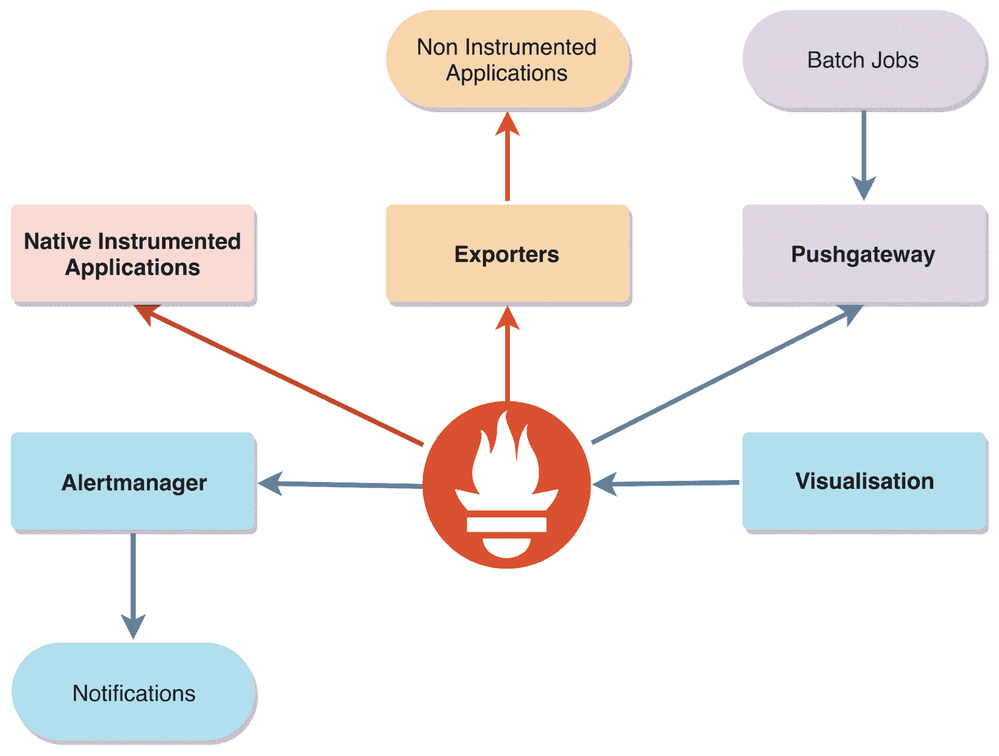
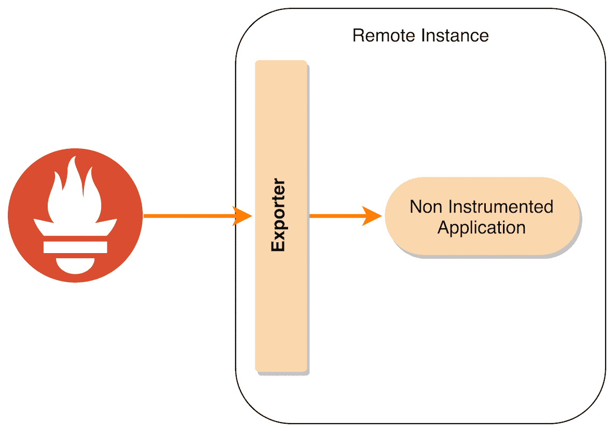
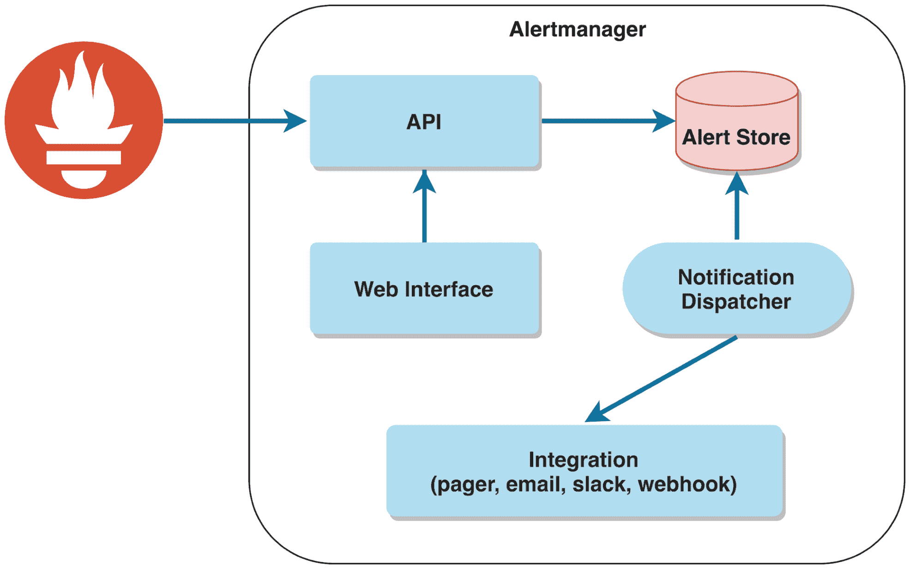
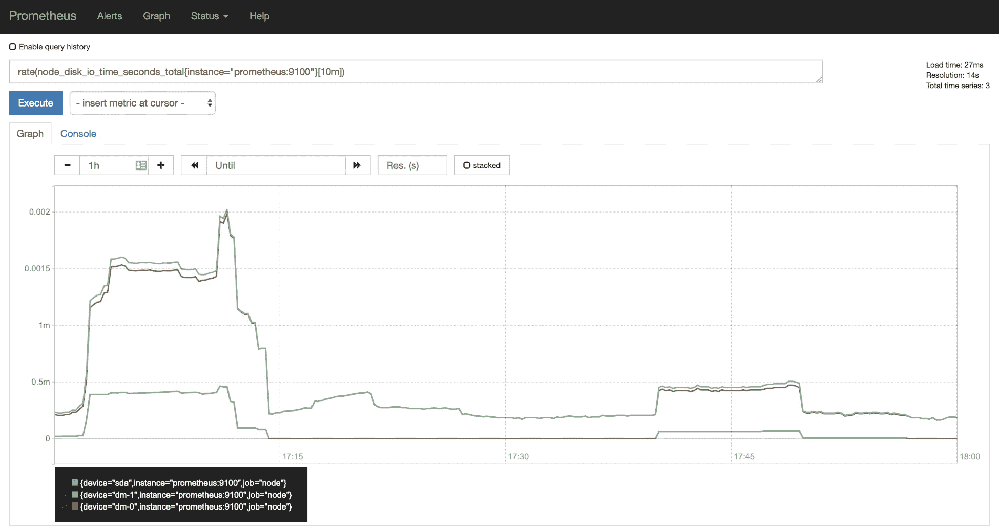
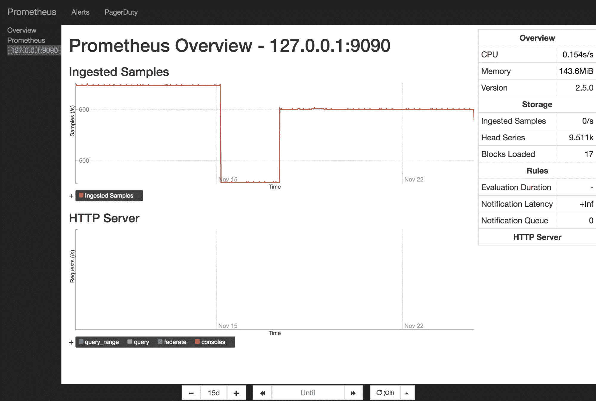

# Prometheus 生态系统概述

在可用的如此庞大的组件集合中，选择所需的组件来解决特定的监控需求可能令人望而生畏。本章将介绍 Prometheus 生态系统，各个组件执行什么任务，并了解它们如何在逻辑上协同工作。

追求简洁并清楚理解 Prometheus 堆栈的所有组成部分，对于保持系统的可管理性和可靠性至关重要。

简而言之，本章将涉及以下主题：

+   使用 Prometheus 进行度量指标收集

+   通过 exporters 暴露内部状态

+   使用 Alertmanager 进行警报路由和管理

+   可视化你的数据

# 使用 Prometheus 进行度量指标收集

Prometheus 是一个基于时间序列的开源监控系统。它通过向主机和服务的度量端点发送 HTTP 请求来收集数据，然后使用强大的查询语言使其可用于分析和警报。

尽管 Prometheus 通过证明其稳定性、成熟性和稳固的治理，已经获得了**云原生计算基金会**（**CNCF**）的认证，它仍在以非常快速的速度发展。写作时，Prometheus 的当前稳定版本是 2.9.2，本书中讨论的所有组件或特性将基于此版本。虽然在 2 版本内不应有重大架构变化，但在将本书中学习到的特定配置应用于早期或甚至后续版本时，仍需谨慎。

# Prometheus 架构的高级概览

Prometheus 生态系统由多个组件组成，每个组件都有自己的责任和明确的范围。Prometheus 本身至关重要，因为它位于大多数交互的核心，但许多组件实际上是可选的，这取决于你的监控需求。

如下图所示，Prometheus 生态系统中的主要组件如下：

+   Prometheus 服务器收集时间序列数据，存储数据，提供查询接口，并根据数据发送警报。

+   Alertmanager 从 Prometheus 接收警报触发器，并处理警报的路由和派发。

+   Pushgateway 处理来自短生命周期作业（如 cron 或批处理作业）推送的度量指标的公开。

+   支持 Prometheus 暴露格式的应用程序通过 HTTP 端点公开内部状态。

+   社区驱动的 exporters 暴露来自不原生支持 Prometheus 的应用程序的度量指标。

+   第一方和第三方仪表板解决方案提供了收集数据的可视化。

本书后续将深入探讨每个组件：

图 2.1：Prometheus 生态系统中主要组件的高级概览

Prometheus 服务器有其自身的内部进程，如记录规则和服务发现，这些内容分别在第九章，*定义告警和记录规则*，以及第十二章，*选择正确的服务发现*中有详细解释。

Prometheus 最初由 Matt T. Proud 和 Julius Volz 在 SoundCloud 工作时创建。它的灵感来源于 Google 的 Borgmon，Borgmon 对其早期设计产生了很大影响：从度量端点抓取纯文本；导出器作为度量收集的代理；将时间序列视为多维向量，然后可以进行转换和过滤；以及使用规则集进行记录和告警等功能。

你可能会想尝试将 Prometheus 适配为基于推送的度量收集模型，但这是不建议的。Prometheus 的核心设计围绕拉取展开，因此从推送转为拉取时，很多假设会被打破。当我们介绍 Pushgateway 时会进一步解释这个问题。

Prometheus 的一个独特特点是，它毫不掩饰地不尝试做任何类型的集群。通过不依赖网络进行协调和存储（尽管远程写入是可能的，正如我们在本书结尾部分将看到的那样），它为可靠性和易用性提供了有力的论据。只需选择合适的 Prometheus 二进制分发版并在本地计算机上运行，它便能轻松地处理成千上万的抓取目标和每秒数百万个样本的摄取，即使是服务器硬件。

# 使用导出器暴露内部状态

不是所有的应用程序都使用 Prometheus 兼容的监控工具。有时根本不会暴露任何度量。在这些情况下，我们可以依赖导出器。以下图示展示了它们的工作原理：

图 2.2：导出器的高层次概述

导出器不过是一个收集服务或应用程序数据并通过 HTTP 以 Prometheus 格式暴露数据的软件。每个导出器通常针对特定的服务或应用，因此它们的部署反映了这种一对一的协同关系。

如今，你几乎可以找到任何你需要的服务的导出器，如果某个特定的第三方服务没有可用的导出器，自己构建一个也非常简单。

# 导出器基础知识

当导出程序启动时，它会绑定到一个配置的端口，并通过你选择的 HTTP 端点暴露所收集的内部状态（默认端点为 `/metrics`）。当发出 HTTP GET 请求到配置的端点时，就会收集到仪表数据。例如，node exporter 是最常用的导出程序之一，它依赖于多个内核统计信息来展示诸如磁盘 I/O、CPU、内存、网络、文件系统使用情况等数据。每次抓取该端点时，信息都会迅速收集并同步暴露出来。

Prometheus 服务器向被监控系统发出的用于指标收集的 HTTP GET 请求被称为 **抓取**（scrape）。

如果你是编写服务的人，最佳选择是直接使用 Prometheus 客户端库来进行代码仪表化。以下编程语言有官方的客户端库：

+   Go

+   Java/JVM

+   Python

+   Ruby

以下编程语言有社区驱动的客户端库：

+   Bash

+   C++

+   Common Lisp

+   Elixir

+   Erlang

+   Haskell

+   Lua for NGINX

+   Lua for Tarantool

+   .NET

+   C#

+   Node.js

+   Perl

+   PHP

+   Rust

由于围绕 Prometheus 的社区不断壮大，这个列表也在不断扩展。

通常情况下，导出程序非常轻量，性能开销通常可以忽略不计，但像往常一样，也有一些例外，我们将在本书的后面详细讲解这些例外。

# 使用 Alertmanager 进行警报路由和管理

Alertmanager 是 Prometheus 生态系统中的一个组件，负责处理由 Prometheus 服务器生成的警报触发的通知。因此，它的可用性至关重要，设计选择也反映了这一需求。它是唯一真正为高可用集群设置而设计的组件，并使用 gossip 作为通信协议：

图 2.3：Alertmanager 高级概览

从高层次来看，Alertmanager 是一个通过其 API 从 Prometheus 服务器接收 HTTP POST 请求的服务，然后它会去重并根据预定义的路由集进行处理。

Alertmanager 还暴露了一个 Web 界面，用于例如可视化和静音触发的警报，或为它们应用抑制规则。

核心设计选择之一是重视交付而非去重。这意味着，如果在一组 Alertmanager 实例之间发生网络分区，通知将从分区的两侧发送。

# 警报路由

本质上，路由可以看作是一种树状结构。如果一个传入的警报具有特定的有效负载并触发某个特定的路由（分支），则会调用预定义的集成。

针对最常见的用例，已有多个开箱即用的集成可供使用，举例如下：

+   Email

+   Hipchat

+   PagerDuty

+   Slack

+   Opsgenie

+   VictorOps

+   微信

还有 Webhook 集成，它会向您选择的端点发送带有触发警报的 JSON 负载的 HTTP POST 请求，打开了自定义集成的无限可能性。

# 可视化您的数据

数据可视化是产生或消费信息的最简单方式之一。Prometheus 提供了一个定义良好的 API，在该 API 中，PromQL 查询可以生成用于可视化的原始数据。

目前，最好的外部可视化软件是 Grafana，我们将在第十章中详细解释，*发现和创建 Grafana 仪表板*。Grafana 团队已经使其与 Prometheus 的集成无缝，结果是令人愉快的用户体验。

Prometheus 服务器还附带两个内部可视化组件：

+   **表达式浏览器**：在这里，您可以直接运行 PromQL 快速查询数据并即时可视化：

图 2.4：Prometheus 表达式浏览器界面

+   **控制台**：这些是使用 Golang 模板语言构建的网页，由 Prometheus 服务器本身提供。这种方法使您能够拥有预定义的数据可视化界面，而无需不断键入 PromQL：

图 2.5：Prometheus 控制台界面

# 总结

为了更好地理解 Prometheus 的理念，必须深入了解 Prometheus 生态系统的主要组件——从通过导出器收集数据到使用 Alertmanager 进行可靠的警报，以及可用的可视化选项。我们在这一章中已经涵盖了这些内容。

在下一章，我们将开始构建一个测试环境，这样我们迄今为止讨论的所有概念就能开始实现。

# 问题

1.  Prometheus 生态系统的主要组成部分是什么？

1.  在 Prometheus 部署中，哪些组件是必需的，哪些是可选的？

1.  为什么需要外部导出器？

1.  当 HTTP GET 请求访问导出器的指标端点时，会发生什么？

1.  如果网络分区发生，在 Alertmanager 集群中触发的警报会发生什么情况？

1.  您意识到需要将 Alertmanager 与定制的 API 集成。最快的选择是什么？

1.  标准 Prometheus 服务器安装中包括哪些可视化选项？

# 深入阅读

+   **Prometheus 概述**：[`prometheus.io/docs/introduction/overview/`](https://prometheus.io/docs/introduction/overview/)
