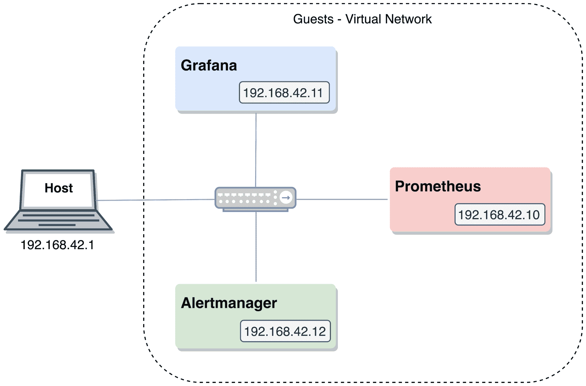
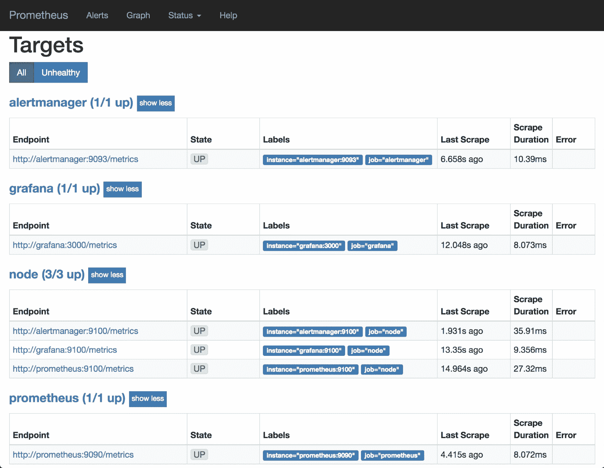
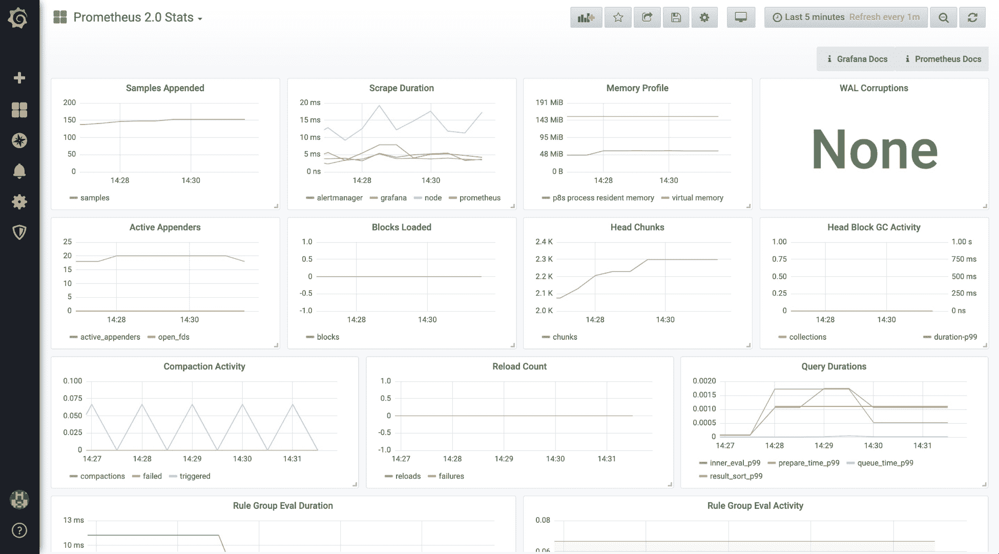
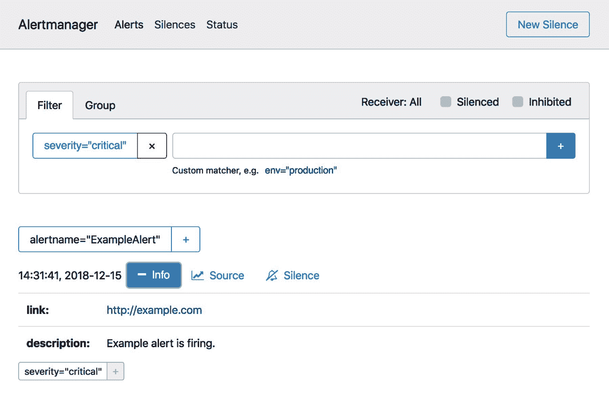

# 设置测试环境

最好的学习方式是通过实践。本章节将帮助你快速启动测试环境，让你可以安全地进行实验而无需过多担心。它将提供几个配置示例，并提供如何运行的提示。本书中将多次使用这种环境，适用于不同的场景。

简而言之，本章节将涵盖以下主题：

+   代码组织

+   机器要求

+   启动新环境

# 代码组织

本书中的示例和代码列表可以直接使用而无需任何支持材料，但也提供了一个配套的 Git 仓库，以帮助你设置和自动化测试环境，从而便于你跟随学习。

在本节中，我们将探讨该仓库的组织结构，解释在自动化测试环境时所做的一些选择，并提供一些关于如何自定义测试环境的建议：

```
.
├── Makefile
├── README.md
├── cache/
├── chapter03/
├── ...
├── chapter14/
└── utils/
```

这里展示的仓库根目录结构应该很容易理解：

+   每个章节都有一个单独的目录，用于其独立的测试环境（目录名为`chapter`，后跟章节号）

+   一个`cache`目录，用于存放下载的包，以便重建测试环境时尽可能加速

+   一个`utils`目录，存放测试环境的默认版本和参数（如果需要，可以修改），以及一些辅助函数

接下来，我们将深入探讨每个部分，具体如下：

```
.
├── ...
└── utils/
    ├── defaults.sh
    ├── helpers.sh
    └── vagrant_defaults.rb
```

在`utils`目录下，可以找到以下文件：

+   `defaults.sh`：在这里，可以找到将在测试环境中使用的 Prometheus 堆栈中每个组件的版本（例如 Prometheus 本身、exporters、Alertmanager 等）。

+   `vagrant_defaults.rb`：此文件控制运行测试环境的虚拟机的一些可调参数，如每台虚拟机的内存大小、使用的基础镜像以及环境的内部网络结构。

+   `helpers.sh`：这是一个 shell 库，供配置脚本使用，包含一些帮助函数来管理归档文件的下载和缓存：

```
.
├── ...
├── chapter03/
│   ├── Vagrantfile
│   ├── configs/
│   └── provision/
└── ...
```

虽然每个测试环境在各章节之间可能有所不同，但基本结构将保持一致：

+   一个`Vagrantfile`，用于描述测试环境所需的虚拟机数量，以及如何配置和配置它们

+   一个`configs`目录，存放将在配置步骤中使用的配置文件

+   一个`provision`目录，包含用于下载、安装和配置当前测试环境所需的 Prometheus 组件的脚本

我们可以通过查看本章节的目录结构来看到一个示例：

```
.
├── ...
├── chapter03/
│   ├── Vagrantfile
│   ├── configs/
│   │   ├── alertmanager/
│   │   ├── grafana/
│   │   ├── node_exporter/
│   │   └── prometheus/
│   └── provision/
│       ├── alertmanager.sh*
│       ├── grafana.sh*
│       ├── hosts.sh*
│       ├── node_exporter.sh*
│       └── prometheus.sh*
└── ...
```

`configs`目录包含本章节中使用的各个组件的子目录。`provision`目录遵循相同的模式，并增加了`hosts.sh`脚本，以自动化管理来宾机上的`/etc/hosts`文件。

到现在为止，可能有人会产生*为什么不直接使用配置管理？*这个问题。所有的自动化配置工作都是通过 shell 完成的，原因有几个：

+   这是有意识的努力，旨在暴露每个细节，而非将其抽象化。

+   Shell 脚本是类 Unix 系统中自动化的最基本手段。

+   本书的目的是聚焦于 Prometheus 的内部工作原理，而不是某个特定配置管理工具的实现。

# 机器要求

该设置的机器要求可以在现代笔记本电脑上舒适运行，只要其启用了 CPU 虚拟化扩展，并且操作系统与软件要求兼容。这里涉及的所有软件要求都经过深思熟虑。我们将使用免费且开源的软件，因此在尝试测试环境时不需要额外费用。

# 硬件要求

部署提供示例的主机最低要求如下：

+   至少 2 个 CPU 核心

+   至少 4 GB 内存

+   至少 20 GB 可用磁盘空间

按照这些规格，你应该能够顺利启动测试环境，且不会遇到任何问题。

关于连接性，主机应该具有互联网访问权限，并能够解析外部 DNS 记录。提供的脚本在执行过程中需要下载依赖项，但大部分依赖项会被缓存到本地，以避免每次部署时都下载。

示例环境的默认网络为`192.168.42.0/24`，下图展示了运行本章节示例时的配置：



图 3.1：虚拟网络配置

启动测试环境时，将使用子网`192.168.42.0/24`。每个环境属于特定的章节，在切换到新环境之前，应该销毁当前环境。如果你的本地地址空间发生冲突，可以通过编辑提供的`./utils/vagrant_defaults.rb`文件中的 NETWORK 选项来更改测试环境的子网。

# 推荐软件

环境使用以下软件进行测试，因此适用标准免责声明：尽管相同主版本的其他版本可能无需额外修改即可工作，但在使用与我们推荐版本不同的版本时应谨慎：

| 软件 | 版本 |
| --- | --- |
| VirtualBox | 6.0.4 |
| Vagrant | 2.2.4 |
| Minikube | 1.0.1 |
| kubectl | 1.14.1 |

关于支持的操作系统，所有的测试都是在以下版本的 Linux 和 macOS 上进行的：

+   Ubuntu 18.04 LTS（Bionic Beaver）

+   macOS 10.14.3 (Mojave)

其他操作系统/发行版可能能够运行测试环境，尽管无法保证。

# VirtualBox

Oracle VirtualBox 是一款免费的开源虚拟机管理程序，支持所有主流操作系统（macOS、Linux 和 Windows）。它不仅允许启动虚拟机镜像，还可以创建虚拟网络，并将主机文件系统路径挂载到客户机中，具备其他功能。此软件要求启用硬件虚拟化。

你可以在[`www.virtualbox.org/wiki/Downloads`](https://www.virtualbox.org/wiki/Downloads)找到 VirtualBox 的所有安装文件。

# Vagrant

HashiCorp Vagrant 允许创建可移植的环境。在本书的上下文中，它将成为与 VirtualBox 的接口，允许启动和配置虚拟机。在我们的示例中，我们选择使用 Chef Bento 作为虚拟机镜像，这是 HashiCorp 推荐的。

你可以在[`www.vagrantup.com/downloads.html`](https://www.vagrantup.com/downloads.html)找到 Vagrant 的所有安装文件。

# Minikube

Minikube 是测试 Kubernetes 本地环境的最简单方法。我们将结合使用 Minikube 和 VirtualBox，确保本书中的示例在不同操作系统上表现一致。

你可以在[`kubernetes.io/docs/tasks/tools/install-minikube/#install-minikube`](https://kubernetes.io/docs/tasks/tools/install-minikube/#install-minikube)找到有关 Minikube 的所有安装信息。

# kubectl

与 Kubernetes API 交互的客户端工具叫做 **kubectl**，它是本书中一些示例的基础。

你可以在[`kubernetes.io/docs/tasks/tools/install-minikube/#install-kubectl`](https://kubernetes.io/docs/tasks/tools/install-minikube/#install-kubectl)找到有关 kubectl 的所有安装信息。

# 启动一个新的环境

确保主机上已经安装所有必需的软件后，你可以继续进行以下一个或两个指南。

# 自动化部署指南

此方法将抽象化所有部署和配置细节，允许你仅通过几个命令便能拥有一个完全运行的测试环境。你仍然可以连接到每个客户机实例并更改配置。

启动环境的步骤如下：

1.  克隆本书的代码仓库：

```
git clone https://github.com/PacktPublishing/Hands-On-Infrastructure-Monitoring-with-Prometheus.git
```

1.  进入新创建的目录并进入章节编号：

```
cd Hands-On-Infrastructure-Monitoring-with-Prometheus/chapter03
```

1.  启动本章的测试环境：

```
vagrant up
```

第一次运行会花费几分钟，因为需要下载 Vagrant 镜像和一些软件依赖项。完成设置过程后，后续的运行会更快，因为所有这些资源将被缓存。

1.  现在，你可以运行 `vagrant status`。你将看到以下输出：

```
Current machine states:

prometheus running (virtualbox)
grafana running (virtualbox)
alertmanager running (virtualbox)

This environment represents multiple VMs. The VMs are all listed
above with their current state. For more information about a specific
VM, run `vagrant status NAME`.
```

# Prometheus

你可以在 `http://192.168.42.10:9090/targets` 找到 Prometheus HTTP 端点：



图 3.2：Prometheus HTTP 端点 —— 显示所有已配置的目标  

# **Grafana**  

你可以在 `http://192.168.42.11:3000` 找到 Grafana HTTP 端点。  

Grafana 的默认凭证如下：  

| **用户名** | **密码** |   |
| --- | --- | --- |
| `admin` | `admin` |   |

你将看到两个自动配置的仪表板。我们将在本书后续的章节中专门讨论 Grafana 和仪表板，参考 第十章，*发现和创建 Grafana 仪表板*：  

  

图 3.3：自动配置的 Grafana 仪表板  

# **警报管理器**  

你可以在 `http://192.168.42.12:9093` 找到警报管理器 HTTP 端点。  

我们还在 Prometheus 上配置了一个始终触发的警报，并通过 Webhook 集成了自定义的警报管理器，这样你就可以开始了解它们之间的关系。我们将在其他章节详细介绍警报管理器，但现在，你可以查看示例警报在代码库根目录下生成的日志，路径为 `./cache/alerting.log`：  

  

图 3.4：警报管理器 —— 触发一个示例警报  

# 清理  

测试完成后，只需确保你在 `chapter03` 目录下并执行以下命令：  

```
vagrant destroy -f
```

不用担心 —— 如果你愿意，环境可以轻松重新启动。  

# 高级部署演练  

使用此方法，来宾虚拟机将被启动，但不会进行任何配置，因此你需要亲自通过实践方式来设置环境。我们不会深入解释可用的配置文件和命令行参数 —— 这些内容将在接下来的章节中详细探讨。总体来说，对于每个软件组件，我们将执行以下操作：  

+   在环境中的虚拟机之间设置基本的网络连接  

+   创建一个独立的系统用户  

+   下载并安装软件  

+   创建支持文件和目录  

+   启动守护进程  

首先，克隆本书的代码库：  

```
git clone https://github.com/PacktPublishing/Hands-On-Infrastructure-Monitoring-with-Prometheus.git
```

进入新创建的目录并输入章节号，运行 Vagrant，不进行来宾实例的配置。这样你就会得到即开即用的虚拟机：  

```
cd Hands-On-Infrastructure-Monitoring-with-Prometheus/chapter03
vagrant up --no-provision
```

所有来宾启动完成后，我们将继续一一配置我们的实例。  

# **Prometheus**  

执行以下步骤：  

1.  登录到 Prometheus 来宾实例：  

```
vagrant ssh prometheus
```

1.  进入来宾实例，切换到 root 用户：  

```
sudo -i
```

1.  将所有访客的地址添加到实例主机的文件中：  

```
cat <<EOF >/etc/hosts
127.0.0.1       localhost
192.168.42.10   prometheus.prom.inet    prometheus
192.168.42.11   grafana.prom.inet       grafana
192.168.42.12   alertmanager.prom.inet  alertmanager

# The following lines are desirable for IPv6 capable hosts
::1     localhost ip6-localhost ip6-loopback
ff02::1 ip6-allnodes
ff02::2 ip6-allrouters
EOF
```

1.  创建一个新的系统用户：  

```
useradd --system prometheus
```

1.  进入 `/tmp` 并下载 Prometheus 压缩包：  

```
cd /tmp
curl -sLO "https://github.com/prometheus/prometheus/releases/download/v2.9.2/prometheus-2.9.2.linux-amd64.tar.gz"
```

1.  解压该压缩包：  

```
tar zxvf prometheus-2.9.2.linux-amd64.tar.gz
```

1.  将每个文件放在正确的位置：  

```
install -m 0644 -D -t /usr/share/prometheus/consoles prometheus-2.9.2.linux-amd64/consoles/*

install -m 0644 -D -t /usr/share/prometheus/console_libraries prometheus-2.9.2.linux-amd64/console_libraries/*

install -m 0755 prometheus-2.9.2.linux-amd64/prometheus prometheus-2.9.2.linux-amd64/promtool /usr/bin/

install -d -o prometheus -g prometheus /var/lib/prometheus 

install -m 0644 -D /vagrant/chapter03/configs/prometheus/prometheus.yml /etc/prometheus/prometheus.yml

install -m 0644 -D /vagrant/chapter03/configs/prometheus/first_rules.yml /etc/prometheus/first_rules.yml
```

1.  为 Prometheus 服务添加 `systemd` 单元文件：  

```
install -m 0644 /vagrant/chapter03/configs/prometheus/prometheus.service /etc/systemd/system/

systemctl daemon-reload
```

1.  启用并启动 Prometheus 服务：

```
systemctl enable prometheus
systemctl start prometheus
```

你现在应该可以在主机上访问 Prometheus HTTP 端点了。  

1.  退出 root 账户，再退出 Vagrant 用户账户：  

```
exit

exit
```

# **Grafana**  

执行以下步骤：  

1.  登录到 Grafana 来宾实例：  

```
vagrant ssh grafana
```

1.  在客机实例内，切换到 root 用户：

```
sudo -i
```

1.  将所有来宾的地址添加到实例主机的文件中：

```
cat <<EOF >/etc/hosts
127.0.0.1       localhost
192.168.42.10   prometheus.prom.inet    prometheus
192.168.42.11   grafana.prom.inet       grafana
192.168.42.12   alertmanager.prom.inet  alertmanager

# The following lines are desirable for IPv6 capable hosts
::1     localhost ip6-localhost ip6-loopback
ff02::1 ip6-allnodes
ff02::2 ip6-allrouters
EOF
```

1.  进入 `/tmp` 并下载 Grafana 包：

```
cd /tmp
curl -sLO "https://dl.grafana.com/oss/release/grafana_6.1.6_amd64.deb"
```

1.  安装包和所有依赖项：

```
DEBIAN_FRONTEND=noninteractive apt-get install -y libfontconfig

dpkg -i "grafana_6.1.6_amd64.deb"
```

1.  将所有提供的配置文件放到正确的位置：

```
rsync -ru /vagrant/chapter03/configs/grafana/{dashboards,provisioning} /etc/grafana/
```

1.  启用并启动 Grafana 服务：

```
systemctl daemon-reload
systemctl enable grafana-server
systemctl start grafana-server
```

你现在应该可以在主机上访问到 Grafana HTTP 端点。

1.  退出 root 账户，然后退出 Vagrant 用户账户：

```
exit

exit
```

# Alertmanager

执行以下步骤：

1.  登录到 Alertmanager 客机实例：

```
vagrant ssh alertmanager
```

1.  在客机实例内，切换到 root 用户：

```
sudo -i
```

1.  将所有来宾的地址添加到实例主机的文件中：

```
cat <<EOF >/etc/hosts
127.0.0.1       localhost
192.168.42.10   prometheus.prom.inet    prometheus
192.168.42.11   grafana.prom.inet       grafana
192.168.42.12   alertmanager.prom.inet  alertmanager

# The following lines are desirable for IPv6 capable hosts
::1     localhost ip6-localhost ip6-loopback
ff02::1 ip6-allnodes
ff02::2 ip6-allrouters
EOF
```

1.  创建一个新的系统用户：

```
useradd --system alertmanager
```

1.  进入 `/tmp` 并下载 Alertmanager 归档文件：

```
cd /tmp
curl -sLO "https://github.com/prometheus/alertmanager/releases/download/v0.17.0/alertmanager-0.17.0.linux-amd64.tar.gz"
```

1.  解压归档文件：

```
tar zxvf alertmanager-0.17.0.linux-amd64.tar.gz
```

1.  将每个文件放到正确的位置：

```
install -m 0755 alertmanager-0.17.0.linux-amd64/{alertmanager,amtool} /vagrant/chapter03/configs/alertmanager/alertdump /usr/bin/

install -d -o alertmanager -g alertmanager /var/lib/alertmanager

install -m 0644 -D /vagrant/chapter03/configs/alertmanager/alertmanager.yml /etc/alertmanager/alertmanager.yml
```

1.  为 Alertmanager 服务添加一个 `systemd` 单元文件：

```
install -m 0644 /vagrant/chapter03/configs/alertmanager/alertmanager.service /etc/systemd/system/

systemctl daemon-reload
```

1.  启用并启动 Alertmanager 服务：

```
systemctl enable alertmanager
systemctl start alertmanager
```

你现在应该可以在主机上访问到 Alertmanager HTTP 端点。

1.  退出 root 账户，然后退出 Vagrant 用户账户：

```
exit

exit
```

# Node Exporter

为确保收集系统级别的指标，必须在所有三个虚拟机中安装 Node Exporter。要登录到每个虚拟机，请使用我们在前面章节中探讨的命令：

1.  在客机实例内，切换到 root 用户：

```
sudo -i
```

1.  创建一个新的系统用户：

```
useradd --system node_exporter
```

1.  进入 `/tmp` 并下载 Node Exporter 归档文件：

```
cd /tmp
curl -sLO "https://github.com/prometheus/node_exporter/releases/download/v0.17.0/node_exporter-0.17.0.linux-amd64.tar.gz"
```

1.  将每个文件放到正确的位置：

```
tar zxvf "node_exporter-0.17.0.linux-amd64.tar.gz" -C /usr/bin --strip-components=1 --wildcards */node_exporter
```

1.  为 Node Exporter 服务添加一个 `systemd` 单元文件：

```
install -m 0644 /vagrant/chapter03/configs/node_exporter/node-exporter.service /etc/systemd/system/

systemctl daemon-reload
```

1.  启用并启动 Node Exporter 服务：

```
systemctl enable node-exporter
systemctl start node-exporter
```

1.  退出 root 账户，然后退出 Vagrant 用户账户：

```
exit

exit
```

# 验证你的测试环境

完成这些步骤后，你可以使用以下端点验证你的环境：

| **服务** | **端点** |
| --- | --- |
| Prometheus | `http://192.168.42.10:9090` |
| Grafana | `http://192.168.42.11:3000` |
| Alertmanager | `http://192.168.42.12:9093` |

# 总结

有了测试环境后，你可以在不担心破坏系统的情况下检查、修改和验证配置。全书将广泛使用这种测试方法，因为没有什么比实验更能帮助学习新技能。

在下一章中，我们将介绍 Prometheus 指标的基本知识。我们刚刚搭建的测试环境将有助于展示这些指标。

# 问题

1.  设置可重现的测试环境的推荐工具是什么？

1.  如何更改测试环境中 Prometheus 组件的默认版本？

1.  所有示例中使用的默认子网是什么？

1.  从高层次来看，启动 Prometheus 实例的步骤有哪些？

1.  每个来宾实例上都安装了 Node Exporter。你如何快速验证它们是否正确暴露指标？

1.  在我们的测试环境中，在哪里可以找到警报日志？

1.  如何从零开始创建一个干净的测试环境？

# 进一步阅读

+   **Bash 手册**: [`www.gnu.org/software/bash/manual/html_node/index.html`](https://www.gnu.org/software/bash/manual/html_node/index.html)

+   **推荐的 Vagrant 镜像**: [`www.vagrantup.com/docs/boxes.html`](https://www.vagrantup.com/docs/boxes.html)
