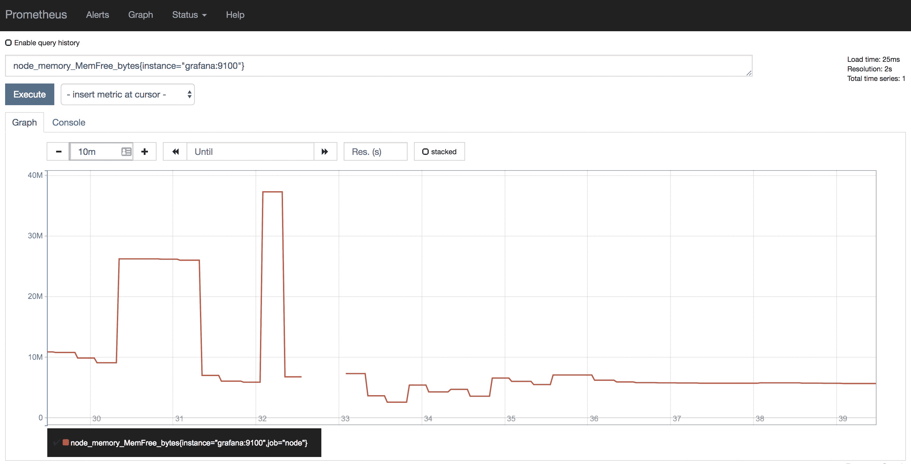

# 第五章：Prometheus 指标基础

指标是 Prometheus 堆栈获取并提供有用信息的核心资源。正确理解它们对于充分利用、管理甚至扩展该堆栈的可能性领域至关重要。从数据到信息，最终到知识，指标在这里帮助你。

简而言之，本章将涵盖以下主题：

+   理解 Prometheus 数据模型

+   四种核心指标类型的介绍

+   横向和纵向聚合

# 理解 Prometheus 数据模型

为了理解 Prometheus 数据模型，我们需要了解什么构成了时间序列以及如何存储这种数据。这些概念在本书的学习过程中将非常宝贵。

# 时间序列数据

时间序列数据通常可以定义为从相同来源按时间顺序索引的数值数据点。在 Prometheus 的范围内，这些数据点是按照固定时间间隔收集的。因此，当以图形形式呈现这种数据时，最常见的做法是绘制数据随时间的变化，*x* 轴表示时间，*y* 轴表示数据值。

# 时间序列数据库

一切都始于需要收集、存储并查询随时间变化的度量。当处理来自收集器和传感器的大量数据（例如物联网组成部分）时，如果数据库没有为该用例设计，查询结果数据集将非常慢。虽然你可以使用标准的关系型或 NoSQL 数据库来存储时间序列数据，但性能损失和可扩展性问题应该让你在做出决定时深思。Prometheus 选择实现一个专门为其独特问题空间量身定制的时间序列数据库。

除了这些类型的数据库具有写入负载重的特点，这也意味着存储了大量的测量数据外，还需要理解的是，简单的查询可能跨越数小时、数天甚至数月，返回大量的数据点，但仍然期望能够合理快速地返回数据。

因此，现代时间序列数据库存储以下组件：

+   时间戳

+   一个值

+   关于值的一些背景，编码在指标名称或关联的键/值对中

一个符合此时间序列数据库规范的抽象数据示例如下：

```
timestamp=1544978108, company=ACME, location=headquarters, beverage=coffee, value=40172
```

如你所见，这种数据可以很容易地存储在数据库中的单一表格里：

| `timestamp` | `company` | `location` | `beverage` | `value` |
| --- | --- | --- | --- | --- |
| `1544978108` | `ACME` | `headquarters` | `coffee` | `40172` |

在这个简单的例子中，我们可以查看位于 ACME 公司总部的自动售货机提供的咖啡杯数。如果通过时间持续测量，这个例子就拥有时间序列所需的所有组成部分。

这个例子并没有直接映射到 Prometheus 数据模型，因为它还需要一个度量名称，但它展示了我们希望解决的逻辑。

# Prometheus 本地存储

本地存储是 Prometheus 存储数据的标准方法，因此，我们必须理解它的基础知识。总体来看，Prometheus 存储设计结合了使用发布列表（posting lists）为当前存储的所有标签及其值实现索引的方式，以及它自己的时间序列数据格式。

# 数据流

Prometheus 存储收集数据的方式可以看作是一个三部分的过程。以下主题描述了数据在成功持久化之前所经历的各个阶段。

# 内存

最新一批数据会保存在内存中，最长可达两小时。这包括在两小时时间窗口内收集到的一个或多个数据块。这种方法大大减少了磁盘 I/O，最多可以减少两倍；最近的数据保存在内存中，查询非常快速；并且数据块是在内存中创建的，避免了持续的磁盘写入。

# 提前写日志

在内存中时，数据并未持久化，如果进程异常终止，数据可能会丢失。为了防止这种情况发生，磁盘上的 **写前日志** (**WAL**) 会保存内存中数据的状态，以便在 Prometheus 因任何原因崩溃或重启时能够重放这些数据。

# 磁盘

在两小时的时间窗口结束后，这些数据块将被写入磁盘。这些数据块是不可变的，尽管数据可以被删除，但这不是一个原子操作。相反，墓碑文件（tombstone）会被创建，记录不再需要的数据。

# 布局

如我们在下面的示例中所看到的，数据在 Prometheus 中的存储方式被组织成一系列包含数据块、该数据的 LevelDB 索引、一个带有人类可读信息的 `meta.json` 文件以及记录不再需要数据的墓碑文件的目录（块）。每一个这样的块代表一个数据库。

在最顶层，你还可以看到那些尚未刷新到自己数据块中的数据的 WAL（写前日志）：

```
...
├── 01CZMVW4CB6DCKK8Q33XY5ESQH
│   ├── chunks
│   │ └── 000001
│   ├── index
│   ├── meta.json
│   └── tombstones
├── 01CZNGF9G10R2P56R9G39NTSJE
│   ├── chunks
│   │ └── 000001
│   ├── index
│   ├── meta.json
│   └── tombstones
├── 01CZNGF9ST4ZNKNSZ4VTDVW8DH
│   ├── chunks
│   │ └── 000001
│   ├── index
│   ├── meta.json
│   └── tombstones
├── lock
└── wal
    ├── 00000114
    ├── 00000115
    ├── 00000116
    ├── 00000117
    └── checkpoint.000113
        └── 00000000
```

# Prometheus 数据模型

正如我们目前所看到的，Prometheus 将数据存储为时间序列，这包括被称为标签的键值对、时间戳和最终的值。接下来的主题将扩展这些组件，并提供每个组件的基础知识，我们将在第七章，*Prometheus 查询语言 - PromQL*中深入使用这些知识。

# 标注

Prometheus 中的时间序列表示如下：

```
<metric_name>[{<label_1="value_1">,<label_N="value_N">}] <datapoint_numerical_value>
```

如你所见，数据表示为一个度量名称，后面可选地跟着一个或多个带有标签名称/值的集合，并且标签值放在大括号中，最后是度量的值。此外，一个样本也会带有精确到毫秒的时间戳。

# 度量名称

尽管这是一个实现细节，但指标名称实际上就是一个特殊标签的值，叫做`"__name__"`。因此，如果你有一个名为 `"beverages_total"` 的指标，内部表示为 `"__name__=beverages_total"`。请记住，被 `"__"` 包围的标签是 Prometheus 的内部标签，任何以 `"__"` 为前缀的标签仅在某些阶段的指标收集周期中可用。

标签（键/值）和指标名称的组合定义了时间序列的身份。

Prometheus 中的每个指标名称必须匹配以下正则表达式：

```
"[a-zA-Z_:][a-zA-Z0-9_:]*"
```

通俗来说，这意味着指标名称只允许使用英文字母的大小写（`a-z`）、下划线（`_`）、冒号（`:`）和阿拉伯数字（`0-9`），但首字符不能是数字。

冒号是保留给一种特殊类型的指标指定的记录规则的。我们将在另一章中详细展开这个话题。

# 指标标签

标签，或者与特定指标相关的键/值对，为指标添加了维度。这是 Prometheus 在切片和处理时间序列数据时如此出色的一个关键部分，正如我们在第七章中所见的，*Prometheus 查询语言 – PromQL*。

虽然标签值可以是完整的 UTF-8 字符串，但标签名称必须符合正则表达式才能被认为是有效的；例如，`"[a-zA-Z0-9_]*"`。

与指标名称相比，它们的主要区别在于标签名称不允许使用冒号（`:`）。

# 样本

样本是收集到的数据点，它们表示时间序列数据的数值。定义一个样本所需的组件是一个 float64 值和一个具有毫秒精度的时间戳。需要记住的是，顺序错乱的样本会被 Prometheus 丢弃。同样，具有相同指标身份和不同样本值的样本也会被丢弃。

# 基数

根据分配给 Prometheus 实例的计算资源（即 CPU、内存、磁盘空间和 IOPS），它将优雅地处理一定数量的时间序列。这个数字可以被视为该实例容量的主要指标，它将影响你的抓取决策：你会有成千上万个目标，每个目标的指标较少，还是较少的目标，每个目标有成千上万个指标，或者介于两者之间？最终，Prometheus 将仅能处理一定数量的时间序列，而不会导致性能下降。

在这个背景下，基数的概念出现了。这个术语通常用来表示由指标名称和其关联的标签名称/值的组合所产生的独特时间序列的数量。举个例子，一个没有额外维度（如标签）的指标，如果来自一个拥有一百个实例的应用程序，自然意味着 Prometheus 将存储 100 个时间序列，每个实例一个（这里的实例是应用程序外部添加的维度）；另一个来自该应用程序的指标，如果有一个标签有十个可能的值，则会转化为 1,000 个时间序列（每个实例 10 个时间序列，乘以 100 个实例）。这表明基数是乘法性的——每增加一个维度，现有维度的每个值都会与新维度的每个值重复，从而增加产生的时间序列数。拥有多个维度且每个维度具有大量可能值的指标将导致 Prometheus 中所称的基数爆炸，即创建大量时间序列。

当标签值没有明确的限制，且可能会无限增加或有数百个可能值时，你也会遇到基数问题。这些指标可能更适合在基于日志的系统中处理。

以下是一些具有高或无限基数的数据示例，这些数据不应作为标签值（或在指标名称中使用）：

+   电子邮件地址

+   用户名

+   请求/进程/订单/交易 ID

# 四种核心指标类型的概述

Prometheus 指标分为四种主要类型：计数器、计量器、直方图和摘要。深入理解它们非常重要，因为 Prometheus 提供的大多数功能只有在特定数据类型下才能正常工作。因此，以下是对每种类型的概述。

# 计数器

这是一个严格的累积性指标，其值只能增加。唯一的例外是当指标被重置时，它会恢复为零。

这是最有用的指标类型之一，因为即使抓取失败，数据的累积增加也不会丢失，下次抓取时仍然可以获取到。需要明确的是，在抓取失败的情况下，由于保存的点较少，粒度会丢失。

为了帮助可视化这种类型的指标，以下是一些计数器及其基于我们在上一章创建的测试环境的图形表示示例：

+   Prometheus 实例接收到的总数据包数量：


+   Grafana 实例写入磁盘的总字节数——注意由于实例重启而导致的中间空隙，迫使计数器重置：


# 计量器

计量器是一种在收集时对给定测量值进行快照的指标，其值可以增加或减少（例如温度、磁盘空间和内存使用情况）。

如果抓取失败，你将丢失该样本，因为下次抓取可能会遇到不同值的度量（更高或更低）。

为了帮助可视化这种类型的度量，以下是基于我们在上一章创建的测试环境的一些仪表和其图形表示示例：

+   Alertmanager 实例上建立的 TCP 连接数：


+   Grafana 实例上的空闲内存量——注意由于实例重启导致的中间间隙，这使得在该期间无法对可能的值做出任何假设：



# 直方图

记录系统中每个事件固有的数值数据可能会很昂贵，因此通常需要某种形式的预聚合，以至少保留有关发生了什么的部分信息。然而，通过在每个实例上预计算聚合（例如，自进程启动以来的平均值、滚动窗口、指数加权等），会丢失大量的粒度，而且某些计算可能在计算上很昂贵。更糟糕的是，许多预聚合通常不能重新聚合，否则会失去其意义——例如，计算一千个预先计算的第 95 百分位数的平均值是没有统计意义的。类似地，从给定集群的每个实例收集的请求延迟的第 99 百分位数（例如）并不能指示整个集群的第 99 百分位数，也无法准确计算它。

直方图允许你通过将事件计入客户端可配置的桶中来保持一定的粒度，同时还提供所有观察值的总和。Prometheus 直方图为每个配置的桶生成一个时间序列，并额外生成两个时间序列，分别跟踪观察到的事件的总和和计数。此外，Prometheus 中的直方图是累积的，这意味着每个桶将包含前一个桶的值，加上其自身事件的数量。这样做是为了在不丢失使用直方图的整体能力的情况下，可以出于性能或存储的原因丢弃一些桶。

使用直方图的缺点是所选的桶需要适应预期收集的值的范围和分布。分位数计算的误差范围将与此适配直接相关：选择太少或不当的桶将增加分位数计算的误差范围。

这种类型的度量特别适用于跟踪分桶延迟和大小（例如，请求持续时间或响应大小），因为它可以在不同维度之间自由聚合。另一个很好的应用是生成热图（直方图随时间的演变）。

为了帮助可视化这种类型的度量，以下是基于我们在上一章创建的测试环境的直方图及其图形表示示例：

+   Prometheus HTTP 请求持续时间（单位：秒），按桶划分。这在 Grafana 热力图中显示，以更好地说明桶的概念：


# 摘要

摘要在某些方面类似于直方图，但呈现了不同的权衡，并且通常不那么有用。它们也用于跟踪大小和延迟，并提供观察到的事件的总和和计数。此外（如果使用的客户端库支持），摘要还可以提供在预定滑动时间窗口上预先计算的分位数。使用摘要分位数的主要原因是，当需要准确的分位数估算时，无论观察到的事件的分布和范围如何。

Prometheus 中的分位数被称为 φ-分位数，其中 0 ≤ φ ≤ 1。

分位数和滑动窗口大小都在仪表代码中定义，因此无法根据需要计算其他分位数或窗口大小。在客户端进行这些计算也意味着仪表和计算成本会更高。最后需要提到的缺点是，计算出来的分位数是不可聚合的，因此其实用性有限。

摘要的一个好处是，在没有分位数的情况下，它们生成、收集和存储的成本相对较低。

为了帮助可视化这种类型的度量，以下是一个摘要及其图形表示，基于我们在上一章创建的测试环境：

+   Prometheus 规则组的最大持续时间（单位：秒）按分位数划分：


# 纵向和横向聚合

在思考时间序列时，最后一个需要掌握的概念是聚合如何在抽象层面上工作。Prometheus 的核心优势之一是，它使得时间序列数据的操作变得简单，这种对数据的切片与切分通常归结为两种聚合，且通常是一起使用的：纵向聚合和横向聚合。

在时间序列的背景下，聚合是一个减少或总结原始数据的过程，也就是说，它接收一组数据点作为输入，并输出一个较小的集合（通常是一个单一元素）。在时间序列数据库中，一些最常见的聚合函数包括最小值、最大值、平均值、计数和总和。

为了更好地理解这些聚合是如何工作的，我们来看看一些数据，使用本章前面介绍的示例时间序列。需要明确的是，接下来的几节将解释这些聚合是如何在抽象层面上工作的，并暗示它们在 Prometheus 中的对应关系，但这些内容并不打算与 PromQL（我们将在第七章中深入探讨，*Prometheus 查询语言 – PromQL*）一一对应。

假设我们选择了 `{company=ACME, beverage=coffee}`，现在我们正在查看每个位置上随时间变化的原始计数器。数据大概是这样的：

| **位置/时间** | **t=0** | **t=1** | **t=2** | **t=3** | **t=4** | **t=5** | **t=6** |
| --- | --- | --- | --- | --- | --- | --- | --- |
| **工厂** | 1,045 | 1 | 2 | 3 | 4 | 5 | 6 |
| **仓库** | 223 | 223 | 223 | 223 | 224 | 224 | 224 |
| **总部** | 40,160 | 40,162 | 40,164 | 40,166 | 40,168 | 40,170 | 40,172 |

实际数据不会完全像这样，因为每个时间序列是略微不同时间点收集的。数据点会有各自的时间戳，这意味着它们会错开对齐。这反过来会影响聚合的结果，因为会应用某种插值方法来对齐数据点。

假设每分钟收集一次样本。度量类型可能是计数器，因为它是单调递增的，除了在 `t=1` 时重置的计数器（对于 `location=factory`）。

# 横向聚合

横向聚合是最容易理解的。正如我们在以下数据表示中看到的那样，我们从一列数据中应用聚合函数：

| **位置/时间** | **t=0** | **t=1** | **t=2** | **t=3** | **t=4** | **t=5** | **t=6** |
| --- | --- | --- | --- | --- | --- | --- | --- |
| **工厂** | 1,045 | 1 | 2 | 3 | 4 | 5 | **6** |
| **仓库** | 223 | 223 | 223 | 223 | 224 | 224 | **224** |
| **总部** | 40160 | 40,162 | 40,164 | 40,166 | 40,168 | 40,170 | **40,172** |

如果我们应用 `max()` 聚合，我们可以找出报告更多咖啡分发量的地点——在这种情况下，结果将是 40,172。应用 `count()` 将告诉我们报告数据的办公室数量，针对所选择的维度（`{company=ACME, beverage=coffee}`）：3。

一般来说，应用 `max()` 到计数器上是不合理的，正如我们在第七章中看到的，*Prometheus 查询语言 – PromQL*。这是一个简单的抽象示例，帮助你理解时间序列的基础。

这种类型的聚合通常应用于请求集中最后的数据点。唯一通常例外的情况是当绘制时间序列聚合图时，因为它需要对图中的每个点进行计算。

你会注意到，所选数据类似于线性代数中的传统列向量。正如我们在第七章中看到的，*Prometheus 查询语言 – PromQL*，专门讨论 PromQL，这些将被称为瞬时向量。

# 纵向聚合

纵向聚合的使用较为复杂，因为你需要选择一个时间窗口来进行聚合。这意味着它们是按行工作的，正如我们在以下表示中看到的那样：

| **位置/时间** | **t=0** | **t=1** | **t=2** | **t=3** | **t=4** | **t=5** | **t=6** |
| --- | --- | --- | --- | --- | --- | --- | --- |
| **工厂** | 1,045 | 1 | 2 | 3 | **4** | **5** | **6** |
| **仓库** | 223 | 223 | 223 | 223 | **224** | **224** | **224** |
| **总部** | 40,160 | 40,162 | 40,164 | 40,166 | **40,168** | **40,170** | **40,172** |

由于当前我们使用的选择器返回三行数据，这意味着应用纵向聚合时，我们将得到三个结果。在这个例子中，我们选择了最后三分钟的数据进行聚合（正如前面所提到的，我们考虑的是 1 分钟的样本间隔）。如果我们对时间应用 `max()` 聚合，因为这些是计数器且在选择的时间窗口内没有重置，我们将得到所选集合中的最新值：`location=factory` 为 6，`location=warehouse` 为 **224**，`location=headquarters` 为 **40,172**。`count()` 将返回在指定时间范围内选择的点数——在这个例子中，由于收集发生在每分钟一次，我们请求了三分钟的数据，它将为每个位置返回 **3**。

之前未提到的一种更有趣的聚合方法是 `rate()`。这是一个特别适用于计数器的聚合方法，因为你可以计算每单位时间的变化速率——我们将在本书后面详细探讨这一点。在这个例子中，`rate()` 将分别返回每个位置的 1、0 和 2。

我们再次指出，所选数据与数学中传统矩阵的相似性。这类选择将被称为 PromQL 中的范围向量（range vectors）。

# 总结

在本章中，我们了解了什么是时间序列数据，并概述了现代时间序列数据库（如 Prometheus）如何工作，不仅是逻辑上，还有物理层面。我们回顾了 Prometheus 的度量符号，度量名称和标签之间的关系，并讨论了什么定义了一个样本。Prometheus 的度量有四种类型，我们有机会逐一了解并提供了一些有用的示例。最后，我们深入探讨了纵向和横截面聚合如何工作，这是充分利用 Prometheus 查询语言的关键。

在下一章中，我们将回到更实用的方法，探讨 Prometheus 服务器的配置，以及如何在虚拟机和 Kubernetes 上管理它。

# 问题

1.  任何图形化时间序列表示的强制要求是什么？

1.  一个数据点要被视为时间序列数据，它的组成部分是什么？

1.  当 Prometheus 服务器崩溃时，是什么防止它丢失数据？

1.  Prometheus 内存数据库存储数据的时间窗口是多少？

1.  Prometheus 样本的组成部分是什么？

1.  直方图和摘要的常见用例是什么？

1.  横截面聚合和纵向聚合有什么区别？

# 进一步阅读

+   **Prometheus 存储布局**: [`prometheus.io/docs/prometheus/latest/storage/`](https://prometheus.io/docs/prometheus/latest/storage/)

+   **Prometheus 存储格式**: [`github.com/prometheus/tsdb/blob/master/docs/format/README.md`](https://github.com/prometheus/tsdb/blob/master/docs/format/README.md)

+   **Fabian Reinartz – 从零开始编写时间序列数据库**: [`fabxc.org/tsdb/`](https://fabxc.org/tsdb/)

+   **Prometheus 数据模型**: [`prometheus.io/docs/concepts/data_model/`](https://prometheus.io/docs/concepts/data_model/)

+   **历史记录和摘要**: [`prometheus.io/docs/practices/histograms/`](https://prometheus.io/docs/practices/histograms/)
