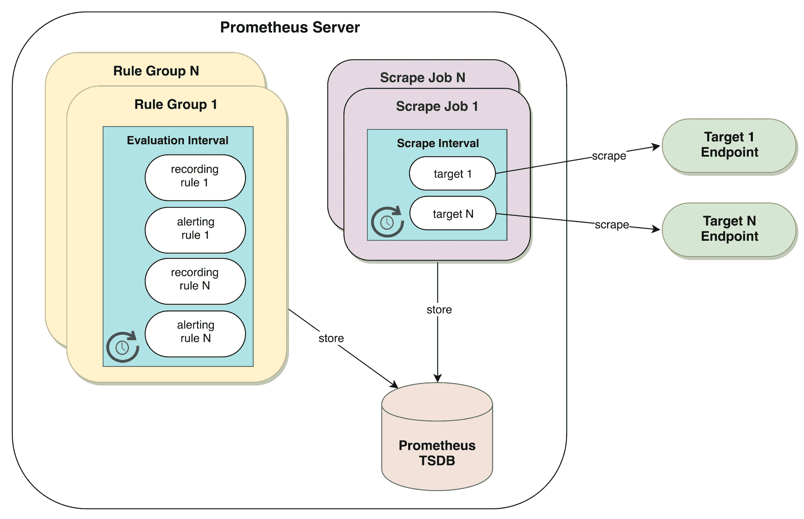
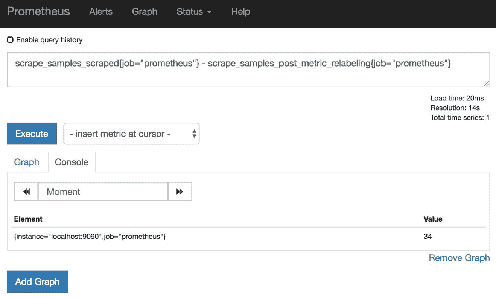
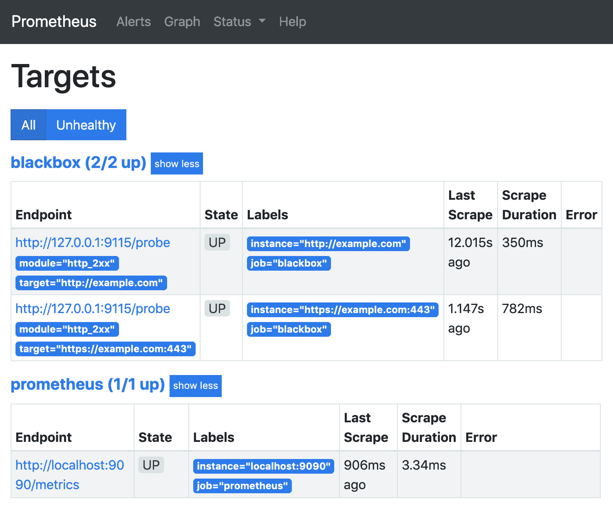
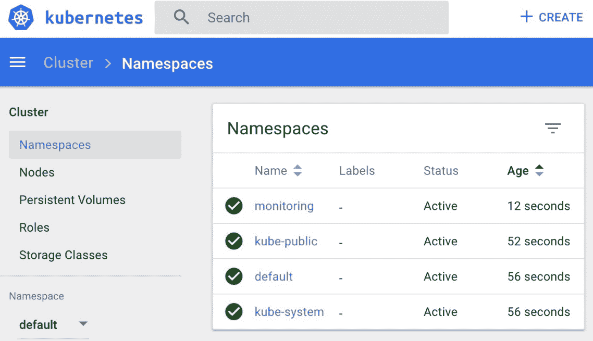
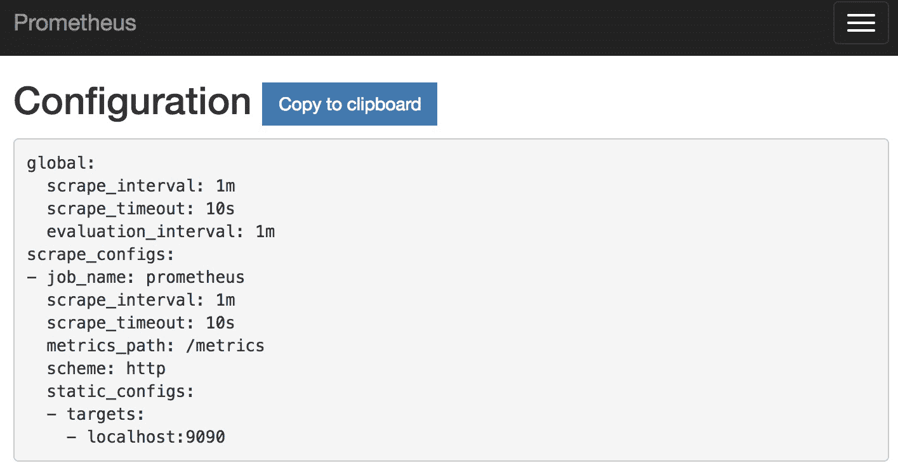
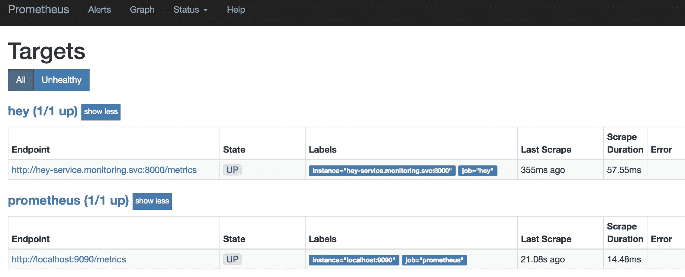
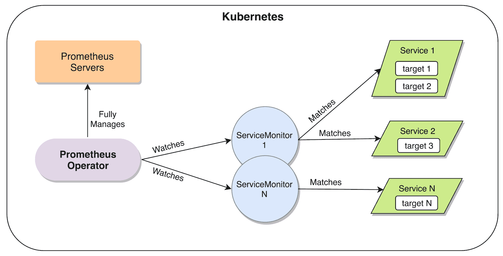
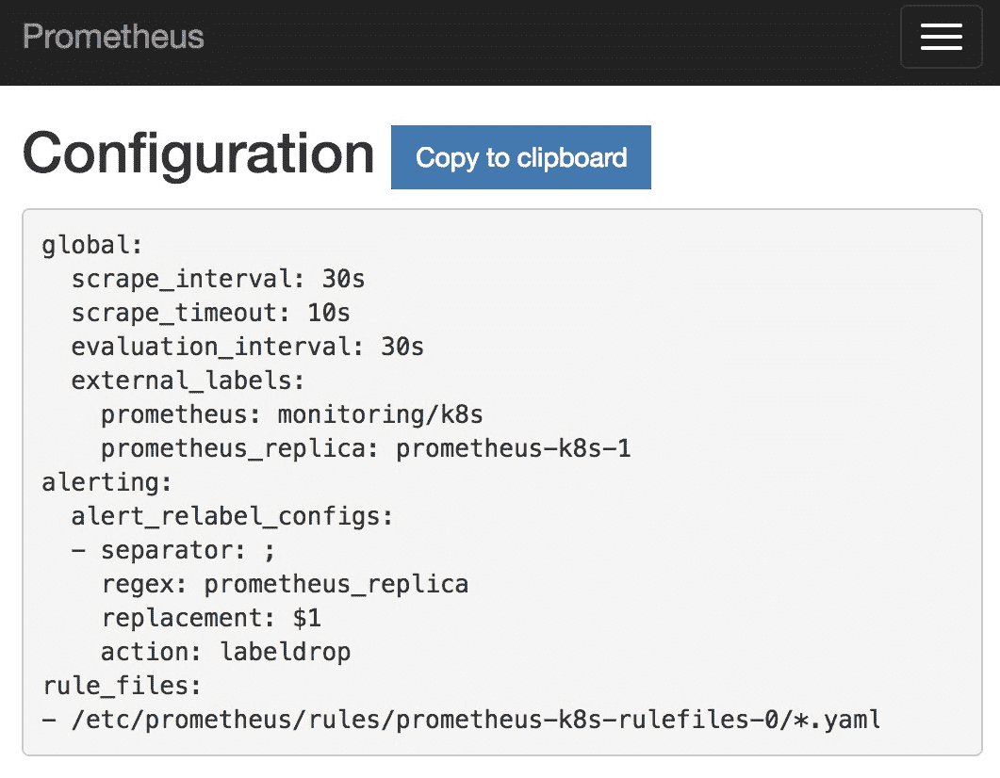
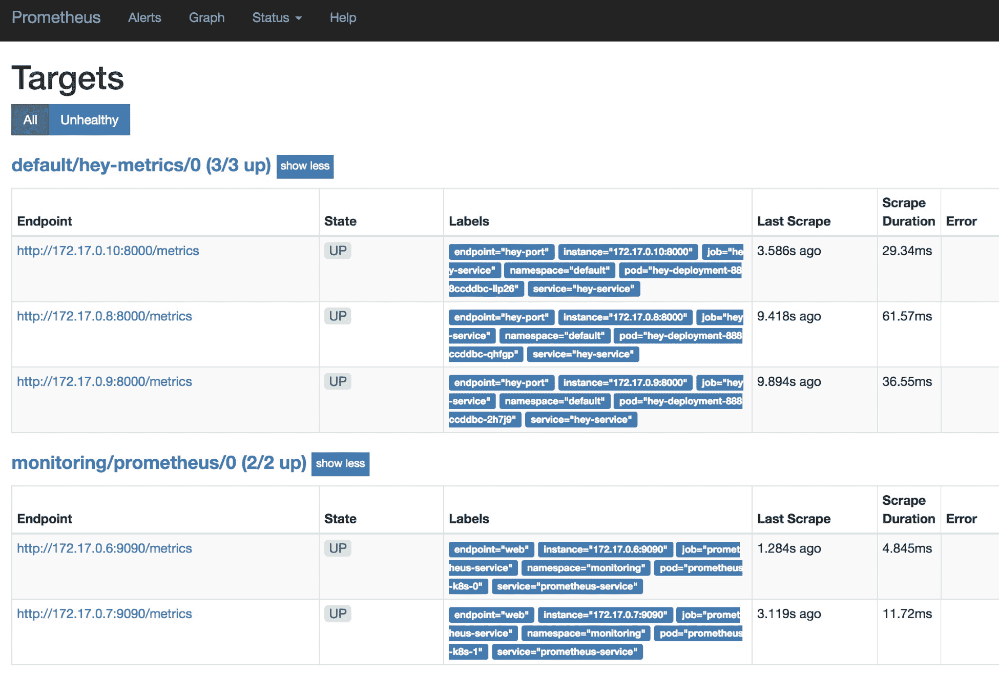

# 第六章：运行 Prometheus 服务器

现在是时候动手配置一些 Prometheus 配置了。本章将探索这一堆栈的核心组件，你将了解常见的使用模式和在虚拟机及容器下的完整设置过程。这将帮助你真正验证你迄今为止所学的知识，并为你提供实际的示例来测试你的知识。

简要来说，本章将涵盖以下主题：

+   深入探索 Prometheus 配置

+   在独立服务器上管理 Prometheus

+   在 Kubernetes 中管理 Prometheus

# 深入探索 Prometheus 配置

Prometheus 的一个关键特性是，得益于其极为合理的默认配置，它可以从本地计算机上运行的快速测试，扩展到生产级实例，处理每秒数百万个样本，而几乎不需要触动它的任何一个设置选项。话虽如此，了解有哪些配置选项可用，能够帮助你充分利用 Prometheus 的功能，这一点非常有用。

Prometheus 服务器有两种主要的配置类型——命令行标志和通过配置文件提供的操作逻辑。命令行标志控制那些无法在运行时更改的参数，例如存储路径或绑定的 TCP 端口，并且需要完全重启服务器才能应用此级别所做的任何更改。配置文件控制运行时配置，例如抓取作业定义、规则文件位置或远程存储设置。在接下来的章节中，我们将深入探讨这两种配置类型。

# Prometheus 启动配置

虽然在没有启动配置的情况下运行 Prometheus 服务器对于本地实例可能足够，但对于任何严肃的部署，建议配置一些基本的命令行标志。

在撰写本文时，Prometheus 大约有 30 个命令行标志，用于调整其操作配置的多个方面，这些标志按以下命名空间分组：`config`、`web`、`storage`、`rules`、`alertmanager`、`query` 和 `log`。`--help` 标志在描述大部分选项时做得很好，但有些地方可能简短一些，因此我们将重点介绍那些对于任何部署都很重要或其功能不太显而易见的选项。

# 配置部分

通常首先需要设置的重要内容是 Prometheus 配置文件的路径，可以通过 `--config.file` 标志来指定。默认情况下，Prometheus 会在当前工作目录中查找名为 `prometheus.yml` 的文件。虽然这对于本地测试很方便，但生产环境的部署通常会将服务器二进制文件和配置文件放置在各自的路径中，因此通常需要使用这个标志。顺便提一下，配置文件和存储目录是启动 Prometheus 服务器的唯一硬性要求；如果没有配置文件，Prometheus 会拒绝启动。

# 存储部分

按照上一部分相同的逻辑，`--storage.tsdb.path` 标志应该被设置来配置数据存储位置的基础路径。默认情况下，它指向当前工作目录中的 `data/`，因此建议将其指向更合适的路径——可能是不同的驱动器/卷，在那里数据可以安全地持久化并且减少 I/O 竞争。需要注意的是，不支持 NFS（包括 AWS EFS），因为它不支持进行安全数据库文件管理所需的 POSIX 锁定原语。将 Prometheus 数据存储目录放在网络共享上也是不推荐的，因为暂时的网络故障会影响监控系统的正常运行——尤其是在你最需要它的时候。

Prometheus 本地存储一次只能由一个 Prometheus 实例进行写入。为了确保这一点，它在数据目录中使用锁文件。在启动时，它会尝试使用操作系统特定的系统调用来锁定此文件，如果文件已被另一个进程锁定，则会拒绝启动。

这种行为可能存在一个边缘情况；当使用持久化卷存储数据目录时，如果通过相同的卷重新启动 Prometheus 实例作为另一个容器实例，可能会出现前一个实例没有解锁数据库的情况。这种问题会使这种配置容易受到竞争条件的影响。幸运的是，存在 `--storage.tsdb.no-lockfile` 标志，可以在这种情况下使用。不过需要警告的是，一般来说（特别是在大多数 Prometheus 部署中），禁用锁文件是个坏主意，因为这样会更容易导致意外的数据损坏。

# Web 部分

下一步是配置用户将使用什么地址来访问 Prometheus 服务器。`--web.external-url` 标志设置此基础 URL，以便在 web 用户界面和外发警报中生成的 web 链接能够正确地指向 Prometheus 服务器或多个服务器。这可能是负载均衡器/反向代理的 DNS 名称，一个 Kubernetes 服务，或者在最简单的部署中，运行服务器的主机的公共可访问完全合格域名。为了完整性，并且如官方文档中所述，当 Prometheus 位于某个具有内容切换的七层反向代理后面时（也称为基于位置的切换或 URL 前缀路由），也可以在此提供一个 URL 路径。

Prometheus 服务器像传统的`*nix`守护进程一样，当收到`SIGHUP`信号时，会重新加载其配置文件（以及规则文件）。然而，有些情况下发送此信号并不方便（例如，在 Kubernetes 等容器编排系统中运行，或者使用自定义构建的自动化工具），甚至可能不可能（例如，在 Windows 上运行 Prometheus 时）。在这些情况下，可以使用`--web.enable-lifecycle`标志来启用`/-/reload`和`/-/quit`这两个 HTTP 端点，用于控制、重新加载和关闭 Prometheus。为了防止意外触发这些端点，并且因为`GET`请求在语义上不合适，必须使用`POST`请求。此标志默认关闭，因为对这些端点的无限制访问可能带来安全隐患。

同样，`--web.enable-admin-api`标志默认也是关闭的，原因相同。此标志启用提供一些高级管理操作的 HTTP 端点，例如创建数据快照、删除时间序列和清理墓碑数据。

正如你在第三章《设置测试环境》中可能已经注意到，官方的 Prometheus tarball 还带有两个额外的目录，`consoles`和`console_libraries`。这些是启用 Prometheus 本地仪表盘功能所需的，然而这一点常常被忽视。这些目录包含一些预配置的仪表盘（称为控制台）和支持模板库，这些都是用 Go 模板语言编写的。可以通过使用`--web.console.templates`和`--web.console.libraries`标志来配置 Prometheus 加载这些内容。之后，这些仪表盘将可在`/consoles`端点访问（如果存在 index.html 文件，主 Web 界面中将提供一个链接）。

# 查询部分

本节内容主要讲解如何调整查询引擎的内部工作机制。某些调整比较简单易懂，例如指定查询在被终止之前能够运行多长时间（`--query.timeout`），或者能够同时运行多少个查询（`--query.max-concurrency`）。

然而，有两个参数设置的限制可能会产生不明显的后果。第一个是`--query.max-samples`，它在 Prometheus 2.5.0 版本中引入，用于设置可以加载到内存中的最大样本数量。这个设置是为了限制查询子系统能够使用的最大内存（与`--query.max-concurrency`一起使用），以避免出现*致命查询*——一个将大量数据加载到内存中，导致 Prometheus 达到内存限制并终止进程的查询。2.5.0 版本之后的行为是，如果某个查询触及了该标志所设置的限制（默认是 50,000,000 个样本），查询会直接失败。

第二个配置项是`--query.lookback-delta`。在不详细解释 PromQL 内部工作原理的前提下，这个标志设置了 Prometheus 在考虑数据点过时之前，回溯查询时间序列数据的时间限制。这意味着，如果你的数据收集间隔比此处设置的更长（默认值为五分钟），你将在警报和图表中得到不一致的结果，因此，允许失败的最大合理值为两分钟。

# Prometheus 配置文件解析

我们在前一节中提到的配置文件声明了 Prometheus 实例的运行时配置。如我们所见，所有与抓取任务、规则评估以及远程读写配置相关的内容都在此定义。正如前面提到的，这些配置可以在不关闭 Prometheus 服务器的情况下重新加载，可以通过向进程发送`SIGHUP`信号，或者向`/-/reload`端点发送 HTTP POST 请求来实现（当启动时使用了`--web.enable-lifecycle`）。

从高层次看，我们可以将配置文件划分为以下几个部分：

+   `global`

+   `scrape_configs`

+   `alerting`

+   `rule_files`

+   `remote_read`

+   `remote_write`

再次提醒，官方的 Prometheus 文档包括了该文件的架构，该文件采用 YAML 格式。在本章中，我们将介绍一个示例配置供大家分析，但只详细讲解`global`和`scrape_configs`部分。警报和`rule_files`在第九章《定义警报和记录规则》中有详细讨论，而`remote_read`和`remote_write`则在第十四章《将长期存储与 Prometheus 集成》中有解释。

一个包含最全配置选项的配置文件可以在 Prometheus 项目的 GitHub 仓库中找到，地址为：[`github.com/prometheus/prometheus/blob/v2.9.2/config/testdata/conf.good.yml`](https://github.com/prometheus/prometheus/blob/v2.9.2/config/testdata/conf.good.yml)。

我们的示例配置如下所示：

```
global:
  scrape_interval: 1m
...
scrape_configs:
  - job_name: 'prometheus'
    scrape_interval: 15s
    scrape_timeout: 5s
    sample_limit: 1000
    static_configs:
      - targets: ['localhost:9090']
    metric_relabel_configs:
      - source_labels: [ __name__ ]
        regex: expensive_metric_.+
        action: drop
```

初看之下，它可能显得有些复杂，但为了清晰起见，我们正在进行一些配置，这些配置的默认值通常不需要修改。

让我们逐个详细查看每个部分。

# 全局配置

`global`配置定义了每个其他配置部分的默认参数，同时概述了应该添加到外部系统度量值的标签，如下所示的代码块所示：

```
global:
  scrape_interval: 1m
  scrape_timeout: 10s
  evaluation_interval: 1m
  external_labels:
    dc: dc1
    prom: prom1
```

持续时间只能是整数值，并且只能有一个单位。这意味着，如果试图使用 0.5 分钟而不是 30 秒，或用一分钟 30 秒而不是 90 秒，将被视为配置错误。

`scrape_interval` 设置目标被抓取的默认频率。通常在 10 秒到 1 分钟之间，默认的 `1m` 是一个很好的保守值。较长的间隔不建议使用，因为丧失的粒度（尤其是在仪表类指标中）开始影响正确告警的能力，并且查询会变得麻烦，因为你需要意识到某些较短的间隔可能不会返回数据。此外，考虑到默认的 5 分钟回环差值（在命令行标志中提到），任何大于 150 秒（2 分钟 30 秒）的 `scrape_interval` 都意味着如果一次抓取失败，那么给定目标的每个时间序列都会被视为过期。

`scrape_timeout` 定义了 Prometheus 默认等待目标响应的时间，超过该时间则关闭连接并将抓取标记为失败（如果未声明，则默认为 10 秒）。请记住，尽管预期目标能快速响应抓取请求，但关于指标暴露的指导原则要求在抓取时进行数据收集，而非使用缓存，这意味着某些导出程序可能需要稍长时间来响应。

类似于 `scrape_interval`，`evaluation_interval` 设置记录和告警规则评估的默认频率。为了确保一致性，两者应当相同。关于这一点将在第九章《定义告警和记录规则》中详细讨论：



图 5.1：Prometheus 中抓取间隔和评估间隔的表示

最后，`external_labels` 允许你设置标签名/值对，这些标签会添加到发送到外部系统的时间序列或警报中，例如 Alertmanager、远程读写基础设施，甚至是通过联合（federation）连接的其他 Prometheus 实例。此功能通常用于唯一标识给定警报或时间序列的来源；因此，通常会标识区域、数据中心、分片，甚至是 Prometheus 服务器的实例标识符。

根据官方文档，*Prometheus* 的复数形式是 *Prometheis*：[`prometheus.io/docs/introduction/faq/#what-is-the-plural-of-prometheus`](https://prometheus.io/docs/introduction/faq/#what-is-the-plural-of-prometheus)。

# 抓取配置

尽管 Prometheus 将空文件视为有效的配置文件，但最基本的有效配置需要一个 `scrape_configs` 部分。在这里，我们定义用于指标收集的目标，以及在实际数据摄取之前是否需要进行一些抓取后处理。

在之前介绍的配置示例中，我们定义了两个抓取任务：`prometheus` 和 `blackbox`。在 Prometheus 的术语中，抓取是指通过 HTTP 请求从目标实例收集指标，解析响应，并将收集的样本存入存储。Prometheus 生态系统中用于指标收集的默认 HTTP 端点恰当地命名为 `/metrics`。

这样的实例集合被称为**任务**。任务中的实例通常是相同服务的多个运行副本，因此通常会为每种被监控的软件定义一个任务，即使在使用服务发现时也可能有所不同，正如我们在第十二章《选择正确的服务发现》中将看到的那样。实例和任务的组合标识了收集样本的来源，因此这些会自动作为标签添加到摄取的数据中，如下代码块所示：

```
scrape_configs:
 - job_name: 'prometheus'
    static_configs:
      - targets: ['localhost:9090']
...

  - job_name: 'blackbox'
    static_configs:
      - targets:
        - http://example.com
        - https://example.com:443
...
```

一个抓取任务定义至少需要一个 `job_name` 和一组目标。在此示例中，`static_configs` 被用来声明两个抓取任务的目标列表。虽然 Prometheus 支持多种动态定义该列表的方法，但 `static_configs` 是最简单和直接的方法：

```
scrape_configs:
 - job_name: 'prometheus'
    scrape_interval: 15s
    scrape_timeout: 5s
    sample_limit: 1000
    static_configs:
      - targets: ['localhost:9090']
    metric_relabel_configs:
      - source_labels: [ __name__ ]
        regex: expensive_metric_.+
        action: drop
```

详细分析 `prometheus` 抓取任务后，我们可以看到 `scrape_interval` 和 `scrape_timeout` 都可以在任务级别重新声明，从而覆盖全局值。如前所述，不推荐使用不同的抓取间隔，因此仅在绝对必要时使用此功能。

通过设置 `sample_limit`，Prometheus 将确保不论设置了什么值，它都会在每次抓取时检查，如果样本数量超过限制，则不摄取这些样本，并将该次抓取标记为失败。这是一个很好的安全机制，可以防止来自不可控目标的基数爆炸影响监控系统。

这里最后一个相关的配置是 `metric_relabel_configs`。这是一个强大的重写引擎，允许在保存到存储之前转换或丢弃收集到的指标的身份。此功能最常见的使用场景是将一组表现不佳的指标列入黑名单，丢弃标签而不影响指标的身份，或者更改标签以更好地符合 Prometheus 的语义。理想情况下，`metric_relabel_configs` 应该作为在源头问题未解决之前的临时解决方法，因此频繁使用它可能是一个警示信号。前面的示例使用 `metric_relabel_configs` 来丢弃每个以 `expensive_metric_` 开头的指标：

```
  - job_name: 'blackbox'
    metrics_path: /probe
    scheme: http
    params:
      module: [http_2xx]
    static_configs:
      - targets:
        - http://example.com
    relabel_configs:
      - source_labels: [__address__]
        target_label: __param_target
      - source_labels: [__param_target]
        target_label: instance
      - target_label: __address__
        replacement: 127.0.0.1:9115
```

虽然我们将在下一章深入探讨 blackbox exporter，但这里的配置用于帮助解释以下重要配置：

+   `metrics_path` 用于更改 Prometheus 应该抓取的端点

+   `scheme` 定义了连接目标时是使用 HTTP 还是 HTTPS

+   `params` 允许你定义一组可选的 HTTP 参数

然而，最重要且最有用的配置是 `relabel_configs`。它提供与 `metric_relabel_configs` 相同的强大语义，但功能完全不同；`relabel_configs` 用于操作抓取任务的目标列表。重新标记操作是按顺序执行的，因此可以创建或修改标签，然后在下一个操作中使用这些标签。默认情况下，目标将具有几个自动生成的标签，这些标签将可供重新标记使用：`job` 标签将设置为 `job_name` 配置，`__address__` 标签将使用目标的主机和端口生成，`__scheme__` 和 `__metrics_path__` 标签将设置为各自的配置（`scheme` 和 `metrics_path`），并且会为 `params` 配置中定义的每个参数创建一个 `__param_<name>` 标签。此外，当使用服务发现机制时，`__meta_` 标签将可用，正如我们在第十二章 *选择合适的服务发现*中看到的那样。如果在重新标记阶段结束时 `instance` 标签未设置，则将使用 `__address__` 来设置它。以两个下划线开头的标签（`__`）将在重新标记阶段结束时被删除。最后，如果在重新标记过程中需要临时标签，始终使用 `__tmp` 前缀，因为它保证不会与 Prometheus 内部标签重叠。

对于黑盒导出器，这个功能非常有用，因为我们需要将探测请求发送到导出器，导出器将使用 `target` 的 `GET` 参数来执行其工作。因此，通过这个示例，对于 `static_configs` 中指定的每个目标，此配置执行以下操作：

+   将目标的地址复制到 `__param_target` 标签中，该标签将用于设置抓取中的 `target` `GET` 参数。

+   将新创建的标签的内容复制到 `instance` 标签中，以便明确设置它，绕过基于 `__address__` 的自动生成。

+   用黑盒导出器的地址替换 `__address__` 标签，以便抓取任务被定向到导出器，而不是直接定向到我们在 `` `static_configs` `` 中指定的目标。

`relabel_configs` 用于重写目标列表（它在抓取之前运行），而 `metric_relabel_configs` 用于重写标签或删除样本（它在抓取之后运行）。

本节中使用的示例配置仅用于演示目的。例如，通常不需要在 Prometheus 本身上设置 `sample_limit`，或者在没有明确理由的情况下删除度量指标。

一个非常有用的度量是 `up` 度量。这个度量暴露了抓取任务的状态。它至少包括一个与相应任务名称的标签和另一个与目标实例的标签。在其样本中，成功抓取时我们可以看到值 `1`，而抓取失败时则为 `0`。

接下来，我们将开始在不同的部署环境中管理 Prometheus。

# 在独立服务器上管理 Prometheus

由于我们之前讨论了多个配置定义，现在我们准备通过管理 Prometheus 的独立实例来将它们付诸实践。在这些示例中，我们将展示多个配置，同时提供一个环境来验证它们。

# 服务器部署

要创建一个新的 Prometheus 实例，请移动到正确的仓库路径，如下所示：

```
cd chapter05/
```

确保没有其他测试环境正在运行，然后启动本章的环境，如下所示：

```
vagrant global-status
vagrant up
```

几秒钟后，新的实例将可供检查，并且 Prometheus Web 界面可以通过`http://192.168.42.10:9090`访问。

# 配置检查

创建新的实例并运行后，使用以下命令登录：

```
vagrant ssh prometheus
```

我们可以通过以下命令查看`systemd`单元文件来验证当前使用的启动配置：

```
cat /etc/systemd/system/prometheus.service
```

以下摘录显示了当前的标志设置：

```
ExecStart=/usr/bin/prometheus \
    --config.file=/etc/prometheus/prometheus.yml \
    --storage.tsdb.path=/var/lib/prometheus/data \
    --web.console.templates=/usr/share/prometheus/consoles \
    --web.console.libraries=/usr/share/prometheus/console_libraries
```

Prometheus 本身的配置文件，如`--config.file`标志所定义，可以按如下方式查看：

```
cat /etc/prometheus/prometheus.yml
```

如我们所见，当前使用的配置与之前在 Prometheus 配置文件演示中展示的配置类似。我们现在可以验证之前提到的一些概念。

由于`prometheus`任务中的`metric_relabel_configs`，我们可以使用 Prometheus 的两个按抓取的指标来确定我们的配置丢弃的样本数量，如下所示：

+   `scrape_samples_scraped`：此指标提供已收集样本的总数

+   `scrape_samples_post_metric_relabeling`：此指标提供在指标重标记发生后可用的样本总数

如果我们减去这两个指标，我们就可以得到丢弃的样本数量（在我们的示例中，这些是所有以`go_`开头的指标名称）：



图 5.2：丢弃的指标数量

我们可以确认配置重标记的结果，在我们的示例中，它生成了`blackbox`任务下的实例标签：



图 5.3：由*relabel_configs*生成的实例标签

您可以通过使用提供的工具`promtool`来验证 Prometheus 配置，它将在第八章中详细分析，*故障排除与验证*。当使用新配置重新加载 Prometheus 时，您还可以查看`prometheus_config_last_reload_successful`指标，评估配置是否已成功解析并应用。

# 清理

完成测试后，只需确保您位于`chapter05/`路径下并执行以下命令：

```
vagrant destroy -f
```

不必过于担心——如果需要，您可以轻松重新启动环境。

# 在 Kubernetes 中管理 Prometheus

Kubernetes 是首个从 CNCF 毕业的项目，目前是容器编排的事实标准。早期，Heapster 被广泛用作与 Kubernetes 一起开箱即用的监控解决方案。最初，它是一个将监控数据发送到外部系统的工具，但后来它发展成了一个监控系统。然而，Prometheus 很快成为 Kubernetes 集群的事实标准监控系统。如今，构成 Kubernetes 集群的大多数组件都内置了 Prometheus 监控功能。

在接下来的部分中，我们将探讨如何通过基于 Kubernetes 项目和 Prometheus Operator 项目的示例，将 Prometheus 集成到 Kubernetes 环境中。

你可以分别在以下地址找到 Kubernetes 项目和 Prometheus Operator 的完整源代码：

[`github.com/kubernetes/kubernetes`](https://github.com/kubernetes/kubernetes) 和 [`github.com/coreos/prometheus-operator`](https://github.com/coreos/prometheus-operator)。

确保你已经具备第三章中定义的所有软件要求，*设置测试环境*，并确保它们是特定版本，特别是以下内容：

+   Minikube

+   kubectl

# 静态配置

尽管这种方法远非推荐，但它为更好地理解和排除 Kubernetes 中运行的 Prometheus 服务器的故障提供了基础。在此示例中，我们将创建一个 Prometheus 部署，使用 ConfigMap 定义服务器配置。

# Kubernetes 环境

确保没有`minikube`实例在运行以下命令：

```
minikube status
minikube delete
```

`minikube delete`是一个破坏性指令，所以在继续之前，请确保保存你的工作。

使用以下规格启动一个新的`minikube`实例：

```
minikube start \
 --cpus=2 \
 --memory=2048 \
 --kubernetes-version="v1.14.0" \
 --vm-driver=virtualbox
```

当上一个命令完成后，一个新的 Kubernetes 环境应该已经准备好使用。你可以通过以下命令访问其仪表盘，该命令将在默认浏览器中打开 Kubernetes 仪表盘地址：

```
minikube dashboard
```

要继续我们的示例，请确保进入正确的仓库路径，如下所示：

```
cd chapter05/provision/kubernetes/static
```

为了组织结构，我们将使用`kubectl`帮助创建一个新的命名空间，命名为`monitoring`，并使用以下清单：

```
apiVersion: v1
kind: Namespace
metadata:
 name: monitoring
```

使用以下命令应用上面的清单：

```
kubectl apply -f monitoring-namespace.yaml
```

我们可以在 Kubernetes 仪表盘上验证命名空间的成功创建：



图 5.4：Kubernetes 仪表盘 - 监控命名空间

# Prometheus 服务器部署

在我们的新命名空间可用之后，是时候创建一个非常简单的 Prometheus 配置，并使用以下清单将其保存到 ConfigMap 中：

```
apiVersion: v1
kind: ConfigMap
metadata:
  name: prometheus-config
  namespace: monitoring 
data:
  prometheus.yml: |
    scrape_configs:
    - job_name: prometheus
      static_configs:
      - targets:
        - localhost:9090
```

使用以下命令应用上面的清单：

```
kubectl apply -f prometheus-configmap.yaml
```

现在，是时候启动 Prometheus 的新部署了，确保我们将之前配置的 ConfigMap 挂载到我们正在部署的 pod 中。Deployment 对象配置如下元数据：

```
apiVersion: apps/v1
kind: Deployment
metadata:
  name: prometheus-deployment
  namespace: monitoring
  labels:
    app: prometheus
```

Prometheus 容器将根据其配置文件和来自卷挂载的数据目录启动，如下所示：

```
        args:
          - --config.file=/etc/config/prometheus.yml
          - --storage.tsdb.path=/data
        volumeMounts:
          - name: config-volume
            mountPath: /etc/config/prometheus.yml
            subPath: prometheus.yml
          - name: prometheus-data
            mountPath: /data
            subPath: ""
```

`config-volume` 卷是从 ConfigMap 创建的，而 `prometheus-data` 卷是通过空目录创建的。这可以从以下代码片段中看到：

```
      volumes:
        - name: config-volume
          configMap:
           name: prometheus-config
        - name: prometheus-data
          emptyDir: {}
```

使用以下命令应用之前的清单：

```
kubectl apply -f prometheus-deployment.yaml
```

我们可以使用这个代码片段跟踪部署状态：

```
kubectl rollout status deployment/prometheus-deployment -n monitoring
```

我们应该使用以下命令查看 Prometheus 实例的日志：

```
kubectl logs --tail=20 -n monitoring -l app=prometheus
```

部署成功后，我们准备好为我们的实例分配一个新服务，选择 `NodePort`，这样我们就可以无需端口转发直接访问它，如下所示：

```
kind: Service
apiVersion: v1
metadata:
  name: prometheus-service
  namespace: monitoring
spec:
  selector:
    app: prometheus
  type: NodePort
  ports:
  - name: prometheus-port
    protocol: TCP
    port: 9090
    targetPort: 9090
```

使用以下命令应用之前的清单：

```
kubectl apply -f prometheus-service.yaml
```

然后你可以使用以下代码片段检查你的新 Prometheus 服务：

```
minikube service prometheus-service -n monitoring
```

这将打开浏览器并指向 Prometheus 服务端点。你现在可以通过 Prometheus 的 web 界面查看正在运行的配置和目标：



图 5.5： Prometheus 初始配置

现在我们已经在 Kubernetes 中运行了 Prometheus，可以开始为其添加目标进行抓取。在接下来的章节中，我们将看看如何实现这一目标。

# 将目标添加到 Prometheus

为了举例说明，我们将部署另一个服务，并逐步演示如何将其添加到我们的 Prometheus 服务器中。我们将使用一个小型的 *Hello World* 类型应用程序，名为 *Hey*，来进行设置。

*Hey* 应用程序的代码可以在 [`github.com/kintoandar/hey`](https://github.com/kintoandar/hey) 上查看。

这些步骤与 Prometheus 服务器的部署非常相似。首先使用以下清单创建一个新的 *Hey* 部署：

```
apiVersion: apps/v1
kind: Deployment
metadata:
  name: hey-deployment
  namespace: monitoring
  labels:
    app: hey
...
      - name: hey
        image: kintoandar/hey:v1.0.1
...
        - name: http
          containerPort: 8000
...
```

使用以下命令应用之前的清单：

```
kubectl apply -f hey-deployment.yaml
```

我们可以使用这个代码片段跟踪部署状态：

```
kubectl rollout status deployment/hey-deployment -n monitoring
```

我们可以使用以下命令验证 *Hey* 实例的日志：

```
kubectl logs --tail=20 -n monitoring -l app=hey
```

部署成功后，我们准备好为我们的实例分配一个新服务，选择 `NodePort`，这样我们就可以无需端口转发直接访问它，如下所示：

```
kind: Service
apiVersion: v1
metadata:
  name: hey-service
  namespace: monitoring
spec:
  selector:
    app: hey
  type: NodePort
  ports:
  - name: hey-port
    protocol: TCP
    port: 8000
    targetPort: 8000
```

使用以下命令应用之前的清单：

```
kubectl apply -f hey-service.yaml
```

现在，你可以这样检查你的新 *Hey* 服务：

```
minikube service hey-service -n monitoring
```

由于在我们的示例中 Prometheus 是静态管理的，我们需要为新的 *Hey* 目标添加指标收集。这意味着我们需要更改 Prometheus 的 ConfigMap 以反映新增的服务，如下所示：

```
kind: ConfigMap
metadata:
  name: prometheus-config
  namespace: monitoring 
data:
  prometheus.yml: |
    scrape_configs:
    - job_name: prometheus
      static_configs:
      - targets:
        - localhost:9090
    - job_name: hey
      static_configs:
      - targets:
        - hey-service.monitoring.svc:8000
```

使用以下命令应用之前的清单：

```
kubectl create -f prometheus-configmap-update.yaml -o yaml --dry-run | kubectl apply -f -
```

如果你检查正在运行的 Prometheus 配置，你会发现没有变化；这是因为没有触发新的部署。为了使部署生效，需要更改部署定义，因此我们只需更改版本注释并应用新的清单，如下所示：

```
kubectl apply -f prometheus-deployment-update.yaml
```

我们可以使用以下命令跟踪部署状态：

```
kubectl rollout status deployment/prometheus-deployment -n monitoring
```

片刻后，将会进行一次新的部署，改变 Prometheus 配置并出现一个新的目标，你可以在 Prometheus 的 Web 用户界面中验证这一点：



图 5.6：Prometheus 定位到 Hey 应用

你可能已经注意到，在这个示例中并未要求配置 **基于角色的访问控制** (**RBAC**)。这是因为所有 pod 都运行在同一个命名空间，且 Prometheus 尚未需要访问 Kubernetes API。我们坚信，RBAC 是安全的 Kubernetes 设置中的基础。

# 动态配置 – Prometheus Operator

CoreOS 是构建名为 Operator 的模式的先驱，Operator 抽象了 Kubernetes 应用的打包、部署和管理的复杂性。Operator 将应用所需的操作知识（如配置和部署逻辑）合成到 Kubernetes 自定义资源和自定义控制器中。

自定义资源是扩展 Kubernetes API 的对象，允许自定义 API 定义。自定义控制器旨在实现资源的用户所需状态，持续保持该状态。

将 Kubernetes 自定义资源和自定义控制器结合成模式，就是让 Operator 定义得以实现的关键。

在实现这种模式时，用户不需要为每个示例定义持久化存储和特定环境配置，而是直接请求该应用程序的一个实例，Operator 会抽象出所有所需的依赖项，并自动提供最终结果。

在我们的例子中，除了管理部署，包括 Prometheus 服务器的 pod 数量和持久化卷外，Prometheus Operator 还将使用 ServiceMonitor 的概念动态更新配置，ServiceMonitor 会针对运行容器的标签匹配规则来定位服务：



图 5.7：Prometheus Operator 逻辑图

掌握这些知识后，我们将提供一个示例，展示如何使用 Prometheus Operator 部署和配置 Prometheus，包括从应用程序收集指标，这次我们将在不同的命名空间中运行应用。

# Kubernetes 环境

确保没有 `minikube` 实例在运行，如下所示：

```
minikube status
minikube delete
```

使用以下规格启动一个新的 `minikube` 实例：

```
minikube start \
 --cpus=2 \
 --memory=2048 \
 --kubernetes-version="v1.14.0" \
 --vm-driver=virtualbox
```

当前一个命令完成后，一个新的 Kubernetes 环境应该准备好使用。你可以使用以下命令访问其仪表盘，命令会在默认浏览器中打开 Kubernetes 仪表盘地址：

```
minikube dashboard
```

要继续部署我们的示例，请确保进入正确的仓库路径，如下所示：

```
cd chapter05/provision/kubernetes/operator
```

像之前的例子一样，我们将使用`kubectl`创建一个新的命名空间，命名为`monitoring`，如下所示：

```
kubectl apply -f monitoring-namespace.yaml
```

# Prometheus Operator 部署

创建好新的命名空间后，接下来需要确保 Prometheus Operator 的所有访问权限已经到位，如接下来的几个配置片段所示。第一个片段定义了`ClusterRole`：

```
apiVersion: rbac.authorization.k8s.io/v1
kind: ClusterRole
metadata:
  name: prometheus-operator
rules:
- apiGroups: [apiextensions.k8s.io]
  verbs: ['*']
  resources: [customresourcedefinitions]
- apiGroups: [monitoring.coreos.com]
  verbs: ['*']
  resources: 
  - alertmanagers
  - prometheuses
  - servicemonitors
...
```

然后，我们将`ClusterRole`应用到`ClusterRoleBinding`：

```
apiVersion: rbac.authorization.k8s.io/v1
kind: ClusterRoleBinding
metadata:
  name: prometheus-operator
roleRef:
  apiGroup: rbac.authorization.k8s.io
  kind: ClusterRole
  name: prometheus-operator
subjects:
- kind: ServiceAccount
  name: prometheus-operator
  namespace: monitoring
```

最后，我们为`ClusterRoleBinding`创建一个`ServiceAccount`：

```
apiVersion: v1
kind: ServiceAccount
metadata:
  name: prometheus-operator
  namespace: monitoring
```

使用以下命令应用包含前面片段的清单：

```
kubectl apply -f prometheus-operator-rbac.yaml
```

配置好新的服务账户后，我们准备好部署 Operator 本身，如下所示：

```
apiVersion: apps/v1beta2
kind: Deployment
metadata:
  labels:
    k8s-app: prometheus-operator
  name: prometheus-operator
  namespace: monitoring
spec:
  replicas: 1
  selector:
    matchLabels:
      k8s-app: prometheus-operator
...
      serviceAccountName: prometheus-operator
```

使用以下命令应用前面的清单：

```
kubectl apply -f prometheus-operator-deployment.yaml
```

我们可以使用以下代码片段跟踪部署状态：

```
kubectl rollout status deployment/prometheus-operator -n monitoring
```

Operator 部署完成后，我们现在可以使用它来部署和管理 Prometheus 实例。

# Prometheus 服务器部署

在继续设置 Prometheus 之前，我们需要为其实例授予正确的访问控制权限。以下是 Prometheus RBAC 清单中的片段，完成了这一任务。首先，我们需要创建一个`ClusterRole`，允许 Prometheus 通过 GET 请求访问`/metrics`：

```
apiVersion: rbac.authorization.k8s.io/v1
kind: ClusterRole
metadata:
  name: prometheus-k8s
rules:
...
- nonResourceURLs:
  - /metrics
  verbs:
  - get
```

接下来，我们创建一个`ClusterRoleBinding`，将前面提到的`ClusterRole`权限授予用户，在我们的例子中是`ServiceAccount`：

```
apiVersion: rbac.authorization.k8s.io/v1
kind: ClusterRoleBinding
metadata:
  name: prometheus-k8s
roleRef:
  apiGroup: rbac.authorization.k8s.io
  kind: ClusterRole
  name: prometheus-k8s
subjects:
- kind: ServiceAccount
  name: prometheus-k8s
  namespace: monitoring
```

最后，我们为 Prometheus 创建一个`ServiceAccount`：

```
apiVersion: v1
kind: ServiceAccount
metadata:
  name: prometheus-k8s
  namespace: monitoring
```

使用以下命令应用包含前面片段的清单：

```
kubectl apply -f prometheus-rbac.yaml
```

配置好服务账户后，我们可以使用 Prometheus Operator 通过以下清单部署 Prometheus 服务器：

```
apiVersion: monitoring.coreos.com/v1
kind: Prometheus
metadata:
  labels:
    prometheus: k8s
  name: k8s
  namespace: monitoring
spec:
  baseImage: quay.io/prometheus/prometheus
  version: v2.9.2
  replicas: 2
...
  serviceAccountName: prometheus-k8s
  serviceMonitorNamespaceSelector: {}
  serviceMonitorSelector: {}
```

使用以下命令应用前面的清单：

```
kubectl apply -f prometheus-server.yaml
```

我们可以使用以下命令跟踪部署进度：

```
kubectl rollout status statefulset/prometheus-k8s -n monitoring
```

部署完成后，我们将准备好为 Prometheus 服务器创建一个新的服务，并启动 Web 界面来验证当前设置，如下所示：

```
kubectl apply -f prometheus-service.yaml

minikube service prometheus-service -n monitoring 
```

以下是 Prometheus Operator 创建的 Prometheus 默认配置：



图 5.8：Prometheus Operator 创建的 Prometheus 默认配置

# 向 Prometheus 添加目标

到目前为止，我们已经部署了 Operator 并使用它部署了 Prometheus。现在，我们准备添加目标并探讨生成目标的逻辑。

在继续之前，我们还将部署一个应用程序，以增加可用目标的数量。为此，我们将再次使用*Hey*应用程序，这次使用默认命名空间：

```
apiVersion: apps/v1
kind: Deployment
metadata:
  name: hey-deployment
  namespace: default
spec:
  replicas: 3
  selector:
    matchLabels:
      app: hey
```

请特别注意标签和端口名称，如以下代码块所示；它们将被服务监视器使用：

```
  template:
    metadata:
      labels:
        app: hey
    spec:
      containers:
      - name: hey
        image: kintoandar/hey:v1.0.1
        ports:
        - name: hey-port
          containerPort: 8000
...
```

使用以下命令应用包含前面片段的清单：

```
kubectl apply -f hey-deployment.yaml
```

我们可以使用以下命令跟踪部署状态：

```
kubectl rollout status deployment/hey-deployment -n default
```

部署完成后，我们将创建一个新的服务，如以下代码块所示。请特别注意服务监视器将用于定位此服务的标签：

```
kind: Service
metadata:
  labels:
    squad: frontend
  name: hey-service
  namespace: default
spec:
  selector:
    app: hey
  type: NodePort
  ports:
  - name: hey-port
    protocol: TCP
    port: 8000
    targetPort: hey-port
```

使用以下命令应用之前的清单：

```
kubectl apply -f hey-service.yaml minikube service hey-service -n default
```

最后，我们将为 Prometheus 实例和 *Hey* 应用程序创建服务监视器，指示 Operator 配置 Prometheus，并添加所需的目标。请注意选择器配置——它将用于匹配我们之前创建的服务。

以下是 Prometheus 的服务监视器：

```
apiVersion: monitoring.coreos.com/v1
kind: ServiceMonitor
metadata:
  labels:
    k8s-app: prometheus
  name: prometheus
  namespace: monitoring
spec:
  endpoints:
  - interval: 30s
    port: web
  selector:
    matchLabels:
      prometheus: k8s
```

*Hey* 应用程序的服务监视器如下：

```
apiVersion: monitoring.coreos.com/v1
kind: ServiceMonitor
metadata:
  labels:
    app: hey
  name: hey-metrics
  namespace: default
spec:
  endpoints:
  - interval: 30s
    port: hey-port
  selector:
    matchLabels:
      squad: frontend
```

使用以下命令应用之前的清单：

```
kubectl apply -f prometheus-servicemonitor.yaml

kubectl apply -f hey-servicemonitor.yaml
```

你可以使用以下命令验证服务监视器的成功部署：

```
kubectl get servicemonitors --all-namespaces
```

在 Operator 重新配置 Prometheus 后，可能需要几秒钟，新增的目标应该会出现在 Prometheus 的网页界面上：



图 5.9：服务监视器配置后的 Prometheus 目标

ServiceMonitors 是使用 Prometheus Operator 时的核心构件。你可以配置任何进入抓取作业的内容，如抓取和超时间隔、抓取的指标端点、HTTP 查询参数等。你可以在 [`github.com/coreos/prometheus-operator/blob/master/Documentation/api.md#endpoint`](https://github.com/coreos/prometheus-operator/blob/master/Documentation/api.md#endpoint) 找到这些配置的文档。

# 总结

在本章中，我们介绍了设置 Prometheus 服务器的一些重要配置概念。这些知识对定制 Prometheus 以适应特定场景至关重要。从启动标志到配置文件，我们还启动了一个实例来实验并验证我们获得的知识。

随着越来越多的工作负载过渡到容器，特别是 Kubernetes 环境，我们探讨了如何在这种环境中设置和管理 Prometheus。我们开始通过静态配置进行实验，作为理解更强大方法——Prometheus Operator 的基础。

在下一章中，我们将深入探讨最常见的导出器，并在此基础上进行构建，以便我们能够成功地从 Prometheus 收集来自不同来源的数据。

# 问题

1.  如果没有显式声明 `scrape_timeout` 会发生什么？

1.  如何让 Prometheus 重新加载其配置文件？

1.  Prometheus 会回溯多长时间来判断一个时间序列是否过时？

1.  `relabel_configs` 和 `metric_relabel_configs` 有什么区别？

1.  在静态部署示例中，我们将 Hey 应用程序的 Kubernetes 服务作为目标添加到 Prometheus。如果我们增加 *Hey* pod 的数量，会出现什么问题？

1.  在 Kubernetes 环境中，静态 Prometheus 配置是否合理？为什么？

1.  Prometheus Operator 依赖哪些 Kubernetes 组件来实现其目标？

# 进一步阅读

+   **Prometheus 配置**: [`prometheus.io/docs/prometheus/latest/configuration/configuration/`](https://prometheus.io/docs/prometheus/latest/configuration/configuration/)

+   **Prometheus TSDB APIs**: [`prometheus.io/docs/prometheus/latest/querying/api/#tsdb-admin-apis`](https://prometheus.io/docs/prometheus/latest/querying/api/#tsdb-admin-apis)

+   **Prometheus 安全性**: [`prometheus.io/docs/operating/security/`](https://prometheus.io/docs/operating/security/)

+   **Kubernetes 自定义控制器**: [`kubernetes.io/docs/concepts/extend-kubernetes/api-extension/custom-resources/#custom-controllers`](https://kubernetes.io/docs/concepts/extend-kubernetes/api-extension/custom-resources/#custom-controllers)

+   **Kubernetes 自定义资源**: [`kubernetes.io/docs/concepts/extend-kubernetes/api-extension/custom-resources/#customresourcedefinitions`](https://kubernetes.io/docs/concepts/extend-kubernetes/api-extension/custom-resources/#customresourcedefinitions)

+   **Prometheus Operator**: [`github.com/coreos/prometheus-operator/blob/master/Documentation/design.md`](https://github.com/coreos/prometheus-operator/blob/master/Documentation/design.md)
