# 第六章：导出器和集成

即使第一方导出器已经很好地覆盖了基本内容，Prometheus 生态系统仍然提供了多种第三方导出器，涵盖了其他所有内容。在本章中，我们将介绍一些最有用的导出器——从**操作系统**（**OS**）指标和**互联网控制消息协议**（**ICMP**）探测，到从日志生成指标，或者如何从短生命周期的进程（如批处理作业）中收集信息。

简要来说，本章节将涵盖以下主题：

+   本章的测试环境

+   操作系统导出器

+   容器导出器

+   从日志到指标

+   黑盒监控

+   推送指标

+   更多导出器

# 本章的测试环境

在本章中，我们将使用两个测试环境：一个基于**虚拟机**（**VMs**）模拟传统的静态基础设施，另一个基于 Kubernetes，用于现代工作流。以下主题将指导你完成这两种环境的自动化设置过程，但会略过每个导出器的详细内容——这些将在各自的章节中详细讲解。

# 静态基础设施测试环境

这种方法将抽象化所有部署和配置细节，只需几条命令，你就能拥有一个完全配置的测试环境。你仍然可以连接到每个访客实例，并调整示例配置。

要启动新的测试环境，请进入相对于仓库根目录的以下章节路径：

```
cd ./chapter06/
```

确保没有其他测试环境正在运行，并启动本章的环境：

```
vagrant global-status
vagrant up
```

你可以使用以下命令验证测试环境是否成功部署：

```
vagrant status
```

该指令将输出以下内容：

```
Current machine states:

prometheus                running (virtualbox)
target01                  running (virtualbox)

This environment represents multiple VMs. The VMs are all listed
above with their current state. For more information about a specific
VM, run `vagrant status NAME`.
```

最终结果将是如下图所示的环境：

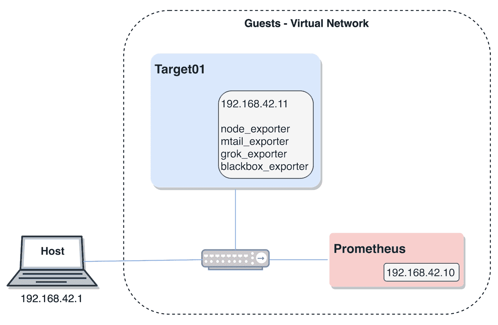

图 6.1：静态基础设施测试环境示意图

要连接到`target01`实例，只需运行以下命令：

```
vagrant ssh target01
```

要连接到 Prometheus 实例，使用以下代码片段：

```
vagrant ssh prometheus
```

当你完成当前环境后，请进入相对于仓库根目录的以下章节路径：

```
cd ./chapter06/
```

然后执行以下指令：

```
vagrant destroy -f
```

# Kubernetes 测试环境

要启动 Kubernetes 测试环境，首先必须确保没有正在运行的`minikube`实例，如下所示：

```
minikube status
minikube delete
```

使用以下规格启动一个新的`minikube`实例：

```
minikube start \
 --cpus=2 \
 --memory=3072 \
 --kubernetes-version="v1.14.0" \
 --vm-driver=virtualbox
```

当前面的命令执行完毕后，一个新的 Kubernetes 环境应该已经准备好可以使用。

对于我们的 Kubernetes 测试环境，我们将基于在第五章中学到的经验，*运行 Prometheus 服务器*，并在我们的工作流中使用 Prometheus Operator。由于我们已经讲解了 Prometheus Operator 的设置，我们将直接部署所有必要的组件，而不逐一讲解。

进入以下章节编号：

```
cd ./chapter06/
```

部署 Prometheus Operator 并验证成功部署，方法如下：

```
kubectl apply -f ./provision/kubernetes/operator/bootstrap/

kubectl rollout status deployment/prometheus-operator -n monitoring
```

使用 Prometheus Operator 部署 Prometheus 并确保部署成功，如下所示：

```
kubectl apply -f ./provision/kubernetes/operator/deploy/

kubectl rollout status statefulset/prometheus-k8s -n monitoring
```

按照以下代码添加 ServiceMonitors，这将配置 Prometheus 作业：

```
kubectl apply -f ./provision/kubernetes/operator/monitor/

kubectl get servicemonitors --all-namespaces
```

稍等片刻后，您应该能够访问 Prometheus 并准备就绪；以下指令将提供其 Web 界面：

```
minikube service prometheus-service -n monitoring
```

您可以使用以下指令验证 Kubernetes 的 Prometheus StatefulSet，这将打开 Kubernetes 仪表盘：

```
minikube dashboard
```

有关 Kubernetes 对象（包括 StatefulSet 控制器）的更多信息，请访问 [`kubernetes.io/docs/concepts/`](https://kubernetes.io/docs/concepts/)。

以下截图展示了 Prometheus StatefulSet 的正确部署：

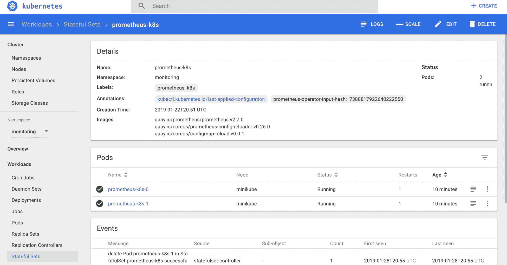

图 6.2 - Kubernetes 仪表盘展示 Prometheus StatefulSet

# 操作系统 exporter

在监控基础设施时，最常见的起点是操作系统层面。有关资源的指标，如 CPU、内存和存储设备，以及内核操作计数器和统计信息，为评估系统性能特征提供了宝贵的见解。为了让 Prometheus 服务器收集这些类型的指标，目标主机上需要有一个操作系统级别的 exporter 来将这些数据暴露在 HTTP 端点上。Prometheus 项目提供了一个支持类 Unix 系统的 exporter，叫做 Node Exporter，社区也维护了一个等效的 exporter，专门用于 Microsoft Windows 系统，称为 WMI exporter。

# Node Exporter

Node Exporter 是最著名的 Prometheus exporter，且有充分的理由。它为操作系统的不同领域提供了超过 40 个收集器，并且可以暴露关于 cron 作业的本地指标和主机的静态信息。与其他 Prometheus 生态系统组件一样，Node Exporter 提供了一个合理的默认配置，并具备智能识别可以收集哪些数据的功能，因此无需过多调整，直接运行是完全合理的。

在此上下文中，*node* 指的是计算机节点或主机，与 Node.js 无关。

尽管该 exporter 被设计为以非特权用户身份运行，但它确实需要访问内核和进程统计信息，这些信息在容器内通常无法获取。这并不意味着它在容器中无法工作——每个 Prometheus 组件都可以在容器中运行——只是需要额外的配置才能使其正常工作。因此，推荐尽可能直接在主机上以系统守护进程的方式运行 Node Exporter。

Node Exporter 的收集器可能会根据运行的系统收集不同的指标，因为操作系统内核在暴露内部状态和提供的细节上有所不同。例如，`node_exporter` 在 macOS 上暴露的指标将与 Linux 上的指标有很大不同。这意味着，尽管 Node Exporter 支持 Linux、Darwin（macOS）、FreeBSD、OpenBSD、NetBSD、DragonFly BSD 和 Solaris，但 Node Exporter 中的每个收集器都会有自己的兼容性矩阵，其中 Linux 是支持最多的内核。

Node Exporter 在 0.16.0 版本中更改了暴露的指标名称，这是因为 Prometheus 项目中的标准化工作。这是一个破坏性变更，意味着为早期版本的出口商制作的仪表板和教程不能直接使用。升级指南（[`github.com/prometheus/node_exporter/blob/v0.17.0/docs/V0_16_UPGRADE_GUIDE.md`](https://github.com/prometheus/node_exporter/blob/v0.17.0/docs/V0_16_UPGRADE_GUIDE.md)）可以在 Node Exporter 的代码库中找到。

Node Exporter 的源代码和安装文件可以在 [`github.com/prometheus/node_exporter`](https://github.com/prometheus/node_exporter) 上找到。

根据设计，这个出口商只会生成关于进程的汇总指标（例如，正在运行的进程数等），而不是每个进程的独立指标。在 Prometheus 模型中，每个相关进程都需要暴露其自己的指标，或者有一个配套的出口商来完成这项工作。这也是在大多数情况下不建议在没有明确白名单的情况下运行通用进程出口商的原因之一。

# 配置

Prometheus 生态系统中的出口商通常会从给定的进程中收集一组特定的指标。Node Exporter 与大多数其他出口商不同，因为机器级别的指标涵盖了广泛的子系统，因此它被设计为提供单独的收集器，可以根据仪表需求启用或禁用。启用默认关闭的收集器可以通过 `--collector.<name>` 一组标志来完成；已启用的收集器可以通过使用 `--no-collector.<name>` 标志变体来禁用。

在默认启用的所有收集器中，有一个需要特别指出，因为它非常有用且需要配置才能正常工作。`textfile` 收集器通过监视一个目录中的 `.prom` 扩展名文件来启用自定义指标的展示，这些文件包含 Prometheus 展示格式的指标。`--collector.textfile.directory` 标志默认是空的，因此需要设置为一个目录路径，以便收集器完成其任务。通过这种方法，预计只会导出特定实例的指标，例如：

+   本地的 cron 作业可以通过一个指标报告它们的退出状态（完成时间戳并不需要记录，因为指标文件的修改时间戳已经作为指标导出）

+   信息性指标（仅存在于它们提供的标签中），如虚拟机类型、大小或分配的角色

+   有多少个软件包升级待处理，是否需要重启

+   任何其他未由内建收集器覆盖的内容

# 部署

本章的静态基础设施测试环境应该已经通过自动化配置使`node_exporter`启动并运行。不过，我们可以通过连接到`target01`虚拟机来检查它，例如如下所示：

```
cd ./chapter06/
vagrant ssh target01
```

然后检查提供的`systemd`单元文件配置，如下所示：

```
vagrant@target01:~$ systemctl cat node-exporter
```

在这个代码片段中，我们可以看到设置了`textfile`收集器目录，以便可以导出自定义指标：

```
...
ExecStart=/usr/bin/node_exporter --collector.textfile.directory=/var/lib/node_exporter
...
```

让我们尝试创建一个自定义指标。为此，我们只需要将指标写入`textfile`收集器目录中的一个`.prom`扩展名的文件，如下所示：

```
vagrant@target01:~$ echo test_metric 1 | sudo tee /var/lib/node_exporter/test.prom
```

在实际场景中，你需要确保文件是原子性地写入的，以防`node_exporter`看到一个半写的（因此损坏的）文件。你可以将文件先写入一个临时文件，然后使用`mv`将其移到正确位置（小心不要跨越挂载点边界），或者使用` sponge`工具，通常在`moreutils`包中可以找到。

然后我们可以请求`/metrics`端点并搜索我们的测试指标，如下所示：

```
vagrant@target01:~$ curl -qs 0:9100/metrics | grep test_metric
```

输出应该类似于以下内容：

```
# HELP test_metric Metric read from /var/lib/node_exporter/test.prom
# TYPE test_metric untyped
test_metric 1
```

这个导出程序会生成大量的指标，具体取决于启用了哪些收集器。`node_exporter`提供的一些更有趣的指标如下：

+   `node_cpu_seconds_total`，它提供每个核心累计使用的秒数，适用于所有可用的 CPU 模式，非常有助于理解 CPU 的利用率

+   `node_memory_MemTotal_bytes`和`node_memory_MemAvailable_bytes`，这可以用来计算可用内存的比率

+   `node_filesystem_size_bytes`和`node_filesystem_avail_bytes`，这可以用来计算文件系统的利用率

+   `node_textfile_scrape_error`，它会告诉你在启用此收集器时，`textfile`收集器是否无法解析`textfile`目录中的任何指标文件

# 容器导出程序

在追求工作负载隔离和资源优化的过程中，我们见证了从物理机到虚拟机的迁移，使用了虚拟化技术。使用虚拟化意味着存在一定程度的资源使用低效，因为无论虚拟机是否使用它们，存储、CPU 和内存都需要分配给每个正在运行的虚拟机。虽然在这个领域已经做了很多工作来缓解这些低效问题，但最终，完全利用系统资源仍然是一个难题。

随着 Linux 操作系统级虚拟化（即使用容器）的兴起，思维方式发生了变化。我们不再需要为每个工作负载提供操作系统的完整副本，而只需要正确隔离的进程来完成所需的工作。为了实现这一点，特别是在 Linux 容器方面，一组负责隔离硬件资源（称为 cgroups 或控制组）和内核资源（称为命名空间）的内核特性被引入。cgroups 管理的资源如下：

+   CPU

+   内存

+   磁盘 I/O

+   网络

这些内核特性允许用户对给定工作负载可用的资源进行精细控制，从而优化资源的使用。Cgroups 指标对于任何现代监控系统都是无价的。

# cAdvisor

**容器顾问** (**cAdvisor**) 是一个由 Google 开发的项目，负责收集、汇总、分析并暴露运行中的容器的数据。可用的数据几乎涵盖了你可能需要的任何内容，从内存限制到 GPU 指标，所有这些都可以按容器和/或主机进行分类展示。

cAdvisor 并不依赖于 Docker 容器，但它通常作为容器进行部署。数据通过容器守护进程和 Linux cgroups 收集，使得容器的发现变得透明且完全自动化。它还会在达到限制时暴露进程限制和节流事件，这是最大化基础设施资源使用而不对工作负载产生负面影响的重要信息。

除了以 Prometheus 格式暴露指标外，cAdvisor 还提供了一个有用的 Web 界面，允许即时可视化主机及其容器的状态。

cAdvisor 的源代码和安装文件可以在 [`github.com/google/cadvisor`](https://github.com/google/cadvisor) 找到。

# 配置

当以容器形式启动 cAdvisor 时，某些主机路径需要以只读模式可用。这将允许，例如，收集内核、进程和容器的数据。

有很多运行时标志，我们将以下表格中列出一些与我们测试案例最相关的标志：

| **标志** | **描述** |
| --- | --- |
| `--docker` | Docker 端点，默认为 `unix:///var/run/docker.sock` |
| `--docker_only` | 仅报告容器信息，外加根统计数据 |
| `--listen_ip` | 要绑定的 IP，默认为 `0.0.0.0` |
| `--port` | 监听端口，默认为 `8080` |
| `--storage_duration` | 数据存储时长，默认为 `2m0s` |

你可以使用以下地址查看可用的运行时配置：[`github.com/google/cadvisor/blob/release-v0.33/docs/runtime_options.md`](https://github.com/google/cadvisor/blob/release-v0.33/docs/runtime_options.md)。

# 部署

尽管历史上 cAdvisor 代码被嵌入在 Kubelet 二进制文件中，但它目前计划在该位置被弃用。因此，我们将以 DaemonSet 的方式启动 cAdvisor，以便为这个示例做好未来兼容性，同时公开其配置，并将其 Web 界面作为 Kubernetes 服务进行探索。

确保你进入正确的仓库路径，如下所示：

```
cd ./chapter06/provision/kubernetes/
```

接下来，我们必须创建一个 DaemonSet，因为我们希望在每个节点上都运行 cAdvisor：

```
apiVersion: apps/v1
kind: DaemonSet
metadata:
  name: cadvisor
  namespace: monitoring
...
```

请注意，所有的卷挂载允许从 Docker 守护进程和各种 Linux 资源收集数据，如下所示：

```
...
    spec:
     containers:
      - name: cadvisor
        volumeMounts:
        - {name: rootfs, mountPath: /rootfs, readOnly: true}
        - {name: var-run, mountPath: /var/run, readOnly: true}
        - {name: sys, mountPath: /sys, readOnly: true}
        - {name: docker, mountPath: /var/lib/docker, readOnly: true}
        - {name: disk, mountPath: /dev/disk, readOnly: true}
...
```

使用以下指令应用之前的清单：

```
kubectl apply -f ./cadvisor/cadvisor-daemonset.yaml
```

我们可以通过以下方式跟踪部署状态：

```
kubectl rollout status daemonset/cadvisor -n monitoring
```

部署完成后，是时候添加一个新的服务了。注意将在 ServiceMonitor 中使用的端口名称。以下是我们将使用的清单：

```
apiVersion: v1
kind: Service
metadata:
  labels:
    p8s-app: cadvisor
  name: cadvisor-service
  namespace: monitoring
spec:
  selector:
    p8s-app: cadvisor
  type: NodePort
  ports:
  - {name: http, protocol: TCP, port: 8080, targetPort: http}
```

可以使用以下命令应用清单：

```
kubectl apply -f ./cadvisor/cadvisor-service.yaml
```

现在我们可以使用以下指令连接到 cAdvisor Web 界面：

```
minikube service cadvisor-service -n monitoring
```

这将打开一个浏览器窗口，界面与下图类似：

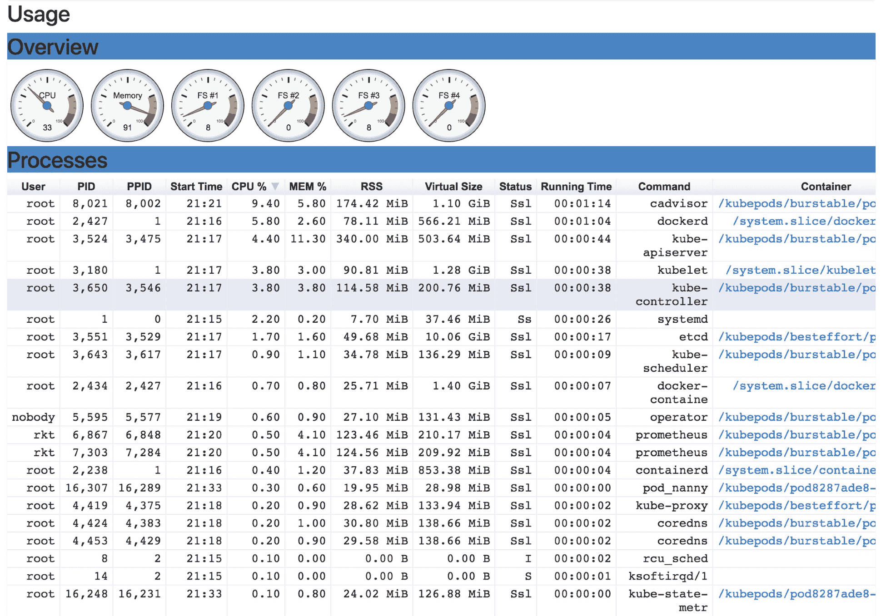

图 6.3：cAdvisor 网络界面

现在是时候将 cAdvisor 导出器添加为 Prometheus 的新目标了。为此，我们将使用下一个 `ServiceMonitor` 清单，如下所示：

```
apiVersion: monitoring.coreos.com/v1
kind: ServiceMonitor
metadata:
  labels:
    p8s-app: cadvisor
  name: cadvisor-metrics
  namespace: monitoring
spec:
  endpoints:
  - interval: 30s
    port: http
  selector:
    matchLabels:
      p8s-app: cadvisor
```

可以使用以下命令应用之前的清单：

```
kubectl apply -f ./cadvisor/cadvisor-servicemonitor.yaml
```

稍等片刻后，你可以通过以下指令打开 Prometheus Web 界面，检查新添加的目标：

```
minikube service prometheus-service -n monitoring
```

下图展示了 Prometheus `/targets` 端点，显示 cAdvisor 目标：

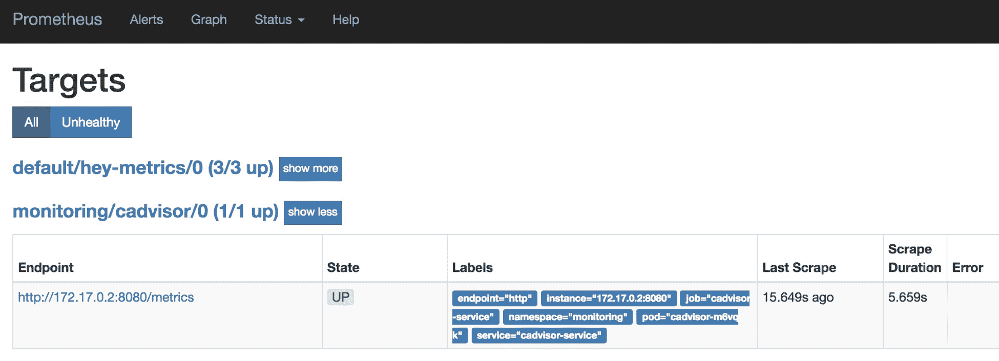

图 6.4：Prometheus */targets* 端点显示 cAdvisor 目标

通过这个，我们现在拥有了容器级别的指标。请注意，cAdvisor 会为每个容器导出大量样本，这可能会导致每次抓取时导出的指标数量达到几千个样本，进而可能引发 Prometheus 在抓取时的基数问题。

你可以在 cAdvisor 的 Prometheus 文档中找到每个导出的指标：[`github.com/google/cadvisor/blob/release-v0.33/docs/storage/prometheus.md`](https://github.com/google/cadvisor/blob/release-v0.33/docs/storage/prometheus.md)。

从 cAdvisor 导出的成千上万的指标中，这些通常是用来监控问题的有用指标：

+   `container_last_seen`，它跟踪容器最后一次被看到作为正在运行的时间戳

+   `container_cpu_usage_seconds_total`，它提供了每个容器每个核心使用的 CPU 秒数的计数器

+   `container_memory_usage_bytes` 和 `container_memory_working_set_bytes`，分别用于跟踪容器内存使用情况（包括缓存和缓冲区）和仅容器的活跃内存

+   `container_network_receive_bytes_total` 和 `container_network_transmit_bytes_total`，它们分别显示容器接收和发送的流量

在 Kubernetes 上运行时，cAdvisor 无法提供有关集群运行状态的洞察力 —— Kubernetes 本身的应用级别指标。因此，我们需要另一个导出器：kube-state-metrics。

# kube-state-metrics

kube-state-metrics 不导出容器级别数据，因为这不是它的功能。它在更高级别运行，公开 Kubernetes 状态，提供有关 API 内部对象（如 pod、service 或 deployment）的指标。当使用此导出器时，当前可用的对象指标组包括以下内容：

+   CronJob 指标

+   DaemonSet 指标

+   部署指标

+   作业指标

+   LimitRange 指标

+   节点指标

+   持久卷指标

+   持久卷声明指标

+   Pod 指标

+   Pod 稳定性预算指标

+   副本集指标

+   复制控制器指标

+   资源配额指标

+   服务指标

+   StatefulSet 指标

+   命名空间指标

+   水平 Pod 自动缩放器指标

+   端点指标

+   Secret 指标

+   ConfigMap 指标

kube-state-metrics 公开两个端点：一个提供 API 对象的指标，另一个展示导出器本身的内部指标。

kube-state-metrics 的源代码和安装文件可在 [`github.com/kubernetes/kube-state-metrics`](https://github.com/kubernetes/kube-state-metrics) 找到。

# 配置

在配置 kube-state-metrics 时，除了所有必需的 RBAC 权限外，还需注意几个运行时标志。我们将在下表中提供我们测试案例中更相关的概述。

| **标志** | **描述** |
| --- | --- |
| `--host` | 绑定和公开 Kubernetes 指标的 IP，默认为 `0.0.0.0` |
| `--port` | 用于公开 Kubernetes 指标的端口，默认为 `80` |
| `--telemetry-host` | 用于公开内部指标的 IP，默认为 `0.0.0.0` |
| `--telemetry-port` | 用于公开内部指标的端口，默认为 `80` |
| `--collectors` | 用于启用的度量指标组的逗号分隔列表，默认为 ConfigMap、CronJobs、DaemonSets、Deployments、endpoints、horizontalpodautoscalers、Jobs、LimitRanges、namespaces、Nodes、PersistentVolumeClaims、PersistentVolumes、PodDisruptionBudgets、pods、ReplicaSets、ReplicationControllers、resource quotas、Secrets、services、StatefulSets |
| `--metric-blacklist` | 禁用的度量指标的逗号分隔列表，与白名单互斥 |
| `--metric-whitelist` | 启用的度量指标的逗号分隔列表，与黑名单互斥 |

由于需要导出的对象数量不可预测，这些对象与集群大小成正比，部署 kube-state-metrics 的常见模式是使用一个名为 **addon-resizer** 的特殊容器，可以动态垂直调整导出器 Pod 的大小。有关 *addon-resizer* 的信息可在 [`github.com/kubernetes/autoscaler/tree/addon-resizer-release-1.8`](https://github.com/kubernetes/autoscaler/tree/addon-resizer-release-1.8) 找到。

# 部署

我们将在之前启动的 Kubernetes 测试环境基础上进行构建。要开始部署，请确保切换到正确的仓库路径，相对于仓库根目录，如下所示：

```
cd ./chapter06/provision/kubernetes/
```

由于需要访问 Kubernetes API，这次部署的**基于角色的访问控制**（**RBAC**）配置相当广泛，包括 Role、RoleBinding、ClusterRole、ClusterRoleBinding 和 ServiceAccount。该清单位于`./kube-state-metrics/kube-state-metrics-rbac.yaml`。

应该使用以下命令来应用：

```
kubectl apply -f ./kube-state-metrics/kube-state-metrics-rbac.yaml
```

我们将为 kube-state-metrics 创建一个仅有一个实例的部署，因为在这种情况下，不需要集群或特殊的部署要求：

```
apiVersion: apps/v1
kind: Deployment
metadata:
  name: kube-state-metrics
  namespace: monitoring 
spec:
  selector:
    matchLabels:
      k8s-app: kube-state-metrics
  replicas: 1
...
```

这个部署将运行一个`kube-state-metrics`导出器实例，并搭配`addon-resizer`动态扩展导出器：

```
...
  template:
    spec:
      serviceAccountName: kube-state-metrics
      containers:
      - name: kube-state-metrics
...
      - name: addon-resizer
...
```

可以使用以下指令应用此操作：

```
kubectl apply -f ./kube-state-metrics/kube-state-metrics-deployment.yaml
```

我们可以使用以下命令来跟踪部署状态：

```
kubectl rollout status deployment/kube-state-metrics -n monitoring
```

部署成功后，我们将为此导出器创建一个服务，这次使用两个端口：一个用于 Kubernetes API 对象的度量，另一个用于导出器的内部度量：

```
apiVersion: v1
kind: Service
metadata:
  name: kube-state-metrics
  namespace: monitoring
  labels:
    k8s-app: kube-state-metrics
  annotations:
    prometheus.io/scrape: 'true'
spec:
  type: NodePort
  ports:
  - {name: http-metrics, port: 8080, targetPort: http-metrics, protocol: TCP}
  - {name: telemetry, port: 8081, targetPort: telemetry, protocol: TCP}
  selector:
    k8s-app: kube-state-metrics
```

上述清单可以按照以下方式应用：

```
kubectl apply -f ./kube-state-metrics/kube-state-metrics-service.yaml
```

有了服务后，我们可以使用以下命令验证两个度量端点：

```
minikube service kube-state-metrics -n monitoring
```

这将打开两个不同的浏览器标签页，每个标签页对应一个度量端点：


图 6.5：kube-state-metrics 的 Web 界面

最后，是时候配置 Prometheus 来抓取这两个端点，使用如下所示的`ServiceMonitor`清单：

```
apiVersion: monitoring.coreos.com/v1
kind: ServiceMonitor
metadata:
  labels:
    k8s-app: kube-state-metrics
  name: kube-state-metrics
  namespace: monitoring
spec:
  endpoints:
  - interval: 30s
    port: http-metrics
  - interval: 30s
    port: telemetry
  selector:
    matchLabels:
      k8s-app: kube-state-metrics
```

现在可以使用以下命令应用它：

```
kubectl apply -f ./kube-state-metrics/kube-state-metrics-servicemonitor.yaml
```

我们现在可以通过以下指令验证 Prometheus 中抓取目标的正确配置，打开其 Web 界面：

```
minikube service prometheus-service -n monitoring
```

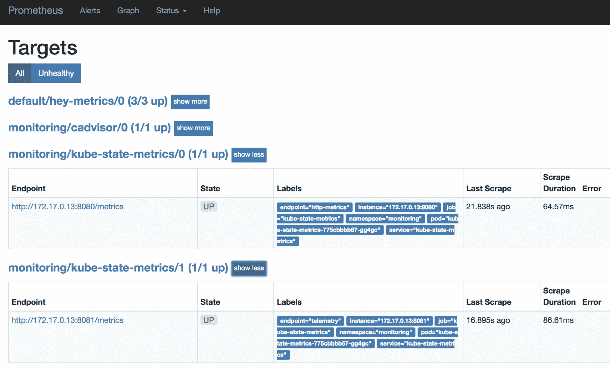

图 6.6：Prometheus /targets 端点，显示 kube-state-metrics 的度量和遥测目标

来自 kube-state-metrics 的一些有趣度量，可以用来监控你的 Kubernetes 集群：

+   `kube_pod_container_status_restarts_total`，可以告诉你某个特定的 Pod 是否处于重启循环中；

+   `kube_pod_status_phase`，可以用来告警那些长时间处于非就绪状态的 Pods；

+   将`kube_<object>_status_observed_generation`与`kube_<object>_metadata_generation`进行比较，可以帮助你了解何时某个对象失败但还没有回滚

# 从日志到度量

在理想的情况下，所有应用程序和服务都应该已经正确地进行了监控，我们只需要收集度量数据以获得可视性。外部导出器是一种权宜之计，简化了我们的工作，但并不是每个服务都通过简洁的 API 暴露其内部状态。较旧的守护进程软件，如 Postfix 或 ntpd，利用日志来传达其内部工作原理。在这些情况下，我们只有两个选择：要么自己为服务添加监控（对于闭源软件来说不可行），要么依赖日志来收集所需的度量数据。接下来的内容将介绍从日志中提取度量数据的可用选项。

# mtail

由 Google 开发的 mtail 是一个非常轻量级的日志处理工具，能够运行具有模式匹配逻辑的程序，从而从日志中提取度量数据。它支持多种导出格式，例如 Prometheus、StatsD、Graphite 等。

除了 `/metrics` 端点，mtail 服务的 `/` 端点还暴露了有价值的调试信息。此端点在静态基础设施测试环境中可通过 `http://192.168.42.11:9197` 访问：

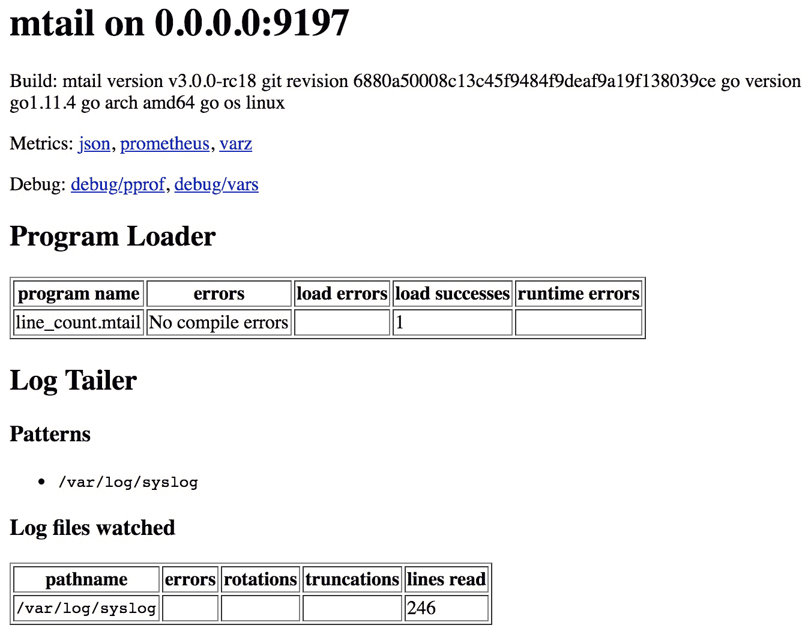

图 6.7：mtail 网页界面

mtail 的源代码和安装文件可以在 [`github.com/google/mtail`](https://github.com/google/mtail) 找到。

# 配置

要配置 mtail，我们需要一个具有模式匹配逻辑的程序。让我们看一个官方仓库中提供的非常简单的示例：

```
# simple line counter
counter line_count
/$/ {
  line_count++
}
```

该程序定义了一个类型为 `counter` 的 `line_count` 度量，使用一个 RE2 兼容的表达式 `/$/` 来匹配行尾，最后，使用 `{ }` 包裹的动作来增加 `line_count` 计数器。

要运行此程序，我们只需要通过命令行标志启动 mtail，指向我们想要监控的程序和日志。以下是我们测试用例中最常用的一些标志：

| `-address` | 要绑定的主机或 IP |
| --- | --- |
| `-port` | 监听端口，默认为 `3903` |
| `-progs` | 程序路径 |
| `-logs` | 以逗号分隔的文件列表，用于监控（此标志可以多次设置） |

您可以在 [`github.com/google/mtail/blob/master/docs/Programming-Guide.md`](https://github.com/google/mtail/blob/master/docs/Programming-Guide.md) 找到 mtail 编程指南，在 [`github.com/google/re2/wiki/Syntax`](https://github.com/google/re2/wiki/Syntax) 找到 RE2 语法。

# 部署

在我们的静态基础设施测试环境中，我们可以通过连接到 `target01` 实例来验证 mtail 的配置，如下所示：

```
cd ./chapter06/

vagrant ssh target01
```

然后检查所提供的 `systemd` 单元文件的配置，如以下命令所示：

```
vagrant@target01:~$ systemctl cat mtail-exporter
```

如本示例所示，`mtail`正在计算`syslog`文件的行数，因此它需要具有适当的权限来访问系统日志，因此我们使用`Group=adm`运行`mtail`守护进程以使其正常工作。我们可以在以下单元文件的代码片段中看到`mtail`服务所需的所有参数，包括行计数程序的路径：

```
...
Group=adm
ExecStart=/usr/bin/mtail -address 0.0.0.0 -port 9197 -progs /etc/mtail_exporter/line_count.mtail -logs /var/log/syslog
...
```

在 Prometheus 实例上，我们添加了以下任务：

```
  - job_name: 'mtail'
    scrape_interval: 15s
    scrape_timeout: 5s
    static_configs:
      - targets: ['target01:9197']
```

在实际场景中，你可以将抓取任务命名为 mtail 正在监控的守护进程的名称，比如 ntpd 或 Postfix。

使用 Prometheus 表达式浏览器，网址为`http://192.168.42.10:9090`，我们不仅可以通过`up`指标验证抓取是否成功，还可以验证我们的指标是否可用：

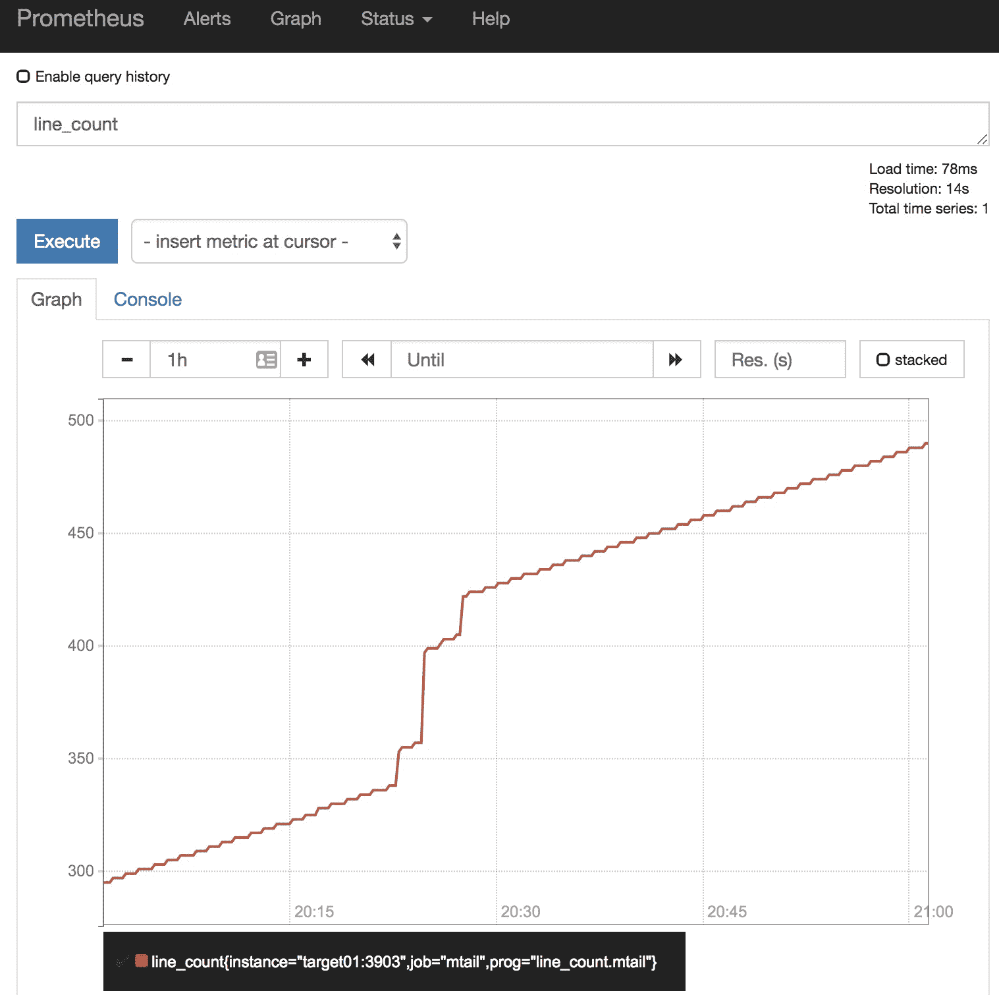

图 6.8：mtail line_count 指标

一些来自 mtail 的有趣指标，可以用来监控这个导出器：

+   `mtail_log_watcher_error_count`，它计算从`fsnotify`（基于内核的文件系统事件通知系统）接收到的错误数量

+   `mtail_vm_line_processing_duration_milliseconds_bucket`，这是一个直方图，用于提供每个 mtail 程序处理行时的持续时间分布（以毫秒为单位）

# Grok 导出器

类似于`mtail`，`grok_exporter`解析非结构化日志数据并从中生成指标。然而，正如其名称所示，主要的区别在于该导出的领域特定语言是基于 Logstash 模式语言（Grok）建模的，这使得你可以重用你可能已经构建的模式。

`grok_exporter`的源代码和安装文件可在[`github.com/fstab/grok_exporter`](https://github.com/fstab/grok_exporter)找到。

# 配置

该导出器需要一个配置文件来进行设置。配置文件中有五个主要部分，我们可以在以下从导出器配置文件中提取的片段中进行详细分析，这些文件部署在我们的静态基础设施测试环境中。`global`部分设置配置格式版本。目前，版本 2 是标准配置版本，因此我们在此设置它：

```
global:
    config_version: 2
```

输入部分定义了要解析的日志位置。如果`readall`设置为`true`，文件将在等待新行之前完全解析；正如我们在示例中看到的那样，我们并没有这么做：

```
input:
    type: file
    path: /var/log/syslog
    readall: false
```

`grok`部分加载用于解析的模式。这些模式在一个单独的位置进行配置，如这里所示：

```
grok:
    patterns_dir: /etc/grok_exporter/patterns
```

`metrics`部分是“魔法”发生的地方。它定义了从解析的日志中提取哪些指标。每种 Prometheus 指标类型在此导出器中都原生支持。每个`type`的配置可能会有所不同，因此你应该查阅其文档。然而，我们将在此提供一个概览，展示它们之间的共同配置：

+   `match`配置定义了数据提取的正则表达式；在我们的示例中，`LOGLEVEL`是一个预定义的模式，用于匹配日志级别。

+   `labels` 配置能够使用 Go 的模板语法输出从匹配定义中提取的内容；在这种情况下，我们在匹配模式中使用了 `level` 作为变量，因此它可以在模板中作为 `.level` 使用：

```
metrics:
    - type: counter
      name: grok_loglevel_example_total
      help: Total log level events triggered.
      match: '.*\(echo %{LOGLEVEL:level}\)$' 
      labels:
          level: '{{.level}}'
```

完整的配置文档可以在 [`github.com/fstab/grok_exporter/blob/v0.2.7/CONFIG.md`](https://github.com/fstab/grok_exporter/blob/v0.2.7/CONFIG.md) 获取

最后，`server` 部分定义了导出程序的绑定地址和端口：

```
server:
    host: 0.0.0.0
    port: 9144
```

现在我们更好地理解了配置文件中的内容，是时候在我们的测试环境中尝试这个导出程序了。

# 部署

在我们的静态基础设施测试环境中，我们可以通过连接到 `target01` 实例来验证 `grok_exporter` 的配置，如下所示：

```
cd ./chapter06/

vagrant ssh target01
```

输出提供的 `systemd` 单元文件的配置如下所示：

```
vagrant@target01:~$ systemctl cat grok-exporter
```

就像 `mtail` 导出程序一样，我们需要以 `Group=adm` 运行 `grok_exporter`，以便它能够访问 `syslog`，而不需要以特权用户身份运行。我们可以在以下单元文件的代码片段中看到 `grok_exporter` 服务的所有必需参数，包括前面提到的配置文件路径：

```
...
Group=adm
ExecStart=/usr/bin/grok_exporter -config /etc/grok_exporter/config.yml
...
```

在 Prometheus 实例中，我们添加了以下作业：

```
  - job_name: 'grok'
    scrape_interval: 15s
    scrape_timeout: 5s
    static_configs:
      - targets: ['target01:9144']
```

使用 Prometheus 表达式浏览器，访问 `http://192.168.42.10:9090`，我们不仅可以验证抓取是否成功，还可以验证我们的指标是否可用：

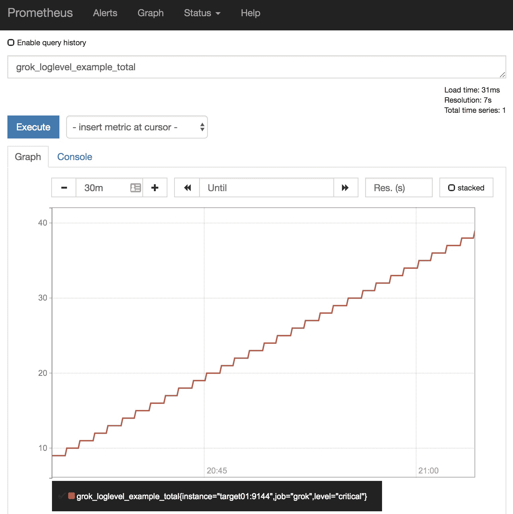

图 6.9：*grok_exporter* 示例指标

从 `grok_exporter` 获取的一些有趣的指标可以用来监控这个导出程序：

+   `grok_exporter_line_buffer_peak_load`，一个汇总，提供从日志文件中读取并等待处理的行数

+   `grok_exporter_line_processing_errors_total`，暴露每个定义的指标的处理错误总数

# 黑盒监控

内省对于收集系统数据非常宝贵，但有时我们需要从该系统用户的角度来进行测量。在这种情况下，探测是一种不错的选择，可以模拟用户交互。由于探测是从外部进行的，并且不了解系统的内部工作原理，因此它被归类为黑盒监控，正如在第一章《监控基础》一节中所讨论的那样，*监控基础知识*。

# 黑盒导出程序

`blackbox_exporter` 是目前 Prometheus 生态系统中最特殊的导出程序之一。它的使用模式非常巧妙，通常，初学者对此感到困惑。我们将深入探讨这个导出程序，希望能让它的使用尽可能简单明了。

`blackbox_exporter` 服务暴露了两个主要端点：

+   `/metrics`：暴露它自己的指标

+   `/probe`：这是启用 blackbox 探测的查询端点，返回 Prometheus 展示格式的结果。

除了之前提到的两个端点外，服务的 `/` 端点还提供了有价值的信息，包括已执行探测的日志。这个端点可以在静态基础设施测试环境 `http://192.168.42.11:9115` 中访问。

blackbox exporter 本身支持通过多种协议对端点进行探测，如 TCP、ICMP、DNS、HTTP（版本 1 和 2），以及大多数探测的 TLS。此外，它还支持通过 TCP 连接并配置要发送的消息及预期响应的脚本化文本协议，如 IRC、IMAP 或 SMTP；甚至普通的 HTTP 也可以进行脚本化，但由于 HTTP 探测是一个常见的用例，它已经内置于此。

尽管如此，这个 exporter 并不涵盖所有黑盒式监控的需求。对于这些情况，可能需要编写自己的 exporter。例如，你不能使用 `blackbox_exporter` 来测试 Kafka 主题的端到端功能，因此你可能需要寻找一个能够生成消息并将其消费回 Kafka 的 exporter：

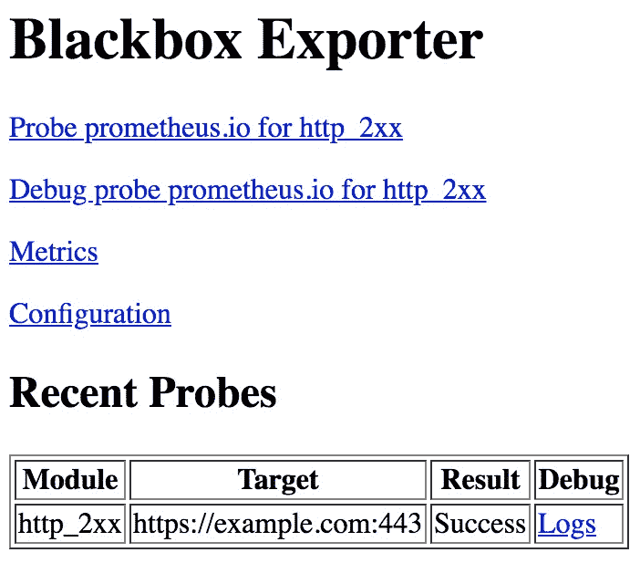

图 6.10：blackbox_exporter 网页界面

`/probe` 端点，在接收到带有 `module` 和 `target` 参数的 HTTP GET 请求时，会执行指定的 `prober` 模块来探测定义的目标，并将结果以 Prometheus 指标的形式展示：

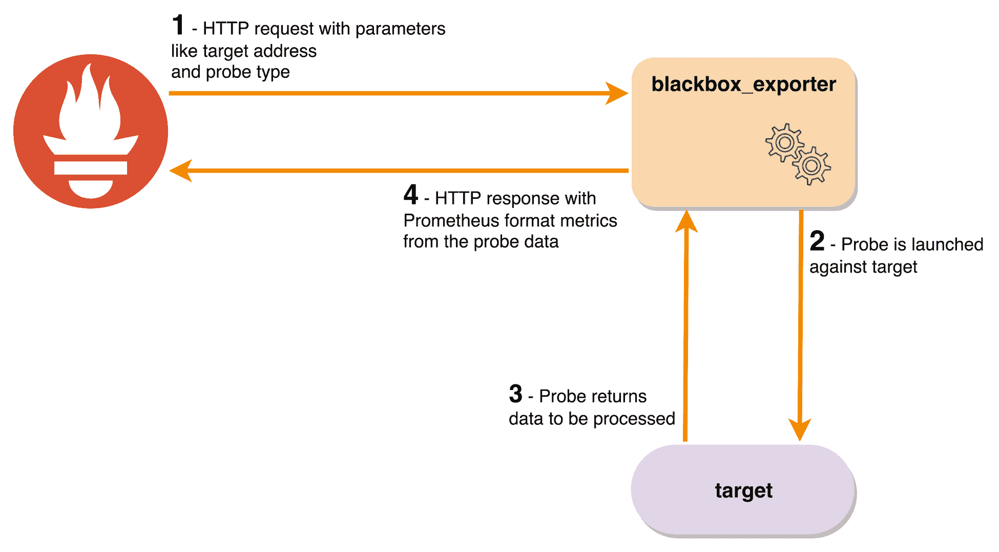

图 6.11：blackbox_exporter 高级工作流程

例如，像 `http://192.168.42.11:9115/probe?module=http_2xx&target=example.com` 这样的请求将返回类似以下的内容（为了简洁，省略了一些指标）：

```
# HELP probe_duration_seconds Returns how long the probe took to complete in seconds
# TYPE probe_duration_seconds gauge
probe_duration_seconds 0.454460181
# HELP probe_http_ssl Indicates if SSL was used for the final redirect
# TYPE probe_http_ssl gauge
probe_http_ssl 0
# HELP probe_http_status_code Response HTTP status code
# TYPE probe_http_status_code gauge
probe_http_status_code 200
# HELP probe_ip_protocol Specifies whether probe ip protocol is IP4 or IP6
# TYPE probe_ip_protocol gauge
probe_ip_protocol 4
# HELP probe_success Displays whether or not the probe was a success
# TYPE probe_success gauge
probe_success 1
```

在调试探测时，你可以在 HTTP GET URL 后附加 `&debug=true` 来启用调试信息。

`blackbox_exporter` 的源代码和安装文件可以在 [`github.com/prometheus/blackbox_exporter`](https://github.com/prometheus/blackbox_exporter) 获取。

使用 `blackbox_exporter` 时需要注意的一个问题是，`up` 指标并不反映探测的状态，而仅仅表示 Prometheus 能够访问到 exporter。如前面指标输出所示，存在一个 `probe_success` 指标，它代表了探测本身的状态。这意味着，`up` 指标显示为正常的情况很常见，但探测可能会失败，这也是常见的困惑来源。

# 配置

blackbox 探测的抓取任务配置比较特殊，因为 `prober` 模块和目标列表（无论是静态的还是动态发现的）都需要作为 HTTP GET 参数传递给 `/probe` 端点。为了使其工作，需要使用一些 `relabel_configs` 魔法，如 第五章《运行 Prometheus 服务器》中所述，*运行 Prometheus 服务器*。

使用以下 Prometheus 配置片段作为示例，我们设置一个针对 Prometheus 实例的 ICMP 探测，同时 `blackbox_exporter` 在 `target01` 上运行：

```
  - job_name: 'blackbox-icmp'
    metrics_path: /probe
    params:
      module: [icmp]
    static_configs:
      - targets:
       - prometheus.prom.inet
    relabel_configs:
      - source_labels: [__address__]
        target_label: __param_target
      - source_labels: [__param_target]
        target_label: instance
      - target_label: __address__
        replacement: target01:9115
```

由于 ICMP 探测的性质，它需要提升的权限才能运行。在我们的环境中，我们通过设置原始套接字的能力（`setcap cap_net_raw+ep /usr/bin/blackbox_exporter`）来确保具备此类权限。

目标是用 `blackbox_exporter` 的地址替换目标地址，确保内部的 `__param_target` 保留目标的地址。重点是如何处理 `relabel_configs`，以下是处理过程：

+   `__address__` 值（包含目标地址）存储在 `__param_target` 中。

+   `__param_target` 值随后被存储到实例标签中。

+   `blackbox_exporter` 主机随后被应用到 `__address__`。

这使得 Prometheus 可以查询 `blackbox_exporter`（使用 `__address__`），保留带有目标定义的实例标签，并将模块和目标参数（通过内部的 `__param_target`）传递到 `/probe` 端点，返回指标数据。

# 部署

在我们的静态基础设施测试环境中，我们可以通过连接到 `target01` 实例来验证 `blackbox_exporter` 的配置，如下所示：

```
cd ./chapter06/

vagrant ssh target01
```

然后通过以下命令检查提供的 `systemd` 单元文件配置：

```
vagrant@target01:~$ systemctl cat blackbox-exporter
```

可以通过向 `/-/reload` 端点发送 HTTP POST 请求或向 `blackbox_exporter` 进程发送 `SIGHUP` 来在运行时重新加载配置。如果配置有错误，将不会应用。

我们可以在下面的单元文件片段中看到 `blackbox_exporter` 服务所需的所有参数，包括配置文件的路径：

```
...
ExecStart=/usr/bin/blackbox_exporter --config.file=/etc/blackbox_exporter/blackbox.yml
...
```

我们为示例量身定制的配置可以在以下片段中找到：

```
modules:
  http_2xx:
    prober: http
    http:
      preferred_ip_protocol: ip4

  icmp:
    prober: icmp
    icmp:
      preferred_ip_protocol: ip4
```

请注意使用了 `preferred_ip_protocol: ip4`，因为 `blackbox_exporter` 偏好使用 `ipv6`，但我们在探测中强制使用 `ipv4`。

在 Prometheus 实例上，我们添加了以下作业：

```
- job_name: 'blackbox-http'
    metrics_path: /probe
    params:
      module: [http_2xx]
    static_configs:
      - targets: [ 'http://example.com', 'https://example.com:443' ]
...
  - job_name: 'blackbox-icmp'
    metrics_path: /probe
    params:
      module: [icmp]
    static_configs:
      - targets:
         - prometheus
...
```

通过 Prometheus 网络界面（位于 `http://192.168.42.10:9090/targets`），我们可以验证抓取是否成功（不管探测返回的状态如何）：

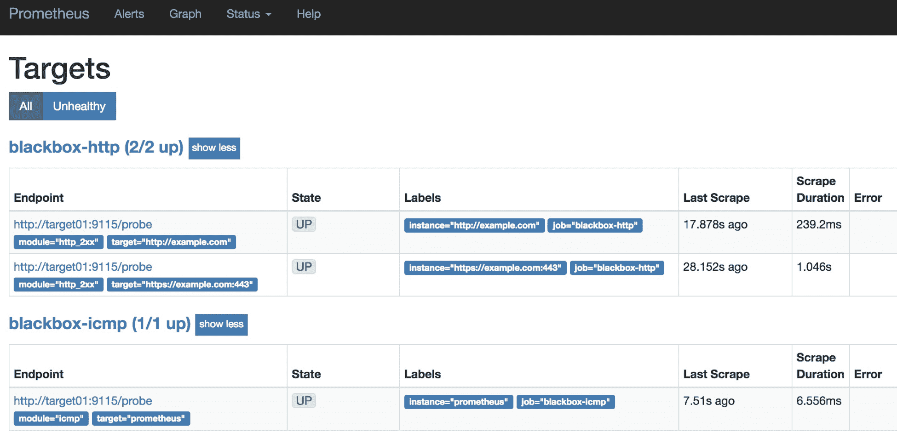

图 6.12：Prometheus `/targets` 端点显示 `blackbox_exporter` 目标

如前所述，`/targets` 页面不会告诉你探测是否成功。这需要通过查询 `probe_success` 指标在表达式浏览器中进行验证：

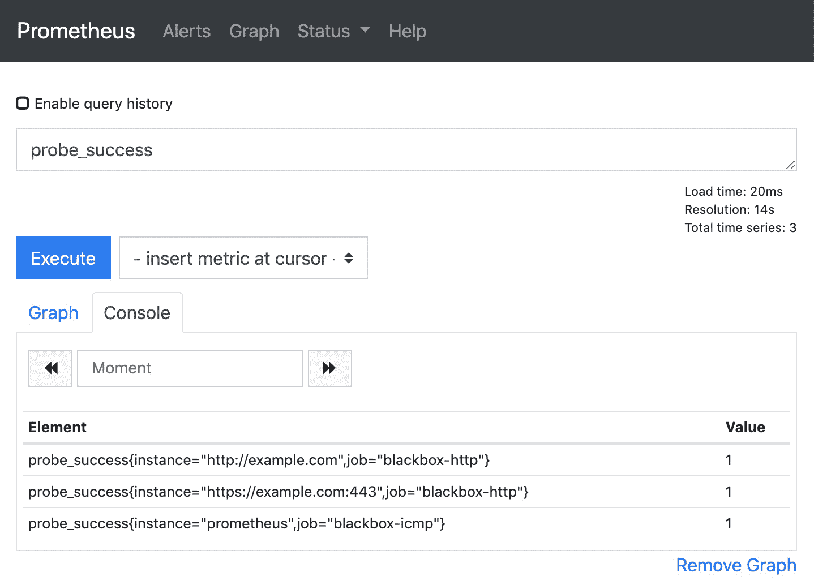

图 6.13：Prometheus 表达式浏览器显示 `probe_success` 查询结果

可以从 `blackbox_exporter`（包括关于导出器本身和探测器的数据）收集的一些有趣的指标是：

+   `blackbox_exporter_config_last_reload_successful`，该指标表示在 `SIGHUP` 后导出器的配置文件是否成功重新加载

+   `probe_http_status_code`，它允许您了解在使用 HTTP `prober`模块时返回了什么 HTTP 状态码。

+   `probe_ssl_earliest_cert_expiry`，它返回 SSL 探测中证书链由于链中的某个证书过期而失效时的时间戳。

# 推送度量

尽管关于推送与拉取的激烈辩论以及在 Prometheus 服务器设计中故意选择使用拉取方式，依然有一些合理的情况，推送方式更为合适。

其中一种情况是批处理作业，不过，为了让这个说法真正有意义，我们需要清楚地定义什么是批处理作业。在这个范围内，服务级批处理作业是一个不依赖于特定实例的处理工作负载，通常不频繁执行或者按计划执行，因此并不是一直运行的。这种作业如果被监控，很难生成成功的抓取结果，正如在第五章《运行 Prometheus 服务器》中所讨论的那样，*即便长时间运行，偶尔抓取也会导致度量的陈旧性*。

也有其他不依赖于推送度量的替代方法；例如，之前所述的通过使用`node_exporter`的 textfile collector。然而，这个选项并非没有缺点。如果工作负载不是特定于某个实例的，您最终将会得到多个时间序列，还需要处理 textfile collector 文件的清理逻辑，除非度量的生命周期与实例的生命周期匹配，这样在实际操作中可以更好地工作。

作为最后的手段，您可以使用 Pushgateway，接下来我们将详细介绍。

# Pushgateway

正如之前所述，此导出器应该仅在非常特定的使用场景中使用，并且我们应当注意一些常见的陷阱。一个可能的问题是缺乏高可用性，使其成为单点故障。这也影响了可扩展性，因为容纳更多度量/客户端的唯一方法是垂直扩展实例（增加更多资源）或分片（为不同的逻辑组拥有不同的 Pushgateway 实例）。通过使用 Pushgateway，Prometheus 不会直接抓取应用实例，这就避免了将`up`度量作为健康监测的代理。此外，类似于`node_exporter`的 textfile collector，度量需要通过 Pushgateway 的 API 手动删除，否则它们将永远暴露给 Prometheus。

要推送一个度量指标，您需要向 Pushgateway 端点发送一个 HTTP POST 请求，使用以下的 URL 路径定义。接下来的部署部分将展示如何操作：

```
http://<pushgateway_address>:<push_port>/metrics/job/<job_name>/[<label_name1>/<label_value1>]/[<label_nameN>/<label_valueN>]
```

在这里，`<job_name>`将成为推送度量的标签 job 的值，`<label_name>/<label_value>`对将成为附加的标签/值对。请记住，度量将一直可用，直到被手动删除，或者在重新启动的情况下，如果没有配置持久化，度量将被丢失。

Pushgateway 的源代码和安装文件可以在[`github.com/prometheus/pushgateway`](https://github.com/prometheus/pushgateway)找到。

# 配置

由于 Pushgateway 是一个集中式的点，实例会将它们的指标推送到这里，当 Prometheus 执行抓取时，每个暴露的指标的标签实例会自动设置为 Pushgateway 服务器的地址/端口，标签作业会设置为 Prometheus 抓取作业定义中所指定的名称。如果标签发生冲突，Prometheus 会将原始标签重命名为`exported_instance`和`exported_job`。为了避免这种情况，应在抓取作业定义中使用`honor_labels: true`，以确保最终使用的标签是来自 Pushgateway 的标签。

我们测试用例中的重要运行时配置如下：

| **标志** | **描述** |
| --- | --- |
| `--web.listen-address` | 绑定地址，默认为`0.0.0.0:9091` |
| `--persistence.file` | 持久化文件位置，如果为空，指标仅保存在内存中 |
| `--persistence.interval` | 写入持久化文件的时间间隔，默认为 5 分钟 |

# 部署

我们将在之前启动的 Kubernetes 测试环境上进行构建。在这个特定的场景中，我们将部署一个 Pushgateway 实例，并将其作为目标添加到 Prometheus 中。为了验证我们的设置是否正确，我们将创建一个 Kubernetes CronJob 来模拟批处理工作负载，并将其指标推送到 Pushgateway 服务，以确保 Prometheus 能够收集我们的数据。

要开始部署，确保切换到正确的仓库路径，相对于代码仓库的根目录：

```
cd ./chapter06/provision/kubernetes/
```

要部署一个 Pushgateway 实例，您可以使用以下清单。请记住，这个服务不支持高可用性或集群配置：

```
apiVersion: apps/v1
kind: Deployment
metadata: {name: pushgateway, namespace: monitoring}
spec:
  selector:
    matchLabels: {p8s-app: pushgateway}
  replicas: 1
  template:
    metadata:
      labels: {p8s-app: pushgateway}
    spec:
      containers:
      - name: pushgateway
...
```

通过执行以下命令应用清单：

```
kubectl apply -f ./pushgateway/pushgateway-deployment.yaml
```

并使用以下命令继续部署：

```
kubectl rollout status deployment/pushgateway -n monitoring
```

部署成功后，接下来需要为我们的新实例提供一个`Service`，使用以下清单：

```
apiVersion: v1
kind: Service
metadata:
  name: pushgateway-service
  namespace: monitoring
  labels:
    p8s-app: pushgateway
spec:
  type: NodePort
  ports:
  - {name: push-port, port: 9091, targetPort: push-port, protocol: TCP}
  selector:
    p8s-app: pushgateway
```

以下指令适用于之前的清单：

```
kubectl apply -f ./pushgateway/pushgateway-service.yaml 
```

现在，您可以使用以下命令验证 Pushgateway 的 Web 界面：

```
minikube service pushgateway-service -n monitoring
```

这将打开一个新的浏览器标签页，指向新创建的 Pushgateway 实例的 Web 界面，界面应如下图所示：

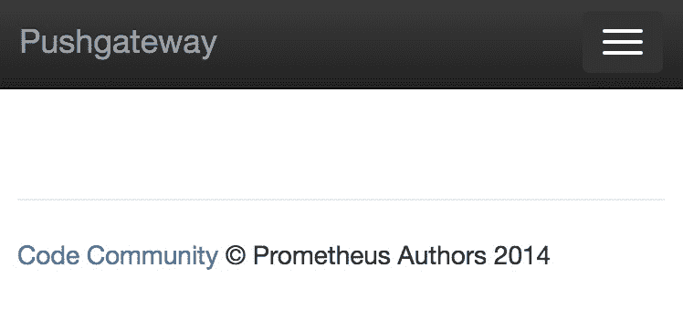

图 6.14：没有任何指标被推送的 Pushgateway Web 界面

现在，我们需要指示 Prometheus 抓取 Pushgateway。这可以通过一个新的`ServiceMonitor`清单来实现，如下所示：

```
apiVersion: monitoring.coreos.com/v1
kind: ServiceMonitor
metadata:
  labels:
    p8s-app: pushgateway
  name: pushgateway
  namespace: monitoring
spec:
  endpoints:
  - interval: 30s
    port: push-port
    honorLabels: true
  selector:
    matchLabels:
      p8s-app: pushgateway
```

要应用此 ServiceMonitor，我们只需输入以下命令：

```
kubectl apply -f ./pushgateway/pushgateway-servicemonitor.yaml
```

现在我们已经建立了监控基础设施，我们需要模拟一个批处理作业来验证我们的设置。

我们可以依赖以下清单，通过手动构造的`curl`负载将一个虚拟的`batchjob_example`指标和多个标签推送到 Pushgateway 服务端点：

```
apiVersion: batch/v1beta1
kind: CronJob
metadata:
  name: batchjob
spec:
  schedule: "*/1 * * * *"
  jobTemplate:
    spec:
      template:
        spec:
          containers:
          - name: batchjob
            image: kintoandar/curl:7.61.1
            args:
            - -c
            - 'echo "batchjob_example $(date +%s)" | curl -s --data-binary @- http://pushgateway-service.monitoring.svc.cluster.local:9091/metrics/job/batchjob/app/example/squad/yellow'
          restartPolicy: OnFailure
```

要应用之前的清单，请使用以下命令：

```
kubectl apply -f ./pushgateway/batchjob-cronjob.yaml
```

一分钟后，Pushgateway 的 Web 界面将类似于这张截图：

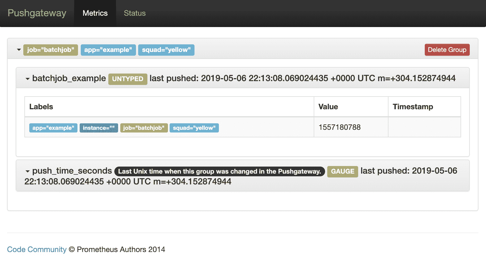

图 6.15：Pushgateway Web 界面展示 batchjob_example 指标

我们现在可以使用 Prometheus 表达式浏览器来验证指标是否已从 Pushgateway 被抓取：

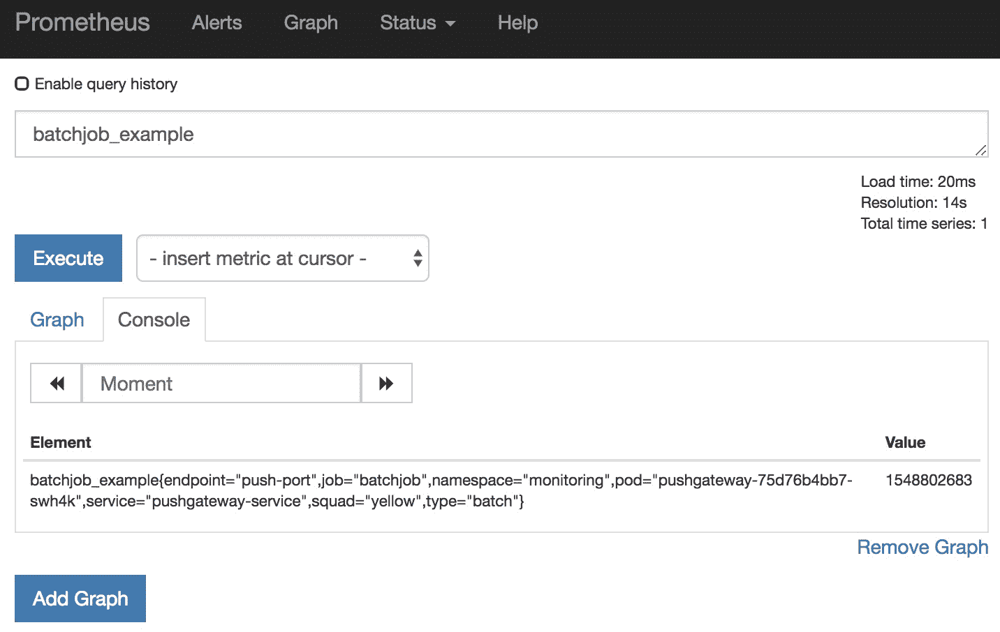

图 6.16：Prometheus 表达式浏览器显示 batchjob_example 指标

由于 Pushgateway 的工作是从其他来源代理指标，它自己提供的指标非常少——只有标准的 Go 运行时指标、进程指标、HTTP 处理器指标和构建信息。然而，有一个应用程序指标需要注意，那就是 `push_time_seconds`。它会告诉你最后一次看到特定组（推送时使用的标签组合）是什么时候。这可以用来检测缺失或延迟的任务。

# 更多导出器

Prometheus 社区已经为几乎所有你可能需要的东西制作了大量的导出器。然而，在你的基础设施中部署一款新的软件需要做出一个有意识的选择，而这背后有着一定的隐性成本。这个成本转化为需要编写的部署自动化代码、打包工作、需要收集的指标、创建的告警、日志配置、安全问题、升级等，以及其他一些我们有时理所当然认为已经解决的问题。在选择开源导出器或任何其他开源项目时，有几个指标需要记住。

我们应该验证项目背后的社区，贡献的整体健康状况，是否有问题得到解决，拉取请求是否及时管理，维护者是否愿意与社区讨论和互动。从技术角度来看，我们还应检查该项目是否使用了官方的 Prometheus 客户端库。话虽如此，我们将介绍一些值得注意的导出器。

# JMX 导出器

**Java 虚拟机**（**JVM**）是核心基础设施服务的热门选择，诸如 Kafka、ZooKeeper 和 Cassandra 等服务都使用它。像许多其他服务一样，它们本身并不提供 Prometheus 展示格式的指标，且对这些应用进行监控远非一项简单的任务。在这种情况下，我们可以依赖 **Java 管理扩展**（**JMX**）通过 **管理 Bean**（**MBeans**）来暴露应用程序的内部状态。JMX 导出器从暴露的 MBeans 中提取数字数据并将其转换为 Prometheus 指标，通过 HTTP 端点进行暴露，供 Prometheus 吸收。

导出器有以下两种形式：

+   **Java 代理**：在这种模式下，导出器被加载到本地 JVM 中，目标应用程序正在运行，并暴露一个新的 HTTP 端点。

+   **独立 HTTP 服务器**：在这种模式下，使用单独的 JVM 实例运行导出器，该实例通过 JMX 连接到目标 JVM，并在其自己的 HTTP 服务器上公开收集到的指标。

文档强烈建议使用 Java 代理部署导出器，理由很充分；与独立导出器相比，代理可以产生更丰富的指标集，因为它能够访问被检测的整个 JVM。然而，两者都有各自的权衡点，了解这些权衡非常重要，以便选择合适的工具来完成任务。

尽管独立服务器无法访问特定于 JVM 的指标，如垃圾回收统计信息或进程内存/CPU 使用情况，但当 Java 应用程序已经启用 JMX 并且是长时间运行的进程时，独立服务器更易于在静态基础设施上部署和管理，而不必频繁干预这些应用程序。此外，导出器的升级周期与应用程序生命周期解耦，尽管新版本发布较为稀少。

另一方面，Java 代理提供 JVM 中所有可用指标的完整范围，但需要在目标应用程序启动时加载。这在定期部署的应用程序或这些应用程序运行在容器中时可能会更为简单。

运行代理的另一个好处是，目标 JVM 还负责提供其自己的指标，因此从抓取任务中得到的`up`指标可以无歧义地表示进程状态。

两种选项都需要一个配置文件，该文件可以对 MBeans 中的指标进行白名单、黑名单和/或重新标记，并将其转换为 Prometheus 格式。一个重要的性能考虑是尽可能使用白名单。某些应用程序会暴露大量的 MBeans（如 Kafka 或 Cassandra），频繁的抓取会对性能产生显著影响。

你可以在[`github.com/prometheus/jmx_exporter/tree/master/example_configs`](https://github.com/prometheus/jmx_exporter/tree/master/example_configs)找到适用于大多数常用应用程序的配置文件示例。

`jmx_exporter`的源代码可以在[`github.com/prometheus/jmx_exporter`](https://github.com/prometheus/jmx_exporter)找到。

# HAProxy 导出器

HAProxy，一款著名的负载均衡解决方案，在撰写本文时并未原生支持 Prometheus 指标。幸运的是，它有一个由 Prometheus 维护者开发的导出器，确保可以收集其指标，该导出器名为`haproxy_exporter`。HAProxy 原生通过可配置的 HTTP 端点以**逗号分隔值**（**CSV**）格式公开其指标，使用的配置是`stats enable`。`haproxy_exporter`作为一个独立的守护进程运行，能够连接到 HAProxy 的统计端点，读取 CSV 内容，并将其转换为 Prometheus 指标格式，在触发抓取时以同步方式公开这些指标。

在负载均衡器层进行监控可以非常有用，特别是当后端池中的应用程序没有正确地进行监控，因此没有暴露访问指标时。例如，可以为 HTTP 错误率或后端可用性创建仪表板和警报，而无需应用程序方面的开发工作。这并不是长期解决方案，但可以帮助从传统监控系统过渡到 Prometheus。

你可以在 [`github.com/prometheus/haproxy_exporter`](https://github.com/prometheus/haproxy_exporter) 找到 `haproxy_exporter` 的源代码和安装文件。

# 总结

在本章中，我们有机会了解一些最常用的 Prometheus 导出工具。通过测试环境，我们能够与运行在虚拟机上的操作系统级导出工具以及在 Kubernetes 上运行的容器特定导出工具进行互动。我们发现，有时需要依赖日志来获取指标，并回顾了当前最佳的实现方式。接着，我们通过 `blackbox_exporter` 探索了黑盒探测，并验证了其独特的工作流程。我们还实验了推送指标，而不是使用 Prometheus 的标准拉取方法，并阐明了为什么有时这种方法确实是有意义的。

所有这些导出工具使你能够在不本地化代码的情况下获取可见性，而这往往比依赖社区驱动的导出工具更加昂贵。

有了这么多的指标源，现在是时候理解如何从它们的数据中提取有用的信息了。在下一章中，我们将深入讲解 PromQL，并讨论如何最好地利用它。

# 问题

1.  如何通过 Node Exporter 收集自定义指标？

1.  cAdvisor 获取哪些资源来生成指标？

1.  kube-state-metrics 暴露了大量的 API 对象。有办法限制这个数量吗？

1.  如何调试 `blackbox_exporter` 探针？

1.  如果一个应用程序不暴露指标（无论是 Prometheus 格式还是其他格式），有哪些监控选项？

1.  使用 Pushgateway 的缺点是什么？

1.  如果某个特定的批处理任务是针对特定主机的，是否有替代 Pushgateway 的方法？

# 进一步阅读

+   **Prometheus 导出工具**: [`prometheus.io/docs/instrumenting/exporters/`](https://prometheus.io/docs/instrumenting/exporters/)

+   **Prometheus 端口分配**: [`github.com/prometheus/prometheus/wiki/Default-port-allocations`](https://github.com/prometheus/prometheus/wiki/Default-port-allocations)

+   **Manpages cgroups**: [`man7.org/linux/man-pages/man7/cgroups.7.html`](http://man7.org/linux/man-pages/man7/cgroups.7.html)

+   **Manpages namespaces**: [`man7.org/linux/man-pages/man7/namespaces.7.html`](http://man7.org/linux/man-pages/man7/namespaces.7.html)

+   **Kubernetes 资源使用监控**: [`kubernetes.io/docs/tasks/debug-application-cluster/resource-usage-monitoring/`](https://kubernetes.io/docs/tasks/debug-application-cluster/resource-usage-monitoring/)
