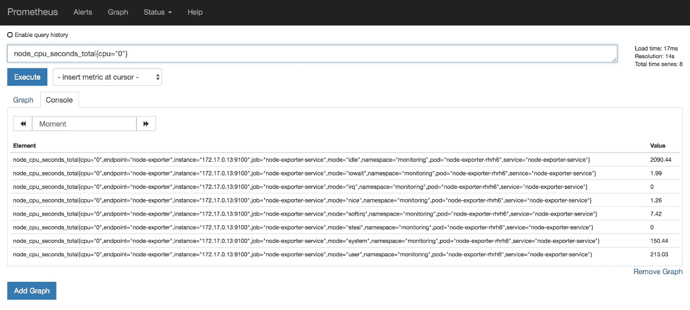

# 第七章：Prometheus 查询语言 - PromQL  

Prometheus 提供了一种强大且灵活的查询语言，利用其多维数据模型进行临时聚合和时间序列数据的组合。在本章中，我们将介绍 PromQL 及其语法和语义。掌握了这门语言的知识和功能后，我们将能够解锁 Prometheus 的真正潜力。  

简而言之，本章将涵盖以下内容：  

+   本章的测试环境  

+   了解 PromQL 的基础知识  

+   常见模式与陷阱  

+   进入更复杂的查询  

# 本章的测试环境  

在本章中，我们将使用基于 Kubernetes 的环境来生成我们需要的所有指标，以测试本章中涵盖的 PromQL 示例。通过使用 Prometheus Operator，设置这个环境相当简单；按照以下步骤操作即可启动并运行：  

1.  为了启动 Kubernetes 测试环境，我们首先必须确保没有正在运行的 `minikube` 实例：  

```
minikube status
minikube delete
```

1.  启动一个新的 `minikube` 实例，具体规格如下：  

```
minikube start \
  --cpus=2 \
  --memory=3072 \
  --kubernetes-version="v1.14.0" \
  --vm-driver=virtualbox
```

当前一个命令执行完成后，一个新的 Kubernetes 环境应该可以开始使用了。  

对于我们的 Kubernetes 测试环境，我们将基于第五章《运行 Prometheus 服务器》中学到的知识，并在我们的工作流中使用 Prometheus Operator。由于我们已经覆盖了 Prometheus Operator 的设置，接下来我们将部署所有必需的组件，而不再逐一讲解它们。  

1.  进入本章对应的代码仓库根路径：  

```
cd ./chapter07/
```

1.  部署 Prometheus Operator 并验证成功部署：  

```
kubectl apply -f ./provision/kubernetes/bootstrap/
kubectl rollout status deployment/prometheus-operator -n monitoring
```

1.  等待几秒钟，直到 Prometheus Operator 能够执行请求并部署 Prometheus 服务器：  

```
kubectl apply -f ./provision/kubernetes/prometheus/
kubectl rollout status statefulset/prometheus-k8s -n monitoring
```

为了让我们有一些指标提供者，我们将部署在第六章《导出器与集成》中介绍的部分导出器，特别是以下这些：  

+   Node Exporter  

+   cAdvisor  

+   kube-state-metrics  

我们还将部署一种*Hello World* 应用，*Hey*，这也是我们在第五章《运行 Prometheus 服务器》中介绍过的，这样 Prometheus 也可以收集 Web 应用的指标。

为了简化所有组件和配置的部署工作，以下命令将抽象出所有必需的步骤，我们在之前的章节中也走过这些步骤：  

```
kubectl apply -f ./provision/kubernetes/services/
kubectl get servicemonitors --all-namespaces
```

几秒钟后，你应该可以看到 Prometheus 和所有服务已经准备好并可用。以下指令将在默认的 web 浏览器中打开 Prometheus 的 web 界面：  

```
minikube service prometheus-service -n monitoring
```

如果你浏览 `/targets` 端点，你将看到类似以下的内容：  

  

图 7.1：Prometheus /targets 端点显示所有已配置的目标  

现在你可以在此新创建的测试环境中跟随本章的示例。

# 了解 PromQL 基础

理解 Prometheus 查询语言对于能够执行深入的仪表盘分析、容量规划和告警非常重要。但要做到这一点，我们需要从了解基础开始。以下主题将介绍构建查询时可用的组件，并探讨它们如何一起运作。

# 选择器

Prometheus 旨在处理数十万条时间序列。每个度量名称可能具有多个不同的时间序列，这取决于标签的组合；当来自不同作业的相似名称的度量混合在一起时，查询正确的数据可能看起来很困难，甚至令人困惑。在 Prometheus 中，选择器指的是一组标签匹配器。度量名称也包含在此定义中，因为从技术上讲，它的内部表示也是一个标签，尽管是一个特殊的标签：`__name__`。选择器中的每一对标签名称/值被称为标签匹配器，可以使用多个匹配器进一步过滤选择器匹配的时间序列。标签匹配器被包含在大括号中。如果不需要匹配器，大括号可以省略。选择器可以返回瞬时或区间向量。以下是一个选择器示例：

```
prometheus_build_info{version="2.9.2"}
```

这个选择器等同于以下内容：

```
{__name__="prometheus_build_info", version="2.9.2"}
```

现在，让我们来看一下标签匹配器是如何工作的。

# 标签匹配器

匹配器用于限制查询搜索到特定的标签值集。我们将使用 `node_cpu_seconds_total` 度量来示范四个可用的标签匹配器操作符：`=`, `!=`, `=~` 和 `!~`。如果没有任何匹配规范，仅使用此度量会返回一个瞬时向量，其中包含所有包含该度量名称的时间序列，以及所有 CPU 核心编号（`cpu="0"`、`cpu="1"`）和 CPU 模式（`mode="idle"`、`mode="iowait"`、`mode="irq"`、`mode="nice"`、`mode="softirq"`、`mode="steal"`、`mode="user"`、`mode="system"`）的组合，总共返回 16 个时间序列，如以下截图所示：


图 7.2：`node_cpu_seconds_total` 查询结果返回 16 个时间序列

现在，让我们使用四个可用的标签匹配器（`=`, `!=`, `=~`, `!~`）来不同地限制查询，并分析产生的结果。

使用 `=`，我们可以对标签值进行精确匹配。例如，如果我们只匹配 CPU 核心 `0`，它将返回一个瞬时向量，其中包含前一个查询中一半的时间序列：



图 7.3：仅查询 CPU 核心 0 上的 `node_cpu_seconds_total`

我们还可以通过使用 `!=` 匹配器来否定匹配，获取所有剩余的时间序列。应用到我们的示例时，它将仅返回剩余的八个时间序列，如下所示：


图 7.4：查询 `node_cpu_seconds*_total*` 的所有时间序列，排除核心 0

在选择时间序列时，除了仅依赖于精确匹配外，能够应用正则表达式也是非常重要的。因此，`=~` 和 `!~` 是 PromQL 用于此操作的匹配符，它们都接受 RE2 类型的正则表达式语法。请记住，在使用这些匹配符时，正则表达式是有锚点的。这意味着它们需要匹配完整的标签值。你可以通过在正则表达式的开始和结束处添加 `.*` 来解除锚点。

RE2 接受的正则表达式语法可以在以下链接找到：[`github.com/google/re2/wiki/Syntax`](https://github.com/google/re2/wiki/Syntax)。

通过查看我们的示例，如果我们只对两个 CPU 模式感兴趣，`mode="user"` 和 `mode="system"`，我们可以轻松地执行如下查询，从而有效地选择我们需要的模式：


图 7.5：仅查询 mode="user" 和 mode="system" 的 node_cpu_seconds_total

考虑到 RE2 不支持负向前瞻，且类似于否定匹配符，Prometheus 提供了一种方式来否定正则表达式匹配符，方法是使用 `!~`。该匹配符排除与表达式匹配的结果，并允许所有其余的时间序列。以下是一个示例：


图 7.6：查询所有时间序列，除了 mode="user" 和 mode="system"

现在我们已经对标签匹配器的工作原理有了很好的理解，让我们来看看即时向量。

# 即时向量

即时向量选择器之所以这样命名，是因为它们返回与查询评估时间相关的、匹配时间序列的样本列表。这个列表被称为**即时向量**，因为它是某一时刻的结果。样本是时间序列中的数据点，由一个值和一个时间戳组成。这个时间戳在大多数情况下反映了抓取发生的时间以及该值被摄取的时间，除非是推送到 Pushgateway 的度量，因为它们的性质决定了它们永远没有时间戳。然而，如果对时间序列应用了函数或执行了操作，则即时向量样本的时间戳将反映查询时间，而不是摄取时间。

即时向量的工作方式——只返回与查询时间相关的、与选择器匹配的最新样本——意味着 Prometheus 不会返回被视为过时的时间序列（正如我们在第五章中提到的，*运行 Prometheus 服务器*）。当源目标从发现机制中消失，或在上次成功的抓取后未出现在抓取数据中时，会插入一个过时标记（一个特殊的样本，用来标记该时间序列为过时）。当时间序列的最后一个样本是过时标记时，使用即时向量选择器时该时间序列将不会被返回。

在 *标签匹配器* 部分中的每个示例都是瞬时向量选择器，因此每个结果都是瞬时向量。

# 范围向量

范围向量选择器类似于瞬时向量选择器，但它返回一组样本，适用于每个匹配的时间序列，并且在给定的时间范围内。请记住，给定值的时间戳可能不会完全与不同目标的抓取时间对齐，因为 Prometheus 会将抓取分散到其定义的时间间隔内，从而减少同一时刻的重叠抓取。

要定义范围向量选择器查询，必须设置一个瞬时向量选择器，并使用方括号 `[ ]` 添加一个范围。

下表详细说明了用于定义时间范围的可用时间单位：

| **缩写** | **单位** |
| --- | --- |
| `s` | 秒 |
| `m` | 分钟 |
| `h` | 小时 |
| `d` | 天 |
| `w` | 周 |
| `y` | 年 |

如在第五章*《运行 Prometheus 服务器》*中所述，时间范围总是一个带有单一单位的整数值。例如，1.5d 和 1d12h 被视为错误，应表示为 36h。持续时间忽略闰秒和闰日：一周始终恰好是 7 天，一年始终是 365 天。

让我们来实际操作一下。以 *Hey* 应用程序为例，我们将检查过去两分钟内收集的 HTTP 状态码 `200` 的样本：

```
http_requests_total{code="200"}[2m]
```

以下是前面代码的输出：


图 7.7：HTTP 状态码 200 的 http_requests_total 指标过去两分钟的样本

正如我们在前面的截图中看到的，返回的每个 *Hey* 应用程序实例的样本（由 30 秒抓取间隔定义）有四个可用样本，来自我们的范围向量选择器。

# 偏移修饰符

`offset` 修饰符允许你查询过去的数据。这意味着我们可以相对于当前时间对瞬时或范围向量选择器的查询时间进行偏移。它是按选择器逐一应用的，这意味着只偏移一个选择器而不偏移另一个选择器，实际上解锁了将当前行为与过去行为进行比较的能力，适用于每个匹配的时间序列。使用此修饰符时，我们需要将其紧跟在选择器后面，并添加偏移时间；例如：


图 7.8：HTTP 状态码 200 的 http_requests_total 指标过去一小时内的两分钟样本

尽管与 PromQL 没有直接关系，但了解 Prometheus 表达式浏览器的时刻功能仍然很重要。此功能改变了查询时刻，就像我们回到了特定的日期和时间。时刻选择器与使用偏移量的主要区别在于，前者是绝对时间，而后者是相对时间偏移。

# 子查询

在 Prometheus 2.7.0 引入子查询选择器之前，并没有直接的方法将返回瞬时向量的函数的输出传递给范围向量函数。为了做到这一点，你需要将产生所需瞬时向量的表达式记录为一个新的时间序列，这也叫做记录规则——我们将在第九章中深入讨论，*定义告警和记录规则*——等待它有足够的数据，然后使用适当的范围向量选择器将记录的序列传递给范围向量函数。子查询选择器通过允许对返回瞬时向量的函数进行时间上的评估，并将结果作为范围向量返回，从而简化了这个过程，而无需等待记录规则捕获足够的数据。子查询语法与范围向量类似，唯一的区别是可以指定采样频率，正如我们很快将看到的那样。

我们将使用以下查询示例来解释其语法：

```
max_over_time(rate(http_requests_total{handler="/health", instance="172.17.0.9:8000"}[5m])[1h:1m])
```

将查询拆解成其组件后，我们可以看到以下内容：

| **组件** | **描述** |
| --- | --- |
| `rate(http_requests_total{handler="/health", instance="172.17.0.9:8000"}[5m])` | 要执行的内部查询，在这种情况下，它将五分钟的数据聚合成一个瞬时向量。 |
| `[1h` | 就像一个范围向量选择器一样，这定义了相对于查询评估时间的范围大小。 |
| `:1m]` | 要使用的分辨率步长。如果没有定义，则默认为全局评估间隔。 |
| `max_over_time` | 子查询返回一个范围向量，这现在可以作为此聚合操作在时间上的参数。 |

这是一个常见的用例，因为尽可能公开计数器是一个好的实践（显然，像当前内存占用这类天生是仪表的内容除外），然后对其进行速率计算，以增强对抓取失败的抵抗力，但大多数有趣的函数会采用范围内的仪表值。

子查询的评估开销相对较高，因此强烈不建议在仪表板中使用它们，因为记录规则在足够的时间后会产生相同的结果。同样，出于同样的原因，它们也不应在记录规则中使用。子查询最适合用于探索性查询，其中无法提前知道需要查看哪些聚合。

# 运算符

PromQL 允许使用二元操作符、向量匹配和聚合操作符。在接下来的章节中，我们将逐一介绍每个操作符，并提供如何以及何时使用它们的示例。

# 二元操作符

除了瞬时向量和范围向量，Prometheus 还支持标量类型的值，它们是没有任何维度的单一数字。

在接下来的子章节中，我们将探讨每个二元操作符：算术操作符和比较操作符。

# 算术

算术操作符提供两个操作数之间的基本数学运算。

有三种可用的操作数组合。最简单的组合是两个标量之间的运算，这将返回一个标量结果。我们还可以将一个即时向量与标量相结合，这将在标量和即时向量的每个样本之间应用选定的算术运算符，最终返回更新样本的相同即时向量。最后一种组合是两个即时向量之间的运算。在这种情况下，算术运算符将应用于左侧向量和右侧向量中匹配的元素，而度量名称会被省略。如果没有匹配项，这些样本将不会出现在结果中。这个案例将在*向量匹配*部分进一步解释。

作为参考，以下是可用的算术运算符：

| **操作符** | **描述** |
| --- | --- |
| `+` | 加法 |
| `-` | 减法 |
| `*` | 乘法 |
| `/` | 除法 |
| `%` | 取模 |
| `^` | 幂运算 |

# 比较

以下表格显示了比较运算符，这些运算符对于过滤结果非常有用：

| **操作符** | **描述** |
| --- | --- |
| `==` | 等于 |
| `!=` | 不等于 |
| `>` | 大于 |
| `<` | 小于 |
| `>=` | 大于或等于 |
| `<=` | 小于或等于 |

比如，我们有以下即时向量：

```
process_open_fds{instance="172.17.0.10:8000", job="hey-service"} 8
process_open_fds{instance="172.17.0.11:8000", job="hey-service"} 23
```

我们可以应用如下的比较运算符：

```
process_open_fds{job="hey-service"} > 10
```

结果将如下所示：

```
process_open_fds{instance="172.17.0.11:8000", job="hey-service"} 23
```

该操作表明我们已经有效地过滤了即时向量的结果，这对于警报非常重要，正如我们稍后将在第九章 *定义警报和记录规则*部分中讨论的那样。

此外，我们可以使用 `bool` 修饰符，不仅返回所有匹配的时间序列，还可以将每个返回的样本修改为 1 或 0，具体取决于该样本是否会被比较运算符保留或丢弃。

使用 `bool` 修饰符是比较标量的唯一方法；例如，`42 == bool 42`。

因此，我们可以将带有 `bool` 修饰符的相同查询应用于我们之前的示例：

```
process_open_fds{job="hey-service"} > bool 10
```

这将返回以下内容：

```
process_open_fds{instance="172.17.0.10:8000", job="hey-service"} 0
process_open_fds{instance="172.17.0.11:8000", job="hey-service"} 1
```

# 向量匹配

向量匹配，顾名思义，是一种仅在向量之间可用的操作。到目前为止，我们已经了解了当我们有一个标量和一个即时向量时，标量会应用于即时向量的每个样本。然而，当我们有两个即时向量时，如何匹配它们的样本呢？我们将在接下来的子部分中探讨这个问题。

# 一一对应

由于二元运算符需要两个操作数，正如我们之前所描述的，当同样大小和标签集的向量位于一个运算符的两侧时，也就是一一对应的情况下，具有完全相同标签/值对的样本会被匹配在一起，而度量名称以及所有不匹配的元素将被丢弃。

让我们考虑一个示例。我们将从使用以下即时向量开始：

```
node_filesystem_avail_bytes{instance="172.17.0.13:9100", job="node-exporter-service", mountpoint="/Users"} 100397019136
node_filesystem_avail_bytes{instance="172.17.0.13:9100", job="node-exporter-service", mountpoint="/data"} 14120038400
node_filesystem_size_bytes{instance="172.17.0.13:9100", job="node-exporter-service", mountpoint="/Users"} 250685575168
node_filesystem_size_bytes{instance="172.17.0.13:9100", job="node-exporter-service", mountpoint="/data"} 17293533184
```

然后我们将应用以下操作：

```
node_filesystem_avail_bytes{} / node_filesystem_size_bytes{} * 100
```

这将返回结果即时向量：

```
{instance="172.17.0.13:9100", job="node-exporter-service", mountpoint="/Users"} 40.0489813060515
{instance="172.17.0.13:9100", job="node-exporter-service", mountpoint="/data"} 81.64923991971679
```

在某些情况下，可能需要聚合标签不匹配的向量。在这些情况下，你可以在二元运算符后应用 `ignoring` 关键字来忽略指定的标签。此外，也可以使用 `on` 关键字来限制用于匹配的左右两侧的标签。

# 多对一和一对多

偶尔，你需要执行一种操作，其中一侧的元素与另一侧的多个元素匹配。当这种情况发生时，你需要为 Prometheus 提供解释这种操作的方法。如果操作的左侧具有更高的基数，你可以在 `on` 或 `ignoring` 后使用 `group_left` 修饰符；如果更高的基数在右侧，那么应使用 `group_right`。`group_left` 操作通常用于其能够将标签从表达式的右侧复制过来的能力，稍后的实践示例中将展示这一点。

# 逻辑运算符

逻辑运算符最容易理解的是它们的集合论对应物，如下表所示。这些运算符是 PromQL 中唯一能实现多对多的运算符。可以在表达式之间使用三种逻辑运算符：

| **运算符** | **描述** |
| --- | --- |
| `and` | 交集 |
| `or` | 并集 |
| `unless` | 补集 |

`and` 逻辑运算符通过仅返回左侧的匹配项来工作，前提是右侧的表达式有与之匹配的标签键/值对。所有左侧没有在右侧匹配的时间序列将被丢弃。结果的时间序列将保留来自左侧操作数的名称。这就是它也被称为**交集**运算符的原因。`and` 运算符通常像 `if` 语句一样使用：通过将右侧的表达式作为条件来返回左侧的表达式。

以以下瞬时向量为例，我们将验证之前的说法：

```
node_filesystem_avail_bytes{instance="172.17.0.13:9100", job="node-exporter-service", mountpoint="/Users"} 1003970
node_filesystem_avail_bytes{instance="172.17.0.13:9100", job="node-exporter-service", mountpoint="/data"} 141200
node_filesystem_size_bytes{instance="172.17.0.13:9100", job="node-exporter-service", mountpoint="/Users"} 2506855
node_filesystem_size_bytes{instance="172.17.0.13:9100", job="node-exporter-service", mountpoint="/data"} 172935
```

我们将应用以下表达式：

```
node_filesystem_size_bytes and node_filesystem_size_bytes < 200000
```

这将返回以下结果：

```
node_filesystem_avail_bytes{instance="172.17.0.13:9100", job="node-exporter-service", mountpoint="/data"} 141200
node_filesystem_size_bytes{instance="172.17.0.13:9100", job="node-exporter-service", mountpoint="/data"} 172935
```

并集逻辑运算符 `or` 通过返回左侧的元素来工作，除非没有匹配项，否则它将返回右侧的元素。再次强调，左右两侧的标签名称/值必须匹配。

我们可以重用之前的数据样本，并应用以下表达式：

```
node_filesystem_avail_bytes > 200000 or node_filesystem_avail_bytes < 2500000
```

结果将如下所示：

```
node_filesystem_avail_bytes{instance="172.17.0.13:9100", job="node-exporter-service", mountpoint="/Users"} 1003970
```

最后，`unless` 逻辑运算符将返回来自第一个表达式中不与第二个表达式的标签名称/值对匹配的元素。在集合理论中，这称为补集。实际使用中，这个运算符的工作方式与 `and` 相反，这意味着它也可以作为 `if not` 语句使用。

再次，我们将使用之前使用的相同样本数据，并应用以下表达式：

```
node_filesystem_avail_bytes unless node_filesystem_avail_bytes < 200000
```

这反过来会给我们提供以下结果：

```
node_filesystem_avail_bytes{instance="172.17.0.13:9100", job="node-exporter-service", mountpoint="/Users"} 1003970
node_filesystem_size_bytes{instance="172.17.0.13:9100", job="node-exporter-service", mountpoint="/Users"} 2506855
```

# 聚合运算符

通过使用聚合运算符，我们可以对即时向量进行聚合，结果是一个新的即时向量，通常包含更少的元素。每次对即时向量的聚合都按我们在第四章*“Prometheus 指标基础”*一节中描述的方式进行。

可用的聚合运算符如下：

| **运算符** | **描述** | **要求** |
| --- | --- | --- |
| `sum` | 求元素的和 |  |
| `min` | 选择最小元素 |  |
| `max` | 选择最大元素 |  |
| `avg` | 计算元素的平均值 |  |
| `stddev` | 计算元素的标准偏差 |  |
| `stdvar` | 计算元素的标准方差 |  |
| `count` | 统计元素的个数 |  |
| `count_values` | 统计具有相同值的元素个数 |  |
| `bottomk` | 按样本选择最小的 `k` 个元素 | 需要元素数量（`k`）作为标量 |
| `topq` | 按样本值选择最上面的 `k` 个元素 | 需要元素数量（`k`）作为标量 |
| `quantile` | 计算元素的分位数 | 需要分位数（0 ≤ φ ≤ 1）定义作为标量 |

需要参数的运算符（如 `count_values`、`bottomk`、`topk` 和 `quantile`）需要在向量表达式之前指定参数。与聚合运算符一起使用时，有两个可用的修饰符可以与标签名列表结合使用：`without` 允许你定义要聚合掉的标签，从而将这些标签从结果向量中去除，而 `by` 则完全相反；即，它允许你指定哪些标签不被聚合。每个聚合运算符只能使用一个修饰符。这些修饰符会影响运算符聚合的维度。

例如，假设我们使用以下查询的一些示例数据：

```
rate(http_requests_total[5m])
```

这将生成类似以下的片段：

```
{code="200",endpoint="hey-port",handler="/",instance="172.17.0.10:8000",job="hey-service",method="get"} 5.891716069444445

{code="200",endpoint="hey-port",handler="/",instance="172.17.0.11:8000",job="hey-service",method="get"} 5.9669884444444445

{code="200",endpoint="hey-port",handler="/",instance="172.17.0.9:8000",job="hey-service",method="get"} 11.1336484826487

{code="200",endpoint="hey-port",handler="/health",instance="172.17.0.10:8000",job="hey-service",method="get"} 0.1

{code="200",endpoint="hey-port",handler="/health",instance="172.17.0.11:8000",job="hey-service",method="get"} 0.1

{code="200",endpoint="hey-port",handler="/health",instance="172.17.0.9:8000",job="hey-service",method="get"} 0.1000003703717421 
```

如果我们想知道所有请求的聚合，可以应用以下表达式：

```
sum(rate(http_requests_total[5m]))
```

这将返回以下内容：

```
{} 23.292353366909335
```

现在，如果我们添加 `by` 运算符，就可以按处理程序端点进行聚合：

```
sum by (handler) (rate(http_requests_total[5m]))
```

这将返回以下内容：

```
{handler="/"} 22.99235299653759
{handler="/health"} 0.3000003703717421
```

这个简单的示例展示了如何轻松地聚合数据。

# 二元运算符优先级

当 PromQL 查询被评估时，二元运算符的应用顺序由运算符的优先级决定。下表展示了优先级顺序，从高到低：

| **优先级** | **运算符** | **描述** |
| --- | --- | --- |
| 1 | `^` | 从右到左求值，例如，1 ^ 2 ^ 3 按照 1 ^ (2 ^ 3) 计算 |
| 2 | `*`, `/`, `%` | 从左到右求值，例如，1 / 2 * 3 按照 (1 / 2) * 3 计算 |
| 3 | `+`, `-` | 从左到右求值 |
| 4 | `==`, `!=`, `<=`, `<`, `>=`, `>` | 从左到右求值 |
| 5 | `and`, `unless` | 从左到右求值 |
| 6 | `or` | 从左到右求值 |

# 函数

PromQL 有近 50 种不同的函数，适用于各种用例，如数学运算、排序、计数器、仪表和直方图操作、标签转换、时间上的聚合、类型转换以及日期和时间函数。在接下来的章节中，我们将介绍一些最常用的函数，并提供它们为何如此相关的示例。

所有函数的全面概述可以在[`prometheus.io/docs/prometheus/latest/querying/functions/`](https://prometheus.io/docs/prometheus/latest/querying/functions/)中查看。

# absent()

`absent()`函数接受一个瞬时向量作为参数，并返回以下内容：

+   如果参数有结果，则返回一个空向量

+   1 元素向量，示例值为 1，在非冲突相等匹配器的情况下包含指定参数中的标签

正如名称所示，这个函数对告警非常有用，特别是缺失时间序列时。

例如，假设瞬时向量存在，我们执行以下表达式：

```
absent(http_requests_total{method="get"})
```

这将返回以下内容：

```
no data
```

假设我们使用带有不存在标签值的标签匹配器的表达式，如下所示：

```
absent(http_requests_total{method="nonexistent_dummy_label"})
```

这将生成一个包含不存在标签值的瞬时向量：

```
{method="nonexistent_dummy_label"} 1
```

让我们将`absent`应用于一个不存在的指标，如下所示：

```
absent(nonexistent_dummy_name)
```

这将转化为以下输出：

```
{} 1
```

最后，假设我们在一个不存在的指标和不存在的标签/值对上使用`absent`，如以下代码片段所示：

```
absent(nonexistent_dummy_name{method="nonexistent_dummy_label"})
```

结果可以在以下代码片段中看到：

```
{method="nonexistent_dummy_label"} 1
```

# label_join() 和 label_replace()

这些函数用于操作标签——它们允许你将标签连接到其他标签、提取标签值的一部分，甚至删除标签（尽管这个操作通过标准聚合操作符更简单、更符合人机工程学）。在这两个函数中，如果定义的目标标签是新的，它将被添加到标签集合中；如果是现有标签，它将被替换。

使用`label_join`时，您需要提供一个瞬时向量，定义一个结果标签，确定结果连接的分隔符，并建立要连接的标签，如以下语法所示：

```
label_join(<vector>, <resulting_label>, <separator>, source_label1, source_labelN)
```

例如，假设我们使用以下示例数据：

```
http_requests_total{code="200",endpoint="hey-port", handler="/",instance="172.17.0.10:8000",job="hey-service",method="get"} 1366
http_requests_total{code="200",endpoint="hey-port", handler="/health",instance="172.17.0.10:8000",job="hey-service",method="get"} 942
```

然后我们应用以下表达式：

```
label_join(http_requests_total{instance="172.17.0.10:8000"}, "url", "", "instance", "handler")
```

最终，我们得到以下瞬时向量：

```
http_requests_total{code="200",endpoint="hey-port", handler="/",instance="172.17.0.10:8000",job="hey-service", method="get",url="172.17.0.10:8000/"} 1366
http_requests_total{code="200",endpoint="hey-port", handler="/health",instance="172.17.0.10:8000",job="hey-service", method="get",url="172.17.0.10:8000/health"} 942
```

当你需要任意操作标签时，`label_replace`是要使用的函数。它的工作方式是对所选源标签的值应用正则表达式，并将匹配的捕获组存储到目标标签中。源标签和目标标签可以是相同的标签，从而有效地替换其值。这听起来复杂，但实际上并不复杂；让我们看看`label_replace`的语法：

```
label_replace(<vector>, <destination_label>, <regex_match_result>, <source_label>, <regex>)
```

假设我们采用前面的示例数据并应用以下表达式：

```
label_replace(http_requests_total{instance="172.17.0.10:8000"}, "port", "$1", "instance", ".*:(.*)")
```

结果将是带有新标签**port**的匹配元素：

```
http_requests_total{code="200",endpoint="hey-port",handler="/", instance="172.17.0.10:8000", job="hey-service",method="get",port="8000"} 1366
http_requests_total{code="200",endpoint="hey-port",handler="/health", instance="172.17.0.10:8000", job="hey-service",method="get",port="8000"} 942
```

使用 `label_replace` 时，如果正则表达式没有匹配到标签值，则原始时间序列将保持不变。

# predict_linear()

该函数接收一个范围向量和一个标量时间值作为参数。它会根据范围向量中的数据趋势，将查询评估时间到未来指定秒数的时间序列值进行外推。它使用线性回归来实现这样的预测，这意味着后台没有复杂的算法预测过程。此函数仅应与仪表（gauge）类型一起使用。

我们将应用以下表达式，使用 `predict_linear`，并利用一小时的数据范围，外推四小时后的样本值（60（秒）* 60（分钟）* 4）：

```
predict_linear(node_filesystem_free_bytes{mountpoint="/data"}[1h], 60 * 60 * 4)
{device="/dev/sda1", endpoint="node-exporter",fstype="ext4",instance="10.0.2.15:9100", job="node-exporter-service",mountpoint="/data", namespace="monitoring", pod="node-exporter-r88r6", service="node-exporter-service"} 15578514805.533087
```

# rate() 和 irate()

这两个函数允许您计算给定计数器的增长率。它们都会自动调整计数器重置，并将范围向量作为参数。

`rate()` 函数通过使用范围内的第一个和最后一个值来提供指定区间内的每秒 *平均变化率*，而 `irate()` 函数则使用范围内的最后两个值进行计算，从而产生瞬时变化率。

了解在什么场景下使用哪一个函数更为合适非常重要。例如，在创建仪表板等可视化时，我们可能希望更好地识别潜在的尖峰；此时，`irate` 符合这个要求。请注意，由于 `irate()` 使用的是范围内的最后两个值，因此它适合步进下采样（step downsampling），只能在完全放大时使用。当构建告警表达式时，我们更关心获取平滑的趋势，以避免偶发的尖峰重置 `for` 计时器（如我们将在 第九章《定义告警和记录规则》中看到的那样）；在这种情况下，`rate` 是更合适的函数。始终确保范围向量中至少有四个样本，以便 `rate()` 可以可靠地工作。

为了展示这两个函数之间的区别，以下截图展示了相同的指标，在相同的时间范围内，一个使用了 `rate()`，另一个使用了 `irate()`：


图 7.9：`node_network_receive_bytes_total` 的 rate()，时间范围为 1 分钟


图 7.10：`node_network_receive_bytes_total` 的 irate()，时间范围为 1 分钟

如我们所见，`irate` 对基础计数器的变化更为敏感，而 `rate` 通常会产生更平滑的值。

# histogram_quantile()

该函数接受一个浮动值，定义所需的分位数（0 ≤ φ ≤ 1），以及一个量表类型的即时向量作为参数。每个时间序列必须具有一个 `le` 标签（表示小于或等于），用来表示桶的上界。该函数还要求所选时间序列之一具有一个名为 `+Inf` 的桶，它作为捕获所有其他值的“最后桶”，即累计直方图的最后一个桶。由于 Prometheus 客户端库生成的直方图对每个桶使用计数器，`rate()` 需要被应用来将它们转换为量表，以便此函数能正常工作。为时间范围选择的时间将对应于分位数计算的窗口。虽然不常见，但一些第三方软件生成的直方图可能没有对其桶使用计数器，因此只要它们满足标签要求，就可以直接在 `histogram_quantile` 中使用。

例如，执行以下表达式：

```
histogram_quantile(0.75, sum(rate(prometheus_http_request_duration_seconds_bucket[5m])) by (handler, le)) > 0
```

我们将会看到类似于以下的结果：

```
{handler="/"} 0.07500000000000001
{handler="/api/v1/label/:name/values"} 0.07500000000000001
{handler="/static/*filepath"} 0.07500000000000001
{handler="/-/healthy"} 0.07500000000000001
{handler="/api/v1/query"} 0.07500000000000001
{handler="/graph"} 0.07500000000000001
{handler="/-/ready"} 0.07500000000000001
{handler="/targets"} 0.7028607713983935
{handler="/metrics"} 0.07500000000000001
```

这提供了一个内部 Prometheus 直方图输出的示例。

# sort() 和 sort_desc()

正如它们的名字所示，`sort` 接收一个向量，并根据样本值按升序对其进行排序，而 `sort_desc` 做的是相同的操作，只不过是降序排序。

`topk` 和 `bottomk` 聚合操作符默认会对其结果进行排序。

# vector()

`vector()` 函数接收一个标量值作为参数，并返回一个没有标签的向量，该向量的值为指定的标量参数。

例如，查询以下表达式：

```
vector(42)
```

它将返回以下内容：

```
{} 42
```

这通常用作确保表达式总是至少有一个结果的一种方式，通过将一个向量表达式与其组合，如以下代码所示：

```
http_requests_total{handler="/"} or vector(0)
```

由于 `or` 操作符返回两边的结果，因此值为 0 的样本将始终存在。

# 聚合操作（按时间）

我们之前讨论的聚合操作总是应用于即时向量。当我们需要在范围向量上执行这些聚合时，PromQL 提供了 `*_over_time` 系列函数，按 第四章《Prometheus 指标基础》中的*水平聚合*部分所述工作。它们都接受一个范围向量并输出一个即时向量。以下是这些操作的描述：

| **操作** | **描述** |
| --- | --- |
| `avg_over_time()` | 范围内所有样本的平均值。 |
| `count_over_time()` | 范围内所有样本的计数。 |
| `max_over_time()` | 范围内所有样本的最大值。 |
| `min_over_time()` | 范围内所有样本的最小值。 |
| `quantile_over_time()` | 计算范围内所有样本的分位数。它需要两个参数，第一个参数是所需分位数 φ 的定义，作为一个标量，其中 0 ≤ φ ≤ 1，第二个参数是一个范围向量。 |
| `stddev_over_time()` | 范围内样本值的标准差。 |
| `stdvar_over_time()` | 范围内样本值的标准方差。 |
| `sum_over_time()` | 在范围内所有样本值的总和。 |

# 时间函数

Prometheus 提供了许多函数来帮助处理时间数据。这些函数在几种场景中非常有用，例如检查一个进程或批处理作业上次出现的时间，只有在特定时间触发警报，或者在某些天完全不触发警报。Prometheus 中的每个时间函数都假定使用协调世界时（UTC）。

`time` 函数返回一个即时向量，表示当前时间的 UNIX 纪元格式（通常称为 UNIX 时间戳）：自 1970 年 1 月 1 日 UTC 起经过的秒数。

`timestamp` 函数返回一个即时向量，其中包含由提供的选择器返回的样本的 UNIX 时间戳。

`minute`、`hour`、`month` 和 `year` 函数的工作方式相同：它们接受一个带有一个或多个时间戳的即时向量，并返回一个即时向量，表示相应的时间组件。这些函数的默认输入是 `time` 函数，因此，如果没有提供参数，它们将分别返回当前的分钟、小时、月份或年份。

`days_in_month` 函数接受一个带有时间戳的即时向量作为参数，并返回每个时间戳所在月份的天数。与之前的函数一样，默认输入参数是 `time` 函数。结果显然会在 28 到 31 之间变化。

最后，类似于之前的函数，`day_of_week` 和 `day_of_month` 函数期望一个带有时间戳的即时向量作为输入，分别返回对应的星期几（星期天为 0，星期一为 1，以此类推）和月份中的天数（从 1 到 31）。默认输入是 `time` 函数。

# 信息与枚举

还有两种度量类型尚未提及，分别是 info 和 enum。它们是相对较新的类型，但它们带来的便利性非常值得赞赏。info 类型的度量名称以 `_info` 结尾，是具有一个可能值 `1` 的常规仪表。这种特殊类型的度量被设计为存储随时间变化的标签的地方，例如版本（例如，导出器版本、语言版本和内核版本）、分配的角色或虚拟机元数据等；如果这些标签每次都导出到时间序列中，当它们变化时，会导致断续性问题，因为度量标识（即度量名称和标签组合）会发生变化。这也会污染所有受影响的时间序列的标签，因为这些新的标签会出现在每个度量中。要使用这种类型的度量，我们需要结合我们希望增强的度量，使用乘法运算符—由于 info 度量值为 `1`，乘法不会改变其他度量的值—而 `group_left`/`group_right` 修饰符允许我们在结果向量中添加所需的标签。

这里是一个使用 info 度量的查询示例：

```
node_uname_info{instance=”10.0.2.15:9100”}
```

我们可以在以下代码片段中看到上一个查询结果：

```
node_uname_info{domainname="(none)",endpoint="node-exporter", instance="10.0.2.15:9100",job="node-exporter-service",machine="x86_64", namespace="monitoring",nodename="minikube",pod="node-exporter-r88r6", release="4.15.0",service="node-exporter-service",sysname="Linux", version="#1 SMP Fri Dec 21 23:51:58 UTC 2018"} 1
```

枚举度量类型也是一种仪表，和 info 类型类似。它的目的是提供一种暴露需要跟踪状态的事物的方法，例如状态机的当前状态。此类度量的最常见用例是暴露守护进程的状态（启动、启动中、停止、停止中、失败等）。这种跟踪是通过在标签上维护状态信息来完成的，标签命名为 state，并将度量值设置为 `1`，表示当前状态，否则为 0。

这里是一个使用枚举度量的即时向量选择器查询示例：

```
node_systemd_unit_state{name="kubelet.service"}
```

上一个查询结果如下所示：

```
node_systemd_unit_state{endpoint="node-exporter",instance="10.0.2.15:9100",job="node-exporter-service",name="kubelet.service", namespace="monitoring",pod="node-exporter-jx2c2", state="activating"} 0
node_systemd_unit_state{endpoint="node-exporter",instance="10.0.2.15:9100",job="node-exporter-service",name="kubelet.service", namespace="monitoring",pod="node-exporter-jx2c2", state="active"} 1
node_systemd_unit_state{endpoint="node-exporter",instance="10.0.2.15:9100",job="node-exporter-service",name="kubelet.service", namespace="monitoring",pod="node-exporter-jx2c2", state="deactivating"} 0
node_systemd_unit_state{endpoint="node-exporter",instance="10.0.2.15:9100",job="node-exporter-service",name="kubelet.service", namespace="monitoring",pod="node-exporter-jx2c2", state="failed"} 0
node_systemd_unit_state{endpoint="node-exporter",instance="10.0.2.15:9100",job="node-exporter-service",name="kubelet.service", namespace="monitoring",pod="node-exporter-jx2c2"", state="inactive"} 0
```

现在我们已经了解了 PromQL 的基础知识，让我们深入探讨在编写表达式时一些常见的模式和可以避免的陷阱。

# 常见的模式和陷阱

由于 PromQL 是一个功能强大的语言，面对如此多的选项，你很容易感到不知所措。在接下来的章节中，我们将提供一些常见的模式和陷阱，确保在每种情况中正确使用 PromQL，通过这种方式进一步巩固我们至今为你提供的知识。

# 模式

尽管 PromQL 的强大功能和灵活性为信息提取提供了无尽的可能性，但有一些查询模式能够使一组常见问题变得更容易理解，并帮助提高对被监控服务的洞察力。在接下来的主题中，我们将介绍一些我们最喜欢的模式，希望它们对你来说和对我们一样有用。

# 服务级指标

在第一章，《监控基础》一章中，我们介绍了*测量什么*的概念，讨论了*Google 的四大黄金信号*，以及 USE 和 RED 方法论。在此基础上，我们可以开始定义**服务水平指标**（**SLI**），这些指标反映了特定服务的性能和可用性。构建查询来生成 SLI 是 PromQL 使用的常见模式，也是最有用的之一。

我们来看一个 SLI 的示例：其典型定义是“良好事件的数量”除以“有效事件的数量”；在这个例子中，我们希望了解 Prometheus 处理的请求是否在 100 毫秒以内，这使得它成为一个延迟 SLI。首先，我们需要收集有关在该阈值下处理的请求数的信息；幸运的是，我们可以依赖一个已存在的直方图类型指标`prometheus_http_request_duration_seconds_bucket`。正如我们已经知道的，这种类型的指标有由`le`标签（小于或等于）表示的桶，所以我们只需匹配 100 毫秒（0.1 秒）以内的元素，如下所示：

```
prometheus_http_request_duration_seconds_bucket{le="0.1"} 
```

虽然比率通常是此类计算的基本单位，但在这个例子中，我们需要一个百分比，因此我们必须将匹配的元素除以总请求数（`prometheus_http_request_duration_seconds_count`），然后将结果乘以 100。这两个即时向量不能直接相除，因为`le`标签不匹配，因此我们必须忽略它，如下所示：

```
prometheus_http_request_duration_seconds_bucket{le="0.1"} / ignoring (le) prometheus_http_request_duration_seconds_count * 100
```

这将给我们一个按端点和实例划分的即时向量，设置样本值为自服务启动以来每个实例中，低于 100 毫秒的请求百分比（记住，`_bucket`是一个计数器）。这算是一个好的开始，但还不是我们想要的，因为我们希望的是整个服务的 SLI，而不是每个实例或每个端点的 SLI。用一个滚动窗口来计算它比对不确定数量的数据求平均值更有用；随着数据的收集，平均值会变得更加平滑，且更难以改变。因此，为了修复这些问题，我们需要在时间窗口内对计数器进行速率计算，以获得一个固定的滚动平均值，然后使用`sum()`聚合掉实例和端点。这样，我们也不需要忽略`le`标签，因为它在聚合过程中也会被丢弃。我们把这些全部放在一起：

```
sum by (job, namespace, service) (
  rate(prometheus_http_request_duration_seconds_bucket{le="0.1"}[5m])
) / 
sum by (job, namespace, service) (
  rate(prometheus_http_request_duration_seconds_count[5m])
) * 100
```

构建一个**服务水平目标**（**SLO**）对我们的服务来说变得简单，因为我们只需要通过比较操作符来指定我们希望达到的百分比。这为定义一个告警条件提供了一个很好的基础。

# 百分位

我们刚刚学习了如何提取在给定延迟下处理的请求百分比，但如果我们需要了解在某个百分位的请求延迟呢？

例如，要获得 95 百分位数，我们可以使用`histogram_quantile`函数，通过定义分位数（在此案例中为`0.95`），然后将表示我们感兴趣数据集的查询表达式传递给它——即请求持续时间直方图中每个桶的平均增长率，且该直方图是在滚动时间窗口内计算的。如果我们想要查看服务的全局延迟，而非每个实例/Pod/处理器的延迟，我们需要应用`sum()`聚合：

```
histogram_quantile(0.95, sum without (instance, pod, handler) (rate(prometheus_http_request_duration_seconds_bucket[5m])))
```

这个表达式会生成一个值，表示 95%的请求会在该值或该值以下。

# 抓取任务的健康状态

对于每个定义的抓取任务，Prometheus 会生成一个名为`up`的自动指标，反映该任务的健康状况——抓取成功时为 1，失败时为 0。我们可以利用这个指标快速可视化整个基础设施中所有被抓取的 exporters 和/或应用程序的健康状态。

让我们来看一下所有成功的抓取任务的概况：

```
sum by (job) (up)
{job="hey-service"} 3
{job="cadvisor-service"} 1
{job="kube-state-metrics"} 2
{job="node-exporter-service"} 1
{job="prometheus-service"} 2
```

# 陷阱

PromQL 的强大功能和灵活性使得我们能够对时间序列数据进行一些令人印象深刻的切割和分析，但也可能是造成挫折、意外结果，甚至严重性能问题的源头。尽管 Prometheus 的最新版本一直在持续引入功能以解决其中一些陷阱，但了解这些问题可以帮助你最大限度地利用 PromQL，同时节省时间和计算资源。

# 为数据类型选择正确的函数

在开始使用 PromQL 时，最常见的陷阱是没有为数据类型（如计数器、仪表或直方图）或向量类型选择正确的函数。尽管 Prometheus 文档中有指出这一点，但由于有些函数和聚合器的命名概念上相似，仍然可能会让人感到困惑：如`rate`和`deriv`，`increase`；`delta`，`quantile`；`histogram_quantile`，`sum`和`sum_over_time`等。幸运的是，在存在向量类型不匹配的情况下，表达式计算会失败，并且会告诉你哪里出了问题；但如果数据类型不匹配，例如将一个计数器传递给期望仪表的函数时，表达式可能会成功计算，但返回的结果却是错误的或具有误导性的。

# 总和速率与速率总和

前一点可能看起来很显而易见，但当构建的查询复杂性开始增加时，很容易犯错。一个常见的例子是尝试对计数器的总和进行速率计算，而不是对速率进行求和。`rate` 函数期望一个计数器，但计数器的总和实际上是一个仪表（gauge），因为当其中一个计数器重置时，仪表值可能会下降；这会在图形上显示出看似随机的尖峰，因为 `rate` 会将任何下降视为计数器重置，而其他计数器的总和则会被视为从零到当前值的巨大变化。在下图中，我们可以看到这种情况：两个计数器（**G1**、**G2**），其中一个计数器（**G2**）发生了重置；**G3** 显示了通过对每个计数器的速率求和得到的期望汇总结果；**G4** 显示了计数器 1 和 2 的总和；**G5** 表示 `rate` 函数如何将 **G4** 视为计数器（突如其来的增加是 0 与下降发生点之间的差异）；最后，**G6** 显示了对计数器总和进行速率计算的结果，错误的尖峰出现在 **G2** 的计数器重置点：


图 7.11：总和的速率和速率的总和的近似图

在 PromQL 中如何正确做这个的一个例子可能是：

```
sum(rate(http_requests_total[5m]))
```

在过去的 Prometheus 版本中，犯这个错误有点困难，因为要给 `rate` 提供一个总和的范围向量，我们需要一个录制规则或手动求和范围向量。不幸的是，从 Prometheus 2.7.0 开始，现在可以请求在一个时间窗口内对计数器求和，从而有效地从该结果创建一个范围向量。这是一个错误，应该避免这样做。因此，总结一下，永远在计算速率后应用聚合操作，而不是反过来。

# 拥有足够的数据进行工作

函数组 `rate`、`irate`、`increase`、`deriv`、`delta` 和 `idelta` 需要在提供的范围向量中至少有两个样本才能正常工作。这意味着，接近 `scrape_interval` 的时间范围可能无法产生预期结果，因为一次抓取失败或窗口对齐问题（抓取并不会按精确的间隔发生，可能会有延迟）会导致范围内只包含一个样本。因此，建议使用 4 倍（或更多）`scrape_interval` 的时间，以确保足够的样本返回以支持计算。以下图显示了由于抓取失败，导致给定范围内样本趋势发生变化：


图 7.12：抓取失败改变给定范围内样本的趋势

# 使用 increase 时出现意外结果

与此相关的一个常见问题是，为什么像`increase`和`delta`这样的函数会产生非整数结果。文档中简要解释了这一点，但值得进一步展开。由于 Prometheus 定期收集数据（由`scrape_interval`配置定义），当查询请求一个样本范围时，该范围的窗口限制通常不会与返回数据的时间戳完全对齐。这些函数通过推测数据点如果与时间窗口匹配时会是什么样子，来处理此问题。它们通过计算提供样本的精确结果，然后将该结果乘以时间窗口与第一个和最后一个数据点之间间隔的比率，从而有效地将结果缩放到请求的范围。

# 未使用足够的匹配器来选择时间序列

编写 PromQL 表达式时的另一个常见陷阱，无论是用于仪表盘还是告警，是没有使用足够的匹配器，确保返回的样本来自预期的时间序列。在 Prometheus 社区中，将度量名称命名为应用程序名称被视为一种反模式，尤其是在该度量并非特定于某个软件时，即便是特定于该软件的，也可能会出现命名冲突的情况；因此，最好实践是使选择器具有范围，以便在尝试提取有关某个特定软件的信息时，`job`始终明确选择。例如，我们可以看看由官方 Prometheus Go 客户端库收集的`go_goroutines`度量：由于 Prometheus 生态系统的大部分内容都是用 Go 编写的，并且使用此客户端库进行监控，因此通常会在许多抓取作业中看到该度量。这意味着，如果我们想调查某个特定软件的聚合 Go 协程行为，若所用的选择器不够精确，可能会得到错误的结果。

# 失去统计意义

一个与 PromQL 并无直接关系的错误，但由于语言的灵活性而容易犯的错误，是对聚合值应用变换，从而失去其统计意义。例如，你可能会想对来自一组实例的汇总中的预先计算的分位数进行平均，以了解集群的情况，但从统计学角度来看，这些数据不能进一步操作——这项操作的结果将无法代表整个集群的相应分位数。然而，对于直方图是可以做到的，因为每个实例的桶可以在计算近似分位数之前进行全集群求和。另一个常见的例子是对平均值进行平均。

# 在构建复杂查询时，知道该期望什么

使用 PromQL 时需要注意的一个有趣细节是，当在向量之间使用比较运算符时，返回的结果将来自比较的左侧部分。这意味着，在进行当前值与阈值的比较时，你应该按此顺序进行（例如，`current_value < threshold`），因为你可能希望返回的是当前值，而不是阈值：

```
node_filesystem_avail_bytes < node_filesystem_size_bytes * 0.2
```

此外，在使用 `and` 连接不同的比较时，结果仍然会是第一个比较的左侧部分。以下示例返回的是文件系统中剩余空间的百分比，且该空间低于 20%，并且根据过去 6 小时的填充速率，预测在 4 小时内将满。请注意，它不是只读模式：

```
node_filesystem_avail_bytes/node_filesystem_size_bytes * 100 < 20
and
predict_linear(node_filesystem_avail_bytes[6h], 4*60*60) <= 0
and
node_filesystem_readonly == 0
```

如果将第一个比较和第二个比较的位置交换，仍然会得到相同数量的结果，但也会展示预测的 4 小时后的可用字节数。这个结果就不那么有用了，因为知道预测的负字节数实际上只传达了它们在现实中会变成 0 的事实。尽管如此，这两个表达式都可以用于告警，因为表达式的结果不会在告警通知中发送。

# 死亡查询

最后，在构建包含过于宽泛选择器和内存密集型聚合的查询时，需要小心。虽然 Prometheus 默认实现了检查和边界，以避免无限制的内存使用（如第五章《运行 Prometheus 服务器》所讨论），但仍然可能会遇到内存限制不足的情况——无论是容器限制，还是实际的系统内存不足，这会导致操作系统无情地终止 Prometheus 服务器。更糟糕的是，确定哪些查询使用了最多的资源是非常困难的，特别是在你对发送到服务器的查询几乎没有控制权的环境中；由于没有内建的慢查询日志功能，启用此功能将涉及一些会影响性能和可管理性的权衡。实际上，尽管如此，不断改进资源利用率限制（特别是在内存方面）使得在良好配置的环境中，这个问题的发生变得更加困难。

# 处理更复杂的查询

利用目前提供的信息，我们可以继续处理更复杂的查询，理解它们的构建方式，以及如何预期它们的结果。在接下来的部分中，我们将讨论一些复杂的场景，这些场景需要使用 PromQL 来探索并巩固我们目前已经学习的概念。

# Node Exporter 运行在哪个节点上？

这个场景旨在帮助你理解诸如 `info` 指标和 `group_left` 修饰符等概念。

# 场景背景

在 Kubernetes 上运行时，你可能需要排查 Node Exporter pod 的问题，为此你需要知道它运行在哪个主机上。Node Exporter 指标查看的是 pod 而不是主机，因此你无法在生成的指标中获取主机名。在这种情况下，我们需要将缺失的信息添加到原本没有该标签的指标中。另一种替代方案是通过重新标签化将所需信息放到实例标签中。

# PromQL 方法

以下查询允许我们通过 `group_left` 将另一个名为 `nodename` 的标签添加到 `node_exporter_build_info` 指标中，该标签包含关于运行 Node Exporter pod 的主机名的信息。

在这个例子中，我们有以下瞬时向量：

```
node_exporter_build_info
```

这将生成以下结果：

```
node_exporter_build_info{branch="HEAD",endpoint="node-exporter",goversion="go1.11.2", instance="10.0.2.15:9100",job="node-exporter-service",namespace="monitoring", pod="node-exporter-r88r6",revision="f6f6194a436b9a63d0439abc585c76b19a206b21", service="node-exporter-service",version="0.17.0"} 1
```

我们还有 `node_uname_info`，它包含 `nodename` 标签：

```
node_uname_info
```

这将转化为以下代码：

```
node_uname_info{domainname="(none)",endpoint="node-exporter", instance="10.0.2.15:9100",job="node-exporter-service",machine="x86_64", namespace="monitoring",nodename="minikube",pod="node-exporter-r88r6", release="4.15.0",service="node-exporter-service",sysname="Linux", version="#1 SMP Fri Dec 21 23:51:58 UTC 2018"} 1
```

借助我们之前描述的 info 类型指标，我们将使用以下表达式，通过 `group_left` 从 `node_uname_info` info 类型指标将 `nodename` 标签添加到 `node_exporter_build_info` 指标中：

```
node_exporter_build_info * on (pod, namespace) group_left (nodename) node_uname_info
```

结果可以通过以下代码片段进行检查：

```

{branch="HEAD",endpoint="node-exporter",goversion="go1.11.2", instance="10.0.2.15:9100",job="node-exporter-service",namespace="monitoring", nodename="minikube",pod="node-exporter-r88r6", revision="f6f6194a436b9a63d0439abc585c76b19a206b21", service="node-exporter-service",version="0.17.0"} 1
```

# 比较不同版本的 CPU 使用情况

这个场景类似于之前的场景，但通过结合来自不同来源的指标，并使它们共同工作，进一步扩展了之前的思路。

# 场景理由

你可能想观察不同软件版本在吞吐量或资源使用上的表现。这可以通过在升级前后以清晰的方式绘制图表来更容易地分析。在这个具体示例中，我们将查看 `node_exporter` 升级前后的容器 CPU 使用情况。

请记住几点考虑事项：为了这个示例，`node_exporter` 作为容器运行，在实际场景中不推荐这样做。此外，我们将使用来自 cAdvisor 的 `container_cpu_usage_seconds_total`，而不是直接从原生检测应用程序收集的 `process_cpu_seconds_total`，这样这种方法就可以应用于任何类型的容器化进程，同时整合 cAdvisor 指标的使用。

# PromQL 方法

`container_cpu_usage_seconds_total` 指标告诉我们每个容器运行时消耗的 CPU 秒数，来自 `cadvisor` 导出器。`node_exporter` 版本可以在 `node_exporter_build_info` 指标中找到。为了增加难度，由于容器指标来自 `cadvisor`，因此这些指标中注册的容器和 pod 是 `cadvisor` 的，而不是目标 pod 的；但是，我们可以在 `container_label_io_kubernetes_container_name` 和 `container_label_io_kubernetes_pod_name` 标签中分别找到原始的容器名称和 pod 名称。

我们需要做的第一件事是获取每个 pod 在一分钟滚动窗口内使用的平均 CPU 秒数：

```
sum by (container_label_io_kubernetes_pod_name) (
rate(container_cpu_usage_seconds_total{container_label_io_kubernetes_container_name="node-exporter"}[1m])
```

接下来，我们需要在`node_exporter_build_info`中创建一个新的标签，以便匹配按预期工作。对于这种用例，我们可以使用`label_join`或`label_replace`，因为我们只是读取一个标签并将其内容逐字写入另一个标签中：

```
label_join(node_exporter_build_info, "container_label_io_kubernetes_pod_name", "", "pod")
```

或者，我们可以使用以下代码：

```
label_replace(node_exporter_build_info, "container_label_io_kubernetes_pod_name", "$1", "pod", "(.+)")
```

最后，我们只需要通过它们的共同标签`container_label_io_kubernetes_pod_name`来匹配这两个指标，使用`on()`，然后请求将版本标签连接到 CPU 表达式的标签集，方法是使用`group_left()`。让我们将这些内容合起来：

```
sum by (container_label_io_kubernetes_pod_name) (
rate(container_cpu_usage_seconds_total{container_label_io_kubernetes_container_name="node-exporter"}[1m])
) 
* on (container_label_io_kubernetes_pod_name) 
 group_left (version)
 label_replace(node_exporter_build_info, "container_label_io_kubernetes_pod_name", "$1", "pod", "(.+)")
```


图 7.13: Node exporter 版本升级对 CPU 使用率的影响

所有这些可能一开始看起来很复杂，但在你自己尝试这些概念之后，它们很快就会变得容易理解、应用并推理。

# 总结

在本章中，我们学习了 PromQL 的基础知识，从选择器到函数，涵盖了二元运算符、向量匹配和聚合等概念。通过常见的模式和陷阱，我们介绍了这个语言如何不仅仅用于简单的查询，它已经成为一项重要的基础设施工具，帮助设计和管理 SLI 和 SLO。我们还展示了 PromQL 发挥作用的几种场景，以及看似复杂的查询其实并没有那么复杂。

在下一章，第八章，*故障排除与验证*，我们将深入探讨如何验证一个健康的 Prometheus 设置，并学习如何快速排除问题，确保监控堆栈的稳定性。

# 问题

1.  PromQL 中有哪些六种可用的比较运算符？

1.  何时应该使用`group_right`修饰符而不是`group_left`修饰符？

1.  为什么在应用`topk`聚合操作符时不应该使用`sort()`函数？

1.  `rate()`和`irate()`之间的主要区别是什么？

1.  哪种类型的指标具有`_info`后缀，它的用途是什么？

1.  你应该先求和再应用`rate`，还是先应用`rate`再求和？

1.  如何获取过去五分钟的平均 CPU 使用率（以百分比表示）？

# 深入阅读

+   **查询 Prometheus**: [`prometheus.io/docs/prometheus/latest/querying/basics/`](https://prometheus.io/docs/prometheus/latest/querying/basics/)

+   **SRE 书籍 - 服务水平目标**: [`landing.google.com/sre/sre-book/chapters/service-level-objectives/`](https://landing.google.com/sre/sre-book/chapters/service-level-objectives/)
