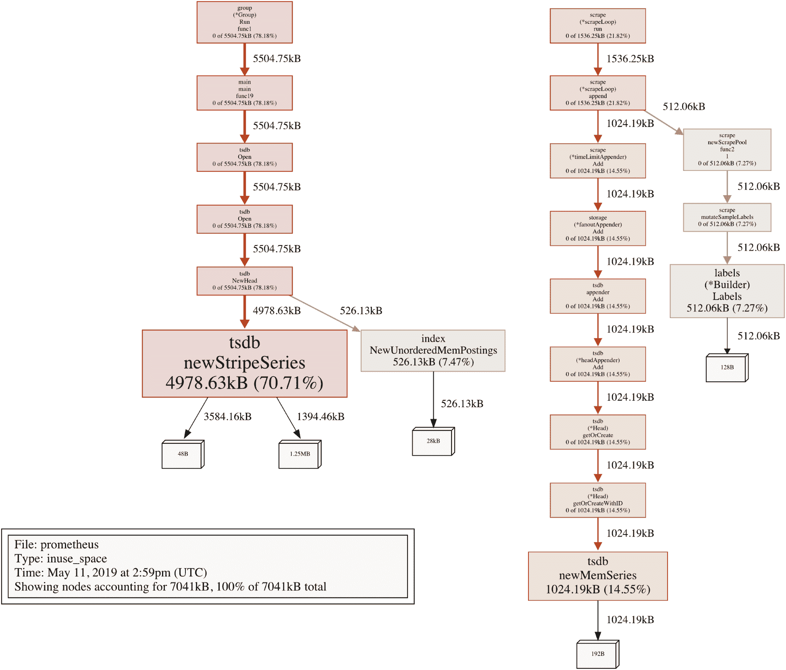
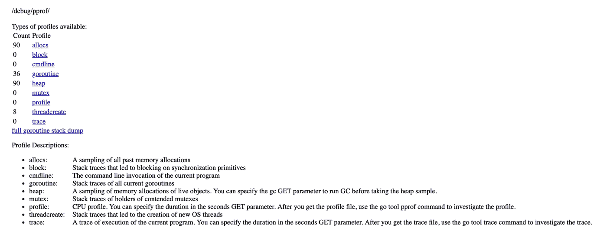

# 故障排除与验证

故障排除本身就是一种艺术，在本章中，我们将提供一些有用的指南，教你如何快速发现和修复问题。你将发现一些有用的端点，它们展示了关键信息，了解 promtool，Prometheus 的命令行界面和验证工具，以及如何将其集成到日常工作流程中。最后，我们将探讨 Prometheus 数据库，并收集关于其使用的深刻信息。

简而言之，本章将涵盖以下主题：

+   本章的测试环境

+   探索 promtool

+   日志和端点验证

+   分析时间序列数据库

# 本章的测试环境

在本章中，我们将重点关注 Prometheus 服务器，并将部署一个新的实例，以便在新的测试环境中应用本章所讲的概念。

# 部署

要创建一个新的 Prometheus 实例，请进入正确的仓库路径：

```
cd chapter08/
```

确保没有其他测试环境在运行，然后启动本章的环境：

```
vagrant global-status
vagrant up
```

你可以使用以下命令验证测试环境是否成功部署：

```
vagrant status
```

这将输出以下内容：

```
Current machine states:

prometheus running (virtualbox)

The VM is running. To stop this VM, you can run `vagrant halt` to shut it down forcefully, or you can run `vagrant suspend` to simply suspend the virtual machine. In either case, to restart it again, simply run `vagrant up`.
```

新实例将可以进行检查，且 Prometheus 的 Web 界面可以通过 `http://192.168.42.10:9090` 访问。

你现在可以通过执行以下命令访问 Prometheus 实例：

```
vagrant ssh prometheus
```

现在你已经连接到 Prometheus 实例，你可以验证本章中描述的指令。

# 清理

测试完成后，只需确保你在 `chapter08/` 目录下，并执行以下命令：

```
vagrant destroy -f
```

不用太担心——如果需要，你可以轻松重新启动环境。

# 探索 promtool

Prometheus 自带一个非常有用的命令行工具，叫做 `promtool`。这个小型的 Golang 二进制文件可以用来快速执行多个故障排除操作，并且内置了许多有用的子命令。

可用的功能可以分为四个类别，我们将在接下来的内容中讨论。

# 检查

属于此类别的子命令允许用户检查和验证 Prometheus 服务器的多个配置方面以及指标标准的合规性。以下部分将展示它们的使用方法。

# 检查配置

`promtool` 提供了几种类型的检查。其中最有价值的一种是检查 Prometheus 服务器的主配置文件。

`check config` 需要提供 Prometheus 主配置文件的路径，并输出对配置有效性的评估。当配置有问题时，该子命令可以告知用户问题所在：如果是非破坏性的问题，比如空的发现文件，它会输出警告并允许 `promtool` 成功退出；当遇到破坏性错误，例如语法错误时，它会输出错误并将检查标记为失败。通过工具返回的退出代码 – `0` 表示成功，`1` 表示失败 – 是确保配置更改在 Prometheus 重启时不会导致崩溃的好方法，应作为预飞行检查使用。除了主配置文件外，该选项还会递归检查任何引用的文件，例如规则文件。

以下示例演示了它的用法：

```
vagrant@prometheus:~$ promtool check config /etc/prometheus/prometheus.yml 
Checking /etc/prometheus/prometheus.yml
 SUCCESS: 1 rule files found

Checking /etc/prometheus/first_rules.yml
 SUCCESS: 1 rules found
```

# 检查规则

`check rules` 分析并定位规则配置文件中的配置错误。它允许直接指定特定的规则文件，从而测试尚未在主 Prometheus 配置中引用的文件。这一功能在规则文件的开发周期中非常有用，也能帮助在使用配置管理时验证文件中的自动更改。我们将在第九章中深入讨论这些概念，*定义告警和记录规则*。

以下是检查规则文件时的预期输出：

```
vagrant@prometheus:~$ promtool check rules /etc/prometheus/first_rules.yml 
Checking /etc/prometheus/first_rules.yml
 SUCCESS: 1 rules found
```

# 检查度量

`check metrics` 子命令验证传递给它的度量指标是否遵循 Prometheus 在一致性和正确性方面的标准。这在开发周期中非常有用，确保新的仪表化代码符合标准，也可用于自动化管理，如果你能控制新作业是否遵循相同规则。它通过 `STDIN` 接收度量数据作为输入，因此你可以直接将文件或 `curl` 输出传输给它。为了说明这个例子，我们暴露了 Prometheus 在版本 `2.8.0` 之前发生的问题：

```
~$ curl -s http://prometheus:9090/metrics | promtool check metrics
prometheus_tsdb_storage_blocks_bytes_total non-counter metrics should not have "_total" suffix
```

如你所见，`prometheus_tsdb_storage_blocks_bytes_total` 度量指标似乎存在问题。让我们查看这个特定的度量指标，排查错误：

```
~$ curl -s http://prometheus:9090/metrics | grep prometheus_tsdb_storage_blocks_bytes_total
# HELP prometheus_tsdb_storage_blocks_bytes_total The number of bytes that are currently used for local storage by all blocks.
# TYPE prometheus_tsdb_storage_blocks_bytes_total gauge
prometheus_tsdb_storage_blocks_bytes_total 0
```

在这些较旧版本的 Prometheus 中，似乎该度量被声明为仪表值，但却带有 `_total` 后缀，而该后缀应该仅用于计数器。

# 查询

属于这一类别的子命令使得可以直接在命令行中执行 PromQL 表达式。这些查询依赖于 Prometheus 公共 HTTP API。以下主题展示了如何使用它们。

# 查询即时数据

`query instant` 子命令允许通过命令行直接查询 Prometheus 服务器，基于当前时间进行查询。要使其工作，必须提供 Prometheus 服务器的 URL 作为参数，以及要执行的查询，如下所示：

```
vagrant@prometheus:~$ promtool query instant 'http://prometheus:9090' 'up == 1'
up{instance="prometheus:9090", job="prometheus"} => 1 @[1550609854.042]
up{instance="prometheus:9100", job="node"} => 1 @[1550609854.042]
```

# 查询时间范围

与前面的子命令类似，`query range` 能够显示指定时间范围内的结果。因此，我们必须提供开始和结束的 Unix 格式时间戳，以及查询和 Prometheus 服务器端点。

例如，我们将使用 `date` 命令来定义开始和结束时间戳，生成五分钟前和现在的 Unix 格式时间戳。我们还可以使用 `--step` 标志来指定查询的分辨率，在我们的示例中是一分钟。最后，我们放置要执行的 PromQL 表达式，最终得到类似以下的指令：

```
vagrant@prometheus:~$ promtool query range --start=$(date -d '5 minutes ago' +'%s') --end=$(date -d 'now' +'%s') --step=1m 'http://prometheus:9090' 'node_network_transmit_bytes_total{device="eth0",instance="prometheus:9100",job="node"}'
node_network_transmit_bytes_total{device="eth0", instance="prometheus:9100", job="node"} =>
139109 @[1551019990]
139251 @[1551020050]
139401 @[1551020110]
139543 @[1551020170]
139693 @[1551020230]
140571 @[1551020290]
```

在我们的测试环境中，可用的 `date` 命令来自 GNU `coreutils`，与 macOS 上基于 BSD 的命令不同。两者的语法可能不直接兼容。

# 查询系列

使用 `query series` 子命令，您可以搜索匹配一组度量名称和标签的所有时间序列。以下是如何使用它：

```
vagrant@prometheus:~$ promtool query series 'http://prometheus:9090' --match='up' --match='go_info{job="prometheus"}'
{__name__="go_info", instance="prometheus:9090", job="prometheus", version="go1.11.5"}
{__name__="up", instance="prometheus:9090", job="prometheus"}
{__name__="up", instance="prometheus:9100", job="node"}
```

# 查询标签

使用 `query labels`，您可以在所有可用的度量标准中搜索特定标签，并返回附加到它的所有可能值；例如：

```
vagrant@prometheus:~$ promtool query labels 'http://prometheus:9090' 'mountpoint'
/
/run
/run/lock
/run/user/1000
/vagrant
/var/lib/lxcfs
```

# 调试

属于此类别的子命令允许从运行中的 Prometheus 服务器中提取调试数据以便分析。接下来我们将演示如何使用它们。

# 调试 pprof

Prometheus 服务器，像大多数用 Go 语言编写的严肃软件一样，使用标准库中名为 `pprof` 的包进行仪表化，该包使用特定格式提供运行时分析信息。生成的这种格式的文件可以由同名的命令行工具 `pprof` 读取，后者用于生成分析数据的报告和可视化。`promtool` 提供 `debug pprof` 子命令，我们可以在以下代码片段中看到它的操作：

```
vagrant@prometheus:~$ promtool debug pprof 'http://prometheus:9090'
collecting: http://prometheus:9090/debug/pprof/profile?seconds=30
collecting: http://prometheus:9090/debug/pprof/block
collecting: http://prometheus:9090/debug/pprof/goroutine
collecting: http://prometheus:9090/debug/pprof/heap
collecting: http://prometheus:9090/debug/pprof/mutex
collecting: http://prometheus:9090/debug/pprof/threadcreate
collecting: http://prometheus:9090/debug/pprof/trace?seconds=30
Compiling debug information complete, all files written in "debug.tar.gz".
```

当我们提取前一个命令生成的存档时，可以看到一些文件：

```
vagrant@prometheus:~$ tar xzvf debug.tar.gz 
cpu.pb
block.pb
goroutine.pb
heap.pb
mutex.pb
threadcreate.pb
trace.pb
```

使用 `pprof`，我们可以生成一个转储的图像，正如我们在下一个片段中可以观察到的：

```
vagrant@prometheus:~$ pprof -svg heap.pb > /vagrant/cache/heap.svg
```

测试环境已准备好使用的 `pprof` 命令行工具。有关如何构建和部署它的更多信息，请访问 [`github.com/google/pprof`](https://github.com/google/pprof)。

在您的主机机器上，在代码库的 `./cache/` 路径（相对于库的根目录）下，您现在应该有一个名为 `heap.svg` 的可扩展矢量图像文件，可以通过浏览器进行检查。以下截图显示了在前面示例生成的文件时可能看到的内容：



Figure 8.1: 由 pprof 生成的热图示例

# 调试度量

此子命令下载由提供的 Prometheus 实例公开的度量数据，并以压缩档案的形式保存。`debug metrics` 通常不常用，因为 `/metrics` Prometheus 端点对任何能够运行此命令的人开放；它的存在是为了在需要时更容易向外部支持人员（例如 Prometheus 维护者）提供 Prometheus 实例的当前状态。此子命令可以如下使用：

```
vagrant@prometheus:~$ promtool debug metrics 'http://prometheus:9090'
collecting: http://prometheus:9090/metrics
Compiling debug information complete, all files written in "debug.tar.gz".

vagrant@prometheus:~$ tar xzvf debug.tar.gz 
metrics.txt

vagrant@prometheus:~$ tail -n 5 metrics.txt 
# HELP promhttp_metric_handler_requests_total Total number of scrapes by HTTP status code.
# TYPE promhttp_metric_handler_requests_total counter
promhttp_metric_handler_requests_total{code="200"} 284
promhttp_metric_handler_requests_total{code="500"} 0
promhttp_metric_handler_requests_total{code="503"} 0
```

# 调试全部

此选项将之前的调试子命令聚合为一个指令，如以下示例所示：

```
vagrant@prometheus:~$ promtool debug all 'http://prometheus:9090'
collecting: http://prometheus:9090/debug/pprof/threadcreate
collecting: http://prometheus:9090/debug/pprof/profile?seconds=30
collecting: http://prometheus:9090/debug/pprof/block
collecting: http://prometheus:9090/debug/pprof/goroutine
collecting: http://prometheus:9090/debug/pprof/heap
collecting: http://prometheus:9090/debug/pprof/mutex
collecting: http://prometheus:9090/debug/pprof/trace?seconds=30
collecting: http://prometheus:9090/metrics
Compiling debug information complete, all files written in "debug.tar.gz".
```

# 测试

`promtool` 最近获得了运行单元测试的能力，测试已定义的记录和告警规则。在你可能需要检查某个表达式是否匹配某些从未发生过的条件的情况下，这个功能非常有用，因此很难确定它们在关键时刻是否能正常工作。这个子命令被称为 `test rules`，并且需要一个或多个测试文件作为参数。稍后我们将在第九章《定义告警和记录规则》中深入探讨如何最好地利用规则。

# 日志和端点验证

在接下来的部分，我们将介绍一些有用的 HTTP 端点和服务日志，这些对于排查 Prometheus 实例的问题至关重要。

# 端点

检查 Prometheus 是否正常运行通常非常简单，因为它遵循大多数云原生应用程序用于服务健康检查的约定：一个端点用于检查服务是否健康，另一个用于检查服务是否准备好处理传入请求。对于那些使用过或曾经使用过 Kubernetes 的人来说，这些概念可能会感觉很熟悉；事实上，Kubernetes 也使用这些约定来评估容器是否需要重启（例如，如果应用程序死锁并停止响应健康检查）以及是否可以开始向容器发送流量。在 Prometheus 中，这些就是 `/-/healthy` 和 `/-/ready` 端点。

你可以通过在测试环境中运行以下命令并检查其输出以及 HTTP 状态码，自己尝试这些端点：

```
vagrant@prometheus:~$ curl -w "%{http_code}\n" http://localhost:9090/-/healthy
Prometheus is Healthy.
200

vagrant@prometheus:~$ curl -w "%{http_code}\n" http://localhost:9090/-/ready
Prometheus is Ready.
200
```

在传统的基础设施中，通常使用就绪端点作为负载均衡器前面一组 Prometheus 实例的后端健康检查，因为只能配置一个健康检查。通过使用就绪端点，流量仅会被路由到准备好接收流量的实例。

此外，Prometheus 还暴露了一个 `/debug/pprof/` 端点，它由 `promtool debug pprof` 命令使用，如前节所示。此端点还暴露了一个可导航的 Web UI，用户可以查看 `pprof` 调试信息，如当前的 goroutine 及其堆栈跟踪、堆分配、内存分配等：



图 8.2：Prometheus 服务器/debug/pprof 端点可用的信息

# 日志

与大多数当前软件相比，Prometheus 的日志非常简洁。这是 Prometheus 维护人员的有意为之，因为过多的日志记录可能会导致性能问题。此外，支持不同的日志流（例如应用日志、访问日志和慢查询日志），而不是将所有日志都写入标准输出——从而使应用日志被其他类型的日志淹没——将迫使 Prometheus 明确支持写入文件，这在云原生环境中是不受欢迎的。话虽如此，你可以通过设置`--log.level`标志来配置 Prometheus 增加应用日志的详细级别。例如，失败的抓取被认为是正常的操作行为，因此不会出现在日志中；但是，通过将日志详细级别增加到`debug`，它们是可以被记录的。

本章测试环境中的 Prometheus 实例已配置为调试级别日志。你可以通过运行以下命令来确认这一点：

```
vagrant@prometheus:~$ sudo systemctl cat prometheus.service
```

相关部分应该设置如下标志：

```
ExecStart=/usr/bin/prometheus \
    --log.level=debug \
    --config.file=/etc/prometheus/prometheus.yml \
    --storage.tsdb.path=/var/lib/prometheus/data \
    --web.console.templates=/usr/share/prometheus/consoles \
    --web.console.libraries=/usr/share/prometheus/console_libraries
```

现在我们可以看到当抓取失败时会发生什么。为了实现这一点，我们可以在测试环境中停止`node_exporter`服务，然后查看 Prometheus 的日志：

```
vagrant@prometheus:~$ sudo service node-exporter stop
vagrant@prometheus:~$ sudo journalctl -fu prometheus | grep debug
Feb 23 15:28:14 prometheus prometheus[1438]: level=debug ts=2019-02-23T15:28:14.44856006Z caller=scrape.go:825 component="scrape manager" scrape_pool=node target=http://prometheus:9100/metrics msg="Scrape failed" err="Get http://prometheus:9100/metrics: dial tcp 192.168.42.10:9100: connect: connection refused"
Feb 23 15:28:29 prometheus prometheus[1438]: level=debug ts=2019-02-23T15:28:29.448826505Z caller=scrape.go:825 component="scrape manager" scrape_pool=node target=http://prometheus:9100/metrics msg="Scrape failed" err="Get http://prometheus:9100/metrics: dial tcp 192.168.42.10:9100: connect: connection refused"
```

# 分析时间序列数据库

Prometheus 服务器的一个关键组件是其时间序列数据库。能够分析该数据库的使用情况对于检测序列更替和基数问题至关重要。在此背景下，更替（Churn）指的是时间序列变得陈旧（例如，源目标停止收集数据或某个序列从一次抓取到下一次抓取之间消失），然后开始收集一个身份略有不同的新序列。一个常见的更替示例与 Kubernetes 应用部署相关，其中 Pod 实例的 IP 地址发生变化，导致之前的时间序列过时，取而代之的是一个新的序列。这会影响查询性能，因为可能会返回一些完全无关的样本。

幸运的是，Prometheus 数据库的源代码中有一个不太为人知的工具，可以分析其数据，这个工具名为`tsdb`。

你可以在[`github.com/prometheus/tsdb/`](https://github.com/prometheus/tsdb/)找到`tsdb`工具的源代码。通过在安装了正确 Go 工具链的系统上运行`go get github.com/prometheus/tsdb/cmd/tsdb`，它可以很容易地构建。

# 使用 tsdb 工具

`tsdb`工具可以针对 Prometheus 的整个数据库或仅针对某个数据块运行，并输出有关该数据健康状况的有用信息。为了运行此工具，我们必须确保 Prometheus 服务器已停止：

```
vagrant@prometheus:~$ sudo systemctl stop prometheus
```

我们将运行 `tsdb` 工具，目标是 Prometheus 数据库路径。为了简洁起见，我们将每个部分的输出限制为三条。如果没有指定块名称作为参数，将使用最后一个可用的块：

```
vagrant@prometheus:~$ sudo tsdb analyze --limit=3 /var/lib/prometheus/data/
```

输出被分为几个部分。在标题中，我们可以找到关于该块的摘要，包含以下内容：

+   其完整路径位置

+   块持续时间跨度，标准的 Prometheus 部署默认为两小时

+   块中包含的系列和标签名称的数量

+   有关索引条目数量的统计信息

在这里，我们可以看到前述指令生成的输出：

```
Block path: /var/lib/prometheus/data/01D48RFXXF27F91FVNGZ107JCK
Duration: 2h0m0s
Series: 819
Label names: 40
Postings (unique label pairs): 592
Postings entries (total label pairs): 3164
```

虽然在我们的测试环境中更替并不是问题，但我们可以看到哪些标签对在产生更替方面有最高参与度：

```
Label pairs most involved in churning:
112 job=node
112 instance=prometheus:9100
111 instance=prometheus:9090
```

接下来，我们可以看到基数最高的标签名称：

```
Label names most involved in churning:
224 instance
224 __name__
224 job
```

在标签名称更替之后，我们展示了最常见的标签对：

```
Most common label pairs:
413 job=node
413 instance=prometheus:9100
406 instance=prometheus:9090
```

最后，我们进入高基数部分，从标签开始：

```
Highest cardinality labels:
394 __name__
66 le
30 collector
```

`__name__` 是存储指标名称的内部标签，因此，在健康的 Prometheus 系统中，它通常被认为是基数最高的标签。请记住，这并不意味着指标名称不能被错误地用作标签（例如，给指标名称加上 ID 后缀），因此需要关注基数的突然增加。

最后，我们找到了关于指标名称的统计信息：

```
Highest cardinality metric names:
30 node_scrape_collector_duration_seconds
30 node_scrape_collector_success
20 prometheus_http_request_duration_seconds_bucket
```

上述统计信息是从一个两小时的块中收集的。不过，也可以通过表达式浏览器查询特定时刻的数据，使用类似 `topk(3, count({__name__=~".+"}) by (__name__))` 的查询。

如前所述，您可以选择不同的块进行分析：

```
vagrant@prometheus:~$ ls -l /var/lib/prometheus/data/
total 28
drwxr-xr-x 3 prometheus prometheus 4096 Feb 21 21:15 01D45Z3QCP8D6135QNS4MEPJEK/
drwxr-xr-x 3 prometheus prometheus 4096 Feb 21 21:15 01D486GRJTNYJH1RM0F2F4Q9TR/
drwxr-xr-x 4 prometheus prometheus 4096 Feb 21 21:15 01D48942G83N129W5FKQ5B3XCH/
drwxr-xr-x 4 prometheus prometheus 4096 Feb 21 21:15 01D48G04625Y6AKQ3Z63YJVNTQ/
drwxr-xr-x 3 prometheus prometheus 4096 Feb 21 21:15 01D48G048ECAR9GZ7QY1Q8SQ6Z/
drwxr-xr-x 4 prometheus prometheus 4096 Feb 21 21:15 01D48RFXXF27F91FVNGZ107JCK/
-rw-r--r-- 1 prometheus prometheus 0 Feb 19 23:16 lock
drwxr-xr-x 2 prometheus prometheus 4096 Feb 19 23:16 wal/

vagrant@prometheus:~$ sudo tsdb analyze /var/lib/prometheus/data 01D486GRJTNYJH1RM0F2F4Q9TR
```

`tsdb` 报告的好处在于，它提供了对指标和标签使用方式的更深入理解，并能够精确找出需要探索并验证其目标的良好候选项。

# 总结

在本章中，我们有机会实验一些有用的工具，用于排除故障和分析 Prometheus 配置问题和性能。我们从 `promtool` 开始，了解了它的所有可用选项；然后，我们使用了多个端点和日志，以确保一切正常工作。最后，我们描述了 `tsdb` 工具及其如何用于排查和定位 Prometheus 数据库中与基数和指标、标签的更替有关的问题。

现在我们可以进入记录和告警规则，这将在下一章进行讲解。

# 问题

1.  如何验证主要的 Prometheus 配置文件是否有问题？

1.  如何评估目标暴露的指标是否符合 Prometheus 标准？

1.  使用 `promtool`，您如何执行即时查询？

1.  如何查找所有使用的标签值？

1.  如何在 Prometheus 服务器上启用调试日志？

1.  “准备好”端点和“健康”端点有什么区别？

1.  如何查找 Prometheus 数据中旧块的标签更替情况？

# 进一步阅读

+   **Golang pprof**: [`golang.org/pkg/runtime/pprof/`](https://golang.org/pkg/runtime/pprof/)
