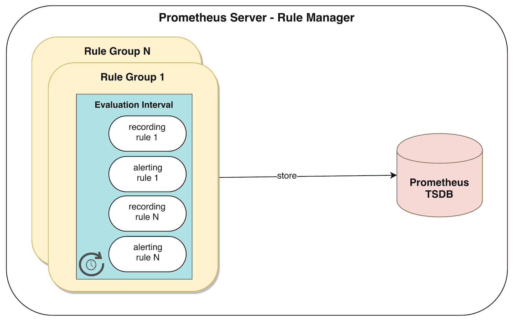
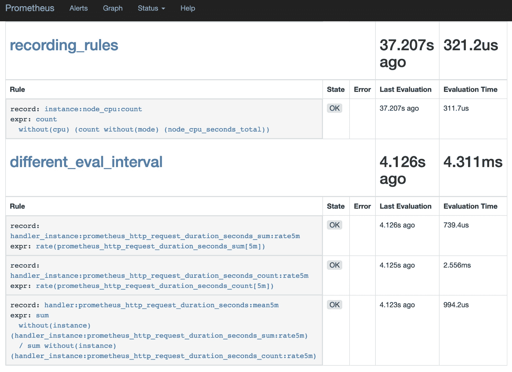
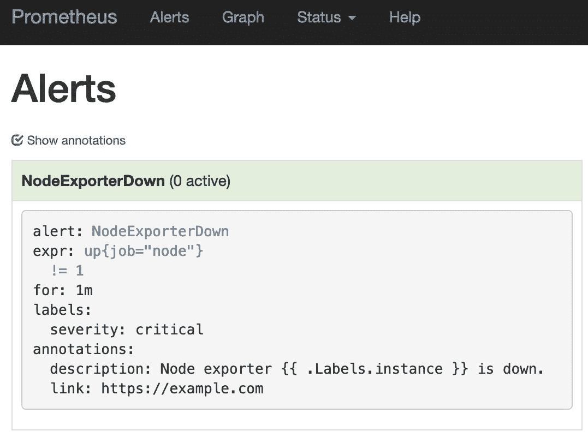
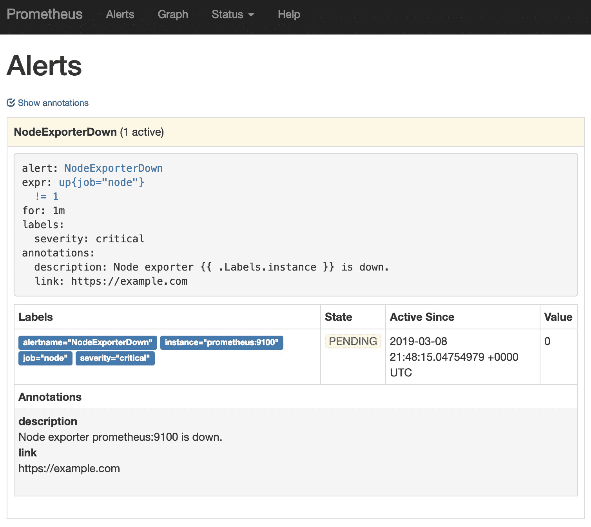
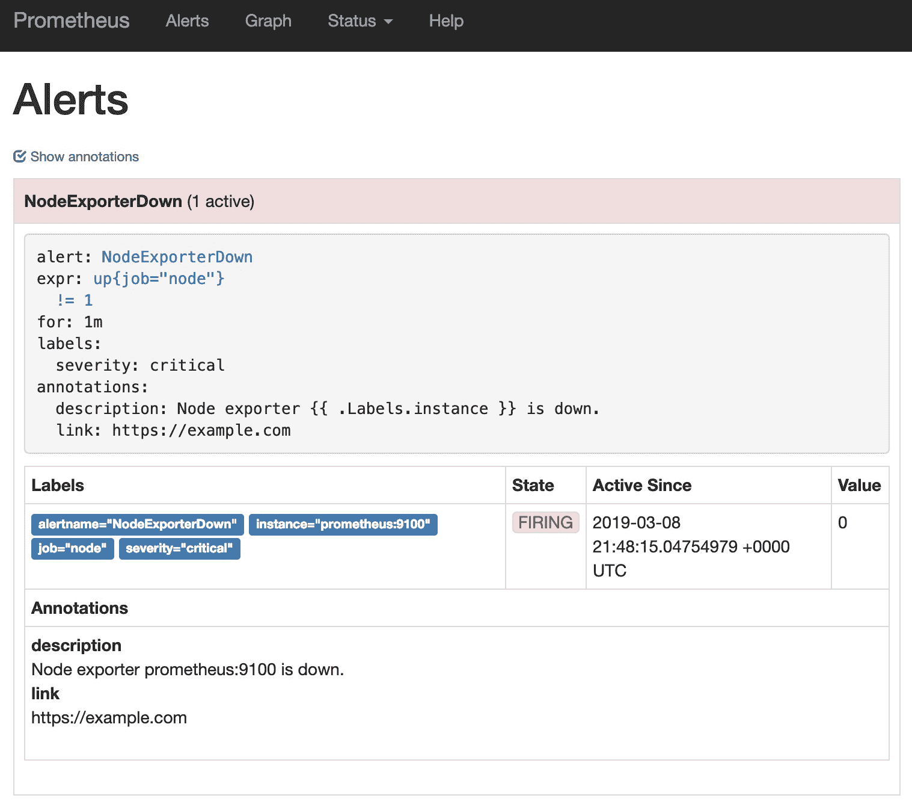
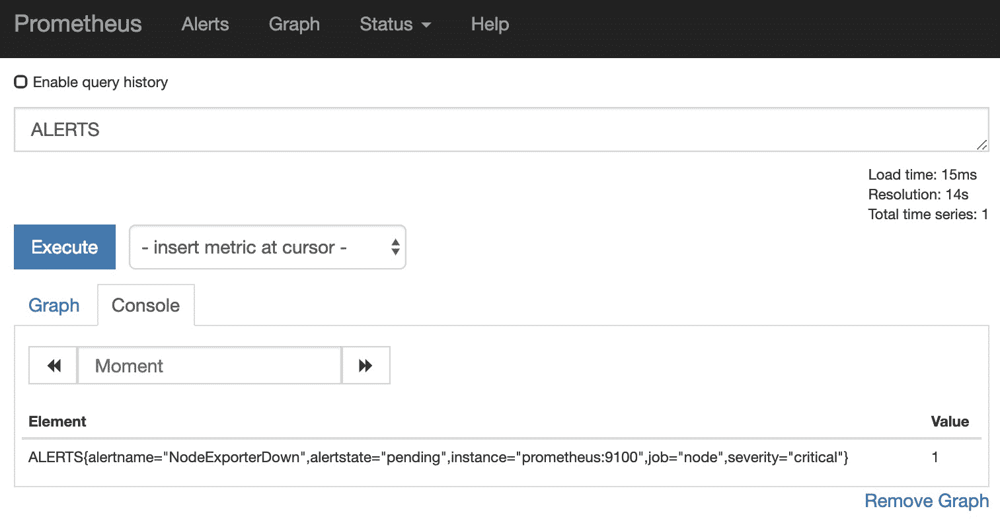
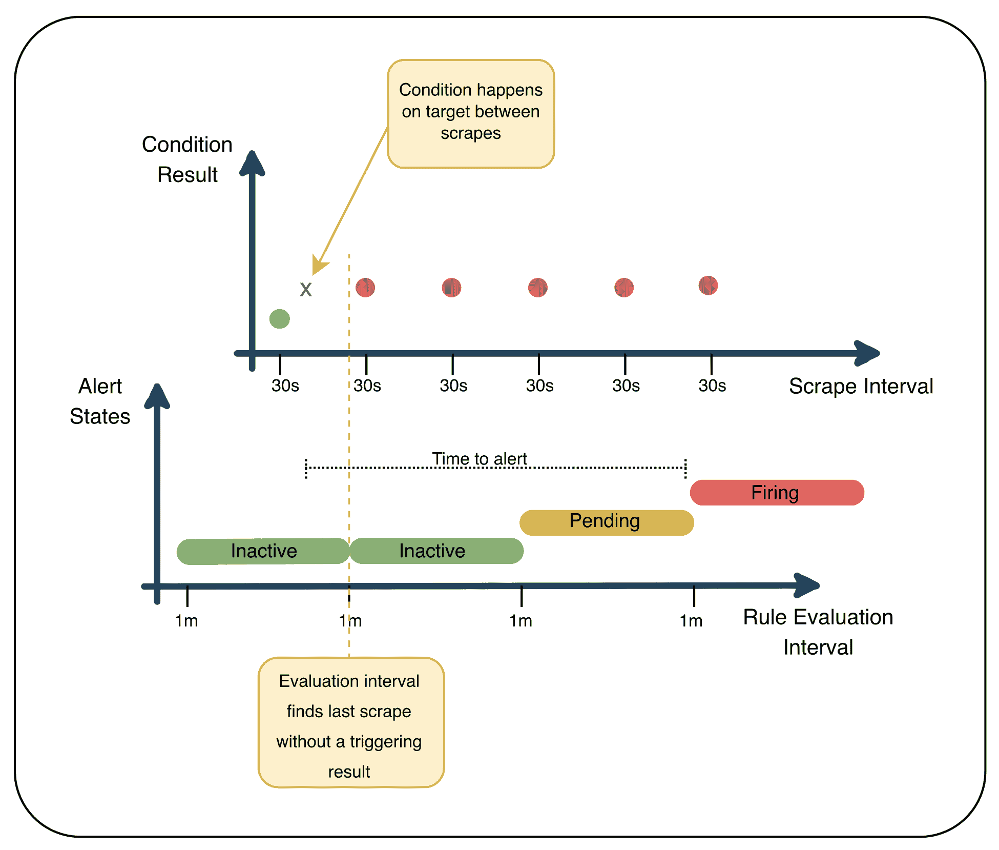

# 第十章：定义告警规则和记录规则

记录规则是 Prometheus 中一个非常有用的概念。它们使你能够加速繁重的查询，并在 PromQL 中启用本来非常昂贵的子查询。告警规则类似于记录规则，但具有告警特定的语义。由于测试是任何系统中的基础部分，本章将提供学习如何确保记录和告警规则在部署前按预期工作的机会。理解这些结构将有助于提升 Prometheus 的性能和鲁棒性，并启用其告警能力。

本章将涵盖以下主题：

+   创建测试环境

+   规则评估是如何工作的？

+   在 Prometheus 中设置告警

+   测试你的规则

# 创建测试环境

在本章中，我们将重点关注 Prometheus 服务器，并且将部署一个新的实例，以便应用所覆盖的概念。

# 部署

我们从创建一个新的 Prometheus 实例并将其部署到服务器上开始：

1.  要创建一个新的 Prometheus 实例，请进入正确的仓库路径：

```
cd chapter09/
```

1.  确保没有其他测试环境正在运行，然后启动本章的环境：

```
vagrant global-status
vagrant up
```

1.  使用以下代码验证测试环境是否成功部署：

```
vagrant status
```

这将输出以下内容：

```
Current machine states:

prometheus                   running (virtualbox)

The VM is running. To stop this VM, you can run `vagrant halt` to
shut it down forcefully, or you can run `vagrant suspend` to simply
suspend the virtual machine. In either case, to restart it again,
simply run `vagrant up`.
```

新实例将可供检查，Prometheus 的 Web 界面将可以通过 `http://192.168.42.10:9090` 访问。

现在你可以通过执行以下命令访问 `prometheus` 实例：

```
vagrant ssh prometheus
```

现在你已经连接到 `prometheus` 实例，你可以验证本章中描述的指令。

# 清理

测试完成后，请确保你位于 `chapter09/` 目录内，并执行以下命令：

```
vagrant destroy -f
```

不用太担心，如果需要，你可以轻松地重新启动环境。

# 了解规则评估是如何工作的

Prometheus 允许周期性地评估 PromQL 表达式，并存储由这些表达式生成的时间序列；这些被称为 **规则**。本章中我们将看到这两种规则类型。它们分别是 *记录*规则和*告警*规则。它们共享相同的评估引擎，但在目的上有所不同，我们将在接下来的内容中详细探讨。

记录规则的评估结果将作为样本保存到 Prometheus 数据库中，针对配置中指定的时间序列。这类规则可以通过预计算昂贵的查询，将原始数据聚合为时间序列来减轻重型仪表板的负担，随后可以将其导出到外部系统（例如通过联邦机制导出到更高层次的 Prometheus 实例，具体内容请见 第十三章，*扩展与联邦化 Prometheus*），并且有助于创建复合的范围向量查询（虽然记录规则过去是唯一的实现方式，但新的子查询语法使得这类用例的探索成为可能）。

当规则中评估的 PromQL 表达式产生非空结果时，警报规则会触发。它们是 Prometheus 中进行时间序列警报的机制。警报规则触发时也会生成新的时间序列，但不会将评估结果作为样本；相反，它们会创建一个`ALERTS`度量，其中包含警报名称和状态作为标签，以及配置中定义的任何其他标签。下一节将进一步分析这一点。

# 使用记录规则

规则与主 Prometheus 配置文件分开定义，并通过`rule_files`顶级配置键包含在主配置文件中。它们会定期评估，这个间隔可以通过`global`中的`evaluation_interval`全局定义（默认为一分钟）。

我们可以通过查看测试环境中提供的配置来看到这一点：

```
vagrant@prometheus:~$ cat /etc/prometheus/prometheus.yml
global:
...
 evaluation_interval: 1m
...

rule_files:
 - "recording_rules.yml"
...
```

`rule_files`接受一个路径列表，这些路径可以是相对于主 Prometheus 配置的相对路径或绝对路径。此外，可以使用通配符匹配文件名（而不是目录）；例如，`/etc/prometheus/rules/*.yml`。规则文件中的更改不会被 Prometheus 自动检测到，因此需要重新加载（如第五章《运行 Prometheus 服务器》中所述，*Running a Prometheus Server*）。如果规则文件中发现错误，Prometheus 将无法重新加载，并将继续使用先前的配置运行。然而，如果服务器被重启，它将无法启动。为了确保这种情况不发生，可以使用`promtool`提前测试错误（如第八章《故障排除与验证》中所述，*Troubleshooting and Validation*）– 在使用自动化部署规则时，强烈建议这样做。

就像`prometheus.yml`配置文件一样，`rules`文件也是以 YAML 格式定义的。实际格式非常容易理解：

```
groups:
- name: <group_name_1>
  interval: <evaluation_interval>
  rules:
  - record: <rule_name_1>
    expr: <promql_expression_1>
    labels:
 <label_name>: <label_value>
  ...
  - record: <rule_name_N>
    expr: <promql_expression_N>
...
- name: <group_name_N>
  ...
```

每个文件在`groups`键下定义一个或多个规则组。每个组都有一个`name`，一个可选的评估`interval`（默认为在主 Prometheus 配置文件中定义的全局评估间隔），以及一个`rules`列表。每个规则指示 Prometheus 将评估在`expr`中定义的 PromQL 表达式的结果记录到指定的度量名称中，并可以通过在`labels`中设置它们来选择性地添加或覆盖存储结果之前设置的系列标签。每个组中的规则按声明的顺序依次评估，这意味着由某个规则生成的时间序列可以安全地在同一组内的后续规则中使用。由规则生成的样本将具有与规则组评估时间相对应的时间戳。下图说明了前述过程：



图 9.1：规则管理器是 Prometheus 的内部子系统，负责根据规则组的评估间隔定期评估规则，并管理警报生命周期。

让我们来看一下在本章测试环境中可用的录制规则：

```
vagrant@prometheus:~$ cat /etc/prometheus/recording_rules.yml
```

该文件有两个规则组，分别命名为`recording_rules`和`different_eval_interval`：

```
...
- name: recording_rules
  rules:
  - record: instance:node_cpu:count
    expr: count without (cpu) (count without (mode) (node_cpu_seconds_total))
...
```

第一个规则组由一个录制规则组成，使用全局评估间隔，采用`node_cpu_seconds_total`指标，从 Node Exporter 获取该指标，以计算**虚拟机**（**VM**）中可用的 CPU 核心数，并将结果录制到一个新的时间序列`instance:node_cpu:count`中。

第二个规则组更为复杂；它为该组显示了自定义评估间隔，并使用该组中先前规则生成的时间序列作为录制规则。我们不会深入讨论这些规则的具体作用，因为它们将作为接下来规则命名约定部分的示例，但可以看到这里的评估间隔：

```
...
- name: different_eval_interval
  interval: 5s
...
```

通过在第二个规则组中声明评估间隔，我们正在覆盖`prometheus.yml`的`global`部分中的配置——此组中的规则将在指定的频率下生成样本。这样做仅用于演示目的；通常不建议设置不同的间隔，原因与抓取作业相同：当使用具有不同采样率的系列时，查询可能会产生错误的结果，而且需要定期跟踪每个系列的不同采样率变得不可管理。

Prometheus 提供了一个状态页面，在 Web**用户界面**（**UI**）中，用户可以查看已加载的规则组及其包含的录制规则、录制状态、每个规则的最后一次评估所需时间，以及它们上次运行的时间。您可以通过进入顶部栏的状态 | 规则来找到这个页面：



图 9.2：Prometheus Web 界面显示/rules 端点

有了这些信息，我们现在掌握了如何创建录制规则的基本知识。接下来，我们将探讨 Prometheus 社区为录制规则约定的命名规则。

# 录制规则的命名约定

录制规则名称的验证遵循与度量名称相同的正则表达式，因此，规则技术上可以与任何其他度量名称相同。然而，制定清晰的命名标准能使得在抓取的度量中更容易识别录制规则，知道它们来源于哪些度量，以及理解应用了哪些聚合。

Prometheus 社区已经趋向于为录制规则制定一个明确的命名约定。这是基于多年的经验，在大规模运行 Prometheus 时积累的。这能在正确使用时提供所有上述优势。

记录规则命名的推荐约定由三个部分组成，使用冒号分隔，格式如下：`level:metric:operations`。第一部分表示规则的聚合级别，意味着它将列出相关的标签/维度（通常以下划线分隔）；第二部分是作为规则基础的指标名称；第三部分列出了应用于指标的聚合操作。

本章介绍的记录规则都遵循这一约定，因此让我们看一下在测试环境中可用的第二条规则组：

```
- record: handler_instance:prometheus_http_request_duration_seconds_sum:rate5m
  expr: >
    rate(prometheus_http_request_duration_seconds_sum[5m])

- record: handler_instance:prometheus_http_request_duration_seconds_count:rate5m
  expr: >
    rate(prometheus_http_request_duration_seconds_count[5m])

- record: handler:prometheus_http_request_duration_seconds:mean5m
  expr: >
    sum without (instance) (
      handler_instance:prometheus_http_request_duration_seconds_sum:rate5m
    )
    /
    sum without (instance) (
      handler_instance:prometheus_http_request_duration_seconds_count:rate5m
    )
```

从第一条规则的命名来看，我们可以轻松理解该规则基于`prometheus_http_request_duration_seconds_sum`指标；`rate5m`表示对五分钟的时间范围应用了`rate()`函数，且有两个有趣的标签：`handler`和`instance`。

第二条规则应用了相同的逻辑，但这次使用的是`prometheus_http_request_duration_seconds_count`指标。第三条规则则稍微复杂一些；因为它是将`_sum`除以延迟事件的`_count`，它实际上代表了五分钟的延迟平均值，在这种情况下是 Prometheus 提供的 HTTP 请求的延迟。由于我们将`instance`标签聚合掉了，`level`部分通过仅保留`handler`作为相关维度来反映这一点。最后需要注意的是，这条规则的指标名称现在是`prometheus_http_request_duration_seconds`，因为它既不代表总和也不代表计数，但它仍然可以清楚地理解该规则所基于的指标。

命名记录规则可能是一项困难的任务，需要在精确表示所有相关因素和简洁管理指标名称之间取得平衡。当你遇到这种情况——无法立即清楚如何根据表达式命名记录规则时，一个好的经验法则是确保另一个熟悉这种命名约定的人可以将该规则与使用的指标、应该存在的标签/维度以及应用的变换联系起来。

# 在 Prometheus 中设置告警

到目前为止，我们已经讨论了 PromQL 如何在查询收集到的数据时发挥重要作用，但当我们需要一个表达式持续评估，以便在满足定义的条件时触发事件时，我们便进入了告警部分。我们在第一章中解释了告警是监控组件之一，*监控基础知识*。需要明确的是，Prometheus 并不负责发送电子邮件、Slack 或其他形式的通知；这通常是另一个服务的责任。这个服务通常是 Alertmanager，我们将在第十一章中讨论，*理解与扩展 Alertmanager*。Prometheus 利用告警规则的强大功能来推送告警，接下来我们将讨论这个话题。

# 什么是告警规则？

告警规则就像是记录规则，只是有一些额外的定义；它们甚至可以共享同一个规则组而不产生任何问题。最大的区别是，当触发时，它们会通过 HTTP POST 和 JSON 有效负载发送到外部端点，进行进一步处理。扩展一下“激活”这个术语，在这个上下文中，我们指的是当前状态与期望状态不同的情况，简而言之，就是当表达式返回一个或多个样本时。

告警规则，例如记录规则，依赖于在定义的间隔内评估的 PromQL 表达式。这个间隔可以是全局配置的，也可以是特定规则组的本地配置。在每次间隔迭代中，触发的告警会被验证，以确保它们仍然有效；如果不再有效，则认为它们已被解决。

对于每个由我们的表达式返回的样本，它都会触发一个告警。记住这一点非常重要，因为宽松的 PromQL 表达式可能会生成大量的告警，所以尽量将它们聚合在一起。

# 配置告警规则

为了演示如何创建和理解告警规则，我们将引导您完成整个过程。这不仅涉及到主要的 Prometheus 配置文件，还涉及规则文件以及服务器的 Web 界面在处理告警时的表现。

# Prometheus 服务器配置文件

在本章的测试环境中，我们可以找到以下 Prometheus 配置：

```
vagrant@prometheus:~$ cat /etc/prometheus/prometheus.yml 
global:
...
 evaluation_interval: 1m
...
rule_files:
 - "recording_rules.yml"
 - "alerting_rules.yml"
alerting:
 alertmanagers:
 - static_configs:
 - targets:
 - “prometheus:5001”
...
```

在这个配置中，有三个组件需要注意：

+   `evaluation_interval`：它负责定义用于记录和告警规则的全局评估间隔，可以在规则组层级通过使用`interval`关键字进行覆盖。

+   `rule_files`：这是 Prometheus 读取已配置的记录和/或告警规则的文件位置。

+   `alerting`：这是 Prometheus 发送告警进行进一步处理的端点。

在告警部分，我们配置了 `“prometheus:5001”`。在这个端点背后，实际上只是一个名为 **alertdump** 的小服务，它在 `5001` 端口上监听 HTTP POST 请求，并简单地将其有效负载转储到日志文件中。这将有助于分析 Prometheus 在告警触发时发送的内容。

# 规则文件配置

之前，我们查看了 Prometheus 配置文件；接下来，我们将转到提供的告警规则示例，以下是相应代码片段：

```
vagrant@prometheus:~$ cat /etc/prometheus/alerting_rules.yml 
groups:
- name: alerting_rules
 rules:
 - alert: NodeExporterDown
 expr: up{job="node"} != 1
 for: 1m
 labels:
 severity: "critical"
 annotations:
 description: "Node exporter {{ $labels.instance }} is down."
 link: "https://example.com"
```

让我们更详细地查看 `NodeExporterDown` 告警定义。我们可以将配置分为五个不同的部分：`alert`、`expr`、`for`、`labels` 和 `annotations`。接下来，我们将在下表中逐一介绍这些部分：

| **部分** | **描述** | **是否必需** |
| --- | --- | --- |
| `alert` | 使用的告警名称 | 是 |
| `expr` | 要评估的 PromQL 表达式 | 是 |
| `for` | 发送告警前，确保告警已触发的时间，默认为 0 | 否 |
| `labels` | 用户定义的键值对 | 否 |
| `annotations` | 用户定义的键值对 | 否 |

Prometheus 社区通常使用驼峰命名法（CamelCase）来命名告警。

Prometheus 不会执行验证来检查告警名称是否已被使用，因此可能会有两个或多个告警共享相同的名称，但评估不同的表达式。这可能会导致问题，例如追踪哪个特定的告警触发，或编写告警测试。

`NodeExporterDown` 规则仅在 `job="node"` 选择器的 `up` 指标超过 1 分钟不为 `1` 时触发，我们现在通过停止 Node Exporter 服务来测试这一点：

```
vagrant@prometheus:~$ sudo systemctl stop node-exporter
vagrant@prometheus:~$ sudo systemctl status node-exporter

...
Mar 05 20:49:40 prometheus systemd[1]: Stopping Node Exporter...
Mar 05 20:49:40 prometheus systemd[1]: Stopped Node Exporter.
```

我们现在强制使告警变为活动状态。这将迫使告警经历三个不同的状态：

| **顺序** | **状态** | **描述** |
| --- | --- | --- |
| 1 | 非活动 | 尚未进入待处理或触发状态 |
| 2 | 待处理 | 尚未足够长时间以变为触发状态 |
| 3 | 触发 | 活跃时间超过定义的 `for` 子句阈值 |

进入 Prometheus 服务器网页界面的 `/alerts` 端点，我们可以查看 `NodeExporterDown` 告警的三种不同状态。首先，告警处于非活动状态，正如我们在下图中看到的：



图 9.3：NodeExporterDown 告警处于非活动状态

然后，我们可以看到告警处于待处理状态。这意味着，尽管告警条件已经触发，Prometheus 会继续检查该条件是否在每个评估周期中持续触发，直到`for`时间段过去。下图展示了待处理状态；请注意，**显示注释**复选框已被选中，这会展开告警注释：



图 9.4：NodeExporterDown 告警处于待处理状态

最后，我们可以看到告警变为触发状态。这意味着告警已活跃超过 `for` 子句定义的持续时间——在这种情况下是 1 分钟：



图 9.5：NodeExporterDown 告警正在触发

当告警变为触发状态时，Prometheus 会向配置的告警服务端点发送 JSON 负载，在我们的案例中，端点是 alertdump 服务，该服务配置为将日志记录到 `/vagrant/cache/alerting.log` 文件。这使得我们很容易理解正在发送什么样的信息，并且可以进行如下验证：

```
vagrant@prometheus:~$ cat /vagrant/cache/alerting.log
[
   {
       "labels": {
           "alertname": "NodeExporterDown",
           "dc": "dc1",
           "instance": "prometheus:9100",
           "job": "node",
           "prom": "prom1",
           "severity": "critical"
       },
       "annotations": {
           "description": "Node exporter prometheus:9100 is down.",
           "link": "https://example.com"
       },
       "startsAt": "2019-03-04T21:51:15.04754979Z",
       "endsAt": "2019-03-04T21:58:15.04754979Z",
       "generatorURL": "http://prometheus:9090/graph?g0.expr=up%7Bjob%3D%22node%22%7D+%21%3D+1&g0.tab=1"
   }
]
```

现在我们已经了解了如何配置一些告警规则，并验证了 Prometheus 向配置的告警系统发送的内容，接下来让我们探索如何通过使用标签和注释来丰富这些告警的上下文信息。

# 标签和注释

在告警规则定义中，有两个可选部分：标签和注释。标签定义了告警的身份，并且可以根据它们所在的评估周期发生变化；如果发生变化，将会改变告警的身份。为了说明这一点，我们将介绍 `ALERTS` 指标，它跟踪所有活动告警及其标签。正如我们在下面的图示中看到的，我们有一个名为 `alertstate` 的标签，它跟踪告警的状态，并且会从 `pending` 状态过渡到 `firing` 状态：



图 9.6：ALERTS 指标

需要注意的是，标签中使用示例值的问题。虽然技术上是可行的，但这是一个非常糟糕的主意。这样做每次值发生变化时都会改变告警的身份，从而始终会重置定义的 `for` 倒计时，导致告警永远不会进入 `firing` 状态。

另一方面，注释不属于告警的身份，因此它们不会存储在 `ALERTS` 指标中。这些注释对于丰富告警的上下文信息非常有用。注释也使用 Go 模板语言进行模板化，就像我们在示例中看到的那样。通过使用 `{{ .Labels.instance }}` 模板语法，我们可以访问可用的告警标签，选择 `instance` 标签，并在注释的 `description` 字段中使用其值。如果需要，还可以通过 `{{ .Value }}` 来获取触发样本的值。

Golang 模板中的 `.Labels` 和 `.Value` 变量也可以作为 `$labels` 和 `$value` 使用，以方便操作。

以下代码段展示了我们示例中的告警规则：

```
   annotations:
     description: "Node exporter {{ .Labels.instance }} is down."
     link: "https://example.com"
```

当告警处于 `firing` 状态时，将产生以下渲染结果：

```
       "annotations": {
           "description": "Node exporter prometheus:9100 is down.",
           "link": "https://example.com"
       },
```

您可以在 [`golang.org/pkg/text/template/`](https://golang.org/pkg/text/template/) 获得更多关于 Golang 模板的信息。

# 告警延迟

在前面的主题中，我们讨论了警报会经历的三个状态；但是在计算警报变为触发状态所需的总时间时，还需要考虑其他因素。首先是抓取间隔（在我们的示例中是 30 秒，虽然通常抓取和评估间隔应该相同以便于理解），然后是规则评估间隔（在我们的例子中全局定义为 1 分钟），最后是警报规则中 `for` 子句定义的 1 分钟。如果将这些变量都考虑在内，警报被认为是 `firing` 的时间，在最坏情况下可能需要 2 分钟 30 秒。下图展示了这个示例情况：



图 9.7：警报延迟可视化

所有这些延迟仅发生在 Prometheus 端。处理发送警报的外部服务可能会有其他约束，这可能导致从发送通知到最终发送的全球延迟更长。

在 Prometheus 2.4.0 之前，`pending` 和 `firing` 状态在重启后不会持久化，这可能会进一步延长警报的延迟。通过实现一个新的度量指标 `ALERTS_FOR_STATE`，来存储警报状态，从而解决了这个问题。你可以在 [`github.com/prometheus/prometheus/releases/tag/v2.4.0`](https://github.com/prometheus/prometheus/releases/tag/v2.4.0) 查阅 Prometheus 2.4.0 的发布说明。

# 测试你的规则

在第八章《故障排除与验证》中，我们介绍了 `promtool` 的一些功能，测试功能除外。`test rules` 子命令可以模拟多个时间序列的周期性样本摄取，利用这些时间序列评估记录和警报规则，然后测试记录的系列是否与配置的预期结果匹配。现在我们已经了解了记录和警报规则，接下来将通过创建单元测试并使用 `promtool` 来验证我们的规则，确保它们按预期工作。

# 记录规则测试

Prometheus 二进制分发包中包含的 `promtool` 工具允许我们定义测试用例来验证我们编写的规则是否按预期工作。本章的测试环境还提供了一套针对我们到目前为止探索的规则的预构建测试。你可以在这里查看配置：

```
vagrant@prometheus:~$ cat /etc/prometheus/tests.yml
```

该文件包含本章介绍的所有记录和告警规则的测试。虽然你不需要在一个文件中定义所有的测试（实际上，为了保持组织性，每个规则组使用单独的测试文件更为整洁），但为了简便，这里统一在一个文件中进行了定义。现在，我们只分析记录规则，因为它们更容易理解。测试文件的顶层配置键定义了要加载的规则文件以及测试的默认评估间隔，它决定了当规则没有明确指定自己的评估周期时，记录和告警规则评估的周期性：

```
rule_files:
  - /etc/prometheus/recording_rules.yml
...
evaluation_interval: 1m
```

虽然测试文件中的 `rule_files` 配置键看起来与主 Prometheus 配置文件中的相同，但它不支持通配符（使用文件名通配符）。

在这些全局配置之后，紧接着是 `tests` 键下的测试用例定义。你可以定义多个测试包，每个包有自己独立的模拟抓取间隔、采集的系列和待测规则。让我们看看文件中定义的第一个测试，我们在其中添加了一些注释以便于理解：

```
tests:
```

`interval` 设置了在我们的模拟时间序列中生成间隔样本的时间：

```
- interval: 15s
```

`input_series` 的列表定义了生成哪些时间序列以及在每次模拟采集间隔的迭代中生成哪些值：

```
    input_series:
      - series: 'node_cpu_seconds_total{cpu="0",instance="prometheus:9100",job="node",mode="user"}'
        values: '1 1 1 1 1 1 1 1 1 1'
      - series: 'node_cpu_seconds_total{cpu="1",instance="prometheus:9100",job="node",mode="user"}'
        values: '1 1 1 1 1 1 1 1 1 1'
      - series: 'node_cpu_seconds_total{cpu="0",instance="example:9100",job="node",mode="idle"}'
        values: '1 1 1 1 1 1 1 1 1 1'
      - series: 'node_cpu_seconds_total{cpu="0",instance="example:9100",job="node",mode="system"}'
        values: '1 1 1 1 1 1 1 1 1 1'
```

用于测试的 PromQL 表达式列表被定义为 `promql_expr_test`：

```
promql_expr_test:
```

每个 `expr` 定义了一个特定的表达式：

```
- expr: instance:node_cpu:count
```

设置 `eval_time` 来确定该表达式运行的时间点，预期的样本应该通过运行该表达式返回，称为 `exp_samples`：

```
        eval_time: 1m
        exp_samples:
          - labels: 'instance:node_cpu:count{instance="prometheus:9100", job="node"}'
            value: 2
          - labels: 'instance:node_cpu:count{instance="example:9100", job="node"}'
            value: 1
```

在这个测试包中，我们可以看到每 15 秒生成四个时间序列，都是针对相同的指标 `node_cpu_seconds_total`。由于这些序列的实际值对该记录规则并不重要（它仅计算每个实例的 CPU 数量），因此每个样本的值都设置为 `1`。请注意标签的变化，具体来说，`prometheus:9100` 实例报告的是两个 CPU 的指标，而 `example:9100` 实例报告的是一个 CPU。实际测试只是验证，当 `instance:node_cpu:count` 表达式在 `t=1m` 时评估（假设从生成的采集开始经过了 1 分钟），返回的样本应显示每个实例的正确 CPU 数量。

我们现在可以使用以下指令来执行测试：

```
vagrant@prometheus:/etc/prometheus$ promtool test rules tests.yml 
Unit Testing: tests.yml
 SUCCESS
```

这确保了配置的记录规则按我们预期的方式运行。你可以通过从 `prometheus:9100` 实例的 `instance:node_cpu:count` 测试包中移除一个输入序列来尝试破坏测试。当你重新运行测试时，以下内容将显示出来，因为其中一个测试现在失败了：

```
vagrant@prometheus:/etc/prometheus$ promtool test rules tests.yml 
Unit Testing: tests.yml
  FAILED:
    expr:'instance:node_cpu:count', time:1m0s, 
        exp:"{__name__=\"instance:node_cpu:count\", instance=\"example:9100\", job=\"node\"} 1E+00, {__name__=\"instance:node_cpu:count\", instance=\"example:9100\", job=\"node\"} 1E+00, {__name__=\"instance:node_cpu:count\", instance=\"prometheus:9100\", job=\"node\"} 2E+00", 
        got:"{__name__=\"instance:node_cpu:count\", instance=\"example:9100\", job=\"node\"} 1E+00, {__name__=\"instance:node_cpu:count\", instance=\"example:9100\", job=\"node\"} 1E+00, {__name__=\"instance:node_cpu:count\", instance=\"prometheus:9100\", job=\"node\"} 1E+00"
```

这个输出告诉我们，`promtool` 期待的是已定义的样本集，但返回了一个不同的样本集。你可以看到，正如我们配置的那样，记录规则现在只报告了 `prometheus:9100` 实例的一个 CPU。这让我们对规则的行为是否如我们所愿充满信心。

第二组记录规则的测试大部分相同，但它们展示了生成更丰富输入序列的强大表示法：

```
  - interval: 5s
    input_series:
      - series: 'prometheus_http_request_duration_seconds_count{handler="/",instance="localhost:9090",job="prometheus"}'
        values: '0+5x60'
      - series: 'prometheus_http_request_duration_seconds_sum{handler="/",instance="localhost:9090",job="prometheus"}'
        values: '0+1x60'
```

这称为**展开表示法**。这是一种紧凑的方式，用于声明生成时间序列值的公式。它的形式可以是`A+BxC` 或 `A-BxC`，其中 `A` 是起始值，`B` 是每次迭代中序列值应增加（前有 `+`）或减少（前有 `-`）的量，`C` 是这种增加或减少应应用多少次。

回到我们的示例，`0+5x60` 将展开成以下系列：

```
0 5 10 15 20 … 290 295 300
```

在声明输入时间序列的值时，您可以将字面值与展开表示法混合使用。这使得您可以轻松创建复杂的行为。以下是一个例子：

```
0 1 1 0 1+0x3 0 1 1 0 1 1 0 0 0 1 1 0+0x3 1
```

这将展开成如下所示：

```
0 1 1 0 1 1 1 1 0 1 1 0 1 1 0 0 0 1 1 0 0 0 0 1
```

测试对于避免不可预见的问题至关重要，凭借目前所涵盖的信息，您现在可以为记录规则生成自己的单元测试。接下来，我们将继续处理单元测试，但这次特别针对警报规则。

# 警报规则测试

警报规则的单元测试与记录规则的单元测试非常相似。我们将使用本章之前提供的示例警报来演示如何配置警报测试以及如何验证它们。如前所述，本章的测试环境包含了一套用于测试此处呈现规则的测试，包括我们感兴趣的警报规则。再次提醒，您可以使用以下命令查看测试文件：

```
vagrant@prometheus:~$ cat /etc/prometheus/tests.yml
```

专注于警报组件，我们可以看到我们首先定义了警报规则的位置：

```
rule_files:
  - /etc/prometheus/alerting_rules.yml
```

默认的规则评估间隔在同一文件中的记录规则和警报规则之间共享：

```
evaluation_interval: 1m
```

警报测试便捷地位于自己的测试组中，让我们来看一下它的完整定义：

```
  - interval: 1m
    input_series:
      - series: 'up{job="node",instance="prometheus:9100"}'
        values: '1 1 1 0 0 0 0 0 0 0'
      - series: 'up{job="prometheus",instance="prometheus:9090"}'
        values: '1 0 1 1 1 0 1 1 1 1'
```

测试组定义与之前解释的相同，唯一的例外是 `alert_rule_test` 部分，这里我们定义了警报测试。需要注意的是，在这个示例中，第二个输入序列永远不应被我们的测试规则匹配，因为已定义的警报特别匹配 `job="node"`：

```
    alert_rule_test:
      - alertname: NodeExporterDown
        eval_time: 3m
      - alertname: NodeExporterDown
        eval_time: 4m
        exp_alerts:
          - exp_labels:
              instance: "prometheus:9100"
              job: "node"
              severity: "critical"
            exp_annotations:
              description: "Node exporter prometheus:9100 is down."
              link: "https://example.com"
```

`alert_rule_test` 和 `promql_expr_test` 不必放在单独的测试块中；当记录规则和警报规则使用相同的输入时间序列并且具有相同的评估间隔时，您可以将两者放在同一测试组中。

`alert_rule_test`部分列出了应在模拟测试运行开始时（`eval_time`）评估哪些警报（`alertname`）。如果预计该警报会在该时刻触发，则应定义一个额外的`exp_alerts`部分，列出每个警报实例应包含的预期标签（`exp_labels`）和注释（`exp_annotations`）。如果`exp_alerts`部分为空，意味着该警报在指定的时间不应触发。

第一个警报测试将在第三分钟执行，由于我们之前提供的匹配系列在该时刻返回值`1`，因此在`alerting_rules.yml`中定义的警报表达式不会触发——这意味着警报中定义的表达式没有返回数据。

第二个警报规则将在第四分钟执行，并返回数据，因为我们提供的匹配系列在该特定时刻的样本值为`0`。警报规则返回的所有标签需要明确检查。测试还必须检查警报返回的所有描述，并完全展开任何模板变量。

我们现在可以使用以下指令运行测试：

```
vagrant@prometheus:~$ promtool test rules /etc/prometheus/tests.yml 
Unit Testing: /etc/prometheus/tests.yml
 SUCCESS
```

作为额外步骤，尝试将第二个警报的描述从`prometheus:9100`更改为类似`prometheus:9999`的内容，然后重新运行测试。你应该会得到以下输出：

```
vagrant@prometheus:~$ promtool test rules /etc/prometheus/tests.yml 
Unit Testing: /etc/prometheus/tests.yml
  FAILED:
    alertname:NodeExporterDown, time:4m0s, 
        exp:"[Labels:{alertname=\"NodeExporterDown\", instance=\"prometheus:9100\", job=\"node\", severity=\"critical\"} Annotations:{description=\"Node exporter prometheus:9999 is down.\", link=\"https://example.com\"}]", 
        got:"[Labels:{alertname=\"NodeExporterDown\", instance=\"prometheus:9100\", job=\"node\", severity=\"critical\"} Annotations:{description=\"Node exporter prometheus:9100 is down.\", link=\"https://example.com\"}]"
```

尽管这个警报非常简单，容易确定在何种条件下会触发，但警报规则的测试能够确保在你无法合理重现的环境条件下，警报会触发。

# 总结

在本章中，我们有机会观察另一种生成衍生时间序列的方法。记录规则通过将重复的重查询预先计算成新的时间序列，帮助提高监控系统的稳定性和性能，这些新时间序列相对便宜，便于查询。警报规则将 PromQL 的强大功能和灵活性带入警报中；它们使得可以为复杂且动态的阈值触发警报，并且使用单个警报规则针对多个实例甚至不同应用进行目标定位。现在，了解警报中如何引入延迟将帮助你根据需求调整它们，但记住，稍微的延迟总比产生噪音的警报要好。最后，我们探索了如何为规则创建单元测试，并在 Prometheus 服务器运行之前验证它们。

下一章将进入监控的另一个组件：可视化。我们将深入探讨 Grafana，这是社区首选的 Prometheus 驱动仪表板工具。

# 问题

1.  记录规则的主要用途是什么？

1.  为什么应避免在规则组中设置不同的评估间隔？

1.  如果你看到`instance_job:latency_seconds_bucket:rate30s`指标，你期望看到哪些标签，并且会使用什么表达式来记录它？

1.  为什么在告警标签中使用告警的样本值是一个不好的主意？

1.  警报的待处理状态是什么？

1.  当没有指定 `for` 子句时，警报从触发到过渡到 `firing` 状态之间会等待多长时间？

1.  如何在不使用 Prometheus 的情况下测试你的规则？

# 深入阅读

+   **Prometheus 记录规则**: [`prometheus.io/docs/prometheus/latest/configuration/recording_rules/`](https://prometheus.io/docs/prometheus/latest/configuration/recording_rules/)

+   **规则命名最佳实践**: [`prometheus.io/docs/practices/rules/`](https://prometheus.io/docs/practices/rules/)

+   **Prometheus 告警规则**: [`prometheus.io/docs/prometheus/latest/configuration/alerting_rules/`](https://prometheus.io/docs/prometheus/latest/configuration/alerting_rules/)

+   **Prometheus 单元测试**: [`prometheus.io/docs/prometheus/latest/configuration/unit_testing_rules/`](https://prometheus.io/docs/prometheus/latest/configuration/unit_testing_rules/)
