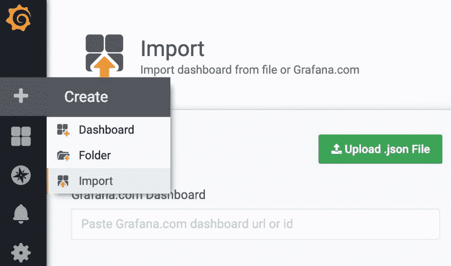

# 第十章：发现并创建 Grafana 仪表板

Prometheus 表达式浏览器非常适合执行探索性查询，但有时我们需要预先构建的可视化来帮助我们快速调试问题。在本章中，我们将深入了解 Grafana，这是 Prometheus 项目推荐的用于构建仪表板的工具。Grafana 社区不断壮大，并通过托管大量现成的仪表板，使得重用它们、贡献社区并改进生态系统变得更加容易。在本章中，我们将学习如何查找和使用社区提供的仪表板，以及如何编写自己的仪表板并为社区做出贡献。最后，我们还会简要介绍控制台，这是一种内建于 Prometheus 中的仪表板解决方案，适用于高级用例。

简而言之，本章将涵盖以下主题：

+   本章的测试环境

+   如何将 Grafana 与 Prometheus 一起使用

+   构建你自己的仪表板

+   发现现成的仪表板

+   默认 Prometheus 可视化

# 本章的测试环境

为了提供一个动手操作的方法，我们将为本章创建一个新的测试环境。我们将使用的设置类似于以下图示：


图 10.1：测试环境网络

# 部署

要生成本章的**虚拟机**（**VM**）基础测试环境，前往代码库根目录下的正确存储库路径：

```
cd ./chapter10/
```

确保没有其他测试环境在运行，并启动本章的环境，如下所示：

```
vagrant global-status
vagrant up
```

你可以使用以下代码验证测试环境的成功部署：

```
vagrant status
```

这将产生以下输出：

```
Current machine states:

prometheus                 running (virtualbox)
grafana                    running (virtualbox)

This environment represents multiple VMs. The VMs are all listed above with their current state. For more information about a specific VM, run `vagrant status NAME`.
```

当部署任务完成后，你将能够使用你喜欢的支持 JavaScript 的网页浏览器，验证主机上的以下端点：

| **服务** | **端点** |
| --- | --- |
| Prometheus | `http://192.168.42.10:9090` |
| Grafana | `http://192.168.42.11:3000` |

你应该能够通过以下命令之一访问所需的实例：

| **实例** | **命令** |
| --- | --- |
| Prometheus | `vagrant ssh prometheus` |
| Grafana | `vagrant ssh grafana` |

# 清理

当你完成测试后，只需确保你在 `chapter10/` 目录下并执行以下命令：

```
vagrant destroy -f
```

不用太担心——如果需要，你可以轻松地重新启动环境。

# 如何将 Grafana 与 Prometheus 一起使用

Grafana 是最为人所知的开源仪表板项目。它有数据源的概念，数据源不过是与数据后端的集成。截止目前，以下是可用的数据源：

+   Prometheus

+   石墨

+   InfluxDB

+   Elasticsearch

+   Google Stackdriver

+   AWS CloudWatch

+   Azure Monitor

+   Loki（日志可视化）

+   MySQL

+   PostgreSQL

+   Microsoft SQL Server

+   OpenTSDB

+   TestData（用于生成测试的虚拟数据）

已经做了很多努力来提升 Prometheus 在 Grafana 中的集成性——例如，PromQL 自动补全。目前，Grafana 是任何想要可视化 Prometheus 数据的人的首选仪表板解决方案。不过，前面的说法并不完全准确，因为我们知道，对于探索性查询来说，没有什么比 Prometheus 表达式浏览器更好的了。然而，最近在 6.0.0 版本发布后，Grafana 引入了一项名为 Explore 的功能，作为替代的表达式浏览器。

你可以在 [`grafana.com/grafana/download`](https://grafana.com/grafana/download) 下载多个操作系统和发行版的安装文件。

Grafana 在构建时就考虑到了自动化。以下示例将展示你如何在不触碰主要配置文件的情况下几乎完成环境的设置。一个值得注意的好处是，Grafana 本身就已经集成了 Prometheus 的度量指标。

# 登录界面

在测试环境运行时，你可以通过 `http://192.168.42.11:3000` 网址访问 Grafana。用户将看到一个简单的登录界面，如下所示：


图 10.2：Grafana 登录界面

默认的身份验证凭证如下：

| **用户名** | **密码** |
| --- | --- |
| `admin` | `admin` |

登录成功后，我们将进入 Grafana 的首页，首页会显示一个设置向导。接下来，我们将解释每个配置步骤。以下截图展示了向导，其中一些步骤已完成配置：


图 10.3：Grafana 首页

为了提高可读性，我们将默认的 Grafana 主题改为 **Light**，而不是 **Dark**。这可以在 **首选项** 菜单中的 **配置** 标签（左侧的小齿轮图标）轻松配置。

# 数据源

为了能够查询数据，我们必须配置一个数据源。在我们的案例中，我们将把 Prometheus 实例添加为默认的数据源。为此，我们需要指明数据源的位置、所需的身份验证/授权信息，以及任何其他特定的数据源配置。

配置数据源有两种方式。一种方式是通过在 Grafana 配置路径中添加一个包含所需配置的 YAML 文件，服务在启动时会自动读取并配置。这就是我们在本章的测试环境中所做的，因为它是自动化部署的更好解决方案。当连接到测试环境中的 `grafana` 实例时，你可以通过查看默认配置路径，看到我们正在使用的配置，路径如下所示：

```
vagrant@grafana:~$ cat /etc/grafana/provisioning/datasources/prometheus.yaml 
apiVersion: 1

datasources:
- name: prometheus
 type: prometheus
 access: proxy
 orgId: 1
 url: http://prometheus:9090
 isDefault: True
 version: 1
 editable: True
```

另一种选择是通过进入**配置**（左侧的小齿轮图标）| **数据源**，手动添加设置选项。在点击**保存并测试**后，Grafana 将验证设置，并告知你是否存在任何问题。Grafana 提供了两种访问提供 HTTP 基础 API（如 Prometheus）的数据源的选项：是否代理请求。当代理请求时，从仪表板面板或通过探索表达式浏览器发出的每一个查询都会通过 Grafana 后端代理到数据源。尽管这样可以集中管理数据源凭证，并关闭除了受信任的客户端之外的所有直接网络访问，但它会增加 Grafana 实例的负载，因为需要处理更多的流量。不代理请求意味着客户端浏览器每次请求都会直接访问数据源。此配置要求访问 Grafana 的用户也能直接访问使用的数据源，并且该数据源的安全设置允许来自不同来源的请求。在我们所有的示例中，Grafana 都会设置为代理查询。

以下截图展示了我们在测试环境中使用的配置：


图 10.4：数据源配置界面

请注意，**访问**选项设置为**服务器（默认）**。这意味着所有的数据源请求将通过 Grafana 实例进行代理。

# 探索

这个功能是在 Grafana 6 中引入的，开发人员持续改进其与 Prometheus 的紧密集成。在探索模式之前，每次你想执行探索查询时，都需要跳转到 Prometheus 表达式浏览器。

除了这个便利性外，还有一些值得注意的功能，使得探索模式独具特色，如下所示：

+   **指标列表**：在左上角，我们可以找到一个名为**指标**的组合框。它以层次结构的形式列出了指标，按前缀分组，并且在符合双冒号命名规范时，能够自动检测和分组记录规则。

+   **查询字段**：除了建议和自动完成指标外，查询字段还会显示有关 PromQL 函数的有用工具提示，甚至可以展开在原始表达式中检测到的记录规则。

+   **上下文菜单**：你可以选择直接在探索页面中打开来自任何仪表板面板的查询。

以下截图展示了**探索**界面，同时显示了正在使用的 PromQL 函数的工具提示：


图 10.5：Grafana 探索页面，显示 `label_replace` 函数的工具提示

通常可以通过点击左侧的小指南针图标找到探索模式。

# 仪表盘

类似于管理数据源，添加仪表板有几种方法，列举如下：

+   通过手动构建你自己的

+   通过导入 [grafana.com](https://grafana.com/) 社区驱动的仪表板

+   通过自动配置之前存储的仪表板

我们现在将处理最后一种方法，因为测试环境正在使用这种方法。我们将在后续章节中关注另外两种方法。

仪表板文件是仪表板的声明性表示，包含所有必要的设置，并使用 JSON 格式。如果你将其放置在预期的配置路径中，Grafana 服务将在启动时加载它。在我们的示例中，我们使用了默认路径，正如以下代码片段所示：

```
vagrant@grafana:~$ ls /etc/grafana/dashboards/
node_exporter_basics.json
```

你可以通过进入页面左上角的 **首页** 菜单并选择 `node_exporter_basics` 来找到这个仪表板。它在视觉上对应于以下屏幕截图：


图 10.6：已自动配置的示例仪表板

# 在 Kubernetes 上运行的 Grafana

在 Kubernetes 上部署 Grafana 基本上与在虚拟机上部署的方式相同，因此我们只关注一些操作员应当注意的细节。用于在我们的 Kubernetes 测试环境中启动 Grafana 和 Prometheus 的 Kubernetes 清单可以在代码库根路径的以下位置找到：

```
cd ./chapter10/provision/kubernetes/
```

由于 Kubernetes 部署过程与前几章相同（引导 Prometheus Operator，使用 Operator 部署 Prometheus，并部署导出器及其相应的 ServiceMonitor），此处将不再详细介绍。如果需要更多上下文，请随时查看前几章中的测试环境操作说明，例如 第七章，*Prometheus 查询语言 - PromQL*。

以下步骤将确保创建一个新的 Kubernetes 环境，并预配置所有必要的软件，从而使我们能够专注于 Grafana 组件。

1.  验证没有其他环境正在运行：

```
minikube status
minikube delete
```

1.  使用以下命令启动一个空的 Kubernetes 环境：

```
minikube start \
  --cpus=2 \
  --memory=3072 \
  --kubernetes-version="v1.14.0" \
  --vm-driver=virtualbox
```

1.  添加 Prometheus Operator 组件并按如下方式进行部署：

```
kubectl apply -f ./bootstrap/
kubectl rollout status deployment/prometheus-operator -n monitoring
```

1.  使用以下命令添加新的 Prometheus 集群，并确保其成功：

```
kubectl apply -f ./prometheus/
kubectl rollout status statefulset/prometheus-k8s -n monitoring
```

1.  将所有目标添加到 Prometheus，并使用以下命令列出它们：

```
kubectl apply -f ./services/
kubectl get servicemonitors --all-namespaces
```

现在 Kubernetes 环境已经运行，我们可以继续进行 Grafana 特定的配置。类似于专注于虚拟机的测试环境，我们不仅需要配置 Grafana 本身，还需要配置数据源和仪表板。

对于数据源，由于我们可能将来需要添加敏感信息（如身份验证），我们将使用 Kubernetes 秘密。这也意味着应该有一个 ServiceAccount 用于访问该秘密。

我们可以通过应用以下清单来创建 ServiceAccount：

```
kubectl apply -f ./grafana/grafana-serviceaccount.yaml
```

由于我们使用的是秘密，因此数据源配置需要进行 base64 编码。至于配置本身，与虚拟机部署中的配置相同，但我们将使用由服务管理的 Kubernetes 等效 URL 来替换 Prometheus URL。以下是编码前的片段：

```
...
datasources:
- name: prometheus
...
 url: http://prometheus-service.monitoring.svc:9090
...
```

应用以下清单后，将会有一个新的秘密，包含所需的 Grafana 数据源：

```
kubectl apply -f ./grafana/grafana-datasources-provision.yaml
```

现在，是时候将我们的示例仪表板添加到 Grafana 中了。为此，我们需要向 Grafana 提供一个配置文件，告诉它在哪里查找仪表板定义，然后将我们的示例仪表板定义放到该路径中。这些将作为 ConfigMap 可用于 Grafana 部署。显示仪表板位置配置的相关片段如下：

```
...
data:
  dashboards.yaml: |-
    {
        "apiVersion": 1,
        "providers": [{
           "folder": "",
           "name": "default",
           "options": {
             "path": "/etc/grafana/dashboards" 
           },
           "orgId": 1,
           "type": "file"
         }]
    }
kind: ConfigMap
...
```

另一个`ConfigMap`包含我们的示例仪表板，具体如下所示：

```
...
data:
  node_exporter_basics.json: |-
    {
...
    }
kind: ConfigMap
...
```

两个清单可以使用以下命令在 Kubernetes 测试环境中部署：

```
kubectl apply -f ./grafana/grafana-dashboards-provision.yaml

kubectl apply -f ./grafana/grafana-dashboards.yaml
```

现在是部署 Grafana 并利用之前所有配置的时候，具体操作如下：

```
kubectl apply -f ./grafana/grafana-deployment.yaml
```

这个部署将所有内容整合在一起：它挂载了数据源的秘密，并且将仪表板配置和仪表板 ConfigMap 放置在与虚拟机测试环境相同的位置，如下所示：

```
... 
        volumeMounts:
        - name: grafana-datasources-provision
          mountPath: /etc/grafana/provisioning/datasources
        - name: grafana-dashboards-provision
          mountPath: /etc/grafana/provisioning/dashboards
        - name: grafana-dashboards
          mountPath: /etc/grafana/dashboards
...
```

您可以通过以下指令跟踪部署状态：

```
kubectl rollout status deployment/grafana -n monitoring
```

最后，我们可以添加一个服务，以便访问新启动的 Grafana 实例，并添加一个 ServiceMonitor，使 Prometheus Operator 配置 Prometheus 来收集指标：

```
kubectl apply -f ./grafana/grafana-service.yaml

kubectl apply -f ./grafana/grafana-servicemonitor.yaml
```

现在，您可以使用以下命令访问 Grafana 界面：

```
minikube service grafana -n monitoring
```

测试完成后，您可以通过执行以下命令删除这个基于 Kubernetes 的测试环境：

```
minikube delete
```

这个设置为您提供了一个关于如何在 Kubernetes 上集成 Grafana 和 Prometheus 的快速概览。它与虚拟机测试环境没有太大区别，但这里展示的细节希望能避免您需要到处搜索如何实现的资料。

# 创建您自己的仪表板

在提供的虚拟机测试环境中，您有机会尝试捆绑的仪表板。现在，您应该学习如何创建自己的仪表板，为此，您需要掌握一些概念。在本节中，我们将引导您完成创建仪表板的过程。

# 仪表板基础

仪表板由多个组件组成。我们将在接下来的章节中介绍最重要的概念，包括面板、它们支持的可视化、如何模板化变量，以及如何更改显示数据的时间范围。

# 面板

面板是仪表板可视化区域中的一个矩形插槽。以下截图展示了一个示例。它可以通过拖放调整其各个维度的大小和位置。你还可以将多个面板放置在一个行中，行只是这些面板的逻辑分组。行可以展开或折叠，以显示或隐藏其中的面板：


图 10.7：新面板

一个面板，除了能够查询选定的数据源外，还提供多种可视化选项供选择。这些可视化选项可以以多种方式展示数据，如简单的单值面板、条形图、折线图、表格，甚至热力图。下图展示了可用的内置可视化选项：


图 10.8：内置可视化选项

在前面的截图中，我们可以看到几种面板类型。以下是四种最常用的面板类型：

+   **Graph**：这是 Grafana 的主面板。它提供了创建富有表现力的二维图形的工具，这些图形由一个或多个 PromQL 表达式支持。

+   **Singlestat**：这是一个多用途的单值显示器。因此，PromQL 查询必须返回一个只有一个样本的瞬时向量。

+   **Gauge**：使用阈值，这个选项表示当前值相对于定义的上下限位置。像 Singlestat 可视化一样，这个选项需要一个只有一个样本的单一瞬时向量。

+   **Table**：这是以表格格式显示 PromQL 表达式结果的面板，每个标签都在自己的列中，并显示相应的值和时间戳。

对于每种可用的可视化选项，都有大量的设置选项，允许对每个面板的外观进行极为详细的自定义。官方的 Grafana 文档详细解释了每个选项，因此我们在这里将重点介绍最相关的选项。

# 变量

变量功能非常强大。它允许仪表板配置占位符，可以在表达式中使用，这些占位符可以通过静态或动态列表填充，通常以下拉菜单的形式呈现给仪表板用户。每当选定的值发生变化时，Grafana 将自动更新使用该特定变量的面板中的查询。在我们的示例仪表板中，我们使用此功能让用户选择要展示的节点实例。除了常用于查询之外，它们也可用于面板标题等其他地方。

此功能可以在 **仪表板设置** 中找到，通过点击右上角的齿轮图标进入，这个图标在任何仪表板内都可以找到。下图展示了 **设置** 菜单中的 **node_exporter_basics** 仪表板的 **Variables** 选项：


图 10.9：仪表板变量

如你所见，我们使用了一个 PromQL 查询来动态获取`$instance`变量的可能值。

当视口不够大时，Grafana 的响应式设计会隐藏一些右上角的图标。

# 时间选择器

时间选择器功能在任何仪表板的右上角都有一个包含时钟图标的按钮。界面分为两个主要区域：**快速范围**，即预定义的时间范围（大多数是相对于当前时间的），或**自定义范围**，允许你指定用于所有仪表板面板的确切时间跨度。顾名思义，**每隔：**选项将使仪表板面板在指定的时间间隔内自动重新加载。将其与相对时间范围结合使用时，这对于查看新数据非常有用。

以下截图显示了一系列的快速范围：


图 10.10：时间选择器

# 创建一个基本的仪表板

我们将通过引导你完成创建一个基础仪表板的过程来亲自体验 Grafana。你可以通过点击左侧的加号图标 | **仪表板**来开始。这将打开一个新的空白仪表板，并且已经有一个新面板，准备进行编辑。因为我们想要一个动态仪表板，所以我们将创建一个新的变量，这个变量将扩展为我们 Prometheus 服务器中可用的 Node Exporter 实例的列表。

使用*Shift* + *?*的快捷键组合将显示所有可用快捷键的帮助提示。

为了实现我们的目标，我们必须点击右上角的齿轮图标，打开**仪表板设置**，然后选择**变量**。下图展示了在创建此类变量时可用的选项：


图 10.11：变量界面

上述截图中显示的预览值展示了基于虚拟机的测试环境中的 Node Exporter 目标。如果你跟随使用 Kubernetes 测试环境，你将看到不同的预览。

在这个示例中，我们正在创建一个名为`instance`的变量，使用**查询**类型，这意味着它将从查询数据源的结果中填充其值。我们将数据源指定为`prometheus`，即在配置时给定的标识符，并且我们希望只有在仪表板加载时才刷新该变量。

现在进入有趣的部分：因为我们有兴趣收集 Node Exporter 实例，我们在**查询**字段中使用了一个指标，确保能够返回我们所需要的实例，`node_exporter_build_info`。`label_values()`函数实际上不是有效的 PromQL 语法，但它是 Grafana 中的 Prometheus 数据源插件提供的，用于在该字段中使用，以便支持这种表达式。

**Regex** 字段用于匹配我们想要用于填充变量的查询结果部分。在我们的示例中，我们希望获取实例标签的完整内容，因此我们在正则表达式捕获组 `(.+)` 中匹配所有内容。我们可以在屏幕底部的 **值预览** 部分看到匹配是否生效。点击 **添加** 并保存此仪表板为 `example` 后，我们现在可以看到包含 `instance` 变量值的下拉菜单：


图 10.11：实例值

现在是创建我们第一个面板的时候了。点击右上角的图表图标，在新面板中点击 **添加查询**。以下截图展示了查询接口：


图 10.12：查询接口

在这里，我们可以指定要在所需数据源上执行的 PromQL 查询（一个或多个，取决于可视化类型）。在我们的示例中，我们将创建一个按模式划分的 CPU 使用率图，并希望将查询模板化，使其使用我们之前创建的 `instance` 变量。请注意 `$instance`，在查询时它将被替换为 `instance` 下拉框中选择的值。完整表达式如下：

```
label_replace(avg by (mode, instance) (irate(node_cpu_seconds_total{instance="$instance", mode!="idle"}[5m])), "instance", "$1", "instance", "([^:]+):.+")
```

`label_replace()` 函数允许我们从实例值中移除端口，这将在 **图例** 字段中使用。此字段允许用其中设置的指标标签的值替换 `{{ }}` 模板标记。这样，在图表图例中将反映出在 **查询** 菜单之前的内容。以下截图中，我们可以看到应用于仪表板的多个视觉选项，我们将逐一介绍：


图 10.13：可视化接口

在 **轴** 部分，我们选择启用哪个图表轴；**右侧 Y** 配置选项没有产生任何变化，因为该轴未被使用。在 **左侧 Y** 配置中，我们可以指定 **单位**。在我们的例子中，我们想要百分比；我们本可以简单地将表达式乘以 100，但不这么做却展示了 Grafana 的一个实用功能。如我们所知，值的范围是从 0 到 1；这种 **单位** 类型将会把 0-1 范围内的值自动转换为百分比（从 0 到 100）。我们还确保 **Y-最小值** 设置为 0，这样图表在视觉上更容易理解，因为如果没有此设置，图表的 *y* 轴会根据查询结果中的最小 *Y* 值进行适应。此外，为了便于本示例，我们希望 *y* 轴刻度显示三位小数，因此我们通过 **小数位数** 字段设置了这一点。在 **X 轴** 中，我们没有做任何更改，因为我们希望显示时间。

在**图例**部分，我们控制图例的显示方式以及它在面板中的位置。在我们的案例中，我们希望它作为一个表格，放置在图表的右侧，并且我们希望它显示*Y*的平均值和当前值。

要完成我们的面板，我们需要进入**常规**菜单，如下图所示，在这里我们可以命名面板并添加描述。描述将在面板的左上角以小**i**图标形式显示：


图 10.14：面板的常规菜单

要保存你的新仪表板，只需点击右上角的小软盘图标。现在，你已经从头创建了一个简单的仪表板！你可以继续添加面板和可视化内容，但主要概念基本相同。你可以在测试环境中探索提供的仪表板，查看更多如何使用不同可视化选项的例子。

创建仪表板时需要记住的一点是避免不必要的杂乱。通常可以看到仪表板上有几十个面板，显示着大量的数据。尽量保持信息的适量，这样例如故障排除时可以快速且无痛。焦点是这里的关键：如果仪表板内有不相关的面板，可能将它们分成单独的仪表板会是一个好主意。

# 导出仪表板

Grafana 使得导出仪表板变得简单。要进行导出，只需打开你想导出的仪表板，点击右上角面板中的小**带箭头的方框**图标，靠近软盘图标。

将会打开以下表单：


图 10.15：Grafana 仪表板导出

在这里，你会看到几个选项：

+   **外部共享导出**：启用数据源名称的模板化，这对公开共享仪表板非常有帮助。为了在[grafana.com](https://grafana.com/)网站上发布仪表板，这是强制要求的。

+   **查看 JSON**：允许你查看仪表板的代码。

+   **保存到文件**：将仪表板保存为 JSON 文件。

接下来，我们将看看如何从 Grafana 仪表板画廊下载仪表板，以及如何将自己的仪表板贡献到其中。

# 发现现成的仪表板

由于 Grafana 被广泛使用，并且拥有庞大的社区支持，显然有大量仪表板是由该社区创建的。Grafana 的开发团队提供了一项服务，注册用户可以将他们的仪表板发布到画廊中，任何人都可以下载并在自己的 Grafana 实例中安装它们。在接下来的部分，我们将概述这两项操作，不仅包括如何使用社区制作的仪表板，还包括如何发布自己的仪表板。

# Grafana 仪表板画廊

社区驱动和官方的仪表盘可以在 [`grafana.com/dashboards`](https://grafana.com/dashboards) 上找到，正如预期的那样，有很多选择。由于我们对 Prometheus 特定的仪表盘感兴趣，因此在搜索站点时，应该将搜索结果限制为该数据源。通过应用额外的筛选器，我们继续缩小结果范围，正如你在以下截图中看到的那样：


10.16：Grafana.com 过滤后的仪表盘结果

然后我们可以选择感兴趣的仪表盘，接着会打开一个屏幕，如下图所示：


图 10.17：Grafana.com 选定的仪表盘信息

在这里，我们可以看到一些关于仪表盘的信息和它的截图。请注意右侧的 ID **9916**；它是 Grafana 库中该特定仪表盘的唯一标识符。我们可以通过进入 Grafana 实例（如我们测试环境中的实例），点击左侧主菜单中的加号，选择子菜单中的**导入**，并将其粘贴到相应的文本框中，如下图所示：



图 10.18：导入仪表盘界面

在粘贴 ID 后，会弹出一个新菜单，要求填写该仪表盘的名称、它应放置在哪个文件夹中以及应使用的数据源。如果与已有的仪表盘（例如同名仪表盘）发生冲突，系统会要求你先解决冲突，才能完成导入过程。

# 发布你的仪表盘

发布新创建的仪表盘非常简单。首先，确保你有一个 Grafana 网站的账户，可以通过 [`grafana.com/signup`](https://grafana.com/signup) 上的注册表单进行注册。成功注册后，可以通过**个人** *|* **我的仪表盘**进入你的个人资料，或者使用 `https://grafana.com/orgs/<user>/dashboards` 链接，替换 `<user>` 为你的 Grafana 用户名。

在**我的仪表盘**中，你现在可以点击**上传仪表盘**按钮。此操作将打开一个上传表单，要求上传仪表盘。请记住，只有导出时启用了**导出以供外部分享**选项的仪表盘才能被接受：


图 10.19：仪表盘上传表单

完成！现在你将获得一个仪表盘的数字 ID，你可以开始使用它或与全球分享。如果你愿意，还可以更新发布的仪表盘，因为这不会改变生成的 ID。相反，它会创建该仪表盘的另一个版本，用户将始终下载最新的版本。

# 默认 Prometheus 可视化

历史上，Prometheus 曾维护自己的工具来创建仪表盘，叫做 PromDash。随着时间的推移，由于 Grafana 增强了对 Prometheus 作为数据源的原生支持，社区开始倾向于使用 Grafana 作为主要的可视化解决方案，以至于 PromDash 被维护 Prometheus 的人弃用，转而支持 Grafana。

你可以在 [`github.com/prometheus-junkyard/promdash`](https://github.com/prometheus-junkyard/promdash) 找到 PromDash 的源代码。

尽管 Grafana 是大多数人推荐的可视化解决方案，Prometheus 也附带了一个名为**控制台模板**的内部仪表盘功能。这些控制台模板是用原始 HTML/CSS/JavaScript 编写的，并利用 Go 模板语言的强大功能生成由 Prometheus 服务器本身提供的仪表盘（称为控制台）。这使得它们既极其快速，又具有无限的可定制性。控制台模板既强大又复杂。我们将在下一节中通过简要概述如何使用和构建控制台模板来介绍这一功能。

# 开箱即用的控制台模板

当你解压 Prometheus 发布包时，除了服务器和 promtool 的二进制文件外，还可以找到一些现成的控制台模板。为了更清楚地说明，我们可以查看在测试环境中解压这些模板到系统路径中的内容，如下所示：

```
vagrant@prometheus:/usr/share/prometheus$ systemctl cat prometheus
...
ExecStart=/usr/bin/prometheus \
    --config.file=/etc/prometheus/prometheus.yml \
    --storage.tsdb.path=/var/lib/prometheus/data \
 --web.console.templates=/usr/share/prometheus/consoles \
 --web.console.libraries=/usr/share/prometheus/console_libraries
...
```

这两个目录需要正确配置才能使控制台正常工作。控制台库定义了辅助函数，这些函数随后在控制台模板中使用，以减少重复。我们将在下一节中仔细查看这些库，当我们构建自己的模板时。

目前，以下是随 Prometheus 一起提供的控制台模板：

```
vagrant@prometheus:~$ ls -lh /usr/share/prometheus/consoles 
total 36K
-rw-r--r-- 1 root root 623 Mar 10 16:28 index.html.example
-rw-r--r-- 1 root root 2.7K Mar 10 16:28 node-cpu.html
-rw-r--r-- 1 root root 3.5K Mar 10 16:28 node-disk.html
-rw-r--r-- 1 root root 1.5K Mar 10 16:28 node.html
-rw-r--r-- 1 root root 5.7K Mar 10 16:28 node-overview.html
-rw-r--r-- 1 root root 1.4K Mar 10 16:28 prometheus.html
-rw-r--r-- 1 root root 4.1K Mar 10 16:28 prometheus-overview.html
```

正如在 `index.html.example` 中所看到的，这些模板期望 Prometheus 和 Node Exporter 的抓取作业分别命名为 `prometheus` 和 `node`，因此它们可能无法直接在你的 Prometheus 配置中使用。

我们可以通过使用 `http://192.168.42.10:9090/consoles/index.html.example` 的 Web 界面 URL 访问它，并探索可用的控制台。以下截图展示了 Prometheus 实例的节点 CPU 控制台：


图 10.20：Prometheus 的节点 CPU

# 控制台模板基础

从零开始创建控制台模板有一个陡峭的学习曲线。与 Grafana 不同，控制台模板直接用 HTML 和 JavaScript 编写，并且混合了相当多的 Go 模板语言。这意味着控制台在技术上可以采用任何形式，但为了简化，我们将坚持使用内置控制台库提供的结构。

支撑示例控制台模板的库定义了控制台的框架。它们处理的内容包括构建 HTML 结构、包含必要的 CSS 和 JavaScript 以及围绕主控制台内容建模四个部分：顶部的导航栏、左侧的菜单、底部的控制台时间控制和右侧显示摘要统计的表格。让我们通过查看以下代码，看看如何利用它们来构建一个简单的控制台模板：

```
{{template "head" .}}

{{template "prom_content_head" .}}
```

`head`模板展开为定义包含 CSS 和 JavaScript、顶部导航栏以及菜单的 HTML；而`prom_content_head`模板则定义了时间控制，如以下代码所示：

```
<h1>Grafana</h1>

<h3>Requests by endpoint</h3>
<div id="queryGraph"></div>
<script>
new PromConsole.Graph({
  node: document.querySelector("#queryGraph"),
  expr: "sum(rate(http_request_total{job='grafana'}[5m])) by (handler)",
  name: '[[ handler ]]',
  yAxisFormatter: PromConsole.NumberFormatter.humanizeNoSmallPrefix,
  yHoverFormatter: PromConsole.NumberFormatter.humanizeNoSmallPrefix,
  yUnits: "/s",
  yTitle: "Requests"
})
</script>
```

本节定义了控制台本身。`queryGraph`元素用作占位符，图形 JavaScript 库将使用它来生成图表。而 JavaScript 代码片段则配置了图表所使用的选择器（`node`）、要绘制的表达式（`expr`）、图例中使用的内容（`name`）以及几个*y*轴配置，如以下代码所示：

```
{{template "prom_content_tail" .}}

{{template "tail"}}
```

最后两个模板关闭了第一个模板所打开的部分。它们是必需的，以确保生成的 HTML 结构良好。

结果控制台可以在本章的测试环境中访问，可以通过`http://192.168.42.10:9090/consoles/grafana.html`查看。以下是它应该呈现的截图：


图 10.21：Grafana 每秒请求示例控制台

请注意，左侧的菜单中没有链接到我们新创建的控制台模板。这是因为包含的`menu.lib`仅支持随 Prometheus 一起提供的示例控制台模板。在部署实际的自定义控制台模板时，您需要用自己的库替换此库。这将使您能够在顶部的导航栏中添加指向其他内部系统的链接，并列出哪些控制台应出现在左侧的导航菜单中。通过利用您可以在模板中执行 PromQL 查询的事实，您应该能够找出该 Prometheus 实例抓取了哪些作业，并生成类似名称控制台的链接。

# 总结

在本章中，我们探讨了 Prometheus 的标准可视化工具：Grafana。我们学习了如何配置不仅是数据源，还有仪表盘。在了解仪表盘的构建模块后，我们从零开始创建了一个简单的仪表盘，逐步学习了其中的各个环节。我们还学习了如何利用蓬勃发展的社区构建的仪表盘库。回馈社区始终很重要，因此我们经历了导出和发布仪表盘的过程。最后，我们了解了 Prometheus 默认的可视化——控制台——尽管它们有陡峭的学习曲线，但非常强大。

在下一章中，我们将探讨 Alertmanager，如何充分利用其功能，并与 Prometheus 集成。

# 问题

1.  如何在 Grafana 中自动配置数据源？

1.  从 Grafana 图库导入仪表盘的步骤是什么？

1.  Grafana 仪表盘变量是如何工作的？

1.  仪表盘的构建块是什么？

1.  当你更新发布到 [grafana.com](https://grafana.com/) 的仪表盘时，是否会更改其 ID？

1.  在 Prometheus 中，控制台是什么？

1.  为什么要使用 Prometheus 控制台模板？

# 进一步阅读

+   **Grafana 探索**: [`docs.grafana.org/features/explore/`](http://docs.grafana.org/features/explore/)

+   **Grafana 模板化**: [`docs.grafana.org/reference/templating/`](http://docs.grafana.org/reference/templating/)

+   **Grafana 时间范围**: [`docs.grafana.org/reference/timerange/`](http://docs.grafana.org/reference/timerange/)

+   **控制台模板官方文档**: [`prometheus.io/docs/visualization/consoles/`](https://prometheus.io/docs/visualization/consoles/)

+   **控制台模板最佳实践**: [`prometheus.io/docs/practices/consoles/`](https://prometheus.io/docs/practices/consoles/)
